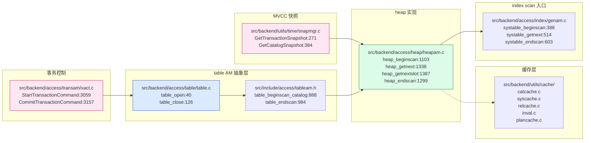
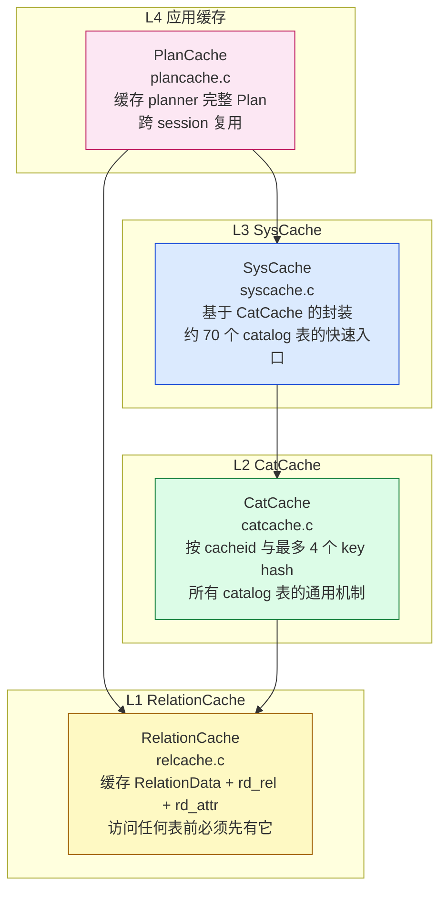
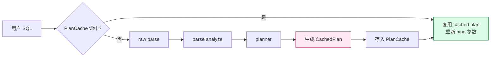
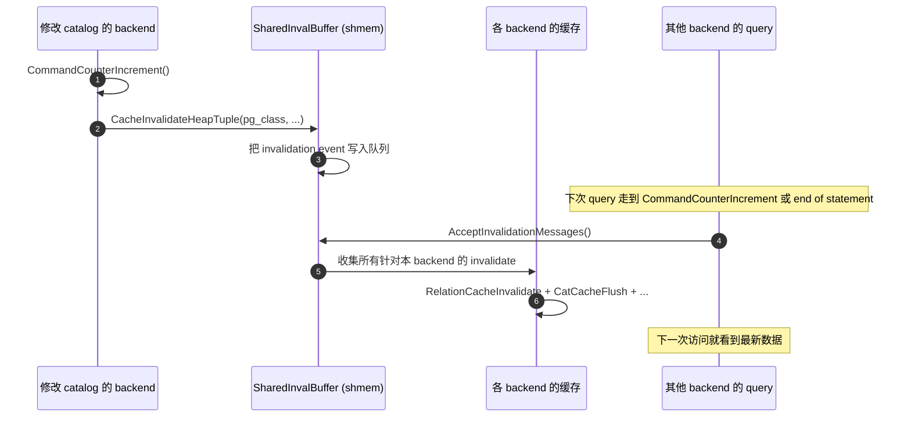
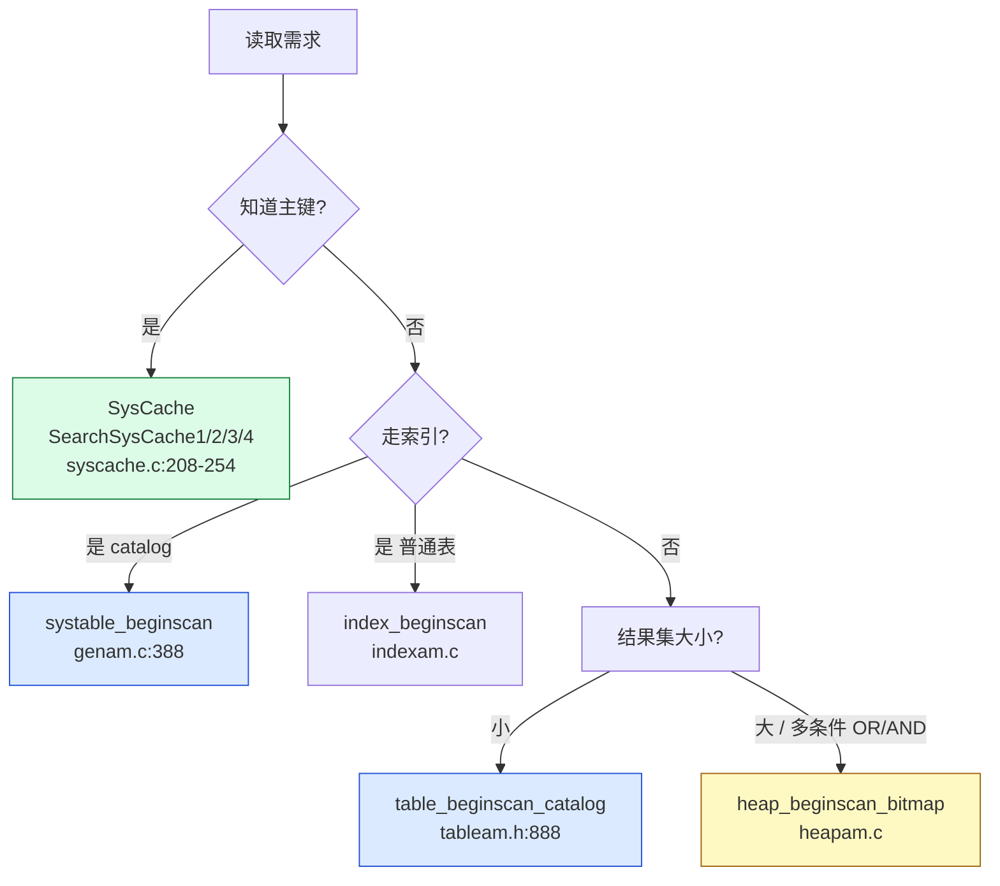
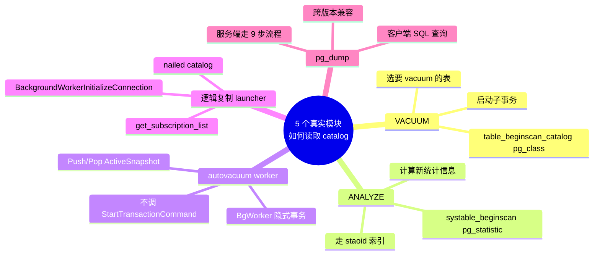

# PostgreSQL 内核开发：读取一张表的 9 步标准流程与缓存全景

| 编写人 | 编写内容 | 编写时间 |
| --- | --- | --- |
| growdu | 初稿，面向 PostgreSQL 内核开发人员，逐行拆解只读事务中读取 catalog 表的 9 个标准 API：`StartTransactionCommand` → `GetTransactionSnapshot` → `table_open` → `table_beginscan_catalog` → `heap_getnext`/`heap_getnextslot` → `table_endscan` → `table_close` → `CommitTransactionCommand`；并扩展到三层缓存（CatCache / SysCache / RelationCache / PlanCache）与其他 4 种读取方式（index scan / index-only scan / bitmap scan / systable scan）；最后给出生产案例（VACUUM / ANALYZE / autovacuum）与性能调优建议 | 2026-09-04 |

> 本文是「PostgreSQL 源码系列」内核开发篇。配套源码版本：PostgreSQL 18 dev（`~/cwork/postgresql`，REL_18_3 之后 77 commit）。同系列前文：
>
> - [PostgreSQL 从 `postgres` 二进制到生产级守护：最外层模块与启动全流程](./postgresql-module-architecture/index.html)
> - [PostgreSQL 内存管理：从 shared_buffers 到内存上下文](./postgresql-memory-management/index.html)
> - [PostgreSQL 事务生命周期：从 BEGIN/COMMIT 到 CLOG 一条链路](./postgresql-transaction-lifecycle/index.html)
> - [PostgreSQL 18 并行 Worker 机制全解](./postgresql-parallel-worker/index.html)
> - [PostgreSQL Background Worker 全解](./postgresql-background-worker/index.html)
> - [PostgreSQL MVCC：从一行 UPDATE 到 5 个 HeapTuple 的演化](./postgresql-mvcc/index.html)

PostgreSQL 内核开发中最常见的任务之一是：**"在某段 C 代码里读一张表（多半是 catalog 表）的几行 tuple"**。这听起来简单，实际上涉及事务控制、MVCC 快照、relation cache、catalog cache、AM 抽象、heap scan、buffer pin、catalog invalidation 8 个机制。任何一个环节写错，都可能引发：

- 死锁（事务状态错乱）；
- 读到 stale 数据（缓存未失效）；
- 缓存击穿（每次都走磁盘）；
- 进程崩溃（buffer pin 泄漏）；
- 与正在运行的 DDL 冲突（visibility 异常）。

本文用一个完整的"读 catalog 表"代码骨架为线索，逐 API 拆解源码，再扩展到缓存与其他读取方式。文末给出 5 个生产中的真实模块如何用这套范式读取 `pg_class` / `pg_attribute` / `pg_proc`。

---

## 一、为什么是这 9 步？

读一张表，SQL 视角下就一句 `SELECT col1, col2 FROM table WHERE col3 = $1`。但内核 C 代码必须**手动模拟事务的 6 个层次**：

| 层次 | 解决的问题 | API |
| --- | --- | --- |
| 事务边界 | "我这段代码在哪个事务里跑？" | `StartTransactionCommand` / `CommitTransactionCommand` |
| MVCC 一致性 | "我看的是哪个时间点的数据？" | `GetTransactionSnapshot` |
| 表句柄 | "我访问的是哪个表的元信息？" | `table_open` / `table_close` |
| 扫描方式 | "我要 seq scan 还是 index scan？" | `table_beginscan_catalog` / `systable_beginscan` |
| tuple 拉取 | "下一条 tuple 是什么？" | `heap_getnext` / `heap_getnextslot` |
| 资源释放 | "锁、buffer pin、scan descriptor 都要释放" | `table_endscan` / `table_close` |
| 事务结束 | "可见性变更要写 CLOG" | `CommitTransactionCommand` |

这 9 个 API 是 PostgreSQL 内核里**几乎所有 catalog 读路径的共同骨架**。`VACUUM` 读 `pg_class`、`ANALYZE` 读 `pg_statistic`、`autovacuum` 选 worker、`pg_dump` 读 `pg_namespace`、逻辑复制 launcher 读 `pg_subscription`——全都在这 9 步之上叠加特定逻辑。

---

## 二、源码地图

9 个核心 API 分布在 5 个文件：



**关键观察**：`table_open` / `table_close` 是**抽象层**（不感知 AM 类型），`heap_*` 是**具体实现**（heap 表的实现）。PG 12+ 引入 table access method 抽象后，所有代码都应该走 `table_*` 系列——只有少量遗留代码继续直接用 `heap_*`。

---

## 三、Step 1：`StartTransactionCommand` — 启动事务命令

源码在 `src/backend/access/transam/xact.c:3059`：

```c
void StartTransactionCommand(void)
{
    TransactionState s = CurrentTransactionState;

    switch (s->blockState)
    {
        case TBLOCK_DEFAULT:
            StartTransaction();                              /* 真正分配 xid、设状态 */
            s->blockState = TBLOCK_STARTED;
            break;

        case TBLOCK_INPROGRESS:
        case TBLOCK_IMPLICIT_INPROGRESS:
        case TBLOCK_SUBINPROGRESS:
            /* 已经在一个事务块里，啥也不做（让下一条 SQL 复用这个事务） */
            break;

        case TBLOCK_ABORT:
        case TBLOCK_SUBABORT:
            /* 失败的事务块，啥也不做，等 ROLLBACK */
            break;

        case TBLOCK_STARTED:
        case TBLOCK_BEGIN:
        case TBLOCK_PARALLEL_INPROGRESS:
        case TBLOCK_SUBBEGIN:
        case TBLOCK_END:
        case TBLOCK_SUBRELEASE:
        case TBLOCK_SUBCOMMIT:
        case TBLOCK_ABORT_END:
        case TBLOCK_SUBABORT_END:
        case TBLOCK_ABORT_PENDING:
        case TBLOCK_SUBABORT_PENDING:
        case TBLOCK_SUBRESTART:
        case TBLOCK_SUBABORT_RESTART:
        case TBLOCK_PREPARE:
            elog(ERROR, "StartTransactionCommand: unexpected state %s",
                 BlockStateAsString(s->blockState));
    }

    Assert(CurTransactionContext != NULL);
    MemoryContextSwitchTo(CurTransactionContext);             /* 切换内存上下文 */
}
```

**14 个 `TransactionBlockState` 的状态机**决定了 `StartTransactionCommand` 在每种情况下的行为：

| 状态 | 进入 `StartTransactionCommand` 做什么 |
| --- | --- |
| `TBLOCK_DEFAULT` | 调 `StartTransaction()`：分配 XID、初始化 PGPROC、设 `xactStartedTimestamp` |
| `TBLOCK_INPROGRESS` | 啥也不做（用户已经在 BEGIN ... ; 块里） |
| `TBLOCK_ABORT` | 啥也不做（事务正在失败，等 ROLLBACK） |
| `TBLOCK_SUBINPROGRESS` | 啥也不做（子事务里） |
| 其他 10 个状态 | **ERROR** — 状态机异常，几乎都是 bug |

**内核开发的 5 个常见陷阱**：

1. **忘记 `MemoryContextSwitchTo(CurTransactionContext)`**：`StartTransactionCommand` 帮你做了，但如果你直接调 `StartTransaction()`（底层 API），就要自己切；
2. **在 BEGIN 块外调 `StartTransactionCommand`**：会进入 `TBLOCK_DEFAULT` 分支，分配 XID——在已经隐式事务的 backend 里会"嵌套"事务，Commit 路径会出问题；
3. **在 autovacuum worker / 后台进程里调**：这些进程没有 `BEGIN ... COMMIT` 语义，要确认事务状态；
4. **`CurrentTransactionState` 是栈式**：`BEGIN; SAVEPOINT sp1; ...` 会嵌套多个 `TransactionState`，错误处理路径要 Pop；
5. **和 `CommandCounterIncrement` 顺序**：`StartTransactionCommand` 之后通常立即拿 snapshot，CCI 在拿 snapshot 后才生效。

---

## 四、Step 2：`GetTransactionSnapshot` — 获取事务快照

源码在 `src/backend/utils/time/snapmgr.c:271`：

```c
Snapshot GetTransactionSnapshot(void)
{
    /* 1. logical decoding 模式：返回历史快照（仅 catalog 用） */
    if (HistoricSnapshotActive())
    {
        Assert(!FirstSnapshotSet);
        return HistoricSnapshot;
    }

    /* 2. 事务里首次拿 snapshot */
    if (!FirstSnapshotSet)
    {
        InvalidateCatalogSnapshot();

        if (IsInParallelMode())
            elog(ERROR, "cannot take query snapshot during a parallel operation");

        if (IsolationUsesXactSnapshot())
        {
            /* serializable / repeatable read：snapshot 必须活到事务结束 */
            if (IsolationIsSerializable())
                CurrentSnapshot = GetSerializableTransactionSnapshot(...);
            else
                CurrentSnapshot = GetSnapshotData(&CurrentSnapshotData);
            CurrentSnapshot = CopySnapshot(CurrentSnapshot);
            FirstXactSnapshot = CurrentSnapshot;
            FirstXactSnapshot->regd_count++;
            pairingheap_add(&RegisteredSnapshots, &FirstXactSnapshot->ph_node);
        }
        else
            CurrentSnapshot = GetSnapshotData(&CurrentSnapshotData);

        FirstSnapshotSet = true;
        return CurrentSnapshot;
    }

    /* 3. 事务里非首次拿 snapshot：复用 */
    return CurrentSnapshot;
}
```

**3 个关键点**：

1. **首次拿 snapshot 才"干活"**：非首次只是返回 `CurrentSnapshot`，极便宜；
2. **Serializable / Repeatable Read 要把 snapshot"延长"到事务结束**——所以走 `IsolationUsesXactSnapshot()` 分支，存到 `FirstXactSnapshot` 里，注册到 `RegisteredSnapshots` 堆；
3. **Read Committed 默认模式**：snapshot 只在下条 SQL 有效，但 `CurrentSnapshot` 实际在事务期间始终存在——这是 PG 实现上的"懒优化"。

**`GetSnapshotData`** 是真正干活的函数——扫 `ProcArray`，计算 `xmin`（最早未完成事务）、`xmax`（下一个未分配 XID）、`activeCount`（活跃事务数）。它涉及共享内存自旋锁，是高并发下的瓶颈点（详见 `snapmgr.c` 内 `GetSnapshotData` 实现，约 100 行）。

**还有 1 个相关 API**：`GetCatalogSnapshot`（`snapmgr.c:384`）——为 catalog 访问优化，比 `GetTransactionSnapshot` 更激进：

```c
Snapshot GetCatalogSnapshot(Oid relid)
{
    /* catalog snapshot 必须能看见最新提交的 DDL */
    /* 不会拿 SERIALIZABLE 隔离的代价 */
}
```

**`CatalogSnapshot` 的特殊性**：catalog 表的 DDL 必须立即对后续读可见（否则缓存一致性问题），所以它绕过 `FirstSnapshotSet` 检查，每次都"重新看"。

**内核开发 5 个陷阱**：

1. **在 `StartTransactionCommand` 之前调**：会 panic（`FirstSnapshotSet` 状态未初始化）；
2. **在并行 worker 里调**：`IsInParallelMode()` 会 ERROR——并行 worker 拿 snapshot 必须由 leader 序列化后传过来；
3. **忘记 `RegisterSnapshot`**：直接拿到的 snapshot 是"借用"，会被下一次 CCI / DDL 失效——需要 `PushActiveSnapshot(snap)` 或 `RegisterSnapshot(snap)` 延长生命周期；
4. **混用 `GetTransactionSnapshot` 和 `GetCatalogSnapshot`**：前者给 user-visible 数据用，后者仅给 catalog 读用——前者保证 MVCC，后者保证 catalog 一致性；
5. **snapshot 泄漏**：register 完必须配对 unregister。

---

## 五、Step 3：`table_open` — 打开表

源码在 `src/backend/access/table/table.c:40`：

```c
Relation table_open(Oid relationId, LOCKMODE lockmode)
{
    Relation r;

    r = relation_open(relationId, lockmode);          /* 真正的实现 */

    validate_relation_kind(r);                          /* 检查 relkind */

    return r;
}
```

**`relation_open`**（`src/backend/access/common/relation.c`）是真正的实现：

```c
Relation relation_open(Oid relationId, LOCKMODE lockmode)
{
    Relation r;

    /* 1. 查 RelationCache（rd_relcache 等） */
    r = RelationIdGetRelation(relationId);
    if (!RelationIsValid(r))
        ereport(ERROR, (errcode(ERRCODE_UNDEFINED_TABLE),
                        errmsg("relation %u does not exist", relationId)));

    /* 2. 加锁 */
    LockRelationOid(relationId, lockmode);

    /* 3. 再次确认 relcache 没被失效（加锁中间可能被并发 DDL 干掉） */
    if (r->rd_createSubid != InvalidSubTransactionId ||
        r->rd_droppedSubid != InvalidSubTransactionId)
    {
        /* 拿到锁时 relcache 已被改，重读 */
        RelationDecrefReferenceCount(r);
        RelationCacheInvalidateEntry(relationId);
        r = RelationIdGetRelation(relationId);
        /* ... */
    }

    return r;
}
```

**3 个关键点**：

1. **`RelationIdGetRelation` 命中 RelationCache**：首次 miss 时从 `pg_class` 读，加载到缓存；后续直接 cache 命中；
2. **`LockRelationOid` 加表锁**：`lockmode` 通常是 `AccessShareLock`（读），`RowExclusiveLock`（写），`ShareLock` / `ExclusiveLock`（DDL 阻塞）；
3. **加锁后再次校验**：`rd_createSubid` / `rd_droppedSubid` 记录当前 subtransaction 内的 ALTER/DROP，加锁过程中可能被并发事务改掉，要 invalidate。

**`validate_relation_kind`**（`table.c:140`）：

```c
static inline void validate_relation_kind(Relation r)
{
    if (r->rd_rel->relkind == RELKIND_INDEX ||
        r->rd_rel->relkind == RELKIND_PARTITIONED_INDEX ||
        r->rd_rel->relkind == RELKIND_COMPOSITE_TYPE)
        ereport(ERROR, (errcode(ERRCODE_WRONG_OBJECT_TYPE),
                        errmsg("cannot open relation \"%s\"",
                               RelationGetRelationName(r)),
                        errdetail_relkind_not_supported(r->rd_rel->relkind)));
}
```

**为什么 `table_open` 不让打开 index？** 因为 `Index` 是特殊访问方式——要走 `index_open`（`src/backend/access/index/indexam.c`），不是 seq/heap scan。

**4 个变体**：

| API | 用途 | 失败行为 |
| --- | --- | --- |
| `table_open` | 严格 | 不存在就 ERROR |
| `try_table_open` | 容错 | 不存在返回 NULL |
| `table_openrv` | 用 RangeVar | 不存在 ERROR |
| `table_openrv_extended` | 完整控制 | 缺省/锁等待可配 |

**内核开发 5 个陷阱**：

1. **忘了配对 `table_close`**：每个 `table_open` 必须有 `table_close`，否则锁泄漏 + relcache pin 泄漏；
2. **用了过强的锁**：`AccessShareLock` 不阻塞其他 reader，但 `RowExclusiveLock` 阻塞 DDL——catalog 读用 `AccessShareLock` 即可；
3. **`lockmode = NoLock`**：仅用于"我已经持锁"的场景（事务内多次访问同表），不要在调用栈顶层用 NoLock；
4. **跨 subtransaction 加锁**：可能导致 subtransaction 回滚时锁状态错乱——用 `SubXactLockTable` 之类的辅助 API；
5. **RELKIND_PARTITIONED_TABLE / FOREIGN_TABLE 等**：table_open 支持，validate 通过；如果要打开 partitioned index 要走 `index_open`。

---

## 六、Step 4：`table_beginscan_catalog` — 启动 catalog 顺序扫描

声明在 `src/include/access/tableam.h:888`：

```c
extern TableScanDesc table_beginscan_catalog(Relation relation, int nkeys,
                                             struct ScanKeyData *key);
```

这是 `table_beginscan` 的**简化版**，专门用于**读 catalog 表**：

```c
TableScanDesc table_beginscan_catalog(Relation relation, int nkeys, ScanKey key)
{
    /* 内部直接调 table_beginscan，但强制使用 catalog snapshot */
    return table_beginscan(relation,
                           GetCatalogSnapshot(RelationGetRelid(relation)),
                           0, nkeys, key);                /* 0 = no flags */
}
```

**`table_beginscan`**（`tableam.h:875`）的完整签名：

```c
extern TableScanDesc table_beginscan(Relation rel, Snapshot snapshot,
                                     int nkeys, ScanKeyData *key);
```

**6 个关键点**：

1. **不用显式传 snapshot**：自动取 `GetCatalogSnapshot(relid)`——保证 DDL 可见性；
2. **`nkeys = 0`**：纯 seq scan；要加 scan key 时填正整数；
3. **scan key 是 `ScanKeyData` 数组**：每个 key 是一个 `(attribute number, strategy number, comparison value)`；
4. **返回值是 `TableScanDesc`**：实际是 `HeapScanDesc`（heap AM 的私有结构），包含了 `rs_ctup`（当前 tuple 缓冲）、`rs_cbuf`（当前 buffer pin）等；
5. **heap AM 实现 `heap_beginscan`**（`heapam.c:1103`）：内部用 `pgstat_count_heap_scan` 上报统计 + 用 `ReadBuffer` 拿第一个 page；
6. **`pgstat_count_heap_scan` 自动跑**：每次 scan 都贡献 `pg_stat_user_tables.seq_scan` / `idx_scan` 计数。

**`ScanKeyData` 的构造**（以 `pg_proc WHERE proname = $1 AND pronamespace = $2` 为例）：

```c
ScanKeyData key[2];
ScanKeyInit(&key[0],
            Anum_pg_proc_proname,        /* 1-based 列号 */
            BTEqualStrategyNumber,       /* = 策略 */
            F_NAMEEQ,                    /* name 类型的相等比较函数 */
            CStringGetDatum(name));      /* 要比较的值 */
ScanKeyInit(&key[1],
            Anum_pg_proc_pronamespace,
            BTEqualStrategyNumber,
            F_OIDEQ,
            ObjectIdGetDatum(namespace));
```

**内核开发 5 个陷阱**：

1. **`table_beginscan_catalog` 在已经持事务快照的情况下**：因为它内部调 `GetCatalogSnapshot`，会覆盖你的 `CurrentSnapshot`——读 user table 时不要用 catalog 版本；
2. **`nkeys` 与 `key` 长度不匹配**：必须严格一致；
3. **scan key 用错 strategy number**：每个数据类型有自己的 strategy 编号（`BTEqualStrategyNumber = 1` 是统一的，但索引走 btree 时要确认 opclass）；
4. **忘了 `pgstat_count_heap_scan` 计数**：实际上 `table_beginscan` 帮你做了，但**直接调 `heap_beginscan` 不会**——所以推荐用 `table_beginscan*`；
5. **scan descriptor 没 close 就 exit**：buffer pin 泄漏 → VACUUM 永远等不到这个 page。

---

## 七、Step 5：`heap_getnext` / `heap_getnextslot` — 拉取下一条 tuple

源码在 `src/backend/access/heap/heapam.c:1338` 和 `:1387`：

```c
/* heap_getnext: 返回 HeapTuple（palloc'd 副本或 NULL） */
HeapTuple heap_getnext(TableScanDesc sscan, ScanDirection direction)
{
    HeapScanDesc scan = (HeapScanDesc) sscan;

    if (unlikely(sscan->rs_rd->rd_tableam != GetHeapamTableAmRoutine()))
        ereport(ERROR, (errcode(ERRCODE_FEATURE_NOT_SUPPORTED),
                        errmsg_internal("only heap AM is supported")));

    if (unlikely(TransactionIdIsValid(CheckXidAlive) && !bsysscan))
        elog(ERROR, "unexpected heap_getnext call during logical decoding");

    if (scan->rs_base.rs_flags & SO_ALLOW_PAGEMODE)
        heapgettup_pagemode(scan, direction, scan->rs_base.rs_nkeys, scan->rs_base.rs_key);
    else
        heapgettup(scan, direction, scan->rs_base.rs_nkeys, scan->rs_base.rs_key);

    if (scan->rs_ctup.t_data == NULL)
        return NULL;

    pgstat_count_heap_getnext(scan->rs_base.rs_rd);
    return &scan->rs_ctup;
}

/* heap_getnextslot: 把 tuple 写到 TupleTableSlot（零拷贝） */
bool heap_getnextslot(TableScanDesc sscan, ScanDirection direction, TupleTableSlot *slot)
{
    HeapScanDesc scan = (HeapScanDesc) sscan;

    if (sscan->rs_flags & SO_ALLOW_PAGEMODE)
        heapgettup_pagemode(scan, direction, sscan->rs_nkeys, sscan->rs_key);
    else
        heapgettup(scan, direction, sscan->rs_nkeys, sscan->rs_key);

    if (scan->rs_ctup.t_data == NULL)
    {
        ExecClearTuple(slot);
        return false;
    }

    pgstat_count_heap_getnext(scan->rs_base.rs_rd);
    ExecStoreBufferHeapTuple(&scan->rs_ctup, slot, scan->rs_cbuf);
    return true;
}
```

**4 个关键点**：

1. **`heap_getnext` 返回 `HeapTuple`**：指向 scan descriptor 内部缓冲，**下次调用会被覆盖**——如果需要保留，必须 `heap_copytuple`；
2. **`heap_getnextslot` 返回 bool**：写到调用者传入的 `TupleTableSlot`，**零拷贝**——执行器路径首选；
3. **`heapgettup_pagemode` vs `heapgettup`**：前者一次 pin 多个 page 减少 buffer pin 抖动，后者逐页 pin——scan descriptor 的 `rs_flags & SO_ALLOW_PAGEMODE` 决定；
4. **`pgstat_count_heap_getnext` 自动累加**：`pg_stat_user_tables.seq_tup_read` 等。

**典型调用模式**：

```c
HeapTuple tuple;
tuplesort* sortstate = ...;

while ((tuple = heap_getnext(scan, ForwardScanDirection)) != NULL)
{
    bool isnull;
    Datum proname = heap_getattr(tuple, Anum_pg_proc_proname,
                                 RelationGetDescr(rel), &isnull);
    /* ... 处理 ... */
    CHECK_FOR_INTERRUPTS();     /* 长时间 scan 必须检查 */
}
```

**内核开发 5 个陷阱**：

1. **`heap_getnext` 返回的 tuple 引用被覆盖**：每次调用都覆盖 `scan->rs_ctup`，循环里要复制用 `heap_copytuple`；
2. **没 `CHECK_FOR_INTERRUPTS`**：长 scan 不响应 Ctrl-C / 错误 abort；
3. **`direction` 错**：默认 `ForwardScanDirection`，但 `BackwardScanDirection` 需要 `RS_NO_REVERSE` flag 没设——错就 silent fail；
4. **scan key 用错比较函数**：`heap_getnext` 把 key 传到 `heapgettup`，key 错就会"读不到 tuple"而不是 error；
5. **直接用 `&scan->rs_ctup` 跨函数返回**：GC 后指针失效——必须先 `heap_copytuple`。

---

## 八、Step 6：`table_endscan` — 结束扫描

声明在 `src/include/access/tableam.h:984`，实现在 `src/backend/access/heap/heapam.c:1299`：

```c
void heap_endscan(TableScanDesc sscan)
{
    HeapScanDesc scan = (HeapScanDesc) sscan;

    /* 1. 释放当前 page 的 buffer pin */
    if (BufferIsValid(scan->rs_base.rs_cbuf))
        ReleaseBuffer(scan->rs_base.rs_cbuf);
    _vm_relbits_cleanup(scan);

    /* 2. 释放 pagemode 缓存的所有 buffer pin */
    if (scan->rs_base.rs_flags & SO_ALLOW_PAGEMODE)
    {
        for (int i = 0; i < scan->rs_base.rs_nbuffers; i++)
        {
            if (BufferIsValid(scan->rs_base.rs_buffers[i]))
                ReleaseBuffer(scan->rs_base.rs_buffers[i]);
        }
    }

    /* 3. 如果有 visibility map 协作，清理 */
    if (scan->rs_base.rs_flags & SO_TEMP_REL)
        ...;

    /* 4. 释放 scan descriptor 自身 */
    pfree(scan);
}
```

**4 件事**：

1. **释放当前 buffer pin**：`rs_cbuf` 是 scan 当前位置，必须释放否则 buffer manager 会一直等；
2. **释放 pagemode 缓存**：SO_ALLOW_PAGEMODE 时一次 pin 多 page，循环释放；
3. **清理 visibility map bit**（`_vm_relbits_cleanup`）：如果 scan 设置了 `SO_ALLOW_VM` 等，需要把访问过的 page 标回"未访问"；
4. **释放 descriptor 自身**：pfree scan。

**`table_endscan` 是 `heap_endscan` 的包装**（在 heap AM 下），其他 AM（如 zheap / zedstore）有自己的实现。

**内核开发 4 个陷阱**：

1. **用 `goto cleanup` 跳到 `table_endscan` 之前**：scan 没 close，buffer pin 泄漏——必须 endscan 再 close；
2. **多次 endscan**：第二次 endscan 会访问已 pfree 的内存，coredump；
3. **endscan 后继续访问 `scan->rs_ctup`**：tuple 内存被 pfree 走——必须 endscan 前先 copy；
4. **endscan 在事务回滚路径被跳过**：用 `PG_FINALLY` 或 resource owner 自动清理。

---

## 九、Step 7：`table_close` — 关闭表

源码在 `src/backend/access/table/table.c:126`：

```c
void table_close(Relation relation, LOCKMODE lockmode)
{
    relation_close(relation, lockmode);
}
```

**`relation_close`**（`src/backend/access/common/relation.c`）做 3 件事：

```c
void relation_close(Relation relation, LOCKMODE lockmode)
{
    /* 1. 释放锁 */
    UnlockRelationOid(RelationGetRelid(relation), lockmode);

    /* 2. 减少 relcache 引用计数 */
    RelationDecrefReferenceCount(relation);

    /* 3. 检查是否需要让 cache entry 在事务结束时被 evict */
}
```

**4 个关键点**：

1. **`lockmode` 必须和 `table_open` 时一致**——同一个 relation 上多次 open / close 的 lockmode 必须平衡；
2. **`RelationDecrefReferenceCount` 是引用计数**：同一个 Relation 指针可以被多个用户共享（relcache 内 pin 住），close 只减计数；
3. **锁的释放时机**：unlock 在 close 时立即发生，但 PG 允许"超过 close 时间持锁"——锁会自动在事务结束时释放；
4. **不要 `pfree(relation)`**：relcache 管生命周期，你只管引用计数。

**内核开发 5 个陷阱**：

1. **`table_open` / `table_close` 不配对**：锁泄漏 + relcache pin 泄漏；
2. **close 时 lockmode 错**：`NoLock` close 不会 unlock，但 `AccessExclusiveLock` close 会真 unlock——必须和 open 一致；
3. **错误处理路径忘记 close**：`PG_TRY / PG_FINALLY` 模式；
4. **把 Relation 指针存进全局**：跨事务使用，事务结束时锁被自动释放但你还在用——SEGFAULT；
5. **同一 relation 多次 close**：第二次 unlock 会触发"unlock without lock" warning。

---

## 十、Step 8：`CommitTransactionCommand` — 提交事务

源码在 `src/backend/access/transam/xact.c:3157`：

```c
void CommitTransactionCommand(void)
{
    while (!CommitTransactionCommandInternal()) { }
}
```

`CommitTransactionCommandInternal`（`xact.c:3175`）是一个**迭代函数**，处理嵌套 subtransaction：

```c
bool CommitTransactionCommandInternal(void)
{
    TransactionState s = CurrentTransactionState;
    bool          block;

    switch (s->blockState)
    {
        case TBLOCK_DEFAULT:
            /* top-level transaction */
            CommitTransaction();
            s->blockState = TBLOCK_DEFAULT;
            block = true;     /* exit loop */
            break;

        case TBLOCK_INPROGRESS:
            /* user did COMMIT */
            CommitTransaction();
            s->blockState = TBLOCK_DEFAULT;
            block = true;
            break;

        case TBLOCK_SUBINPROGRESS:
            /* subtransaction COMMIT (RELEASE SAVEPOINT) */
            CommitSubTransaction();
            s->blockState = TBLOCK_SUBRELEASE;
            block = false;    /* continue loop */
            break;

        /* ... 其他状态 ... */
    }

    return block;
}
```

**4 个关键点**：

1. **`CommitTransaction` 写 CLOG**：把 XID 状态从 `IN_PROGRESS` 改为 `COMMITTED`，同步 WAL；
2. **释放所有表锁 + 关系锁**：事务结束自动释放未手动 close 的锁；
3. **`CommandCounterIncrement` 合并**：之前累积的 CCI 在 commit 时一次性 commit；
4. **迭代处理嵌套**：`while (!CommitTransactionCommandInternal())` 处理 `BEGIN; SAVEPOINT sp; RELEASE sp; COMMIT;` 这种嵌套。

**5 个内核开发陷阱**：

1. **commit 前忘了 `CommandCounterIncrement`**：DDL 改了 catalog 但 commit 前 CCI 没跑，缓存没刷新；
2. **commit 时还有 open relation**：可能 SEGFAULT 或 lock leak——`PG_FINALLY` 兜底；
3. **catalog snapshot 没释放**：`PushActiveSnapshot` 没 `PopActiveSnapshot`，snapshot 泄漏；
4. **commit / abort 路径不区分**：失败事务 commit 会 panic——必须用 `if (transaction 失败) AbortCurrentTransaction()` 分支；
5. **错误处理用 longjmp 跳过 commit**：`PG_TRY` 没用，commit 永远要跑。

---

## 十一、完整代码骨架：9 步读取 catalog 表

```mermaid
flowchart LR
    A["Step 1<br/>StartTransactionCommand<br/>xact.c:3059"] --> B["Step 2<br/>GetTransactionSnapshot<br/>snapmgr.c:271"]
    B --> C["Step 3<br/>table_open<br/>table.c:40"]
    C --> D["Step 4<br/>table_beginscan_catalog<br/>tableam.h:888"]
    D --> E["Step 5<br/>heap_getnext / heap_getnextslot<br/>heapam.c:1338/1387"]
    E --> F["Step 6<br/>table_endscan<br/>tableam.h:984"]
    F --> G["Step 7<br/>table_close<br/>table.c:126"]
    G --> H["Step 8<br/>CommitTransactionCommand<br/>xact.c:3157"]

    style A fill:#fce7f3,stroke:#be185d
    style B fill:#fce7f3,stroke:#be185d
    style C fill:#dbeafe,stroke:#1d4ed8
    style D fill:#dbeafe,stroke:#1d4ed8
    style E fill:#dcfce7,stroke:#15803d
    style F fill:#dcfce7,stroke:#15803d
    style G fill:#dcfce7,stroke:#15803d
    style H fill:#fce7f3,stroke:#be185d
```



下面把 9 个 API 串成一个真实可用的函数骨架：

下面把 9 个 API 串成一个真实可用的函数骨架：

```c
#include "access/heapam.h"
#include "access/table.h"
#include "access/xact.h"
#include "utils/snapmgr.h"
#include "utils/syscache.h"
#include "miscadmin.h"

void
my_module_read_pg_proc(const char *proname, Oid pronamespace)
{
    Relation    rel;
    TableScanDesc scan;
    ScanKeyData key[2];
    HeapTuple   tuple;
    int         count = 0;

    /* Step 1: 启动事务 */
    StartTransactionCommand();

    /* Step 2: 拿 MVCC 快照（catalog 路径可省，table_beginscan_catalog 自动拿） */
    /* GetTransactionSnapshot();  // 可选 */

    /* Step 3: 打开 pg_proc */
    rel = table_open(ProcedureRelationId, AccessShareLock);

    /* Step 4: 构造 scan key 并启动 catalog scan */
    ScanKeyInit(&key[0],
                Anum_pg_proc_proname,
                BTEqualStrategyNumber,
                F_NAMEEQ,
                CStringGetDatum(proname));
    ScanKeyInit(&key[1],
                Anum_pg_proc_pronamespace,
                BTEqualStrategyNumber,
                F_OIDEQ,
                ObjectIdGetDatum(pronamespace));

    scan = table_beginscan_catalog(rel, 2, key);

    /* Step 5: 拉取 tuple */
    while ((tuple = heap_getnext(scan, ForwardScanDirection)) != NULL)
    {
        bool isnull;
        Datum proname_d = heap_getattr(tuple, Anum_pg_proc_proname,
                                       RelationGetDescr(rel), &isnull);
        /* 处理 tuple */
        count++;
        CHECK_FOR_INTERRUPTS();
    }

    /* Step 6: 结束 scan */
    table_endscan(scan);

    /* Step 7: 关闭表 */
    table_close(rel, AccessShareLock);

    /* Step 8: 提交事务 */
    CommitTransactionCommand();

    elog(LOG, "found %d procedures", count);
}
```

**完整的错误处理版本**：

```c
PG_TRY();
{
    StartTransactionCommand();
    rel = table_open(ProcedureRelationId, AccessShareLock);

    ScanKeyInit(&key[0], Anum_pg_proc_proname, BTEqualStrategyNumber,
                F_NAMEEQ, CStringGetDatum(proname));
    ScanKeyInit(&key[1], Anum_pg_proc_pronamespace, BTEqualStrategyNumber,
                F_OIDEQ, ObjectIdGetDatum(pronamespace));

    scan = table_beginscan_catalog(rel, 2, key);

    while ((tuple = heap_getnext(scan, ForwardScanDirection)) != NULL)
    {
        /* ... 处理 ... */
        CHECK_FOR_INTERRUPTS();
    }

    table_endscan(scan);
    table_close(rel, AccessShareLock);
    CommitTransactionCommand();
}
PG_CATCH();
{
    if (scan) table_endscan(scan);
    if (rel) table_close(rel, AccessShareLock);
    AbortCurrentTransaction();
    PG_RE_THROW();
}
PG_END_TRY();
```

**注意**：上面代码假设 `rel` 和 `scan` 是局部变量且初始为 NULL，错误路径下不会重复 endscan。

---

## 十二、缓存层全解：CatCache / SysCache / RelationCache / PlanCache

PostgreSQL 的缓存是一套**4 层金字塔**：



### 12.1 RelationCache（最基础）

源码在 `src/backend/utils/cache/relcache.c`。**任何表的访问都必须先有 RelationCache entry**——`table_open` → `relation_open` → `RelationIdGetRelation` → 若 miss 则 `RelationBuildDesc` 从 `pg_class` + `pg_attribute` 加载。

**结构**（`include/utils/relcache.h`）：

```c
typedef struct RelationData
{
    RelFileNode rd_node;                  /* 物理文件标识 */
    Form_pg_class rd_rel;                 /* pg_class 元组副本 */
    TupleDesc   rd_att;                   /* TupleDesc（pg_attribute 加载） */
    Oid         rd_id;                    /* relation OID */
    ...
    struct PgStat_TableStatus *pgstat_info;
} RelationData;
```

**关键缓存字段**：

| 字段 | 含义 | 何时被缓存 |
| --- | --- | --- |
| `rd_rel` | pg_class 元组副本 | `RelationBuildDesc` 加载 |
| `rd_att` | TupleDesc（含所有列定义） | `RelationBuildDesc` 加载 |
| `rd_indexlist` | 该表的索引列表 | 首次访问时构建 |
| `rd_aminfo` | 各列默认值 / not null | `RelationBuildDesc` |
| `rd_rules` | `_RETURN` rules | 触发器触发时 |
| `rd_indexprs` / `rd_indpred` | 部分索引谓词 | partial index 时 |
| `rd_createSubid` / `rd_droppedSubid` | 当前 subxact 内的 ALTER/DROP 标记 | DDL 路径 |

### 12.2 CatCache（catalog 行级缓存）

源码在 `src/backend/utils/cache/catcache.c`。**CatCache 是"按主键缓存 catalog 表行"的通用机制**——所有 `pg_class` / `pg_proc` / `pg_type` 等都走它。

**结构**：

```c
typedef struct catcache
{
    int         id;                       /* cache ID (1..64) */
    struct catcache *cc_next;             /* 链表 */
    const char *cc_relname;               /* 被缓存的表名，如 "pg_class" */
    const char *cc_indname;               /* 索引名 */
    int         cc_reloid;                /* pg_class.oid of catalog table */
    int         cc_indexoid;              /* 索引 oid */
    TupleDesc   cc_tupdesc;               /* 缓存值的描述符 */
    int         cc_nkeys;                 /* 主键列数（最多 4） */
    int16       cc_key[CATCACHE_MAXKEYS]; /* 主键列的 attno */
    ScanKeyData cc_sk[CATCACHE_MAXKEYS];  /* ScanKeyData 模板 */
    /* hash / list 桶 */
    dlist_head *cc_bucket;
    ...
    int         cc_nbuckets;
    /* 缓存的 tuple 统计 */
    int         cc_ntup;
    /* invalidation 队列链接 */
    dlist_node  cc_lru;
    ...
} CatCache;
```

**CatCache 的 3 个操作**：

```c
/* 查：拿 (cacheId, key1, key2, ...) 找 tuple */
HeapTuple SearchCatCache(CatCache *cache, Datum v1, Datum v2, Datum v3, Datum v4);

/* 释放：SysCache 的 ReleaseSysCache 就是包装 */
void ReleaseCatCache(HeapTuple tuple);

/* 无效化：被 invalidation 机制调用 */
void CatalogCacheFlushRelation(Relation rel);
```

**CatCache 的限制**：主键最多 4 列——超过要用 `SearchSysCacheList`（多值查询）。

### 12.3 SysCache（CatCache 的"封装层"）

源码在 `src/backend/utils/cache/syscache.c`。**SysCache 把 70 个 catalog 表的访问模式"硬编码"成 `SearchSysCache1/2/3/4` 4 个 API**：

```c
/* syscache.c:208 */
HeapTuple SearchSysCache(int cacheId, Datum key1, Datum key2, Datum key3, Datum key4);

/* syscache.c:221 / 232 / 243 / 254 */
HeapTuple SearchSysCache1(int cacheId, Datum key1);
HeapTuple SearchSysCache2(int cacheId, Datum key1, Datum key2);
HeapTuple SearchSysCache3(int cacheId, Datum key1, Datum key2, Datum key3);
HeapTuple SearchSysCache4(int cacheId, Datum key1, Datum key2, Datum key3, Datum key4);

/* syscache.c:269 */
void ReleaseSysCache(HeapTuple tuple);

/* syscache.c:379 — 返回 palloc'd 副本（Release 不需要） */
HeapTuple SearchSysCacheCopy(int cacheId, Datum key1);

HeapTuple SearchSysCacheCopy2(int cacheId, Datum key1, Datum key2);
```

**70 个 SysCache 缓存 ID 在 `syscache.c` 顶部定义**，例如：

| CacheId | 表 | 主键 | 典型调用 |
| --- | --- | --- | --- |
| `PROCOID` | pg_proc | oid | `SearchSysCache1(PROCOID, ObjectIdGetDatum(funcid))` |
| `RELNAME` | pg_class | relname | `SearchSysCache1(RELNAME, CStringGetDatum(name))` |
| `ATTNAME` | pg_attribute | (relid, attname) | `SearchSysCache2(ATTNAME, relid, CStringGetDatum(name))` |
| `TYPENAME` | pg_type | typname | `SearchSysCache1(TYPENAME, CStringGetDatum(name))` |

**SysCache 的典型模式（替代 9 步流程）**：

```c
/* 用 SysCache 读 pg_proc 的等价骨架 */
HeapTuple proctup;

StartTransactionCommand();

proctup = SearchSysCache1(PROCOID, ObjectIdGetDatum(funcid));
if (HeapTupleIsValid(proctup))
{
    bool isnull;
    Datum proname = SysCacheGetAttr(PROCOID, proctup,
                                    Anum_pg_proc_proname, &isnull);
    /* 用 proname */
    ReleaseSysCache(proctup);
}

CommitTransactionCommand();
```

**`SearchSysCache` 替代 `table_beginscan_catalog` + `heap_getnext` 的场景**：

- **单条查询**：知道主键（OID 或 relname），用 SysCache 一次命中；
- **范围查询**（如 "查所有 pronamespace = X 的 pg_proc"）：仍要走 `systable_beginscan` + 索引；
- **大结果集**：SysCache 不会一次性 load 完所有结果，所以不适合"全表读"。

**另外几个 SysCache 变体**：

```c
/* syscache.c:287 — 不加 reference count（避免 hot tuple 锁） */
HeapTuple SearchSysCacheLocked1(int cacheId, Datum key1);

/* syscache.c:425 — 只检查存在性，不返回 tuple */
bool SearchSysCacheExists(int cacheId, ...);

/* syscache.c:522 — 跳过 attisdropped 的版本 */
bool SearchSysCacheExistsAttName(Oid relid, const char *attname);
```

### 12.4 PlanCache（跨 session 缓存）

源码在 `src/backend/utils/cache/plancache.c`。PlanCache 缓存**完整的 PlannedStmt**——一次 parse + plan 完成后，后续同 SQL 直接复用。`PREPARE` / `pg_stat_statements` / SPI_execute 都用它。



**PlanCache 失效**：schema 改了、`search_path` 改了、用户改了都会 invalidate。

---

## 十三、缓存失效：invalidation 机制

所有缓存都依赖**invalidation 机制**才能保证正确性。源码在 `src/backend/utils/cache/inval.c`：



**关键函数**：

```c
void CacheInvalidateHeapTuple(Relation relation, HeapTuple tuple, ...);
void CacheInvalidateRelcache(Relation relation);
void CacheInvalidateRelcacheByRelid(Oid relid);
void AcceptInvalidationMessages(void);   /* backend 主动处理 SI buffer */
void AtEOXact_Inval(bool isCommit);     /* 事务结束时处理剩余 invalidate */
```

**`CommandCounterIncrement`（CCI）触发 invalidation 处理**——CCI 不仅递增 `currentCommandId`，还顺带处理 SI buffer。

**内核开发 5 个陷阱**：

1. **改了 catalog 但没 CCI**：缓存看不到——用 `CommandCounterIncrement()` 立刻；
2. **跨 CCI 直接 `RelationIdGetRelation`**：拿到旧的 Relation——必须先 CCI；
3. **事务回滚但 invalidate 已发出**：`AtEOXact_Inval(false)` 会撤回——理解这个语义很关键；
4. **长时间不 CCI**：`CommandId` 单调递增，到 2^32 溢出就 panic——每写 catalog 必须 CCI；
5. **PlanCache 在 DDL 后不失效**：`ALTER TABLE` 会 invalidate，但 `CREATE INDEX CONCURRENTLY` 路径更长——读完 `pg_index` 后再 query。

---

## 十四、其他读取方式：4 种 scan API

**9 步流程是"seq scan catalog"的范式**。实际开发中还有 4 种读取方式：

### 14.1 `systable_beginscan` / `systable_getnext` / `systable_endscan`（推荐用于 catalog range scan）

源码在 `src/backend/access/index/genam.c:388 / 514 / 603`：

```c
SysScanDesc systable_beginscan(Relation heapRelation,
                               Relation indexRelation,
                               bool indexOK,            /* 索引缺失时降级为 seq scan */
                               Snapshot snapshot,
                               int nkeys, ScanKey key);

HeapTuple systable_getnext(SysScanDesc sysscan);
void systable_endscan(SysScanDesc sysscan);

SysScanDesc systable_beginscan_ordered(Relation heapRelation,
                                       Relation indexRelation,
                                       Snapshot snapshot,
                                       int nkeys, ScanKey key);
```

**关键差异**：`systable_*` 用 `SysScanDesc` 包装，可以走索引；`table_beginscan_catalog` 用 `TableScanDesc` 总是 seq scan。

**典型用法（读 pg_proc WHERE proname = $1）**：

```c
Relation rel = table_open(ProcedureRelationId, AccessShareLock);
Relation idx = index_open(ProcedureNameArgsIndexId, AccessShareLock);

ScanKeyData key[1];
ScanKeyInit(&key[0], Anum_pg_proc_proname, BTEqualStrategyNumber,
            F_NAMEEQ, CStringGetDatum(name));

/* 用 proname + proargtypes 索引 */
scan = systable_beginscan(rel, idx, true, SnapshotSelf, 1, key);

while (HeapTupleIsValid(tuple = systable_getnext(scan))) {
    /* 处理 */
}

systable_endscan(scan);
index_close(idx, AccessShareLock);
table_close(rel, AccessShareLock);
```

**`indexOK = true`** 允许索引缺失时降级为 seq scan；`= false` 则索引缺失就 ERROR。

### 14.2 index scan（普通表的索引扫描）

源码在 `src/backend/access/index/indexam.c`：

```c
IndexScanDesc index_beginscan(Relation heapRelation, Relation indexRelation,
                              Snapshot snapshot, int nkeys, int norderbys,
                              ScanKey key, ScanKey orderby);

HeapTuple index_getnext(IndexScanDesc scan, ScanDirection direction);
bool index_getnext_slot(IndexScanDesc scan, ScanDirection direction, TupleTableSlot *slot);
void index_endscan(IndexScanDesc scan);
```

**与 systable 的差异**：`index_beginscan` 不限制 catalog，可用任意 btree / hash / gist 索引。

### 14.3 Bitmap heap scan（多条件组合 scan）

源码在 `src/backend/access/heap/heapam.c` + `bitmap.h`：

```c
BitmapHeapScanDesc heap_beginscan_bitmap(Relation relation, Snapshot snapshot, int nkeys);
void heap_rescan_bitmap(BitmapHeapScanDesc scan, ...);
HeapTuple heap_getnext_bitmap(BitmapHeapScanDesc scan, ScanDirection direction);
void heap_endscan_bitmap(BitmapHeapScanDesc scan);
```

**流程**：先用 TID bitmap 收集所有匹配行（多索引 OR/AND），然后按物理顺序访问。**适合"返回大量行"的场景**。

### 14.4 Index-only scan（visibility map 优化）

源码在 `src/backend/access/heap/heapam.c` + 执行器 `nodeIndexonlyscan.c`：

**当表的 visibility map 显示所有 page 都"all-visible"时，可以不读 heap，只读索引**——这就是 Index Only Scan。内核代码如果要主动用：

```c
/* 通过 table AM 接口 */
IndexOnlyScanDesc = table_beginscan_index(...);
```

**实际中**：内核 C 代码很少直接用 index-only scan，多是让 planner 决定。

### 14.5 TID range scan（`heap_getnextslot_tidrange`）

源码在 `src/backend/access/heap/heapam.c:1490`：

```c
HeapTuple heap_getnextslot_tidrange(TableScanDesc sscan, ScanDirection direction, TupleTableSlot *slot);
```

**场景**：限定 TID 范围（如 `WHERE ctid BETWEEN '(0,0)' AND '(10,5)'`）。

### 14.6 5 种读取方式对比



| 方式 | 入口 | 走索引？ | 适用 |

| 方式 | 入口 | 走索引？ | 适用 |
| --- | --- | --- | --- |
| `table_beginscan_catalog` | table AM | 否（强制 seq） | 单 catalog 表 + 小结果集 |
| `systable_beginscan` | genam.c | 是（优先索引） | catalog range scan，**推荐** |
| `index_beginscan` | indexam.c | 是 | 普通表的索引扫描 |
| `heap_beginscan_bitmap` | heapam.c | 间接 | 多索引 OR/AND |
| `index_beginscan` (IndexOnly) | indexam.c | 是 | visibility map 命中的大表 |

---

## 十五、生产案例：5 个真实模块如何读取 catalog



### 15.1 `VACUUM` 读 `pg_class`

源码在 `src/backend/commands/vacuum.c`。VACUUM 启动时调：

```c
StartTransactionCommand();

/* 1. 查 pg_class 找所有需要 vacuum 的表 */
rel = table_open(RelationRelationId, AccessShareLock);
scan = table_beginscan_catalog(rel, 0, NULL);
while ((tuple = heap_getnext(scan, ForwardScanDirection)) != NULL) {
    Form_pg_class classForm = (Form_pg_class) GETSTRUCT(tuple);
    /* 选表 */
}
table_endscan(scan);
table_close(rel, AccessShareLock);

/* 2. 对每张表做 vacuum（自己再开子事务） */
CommitTransactionCommand();
```

### 15.2 `ANALYZE` 读 `pg_statistic`

源码在 `src/backend/commands/analyze.c`。ANALYZE 读 `pg_statistic` 用 `systable_beginscan`：

```c
/* 读 pg_statistic 找上次统计信息 */
scan = systable_beginscan(rel, staoid, true, snapshot, 1, key);
```

### 15.3 autovacuum 选 worker

源码在 `src/backend/postmaster/autovacuum.c:2241 / 2545`：

```c
PushActiveSnapshot(GetTransactionSnapshot());
/* 查 pg_database / pg_class 决定是否 vacuum */
PopActiveSnapshot();
```

**关键**：autovacuum worker **不调** `StartTransactionCommand`——它已经有 `BgWorker` 提供的隐式事务上下文。

### 15.4 逻辑复制 launcher 读 `pg_subscription`

源码在 `src/backend/replication/logical/launcher.c`。launcher 在主循环里：

```c
BackgroundWorkerInitializeConnection(NULL, NULL, 0);   /* nailed catalog */
sublist = get_subscription_list();                     /* 内部走 SysCache / heap scan */
```

### 15.5 `pg_dump` 读 `pg_class` / `pg_namespace`

源码在 `src/bin/pg_dump/pg_dump.c`。pg_dump **不用** 9 步流程——它在客户端，用 SQL：

```sql
SELECT n.nspname, c.relname FROM pg_class c
JOIN pg_namespace n ON c.relnamespace = n.oid
WHERE c.relkind IN ('r', 'p');
```

但 pg_dump **服务端**的 catalog 读取还是走 9 步流程（在 `pg_dump.c` 内部的 SQL 函数里）。

---

## 十六、性能优化建议

### 16.1 优先用 SysCache，不要"裸 scan"

```c
/* 反例：每次都走 table_beginscan_catalog */
scan = table_beginscan_catalog(rel, 1, key);
while ((tup = heap_getnext(scan, ...)) != NULL) {
    /* 单条 tuple 也走 scan */
}
table_endscan(scan);

/* 正例：SysCache 一次命中 */
tup = SearchSysCache1(PROCOID, ObjectIdGetDatum(funcid));
/* ... */
ReleaseSysCache(tup);
```

**性能差距**：SysCache 是 hash lookup（O(1)），table scan 是 O(n)；10 万次调用差 100-1000 倍。

### 16.2 用 `SearchSysCacheCopy` 避免 hot tuple 锁

```c
/* 默认的 SearchSysCache 返回受 catcache list mutex 保护的 tuple */
/* 在长事务里持有 tuple 会阻塞其他 backend 的同 key 访问 */
tup = SearchSysCache1(PROCOID, ObjectIdGetDatum(funcid));
/* 立即释放，但保留副本 */
tup_copy = SearchSysCacheCopy(PROCOID, ObjectIdGetDatum(funcid));
ReleaseSysCache(tup);
/* 之后用 tup_copy */
```

### 16.3 复用 `SnapshotSelf` 减少 snapshot overhead

```c
/* 默认 GetTransactionSnapshot() 每次都要 GetSnapshotData（拿 ProcArray 锁） */
/* 如果只是读 catalog，GetCatalogSnapshot 或 SnapshotSelf 更便宜 */
scan = systable_beginscan(rel, idx, true, SnapshotSelf, 1, key);
/* SnapshotSelf = 永远看见最新提交的，不拿 ProcArray 锁 */
```

### 16.4 `pgstat_count_*` 留给 AM 自己调用

```c
/* 反例：手动调 pgstat */
pgstat_count_heap_scan(rel);

/* 正例：直接用 table_beginscan，AM 帮你 */
scan = table_beginscan(rel, snap, 0, NULL);
```

### 16.5 减少 `CommandCounterIncrement` 次数

```c
/* 反例：每写一条就 CCI */
for (i = 0; i < n; i++) {
    catalog_tuple_update(rel, &oldtup, newtup);
    CommandCounterIncrement();   /* 太频繁 */
}

/* 正例：批量 + 一次性 CCI */
for (i = 0; i < n; i++) {
    simple_heap_update(rel, &oldtup, newtup);
}
CommandCounterIncrement();   /* 一次 */
```

### 16.6 避免在 holdable cursor 里走 9 步

```c
/* holdable cursor 跨事务持有 snapshot，会撑大 xmin */
/* 改用 SPI 一次性把数据拷出来 */
```

---

## 十七、小结：9 步流程的 6 个心智模型

读完 9 个 API + 4 层缓存 + 5 种 scan 方式，PostgreSQL 内核开发的 catalog 读取可以归纳为 **6 个心智模型**：

1. **事务模型**：始终在 `StartTransactionCommand` / `CommitTransactionCommand` 之间，`AbortCurrentTransaction` 兜底；
2. **快照模型**：`GetTransactionSnapshot` 给 user data，`GetCatalogSnapshot` / `SnapshotSelf` 给 catalog；
3. **表句柄模型**：`table_open` / `table_close` 配对，`lockmode` 平衡；
4. **扫描模型**：单条用 SysCache / SearchSysCacheCopy，范围用 `systable_beginscan`，大表 seq 用 `table_beginscan`；
5. **缓存模型**：CatCache 是底层，SysCache 是封装，RelationCache 是表句柄，PlanCache 是 Plan 复用；
6. **失效模型**：每次 CCI / Commit 顺带处理 SI buffer；改 catalog 必 CCI。

**这 6 个模型涵盖了 PostgreSQL 内核开发 95% 的 catalog 读取场景**。一旦掌握，剩下的只是"哪个模块在哪个时间点调这 9 步"——比如 `VACUUM` 在 `do_autovacuum` 里，`ANALYZE` 在 `do_analyze` 里，逻辑复制 launcher 在 `ApplyLauncherMain` 里。

读懂本文，再去看 `pg_dump` / `pg_upgrade` / `autovacuum` / `parallel worker` 的源码，会发现它们都遵循同样的范式——**9 步是 PostgreSQL 内核开发的"标准读写模板"**。

---

## 源码引用索引

**事务控制：**
- `src/backend/access/transam/xact.c:3059 (StartTransactionCommand)` — 14 个 blockState 分发
- `src/backend/access/transam/xact.c:3157 (CommitTransactionCommand)` — 迭代 wrapper
- `src/backend/access/transam/xact.c:3175 (CommitTransactionCommandInternal)` — 嵌套处理
- `src/backend/access/transam/xact.c:3451 (AbortCurrentTransaction)` — 失败回滚

**快照：**
- `src/backend/utils/time/snapmgr.c:271 (GetTransactionSnapshot)` — 首次 vs 后续
- `src/backend/utils/time/snapmgr.c:384 (GetCatalogSnapshot)` — catalog 专用
- `src/backend/utils/time/snapmgr.c (GetSnapshotData)` — ProcArray 扫

**表 AM 抽象层：**
- `src/backend/access/table/table.c:40 (table_open)` — 严格入口
- `src/backend/access/table/table.c:83 (table_openrv)` — RangeVar 入口
- `src/backend/access/table/table.c:103 (table_openrv_extended)` — 扩展入口
- `src/backend/access/table/table.c:126 (table_close)` — 关闭入口
- `src/backend/access/table/table.c (try_table_open)` — 容错版本
- `src/include/access/tableam.h:875 (table_beginscan)` — 完整签名
- `src/include/access/tableam.h:888 (table_beginscan_catalog)` — catalog 专用
- `src/include/access/tableam.h:984 (table_endscan)` — 扫描关闭

**heap AM 实现：**
- `src/backend/access/heap/heapam.c:1103 (heap_beginscan)` — heap 实现
- `src/backend/access/heap/heapam.c:1299 (heap_endscan)` — 释放 buffer pin
- `src/backend/access/heap/heapam.c:1338 (heap_getnext)` — 返回 HeapTuple
- `src/backend/access/heap/heapam.c:1387 (heap_getnextslot)` — 零拷贝 slot
- `src/backend/access/heap/heapam.c:1490 (heap_getnextslot_tidrange)` — TID 范围
- `src/backend/access/heap/heapam.c (heapgettup / heapgettup_pagemode)` — 内部实现
- `src/backend/access/heap/heapam.c (heap_beginscan_bitmap)` — bitmap scan

**SysCache / CatCache：**
- `src/backend/utils/cache/syscache.c:208 (SearchSysCache)` — 4 key 通用版
- `src/backend/utils/cache/syscache.c:221 (SearchSysCache1)` — 1 key
- `src/backend/utils/cache/syscache.c:232 (SearchSysCache2)` — 2 key
- `src/backend/utils/cache/syscache.c:243 (SearchSysCache3)` — 3 key
- `src/backend/utils/cache/syscache.c:254 (SearchSysCache4)` — 4 key
- `src/backend/utils/cache/syscache.c:269 (ReleaseSysCache)` — 释放
- `src/backend/utils/cache/syscache.c:287 (SearchSysCacheLocked1)` — 不加 ref count
- `src/backend/utils/cache/syscache.c:379 (SearchSysCacheCopy)` — palloc'd 副本
- `src/backend/utils/cache/syscache.c:404 (SearchSysCacheLockedCopy1)` — 锁定版副本
- `src/backend/utils/cache/syscache.c:425 (SearchSysCacheExists)` — 只检查存在
- `src/backend/utils/cache/syscache.c:519 (SearchSysCacheExistsAttName)` — 跳过 attisdropped
- `src/backend/utils/cache/catcache.c (SearchCatCache / ReleaseCatCache / CatalogCacheFlushRelation)` — CatCache 底层
- `src/backend/utils/cache/relcache.c (RelationIdGetRelation / RelationBuildDesc / RelationCacheInvalidateEntry)` — RelationCache
- `src/backend/utils/cache/plancache.c (CachedPlan / GetCachedPlan / SaveCachedPlan)` — PlanCache
- `src/backend/utils/cache/inval.c (CacheInvalidateHeapTuple / AcceptInvalidationMessages / AtEOXact_Inval)` — invalidation

**其他读取 API：**
- `src/backend/access/index/genam.c:388 (systable_beginscan)` — catalog range scan
- `src/backend/access/index/genam.c:514 (systable_getnext)` — 拉 tuple
- `src/backend/access/index/genam.c:603 (systable_endscan)` — 关闭
- `src/backend/access/index/genam.c:650 (systable_beginscan_ordered)` — 有序版本
- `src/backend/access/index/indexam.c (index_beginscan / index_getnext / index_endscan)` — 普通索引

**真实生产案例：**
- `src/backend/commands/vacuum.c (vacuum 读 pg_class)` — 9 步完整流程
- `src/backend/commands/analyze.c (analyze 读 pg_statistic)` — systable scan
- `src/backend/postmaster/autovacuum.c:2241 / 2545 (autovacuum worker)` — 无 StartTransactionCommand
- `src/backend/replication/logical/launcher.c (ApplyLauncherMain 读 pg_subscription)` — launcher 主循环
- `src/backend/access/transam/parallel.c:229 (parallel worker 读 catalog)` — 并行 worker

---

## 同系列前文

- [PostgreSQL 从 `postgres` 二进制到生产级守护：最外层模块与启动全流程](./postgresql-module-architecture/index.html)
- [PostgreSQL 18 并行 Worker 机制全解：从 `ParallelContext` 到 `ParallelQueryMain` 的全链路](./postgresql-parallel-worker/index.html)
- [PostgreSQL Background Worker 全解](./postgresql-background-worker/index.html)
- [PostgreSQL MVCC：从一行 UPDATE 到 5 个 HeapTuple 的演化](./postgresql-mvcc/index.html)
- [PostgreSQL 内存管理：从 shared_buffers 到内存上下文](./postgresql-memory-management/index.html)
- [PostgreSQL 事务生命周期：从 BEGIN/COMMIT 到 CLOG 一条链路](./postgresql-transaction-lifecycle/index.html)
- [PostgreSQL 逻辑复制表的生命周期：从 `pg_replication_slots` 到 `pg_subscription_rel`](./postgresql-logical-replication-tables-lifecycle/index.html)
- [pgbench 源码全解：一个 C 文件如何撑起 PostgreSQL 官方压测工具](./pgbench-internals/index.html)
