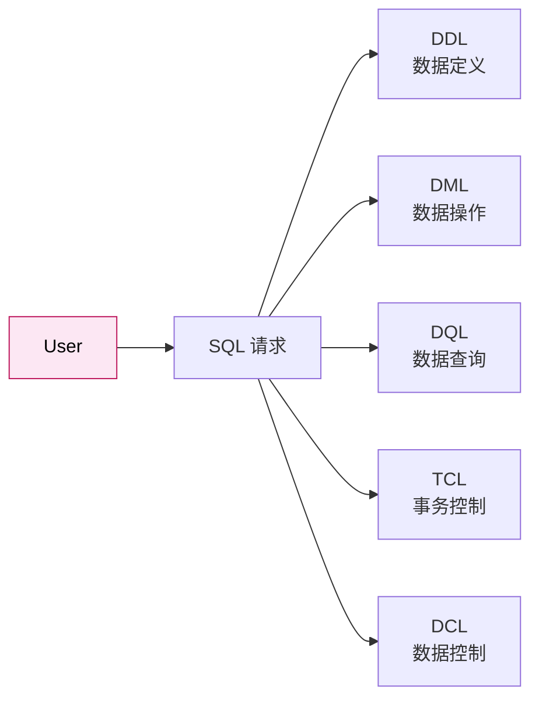
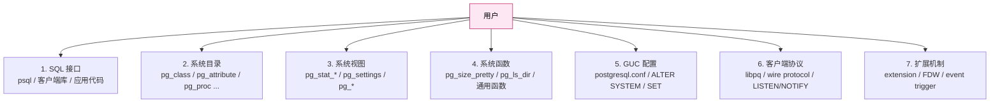
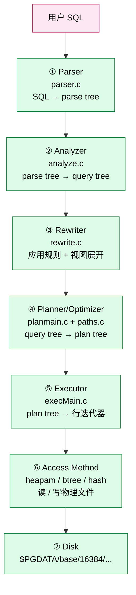
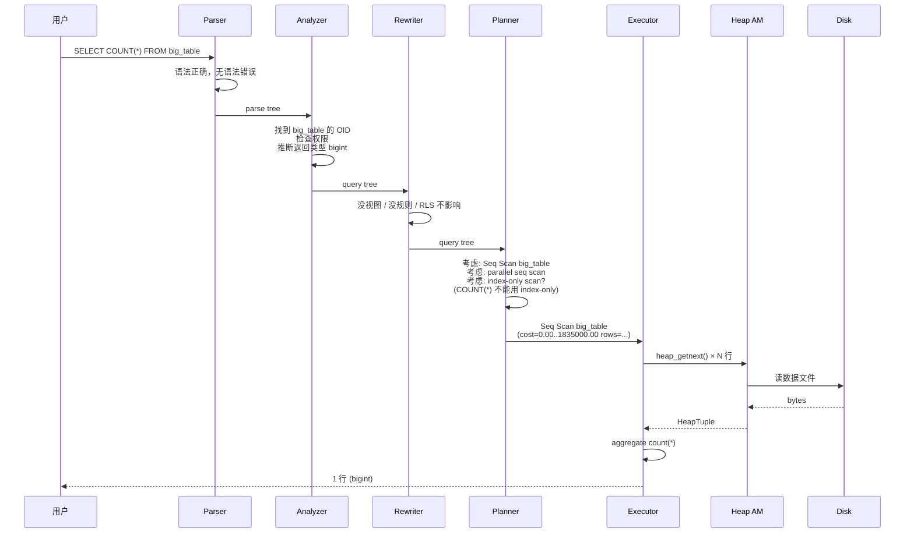
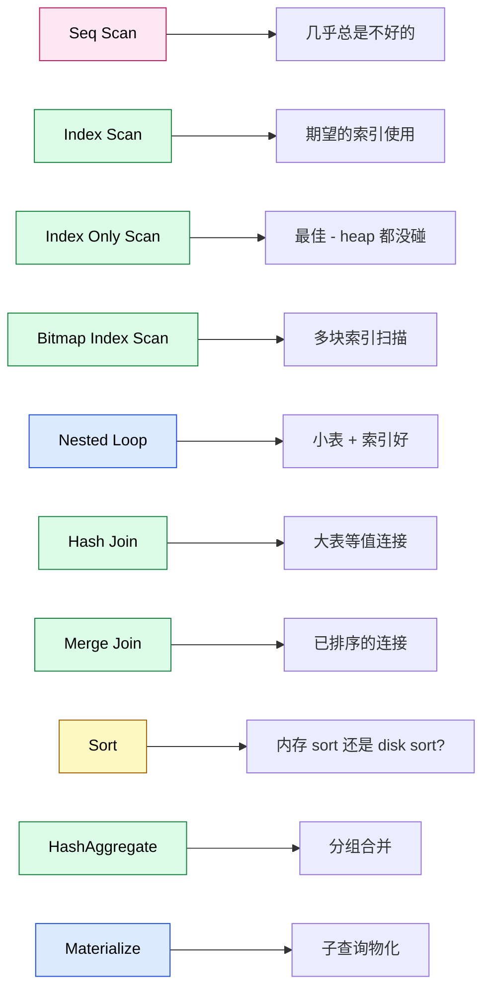
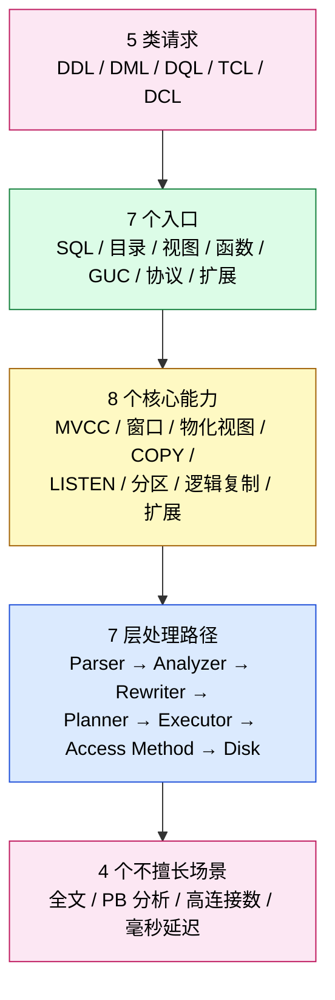
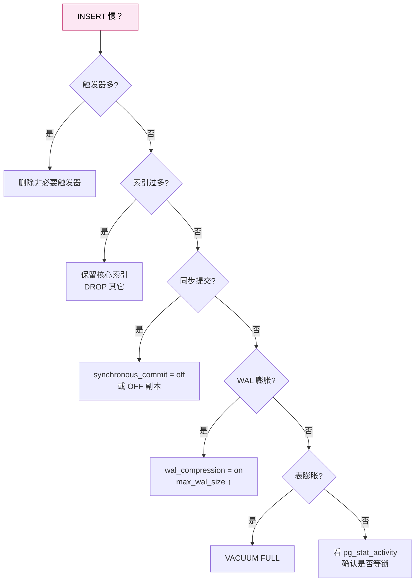
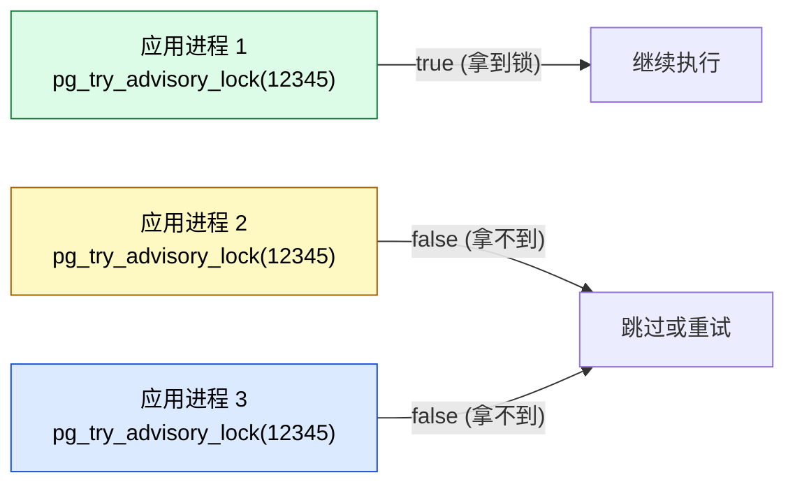

# 当我们在说"数据库"的时候，我们到底在说什么 —— 从用户的视角拆解 PostgreSQL 的能力与接口

| 编写人 | 编写内容 | 编写时间 |
| --- | --- | --- |
| growdu | 初稿，从用户视角梳理 PostgreSQL 暴露的所有能力与对应接口；轻源码 | 2026-09-01 |

> 本文是「PostgreSQL 系列」的视角篇。配套源码版本：PostgreSQL 18 dev（`~/cwork/postgresql`）。同系列前文：
>
> - [PostgreSQL 事务：一次 BEGIN 与 COMMIT 背后的双层世界](./postgresql-transaction-lifecycle/index.html)
> - [PostgreSQL MVCC：从一行 UPDATE 到 5 个 HeapTuple 的演化](./postgresql-mvcc/index.html)
> - [PostgreSQL 内存管理：从 shared_buffers 到内存上下文](./postgresql-memory-management/index.html)
> - [PostgreSQL 分区表：从一行 `PARTITION BY` 到路由热路径](./postgresql-partition-handling/index.html)
> - [PostgreSQL 逻辑复制表的生命周期：从 `pg_replication_slots` 到 `pg_subscription_rel`](./postgresql-logical-replication-tables-lifecycle/index.html)

打开 psql，输入 `\?`，屏幕会列出几十个反斜杠命令；输入 `\d` 能看表，输入 `SELECT version();` 能拿到版本号。这些动作背后是一台正在等你下命令的"机器"——但它到底是什么？

如果有人问你"PostgreSQL 给你提供了什么能力"，你能在一分钟之内答出来吗？这篇文章就做这一件事：**把 PostgreSQL 当成一个面向用户的产品，列出它的能力清单与接口清单**。看完之后你会有两张表——"我能向它提什么请求"与"它把这些请求暴露在哪些入口"——任何新学到的 PG 特性都能往这两张表里对号入座。

注意：**本文刻意不深入内核源码**。前面 30 篇文章都在扒源码；这一篇换视角——只看用户能看到什么、能做什么。源码层面的对应关系只在需要时点到为止。

---

## 一、先给"数据库"下个能用的定义

"数据库"这个词在不同人嘴里指不同的东西：

| 角色 | 心中的"数据库"是什么 |
| --- | --- |
| 后端开发 | "一个能存数据的程序" |
| DBA | "一个能跑 SQL 的服务" |
| 应用架构师 | "一个有事务、有索引、有备份的东西" |
| 数据分析师 | "一个能 join、能 group、能算 count 的地方" |
| 算法工程师 | "一个能在 WHERE 里塞 Python 脚本的系统" |
| 数据科学家 | "一个有 JSON、有向量检索、能装扩展的平台" |

PG 同时满足以上所有角色。所以"数据库"在 PG 的语境下是：

> **一个面向用户的、提供数据持久化与查询能力、配套事务 / 索引 / 复制 / 权限 / 扩展机制的完整软件系统。**

把这一定义拆开就是 PG 的能力清单。一一展开。

---

## 二、PG 给你的 5 类请求

任何一个数据库用户，打开 PG 之后能向它提的请求，最终都落入这 5 个字母打头的类别：



下面一一展开，每类配最常用的 5 个语句作为"代表动作"。

### 2.1 DDL —— 数据定义

DDL 改的不是数据，是"数据的形状"。用户提的请求形如"我要新建/修改/删除一个表 / 索引 / 视图 / 类型 / 函数"。

```sql
-- 5 个最常用的 DDL
CREATE TABLE orders (id int PRIMARY KEY, amount numeric);
ALTER TABLE orders ADD COLUMN created_at timestamptz DEFAULT now();
CREATE INDEX orders_amount_idx ON orders (amount);
CREATE VIEW large_orders AS SELECT * FROM orders WHERE amount > 10000;
DROP TABLE old_orders;
```

PG 给 DDL 的"超能力"远超 SQL 标准：

| 能力 | 标准 SQL | PG 给你的 |
| --- | --- | --- |
| 表继承 | 不支持 | `CREATE TABLE child () INHERITS (parent);` |
| 表分区 | 不支持 | `PARTITION BY {RANGE / LIST / HASH}` |
| 生成列 | 弱 | `GENERATED ALWAYS AS (...) STORED` |
| 自定义类型 | 不支持 | `CREATE TYPE mood AS ENUM ('sad','ok','happy');` |
| 域 | 不支持 | `CREATE DOMAIN positive_int int CHECK (VALUE > 0);` |
| 全文搜索 | 不支持 | `tsvector` + GIN 索引 |
| 数组 | 弱 | `int[]`、多维数组 |
| JSON | 不支持 | `json` / `jsonb` + 索引 |
| 几何 / 网络 / 范围 | 不支持 | `point`、`inet`、`int4range` 等 |
| 触发器 | 弱 | 行级 / 语句级 / 事件触发器 |
| 物化视图 | 不支持 | `CREATE MATERIALIZED VIEW` |

### 2.2 DML —— 数据操作

DML 改的是数据本身：插入、更新、删除、合并。

```sql
INSERT INTO orders (id, amount) VALUES (1, 100), (2, 200);
UPDATE orders SET amount = amount * 1.1 WHERE id = 1;
DELETE FROM orders WHERE amount < 0;
MERGE INTO target USING source ON ...;     -- PG 15+
COPY orders FROM '/tmp/orders.csv' CSV;    -- PG 独有的高速 bulk load
```

PG 在 DML 上的特色：

| 能力 | 用户能拿来做什么 |
| --- | --- |
| `INSERT ... ON CONFLICT ... DO UPDATE` | upsert（SQL 标准是 `MERGE`，PG 15 之前用这个） |
| `MERGE` (PG 15+) | 标准 upsert |
| `COPY FROM/TO` | 流式高速导入导出（绕过解析器） |
| `RETURNING` | DML 后立刻取回新值，免一次 SELECT |
| `WITH ... DELETE/UPDATE` | CTE 中直接做 DML（PG 14+） |
| `GENERATED ALWAYS AS IDENTITY` | 替代自增序列，更标准 |

### 2.3 DQL —— 数据查询

DQL 是 PG 真正的"重头戏"。一个完整的 PG 查询能用到 9 大类功能：

```sql
SELECT order_id, sum(amount)
FROM orders
WHERE created_at > now() - interval '30 days'              -- 时间窗口
  AND status IN ('paid','shipped')                          -- IN
  AND customer_id = ANY (ARRAY[1,2,3])                     -- 数组操作
  AND shipping_address @> '{"city":"Beijing"}'::jsonb      -- JSONB 包含
GROUP BY order_id
HAVING sum(amount) > 1000
WINDOW w AS (PARTITION BY customer_id ORDER BY created_at) -- 窗口函数
ORDER BY sum(amount) DESC
LIMIT 100
FOR UPDATE SKIP LOCKED;                                    -- 行级锁
```

PG 查询独有的能力（标准 SQL 没的）：

- **CTE + 递归查询**：`WITH RECURSIVE` 跑图算法、树遍历
- **窗口函数**：`ROW_NUMBER() OVER (...)` 排名、相邻差
- **LATERAL JOIN**：把上一行结果当参数喂给下一行
- **WITH ORDINALITY**：`unnest(...) WITH ORDINALITY` 取数组下标
- **DISTINCT ON**：取每组第一条，比 `GROUP BY + MIN` 快
- **`FILTER` 聚合**：`count(*) FILTER (WHERE status='paid')` 一行搞定
- **采样**：`TABLESAMPLE BERNOULLI(1)` 1% 抽样
- **并行查询**：大表扫描自动多 worker（`max_parallel_workers_per_gather`）
- **JIT 编译**：`jit = on`，复杂表达式的 LLVM JIT

### 2.4 TCL —— 事务控制

TCL 不是数据，是"数据改的边界"。核心动作：

```sql
BEGIN;
SAVEPOINT sp1;
-- ... some work ...
ROLLBACK TO SAVEPOINT sp1;
-- ... other work ...
COMMIT;
```

PG 在事务上的能力：

| 能力 | 说明 |
| --- | --- |
| 默认 autocommit | 不写 BEGIN 也算一个事务 |
| 嵌套子事务 | `SAVEPOINT` / `RELEASE SAVEPOINT` |
| 两阶段提交 | `PREPARE TRANSACTION` + `COMMIT PREPARED` |
| 隔离级别 | 4 档：`READ UNCOMMITTED` (→RC)、`READ COMMITTED`、`REPEATABLE READ`、`SERIALIZABLE` |
| 并发控制 | MVCC（默认）+ `SELECT FOR UPDATE/SHARE` + advisory lock |
| `SKIP LOCKED` | 跳过被锁的行，作业队列杀手锏 |

详见 [PostgreSQL 事务：一次 BEGIN 与 COMMIT 背后的双层世界](./postgresql-transaction-lifecycle/index.html)。

### 2.5 DCL —— 数据控制

DCL 管的是"谁能做什么"。PG 的 DCL 体系：

```sql
CREATE ROLE app_user LOGIN PASSWORD '...';
GRANT SELECT, INSERT ON orders TO app_user;
REVOKE DELETE ON orders FROM app_user;
ALTER ROLE app_user SET statement_timeout = '5s';
DROP ROLE app_user;
```

PG 的权限模型比 SQL 标准丰富得多：

| 能力 | 说明 |
| --- | --- |
| 角色（role）= 用户 + 组 | 一个 role 可以 INHERIT 另一个 role |
| Schema 级权限 | `GRANT USAGE ON SCHEMA ...` |
| 列级权限 | `GRANT UPDATE (balance) ON account TO ...` |
| 行级权限（RLS） | `CREATE POLICY ... ON table_name` |
| 默认权限 | `ALTER DEFAULT PRIVILEGES FOR ROLE ...` |
| 权限继承链 | role → role → role |
| `SECURITY DEFINER` 函数 | 用函数 owner 身份执行，绕过调用者权限 |

---

## 三、PG 暴露能力的 7 个入口

光有 5 类请求还不够——它们从哪发出？PG 提供了 7 类入口：



下面每类给出 5 个最有代表性的接口。

### 3.1 SQL 接口 —— 5 类请求的"主入口"

这是 80% 用户打交道的地方。所有 5 类请求（DDL/DML/DQL/TCL/DCL）都通过 SQL 发出。

PG 的 SQL 入口除了标准语句外，还有几个独有的"超能力语句"：

| 语句 | 类型 | 干什么 |
| --- | --- | --- |
| `EXPLAIN (ANALYZE, BUFFERS)` | 性能诊断 | 跑查询并打印真实执行计划 |
| `VACUUM [FULL] [ANALYZE]` | 维护 | 清理 dead tuple、更新统计信息 |
| `ANALYZE table_name` | 维护 | 更新 pg_statistic，让优化器看清数据分布 |
| `CLUSTER table_name USING index` | 物理重排 | 按索引顺序重写表，提升范围查询 |
| `REINDEX [TABLE CONCURRENTLY]` | 索引重建 | 修复索引膨胀，不锁表（CONCURRENTLY） |
| `LISTEN channel / NOTIFY channel` | 进程间通信 | 异步消息，不走连接池 |
| `DO $$ ... $$` | 匿名块 | 跑一段 PL/pgSQL 而不创建函数 |
| `CALL proc()` | 过程调用 | 调存储过程（PG 11+） |
| `SHOW name` / `RESET name` | GUC 操作 | 不进 SQL，直接读配置 |
| `SET LOCAL ...` | 事务级 GUC | 改配置仅本事务生效 |

### 3.2 系统目录 —— 数据库自身的"系统表"

PG 把自己的元数据也存在表里——这叫 **system catalog**。用户可以查、可以 JOIN（多数情况下不能改）。最常用的 10 张：

| 表 | 干什么 |
| --- | --- |
| `pg_class` | 表 / 索引 / 视图 / 序列的统一登记表 |
| `pg_attribute` | 每张表的每一列 |
| `pg_namespace` | schema（namespace） |
| `pg_proc` | 函数 / 存储过程 |
| `pg_type` | 数据类型 |
| `pg_constraint` | 主键 / 外键 / 唯一约束 / 检查约束 |
| `pg_index` | 索引元数据 |
| `pg_statistic` | 优化器用的统计信息（通常通过 `pg_stats` 视图读） |
| `pg_class.relkind` | `r`=普通表 / `i`=索引 / `S`=序列 / `v`=视图 / `m`=物化视图 / `p`=分区表 / `I`=分区索引 |
| `pg_database` | 所有数据库 |

源码上，这些表是 BKI 生成的，定义在 `~/cwork/postgresql/src/include/catalog/pg_*.h`。

**用户能用来做什么**？

```sql
-- 找库里所有超过 1GB 的表
SELECT schemaname, relname, pg_size_pretty(pg_relation_size(c.oid))
FROM pg_class c
JOIN pg_namespace n ON n.oid = c.relnamespace
WHERE relkind = 'r' AND pg_relation_size(c.oid) > 1024*1024*1024;

-- 找某个表的所有索引
SELECT indexname, indexdef
FROM pg_indexes WHERE tablename = 'orders';
```

### 3.3 系统视图 —— 把系统表"翻译"给用户看的"人话"

catalog 表信息太原始，PG 又叠了一层 **system view**——把 catalog 表 JOIN、过滤、起人类能懂的列名。最重要的 12 张：

| 视图 | 回答什么问题 |
| --- | --- |
| `pg_stat_user_tables` | 每个 user 表的 seq_scan / idx_scan / n_tup_ins / n_tup_upd / n_tup_del |
| `pg_stat_user_indexes` | 每个 user 索引的 idx_scan 次数 |
| `pg_statio_user_tables` | 每个 user 表的 heap_blks_read / heap_blks_hit（IO 命中率） |
| `pg_stat_activity` | 所有活跃 backend 的 pid / state / query / wait_event |
| `pg_locks` | 当前所有锁 |
| `pg_stat_replication` | publisher 端 walsender 的 LSN / lag |
| `pg_stat_subscription` | subscriber 端 apply worker 的 LSN |
| `pg_stat_replication_slots` | 出站插件的 spill / stream 计数 |
| `pg_settings` | 所有 GUC 的当前值 + 默认值 + 来源 |
| `pg_indexes` | 每个 user 表的索引列表 + 索引定义 |
| `pg_views` / `pg_matviews` | 视图 / 物化视图的列表 + 定义 |
| `pg_available_extensions` | 当前可装的扩展 |

源码定义在 `~/cwork/postgresql/src/backend/catalog/system_views.sql:1019 (pg_replication_slots)`。

**用户能用它做什么**？

```sql
-- 找"该不该建索引"的表
SELECT relname, seq_scan, idx_scan,
       round(100.0 * idx_scan / NULLIF(seq_scan + idx_scan, 0), 1) AS idx_pct
FROM pg_stat_user_tables
WHERE seq_scan > idx_scan
ORDER BY seq_scan DESC LIMIT 10;

-- 看哪个查询卡住了
SELECT pid, now() - query_start AS duration, state, wait_event_type, wait_event, query
FROM pg_stat_activity WHERE state != 'idle' ORDER BY duration DESC;
```

### 3.4 系统函数 —— 用户能在 SQL 里调的"程序"

PG 自带 1000+ 系统函数，覆盖几乎所有运维动作。常用的几大类：

| 类别 | 代表函数 | 用途 |
| --- | --- | --- |
| 大小 | `pg_size_pretty(bigint)` | 把字节数转 `12 MB` |
| 大小 | `pg_relation_size(oid)` | 表 / 索引字节数 |
| 大小 | `pg_database_size(name)` | 整个数据库字节数 |
| 时间 | `now()` / `current_timestamp` | 当前事务时间 |
| 时间 | `clock_timestamp()` | 真实墙钟时间 |
| 时间 | `statement_timestamp()` | 当前语句开始时间 |
| 时间 | `pg_postmaster_start_time()` | 进程启动时间 |
| 进程 | `pg_backend_pid()` | 当前 backend 的 PID |
| 进程 | `pg_cancel_backend(pid)` | 取消某个 backend 的查询 |
| 进程 | `pg_terminate_backend(pid)` | 强杀某个 backend |
| 维护 | `pg_reload_conf()` | 重新加载 postgresql.conf |
| 维护 | `pg_rotate_logfile()` | 滚动日志 |
| 复制 | `pg_replication_origin_advance` | 调 logical rep 进度 |
| 复制 | `pg_create_restore_point(name)` | 在 WAL 上打标点，PITR 用 |

源码注册在 `~/cwork/postgresql/src/include/catalog/pg_proc.dat:6722 (pg_current_wal_lsn)`（每一行一个函数）。

### 3.5 GUC 配置 —— 1 个文件 + 2 个 SQL 接口

**GUC** = Grand Unified Configuration，PG 所有可调参数的统称。一共有 300+ 个 GUC。

**3 种修改途径**：

```sql
-- 1. 改 postgresql.conf 后 pg_reload_conf()
shared_buffers = 8GB

-- 2. 用 SQL 命令（等价于 ALTER SYSTEM）
ALTER SYSTEM SET shared_buffers = '8GB';
SELECT pg_reload_conf();

-- 3. 临时生效（当前会话 / 当前事务）
SET shared_buffers = '8GB';
SET LOCAL statement_timeout = '5s';
```

**用户最该知道 GUC 的 5 个维度**：

| 维度 | 代表 GUC | 默认值 | 调整建议 |
| --- | --- | --- | --- |
| 内存 | `shared_buffers` | 128 MB | 物理内存 25% |
| 内存 | `work_mem` | 4 MB | 视排序 / hash 调大 |
| 内存 | `effective_cache_size` | 4 GB | 物理内存 75% |
| 磁盘 | `max_wal_size` | 1 GB | 看写入量 |
| 并发 | `max_connections` | 100 | 看业务 |
| 并发 | `max_parallel_workers_per_gather` | 2 | OLAP 调到 4-8 |
| 查询 | `statement_timeout` | 0 | OLTP 设 30s |
| 查询 | `jit` | off | OLAP 开 |
| 复制 | `max_replication_slots` | 10 | 看 logical rep |
| 复制 | `wal_level` | `replica` | logical rep 改 `logical` |

源码注册在 `~/cwork/postgresql/src/backend/utils/misc/guc.c:3000+ (DefineCustomXXXVariable)`。

### 3.6 客户端协议 —— libpq / wire protocol / LISTEN/NOTIFY

PG 与客户端的"对话"用一套公开的 **wire protocol**。任何语言都可以照协议实现客户端。

**5 个关键协议级特性**：

| 特性 | 用户能拿来做什么 |
| --- | --- |
| 普通查询协议 | `psql -c "SELECT 1"` 走的就是 |
| 扩展查询协议 | `Parse / Bind / Execute`，prepared statement 复用 |
| COPY 协议 | 流式导入导出，比 INSERT 快 10 倍 |
| `LISTEN` / `NOTIFY` | 进程间异步消息 |
| `COPY ... FROM PROGRAM` | 直接读 shell 命令输出（`COPY ... FROM PROGRAM 'curl ...'`） |

源码在 `~/cwork/postgresql/src/backend/libpq/` 和 `src/backend/tcop/`，协议规范文档在 `src/interfaces/libpq/libpq-fe.h` + `src/backend/commands/copy.c`。

**客户端库的事实标准**：

- C / C++：`libpq`
- Java：`pgjdbc`
- Python：`psycopg` / `asyncpg`
- Node.js：`pg` / `postgres.js`
- Go：`pgx`
- Rust：`tokio-postgres`
- C#：`Npgsql`

### 3.7 扩展机制 —— 用户能加的"插件"

PG 提供了 4 类扩展入口：

| 入口 | 能加什么 |
| --- | --- |
| `CREATE EXTENSION` | 装一个 extension（SQL 函数 + C 函数 + GUC + event trigger） |
| `CREATE FOREIGN DATA WRAPPER` | 接外部数据源（其他 PG、MySQL、MongoDB、文件、S3、HTTP） |
| `CREATE EVENT TRIGGER` | 监听 DDL 事件（`ddl_command_start`、`table_rewrite` 等） |
| `CREATE LANGUAGE` | 加新的 PL（PL/pgSQL、PL/Python、PL/Perl、PL/Tcl、PL/Java） |

最常见的扩展包：

- `pg_stat_statements` —— 慢查询统计
- `pg_trgm` —— 三字符模糊匹配
- `pgcrypto` —— 加密函数
- `PostGIS` —— 地理信息
- `TimescaleDB` —— 时序
- `pgvector` —— 向量检索
- `pg_partman` —— 自动分区管理
- `pg_cron` —— 定时任务
- `wal2json` / `test_decoding` —— logical rep output plugin

源码注册机制在 `~/cwork/postgresql/src/backend/commands/extension.c:1500+ (CreateExtension)`。

---

## 四、一次查询的完整旅程：用户视角 vs 内核视角

这是全文最关键的一节。我们拿一条最简单的查询：

```sql
SELECT name FROM users WHERE id = 12345;
```

### 4.1 用户视角的 3 步


对用户来说，就是这 3 步：**写 → 发 → 看结果**。

### 4.2 内核视角的 7 层

但 PG 内部，这一句话要经过 7 层才得到结果：



**每一层做一件事**：

| 层 | 输入 | 输出 | 关键文件 |
| --- | --- | --- | --- |
| ① Parser | 文本 SQL | parse tree（语法树） | `src/backend/parser/parser.c:235 (raw_parser)` |
| ② Analyzer | parse tree | query tree（带类型 / 权限 / 语义） | `src/backend/parser/analyze.c:289 (parse_analyze)` |
| ③ Rewriter | query tree | 改写后的 query tree（展开视图 / 应用 RLS 规则） | `src/backend/rewrite/rewriteHandler.c:3800 (ApplyRetrieveRule)` |
| ④ Planner | query tree | plan tree（最优执行计划） | `src/backend/optimizer/plan/` |
| ⑤ Executor | plan tree | 逐行结果（迭代器模型） | `src/backend/executor/execMain.c:265 (ExecutorRun)` |
| ⑥ Access Method | row 请求 | 物理读 / 写（`heap_getnext`、`btgettuple` 等） | `src/backend/access/heap/`、`src/backend/access/nbtree/` |
| ⑦ Disk | 字节流 | 实际数据文件 | `$PGDATA/base/<dboid>/<relfilenode>` |

**用户看到的"结果"是第 ⑤ 层吐出来的**——但它背后有 ⑥⑦ 两层在 I/O。用户调优索引、加 buffer pool，都是在优化 ⑥⑦ 两层；用户写更聪明的 SQL，是让 ④ 优化器选更好的执行计划。

### 4.3 一个真实场景的"双视角对比"

场景：用户抱怨"我的 `SELECT COUNT(*) FROM big_table` 太慢了"。

**用户视角**：
- 看到的就是 1 条返回结果，但等了 30 秒
- 第一反应：建索引？加内存？换机器？

**内核视角**：



**真实瓶颈**：① ⑤ ⑥ 三层都很快，瓶颈在 ⑥⑦ —— **全表扫描**。如果 big_table 有 1 亿行，每个 heap page 8KB，要读 1000000+ 个 page。

**优化方向**：

1. **改 SQL**：`SELECT count(*) FROM big_table WHERE id IS NOT NULL`（让优化器有机会用 partial index）
2. **近似值**：`SELECT reltuples FROM pg_class WHERE relname='big_table'`（直接从 catalog 读估算值）
3. **维护统计**：`ANALYZE big_table` 让优化器看清数据
4. **物化**：`CREATE MATERIALIZED VIEW big_table_count AS SELECT count(*) FROM big_table`
5. **并行**：`SET max_parallel_workers_per_gather = 8;`
6. **建合适的索引**：业务查询用，业务外的 `COUNT(*)` 无法优化——本质就需要扫表

**关键洞察**：用户视角"SQL 慢"，内核视角可能对应到**完全不同的 7 层之一**。这 7 层的瓶颈诊断，靠的是 `EXPLAIN (ANALYZE, BUFFERS)`。

### 4.4 一个真实的 `EXPLAIN ANALYZE` 解读

```sql
EXPLAIN (ANALYZE, BUFFERS)
SELECT u.name, sum(o.amount)
FROM users u
JOIN orders o ON o.user_id = u.id
WHERE u.created_at > now() - interval '30 days'
GROUP BY u.name
ORDER BY sum(o.amount) DESC
LIMIT 10;
```

```
Limit  (cost=... rows=10) (actual time=125.4..125.5 rows=10 loops=1)
  ->  Sort  (cost=... rows=100000) (actual time=125.4..125.5 rows=10 loops=1)
        Sort Key: (sum(o.amount)) DESC
        ->  HashAggregate  (cost=... rows=100000) (actual ... rows=52341 loops=1)
              Group Key: u.name
              ->  Hash Join  (cost=... rows=200000) (actual time=45..98 rows=200000 loops=1)
                    Hash Cond: (o.user_id = u.id)
                    ->  Seq Scan on orders o  (cost=... rows=1000000) (actual ... rows=1000000 loops=1)
                          Buffers: shared hit=45000 read=1200
                    ->  Hash  (cost=... rows=10000)
                          ->  Index Scan using users_created_at_idx on users u
                                Index Cond: (created_at > ...)
                                Buffers: shared hit=850
Planning Time: 0.5 ms
Execution Time: 125.4 ms
```

**用户视角读 6 个数字**：

| 数字 | 含义 | 关键提示 |
| --- | --- | --- |
| `actual time` | 真实耗时 (ms) | 与 `cost=` 比较，差距大说明估算错误 |
| `rows=` | 真实返回行数 | 与 `rows=` 估算比较，差距大说明统计信息过期 |
| `loops=` | 节点被重入次数 | > 1 时单次 cost 乘以 loops |
| `Buffers: shared hit=` | 缓存命中页 | `hit/ (hit+read)` = 缓存命中率 |
| `shared read=` | 磁盘读页 | 大就考虑加 shared_buffers / 加索引 |
| `Planning Time` | 规划耗时 | > 50ms 考虑 `prepared statement` |

**4 个常见性能陷阱**：

1. **`actual rows` 与 `rows=` 差 10 倍** → 跑 `ANALYZE users;` 
2. **`shared read` 大、`hit` 小** → 表没缓存到内存，加 `shared_buffers`
3. **每层 `loops=1` 但底层行数大** → 优化器选择正确，但表本身太大，考虑分区
4. **`Planning Time` 比 `Execution Time` 还大** → 跑 `EXPLAIN` 的查询特别复杂，用 prepared statement

### 4.5 `EXPLAIN` 输出常见模式



读 EXPLAIN 输出时，**真正的瓶颈节点往往在最底层的 Scan**——上层都是它的派生。找到最深那行的 `actual time`，就知道主要时间花在哪了。


---

## 五、用户最该掌握的 8 个能力（按使用频率排序）

从用户视角，下列 8 个能力是 90% 业务的"必备工具箱"。其他能力（向量检索、地理信息、时序）都是"加分项"。

| 排名 | 能力 | 一句话价值 |
| --- | --- | --- |
| 1 | MVCC + `SELECT ... FOR UPDATE SKIP LOCKED` | 作业队列的核心 |
| 2 | 窗口函数 + CTE | 不写 Python 也能做复杂分析 |
| 3 | 物化视图 + 索引 | 把慢查询变快查询 |
| 4 | `COPY` 流式导入 | 百万行 / 秒的数据加载 |
| 5 | LISTEN / NOTIFY | 应用间异步消息，不走 MQ |
| 6 | 表分区 | 大表自动管理、自动清理 |
| 7 | 逻辑复制 | 跨 PG 实例的数据同步 |
| 8 | 扩展机制 | 装 `pgvector` / `PostGIS` / `pg_stat_statements` 解决专门问题 |

每一个能力都是一篇万字文章的素材——本文不展开，**留作后续系列文章的"导航图。

下面用一段话点出每个能力的"应用场景 + 入口"：

### 5.1 MVCC + SELECT FOR UPDATE SKIP LOCKED

**应用场景**：作业队列（10 个 worker 并发抢任务）。

**用户接口**：

```sql
-- 任务表
CREATE TABLE jobs (id serial PRIMARY KEY, status text, payload jsonb);

-- worker 抢任务（关键：SKIP LOCKED）
BEGIN;
SELECT id, payload FROM jobs
WHERE status = 'pending'
ORDER BY id
LIMIT 1
FOR UPDATE SKIP LOCKED;

UPDATE jobs SET status = 'running' WHERE id = $1;
COMMIT;
```

**入口**：TCL + DQL。详见 [PostgreSQL 事务](./postgresql-transaction-lifecycle/index.html) §四。

### 5.2 窗口函数 + CTE

**应用场景**：用户排名、连续登录天数、相邻时间差。

**用户接口**：

```sql
-- 销售前 N 名（窗口函数）
SELECT name, sales,
       rank() OVER (ORDER BY sales DESC) AS rnk
FROM (SELECT name, sum(amount) AS sales FROM orders GROUP BY name) t;

-- 连续登录（递归 CTE）
WITH RECURSIVE login_streak AS (
  SELECT user_id, login_date, 1 AS streak
  FROM logins WHERE login_date = '2026-08-01'
  UNION ALL
  SELECT l.user_id, l.login_date, ls.streak + 1
  FROM logins l JOIN login_streak ls
    ON l.user_id = ls.user_id
   AND l.login_date = ls.login_date + 1
)
SELECT * FROM login_streak;
```

**入口**：DQL 的 SELECT + WITH 子句。源码 `src/backend/parser/parse_clause.c`。

### 5.3 物化视图 + 索引

**应用场景**：BI 报表（每天算一次，1 秒变 0.01 秒）。

**用户接口**：

```sql
CREATE MATERIALIZED VIEW daily_sales AS
SELECT date_trunc('day', created_at) AS day,
       sum(amount) AS total
FROM orders
GROUP BY 1;

CREATE UNIQUE INDEX daily_sales_day_idx ON daily_sales (day);

-- 定时刷新
REFRESH MATERIALIZED VIEW CONCURRENTLY daily_sales;
```

**入口**：DDL。CONCURRENTLY 刷新不锁表，但需要 unique index。

### 5.4 COPY 流式导入

**应用场景**：ETL 日终导入百万行。

**用户接口**：

```sql
-- 从 CSV 文件导入
COPY orders (id, amount, customer_id)
FROM '/tmp/orders.csv'
WITH (FORMAT csv, HEADER true);

-- 直接从 shell 命令读
COPY orders FROM PROGRAM 'curl -s https://api.example.com/orders.csv'
WITH (FORMAT csv);

-- 导出
COPY (SELECT * FROM orders WHERE created_at > '2026-08-01')
TO '/tmp/aug_orders.csv' WITH (FORMAT csv);
```

**入口**：DML 风格的 COPY 语句。源码 `src/backend/commands/copy.c:2000+`。

### 5.5 LISTEN / NOTIFY

**应用场景**：应用间异步消息（不用 Redis）。

**用户接口**：

```sql
-- 订阅端
LISTEN new_order;

-- 发布端
NOTIFY new_order, '{"id": 12345}';

-- 应用端用 libpq 的 PQconsumeInput 接收
```

**入口**：TCL 风格的 LISTEN/NOTIFY。源码 `src/backend/commands/async.c`。

### 5.6 表分区

**应用场景**：日志表按月分表，自动清理老数据。

**用户接口**：

```sql
CREATE TABLE logs (
  id bigserial,
  created_at timestamptz NOT NULL,
  msg text
) PARTITION BY RANGE (created_at);

CREATE TABLE logs_2026_08 PARTITION OF logs
  FOR VALUES FROM ('2026-08-01') TO ('2026-09-01');

-- 自动清理
DROP TABLE logs_2026_06;  -- 一秒删一个月数据
```

**入口**：DDL。详见 [PostgreSQL 分区表](./postgresql-partition-handling/index.html)。

### 5.7 逻辑复制

**应用场景**：跨 PG 实例的数据同步、CDC 到 Kafka。

**用户接口**：

```sql
-- publisher
CREATE PUBLICATION my_pub FOR TABLE users, orders;

-- subscriber
CREATE SUBSCRIPTION my_sub
CONNECTION 'host=pub_host dbname=app user=rep'
PUBLICATION my_pub;
```

**入口**：DDL 风格的 CREATE PUBLICATION / SUBSCRIPTION。详见 [逻辑复制系列文章](./postgresql-logical-replication-tables-lifecycle/index.html)。

### 5.8 扩展机制

**应用场景**：向量检索、地理信息、定时任务。

**用户接口**：

```sql
-- 装一个扩展
CREATE EXTENSION IF NOT EXISTS pgvector;

-- 用它
CREATE TABLE docs (
  id bigserial PRIMARY KEY,
  content text,
  embedding vector(1536)
);
CREATE INDEX docs_embedding_idx ON docs USING hnsw (embedding vector_cosine_ops);

SELECT id FROM docs ORDER BY embedding <=> $1 LIMIT 10;
```

**入口**：DDL 风格的 CREATE EXTENSION。源码 `src/backend/commands/extension.c:1500+`。
"**。

---

## 六、PG 也有"做不好"的事 —— 4 个常见误区

PG 看起来无所不能，但有几件事它**就是做得不如专门工具**：

| 场景 | PG 的局限 | 替代方案 |
| --- | --- | --- |
| **全文搜索** | `tsvector` 比 MyISAM 强，但比 Elasticsearch 弱 | ES / OpenSearch |
| **大规模宽表分析** | 单节点 PG 几百 TB 没问题，PB 级吃力 | ClickHouse / Doris / Snowflake |
| **高并发小事务** | 单实例 max_connections ~ 1000；连接数上去就劣化 | PgBouncer / CockroachDB |
| **毫秒级延迟要求** | 写入 fsync 默认 3ms（`synchronous_commit=on`） | 关同步副本、改 `synchronous_commit=off` |

**结论**：**没有银弹**。PG 是一个"全能型中等生"——80% 业务用它刚刚好，剩下 20% 是为专门工具准备的。

---

## 七、回到最初的"数据库"定义

回到引子，把 PG 的能力清单整理成一张表，对应文章开头那些"角色"：

| 用户角色 | 他说的"数据库"是 | PG 对应的能力 |
| --- | --- | --- |
| 后端开发 | "能存数据" | DML、SQL、COPY、连接池 |
| DBA | "能跑 SQL" | SQL 接口、系统视图、GUC |
| 应用架构师 | "有事务、有索引、有备份" | TCL、索引、PITR、流复制 |
| 数据分析师 | "能 join、能 group" | DQL、窗口函数、CTE |
| 算法工程师 | "能在 WHERE 里塞 Python" | PL/Python、PL/R、扩展 |
| 数据科学家 | "JSON、向量、扩展" | `jsonb`、`pgvector`、扩展机制 |

PG 是**同时面向 6 种角色**的数据库。这就是为什么社区会有那么多 extension——每个人群都想要自己的"专属 PG"，但底子都是同一个。

---

## 八、给新手的"先用起来"清单

如果你是 PG 新手，下列 5 步让你在 1 小时内"会用"：

```bash
# 1. 启动 PG
pg_ctl start -D /var/lib/postgresql/data

# 2. 连进去
psql -h localhost -U postgres

# 3. 创建一个数据库
CREATE DATABASE app;

# 4. 装两个最有用的扩展
\c app
CREATE EXTENSION IF NOT EXISTS pg_stat_statements;
CREATE EXTENSION IF NOT EXISTS pgcrypto;

# 5. 查"系统视图"，感受 PG 的元数据能力
\dv                     -- 列所有视图
SELECT * FROM pg_stat_activity;
SHOW shared_buffers;
```

走完这 5 步，你就跨过了"会用 PG"的门槛。

---

## 九、总结：PG 给你的 5 + 7 + 8

把全文压缩成三组数字：



**回到文章标题**：当我们说"数据库"时，PG 的答案是——

> 一个给你 5 类请求 + 7 个入口 + 8 个核心能力，处理路径有 7 层，知道 4 件不擅长的事，但 80% 业务都能搞定的**通用关系数据库**。

---

## 十、用户视角最常见的 6 个"为什么"

为什么这些问题在 PG 里特别突出——以及你该怎么回答客户 / 老板 / 同事：

### 10.1 "为什么我的 INSERT 这么慢？"

```sql
-- 排查 4 步
EXPLAIN (ANALYZE, BUFFERS) INSERT INTO orders ...;
SELECT * FROM pg_stat_user_tables WHERE relname = 'orders';
SELECT * FROM pg_stat_activity WHERE state = 'active';
SHOW synchronous_commit;
```

对应内核视角：



| 可能瓶颈 | GUC / 索引 / 配置 |
| --- | --- |
| 太多触发器 | `DROP TRIGGER` 后重测 |
| 太多索引 | `INSERT` 要维护所有索引，索引越少越快 |
| 同步复制太严 | `synchronous_commit = off`（不丢事务但允许丢最后 600 KB） |
| WAL 太满 | `wal_compression = on` / `max_wal_size = 10GB` |
| 表膨胀 | `VACUUM (ANALYZE)` |

### 10.2 "为什么我的 SELECT 走 Seq Scan？"

```sql
EXPLAIN (ANALYZE, BUFFERS) SELECT ...;
-- 看 plan 里的 "Seq Scan on big_table"
-- 8 个可能原因：

SELECT reltuples, relpages
FROM pg_class WHERE relname = 'big_table';

-- 1. 表很小（< 几十页）→ 没必要走索引
-- 2. WHERE 条件选择性差（> 10% 行匹配）→ 全表更快
-- 3. 没建索引
-- 4. 索引不匹配（建了 btree 但用 LIKE '%xx%'）
-- 5. 统计信息过期 → ANALYZE
-- 6. cost 参数错配 → random_page_cost / seq_page_cost
-- 7. 类型不匹配 → WHERE int_col = '123' (字符串)
-- 8. 表达式索引缺失 → WHERE lower(name) = 'foo' 但只有 (name) 索引
```

### 10.3 "为什么事务回滚很慢？"

```sql
SELECT pid, now() - xact_start AS txn_age, state, query
FROM pg_stat_activity
WHERE xact_start IS NOT NULL
ORDER BY xact_start;
```

回滚慢通常是**有 N 个子事务 / 大事务**，PG 要把 N 个 tuple 都标记为 aborted。`work_mem` 不够时排序也会拖慢。

### 10.4 "为什么我这个表越来越大？"

```sql
SELECT relname,
       pg_size_pretty(pg_relation_size(c.oid)) AS table_size,
       pg_size_pretty(pg_total_relation_size(c.oid)) AS total,
       n_live_tup, n_dead_tup,
       round(100.0 * n_dead_tup / NULLIF(n_live_tup + n_dead_tup, 0), 1) AS dead_pct
FROM pg_stat_user_tables
JOIN pg_class c ON c.oid = relid
ORDER BY pg_total_relation_size(c.oid) DESC;
```

dead_tuple 多 → 没自动 vacuum。处理：

- 调 `autovacuum_vacuum_scale_factor = 0.05`（5% 触发）
- 调 `autovacuum_vacuum_cost_limit = 2000`（更快）
- 关 autovacuum 的话自己 `VACUUM (ANALYZE)`

### 10.5 "为什么备份这么慢？"

```bash
pg_basebackup -D /backup -Ft -z -P    # 6 GB/分钟起
```

PG 内置 `pg_basebackup` 是并行物理备份，大库用 `-j 8` 多 worker。逻辑备份 `pg_dump` 慢因为是单线程串行——大库别用。

### 10.6 "为什么我的 replication lag 越来越大？"

详见 [逻辑复制的监控](./postgresql-logical-replication-monitoring/index.html)。最常见 3 个原因：

- 慢事务（hold LSN 太长）
- 大量 DDL（slot 必须等 catalog snapshot）
- subscriber apply worker 满（`max_logical_replication_workers` 太小）

---

## 十一、PG 给你的"隐藏菜单" —— 4 个低频但重要的能力

### 11.1 advisory lock

PG 在标准 lock 之上额外提供了一种"应用级"锁：




```sql
SELECT pg_advisory_lock(12345);     -- 拿锁
SELECT pg_advisory_unlock(12345);   -- 放锁
SELECT pg_try_advisory_lock(12345); -- 非阻塞尝试
```

可以用来做"同一时刻只有 1 个 cron 跑"——不需要 Redis。

源码 `~/cwork/postgresql/src/backend/storage/lmgr/proc.c:2000+`。

### 11.2 event trigger

DDL 事件钩子，可以拦截所有 DDL：

```sql
CREATE OR REPLACE FUNCTION log_ddl() RETURNS event_trigger AS $$
BEGIN
  RAISE NOTICE 'DDL command: %', tg_tag;
END;
$$ LANGUAGE plpgsql;

CREATE EVENT TRIGGER log_ddl_trigger
  ON ddl_command_end
  EXECUTE FUNCTION log_ddl();
```

适合做"所有建表必须带某列"的强约束。源码 `~/cwork/postgresql/src/backend/commands/event_trigger.c`。

### 11.3 generated column

```sql
CREATE TABLE users (
  id serial PRIMARY KEY,
  email text,
  email_lower text GENERATED ALWAYS AS (lower(email)) STORED
);
CREATE INDEX users_email_lower_idx ON users (email_lower);
```

`email_lower` 自动跟随 `email` 更新——索引能用来跑 `WHERE email_lower = 'foo@bar.com'`。

源码 `~/cwork/postgresql/src/backend/parser/parse_expr.c`（生成列表达式 parse）。

### 11.4 BRIN 索引

PG 自带 BTree、Hash、GIN、GiST、SP-GiST、BRIN 6 种索引类型，BRIN 是"块范围索引"：

```sql
CREATE INDEX big_table_created_idx ON big_table USING BRIN (created_at);
```

适合"按时间排序、追加为主"的时序表——索引大小只有 BTree 的千分之一。源码 `~/cwork/postgresql/src/backend/access/brin/`。

---

## 十二、读 PG 源码的正确姿势

如果你真的想扒 PG 源码看自己关心的能力怎么实现，下面是一份"从哪里开始"清单：

| 想搞懂什么 | 第一个文件 | 关键函数 |
| --- | --- | --- |
| SQL 怎么解析 | `src/backend/parser/gram.y` | `yyparse` |
| 类型推断 | `src/backend/parser/analyze.c` | `transformColumnRef` |
| 权限检查 | `src/backend/catalog/aclchk.c` | `pg_class_aclcheck` |
| 计划生成 | `src/backend/optimizer/plan/createplan.c` | `create_plan` |
| 索引选择 | `src/backend/optimizer/path/indxpath.c` | `find_usable_indexes` |
| 锁 | `src/backend/storage/lmgr/lock.c` | `LockAcquire` |
| MVCC | `src/backend/access/heap/heapam.c` | `HeapTupleSatisfiesMVCC` |
| 事务 | `src/backend/access/transam/xact.c` | `StartTransactionCommand` |
| 复制 | `src/backend/replication/walsender.c` | `WalSndLoop` |
| 扩展加载 | `src/backend/commands/extension.c` | `CreateExtension` |

---

## 参考资料

### 源码引用（路径全部相对 `~/cwork/postgresql/`）（路径全部相对 `~/cwork/postgresql/`）

- `src/backend/parser/parser.c` —— ① Parser
- `src/backend/parser/analyze.c` —— ② Analyzer
- `src/backend/rewrite/rewriteHandler.c` —— ③ Rewriter
- `src/backend/optimizer/plan/planmain.c:120 (standard_planner)` —— ④ Planner/Optimizer
- `src/backend/executor/execMain.c` —— ⑤ Executor
- `src/backend/access/heap/heapam.c:200 (heap_getnext)` —— ⑥ Heap Access Method
- `src/backend/access/nbtree/nbtinsert.c:425 (_bt_insertonpg)` —— ⑥ BTree Access Method
- `src/backend/utils/misc/guc.c` —— GUC 注册中心
- `src/backend/catalog/system_views.sql` —— 系统视图定义
- `src/include/catalog/pg_class.h:109 (FormData_pg_class)` / `pg_attribute.h` / `pg_proc.h` / `pg_type.h` —— 系统 catalog 表头
- `src/include/catalog/pg_proc.dat` —— 系统函数注册
- `src/backend/commands/extension.c` —— 扩展机制
- `src/backend/libpq/pqcomm.c:1200+ (pq_sendtypedmsg)` —— wire protocol

### 同系列前文

- [PostgreSQL 事务：一次 BEGIN 与 COMMIT 背后的双层世界](./postgresql-transaction-lifecycle/index.html)
- [PostgreSQL MVCC：从一行 UPDATE 到 5 个 HeapTuple 的演化](./postgresql-mvcc/index.html)
- [PostgreSQL 内存管理：从 shared_buffers 到内存上下文](./postgresql-memory-management/index.html)
- [PostgreSQL 分区表：从一行 `PARTITION BY` 到路由热路径](./postgresql-partition-handling/index.html)
- [PostgreSQL 逻辑复制表的生命周期：从 `pg_replication_slots` 到 `pg_subscription_rel`](./postgresql-logical-replication-tables-lifecycle/index.html)
- [PostgreSQL 逻辑复制的监控：六张视图 + 一组可执行 SQL](./postgresql-logical-replication-monitoring/index.html)
- [PostgreSQL 逻辑复制 ReorderBuffer 与事务机制：从一行 WAL 到一致性变更流](./postgresql-logical-replication-reorderbuffer-transaction/index.html)
