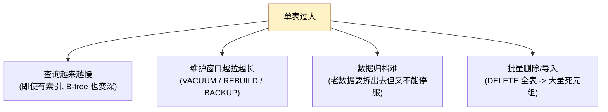
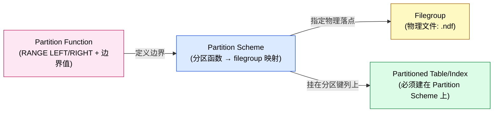

# PostgreSQL vs SQL Server 分区表实战：步骤、场景与差异对比

| 编写人 | 编写内容 | 编写时间 |
| --- | --- | --- |
| growdu | 初稿，结合 PostgreSQL 17 源码 + SQL Server 2022 文档 + Babelfish 兼容层实测 | 2026-08-24 |

> 本文是 [PostgreSQL 分区表：从一行 `PARTITION BY` 到路由热路径的全链路拆解](./postgresql-partition-handling/index.html) 的**前置文档**。那篇深挖内核源码、catalog、relcache、路由算法；这一篇专门讲**实战使用**——两边的步骤、典型场景、详细差异。

---

## 一、为什么需要分区表（PG 和 SQL Server 共用）

不管你最终用 PostgreSQL 还是 SQL Server，分区的根本动机都一样：**单表太大带来的连锁反应**。



分区表把上面这些问题逐一拆解：

| 问题 | 分区如何解决 |
| --- | --- |
| 查询慢 | **分区裁剪（partition pruning）**：谓词命中分区键时，只扫描相关分区而不是全表 |
| 维护慢 | **分区级维护**：单分区 REINDEX / VACUUM / BACKUP，秒级完成 |
| 数据归档 | **DETACH PARTITION**：把老分区从分区树里"摘"出来，变成普通表独立处理 |
| 批量删除 | **TRUNCATE 单个分区**：不写 WAL、瞬时完成，比 DELETE 快几个数量级 |
| 批量导入 | **分区级 INSERT / COPY**：bulk load 进单分区，省事省力 |

> 但分区**不是银弹**：分区键选择不当会导致数据倾斜、查询回退到全表扫描、join 变复杂。下面分别看 PG 和 SQL Server 是怎么落地的。

---

## 二、PostgreSQL 原生分区实战

### 2.1 三种分区策略

PG 10 起原生支持 `PARTITION BY` 三种策略：

```text
PARTITION BY { RANGE | LIST | HASH } ( <column_or_expr> )
```

| 策略 | 适用场景 | 典型例子 |
| --- | --- | --- |
| `RANGE` | 按连续区间（时间、数值）切 | 订单按月、按季度、按 ID 段 |
| `LIST` | 按离散枚举值切 | 按地区、按部门、按类别 |
| `HASH` | 数据无明显规律但要均匀分布 | 用户表按 `user_id % N` 切 |

PG 11 起支持 `HASH` 策略；PG 14 起支持 `PARTITION BY LIST` 的多列组合。

### 2.2 RANGE 分区：完整步骤

#### 步骤 1：建父表（声明分区策略 + 分区键）

```sql
CREATE TABLE orders (
    id          bigserial,
    region      text NOT NULL,
    order_date  date NOT NULL,
    amount      numeric(12, 2),
    PRIMARY KEY (id, order_date)   -- 注意：分区键必须包含在唯一约束里
) PARTITION BY RANGE (order_date);
```

> **关键约束**：PG 的分区键必须出现在任何唯一约束（PK / UNIQUE）里。这也是为什么上面 `PRIMARY KEY` 写成 `(id, order_date)` 而不是 `(id)`。

#### 步骤 2：建子分区

```sql
-- 2024 上半年
CREATE TABLE orders_2024_h1 PARTITION OF orders
    FOR VALUES FROM ('2024-01-01') TO ('2024-07-01');

-- 2024 下半年
CREATE TABLE orders_2024_h2 PARTITION OF orders
    FOR VALUES FROM ('2024-07-01') TO ('2025-01-01');

-- 2025 Q1
CREATE TABLE orders_2025_q1 PARTITION OF orders
    FOR VALUES FROM ('2025-01-01') TO ('2025-04-01');

-- 兜底：DEFAULT 分区
CREATE TABLE orders_default PARTITION OF orders DEFAULT;
```

#### 步骤 3：建本地索引（per-partition index）

```sql
-- 单分区索引
CREATE INDEX ON orders_2024_h1 (region);

-- 或者一次创建所有分区的索引（推荐）
CREATE INDEX ON orders (region);
```

第二条会自动在每个现有分区上建一个对应的本地索引，未来新 ATTACH 的分区不会自动继承——需要 `CREATE INDEX ... ON ONLY <parent>` 然后 `ALTER INDEX ... ATTACH PARTITION`。

#### 步骤 4：查询（自动 partition pruning）

```sql
EXPLAIN (COSTS OFF) SELECT count(*) FROM orders
 WHERE order_date BETWEEN '2024-08-01' AND '2024-08-31';

Append
  ->  Seq Scan on orders_2024_h2 orders
        Filter: ((order_date >= '2024-08-01') AND (order_date <= '2024-08-31'))
(2 rows)
```

PG 12+ 在很多情况下能做"**运行时**分区裁剪"（prepared statement / parameterized plan）。

#### 步骤 5：维护（ATTACH / DETACH / SPLIT）

```sql
-- 老分区 DETACH（变成普通表，可以 DROP、备份、archive）
ALTER TABLE orders DETACH PARTITION orders_2024_h1;
-- 注意：DETACH 后 stats 不再随父表更新，需要单独 ANALYZE

-- 新分区 ATTACH（要有匹配的边界）
CREATE TABLE orders_2025_q2 (LIKE orders INCLUDING ALL);
ALTER TABLE orders_2025_q2 ADD CONSTRAINT chk_2025_q2
    CHECK (order_date >= '2025-04-01' AND order_date < '2025-07-01');
ALTER TABLE orders ATTACH PARTITION orders_2025_q2
    FOR VALUES FROM ('2025-04-01') TO ('2025-07-01');

-- 拆一个分区为两个（SPLIT）
ALTER TABLE orders SPLIT PARTITION orders_2024_h1 INTO (
    PARTITION orders_2024_q1 FOR VALUES FROM ('2024-01-01') TO ('2024-04-01'),
    PARTITION orders_2024_q2 FOR VALUES FROM ('2024-04-01') TO ('2024-07-01')
);
```

> DETACH 是 PG 分区表的最大杀手锏：**零停服**地把老数据切走，比 SQL Server 的 SWITCH 更直接。

### 2.3 LIST 分区：地区分布

```sql
CREATE TABLE sensors (
    id         bigserial,
    region     text NOT NULL,
    value      numeric,
    ts         timestamptz NOT NULL,
    PRIMARY KEY (id, region)
) PARTITION BY LIST (region);

CREATE TABLE sensors_cn PARTITION OF sensors FOR VALUES IN ('CN','HK','TW');
CREATE TABLE sensors_us PARTITION OF sensors FOR VALUES IN ('US','CA');
CREATE TABLE sensors_eu PARTITION OF sensors FOR VALUES IN ('DE','FR','IT','UK');
CREATE TABLE sensors_default PARTITION OF sensors DEFAULT;
```

### 2.4 HASH 分区：均匀分布

```sql
CREATE TABLE user_events (
    id          bigserial PRIMARY KEY,
    user_id     bigint NOT NULL,
    event_type  text,
    payload     jsonb,
    created_at  timestamptz NOT NULL
) PARTITION BY HASH (user_id);

CREATE TABLE user_events_0 PARTITION OF user_events
    FOR VALUES WITH (MODULUS 4, REMAINDER 0);
CREATE TABLE user_events_1 PARTITION OF user_events
    FOR VALUES WITH (MODULUS 4, REMAINDER 1);
CREATE TABLE user_events_2 PARTITION OF user_events
    FOR VALUES WITH (MODULUS 4, REMAINDER 2);
CREATE TABLE user_events_3 PARTITION OF user_events
    FOR VALUES WITH (MODULUS 4, REMAINDER 3);
```

HASH 适合"无业务语义但必须均匀"的场景，比如用户维度。PG 11 起支持 HASH 分区，且**支持追加分区**（modulus 翻倍，remainder 不变）。

### 2.5 多级嵌套分区

```sql
-- 顶层按年
CREATE TABLE orders (...) PARTITION BY RANGE (order_date);
-- 第二层按 region
CREATE TABLE orders_2024 PARTITION OF orders
    FOR VALUES FROM ('2024-01-01') TO ('2025-01-01')
    PARTITION BY LIST (region);
CREATE TABLE orders_2024_cn PARTITION OF orders_2024
    FOR VALUES IN ('CN');
CREATE TABLE orders_2024_us PARTITION OF orders_2024
    FOR VALUES IN ('US');
```

PG 不限制嵌套层数，但**实际经验上** 2–3 层最常见。

### 2.6 PG 适用场景

| 场景 | 推荐策略 | 理由 |
| --- | --- | --- |
| 订单/日志按月 | `RANGE (order_date)` | 典型时间区间裁剪 |
| 订单按地区 + 时间 | `RANGE + LIST` 二级嵌套 | 地区裁剪 + 时间裁剪双管齐下 |
| 用户行为数据 | `HASH (user_id)` | 均匀分布，避免热点 |
| 字典表（状态/类型） | `LIST` | 离散枚举，少数固定值 |
| 时间序列 IoT 数据 | `RANGE (ts)` + 定期 `DETACH` 老分区 | 老数据独立归档 |

### 2.7 PG 的限制

- 唯一约束必须包含分区键（这意味着 `(id)` 单列 PK 在分区表上建不了）。
- 全局索引**不存在**（PG 没有跨所有分区的索引，只有 per-partition 本地索引）。
- HASH 分区不能直接"加一个新分区"，必须用 `PARTITION BY HASH (user_id)` 的初始定义决定 modulus。
- 没有"跨分区的全局唯一约束"。

---

## 三、SQL Server 分区实战

### 3.1 概念模型：三件套

SQL Server 的分区模型比 PG 多一层抽象：



- **Partition Function**：声明怎么切（`RANGE LEFT` / `RANGE RIGHT` + 边界值数组）。
- **Partition Scheme**：声明切完放哪儿（每个区间对应一个 filegroup）。
- **Filegroup**：物理文件组（一组 `.ndf` 文件）。

### 3.2 RANGE RIGHT 分区：完整步骤

#### 步骤 1：准备 filegroup（可选）

```sql
-- SQL Server 默认有 PRIMARY 一个 filegroup
-- 想物理隔离的话：先加 filegroup 和 data file
ALTER DATABASE SalesDB ADD FILEGROUP FG_2024;
ALTER DATABASE SalesDB
    ADD FILE (NAME = N'orders_2024', FILENAME = N'/var/opt/mssql/data/orders_2024.ndf',
              SIZE = 1GB, FILEGROWTH = 256MB) TO FILEGROUP FG_2024;
```

> 但**对小规模使用**，所有分区都放 PRIMARY 也是合法的（Babelfish 就是这么做的）。

#### 步骤 2：建 partition function

```sql
CREATE PARTITION FUNCTION pf_orders_date (date)
AS RANGE RIGHT
FOR VALUES ('2024-01-01', '2024-07-01', '2025-01-01');
```

> `RANGE RIGHT` 语义：`order_date < '2024-01-01'` → 段 1，`'2024-01-01' <= order_date < '2024-07-01'` → 段 2，以此类推。

#### 步骤 3：建 partition scheme

```sql
CREATE PARTITION SCHEME ps_orders_date
AS PARTITION pf_orders_date
ALL TO ([PRIMARY]);
-- 或者分别指定：
-- TO (FG_2023, FG_2024_h1, FG_2024_h2, FG_2025)
```

`ALL TO ([PRIMARY])` 等价于"所有段都放 PRIMARY"。如果想精细分配：

```sql
CREATE PARTITION SCHEME ps_orders_date
AS PARTITION pf_orders_date
TO (FG_2023, FG_2024_h1, FG_2024_h2, FG_2025);
-- 4 个段对应 4 个 filegroup，第 5 段（NEXT USED）需要 ALTER 之前单独指定
```

#### 步骤 4：建表（绑到 partition scheme）

```sql
CREATE TABLE dbo.orders (
    id          bigint IDENTITY(1,1) NOT NULL,
    region      nvarchar(20) NOT NULL,
    order_date  date NOT NULL,
    amount      decimal(12,2),
    CONSTRAINT PK_orders PRIMARY KEY CLUSTERED (id, order_date)
) ON ps_orders_date(order_date);
```

注意：`ON ps_orders_date(order_date)` 是把表绑到 scheme 上。

#### 步骤 5：建对齐（aligned）索引

```sql
CREATE INDEX IX_orders_region
ON dbo.orders (region)
ON ps_orders_date(order_date);   -- 索引也分区 + 对齐
```

**索引分区对齐**是 SQL Server 的核心概念——索引的分区函数必须和表一致，否则就是 non-aligned，丧失分区裁剪能力。

#### 步骤 6：分区裁剪

```sql
SELECT count(*) FROM dbo.orders
WHERE order_date BETWEEN '2024-08-01' AND '2024-08-31';
```

执行计划会显示 `$Partition.<part_number>` 谓词，自动只扫描相关分区。

#### 步骤 7：维护（SWITCH / SPLIT / MERGE）

```sql
-- 切换：把"老分区"零停服地搬到归档表
-- （比 PG 的 DETACH 更复杂，需要同 schema 同 CHECK）
CREATE TABLE dbo.orders_archive_2024_h1 (
    id bigint NOT NULL,
    region nvarchar(20) NOT NULL,
    order_date date NOT NULL,
    amount decimal(12,2)
);

-- 把 2024h1 这一段从 orders 切到 orders_archive_2024_h1
ALTER TABLE dbo.orders SWITCH PARTITION 2 TO dbo.orders_archive_2024_h1;
-- 秒级完成（仅修改 metadata，几乎无 IO）

-- 新加一段
ALTER PARTITION SCHEME ps_orders_date NEXT USED [PRIMARY];
ALTER PARTITION FUNCTION pf_orders_date() SPLIT RANGE ('2024-10-01');

-- 合并两个相邻段
ALTER PARTITION FUNCTION pf_orders_date() MERGE RANGE ('2024-04-01');
```

> **SWITCH** 是 SQL Server 分区的杀手锏：能在分区表之间**瞬时**"搬运"一整段数据。本质上是修改 partition metadata，几乎不挪数据。

### 3.3 切到不同 filegroup：磁盘隔离场景

```sql
-- 把老数据挪到慢盘（成本低）
ALTER PARTITION SCHEME ps_orders_date NEXT USED [SLOW_FG];
ALTER PARTITION FUNCTION pf_orders_date() SPLIT RANGE ('2024-01-01');
ALTER TABLE dbo.orders SWITCH PARTITION $PARTITION.pf_orders_date('2023-12-31')
    TO dbo.orders_cold PARTITION 1;
```

这个用法在 PG 里是没有的——PG 的分区只决定"哪些行在哪个 physical table"，不做磁盘级隔离。

### 3.4 SQL Server 适用场景

| 场景 | 推荐做法 |
| --- | --- |
| 订单/日志按月 | `RANGE RIGHT` + filegroup 隔离 |
| 多租户数据（按地区） | `RANGE` 或 `LIST`，每段独立 filegroup |
| 历史归档 | `SWITCH` 到归档表（meta-only 操作） |
| 跨分区查询 | 用 `$PARTITION.<func>(col)` 表达式 |
| 滚动窗口 | 周期 `ALTER PARTITION SCHEME ... NEXT USED` + `SPLIT RANGE` |

### 3.5 SQL Server 的限制

- 一张表只能挂**一个** partition scheme。
- SWITCH 要求源表和目标表**完全一致**（列、约束、索引、CHECK）。
- 唯一约束和主键**必须**包含分区键列（这一点和 PG 一致）。
- 不能用外键引用分区表（SQL Server 2016+ 才部分支持）。

---

## 四、详细差异对比

下面分多个维度把两边对照起来看。**这是本文的核心**。

### 4.1 概念模型

| 维度 | PostgreSQL | SQL Server |
| --- | --- | --- |
| 一级抽象 | `Partitioned Table` | `Partitioned Table` |
| 边界定义 | `PARTITION BY ... FOR VALUES ...`（内嵌） | 单独 `PARTITION FUNCTION` |
| 物理布局 | 自动（每个分区一个普通表，共享 `pg_class.relpartbound`） | 单独 `PARTITION SCHEME` 映射到 `FILEGROUP` |
| 分区文件 | 普通 heap table，没有 `.ndf` | 每个 filegroup 一组 `.ndf` |
| 分区数 | 实践无限制（理论 32K 个属性列约束） | 实践建议 ≤ 1000（partition function 边界数） |
| 嵌套分区 | 支持任意深度 | 不支持（只有一层） |

### 4.2 创建语法

| 维度 | PostgreSQL | SQL Server |
| --- | --- | --- |
| 策略枚举 | `RANGE` / `LIST` / `HASH` | 只有 `RANGE`（用 `LEFT`/`RIGHT` 模拟 LIST 的语义） |
| 区间端点 | `FROM (a) TO (b)` 显式 | `FOR VALUES (a, b, ...)` 列表 |
| 端点方向 | 永远是 `[from, to)` | `RANGE LEFT` / `RANGE RIGHT` 切换 |
| 默认分区 | `PARTITION ... DEFAULT` | 无（要兜底需要 `LEFT` 边界或加一个虚拟边界） |
| HASH 分区 | 内置 `PARTITION BY HASH` + `MODULUS/REMAINDER` | 无（要自己写计算列或 view） |
| 多列分区键 | RANGE/LIST 支持 | RANGE 支持（多列边界数组） |
| 表达式分区键 | 支持（`PARTITION BY RANGE (date_trunc('month', ts))`） | 不支持（必须是基础列） |

**示例对比**：

```sql
-- PG: 表达式分区键
CREATE TABLE events (...)
PARTITION BY RANGE (date_trunc('month', ts));

-- SQL Server: 不支持表达式，只能建一个计算列
ALTER TABLE events ADD ts_month AS date_trunc(month, ts) PERSISTED;
CREATE PARTITION FUNCTION pf_events (datetime) AS RANGE RIGHT FOR VALUES (...);
```

### 4.3 索引

| 维度 | PostgreSQL | SQL Server |
| --- | --- | --- |
| 全局索引 | ❌ 不支持 | ✅ 支持（但会牺牲分区裁剪） |
| 本地索引 | ✅（自动） | ✅（必须显式指定 `ON scheme(col)`） |
| 索引自动跟随分区 | 父表上建索引会自动建到所有当前分区 | 必须显式建到每个 partition，或用对齐索引 |
| 主键包含分区键 | ✅ 强制 | ✅ 强制 |
| 跨分区唯一约束 | ❌ | ❌（只能靠分区键 + 表内约束） |

### 4.4 维护操作

| 操作 | PostgreSQL | SQL Server |
| --- | --- | --- |
| 新增分区 | `CREATE TABLE ... PARTITION OF ...` 或 `ATTACH PARTITION` | `ALTER PARTITION SCHEME NEXT USED` + `ALTER PARTITION FUNCTION SPLIT RANGE` |
| 删除分区 | `DROP TABLE partition` 或 `DETACH PARTITION` | `ALTER PARTITION FUNCTION MERGE RANGE`（合并相邻段） |
| 老分区归档 | `DETACH PARTITION`（meta-only） | `SWITCH PARTITION n TO archive_table`（meta-only） |
| 跨分区搬运 | `ATTACH PARTITION`（要匹配 CHECK） | `SWITCH`（要完全 schema 一致） |
| 拆分区 | `SPLIT PARTITION ... INTO (...)` | `SPLIT RANGE`（一次切一刀） |
| 合并分区 | `MERGE PARTITIONS (...) INTO ...` | `MERGE RANGE`（一次合一段） |
| 整体重命名分区 | `ALTER TABLE ... RENAME PARTITION` | 不支持（分区没有名字，只能用 `$PARTITION.<func>(val)` 引用） |
| 并行重建索引 | `REINDEX TABLE CONCURRENTLY`（PG 12+） | `ALTER INDEX ... REBUILD PARTITION = n WITH (ONLINE = ON)` |

### 4.5 查询与执行计划

| 维度 | PostgreSQL | SQL Server |
| --- | --- | --- |
| 静态分区裁剪 | ✅（query parse 阶段） | ✅ |
| 运行时分区裁剪 | ✅（prepared statement / PG 12+） | ✅（`Parameter Sensitivity` 优化） |
| `EXPLAIN` 中可见 | `EXPLAIN` 显式列出每个分区的 plan | `Execution Plan` 里 `$Partition.<func>(col)` 谓词 |
| 跨分区聚合 | 需要 `append` node 处理 | 需要 `$Partition.<func>(col)` group by |
| 分区并行扫描 | ✅ 多 worker 并行（PG 14+） | ✅ 多线程并行 |

**PG `EXPLAIN` 输出**：
```text
Append
  ->  Index Scan using orders_2024_h2_region_idx on orders_2024_h2 orders
        Index Cond: (region = 'CN')
  ->  Index Scan using orders_2024_h1_region_idx on orders_2024_h1 orders
        Index Cond: (region = 'CN')
```

**SQL Server Execution Plan**（节选）：
```text
Index Seek [IX_orders_region]
  Predicate: [$Partition.[pf_orders_date](order_date) = 3]
```

### 4.6 `$PARTITION` 函数

两边都有同名函数，但语义略有差异：

| 维度 | PostgreSQL | SQL Server |
| --- | --- | --- |
| 函数名 | 无原生函数（要写 SQL `CASE`） | `$PARTITION.<func_name>(col)` |
| 返回值 | — | 1-based 段号 |
| 内部实现 | — | 直接调 partition function 的二分查找 |
| 适用范围 | — | 只对定义了 partition function 的表有效 |

**Babelfish 的 PG 端口**：通过 `$PARTITION.<func_name>(col)` 调用 `bbf_partition_function_invoke`，直接复用了 PG 内核的 `partition_range_datum_bsearch`。

### 4.7 与视图/外键的关系

| 维度 | PostgreSQL | SQL Server |
| --- | --- | --- |
| 分区表上建视图 | ✅ | ✅ |
| 分区表更新视图 | 视图需 `INSTEAD OF` trigger | 视图需 `INSTEAD OF` trigger |
| 外键引用分区表 | ✅（PG 12+，但目标表必须是同一 partition tree） | ❌（SQL Server 2016+ 部分支持） |
| 分区表做外键引用 | ✅（PG 12+） | ✅ |

### 4.8 性能与运维

| 维度 | PostgreSQL | SQL Server |
| --- | --- | --- |
| 大批量 INSERT | COPY 比 INSERT 快几倍 | `BULK INSERT` / `INSERT ... SELECT ... ORDER BY` |
| 分区级统计信息 | 每个分区单独的 `pg_statistic` | 每个分区有独立 histogram |
| ANALYZE 单分区 | `ANALYZE partition_name`（PG 11+） | `UPDATE STATISTICS table WITH SAMPLE ...` |
| 备份单分区 | pg_dump 支持 `--table=partition_name` | 文件级复制 `.ndf` + `BACKUP ... FILEGROUP = ...` |
| 恢复单分区 | 通过 pg_restore 单表恢复 | `RESTORE ... FILEGROUP = ...`（但要配合完整恢复模式） |
| 高可用 | 流复制 + 分区表透传 | AlwaysOn AG + 分区表需要每个副本维护 |
| 在线分区切换 | `ATTACH PARTITION ... DEFAULT` 可以做 | `SWITCH` 是 metadata only，秒级 |
| 完整数据归档 | `DETACH PARTITION` + `pg_dump -t` | `SWITCH TO archive_table` |

### 4.9 限制对比

| 限制 | PostgreSQL | SQL Server |
| --- | --- | --- |
| 最大分区数 | 实际经验 ≤ 数百（受 catalog 大小限制） | ≤ 1000（官方建议），理论上 15000 |
| 单表最大行数 | 无（受 `bigint` 限制） | 无 |
| 全局索引 | ❌ | ✅（但代价是失去分区裁剪） |
| 多列分区键 | ✅ RANGE/LIST | ✅ RANGE |
| 表达式分区键 | ✅ | ❌（要用计算列） |
| HASH 分区 | ✅（`PARTITION BY HASH`） | ❌（要靠视图或应用层） |
| 嵌套分区 | ✅（任意深度） | ❌ |
| 跨分区唯一约束 | ❌ | ❌ |
| LIST 多列 | ✅（PG 14+） | ❌（只有 RANGE 多列） |
| 子分区 | ✅ | ❌ |

### 4.10 Babelfish 兼容层

如果你跑 Babelfish（TDS 端口），SQL Server 的 T-SQL 分区语法（`CREATE PARTITION FUNCTION` / `CREATE PARTITION SCHEME`）可以直接用。但要注意：

- `ALL TO ([PRIMARY])`：Babelfish 不创建真正的 filegroup，全部落到 primary。
- `SWITCH PARTITION`：Babelfish 不支持（PG 也没有等价物，需要走 `DETACH PARTITION` + ATTACH 路径）。
- 表达式分区键：Babelfish 把 T-SQL `AS RANGE RIGHT FOR VALUES (...)` 翻译成 PG `FOR VALUES FROM ... TO ...`，所以**分区列必须 NOT NULL**（PG 限制）。
- `sys.partition_functions` / `sys.partition_range_values` / `sys.partition_schemes` / `sys.destination_data_spaces` 这些视图在 Babelfish 里都实现了。

详见 [PostgreSQL 分区表：从一行 `PARTITION BY` 到路由热路径的全链路拆解](./postgresql-partition-handling/index.html) 的第十一节。

---

## 五、迁移场景

### 5.1 SQL Server → PostgreSQL

**典型路径**：

```text
SQL Server 分区表
   ↓ babelfish / SSMA / 自研 ETL
PostgreSQL 原生分区表
```

**翻译要点**：

| SQL Server 元素 | PostgreSQL 对应 |
| --- | --- |
| `PARTITION FUNCTION` 的边界列表 | 一组 `PARTITION OF ... FOR VALUES FROM ... TO ...` |
| `PARTITION SCHEME` 的 filegroup | （不需要翻译，全是逻辑分区） |
| `RANGE LEFT FOR VALUES (a, b)` | `(... a]`, `(a b]`, `(b ...)` 三段 |
| `RANGE RIGHT FOR VALUES (a, b)` | `(... a)`, `[a b)`, `[b ...)` 三段 |
| `SWITCH PARTITION n TO archive` | `ALTER TABLE ... DETACH PARTITION xxx`，然后另存 |
| `ALTER PARTITION FUNCTION SPLIT RANGE (c)` | 新建一个 `PARTITION OF ... FOR VALUES FROM ... TO ...`，或者 `ALTER TABLE ... ATTACH PARTITION ...` |
| `nonclustered index ... ON ps(col)` | 本地索引 `CREATE INDEX ... ON parent (col)` |
| `$PARTITION.<func>(col)` | 需要自己写 SQL：找出 key 值对应的 partition name |

### 5.2 PostgreSQL → SQL Server

**典型路径**：

```text
PG 原生分区表
   ↓ 导出 + 转换
SQL Server 分区表
```

**翻译要点**：

| PostgreSQL 元素 | SQL Server 对应 |
| --- | --- |
| `PARTITION BY RANGE (col)` | `CREATE PARTITION FUNCTION ... AS RANGE RIGHT FOR VALUES (...)` |
| `PARTITION BY LIST (col)` | 通常翻译成 `RANGE RIGHT` 用单值边界（没有真正的 LIST 策略） |
| `PARTITION BY HASH (col)` | 要么建计算列 + RANGE（人工切），要么用视图模拟 |
| 多列分区键 | `RANGE (col1, col2)`（SQL Server 也支持） |
| 表达式分区键 | 先建 `PERSISTED` 计算列 |
| DEFAULT 分区 | 加一个虚拟边界 + `LEFT`，或建独立归档视图 |
| `DETACH PARTITION` | `SWITCH PARTITION ... TO archive_table`（要同 schema） |
| `ATTACH PARTITION` | `ALTER PARTITION FUNCTION SPLIT RANGE` + 数据搬运 |
| 本地索引 | `CREATE INDEX ... ON ps(col)`（对齐） |
| 嵌套分区 | ❌ 必须"拍平"为单层（重新设计） |

### 5.3 Babelfish 兼容路径（同库兼容）

如果你同时维护 SQL Server 和 PG 两套客户的兼容性，Babelfish 是个好东西：

- 客户写 T-SQL `CREATE PARTITION FUNCTION/SCHEME + CREATE TABLE ... ON ps(col)` → Babelfish 翻译成 PG 原生分区。
- 同一份 catalog 在两个端口都能查（PG 端口看 `pg_partitioned_table` + `pg_inherits`，TDS 端口看 `sys.partition_functions` + `sys.partition_schemes`）。
- `$PARTITION.<func>(col)` 在 TDS 端口直接可用。

但有两点要注意：

1. **Babelfish 的 filegroup 是装饰**：所有分区都落 primary，没有真正的物理隔离。
2. **Babelfish 不支持 SWITCH**：要归档老数据，得用 PG 的 `DETACH PARTITION`（从 PG 端口操作），或者写 ETL。

---

## 六、选型建议

### 6.1 选 PostgreSQL 当

- 数据规模 < 100 TB，单表行数 < 10 亿。
- 需要**真嵌套分区**（多维度裁剪）。
- 想要**真 HASH 分区**。
- 想用 `DETACH PARTITION` 做零停服归档。
- 不需要跨分区的全局索引。
- 团队更熟悉 PG 生态（pg_dump、pg_restore、流复制）。

### 6.2 选 SQL Server 当

- 已经在 Microsoft 生态里（AD、SSIS、SSRS、Power BI）。
- 需要**跨分区的全局索引**（虽然会牺牲分区裁剪）。
- 需要**真实 filegroup 物理隔离**（老数据上慢盘）。
- 想要 `SWITCH PARTITION` 做 meta-only 归档。
- 接受 ≤ 1000 分区的硬性上限。
- 需要 Enterprise Edition 的高级特性（在线重建、压缩等）。

### 6.3 选 Babelfish 当

- 已经有用 SQL Server 的应用，想平滑迁移到 PG（保留 T-SQL 兼容性）。
- 数据规模中等，不需要真 filegroup 隔离。
- 团队同时会写 T-SQL 和 PL/pgSQL。
- 接受 Babelfish 一些限制（无 SWITCH、无真 filegroup、表达式分区键有限）。

---

## 七、最佳实践对照

### 7.1 PostgreSQL 最佳实践

- **分区键选择**：优先用 `RANGE (timestamp)`，配合 `created_at`/`updated_at`。避免用高基数列（HASH 除外）。
- **分区粒度**：单个分区建议在 10 GB – 100 GB 之间，分区数控制在 50–100。
- **本地索引**：在父表上建 `CREATE INDEX` 会自动应用到所有现有分区，新分区需要单独 ATTACH。
- **约束 + 分区**：CHECK 约束是 DETACH/ATTACH 的必备，写法要和 `FROM ... TO ...` 边界一致。
- **统计信息**：分区裁剪依赖每分区的 `pg_statistic`，定期 `ANALYZE`。
- **备份策略**：`pg_dump --table=partition_name` 或文件系统级 tar 备份。
- **滚动窗口**：每月底跑 `DETACH` 老月 + `ATTACH` 新月，配合 cron。

### 7.2 SQL Server 最佳实践

- **分区键选择**：和 PG 类似，优先 `RANGE RIGHT (date_col)`。
- **分区粒度**：单分区 10 GB – 100 GB，分区数 ≤ 1000。
- **对齐索引**：每个 `CREATE INDEX` 都要 `ON ps(col)`，否则失去裁剪。
- **统计信息**：`UPDATE STATISTICS table WITH FULLSCAN` 或周期重建。
- **备份策略**：用 filegroup 级别 `BACKUP ... FILEGROUP = ...` 做增量。
- **滚动窗口**：每月跑 `ALTER PARTITION SCHEME NEXT USED` + `SPLIT RANGE`。
- **归档**：用 `SWITCH` 切到归档表（meta-only）。
- **在线重建**：`ALTER INDEX ... REBUILD PARTITION = n WITH (ONLINE = ON, RESUMABLE = ON)`。

---

## 八、一句话总结

| 维度 | PostgreSQL | SQL Server |
| --- | --- | --- |
| 抽象模型 | 内嵌 `PARTITION BY` | 三件套 `FUNCTION + SCHEME + FILEGROUP` |
| 策略支持 | RANGE / LIST / HASH + 嵌套 | 只有 RANGE |
| 杀手锏 | `DETACH PARTITION`（零停服归档） | `SWITCH PARTITION`（meta-only 切走） |
| 全局索引 | ❌ | ✅ |
| 物理隔离 | ❌ | ✅（filegroup → 多个 .ndf） |
| 表达式分区键 | ✅ | ❌ |
| 嵌套分区 | ✅ | ❌ |
| 最大分区数 | 数百（实际） | 1000（官方建议） |
| 兼容层 | — | Babelfish（PG 端口兼容 T-SQL） |

如果你的系统已经"在分区的刀刃上跳舞"（即单分区不是 1 GB 而是 100 GB），两边都有成熟方案。但 PG 的 `DETACH PARTITION` 在归档场景里**真的**比 SQL Server 的 `SWITCH` 更直接——前者"摘下来就是普通表"，后者"切过去还要配对 schema"。

> 完整的内核源码级拆解见 [PostgreSQL 分区表：从一行 `PARTITION BY` 到路由热路径的全链路拆解](./postgresql-partition-handling/index.html)。
