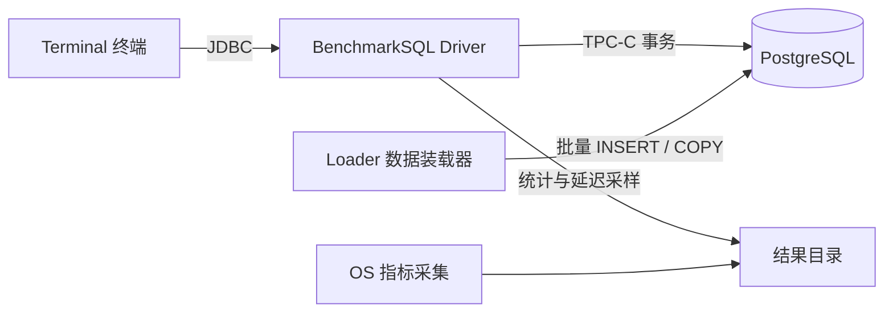
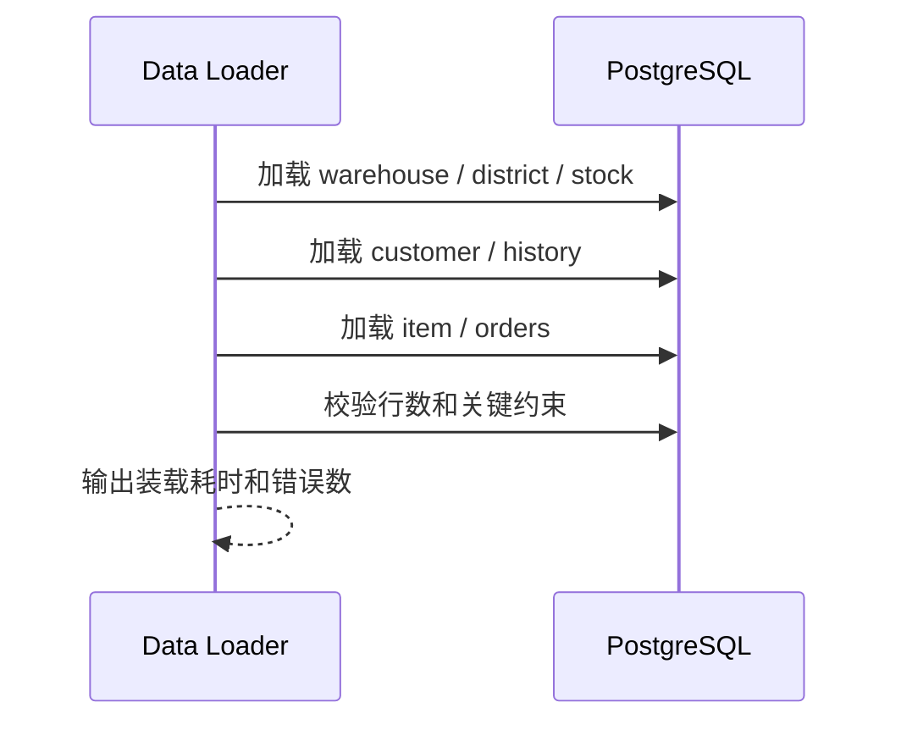
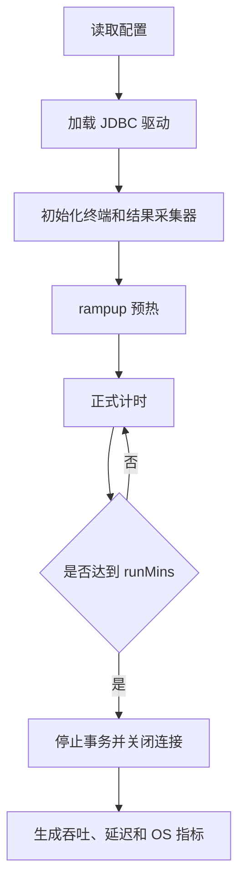
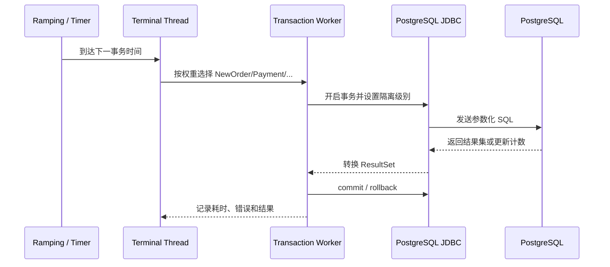
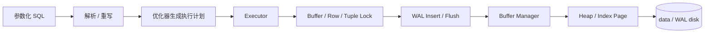
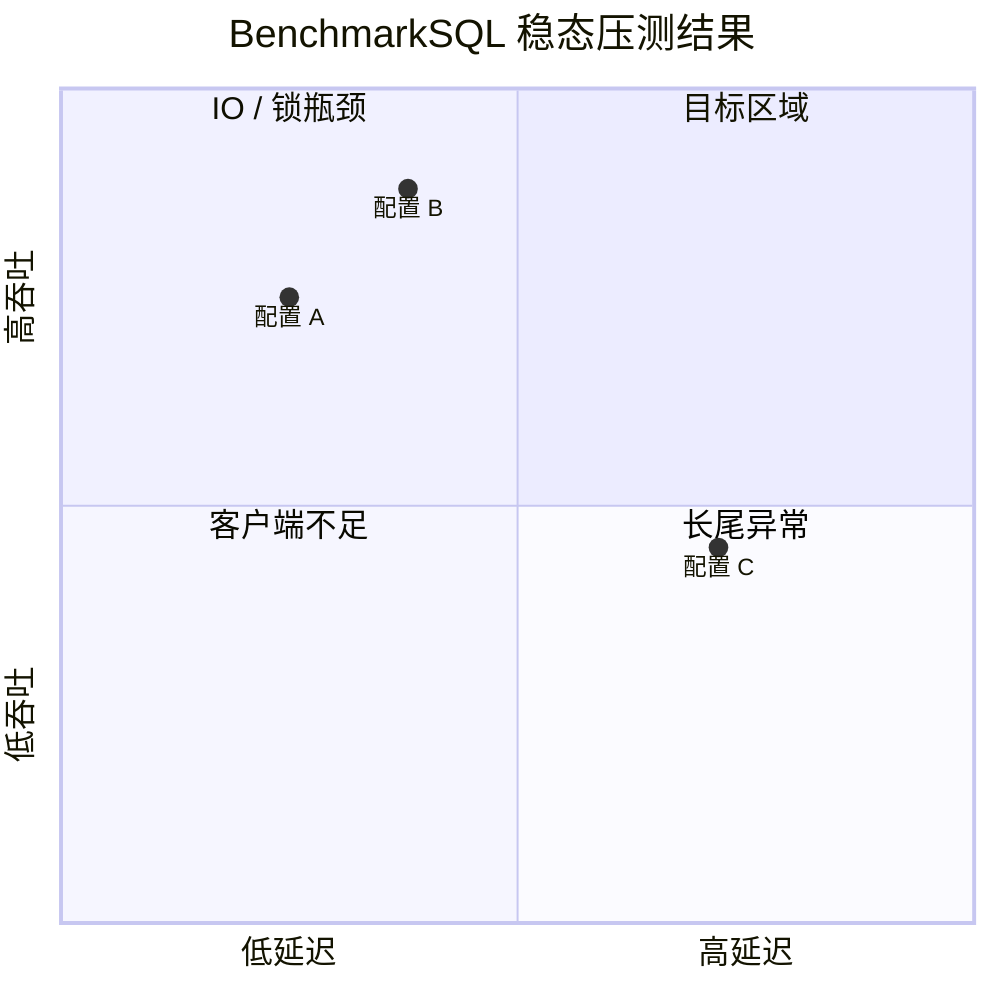
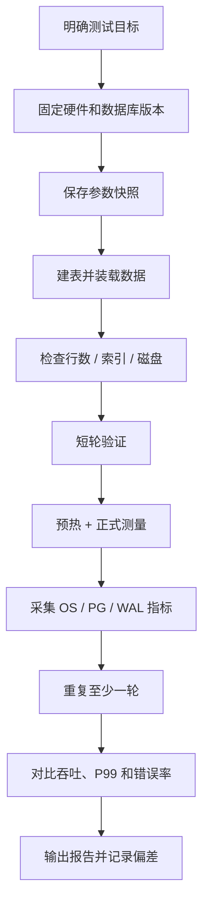

# BenchmarkSQL 使用教程：从配置到运行机制分析

> 本文介绍如何使用 BenchmarkSQL 对 PostgreSQL 进行 TPC-C 压测，重点覆盖配置、数据装载、运行命令、执行链路、结果分析和常见故障排查。
>
> BenchmarkSQL 不等于数据库性能测试的“万能答案”。只有把测试目标、硬件环境、数据库参数、数据规模和统计口径固定下来，得到的吞吐量和延迟才具有比较价值。

## 1. BenchmarkSQL 是什么

BenchmarkSQL 是一个基于 Java 的数据库基准测试工具，主要用于模拟 TPC-C 规范定义的电商订单处理业务。它通过 JDBC 驱动连接数据库，因此除了 PostgreSQL，也可以通过适配驱动测试其他关系型数据库。

TPC-C 场景可以抽象为一个具有多个仓库（Warehouse）的销售系统：

- 每个仓库拥有 10 个区域（District）；
- 每个区域服务约 3,000 个客户（Customer）；
- 商品（Item）可以跨仓库共享；
- 每个仓库维护自己的库存（Stock）；
- 订单（Order）可以产生明细（Order Line）、历史（History）和新订单状态；
- 终端（Terminal）代表并发客户端，持续提交不同类型的业务事务。



### 1.1 TPC-C 的五类事务

BenchmarkSQL 默认实现以下五类事务：

| 事务 | 默认权重 | 业务含义 | 典型数据操作 |
| --- | ---: | --- | --- |
| New Order | 45% | 创建订单 | 插入订单、明细和 New Order 状态 |
| Payment | 43% | 客户付款 | 更新客户余额，更新仓库/区域统计 |
| Order Status | 4% | 查询订单状态 | 读取客户、订单和订单明细 |
| Delivery | 4% | 发货并更新余额 | 批量更新订单和客户状态 |
| Stock Level | 4% | 查询库存低于阈值的商品 | 读取区域订单和库存 |

默认权重是基准场景的近似比例，不是必须严格遵守的业务比例。需要模拟真实业务时，可以通过参数调整事务比例。

## 2. 压测前准备

### 2.1 准备测试环境

建议至少准备以下组件：

1. 一套独立部署的 PostgreSQL 实例；
2. BenchmarkSQL 运行主机；
3. 与生产环境同规格或明确标注差异的 CPU、内存和磁盘；
4. 一块足够大的数据盘，建议预留装载数据空间和 WAL 空间；
5. 统一的系统时间、NTP 和操作系统参数；
6. 一份测试记录表。

不要直接在生产库上执行 `runLoader.sh` 或 `runSQL.sh`。装载器会产生大量表、索引、约束和数据，极端情况下会造成磁盘、IOPS、WAL 和锁资源耗尽。

### 2.2 安装 Java 和构建工具

BenchmarkSQL 5.x 通常使用 Java 11 或更高版本。确认 Java 和 Gradle 环境：

```bash
java -version
./gradlew --version
```

如果使用系统安装的构建工具，也可以执行：

```bash
gradle -version
```

获取源码后先构建：

```bash
./gradlew clean assemble
```

构建产物通常位于 `build/` 或 `build/libs/`。不同版本目录可能略有差异，应以当前版本的构建输出为准。

### 2.3 PostgreSQL 基础配置

在测试实例上准备专用数据库和用户：

```sql
CREATE ROLE benchmarksql LOGIN PASSWORD 'change-me';
CREATE DATABASE benchmarksql OWNER benchmarksql;
```

如果测试机和数据库在同一台机器上，可以让 `pg_hba.conf` 使用本地 `trust`；如果是远程连接，则使用最小权限的专用账号。不要在配置文件中使用数据库超级用户作为压测用户。

下面是常见的测试前检查项：

```sql
SHOW server_version;
SHOW shared_buffers;
SHOW max_connections;
SHOW checkpoint_timeout;
SHOW checkpoint_completion_target;
SHOW synchronous_commit;
SHOW fsync;
```

建议根据测试目标检查：

| 参数 | 检查目的 |
| --- | --- |
| `max_connections` | 是否容纳 `terminals`、装载线程和后台连接 |
| `shared_buffers` | 缓存热数据和索引，不应盲目设置过大 |
| `effective_cache_size` | 供规划器估算 OS 页面缓存，不是实际分配量 |
| `work_mem` | 排序、哈希等算子单次操作的内存上限 |
| `maintenance_work_mem` | 建索引、装载和 VACUUM 等维护操作内存 |
| `checkpoint_timeout` | 控制检查点周期，过短会增加 WAL 和 IO |
| `checkpoint_completion_target` | 平滑刷脏页，避免集中式 IO 抖动 |
| `wal_compression` | 视 CPU 和 WAL 空间权衡 |
| `track_io_timing` | 开启 IO 耗时采样，便于 pgBench/BenchmarkSQL 对照分析 |

如果目标是模拟“低延迟提交”，可以评估 `synchronous_commit=off`；如果目标是验证崩溃安全和 WAL 路径，就不能关闭 `synchronous_commit` 或 `fsync`。这些参数必须写入测试记录，不能在不同轮次中隐式改变。

## 3. 配置 BenchmarkSQL

BenchmarkSQL 使用属性文件配置数据库连接、事务比例、并发数和数据规模。不同版本的参数名可能存在差异，可通过当前版本的 `README`、`props` 模板和脚本帮助信息确认。

### 3.1 PostgreSQL 最小配置示例

```properties
# 数据库类型
db=postgres

# JDBC 驱动和连接
driver=org.postgresql.Driver
conn=jdbc:postgresql://127.0.0.1:5432/benchmarksql
user=benchmarksql
password=change-me

# 数据规模
warehouses=10

# 装载和运行并发
loadWorkers=4
terminals=20

# 运行时间
rampupMins=2
runMins=10

# 采样和输出
measureIntervalSec=2
histograms=true
resultDirectory=./results/pg-10w
```

关键参数说明：

| 参数 | 作用 | 调参建议 |
| --- | --- | --- |
| `db` | 数据库方言 | PostgreSQL 使用 `postgres` |
| `driver` | JDBC 驱动类 | PostgreSQL 使用 `org.postgresql.Driver` |
| `conn` | JDBC URL | 包含主机、端口、数据库名，必要时增加参数 |
| `warehouses` | 仓库数量 | 同时影响数据规模和并发热点数量 |
| `loadWorkers` | 数据装载并发 | 受 CPU、磁盘和 checkpoint 影响 |
| `terminals` | 压测终端数量 | 最终有效并发主要受该参数控制 |
| `rampupMins` | 预热时间 | 让缓存、连接和 JIT 进入稳定状态 |
| `runMins` | 正式测量时间 | 时间越长越容易观察稳态，但成本更高 |
| `resultDirectory` | 结果目录 | 每次测试使用独立目录，避免覆盖结果 |

不要把真实生产密码直接提交到 Git。测试环境也应使用专用密码，并通过临时权限或受控的配置管理系统注入。

### 3.2 终端与仓库映射

BenchmarkSQL 的终端可以选择固定服务一个仓库，也可以让终端随机选择仓库：

- 固定仓库：并发更容易集中到少量仓库，适合观察热点和锁竞争；
- 随机仓库：数据访问更均匀，接近多仓库并行工作的场景。

如果所有终端固定访问同一个 Warehouse，Warehouse 很可能成为热点。Warehouse 数量、`terminals` 和事务比例必须一起规划。

### 3.3 事务比例配置

某些版本支持通过 `transaction` 配置或 `*Weight` 类参数调整事务比例，例如：

```properties
newOrderWeight=45
paymentWeight=43
orderStatusWeight=4
deliveryWeight=4
stockLevelWeight=4
```

先确认当前版本实际支持的参数名，再进行修改。事务比例改变后，吞吐量的业务含义也会改变。例如，把 Payment 提升到 90% 后，结果不能直接与默认 TPC-C 比例比较。

## 4. 创建表、索引和数据

### 4.1 初始化数据库结构

不同版本可能提供通用的建表脚本或 `runSQL.sh`。常见流程是先执行建表脚本，再执行装载器：

```bash
./runSQL.sh -c ./props/pg.properties \
  -f ./sqlTableCreates.sql
```

如果仓库没有 `sqlTableCreates.sql`，可从当前版本对应的 PostgreSQL SQL 目录中执行建表脚本。执行前先确认：

- 表空间和 schema 是否正确；
- 主键、唯一约束和外键是否创建；
- 索引是否与压测版本一致；
- 扩展或数据库对象是否会改变性能。

### 4.2 装载基础数据

装载命令通常由 `runLoader.sh` 提供：

```bash
./runLoader.sh ./props/pg.properties
```

装载过程大致分为以下阶段：



`loadWorkers` 越大，装载并发越高，但也越容易出现：

- CPU 或内存成为瓶颈；
- WAL 写入跟不上；
- checkpoint 导致 IO 毛刺；
- 表和索引膨胀；
- 装载器连接数超过数据库限制。

### 4.3 验证数据规模

装载完成后可以检查表行数：

```sql
SELECT relname, n_live_tup
FROM pg_stat_user_tables
ORDER BY n_live_tup DESC;
```

再检查数据库大小和 WAL：

```sql
SELECT pg_size_pretty(pg_database_size(current_database())) AS database_size;
SELECT pg_walfile_name(pg_current_wal_lsn()) AS current_wal_file;
```

PostgreSQL 不存在通用的 `0/0` 作为历史 WAL 起点的可靠查询方式。更可靠的做法是记录装载前后的 LSN 并计算差值。

## 5. 运行 BenchmarkSQL

### 5.1 正式运行

基本命令：

```bash
./runBenchmark.sh -c ./props/pg.properties
```

运行生命周期如下：



建议至少执行三轮：

1. 短轮：确认配置、权限和结果文件正确；
2. 稳态轮：使用正式参数，预热后测量 10 至 30 分钟；
3. 重复轮：在相同条件下至少再执行一次，验证结果是否可复现。

### 5.2 运行中的现象

运行过程中应关注：

- 客户端是否真的达到目标 `terminals`；
- 是否出现 JDBC 重试、连接重置或事务回滚；
- 数据库 CPU 是否饱和；
- 磁盘延迟、IOPS、util 和 WAL 写入是否异常；
- checkpoint 是否周期性造成延迟尖峰；
- 锁等待、deadlock、long-running transaction 是否出现；
- 连接数是否接近 `max_connections`；
- 数据库是否发生 OOM、OOM killer 或主备复制延迟。

### 5.3 事务结果格式

结果通常按事务类型统计：

```text
Throughput (Requests/Second): 12345.67
```

不同版本可能输出 `Transactions Per Minute (tpmC)`、平均延迟、90/95/99 分位数、最大延迟、错误数和成功数。应以当前版本实际输出为准，但至少记录：

| 指标 | 含义 |
| --- | --- |
| 总吞吐 | 单位时间完成的事务数 |
| tpmC | 每分钟完成的新订单事务数，通常作为 TPC-C 吞吐指标 |
| 平均延迟 | 所有成功请求的平均耗时 |
| P95 / P99 | 长尾延迟，比平均值更能暴露周期性抖动 |
| 错误数 | SQL 错误、连接错误、事务回滚等 |
| 吞吐变化 | 预热后吞吐是否持续下降 |

## 6. 运行机制和执行链路

### 6.1 BenchmarkSQL 的线程模型

BenchmarkSQL 的核心是多个 Terminal 线程。每个 Terminal 线程按照随机分布选择事务类型，并维护自己的连接和事务状态：



需要区分两个并发概念：

- `terminals` 是 BenchmarkSQL 创建的逻辑终端数量；
- 数据库实际活跃会话数还受事务执行时间、连接池、锁等待和数据库限制影响。

因此，`terminals=100` 不等于数据库始终有 100 个活跃查询。

### 6.2 事务为什么集中在 New Order 和 Payment

New Order 和 Payment 合计占默认事务权重的 88%。这意味着大部分请求会读写订单、客户、库存和余额数据。

New Order 的典型访问路径：

```text
读取 customer
  -> 查询 warehouse / district
  -> 更新 district next_o_id
  -> 随机读取 item / stock
  -> 写 order / new_order
  -> 写 order_line
  -> 扣减 stock
  -> 提交
```

Payment 的典型访问路径：

```text
按 customer_id 或 last name 查找客户
  -> 更新 customer 余额和支付次数
  -> 更新 warehouse / district 年度统计
  -> 写 history
  -> 提交
```

这两类事务会集中访问：

- Warehouse 的 `w_id`；
- District 的 `d_w_id`、`d_id`；
- Customer 的 `c_w_id`、`c_d_id`；
- Stock 的 `s_w_id`、`s_i_id`；
- Order 的 `o_w_id`、`o_d_id`。

如果这些字段缺少合适索引，或者大量终端固定到一个 Warehouse，锁等待和热点会迅速放大。

### 6.3 PostgreSQL 中的关键机制

BenchmarkSQL 只是客户端负载生成器，最终性能由数据库和操作系统共同决定。



#### 6.3.1 事务与可见性

New Order 和 Payment 提交后，MVCC 依赖 `xmin/xmax`、CLOG 和快照判断其他事务是否可见。并发越高，快照和 Heap Tuple 的可见性判断越重要。

#### 6.3.2 锁与热点

常见热点包括：

- District 的 `next_o_id` 更新；
- Warehouse 的 `w_ytd` 更新；
- Stock 的 `s_quantity` 更新；
- Customer 余额和支付次数更新。

这些更新可能产生行级锁等待。应通过 `pg_stat_activity`、`pg_locks`、`pg_blocking_pids()` 观察等待关系，而不是只根据 CPU 判断瓶颈。

```sql
SELECT pid, usename, wait_event_type, wait_event, state, query
FROM pg_stat_activity
WHERE wait_event IS NOT NULL
ORDER BY pid;
```

#### 6.3.3 WAL 与 checkpoint

事务提交通常会触发 WAL 插入、刷盘策略和检查点协作。高并发下需要同时观察：

- WAL 生成速率；
- WAL 目录剩余空间；
- `pg_stat_wal`；
- checkpoint 写脏页量；
- IO 延迟和 fsync 延迟；
- `synchronous_commit` 的配置。

```sql
SELECT * FROM pg_stat_wal;
SELECT checkpoints_timed, checkpoints_req, checkpoint_write_time,
       checkpoint_sync_time, buffers_checkpoint
FROM pg_stat_bgwriter;
```

PostgreSQL 版本较新时，部分检查点指标可能位于 `pg_stat_checkpointer`：

```sql
SELECT * FROM pg_stat_checkpointer;
```

## 7. 负载生成与结果采集

### 7.1 参数化 SQL

BenchmarkSQL 生成的 SQL 通常使用 JDBC `PreparedStatement`。这样做的好处是：

- 避免手工拼接用户输入；
- 减少 SQL 解析和重写开销；
- 便于驱动复用执行计划；
- 更容易定位绑定参数和 SQL 执行异常。

但“使用 PreparedStatement”不等于“数据库一定复用计划”。PostgreSQL 仍会根据统计信息、参数变化和执行计划代价决定使用通用计划还是定制计划。

### 7.2 预热阶段

`rampupMins` 的目的不是让结果数字变大，而是让系统进入相对稳定状态：

- 热数据进入 shared buffers 和 OS page cache；
- SQL 执行计划完成首次编译和统计；
- JVM JIT 开始生效；
- JDBC 和 PostgreSQL 连接达到稳定数量；
- 后台进程、checkpoint 和 autovacuum 进入正常工作节奏。

预热时间过短会把冷启动误认为稳态吞吐；预热时间过长则会增加测试成本。

### 7.3 OS 指标

建议在数据库主机和客户端主机分别采集：

```bash
mpstat -P ALL 1
iostat -x 1
vmstat 1
pidstat -dur 1
sar -n DEV 1
```

至少记录：

| 维度 | 指标 |
| --- | --- |
| CPU | user、system、iowait、steal、load average |
| 内存 | used、free、cached、swap in/out、OOM |
| 磁盘 | r/s、w/s、await、util、%util、fsync |
| 网络 | throughput、retransmit、连接错误 |
| PostgreSQL | active、idle in transaction、waiting、xact commit/rollback |
| WAL | WAL 写入、checkpoint、复制延迟 |

## 8. 常见问题排查

### 8.1 找不到驱动

错误通常表现为 `ClassNotFoundException` 或 `No suitable driver`：

```text
ClassNotFoundException: org.postgresql.Driver
```

排查顺序：

1. 确认使用 `org.postgresql.Driver`；
2. 确认 PostgreSQL JDBC 驱动已经加入运行 classpath；
3. 确认驱动 jar 和 BenchmarkSQL 版本兼容；
4. 如果使用 Gradle，检查运行时依赖和打包方式；
5. 查看 `runBenchmark.sh` 的实际启动参数。

### 8.2 连接数耗尽

如果出现 `too many clients` 或连接建立失败，依次检查：

```sql
SHOW max_connections;
SELECT state, count(*)
FROM pg_stat_activity
GROUP BY state
ORDER BY count(*) DESC;
```

重点确认 `terminals + loadWorkers + 监控连接 + 管理连接` 是否超过 `max_connections`，并预留数据库后台连接空间。

### 8.3 吞吐突然下降

不要立即增加终端数。先检查：

1. 是否出现长事务或 idle in transaction；
2. 是否有死锁和热点行等待；
3. 是否发生 checkpoint 刷脏页；
4. 是否出现磁盘 await 升高；
5. 是否触发 autovacuum 或维护任务；
6. 是否存在 WAL 目录空间不足；
7. 是否是 JVM 垃圾回收或客户端连接池异常。

### 8.4 延迟高但 CPU 不高

这类现象通常指向 IO、锁或网络，而不是纯计算：

```sql
SELECT pid, wait_event_type, wait_event, state, query
FROM pg_stat_activity
WHERE wait_event_type IS NOT NULL
ORDER BY pid;
```

```bash
iostat -x 1
```

如果 `iowait` 和 `await` 同时升高，应检查 WAL、数据盘、checkpoint 和 fsync；如果大量会话处于 lock wait，应检查热点行和事务顺序。

### 8.5 客户端出现大量事务错误

不要只看 BenchmarkSQL 的总吞吐。应先在结果中区分：

- 业务 SQL 错误；
- 唯一键或外键错误；
- 连接重置；
- 序列化失败；
- 死锁；
- 服务端取消查询；
- 客户端超时。

对压测结果而言，大量错误通常意味着该轮结果不具备可比性。应在修复错误后重新开始完整预热和测量。

## 9. 结果分析与报告模板

每轮测试至少保存以下信息：

```text
测试名称：
PostgreSQL 版本：
操作系统 / 内核：
CPU 型号与核数：
内存：
数据盘类型与挂载参数：
BenchmarkSQL 版本：
数据库参数快照：
Warehouses：
Terminals：
LoadWorkers：
事务比例：
预热时间：
测量时间：
结果目录：
平均吞吐 / tpmC：
P95 / P99：
错误数：
是否发生 checkpoint 抖动：
是否发生锁等待：
是否发生 IO 瓶颈：
```

建议报告中同时给出原始结果和系统指标：



不要只比较最高吞吐。更好的结论应该同时回答：

1. 在哪个并发区间吞吐达到峰值；
2. 超过拐点后延迟如何变化；
3. 错误率是否仍可接受；
4. 瓶颈是 CPU、IO、锁、连接还是客户端；
5. 参数调整是否只是把瓶颈从一处移动到另一处。

## 10. 推荐的 BenchmarkSQL 实践流程



推荐将压测过程标准化为以下命令顺序：

```bash
# 1. 确认数据库
psql -d benchmarksql -c 'SELECT version();'

# 2. 装载数据
./runLoader.sh ./props/pg.properties

# 3. 检查规模
psql -d benchmarksql -f ./sql/check_data.sql

# 4. 短轮验证
./runBenchmark.sh -c ./props/pg.properties

# 5. 正式测试
./runBenchmark.sh -c ./props/pg.properties
```

正式测试前应再次确认：

- 每次运行都使用独立的 `resultDirectory`；
- 数据库已完成 `ANALYZE`，统计信息不会因装载过程处于严重滞后状态；
- 测试期间没有同时执行备份、VACUUM FULL、大规模 ETL 或其他压测；
- `pg_stat_statements`、日志和 OS 指标的采样周期与测试时间对齐；
- 测试结果不会与不同 `warehouses`、不同事务比例或不同持久化参数的结果直接比较。

## 11. 进一步阅读

- [TPC-C Specification](https://www.tpc.org/tpcc/)：理解五类事务和业务语义；
- [PostgreSQL pg_stat_activity](https://www.postgresql.org/docs/current/monitoring-stats.html#MONITORING-PG-STAT-ACTIVITY-VIEW)：观察会话和等待；
- [PostgreSQL pg_stat_wal](https://www.postgresql.org/docs/current/monitoring-stats.html#MONITORING-PG-STAT-WAL-VIEW)：分析 WAL；
- [PostgreSQL Lock Monitoring](https://www.postgresql.org/docs/current/explicit-locking.html#LOCKING-MONITORING)：定位阻塞链；
- [PostgreSQL Checkpoints](https://www.postgresql.org/docs/current/wal-configuration.html)：理解 checkpoint 与 WAL。

## 12. 总结

BenchmarkSQL 的正确使用方式不是“启动脚本然后看一个吞吐数字”，而是把负载生成器、JDBC、PostgreSQL 执行器、MVCC、锁、WAL、checkpoint、缓冲池和操作系统作为一个整体来观察。

一套可复用的压测流程应当固定环境、版本、参数、数据规模、预热时间、测量时间、采样周期和结果目录，并至少重复一轮验证结果。最终报告同时记录吞吐、延迟、错误数、锁等待、IO、checkpoint 和 WAL 变化，才能判断性能变化到底来自数据库优化、硬件变化、配置变化，还是测试方法本身。
