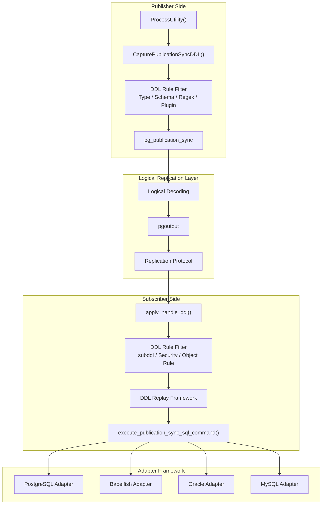
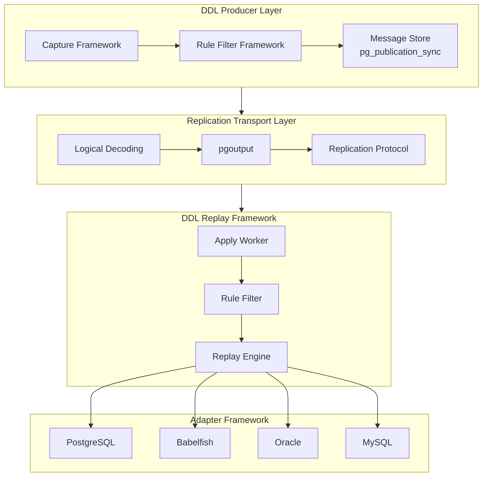
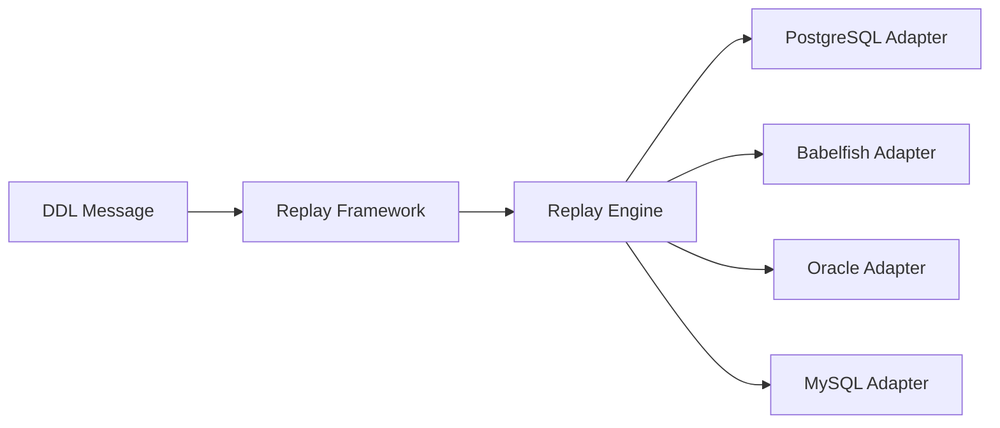
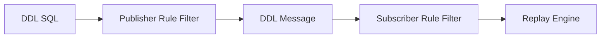
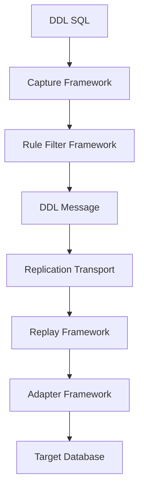

# ddl同步架构

## 整体架构

```shell
┌──────────────────────────────────────────────────────────────┐
│                     Publisher Side                           │
├──────────────────────────────────────────────────────────────┤
│ ProcessUtility()                                             │
│         ↓                                                    │
│ CapturePublicationSyncDDL()                                  │
│         ↓                                                    │
│  DDL Rule Filter                                             │
│ (DDL Type / Schema / Regex / Plugin Rule)                    │
│         ↓                                                    │
│ pg_publication_sync                                          │
└───────────────────────┬──────────────────────────────────────┘
                        │
                        ▼

┌──────────────────────────────────────────────────────────────┐
│               Logical Replication Layer                      │
├──────────────────────────────────────────────────────────────┤
│ Logical Decoding → pgoutput → Replication Protocol           │
└───────────────────────┬──────────────────────────────────────┘
                        │
                        ▼

┌──────────────────────────────────────────────────────────────┐
│                     Subscriber Side                          │
├──────────────────────────────────────────────────────────────┤
│ apply_handle_ddl()                                           │
│         ↓                                                    │
│  DDL Rule Filter                                             │
│ (subddl / Security / Object Rule / Regex Rule)              │
│         ↓                                                    │
│ Replay Framework                                             │
│         ↓                                                    │
│ execute_publication_sync_sql_command()                       │
└───────────────┬───────────────┬───────────────┬──────────────┘
                │               │               │
                ▼               ▼               ▼
       ┌─────────────┐  ┌─────────────┐  ┌─────────────┐
       │ Babelfish   │  │ Oracle      │  │ MySQL       │
       │ Adapter     │  │ Adapter     │  │ Adapter     │
       └─────────────┘  └─────────────┘  └─────────────┘
```
## 分层架构

```shell
┌──────────────────────────────────────────────┐
│               DDL Producer                   │
├──────────────────────────────────────────────┤
│ Capture → Rule Filter → Message Store        │
│            (pg_publication_sync)             │
└──────────────────┬───────────────────────────┘
                   │
                   ▼

┌──────────────────────────────────────────────┐
│          Replication Transport               │
├──────────────────────────────────────────────┤
│ Logical Decoding → pgoutput → Protocol       │
└──────────────────┬───────────────────────────┘
                   │
                   ▼

┌──────────────────────────────────────────────┐
│            DDL Replay Framework              │
├──────────────────────────────────────────────┤
│ Apply → Rule Filter → Replay Engine          │
└──────────────────┬───────────────────────────┘
                   │
        ┌──────────┼──────────┐
        ▼          ▼          ▼
   Babelfish    Oracle      MySQL
    Adapter     Adapter     Adapter
```
# DDL同步整体架构


# DDL Replication Platform 分层架构


# Replay Framework


# Dual Rule Filter Framework


# DDL Replication Platform

