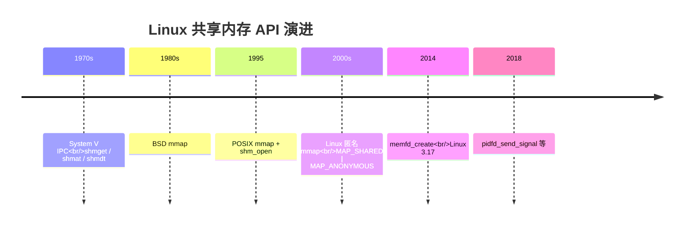
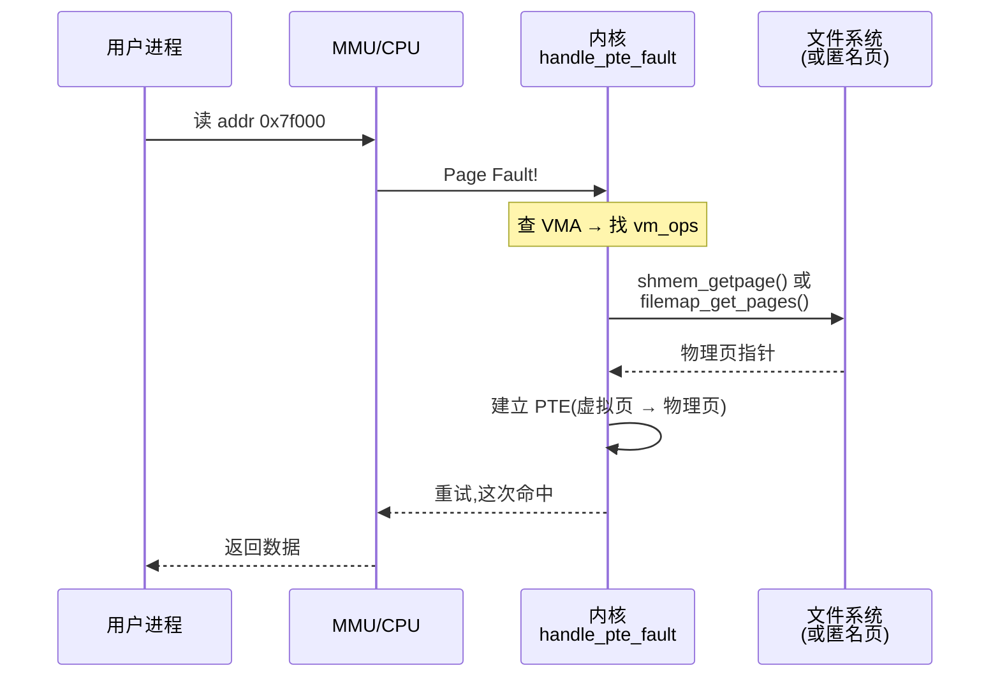
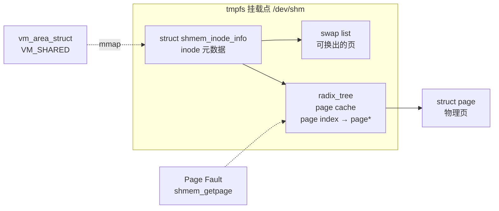
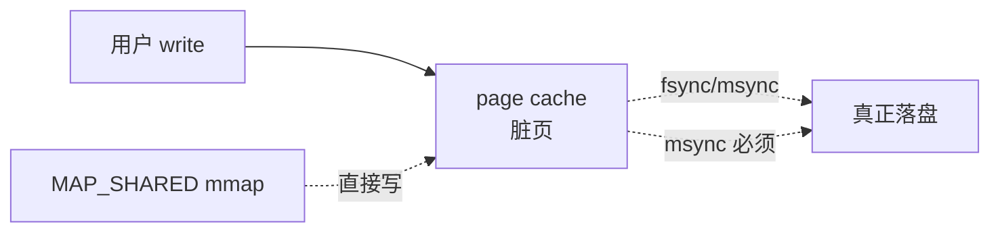
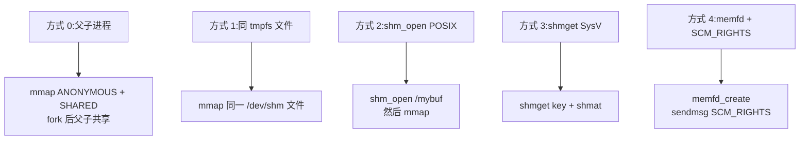
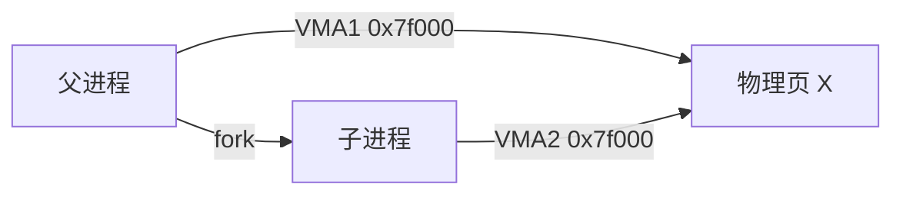
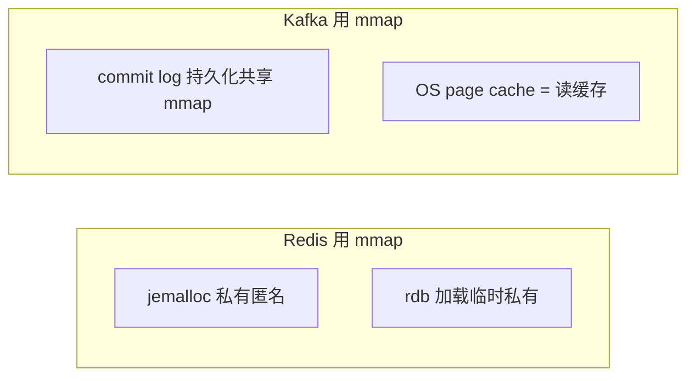
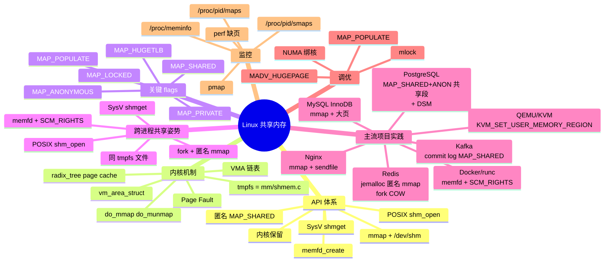

# Linux 共享内存机制:从内核到主流项目实践

> 本文从 Linux 内核视角讲清楚共享内存 —— 为什么有它、内核是怎么实现的、用户态有哪些 API、主流开源项目怎么用。读者:内核 / 系统 / 后端 / 数据库开发者。

## 一、为什么要共享内存?

**核心矛盾**:操作系统给每个进程独立的虚拟地址空间,这是"隔离"的保证;但**多进程协作**需要"共享"数据。共享内存是 Linux 提供的一种**最高效**的进程间通信(IPC)方式 —— 因为它**零拷贝**:

| IPC 方式 | 数据是否过内核 | 是否拷贝 |
| --- | --- | --- |
| 管道 / FIFO | 过 | 2 次(写拷贝 + 读拷贝) |
| 消息队列 | 过 | 2 次 |
| 套接字 | 过 | 2 次(本地 unix socket 可优化) |
| **共享内存** | **不过** | **0 次** |

> 共享内存 = "把同一块物理页映射到多个进程的虚拟地址空间",多个进程直接读写同一块内存。速度天花板就是内存带宽。

但共享内存**没有同步机制**(没有锁、没有顺序保证),所以一般要配合 **信号量 / futex / eventfd / 自旋锁** 一起用。

## 二、历史与 API 体系

Linux 上的共享内存有**四套 API**,年代和定位都不一样:



### 2.1 一张表对比

| 体系 | 后端 | 标识方式 | 优点 | 缺点 |
| --- | --- | --- | --- | --- |
| **System V IPC** | 内核特殊对象 | `int shmid` | 老牌、文档多 | API 难用、清理麻烦、内核参数限制 |
| **POSIX mmap + /dev/shm** | tmpfs 上的文件 | `/name` 路径名 | API 一致、易清理 | 需要文件路径 |
| **匿名 mmap** | 匿名页(可 swap) | 无(只靠 fork 继承) | 无需命名、父子进程天然共享 | 只能 fork 后用 |
| **memfd_create** | 匿名 tmpfs 文件 | fd(可通过 unix socket 传递) | 容器友好、可远程传 fd | Linux 3.17+ |

### 2.2 主流选择

- **进程间共享(无关父子)**:**POSIX mmap + /dev/shm** 或 **memfd**
- **父子进程共享**:**匿名 mmap**(天然 fork 共享)
- **新代码**:**避开 SysV**,API 设计陈旧且有内核参数限制

## 三、`mmap` 系统调用详解

`mmap` 是 Linux 共享内存的核心。完整签名:

```c
#include <sys/mman.h>

void *mmap(void *addr,    // 期望映射地址(MAP_FIXED 时才用,否则传 NULL)
           size_t length, // 字节数
           int prot,      // 内存保护位:PROT_READ | PROT_WRITE | PROT_EXEC | PROT_NONE
           int flags,     // 关键!见下
           int fd,        // 文件描述符(匿名时为 -1)
           off_t offset); // 文件内偏移(页对齐)

int munmap(void *addr, size_t length);   // 解除映射
int mprotect(void *addr, size_t len, int prot);  // 改权限
int msync(void *addr, size_t length, int flags); // MAP_SHARED 必须 msync 才落盘
void *mremap(void *old_address, size_t old_size,
             size_t new_size, int flags, ...);    // 调整映射大小
int madvise(void *addr, size_t length, int advice); // 提示内核:如 MADV_HUGEPAGE
int mlock(const void *addr, size_t len);    // 锁页,禁止 swap
```

### 3.1 `flags` 详解

| flag | 含义 |
| --- | --- |
| `MAP_SHARED` | **关键**:修改对其他进程可见,且最终写回文件(共享 + 持久化) |
| `MAP_PRIVATE` | COW,写时复制,不影响其他进程 |
| `MAP_ANONYMOUS` | 不基于文件,fd 传 `-1`(需要 `MAP_SHARED` 才有"共享"意义) |
| `MAP_FIXED` | 强制使用 addr,失败返回 `MAP_FAILED` |
| `MAP_FIXED_NOREPLACE` | 同上,但不覆盖已有映射(Linux 4.17+) |
| `MAP_HUGETLB` | 用大页(需挂载 hugetlbfs) |
| `MAP_LOCKED` | 立即锁页(类似 mlock,需权限) |
| `MAP_POPULATE` | 预读(避免后续缺页中断) |
| `MAP_NORESERVE` | 不预留 swap |
| `MAP_HUGEPAGE` | 提示用透明大页 THP |

### 3.2 三种最常见的 mmap 模式

#### 模式 1:共享文件(用于进程间共享同一文件)

```c
int fd = open("/dev/shm/my_data", O_CREAT | O_RDWR, 0600);
ftruncate(fd, 4096 * 100);  // 必须先扩展,mmap 不会自动 grow
void *p = mmap(NULL, 4096 * 100,
               PROT_READ | PROT_WRITE,
               MAP_SHARED, fd, 0);
if (p == MAP_FAILED) err(1, "mmap");
close(fd);  // close 后映射依然有效!

// 另一个进程
int fd2 = open("/dev/shm/my_data", O_RDONLY);
void *q = mmap(NULL, 4096 * 100, PROT_READ, MAP_SHARED, fd2, 0);
// q 看到的就是 p 写入的内容
```

> ⚠️ **`ftruncate` 必须先调**。mmap 不会改变文件大小。

#### 模式 2:匿名共享(父子进程)

```c
void *shared = mmap(NULL, SIZE,
                    PROT_READ | PROT_WRITE,
                    MAP_SHARED | MAP_ANONYMOUS,
                    -1, 0);
pid_t pid = fork();
if (pid == 0) {
    // 子进程往 shared 写
    strcpy(shared, "from child");
} else {
    wait(NULL);
    printf("%s\n", (char *)shared);  // 看到 "from child"
}
```

#### 模式 3:`memfd_create`(可远程传 fd 的匿名文件)

```c
int fd = memfd_create("my_buf", 0);
ftruncate(fd, SIZE);
void *p = mmap(NULL, SIZE, PROT_READ | PROT_WRITE, MAP_SHARED, fd, 0);

// 通过 unix socket 把 fd 传给另一个进程(容器里特别好用)
send_fd(unix_socket, fd);

// 对方收到 fd 后,直接 mmap 同一个 fd
void *q = mmap(NULL, SIZE, PROT_READ | PROT_WRITE, MAP_SHARED, recv_fd, 0);
// q 看到 p 写的内容
```

> 💡 **Docker / runc / QEMU / Chromium** 大量用 memfd + SCM_RIGHTS,因为它不需要文件系统路径,**容器内无依赖**。

## 四、内核视角:共享内存是怎么工作的

### 4.1 关键数据结构:`struct vm_area_struct`(VMA)

每个 mmap 调用在内核里都生成一个 `vm_area_struct`(VMA),挂在 `mm_struct::mmap` 链表上。VMA 描述的是"一段虚拟地址 → 什么东西"。

```c
// include/linux/mm_types.h
struct vm_area_struct {
    unsigned long vm_start;     // 起始地址
    unsigned long vm_end;       // 结束地址
    struct mm_struct *vm_mm;    // 所属进程的 mm
    pgprot_t vm_page_prot;      // 权限位
    unsigned long vm_flags;     // VM_SHARED | VM_READ | VM_WRITE ...
    struct file *vm_file;       // 后端文件(匿名 mmap 时为 NULL)
    const vm_ops_t *vm_ops;     // 缺页/关闭等回调
    void *vm_private_data;      // 驱动私有数据
    /* ... */
};
```

`vm_flags` 里的 `VM_SHARED` 标记这个 VMA 是"共享"的。

### 4.2 缺页中断(page fault)

`mmap` 调用**不会**立刻分配物理页,只建立了"虚拟地址 → 文件/匿名"的映射。第一次访问某个虚拟地址时,CPU 触发**缺页中断**,内核的 `handle_pte_fault()` 才真正分配/读取物理页:



- **次要缺页(minor fault)**:物理页已在 page cache,只需重建 PTE(很快)
- **主要缺页(major fault)**:需要从磁盘读 tmpfs / 文件(慢)—— `MAP_POPULATE` 可以提前触发

### 4.3 `mm/mmap.c::do_mmap`

```c
// mm/mmap.c 简化
unsigned long do_mmap(struct file *file, unsigned long addr,
                      unsigned long len, unsigned long prot,
                      unsigned long flags, unsigned long pgoff,
                      unsigned long *populate, struct list_head *uf)
{
    // 1. 验证 flags 组合是否合法
    // 2. 计算地址(addr 若非 NULL,需页对齐)
    // 3. 找到合适的位置插入新 VMA(get_unmapped_area)
    // 4. 创建/合并 VMA
    // 5. 文件 mmap 时,设置 vm_file,延迟读(delay read)
    return addr;
}
```

### 4.4 tmpfs 的内部:内核里的 `mm/shmem.c`

`/dev/shm` 实际是一个 tmpfs 挂载点,内核里由 `mm/shmem.c` 实现。核心结构:



- **写入 MAP_SHARED 的 tmpfs 文件** ⇒ 数据进 page cache,可能被换出到 swap
- **read/write** 直接走 page cache,不会写回"磁盘"(tmpfs 本来就没磁盘)
- **tmpfs 文件的"大小"** = 已写入的最大 page index

### 4.5 `msync`:为什么 MAP_SHARED 文件必须调



> ⚠️ **MAP_SHARED 的 mmap 写入 page cache,但不自动 sync**。要持久化必须 `msync(addr, len, MS_SYNC)`,否则崩溃就丢。

匿名 mmap(`MAP_SHARED | MAP_ANONYMOUS`)没有"文件"概念,所以**没有 msync**。回收靠 `munmap` 或进程退出。

## 五、跨进程共享的 5 种姿势



### 5.1 方式 0:父子进程(匿名 mmap)

最简单的场景。父进程 `mmap(NULL, SIZE, PROT_READ|PROT_WRITE, MAP_SHARED|MAP_ANONYMOUS, -1, 0)`,`fork()` 后子进程继承同一 VMA,指向同一组物理页。



### 5.2 方式 1:`/dev/shm` 文件

`/dev/shm` 是 tmpfs(默认大小 = 物理内存的 50%)。两个无关进程通过同一文件路径 mmap。

```bash
mount | grep shm
# tmpfs on /dev/shm type tmpfs (rw,nosuid,nodev,size=8G)
```

**注意权限**:`/dev/shm` 的权限是 root 控制的,容器里要小心。

### 5.3 方式 2:POSIX `shm_open`

```c
#include <sys/mman.h>
#include <sys/stat.h>

int fd = shm_open("/my_buffer", O_CREAT | O_RDWR, 0600);
ftruncate(fd, SIZE);
void *p = mmap(NULL, SIZE, PROT_READ|PROT_WRITE, MAP_SHARED, fd, 0);
shm_unlink("/my_buffer");  // 类似 unlink,引用计数 0 时真正删除
```

> POSIX `shm_open` 底层就是打开 `/dev/shm/<name>`。它提供的是**文件系统路径之外**的 API。

### 5.4 方式 3:System V `shmget`

```c
#include <sys/ipc.h>
#include <sys/shm.h>

key_t key = ftok("/tmp", 'A');
int shmid = shmget(key, SIZE, IPC_CREAT | 0666);
void *p = shmat(shmid, NULL, 0);
shmdt(p);
shmctl(shmid, IPC_RMID, NULL);  // 标记删除
```

**已知痛点**:
- 内核参数限制:`kernel.shmmax`、`kernel.shmmni`、`kernel.shmall`
- 没有引用计数:进程崩了不释放,需要手动清理
- API 难用:**新代码不要用**

### 5.5 方式 4:`memfd_create` + `SCM_RIGHTS`

容器场景的王者:

```c
// 发送端
int fd = memfd_create("data", 0);
ftruncate(fd, SIZE);
void *p = mmap(NULL, SIZE, PROT_READ|PROT_WRITE, MAP_SHARED, fd, 0);
strcpy(p, "shared data");

struct msghdr msg = {0};
struct cmsghdr *cmsg = CMSG_FIRSTHDR(&msg);
cmsg->cmsg_level = SOL_SOCKET;
cmsg->cmsg_type = SCM_RIGHTS;
cmsg->cmsg_len = CMSG_LEN(sizeof(fd));
memcpy(CMSG_DATA(cmsg), &fd, sizeof(fd));
sendmsg(unix_socket, &msg, 0);
```

```c
// 接收端
recvmsg(unix_socket, &msg, 0);
int new_fd = *(int *)CMSG_DATA(CMSG_FIRSTHDR(&msg));
void *q = mmap(NULL, SIZE, PROT_READ|PROT_WRITE, MAP_SHARED, new_fd, 0);
// q 看到的 p 的内容完全一致
```

> **Docker / runc / containerd** 用它在不同 namespace / 不同进程间传递文件描述符;**Chromium** 用它做 zygote 进程的渲染数据传递。

## 六、主流开源项目实践

### 6.1 PostgreSQL(数据库)

源码:`src/backend/storage/ipc/*`

**传统 Shmem**:用 `mmap(NULL, total_size, PROT_READ|PROT_WRITE, MAP_SHARED|MAP_ANONYMOUS, -1, 0)` 创建一大段,然后通过 fork 让所有 backend 继承同一段。

```c
// src/backend/port/sysv_sema.c (简化)
seghdr = mmap(NULL, size, PROT_READ|PROT_WRITE,
              MAP_SHARED | MAP_ANONYMOUS, -1, 0);
```

**DSM(Dynamic Shared Memory)**:运行时按需 `mmap` 一段独立区域,通过 DSM Registry + `dsm_handle` 互相 find。

**约定**:
- 共享内存段**只在 postmaster 创建**;backend 全部 fork
- 所有共享结构通过 `ShmemInitStruct("name", size, &found)` 按名字注册到 Shmem Index
- 不可释放 —— 重新启动就是回收

### 6.2 Redis(内存数据库)

源码:`src/zmalloc.c`、`src/rdb.c`、`src/server.c`

**内存分配**:默认用 jemalloc。jemalloc 内部就是用 `mmap(PROT_READ|PROT_WRITE, MAP_PRIVATE|MAP_ANONYMOUS)` 申请大块,自己切成小对象给 Redis 用。

**rdb 持久化 + 加载**:加载 rdb 文件时用 mmap 直接映射,避免一次 memcpy:

```c
// src/rdb.c (简化)
int fd = open(filename, O_RDONLY);
struct stat st;
fstat(fd, &st);
void *data = mmap(NULL, st.st_size, PROT_READ, MAP_PRIVATE, fd, 0);
// 直接遍历 data 解析 rdb,不用读缓冲区
```

**主从复制 fork**:Redis 主进程 fork 出子进程做 RDB / AOF rewrite 时,父子进程**共享所有内存页**(fork 之后是 COW,只有写入时才复制)。

### 6.3 Apache Kafka(消息队列)

源码:`core/src/main/scala/kafka/log/FileMessageSet.scala`(Java/Scala)

Kafka 把每个 partition 的 commit log 当成文件,用 mmap 读 + sendfile / write:

```scala
// FileMessageSet.scala (简化)
val channel = FileChannel.open(path, StandardOpenOption.READ, StandardOpenOption.WRITE)
val mmap = channel.map(MapMode.READ_WRITE, start, size)
// 读写 mmap 当 byte buffer 用,内核负责 flush 到磁盘
```

**约定**:
- `segmentSize = 1 GB`(默认),每个 segment 一个 mmap
- 用 `MappedByteBuffer.force()` 强制 flush
- OS page cache 当 Kafka 的"读缓存",省了用户态缓存

### 6.4 MySQL InnoDB(数据库引擎)

源码:`storage/innobase/mtr/*`、`buf/buf0buf.cc`

- **Buffer Pool**:虽然是 malloc,但通过 `mmap(MAP_HUGETLB)` 申请大页提升 TLB 命中率(可选)
- **doublewrite buffer**:用 `mmap(MAP_SHARED)` 保护半写入页
- **change buffer**:B+ 树,二级索引修改暂存

### 6.5 QEMU / KVM(虚拟化)

源码:`hw/virt/*`、`accel/kvm/*`

KVM 虚拟机内存 = 宿主机的一段 mmap:

```c
// QEMU (简化)
kvm_set_user_memory_region(kvm_fd, slot,
    guest_phys_addr, mem_size,
    mmap_addr_in_qemu);  // mmap_addr 是 QEMU 进程内的虚拟地址
```

> KVM 通过 mmap + `KVM_SET_USER_MEMORY_REGION` 把虚拟机的物理内存映射给 KVM 内核模块,**所有 vCPU 访问同一段内存**。virtio 设备也用类似机制。

### 6.6 Nginx(Web 服务器)

源码:`src/core/ngx_buf.c`、`src/os/unix/ngx_files.c`

```c
// 大文件发送用 sendfile(零拷贝),或 mmap 后 send
void *p = mmap(NULL, file_size, PROT_READ, MAP_PRIVATE, fd, 0);
// 用 writev / send 把 p 发出去,内核负责从 page cache 拷到 socket
```

Nginx 大量依赖 OS page cache,直接把磁盘文件 mmap 进 page cache 作为"缓存"。

### 6.7 systemd / Docker(容器)

- **Docker / runc**:`memfd_create` + `SCM_RIGHTS` 把 rootfs 数据从 daemon 传给 containerd-shim
- **systemd**:用 `tmpfs` 挂载 `/run`、`/tmp`,容器进程默认有 `/dev/shm`
- **Kubernetes emptyDir + medium: Memory**:本质就是 tmpfs

### 6.8 Redis vs Kafka:两种"用 mmap 当缓存"的姿势



## 七、性能 & 调优

### 7.1 大页(THP / HugeTLB)

共享内存区经常 1 GB+,用大页能**减少 TLB miss**:

```c
// 方式 1:透明大页(THP),内核自动
madvise(addr, size, MADV_HUGEPAGE);

// 方式 2:显式 hugepage(2MB / 1GB)
fd = open("/mnt/hugetlbfs/page", O_CREAT|O_RDWR, 0755);
void *p = mmap(NULL, size, PROT_READ|PROT_WRITE,
               MAP_SHARED|MAP_HUGETLB, fd, 0);
```

**踩坑**:THP 在某些负载(Redis fork 后大量写)反而拖慢,**Redis 建议禁用 THP**。

### 7.2 `mlock` / 锁页

```c
mlock(addr, size);     // 锁物理页,不换出
munlock(addr, size);   // 解锁
```

用于**延迟敏感**的共享内存(如交易系统核心队列)。**代价**:占用物理内存不能 swap,可能触发 OOM killer。

### 7.3 预读 / 预分配

```c
madvise(addr, size, MADV_WILLNEED);  // 预读
mmap(..., MAP_POPULATE | MAP_LOCKED, ...);  // 立即分配+锁
```

避免后续缺页中断拖慢首字节时间。

### 7.4 NUMA 亲和

```bash
numactl --cpunodebind=0 --membind=0 ./my_app
```

或用 `mbind()` / `set_mempolicy()` 把 mmap 出来的内存绑到特定 NUMA 节点。

### 7.5 内核参数

```bash
# /etc/sysctl.conf
kernel.shmmax = 68719476736    # SysV 单段最大(默认 64GB)
kernel.shmall = 4294967296     # SysV 总页数
kernel.shmmni = 4096           # SysV 段数上限
fs.aio-max-nr = 1048576       # 异步 I/O
vm.swappiness = 1             # 减少 swap
```

## 八、监控 & 调试

### 8.1 看进程的 mmap 映射

```bash
# /proc/<pid>/maps:所有 VMA
cat /proc/$$/maps
# 00400000-00401000 r-xp  /usr/bin/bash
# 7f000000-7f100000 rw-s  /dev/shm/my_data   ← MAP_SHARED!
# 7f100000-7f200000 rw-p                        ← 私有匿名

# /proc/<pid>/smaps:每个 VMA 的 RSS/PSS 等详细信息
cat /proc/$$/smaps

# pmap 命令(等价于 /proc/<pid>/maps 的格式化版)
pmap -X $$ | head -20
```

### 8.2 看系统共享内存使用

```bash
# /proc/meminfo 的关键字段
grep -E '^(Shmem|Mapped|AnonPages|Buffers|Cached):' /proc/meminfo
# Shmem:      1234567 kB     ← 所有 tmpfs + MAP_SHARED 匿名
# Mapped:      8910111 kB     ← 所有 mmap 的文件页
# AnonPages:  5678901 kB     ← 进程私有匿名页

# /sys/fs/cgroup/memory/memory.cache
# /proc/<pid>/status 的 RssAnon/RssFile/RssShmem
cat /proc/<pid>/status | grep -E 'Rss'
```

### 8.3 缺页统计

```bash
# /proc/<pid>/stat 或 /proc/vmstat
grep -E 'pgfault|pgmajfault' /proc/vmstat
# pgfault 12345678          ← 总缺页(次要 + 主要)
# pgmajfault 12345          ← 主要缺页(需要磁盘读,慢!)

# perf 监控缺页事件
perf stat -e page-faults,major-faults,minor-faults ./myapp
```

### 8.4 工具

| 工具 | 用途 |
| --- | --- |
| `pmap` | 看进程 mmap |
| `smem` | 按 PSS/RSS 统计 |
| `perf` | 缺页 / TLB miss 统计 |
| `bpftrace` | 跟踪 `mmap()` 调用 |
| `fatrace` | 看文件页读写 |
| `numastat` | NUMA 分布 |

## 九、常见坑

### 9.1 COW 陷阱

`MAP_PRIVATE` 的 mmap 看起来"共享",但**写时复制**。你的写入**不会影响其他进程**:

```c
// 错误:以为是共享,实际只影响自己
void *p = mmap(NULL, SIZE, PROT_READ|PROT_WRITE,
               MAP_PRIVATE, fd, 0);  // ← MAP_PRIVATE!
strcpy(p, "hello");
// 其他进程看不到 "hello",且这个 "hello" 不会写回文件
```

**修正**:改成 `MAP_SHARED`,并且要 `msync()`。

### 9.2 文件被截断 → 幽灵页

```c
ftruncate(fd, BIG_SIZE);
void *p = mmap(NULL, BIG_SIZE, ..., MAP_SHARED, fd, 0);
// 另一个进程 ftruncate(fd, 0); 把文件截到 0
// 当前进程的 p 仍然指向原 BIG_SIZE 的虚拟地址
// 访问后半部分 → SIGBUS 或读到"幽灵页"
```

> 一定要协调好大小,或者固定大小。

### 9.3 `fork()` 后 `mmap` 在父子进程里的可见性

```c
void *p = mmap(..., MAP_SHARED, fd, 0);
pid_t pid = fork();
if (pid == 0) {
    // 子进程有自己的 VMA 副本,但底层同一组物理页
    munmap(p, SIZE);  // 只解除子进程的映射
}
// 父进程的映射不受影响
```

### 9.4 进程崩溃不清理

- **文件型 mmap**(`/dev/shm/foo`):进程崩了,文件还在,要 `shm_unlink` 或手动 rm
- **匿名 mmap**:进程崩了,内核自动 munmap(引用计数 0)
- **memfd**:fd 关闭自动释放
- **SysV**:进程崩了,segment 还在,要 `ipcs` + `ipcrm` 手动清理

### 9.5 32-bit 系统大小限制

```bash
# 32-bit 默认 shmmax = 32MB
ipcs -l
# ------ Shared Memory Limits --------
# max number of segments = 4096
# max seg size (kbytes) = 32768    ← 32MB
# max total shared memory (kbytes) = 8388608
```

64-bit 系统上一般不是问题。

## 十、一张图总结



## 十一、参考

- `man mmap(2)`、`man mprotect(2)`、`man memfd_create(2)`、`man shm_overview(7)`
- Linux 内核文档 `Documentation/admin-guide/mm/concepts.rst`、`Documentation/filesystems/tmpfs.rst`
- 内核源码:`mm/mmap.c`、`mm/shmem.c`、`mm/filemap.c`、`include/linux/mm_types.h`
- PostgreSQL `src/backend/port/sysv_sema.c`(共享段创建)
- Redis 源码 `src/zmalloc.c`、`src/rdb.c`
- Kafka 源码 `core/src/main/scala/kafka/log/FileMessageSet.scala`
- Linux Kernel Changlgos(memfd_create 在 3.17)
