# TWPA 依赖冲突检测设计文档

> **文档版本**:v1.0
> **适配版本**:PostgreSQL 18
> **源码基线**:`src/backend/replication/logical/{worker,applyparallelworker}.c`、`src/include/replication/worker_internal.h`
> **读者**:内核开发者、reviewer

## 一、文档目的

定义 TWPA 中**依赖冲突检测的算法、数据结构、调度策略**,包括:

- ConflictKey 的精确语义与构造规则
- Dependency DAG 的构建算法
- 调度器如何使用 DAG
- 跨窗口依赖与 Global Barrier
- Fallback 决策树

不涉及用户接口(见《用户接口文档》)与整体架构(见《概要设计文档》)。

## 二、设计目标 G1~G5

| 编号 | 目标 |
| --- | --- |
| G1 | 正确性优先 — 任何有疑问时立即串行 |
| G2 | Conflict Hash 优先于 SQL 查询 |
| G3 | ConflictKey 必须具备**确定性**(同一变更必须生成同一 key) |
| G4 | 事务之间只建立**有方向**的依赖 |
| G5 | 窗口外仍必须保留依赖边界 |

## 三、核心设计原则

### 3.1 原则详解

| 原则 | 说明 |
| --- | --- |
| **正确性优先** | 错并行 = 数据错误;宁可慢也不能错 |
| **Conflict Hash 优先** | 哈希查冲突比 SQL 触发器快 100x |
| **确定性** | 同一变更任何时候生成的 key 必须一致 |
| **有方向依赖** | T1 → T2 而非无向图(便于拓扑序) |
| **窗口外边界** | 不因为窗口结束就丢弃依赖 |

## 四、ConflictKey 设计

### 4.1 总体设计

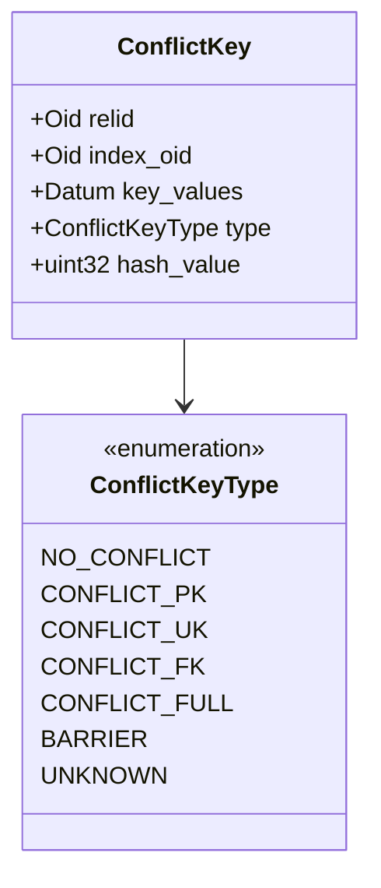

### 4.2 为什么不能用单纯的 `Table OID + Key`

| 场景 | 单独 OID+Key 漏判? | 正确处理 |
| --- | --- | --- |
| T1 INSERT, T2 UPDATE 同一行 | ✓ 命中 | OID + PK |
| T1 UPDATE, T2 UPDATE 同一行 | ✓ 命中 | OID + PK |
| T1 UPDATE col1, T2 UPDATE col2 同一行 | ✗ 必须考虑 read-modify-write | OID + Replica Identity FULL |
| T1 INSERT foo, T2 INSERT FK 引用 foo | ✗ FK 依赖 | OID + FK index |
| T1 ALTER TABLE, T2 任何 DML | ✗ 表结构变了 | BARRIER |

### 4.3 ConflictKey 类型优先级

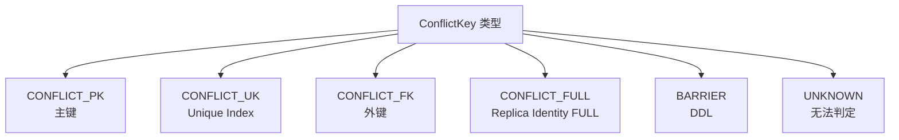

| 优先级 | 类型 | 说明 |
| --- | --- | --- |
| 1 | CONFLICT_PK | 最常见,最精确 |
| 2 | CONFLICT_UK | 二级唯一索引 |
| 3 | CONFLICT_FK | 跨表依赖 |
| 4 | CONFLICT_FULL | FULL 表,所有列 |
| 5 | BARRIER | DDL 强制串行 |
| 6 | UNKNOWN | 退化为 fallback |

## 五、ConflictEntry 与 last_writer

### 5.1 数据结构

```c
typedef struct ConflictEntry {
    Oid             relid;
    Oid             index_oid;
    Datum           key_values;
    TransactionId   last_writer;     /* 最后一个写此 key 的事务 */
    XLogRecPtr      last_lsn;
    int             ref_count;       /* 被多少事务引用 */
    ConflictKeyType type;
} ConflictEntry;
```

### 5.2 为什么用 last_writer

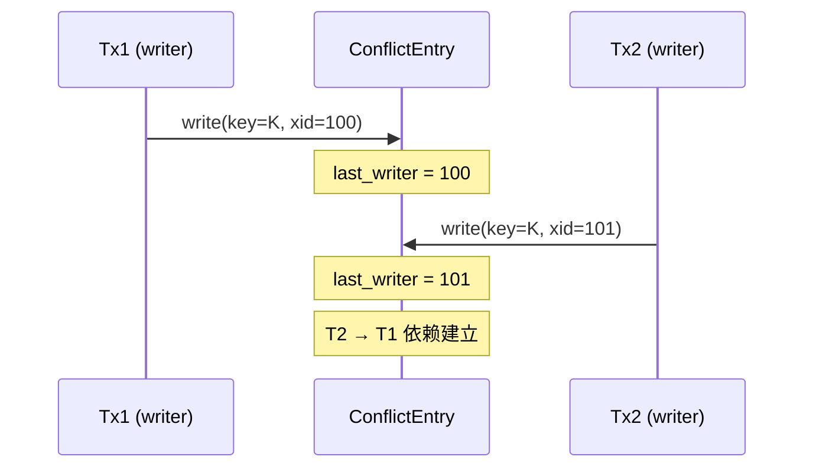

**优势**:O(1) 判定"谁最后写过这个 key",而不是扫整个窗口。

## 六、INSERT / DELETE / UPDATE 冲突分析

### 6.1 INSERT 冲突

```mermaid
flowchart TB
    A[Tx1: INSERT (rel=R, pk=K)] --> B{Conflict Hash<br/>中 K 是否存在?}
    B -->|否| C[建立 Entry<br/>last_writer=Tx1]
    B -->|是| D[Tx1 → last_writer<br/>建立依赖]
    D --> E[更新 last_writer=Tx1]
```

### 6.2 DELETE 冲突

```mermaid
flowchart TB
    A[Tx1: DELETE (rel=R, pk=K)] --> B{Conflict Hash<br/>中 K 是否存在?}
    B -->|否| C[Entry 已存在<br/>但未写入]
    B -->|是| D[Tx1 → last_writer<br/>建立依赖]
    D --> E[更新 last_writer=Tx1]
```

### 6.3 UPDATE 关键场景

```mermaid
flowchart TB
    A[Tx1: UPDATE row R from old=(K_old) to new=(K_new)] --> B[生成两个 Key:<br/>OLD = R + K_old<br/>NEW = R + K_new]
    B --> C[OLD 写入 Conflict Hash]
    B --> D[NEW 写入 Conflict Hash]
    C --> E[OLD: Tx1 → last_writer(OLD)]
    D --> F[NEW: Tx1 → last_writer(NEW)]
```

**关键**:UPDATE 必须同时记录 OLD key 与 NEW key,否则漏掉 read-modify-write 冲突。

### 6.4 单事务内部重复修改

```mermaid
flowchart TB
    A[Tx1: UPDATE R K=5 → K=6 → K=7] --> B[OLD keys: {5}]
    A --> C[NEW keys: {6, 7}]
    B --> D[OLD: 标记为 Tx1 自身]
    C --> E[NEW: 标记为 Tx1 自身]
    D --> F[不建立 Tx1 → Tx1 自依赖]
    E --> F
```

## 七、ConflictKey 去重

### 7.1 事务内部去重

```text
Tx1 涉及的 conflict_keys:
  [R + K=1, R + K=2, R + K=3]

去重后:
  [R + K=1, R + K=2, R + K=3]  ← 这些是不同的 key,不去重

但同一 (rel, index, key) 在事务内出现多次 → 只保留一次
```

### 7.2 跨事务去重

```text
T1 和 T2 都涉及 R + K=5:
  - Edge: T1 → T2 (依 commit_lsn 决定方向)
  - 不能重复加边
```

## 八、Replica Identity 与 FULL 表

### 8.1 Replica Identity 类型

| 类型 | 旧值能否识别 | ConflictKey 怎么生成 |
| --- | --- | --- |
| `DEFAULT`(主键) | ✓ | 用 PK |
| `USING INDEX` | ✓ | 用指定 index |
| `FULL` | ✓ | 用所有列 |
| `NOTHING` | ✗ | UNKNOWN → fallback |

### 8.2 FULL 表的 ConflictKey

```c
/* Replica Identity FULL 的表,ConflictKey = relid + 所有列的值 */
if (RelationGetReplicaIndex(rel) == InvalidOid && relid_replica_identity == REPLICA_IDENTITY_FULL) {
    key.relid = RelationGetRelid(rel);
    key.index_oid = InvalidOid;
    key.key_values = heap_get_all_values(tup, rel);
    key.type = CONFLICT_FULL;
}
```

### 8.3 NOTHING 表

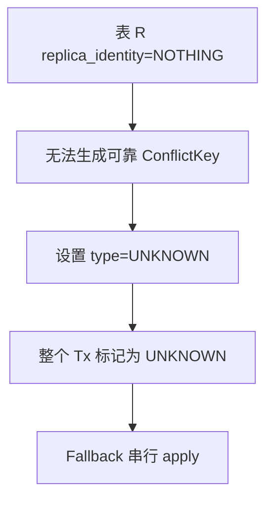

## 九、Table-Level Conflict(整表)

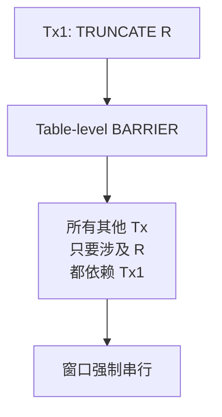

> TRUNCATE / DROP / ALTER 必须建立表级 BARRIER。

## 十、DDL 与 BARRIER

### 10.1 DDL 流程

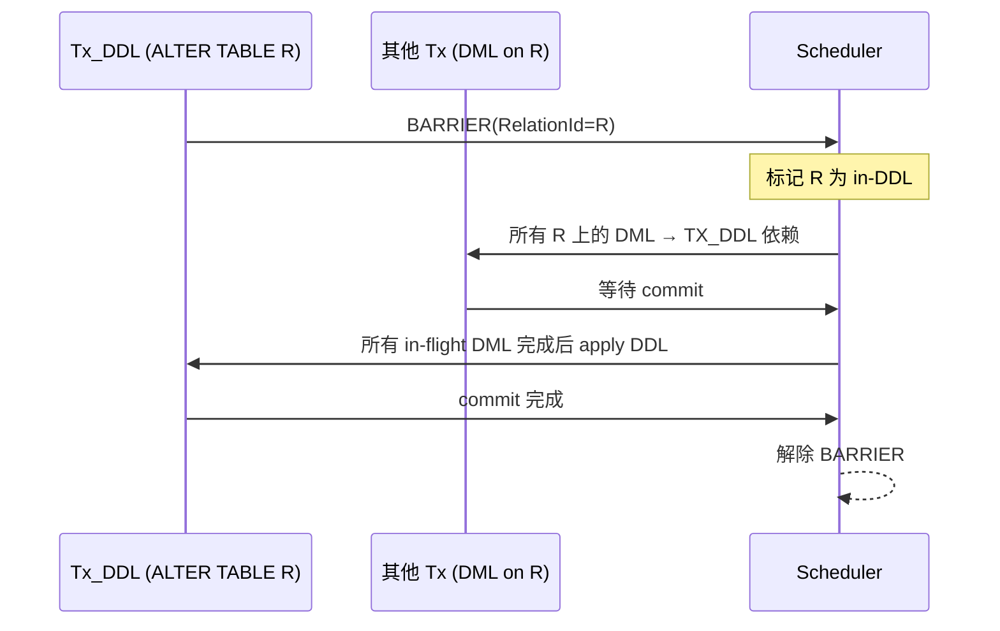

## 十一、Foreign Key Dependency

### 11.1 难点

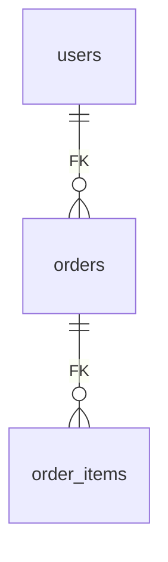

- T1 INSERT users → T2 INSERT orders(引用 users):**T2 → T1**
- T1 UPDATE users → T2 UPDATE orders:**T2 → T1**

### 11.2 第一版处理建议

| 决策 | 选择 |
| --- | --- |
| 是否启用 FK 依赖检测 | **默认关闭**,`conflict_detection_mode='full'` 才启用 |
| 性能 | FK 检测需查 pg_constraint + pg_index |
| 漏判后果 | 数据不一致(违反 FK) |
| v1.1 引入 | 可选 |

## 十二、Dependency 类型模型

### 12.1 DependencyType 枚举

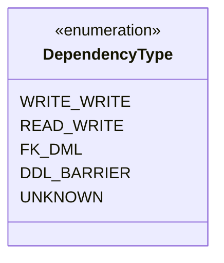

### 12.2 Dependency Edge 数据结构

```c
typedef struct DependencyEdge {
    TransactionId from;           /* 依赖源(被等待者) */
    TransactionId to;             /* 依赖目标(等待者) */
    DependencyType type;
    ConflictKey   via;            /* 通过哪个 key 产生依赖 */
} DependencyEdge;
```

### 12.3 是否需要保存 ConflictKey 到 Edge

| 方案 | 优点 | 缺点 |
| --- | --- | --- |
| **存 key** | 调试友好,可重放 | 内存大 |
| **不存 key** | 省内存,只关心顺序 | 出错难定位 |

> **建议**:生产环境不存 key;调试模式可选存。

## 十三、Dependency Frontier

### 13.1 定义

**Frontier** = 窗口边界上"已经被窗口外事务写过,可能影响窗口内事务"的 ConflictKey 集合。

### 13.2 为什么必须有

```mermaid
flowchart LR
    A[T0 outside window<br/>write R.K=5]::: out
    B[T1 in window<br/>write R.K=5]::: in
    C[T2 in window<br/>write R.K=5]::: in
    A -->|依赖| B
    B -->|依赖| C
    classDef out fill:#e5e7eb,stroke:#6b7280
    classDef in fill:#dcfce7,stroke:#15803d
```

T0 在窗口外,如果窗口内 T1 不等 T0 commit 就并行 → 数据不一致。

### 13.3 Frontier 状态判断

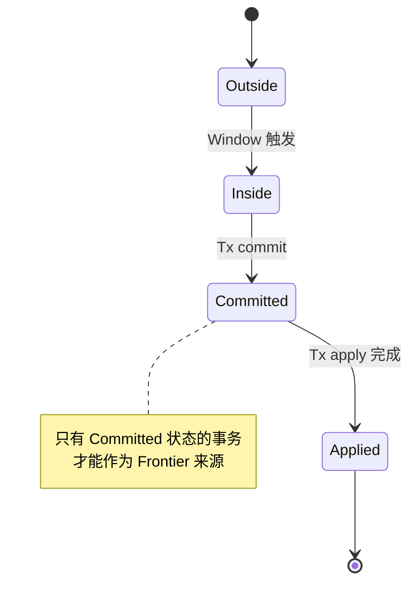

## 十四、Window 内依赖构建

### 14.1 算法流程

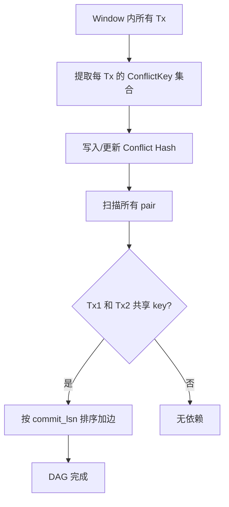

### 14.2 伪代码

```python
def build_dag(txns: List[ApplyTxn]) -> DAG:
    # 1. 初始化 Conflict Hash
    ch = ConflictHash()
    for txn in txns:
        for ck in txn.conflict_keys:
            ch.update(ck, txn)

    # 2. 扫描,建立依赖边
    dag = DAG()
    for i, txn_i in enumerate(txns):
        for ck in txn_i.conflict_keys:
            entry = ch[ck]
            if entry.last_writer and entry.last_writer != txn_i.xid:
                # 建立依赖:txn_i → last_writer
                edge = DependencyEdge(
                    from=entry.last_writer,
                    to=txn_i.xid,
                    via=ck
                )
                dag.add_edge(edge)
        # 自己作为 last_writer
        for ck in txn_i.conflict_keys:
            ch.update(ck, txn_i)

    return dag
```

## 十五、Scheduler 使用 predecessor_count

### 15.1 算法

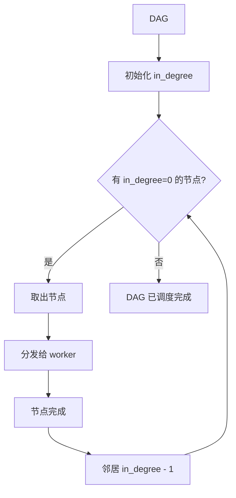

### 15.2 一个事务多个依赖

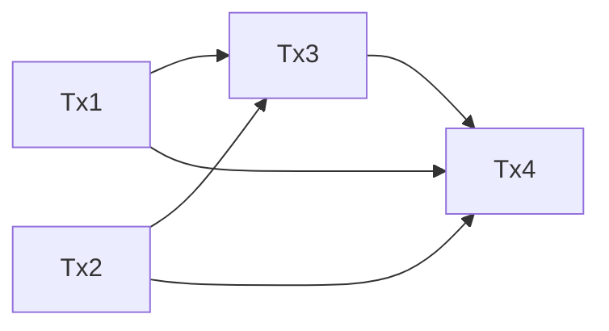

- Tx3 必须等 Tx1、Tx2 完成 → in_degree(Tx3) = 2
- Tx4 必须等 Tx1、Tx2、Tx3 完成 → in_degree(Tx4) = 3

### 15.3 Dependency 去重

```text
T1 → T2, T1 → T2 (重复): 只保留一条
```

## 十六、跨 Window Dependency

### 16.1 跨窗口流程

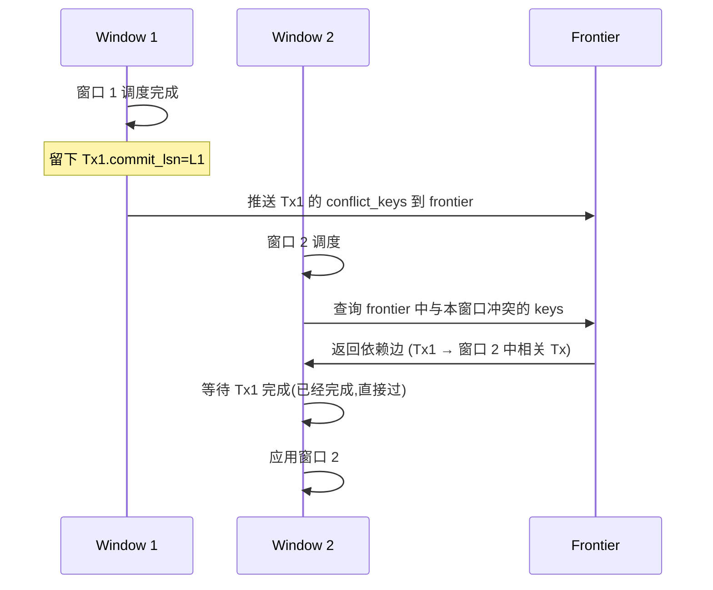

### 16.2 Global Barrier

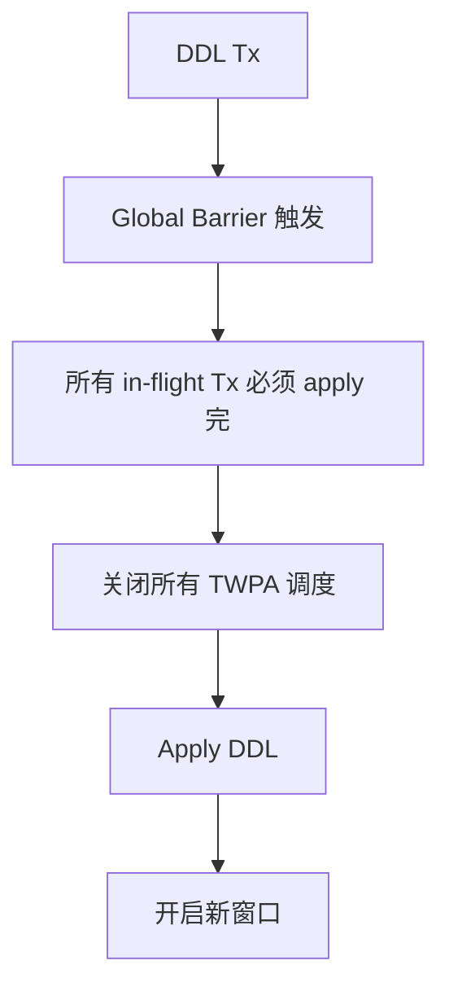

### 16.3 Barrier 实现

| 实现方式 | 选择 |
| --- | --- |
| 整库级 LOCK | 太重 |
| LWLock 屏障 | ✓ |
| replication origin 推进 + checkpoint | 备选 |

## 十七、Dependency Analyzer 输出

```c
typedef struct AnalyzerResult {
    List            *ready_queue;      /* 拓扑序,可立即执行 */
    List            *wait_queue;       /* 等待中的 Tx */
    int              fallback_count;   /* fallback 到串行的 Tx 数 */
    AnalyzerStatus   status;           /* OK / FALLBACK / ERROR */
} AnalyzerResult;
```

## 十八、关键优化:不要"存在依赖就串行"

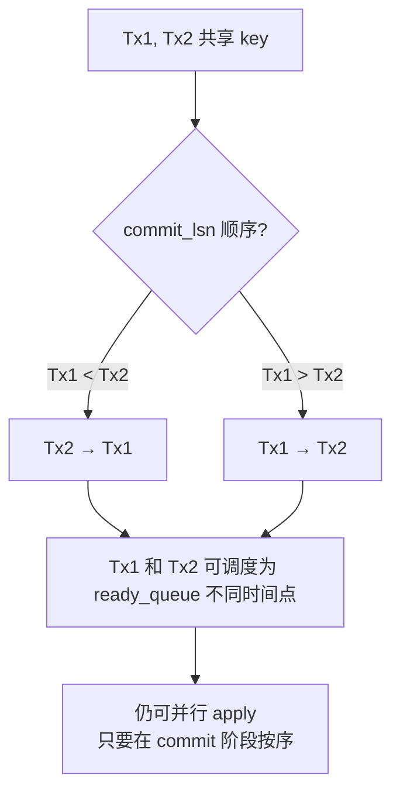

**核心思想**:**DEPENDENCY ≠ SERIALIZATION**。只有两个事务**真正并发 apply 同一资源**时才需要序列化;否则可错开调度。

## 十九、Conflict Hash 与 DAG 的关系

```mermaid
flowchart LR
    A[Conflict Hash<br/>O(1) 查询 last_writer] --> B[Dependency Edge]
    B --> C[DAG]
    C --> D[拓扑序]
    D --> E[Scheduler]
```

## 二十、Runtime Conflict(运行时冲突)

### 20.1 定义

**Runtime Conflict**:analyzer 判断无冲突,但实际 apply 时发生冲突(主键冲突、唯一约束冲突等)。

### 20.2 处理

```mermaid
sequenceDiagram
    participant W1 as Worker 1
    participant DB as DB
    participant CC as Commit Coordinator

    W1->>DB: INSERT R.K=5
    DB->>W1: ERROR: duplicate key
    W1->>CC: 报告 runtime conflict
    CC->>CC: fallback 串行重试
```

### 20.3 性能影响

| 类型 | 频率 | 处理 |
| --- | --- | --- |
| Primary Key | 极低 | 重试一次 |
| Unique Index | 极低 | 重试一次 |
| FK Violation | 极低 | 重试 |
| Check Violation | 低 | 重试或日志 |
| 死锁 | 中 | 重排 + 重试 |

## 二十一、决策树总览

```mermaid
flowchart TB
    A[Tx 进入 Window] --> B{有 DDL?}
    B -->|是| C[BUILD BARRIER<br/>Tx 串行]
    B -->|否| D{表无 PK 且非 FULL?}
    D -->|是| E[TX UNKNOWN<br/>Tx 串行]
    D -->|否| F[构建 ConflictKey 集合]
    F --> G[更新 Conflict Hash]
    G --> H{有新依赖?}
    H -->|是| I[加入 DAG]
    H -->|否| J[直接 READY]
    I --> K[Topo sort]
    J --> K
    K --> L[Scheduler 分发]
```

## 二十二、参考

- PG 18 源码:
  - `src/backend/replication/logical/worker.c`(`apply_handle_*_internal`)
  - `src/backend/replication/logical/applyparallelworker.c`
  - `src/include/replication/worker_internal.h`(`ParallelApplyWorkerShared`)
- 配套文档:《用户接口文档》《概要设计文档》
- 相关算法:BSP(Bulk Synchronous Parallel)、Sagas 事务模型、Deterministic Database
