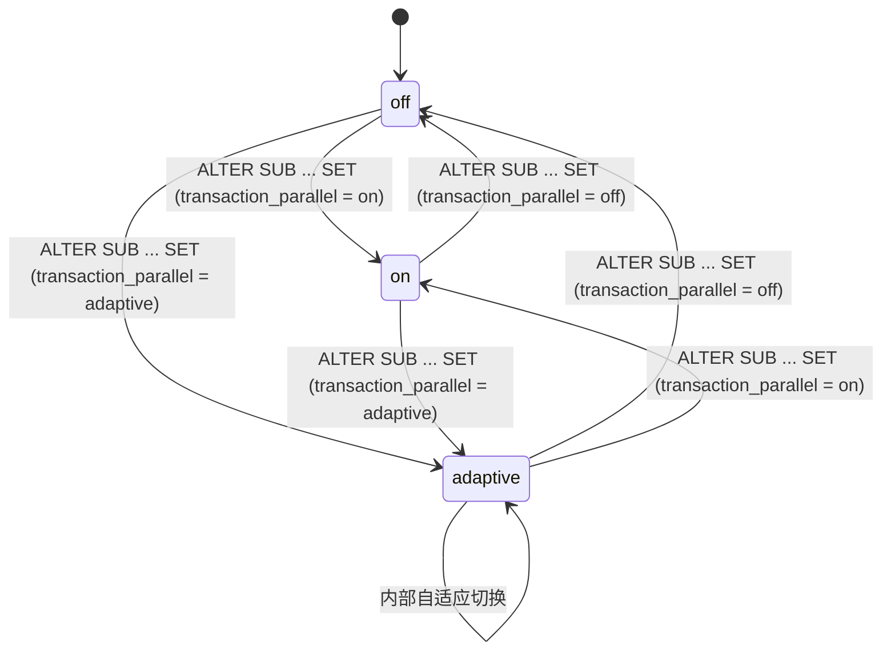
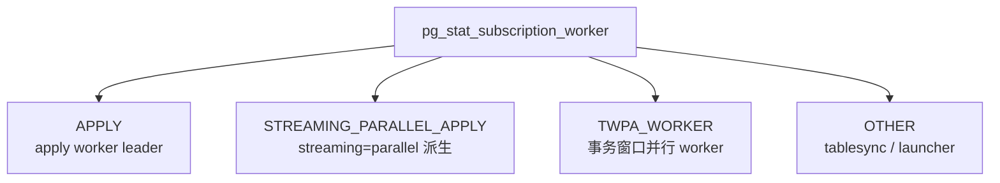
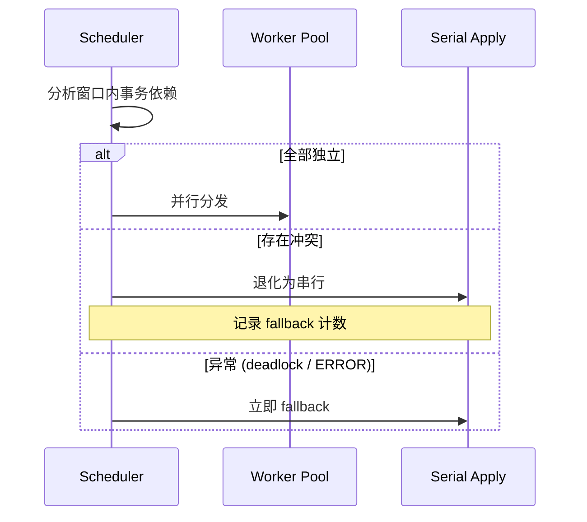
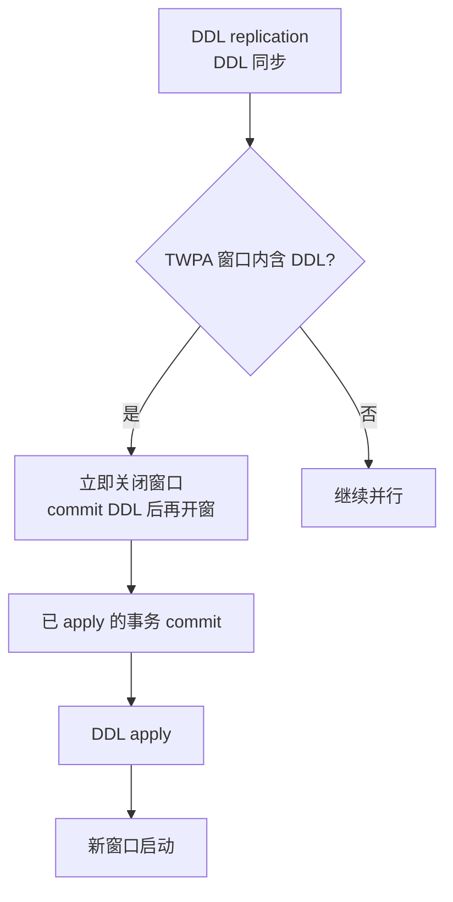

# 逻辑复制并行 Apply — 用户接口文档

> **文档版本**:v1.0
> **适配版本**:PostgreSQL 18(含社区已合入的并行 Apply 增强补丁)
> **源码基线**:`src/backend/replication/logical/{worker,applyparallelworker,launcher,tablesync}.c`
> **读者**:DBA、应用开发者、运维工程师

## 一、文档目的

本文档定义 **TWPA(Transaction Window Parallel Apply,事务窗口并行 Apply)** 用户可见的接口规范,包括:

- `CREATE/ALTER SUBSCRIPTION` 的新参数
- 相关 GUC(Grand Unified Configuration)参数
- 监控视图与统计字段
- 错误码与异常处理
- 兼容性矩阵

不涉及内部数据结构、调度算法(见《概要设计文档》)与依赖冲突分析(见《依赖冲突检测设计文档》)。

## 二、术语表

| 术语 | 定义 |
| --- | --- |
| **Publisher** | 发布端数据库,产生 WAL |
| **Subscriber** | 订阅端数据库,接收并应用变更 |
| **Apply Worker** | 订阅端 apply worker 进程(一个 subscription 一个 leader) |
| **Parallel Apply Worker** | leader 派生的并行 apply 子进程(`streaming=parallel` 用) |
| **TWPA Worker** | 事务窗口并行 apply 的子进程(本文档主题) |
| **Transaction Window** | 一次被调度器分析的"事务集合"窗口 |
| **Streaming Transaction** | 仍在执行中、流式推送变更的事务 |
| **Committed Transaction** | 已提交、被缓冲等待调度的事务 |

## 三、功能定位与边界

### 3.1 三套 Apply 机制并存

```mermaid
flowchart LR
    A[Logical Replication]::: root --> B["Serial Apply<br/>单事务"]
    A --> C["streaming=parallel<br/>大事务流式"]
    A --> D["TWPA<br/>事务窗口并行"]
    B --> E[现有 apply_dispatch]
    C --> F[Parallel Apply Worker]
    D --> G[TWPA Scheduler + Workers]
    E --> H[Subscriber DB]
    F --> H
    G --> H
    classDef root fill:#fce7f3,stroke:#be185d
```

| 机制 | 适用场景 | 关键开关 | 并行粒度 |
| --- | --- | --- | --- |
| **Serial Apply** | 默认 / 强一致性 | 默认 | 无(单事务) |
| **streaming=parallel** | 大/长事务 | `streaming = parallel` | 一个事务多 stream 并行 |
| **TWPA** | 大量小/中事务 | `transaction_parallel = on/adaptive` | 窗口内独立事务并行 |

### 3.2 TWPA 目标

```mermaid
flowchart LR
    A[大量小事务]::: root --> B[串行 apply] --> C[CPU 利用率低] --> D[Subscriber 瓶颈]
    E[TWPA]::: root --> F[窗口 + 依赖分析] --> G[并行 apply] --> H[提升吞吐]
    classDef root fill:#dcfce7,stroke:#15803d
```

### 3.3 非目标(N1~N4)

| 编号 | 非目标 | 说明 |
| --- | --- | --- |
| N1 | 通用 SQL 并行执行 | 不修改 optimizer / executor 的并行模型 |
| N2 | 一个事务内部并行 | 单事务内的多 stream 仍由 `streaming=parallel` 处理 |
| N3 | 完整恢复所有读依赖 | 只识别写依赖(ConflictKey),不识别读依赖 |
| N4 | 修改事务一致性模型 | 必须保持事务级原子性 + 提交顺序 |

## 四、DDL 接口

### 4.1 `CREATE SUBSCRIPTION` 新增选项

```sql
CREATE SUBSCRIPTION name
    CONNECTION 'conninfo'
    PUBLICATION publication_names
    [ WITH ... ]          -- 现有选项保留
    -- ↓↓↓ 新增选项 ↓↓↓
    [ TRANSACTION_PARALLEL { off | on | adaptive } ]
    [ NTRANSACTIONS_PARALLEL_WORKERS integer ]
    [ TRANSACTION_PARALLEL_WINDOW_SIZE integer ]
    [ TRANSACTION_PARALLEL_WINDOW_TIME interval ]
    [ TRANSACTION_PARALLEL_WINDOW_BYTES integer ]
    [ TRANSACTION_PARALLEL_MIN_TRANSACTIONS integer ]
    [ CONFLICT_DETECTION_MODE { conservative | primary_key | full } ]
;
```

### 4.2 `ALTER SUBSCRIPTION`

```sql
-- 启用
ALTER SUBSCRIPTION name ENABLE;
ALTER SUBSCRIPTION name SET (transaction_parallel = on);

-- 关闭
ALTER SUBSCRIPTION name SET (transaction_parallel = off);

-- 动态调参
ALTER SUBSCRIPTION name SET (transaction_parallel_window_size = 2000);
```

### 4.3 兼容性矩阵

| 选项 | PG 13-15 | PG 16-17 | PG 18(原版) | PG 18(增强后) |
| --- | --- | --- | --- | --- |
| `streaming=parallel` | ✗ | ✓ | ✓ | ✓ |
| `transaction_parallel` | ✗ | ✗ | ✗ | ✓ |
| `ntransactions_parallel_workers` | ✗ | ✗ | ✗ | ✓ |

> 历史 / 已弃用选项保留原 `pg_doc` 描述,本节不重复。

## 五、GUC 参数一览(用户接口)

### 5.1 参数总览

| 参数名 | 类型 | 默认 | 取值范围 | 所属层级 | 说明 |
| --- | --- | --- | --- | --- | --- |
| `transaction_parallel` | enum | `off` | `off \| on \| adaptive` | subscription | 主开关 |
| `transaction_parallel_workers` | int | `2` | `[1, max_parallel_apply_workers_per_subscription]` | subscription | 并行 worker 数上限 |
| `transaction_parallel_window_size` | int | `1000` | `[1, INT_MAX]` | subscription | 窗口内事务数阈值 |
| `transaction_parallel_window_time` | interval | `10s` | `[0, ...]` | subscription | 窗口时间阈值 |
| `transaction_parallel_window_bytes` | int | `1GB` | `[1, INT_MAX]` | subscription | 窗口字节阈值 |
| `transaction_parallel_min_transactions` | int | `5` | `[1, INT_MAX]` | subscription | 触发分析的最小事务数 |
| `conflict_detection_mode` | enum | `conservative` | `conservative \| primary_key \| full` | subscription | 冲突检测粒度 |

### 5.2 `transaction_parallel`(主开关)

#### 5.2.1 取值含义

| 取值 | 行为 | 适用场景 |
| --- | --- | --- |
| `off` | 全部串行 apply | 强一致性、强冲突可能 |
| `on` | 强制窗口 + 依赖分析 + 并行 | 已知冲突少、表有主键 |
| `adaptive` | 默认串行,检测到高吞吐窗口自动切换并行 | **推荐**:大多数业务 |

#### 5.2.2 切换时的状态机



#### 5.2.3 SQL 示例

```sql
-- 方式 1:CREATE 时指定
CREATE SUBSCRIPTION sub_oltp_to_olap
    CONNECTION 'host=pub port=5432 dbname=oltp user=repl'
    PUBLICATION pub_orders
    WITH (transaction_parallel = adaptive);

-- 方式 2:动态修改
ALTER SUBSCRIPTION sub_oltp_to_olap SET (transaction_parallel = on);

-- 方式 3:全局默认(对所有新 subscription)
-- 注:此 GUC 不在 postgresql.conf 中,仅作为 subscription option
```

### 5.3 `transaction_parallel_workers`

```sql
ALTER SUBSCRIPTION sub SET (transaction_parallel_workers = 4);
```

**约束**:

```text
1 ≤ transaction_parallel_workers
  ≤ max_parallel_apply_workers_per_subscription (默认 2)
```

**调优建议**:

| 业务特征 | 建议值 |
| --- | --- |
| 大量小事务,CPU 多 | 等于 `max_parallel_apply_workers_per_subscription` |
| 写放大明显(每事务更新很多行) | 略小于 CPU 核数 / 2 |
| 严格事务顺序要求 | 1(强制串行) |

### 5.4 `transaction_parallel_window_size`

控制窗口最多包含多少个已接收事务。

```sql
ALTER SUBSCRIPTION sub SET (transaction_parallel_window_size = 2000);
```

```mermaid
flowchart LR
    A[已提交事务 1..N]::: in --> B[Transaction Window]
    B --> C{"事务数 ≥ window_size?"}
    C -->|是| D[触发依赖分析]
    C -->|否| E[继续等待]
    E --> F{"到达时间窗口?"}
    F -->|是| D
    F -->|否| E
    D --> G[Scheduler 分发到 Workers]
    classDef in fill:#dcfce7,stroke:#15803d
```

> 推荐默认 `1000`,过大导致内存压力大,过小导致频繁调度。

### 5.5 `transaction_parallel_window_time`

窗口最大等待时间。

```sql
ALTER SUBSCRIPTION sub SET (transaction_parallel_window_time = '30s');
```

```text
T0: window 接收第一个事务
T0 + transaction_parallel_window_time: 强制触发分析
```

> 与 `window_size` / `window_bytes` 形成"三选一"的 OR 关系,任一达到即触发调度。

### 5.6 `transaction_parallel_window_bytes`(建议)

窗口内变更总字节数限制。

```sql
ALTER SUBSCRIPTION sub SET (transaction_parallel_window_bytes = '2GB');
```

| 触发条件 | 优先级 |
| --- | --- |
| 事务数 ≥ `window_size` | 高 |
| 时间 ≥ `window_time` | 中 |
| 字节数 ≥ `window_bytes` | 低 |

### 5.7 `transaction_parallel_min_transactions`

只有当窗口内事务数 ≥ 该值时才尝试并行;否则直接串行 apply。

```sql
ALTER SUBSCRIPTION sub SET (transaction_parallel_min_transactions = 10);
```

> 推荐默认 `5`,避免单事务也走并行调度反而更慢。

### 5.8 `conflict_detection_mode`(冲突检测粒度)

| 取值 | 检测粒度 | 性能影响 | 准确度 |
| --- | --- | --- | --- |
| `conservative` | 仅 Primary Key | 低 | 低(只看 PK) |
| `primary_key` | 主键 + Unique Index | 中 | 中 |
| `full` | 全索引 + Replica Identity FULL | 高 | 高 |

### 5.9 推荐最终 CREATE SUBSCRIPTION 模板

```sql
CREATE SUBSCRIPTION sub_from_pubdb
    CONNECTION 'host=10.0.0.1 port=5432 dbname=oltp user=repl password=xxx'
    PUBLICATION pub_orders, pub_users
    WITH (
        -- 现有选项
        streaming = on,
        binary = on,
        two_phase = off,
        disable_on_error = off,
        run_as_owner = off,

        -- 新增 TWPA 选项
        transaction_parallel = adaptive,
        transaction_parallel_workers = 4,
        transaction_parallel_window_size = 1000,
        transaction_parallel_window_time = '10s',
        transaction_parallel_window_bytes = '1GB',
        transaction_parallel_min_transactions = 5,
        conflict_detection_mode = primary_key
    );
```

## 六、监控接口

### 6.1 新增视图:`pg_stat_subscription_worker`

```sql
CREATE VIEW pg_stat_subscription_worker AS
SELECT
    w.subid,
    w.worker_pid,
    w.worker_type,
    w.xid,
    w.state,
    w.begin_lsn,
    w.commit_lsn,
    w.change_count,
    w.bytes_processed,
    w.start_time,
    w.duration_ms,
    w.assigned_window_id
FROM pg_stat_subscription_worker_internal w;
```

**字段说明**:

| 字段 | 类型 | 说明 |
| --- | --- | --- |
| `subid` | oid | subscription OID |
| `worker_pid` | int | worker 进程 PID |
| `worker_type` | text | `APPLY` / `PARALLEL_APPLY` / `TWPA_WORKER` / `STREAMING_PARALLEL_APPLY` |
| `xid` | xid | 当前正在 apply 的事务 ID |
| `state` | text | `RECEIVING` / `BUFFERED` / `ANALYZING` / `READY` / `RUNNING` / `COMMIT_WAIT` / `COMMITTED` / `SERIAL` / `UNKNOWN` |
| `begin_lsn` | pg_lsn | 事务 BEGIN 的 LSN |
| `commit_lsn` | pg_lsn | 事务 COMMIT 的 LSN |
| `change_count` | bigint | 已处理的变更条数 |
| `bytes_processed` | bigint | 已处理的字节数 |
| `start_time` | timestamptz | worker 启动时间 |
| `duration_ms` | int | 当前事务已耗时(ms) |
| `assigned_window_id` | bigint | 所属 TWPA 窗口 ID |

### 6.2 worker_type 分类



### 6.3 监控 SQL 模板

#### 6.3.1 总体状态

```sql
SELECT worker_type, state, count(*), sum(bytes_processed) AS total_bytes
  FROM pg_stat_subscription_worker
 GROUP BY worker_type, state
 ORDER BY 1, 2;
```

#### 6.3.2 找出卡住的事务

```sql
SELECT worker_pid, xid, state, duration_ms, change_count
  FROM pg_stat_subscription_worker
 WHERE state NOT IN ('COMMITTED')
   AND duration_ms > 30000   -- 超过 30s
 ORDER BY duration_ms DESC;
```

#### 6.3.3 窗口 / 吞吐统计

```sql
SELECT subid,
       count(*) AS worker_count,
       avg(duration_ms) AS avg_duration,
       sum(bytes_processed) / (extract(epoch FROM now() - min(start_time)) * 1024 * 1024) AS mb_per_sec
  FROM pg_stat_subscription_worker
 WHERE state IN ('RUNNING', 'COMMIT_WAIT')
 GROUP BY subid;
```

### 6.4 GUC 视图补充

```sql
-- 查看某个 subscription 的全部并行 apply 相关参数
SELECT s.subname,
       s.subtransaction_parallel,
       s.subparallel_workers,
       s.subwindow_size,
       s.subwindow_time,
       s.subwindow_bytes,
       s.submin_transactions,
       s.subconflict_mode
  FROM pg_subscription s
 WHERE s.subname = 'sub_from_pubdb';
```

## 七、错误码与异常处理

### 7.1 错误分类

| 错误码 | 触发条件 | 处理建议 |
| --- | --- | --- |
| `ERRCODE_TWPA_DEADLOCK` | 并行 worker 之间发生 deadlock | 自动 fallback 到串行 |
| `ERRCODE_TWPA_UNKNOWN_CONFLICT` | 无法证明事务独立 | 退化为串行 apply |
| `ERRCODE_TWPA_WORKER_POOL_FULL` | worker 池满 | 等待或调大 `transaction_parallel_workers` |
| `ERRCODE_TWPA_FALLBACK_LIMIT` | 连续 fallback 超过阈值 | 告警,关闭 TWPA |

### 7.2 Fallback 行为



### 7.3 SQL 异常输出

```text
ERROR:  TWPA fallback: deadlock detected between workers (xid=12345, 12346)
DETAIL:  Automatically falling back to serial apply for this window.
HINT:    Consider reducing transaction_parallel_window_size or adding primary keys.
```

## 八、兼容性

### 8.1 与现有选项的兼容

| 已有选项 | 兼容行为 |
| --- | --- |
| `streaming=parallel` | ✓ 兼容,作用于"大/长事务" |
| `streaming=on` | ✓ 兼容 |
| `streaming=off` | ✓ 兼容(仍走 TWPA) |
| `two_phase=on` | ✓ 兼容 |
| `binary=on` | ✓ 兼容 |
| `disable_on_error` | ⚠️ 异常时直接 disable sub,TWPA 不会重试 |
| `run_as_owner` | ✓ 兼容 |

### 8.2 与 DDL 同步的兼容



> TWPA 窗口内**包含 DDL 时强制串行**,避免 DDL 与 DML 竞争。

## 九、典型示例

### 9.1 启用 TWPA(从单事务串行升级)

```sql
-- 步骤 1:查看当前状态
SELECT * FROM pg_stat_subscription WHERE subname = 'sub_from_pubdb';

-- 步骤 2:开启自适应模式
ALTER SUBSCRIPTION sub_from_pubdb SET (transaction_parallel = adaptive);

-- 步骤 3:监控
SELECT * FROM pg_stat_subscription_worker WHERE subid = <sub_oid>;
```

### 9.2 关闭 TWPA(临时)

```sql
ALTER SUBSCRIPTION sub_from_pubdb SET (transaction_parallel = off);
```

### 9.3 调高并行度

```sql
-- 步骤 1:确认 subscription 级 GUC
SHOW max_parallel_apply_workers_per_subscription;  -- 默认 2

-- 步骤 2:同步 GUC
ALTER SYSTEM SET max_parallel_apply_workers_per_subscription = 8;
SELECT pg_reload_conf();

-- 步骤 3:subscription 侧匹配
ALTER SUBSCRIPTION sub_from_pubdb SET (transaction_parallel_workers = 8);
```

## 十、FAQ

### Q1:开启 TWPA 后性能反而下降?

| 排查方向 | SQL / 命令 |
| --- | --- |
| 是否频繁 fallback 到串行 | `SELECT count(*) FROM pg_stat_subscription_worker WHERE state = 'SERIAL';` |
| 窗口内事务太少 | `SELECT avg(window_txn_count) FROM pg_stat_twpa_window;` |
| 是否有大量 conflict | `SELECT * FROM pg_stat_subscription_conflict;` |

### Q2:TWPA 与 `streaming=parallel` 谁优先?

**不冲突**,分工不同:

| 机制 | 处理对象 |
| --- | --- |
| `streaming=parallel` | 单个事务内的多个 stream chunk |
| TWPA | 多个已 commit 的事务 |

### Q3:能否只对某些表启用 TWPA?

不支持表级开关;要么订阅级开,要么不开。

## 十一、版本历史

| 版本 | 日期 | 变更 |
| --- | --- | --- |
| v0.1 | 2026-05 | 初稿 |
| v1.0 | 2026-09 | 对齐 PG 18 源码,补充视图与监控 |

## 十二、参考

- PG 18 源码:
  - `src/backend/replication/logical/applyparallelworker.c`(并行 apply worker)
  - `src/backend/replication/logical/worker.c`(leader apply worker)
  - `src/backend/replication/logical/launcher.c`(apply launcher)
  - `src/include/replication/{logicalworker,worker_internal}.h`(API)
- 配套文档:
  - 《TWPA 概要设计文档》
  - 《TWPA 依赖冲突检测设计文档》
- 标准参考:`Documentation/subscription` 与 `pg_subscription` 系统视图
