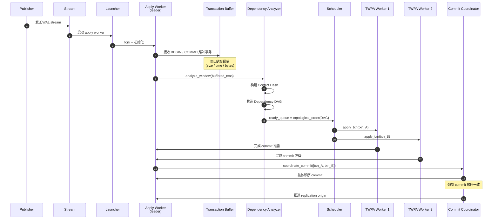
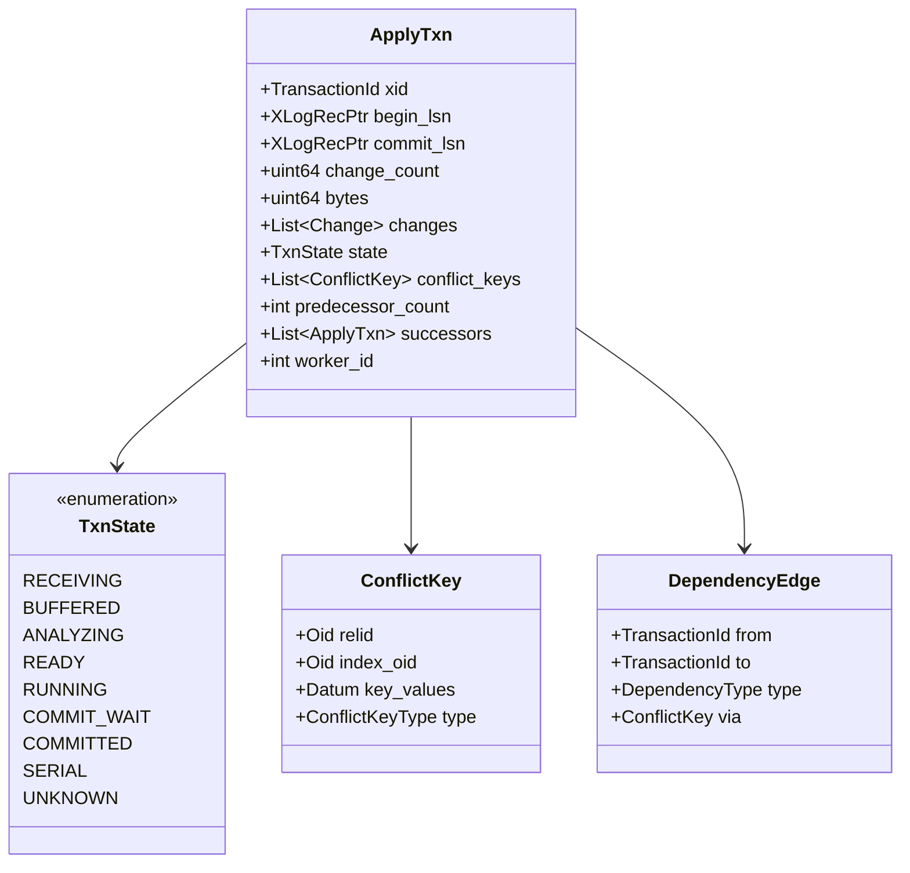
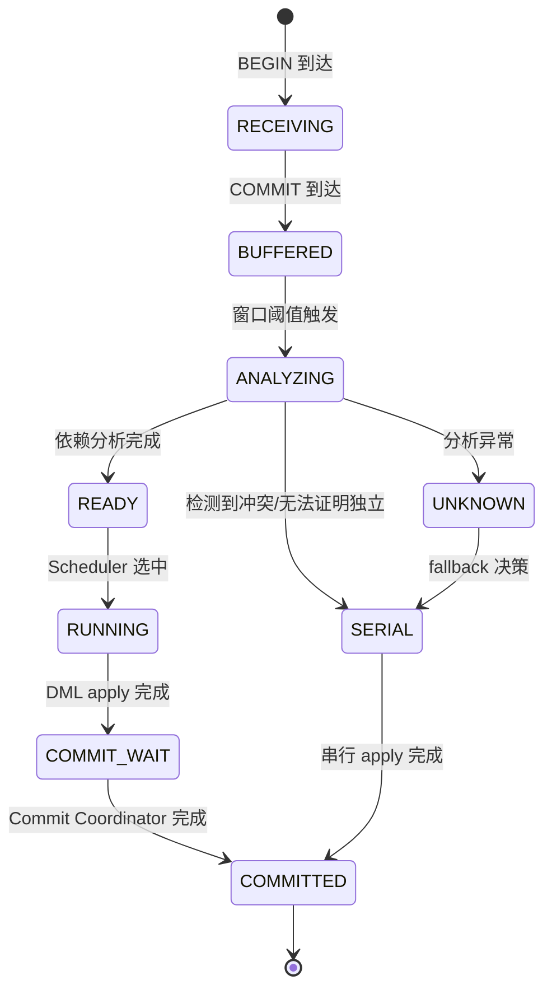
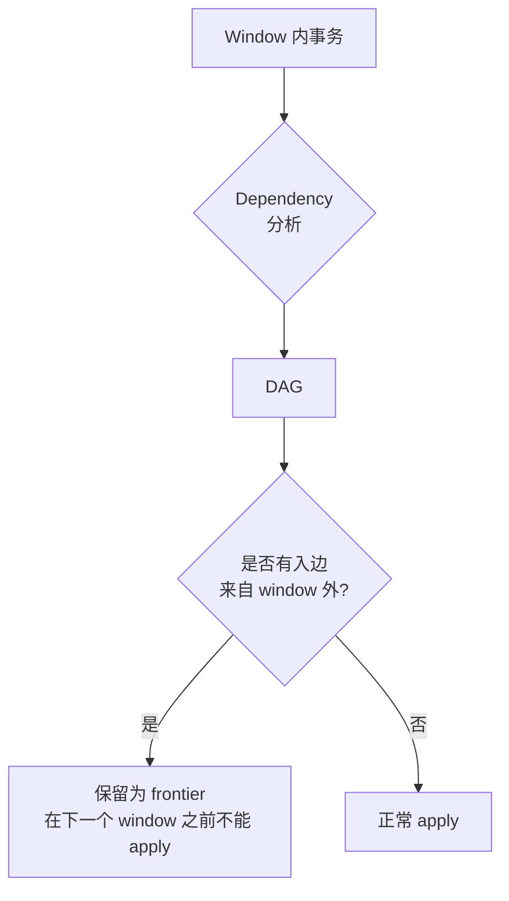
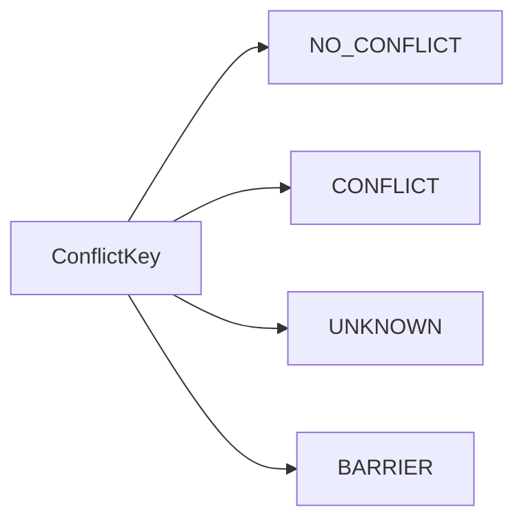
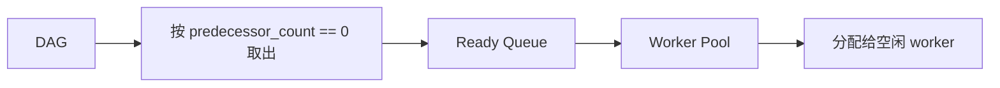
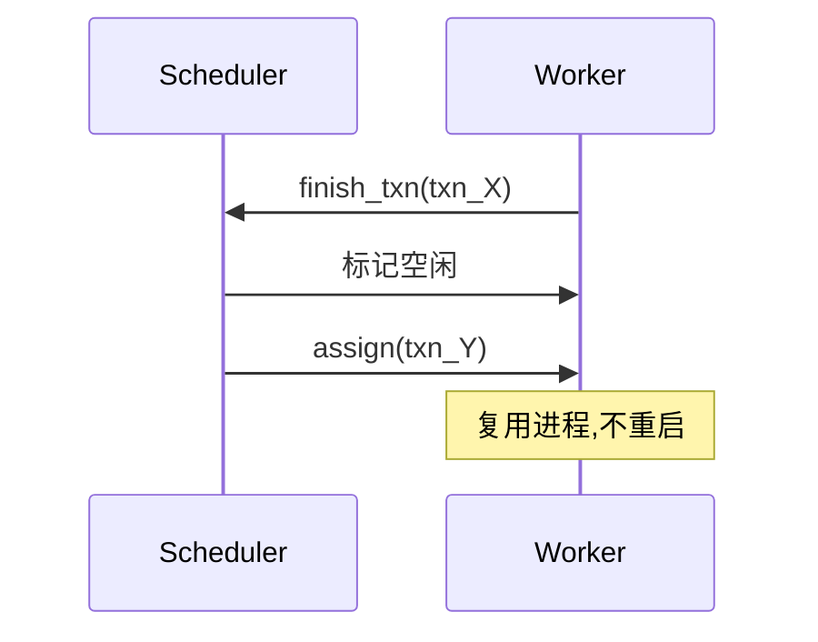
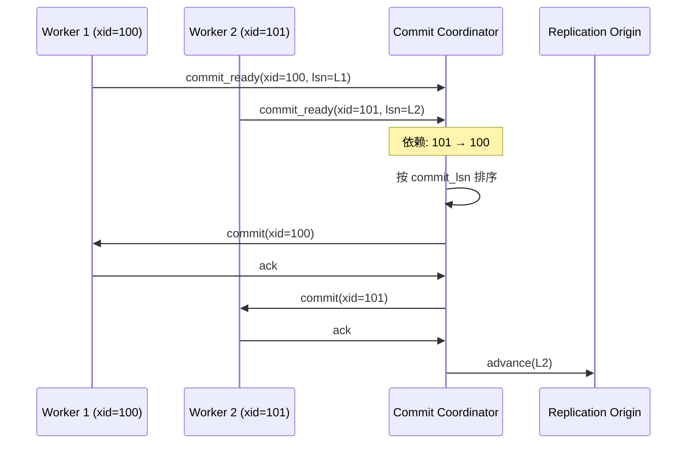

# 事务窗口并行 Apply(TWPA)概要设计文档

> **文档版本**:v1.0
> **适配版本**:PostgreSQL 18
> **源码基线**:`src/backend/replication/logical/{worker,applyparallelworker,launcher}.c`、`src/include/replication/{logicalworker,worker_internal}.h`
> **读者**:内核开发者、架构师、reviewer

## 一、文档目的

定义 TWPA(Transaction Window Parallel Apply)的**总体架构、核心数据流、组件交互与状态机**。本文不展开:

- 用户接口层(见《用户接口文档》)
- ConflictKey / Dependency DAG 算法细节(见《依赖冲突检测设计文档》)

## 二、设计目标

### 2.1 目标 G1~G5

| 编号 | 目标 | 度量 |
| --- | --- | --- |
| G1 | 提高小/中事务 apply 吞吐 | 小事务 TPS 提升 ≥ 2x |
| G2 | 保持事务级语义 | commit 顺序与 publisher 一致 |
| G3 | 无法证明安全时自动串行 | fallback 率 < 5% |
| G4 | 复用现有 parallel apply worker 基础设施 | 代码复用率 ≥ 50% |
| G5 | 与现有 logical replication 兼容 | 现有 API 零变更 |

### 2.2 非目标 N1~N4

| 编号 | 非目标 |
| --- | --- |
| N1 | 通用 SQL 并行执行 |
| N2 | 一个事务拆成多个 worker |
| N3 | 完整恢复所有读依赖(只识别写依赖) |
| N4 | 修改 PostgreSQL 事务一致性模型 |

## 三、总体架构

### 3.1 整体组件图

```mermaid
flowchart TB
    subgraph Pub[Publisher]
        WAL[WAL]::: pub --> DEC[Logical Decoding]::: pub
    end

    subgraph Net[Network<br/>流复制协议]
        DEC --> STREAM[WAL Stream]
    end

    subgraph Sub[Subscriber]
        STREAM --> LA["Apply Launcher<br/>bgworker"]::: sub
        LA --> AW["Apply Worker<br/>leader"]::: sub

        subgraph TWPA[TWPA Engine]
            TB[Transaction Buffer]::: twpa
            CH[Conflict Hash]::: twpa
            DA[Dependency Analyzer]::: twpa
            DAG[Dependency DAG]::: twpa
            SCH[Scheduler]::: twpa
            CC[Commit Coordinator]::: twpa
        end

        AW --> TB
        TB --> DA
        CH --> DA
        DA --> DAG
        DAG --> SCH
        SCH --> WP["Worker Pool<br/>TWPA Workers"]::: sub
        WP --> AW2[TWPA Worker 1]::: sub
        WP --> AW3[TWPA Worker 2]::: sub
        WP --> AWN[TWPA Worker N]::: sub

        AW2 --> DB["(Subscriber DB)"]::: db
        AW3 --> DB
        AWN --> DB
        AW2 --> CC
        AW3 --> CC
        AWN --> CC
        CC --> SCH
    end

    classDef pub fill:#dcfce7,stroke:#15803d
    classDef sub fill:#dbeafe,stroke:#1d4ed8
    classDef twpa fill:#fef9c3,stroke:#a16207
    classDef db fill:#fce7f3,stroke:#be185d
```

### 3.2 核心组件表

| 组件 | 文件 | 关键函数 | 职责 |
| --- | --- | --- | --- |
| Apply Launcher | `launcher.c` | `ApplyLauncherMain` | 启动/管理 apply worker |
| Apply Worker(leader) | `worker.c` | `ApplyWorkerMain`, `LogicalRepApplyLoop` | 接收数据流,驱动 TWPA |
| Transaction Buffer | `applyparallelworker.c` | `pa_allocate_worker`, `pa_free_worker` | 已接收事务的内存缓冲 |
| Conflict Hash | `applyparallelworker.c` | `pa_*` 系列 | 跟踪事务涉及的 ConflictKey |
| Dependency Analyzer | 新增 | `analyze_window` | 构造 DAG |
| Scheduler | 新增 | `schedule_ready_txns` | 将 DAG 拓扑序分发给 worker |
| Worker Pool | `applyparallelworker.c` | `ParallelApplyWorkerPool` | TWPA worker 池 |
| Commit Coordinator | 新增 | `coordinate_commit` | 强制 commit 顺序,提交 Replication Origin |

### 3.3 与现有代码的关系

```mermaid
flowchart LR
    A["streaming=parallel<br/>单事务内"]::: root --> B[Parallel Apply Worker]::: root
    C["TWPA<br/>多事务间"]::: root --> D[Transaction Window Scheduler]::: root
    B --> E["复用<br/>pa_launch_parallel_worker"]
    D --> E
    E --> F[共享 DSM + shm_mq]
    classDef root fill:#fef9c3,stroke:#a16207
```

> TWPA **复用** PG 18 已有的 `ParallelApplyWorkerInfo` + `pa_launch_parallel_worker` 机制,只在其上增加窗口调度层。

## 四、核心数据流

### 4.1 主路径(一次窗口的完整流程)



### 4.2 数据结构



> 完整数据结构定义见《依赖冲突检测设计文档》。

### 4.3 状态机



## 五、Transaction Buffer(事务缓冲)

### 5.1 设计原则

- **原则 1**:在 leader apply worker 进程内分配,不需要共享内存
- **原则 2**:哈希表 + 链表组合,O(1) 按 xid 查找
- **原则 3**:窗口触发时全量复制到分析层,分析过程不影响接收

### 5.2 数据结构

```c
/* applyparallelworker.c 扩展 */
typedef struct ApplyTxn {
    TransactionId xid;
    XLogRecPtr    begin_lsn;
    XLogRecPtr    commit_lsn;

    uint64        change_count;
    uint64        bytes;

    List         *changes;          /* List of LogicalRepChange */
    List         *conflict_keys;    /* List of ConflictKey */

    TxnState      state;

    int           predecessor_count;
    List         *successors;       /* List of ApplyTxn* */

    int           worker_id;        /* -1 = unassigned */
    TimestampTz   buffered_at;
} ApplyTxn;
```

## 六、Dependency Frontier

### 6.1 为什么需要

**问题**:Window 大小有限,但 publisher 上的事务依赖可能跨越窗口边界。

```mermaid
flowchart LR
    A[T1 已 commit]::: old --> B[T2 在 window 1]::: cur
    B --> C[T3 在 window 1]::: cur
    D[T4 在 window 2]::: next
    A -.->|写依赖| D
    classDef root fill:#fce7f3,stroke:#be185d
    classDef old fill:#e5e7eb,stroke:#6b7280
    classDef cur fill:#dcfce7,stroke:#15803d
    classDef next fill:#dbeafe,stroke:#1d4ed8
```

**结论**:窗口边界外的事务可能与窗口内事务有依赖 → 必须把"已经 commit 但还没 apply 完"的旧事务保留作为 `frontier`。

### 6.2 Frontier 定义



## 七、ConflictKey 设计要点

### 7.1 三大类



### 7.2 关键决策

| 决策 | 选择 | 理由 |
| --- | --- | --- |
| 用 PK 还是 Replica Identity FULL | 默认 PK,可选 FULL | 性能与准确度平衡 |
| UPDATE 怎么产生 ConflictKey | 旧值 + 新值都记录 | 必须捕获 read-modify-write 冲突 |
| 表无 PK 怎么办 | 退化为 conservative,或 fallback 串行 | 无 PK 无法精确判定 |
| 跨表 FK | 第一版不处理 | 太复杂,留待 v1.1 |

## 八、Dependency DAG

### 8.1 为什么是 DAG(而不是图)

事务提交顺序由 publisher 的 commit LSN 决定 → 天然是**偏序** → 无环 → DAG。

### 8.2 拓扑序调度

```mermaid
flowchart TB
    A[Tx1]::: n --> C[Tx3]
    B[Tx2]::: n --> C
    C --> D[Tx4]
    B --> D
    A --> D
    classDef n fill:#dcfce7,stroke:#15803d
```

调度顺序:`Tx1`, `Tx2` 可并行; `Tx3` 需等 Tx1、Tx2 完成; `Tx4` 需等 Tx1、Tx2、Tx3 完成。

### 8.3 关键设计

- **不存完整图**:只存 predecessor_count + successors
- **去重**:同一对事务之间最多一条依赖边
- **跨窗口依赖**:必须跨越到下一个 window 才能完成

## 九、Scheduler

### 9.1 Ready Queue



### 9.2 调度算法

```text
loop while window not empty:
    txn = ready_queue.pop()
    if idle_worker_available():
        worker.assign(txn)
        worker.start()
    else:
        ready_queue.wait()
        # 或 spill 到磁盘
```

### 9.3 Worker 复用



## 十、Commit Coordinator

### 10.1 为什么需要

并行 apply 中,**多个 worker 同时 commit 不同的 xid** → 如果不协调,commit 顺序可能乱 → 违反 publisher commit 顺序 → **事务依赖被破坏**。

### 10.2 协调流程



### 10.3 与 Replication Origin 的关系

- **每次 commit 必须推进 origin**,否则 publisher 看不到 ack
- **推进顺序 = commit 顺序**,由 commit_lsn 决定

## 十一、与 `streaming=parallel` 的关系

| 维度 | `streaming=parallel` | TWPA |
| --- | --- | --- |
| 粒度 | 单事务内多 stream | 多事务间 |
| 并行触发 | 大事务在 stream 时就分派 | 事务已 commit 后窗口分析 |
| 冲突 | 同一事务内不存在写写冲突 | 跨事务可能冲突,需依赖分析 |
| Worker 数量 | 每个事务 ~ N 个 | 整个 window ~ M 个 |

**两者关系**:

```mermaid
flowchart TB
    A[一条事务]::: root --> B{事务大小}
    B -->|大 / 长| C["streaming=parallel<br/>单事务内并行"]::: root
    B -->|小 / 中| D[commit 后进入 TWPA 窗口]::: root
    C --> E[事务完成后 commit]
    D --> F[窗口调度后 commit]
    classDef root fill:#fef9c3,stroke:#a16207
```

## 十二、关键兼容性原则

| 原则 | 含义 |
| --- | --- |
| **原则 1** | 不修改单事务的原子性边界 |
| **原则 2** | 不破坏 commit 顺序 |
| **原则 3** | 不修改 WAL 协议 |
| **原则 4** | 不修改现有的 Apply Worker 接口 |
| **原则 5** | 不可证明安全时立即 fallback 串行 |

## 十三、Worker 数量控制

```text
effective_parallel_workers
= min(
    subscription.transaction_parallel_workers,
    global.max_parallel_apply_workers_per_subscription,
    CPU 核数
  )
```

| 业务类型 | 推荐 |
| --- | --- |
| OLTP → OLAP 同步 | subscription 4 / global 8 |
| 单事务密集(每事务 10w+ 行) | subscription 2 |
| 大量小事务 + 写冲突少 | subscription 等于 CPU 核数 |

## 十四、参考

- PG 18 源码:
  - `src/backend/replication/logical/applyparallelworker.c`
  - `src/backend/replication/logical/worker.c`
  - `src/backend/replication/logical/launcher.c`
  - `src/include/replication/logicalworker.h`
  - `src/include/replication/worker_internal.h`
- 配套文档:《用户接口文档》《依赖冲突检测设计文档》
