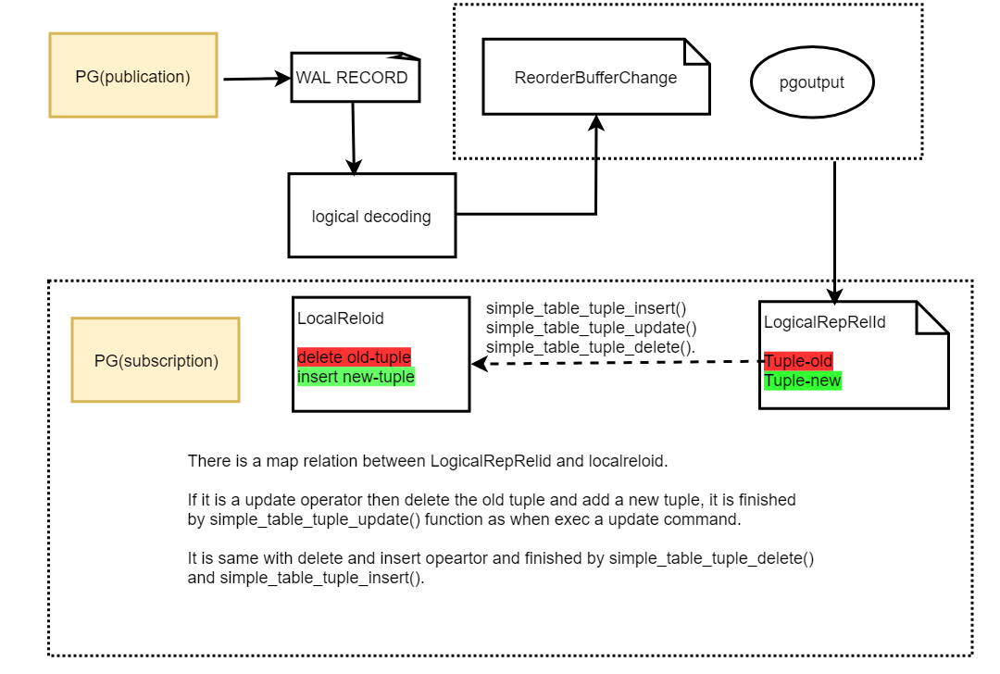
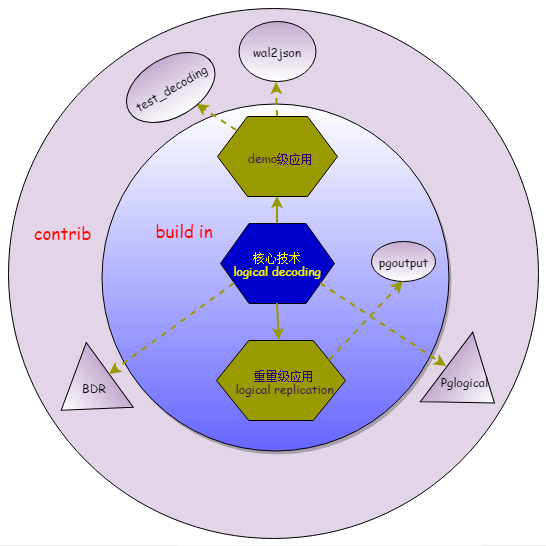

# pglogical详解

pglogical 是 PostgreSQL 的拓展模块, 为 PostgreSQL 数据库提供了逻辑流复制发布和订阅的功能。

逻辑复制是将数据重新执行一次insert、update或delete。pglogical就是逻辑复制的其中一种实现方式。


逻辑复制原理图：



逻辑复制组件关系图：



pglogical 是一个基于PostgreSQL逻辑解码框架的发布/订阅式逻辑复制扩展，支持：                                           
  - 选择性复制（表、行、列级过滤）
  - 多主复制（多个上游服务器）
  - 版本间升级（PostgreSQL 9.4-18）
  - DDL复制（可选）
  - 冲突检测与解决


```shell
┌─────────────────┐    ┌─────────────────┐    ┌─────────────────┐
  │   发布者端      │    │   网络传输      │    │   订阅者端      │
  │   (Provider)    │    │   (Network)     │    │   (Subscriber)  │
  ├─────────────────┤    ├─────────────────┤    ├─────────────────┤
  │ 1. 逻辑解码     │    │ 3. 二进制协议   │    │ 5. 数据应用     │
  │    (WAL→Change) │───▶│    传输         │───▶│    (Apply)      │
  │                 │    │                 │    │                 │
  │ 2. 复制集过滤   │    │ 4. 接收与解析   │    │ 6. 冲突解决     │
  │    (Filtering)  │    │                 │    │ (Conflict)      │
  └─────────────────┘    └─────────────────┘    └─────────────────┘
           │                       │                       │
           └───────────────────────┼───────────────────────┘
                                   │
                      ┌────────────┴────────────┐
                      │   pglogical_output      │
                      │   (输出插件)            │
                      └─────────────────────────┘
```

架构模型如下：

```shell
Provider (主)
   │
   │  logical decoding
   │
WAL → pglogical_output → network
   │
   ▼
Subscriber (从)
   │
apply worker
   │
SQL apply
   ▼
table
```

## 编译运行pglogical

要编译pglogical，需要先编译pg。

```shell
git clone https://git.postgresql.org/git/postgresql.git
cd postgresql
git checkout REL_15_STABLE # 以pg15为例
./configure --prefix=`pwd`/debug
make world -j16
make install-world
```

```shell
git clone https://github.com/2ndQuadrant/pglogical.git
cd pglogical
export PG_CONFIG=/path/pg_config
make
make install
```

```shell
[root@localhost pglogical]# ls /work/cwork/postgresql/debug/lib/pglogical*
/work/cwork/postgresql/debug/lib/pglogical_output.so
/work/cwork/postgresql/debug/lib/pglogical.so
[root@localhost pglogical]# ls /work/cwork/postgresql/debug/bin/pglogical*
/work/cwork/postgresql/debug/bin/pglogical_create_subscriber
[root@localhost pglogical]# 
```

最终主要生成了pglogical_output.so、pglogical.so两个插件，以及pglogical_create_subscriber。

### pglogical_output.so

pglogical_output.so 是 pglogical 的 Logical Decoding Output Plugin。

负责把 WAL 中解码出来的逻辑变更转换成可发送给订阅端的复制协议数据流。

它运行在 provider（主库）侧，被 PostgreSQL 的 logical decoding 框架调用。

```shell
Client SQL
   │
   ▼
PostgreSQL executor
   │
   ▼
WAL
   │
   ▼
Logical decoding
   │
   ▼
pglogical_output.so   ← 这里
   │
   ▼
walsender
   │
   ▼
network
   │
   ▼
subscriber apply worker
```

在walsender启动后，当收到启动逻辑复制的语句时回通过LoadOutputPlugin加载插件。

### pglogical.so

pglogical.so 是 pglogical 的数据库扩展（extension），负责管理复制拓扑、节点、replication set、apply worker 等控制逻辑。

具体包括：

1️. 创建和管理复制节点
2️. 管理 replication set
3️. 创建 replication slot
4️. 启动 apply worker
5️. 维护订阅关系
6️. DDL 同步控制
7️. worker 管理

```shell
                +------------------+
                |  pglogical.so    |
                |  (extension)     |
                +------------------+
                         |
                         | 管理
                         ↓
                +------------------+
                | pglogical_output |
                |  (output plugin) |
                +------------------+
                         |
                         ↓
                       WAL
```

| 组件                   | 作用     |
| -------------------- | ------ |
| pglogical.so         | 复制管理   |
| pglogical_output.so  | WAL 解码 |
| PostgreSQL walsender | 发送数据   |
| apply worker         | 应用数据   |


执行如下sql语句将会加载：

```sql
CREATE EXTENSION pglogical;
```

### pglogical_create_subscriber

pglogical_create_subscriber 主要用于 在订阅端（subscriber）初始化并建立复制关系。它是 pglogical 内部用于创建订阅者节点及其复制配置的一部分工具函数 / SQL API（不同版本实现略有差异），核心作用是 把当前数据库注册为一个 subscriber 并建立与 provider 的逻辑复制连接。

主要流程如下：

```shell
subscriber DB
     ↓
pglogical_create_subscriber
     ↓
create local node
     ↓
connect provider
     ↓
create replication slot
     ↓
create subscription metadata
     ↓
启动 apply worker
```


# reference

1. https://www.modb.pro/db/11333