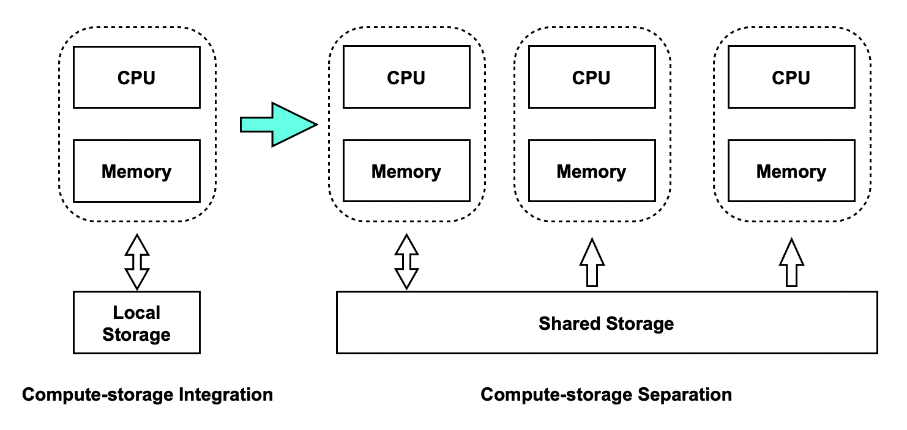
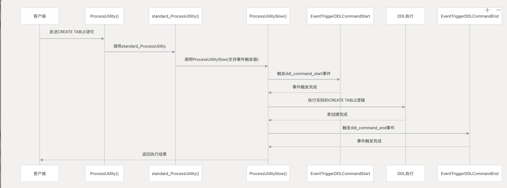

# polardb逻辑解码

## 结论

1. 对于同构数据库，由于polardb采用共享存储实现，其会把DDL写入wal，因为只有一份物理数据，采用DDL锁同步DDL；
2. 对于异构数据库，polardb没有提供现成方案，仍需要借助事件触发器、自定义逻辑解码插件来实现，比如pglogical；

## 逻辑解码

在原生的pg中，逻辑复制只会解析wal日志，而DDL语句是不会生成可解析的逻辑WAL。

这就导致在使用逻辑复制时，用户需要手动同步DDL。

而在polardb中，DDL虽然会写入WAL，但主要用于共享存储架构下的节点同步（所有数据库节点仅有一份物理数据）。
且写入到WAL中的数据是DDL锁信息。

因而polardb逻辑复制支持DDL根据同构还是异构数据库同步有所区别。

### 同构数据库逻辑同步支持DDL

在polardb的集群架构中，数据库节点之间使用共享存储保存数据（仅有一份物理数据）。



在PolarDB一写多读共享存储架构中：
  
- 数据文件只有一份，RO节点共享同一存储
- MVCC机制保证元组级别读写隔离，但文件操作（创建、删除）立即可见
- DDL操作涉及文件变更，需要集群级同步


PolarDB采用AccessExclusiveLock（DDL锁） 实现RW/RO节点间的DDL操作同步：

```c
  // standby.c: 记录DDL锁到WAL
  void LogAccessExclusiveLock(Oid dbOid, Oid relOid)
  {
      xl_standby_lock xlrec;
      xlrec.xid = GetCurrentTransactionId();
      xlrec.dbOid = dbOid;
      xlrec.relOid = relOid;

      polar_ddl_lock_lsn = LogAccessExclusiveLocks(1, &xlrec);
      MyXactFlags |= XACT_FLAGS_ACQUIREDACCESSEXCLUSIVELOCK;

      if (polar_enable_sync_ddl_legacy)
          polar_wait_ddl_lock();
  }
```

同步流程：

1. RW获取本地DDL锁并写入WAL（polar_ddl_lock_lsn）
2. 等待所有RO回放到该LSN，在RO本地获取相同锁
3. RW获取全局DDL锁（所有RO都已获取）
4. 执行DDL文件操作（此时RW/RO均无查询访问）
5. 释放锁，WAL记录锁释放

### 异构数据库逻辑同步

PolarDB 中 DDL 会写入 WAL，但主要用于共享存储架构下的节点同步，不会通过逻辑复制自动发送到异构数据库。

要实现到MySQL 的 DDL 同步需要借助事件触发器、自定义逻辑解码插件或第三方 CDC 工具。比如pglogical。


待处理问题：

1. DDL是如何保存的
2. polardb对DDL做了哪些特殊处理
3. 逻辑复制消息格式
4. walsender是如何发送逻辑复制的
5. walsender是如何发送DDL的（怎么区分DDL和WAL日志）

关键函数：

```c
```

执行流程

```shell
ProcessUtility()
   ↓
standard_ProcessUtility()
   ↓
EventTriggerDDLCommandStart
   ↓
执行DDL
   ↓
EventTriggerDDLCommandEnd
```


