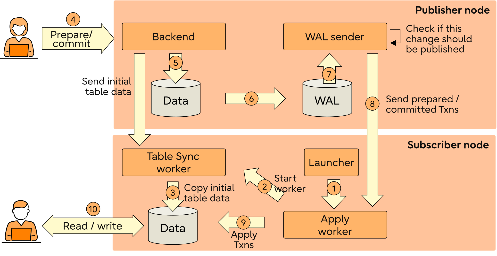
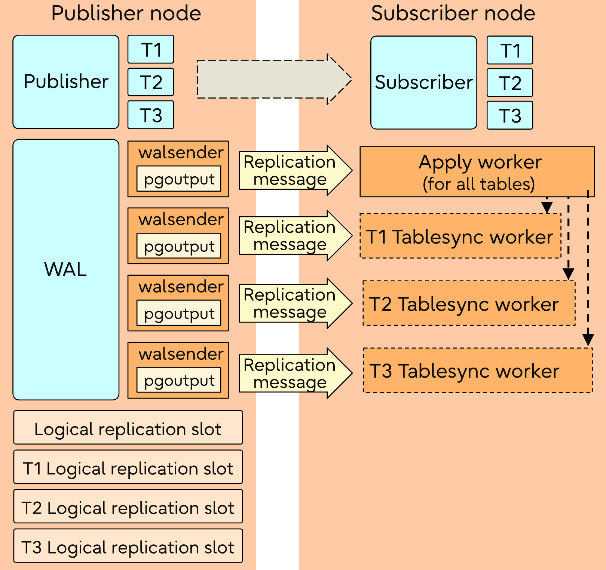
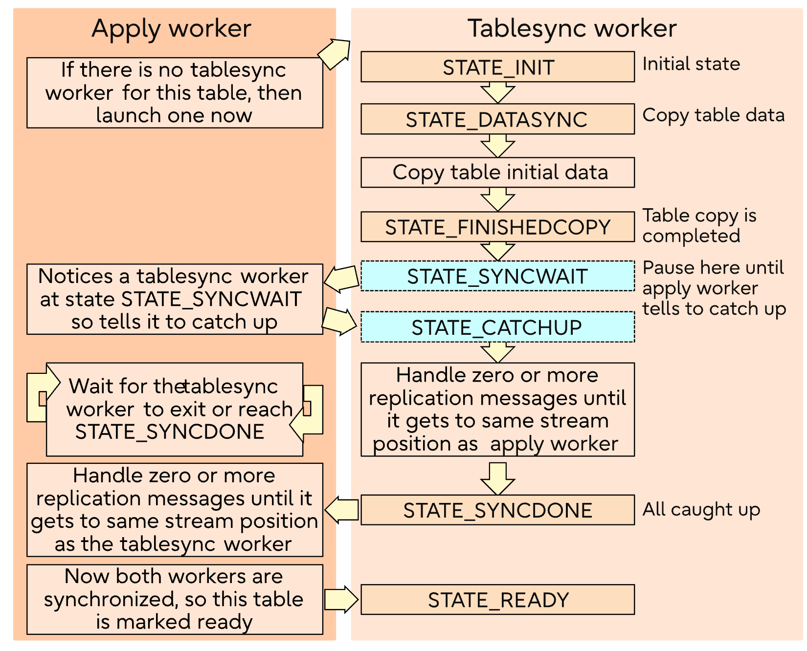
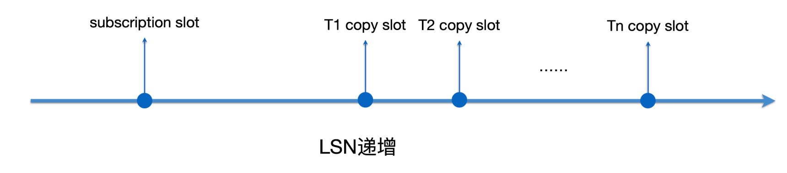
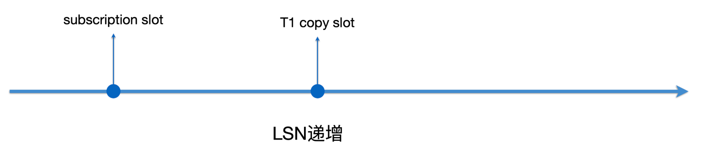
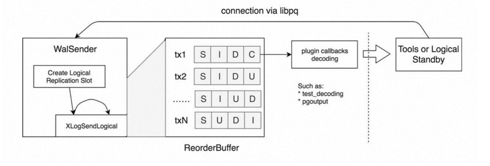

# postgresql逻辑复制(DML)

postgresql逻辑复制采用发布者订阅者模式，并且发布者和订阅者之间是多对多的关系。

逻辑复制架构如下所示：



逻辑复制的总架构，包含存量数据的复制、增量数据的复制。CREATE SUBSCRIPTION时，可以请求全量的数据。发布端接收和回复COPY数据。

## Publication

发布端创建，指定要发布什么给下游，目标是单个表或者一些表（指定shema下的表、所有表）。可以限制要发布什么行为：insert/update/delete/truncate，默认全部行为都发送。

```sql
CREATE PUBLICATION name
    [ FOR ALL TABLES
      | FOR publication_object [, ... ] ]
    [ WITH ( publication_parameter [= value] [, ... ] ) ]
```text
-  发布全部表（包括新建的表）
- 发布单个表
- 发布指定schema下的表（也包括新创建的表）

## Subscription

订阅端创建，指定要对哪个或哪些publication发起订阅。

```sql
CREATE SUBSCRIPTION subscription_name
    CONNECTION 'conninfo'
    PUBLICATION publication_name [, ...]
    [ WITH ( subscription_parameter [= value] [, ... ] ) ]
```text
subscription_parameter: 
  - create_slot：是否在源端创建logical replication slot
  - slot_name：使用源端已有的slot
  - binary：发布端直接以binary格式发送存量数据，无需转换成具体的类型。要求该数据类型必须定义send/receive函数。
  - copy_data：是否拷贝全量数据
  - streaming：默认为false：代表发布端解析到完整事务commit/abort后，才会发送到订阅端。
              假如decode过程中，事务内存超过logical_decoding_work_mem配置，会存储在本地临时文件；

        on：代表发布端无需解析到完整事务，在内存超出logical_decoding_work_mem配置时，
        选择最大的事务发送到订阅端（不管此事务是否提交），此事务称为stream事务。
        订阅端将收到的内容存在本地临时文件，在收到commit或abort时，将事务提交或回滚。

        parallel： 在streaming=on的基础上，订阅端会使用leader apply worker接收到内容，
        再交由paralle apply worker或者leader apply worker自己apply。

  - synchronous_commit：与物理复制的synchronous_commit一样。
  - two_phase：二阶段提交事务的优化，无需等到commit再发送数据，在prepare阶段就可以发送。
  - origin：标识subscription的源头，下文双向逻辑复制会详解

每个publication可以有多个subscription，每个subscription也可以订阅多个publication。每个subscription都必须使用一个logical replication slot，主要用来记录订阅端复制的进度，也就是LSN。

订阅状态存储在pg_stat_subscription视图中。

## 逻辑复制流程解析

### Replication launcher

Replication launcher是PG的background worker，PG启动后就常驻下来，这个进程会周期性检查pg_subscription表，并为每个订阅启动一个Apply worker。

```shell
dys@localhost bin]$ ps -ef | grep postgres
dys      1201049       1  0 3月08 ?       00:00:09 /work/cwork/postgresql/debug/bin/postgres -D /home/dys/data
dys      1201050 1201049  0 3月08 ?       00:00:00 postgres: checkpointer 
dys      1201051 1201049  0 3月08 ?       00:00:00 postgres: background writer 
dys      1201053 1201049  0 3月08 ?       00:00:00 postgres: walwriter 
dys      1201054 1201049  0 3月08 ?       00:00:00 postgres: autovacuum launcher 
dys      1201055 1201049  0 3月08 ?       00:00:00 postgres: pglogical supervisor 
dys      1201056 1201049  0 3月08 ?       00:00:00 postgres: logical replication launcher
```text
### apply worker

每个subscription对应一个Apply worker。Apply worker既负责启动Tablesync worker拷贝存量数据，又负责消费增量数据。



### Tablesync worker

Tablesync worker是由Apply worker调度的，每个Tablesync worker都只负责唯一一个表的存量数据同步。

Tablesync worker和Apply worker整体工作流程如下图所示。这里我们简单地了解：Apply worker轮询所有未同步的表，启动Tablesync worker去同步，并促使Tablesync worker经过7个状态。



### 数据复制流程

每个Tablesync worker都会为表创建一个slot（下图的copy slot），加上subscription对应的slot，所有slot按LSN递增的顺序，如下图所示：



Table sync worker会做以下几个事情：

1. 开启repeatable read事务，状态更新为STATE_INIT。
2. 创建logical replication slot（即下图的T1 copy slot），参数传递USE_SNAPSHOT，该参数的含义为当slot到达SNAPBUILD_CONSISTENT状态后，会产生一个snapshot，此快照被设置为当前事务的快照。
3. libpq执行COPY TO STDOUT，本地通过CopyFrom函数接收copy存量数据，状态更新为STATE_DATASYNC



## 如何逻辑解码（从WAL到数据）

### 逻辑解码整体流程

所有逻辑解码流程发生在Walsender进程中，Walsender进程读取WAL，使用rmgr模块解析，解析好后放入内存中的ReorderBuffer，在每次解析到commit/abort时，将对应的事务通过预先设定的plugin逻辑解析和输出（当subscription的streaming选项设成on或parallel，无需等到commit）。

下图事务tx中的S、I、D、C等代表逻辑解码时不同的动作，S代表事务开始，C代表事务提交，只有提交的事务才有可能发送到下游。



### Snapshot Builder

slot刚创建好时，是不能直接给下游消费的，需要由Snapshot Builder模块建立到一个SNAPBUILD_CONSISTENT的状态。

开启逻辑复制后（wal_level = logical），WAL中会多记录一些信息，UPDATE SQL会记录old tuple和new tuple，DELETE SQL会记录old tuple，只是都以二进制形式存储，需要元数据做基础，才能解析出来。如果没有系统表做元数据，是无法从二进制中反解出逻辑修改的。因此，逻辑解码的过程中要访问系统表，就需要先构建访问系统表的事务快照，然后带着快照去读系统表。注意：快照是持久化到磁盘的。

# reference

1.http://mysql.taobao.org/monthly/2025/03/01/