## 发送方

逻辑复制与物理复制使用相同的发送框架，都在walsender中进行发送。整体流程大致如下：

1. 交换系统信息，校验身份； identify system
2. 创建复制槽； create slot
3. start replication；
4. 启动了一个walsender进程，初始化发送环境，创建快照；
5. walsenderloop通过传入发送函数的方式循环发送数据；
6. 对于逻辑复制来说发送函数是XLogSendLogical；
7. 逻辑日志发送函数会依次读取xlog 的record--》XLogReadRecord；
8. 读取到后就会进行逻辑解码LogicalDecodingProcessRecord；
9. 然后重复上面的7和8；

Walsender是PostgreSQL中负责向备库或逻辑复制订阅者发送WAL记录的进程。在逻辑复制中，walsender不仅发送原始的WAL字节流，还负责逻辑解码：读取WAL记录，解码为逻辑操作，通过输出插件（如pgoutput）格式化为逻辑复制协议消息，最后发送给订阅者。

walsender被设计为一个发送框架，提供很强的扩展性和插拔性，使我们可以自己扩展和实现流复制或者逻辑复制的功能。 walsender采用插件机制来实现，并定义了大量的回调函数接口。

通过注册加载不同的插件，定义不同的实现函数，来实现多种解码行为。比如test_decoding插件和pg_output插件。

### 插件机制

walsender在初始化解码上下文时，需要先加载插件，并把插件的回调函数注册进来。执行函数为：

```c
static LogicalDecodingContext *
StartupDecodingContext(List *output_plugin_options,
					   XLogRecPtr start_lsn,
					   TransactionId xmin_horizon,
					   bool need_full_snapshot,
					   bool fast_forward,
					   bool in_create,
					   XLogReaderRoutine *xl_routine,
					   LogicalOutputPluginWriterPrepareWrite prepare_write,
					   LogicalOutputPluginWriterWrite do_write,
					   LogicalOutputPluginWriterUpdateProgress update_progress)
```

其中，里面最关键的是：

```c
if (!fast_forward)
		LoadOutputPlugin(&ctx->callbacks, NameStr(slot->data.plugin));
```

callbacks用于接收插件的回调函数，NameStr(slot->data.plugin)用于获取复制槽里定义的插件名字，即客户端指定的用哪个插件来进行解码。

插件的初始化函数接口是固定的，它会将_PG_output_plugin_init从so中加载进来执行。

```c
plugin_init = (LogicalOutputPluginInit)
		load_external_function(plugin, "_PG_output_plugin_init", false, NULL);
```

拿到插件里的函数句柄后，就可以初始化回调函数：

```c
plugin_init(callbacks);
```

### 回调函数

回调函数分为walsender回调函数和output插件回调函数。
#### walsender回调函数

##### LogicalDecodingContext创建

walsender在逻辑复制开始时创建逻辑解码上下文（LogicalDecodingContext），这是回调函数注册的关键入口。

```c
ctx = CreateInitDecodingContext(cmd->plugin, NIL, need_full_snapshot,
                                InvalidXLogRecPtr,
                                XL_ROUTINE(.page_read = logical_read_xlog_page,
                                           .segment_open = WalSndSegmentOpen,
                                           .segment_close = wal_segment_close),
                                WalSndPrepareWrite, WalSndWriteData,
                                WalSndUpdateProgress);
```

`CreateInitDecodingContext`函数（定义在`logical.c`）接收三个重要的回调组：

1. **XLogReaderRoutine回调**：用于读取WAL段文件
   - `page_read`：`logical_read_xlog_page` - 读取WAL页
   - `segment_open`：`WalSndSegmentOpen` - 打开WAL段文件
   - `segment_close`：`wal_segment_close` - 关闭WAL段文件

2. **Writer回调**：用于输出数据到网络
   - `prepare_write`：`WalSndPrepareWrite` - 准备写入缓冲区
   - `write`：`WalSndWriteData` - 实际写入网络
   - `update_progress`：`WalSndUpdateProgress` - 更新复制进度

##### 回调函数结构

回调函数存储在`LogicalDecodingContext`结构体中（定义在`logical.h`）：

```c
typedef struct LogicalDecodingContext
{
    /* ... */
    XLogReaderRoutine *reader_routine;

    /* User-Provided callback for writing/streaming out data. */
    LogicalOutputPluginWriterPrepareWrite prepare_write;
    LogicalOutputPluginWriterWrite write;
    LogicalOutputPluginWriterUpdateProgress update_progress;

    /* Output buffer. */
    StringInfo  out;
    /* ... */
} LogicalDecodingContext;
```

##### 回调函数实现


| 函数名 | 作用 | 函数定义 |
|--------|------|----------|
| `logical_read_xlog_page` | 作为walsender进程的逻辑解码上下文的page_read回调。与通用的`read_local_xlog_page`不同，walsender可以利用其latch机制更高效地等待WAL刷新。 | `static int logical_read_xlog_page(XLogReaderState *state, ...)` |
| `WalSndSegmentOpen` | 处理历史时间线下的WAL段文件打开。当从历史时间线读取时，如果段内发生时间线切换，需要读取新时间线的段文件。 | `static void WalSndSegmentOpen(XLogReaderState *state, ...)` |
| `WalSndPrepareWrite` | LogicalDecodingContext的prepare_write回调。准备写入StringInfo缓冲区，但不立即发送。 | `static void WalSndPrepareWrite(LogicalDecodingContext *ctx, ...)` |
| `WalSndWriteData` | LogicalDecodingContext的write回调。将准备好的数据实际写入网络。 | `static void WalSndWriteData(LogicalDecodingContext *ctx, ...)` |
| `WalSndUpdateProgress` | LogicalDecodingContext的update_progress回调。更新复制延迟跟踪，并在跳过空事务时发送保活消息。 | `static void WalSndUpdateProgress(LogicalDecodingContext *ctx, ...)` |

#### output插件回调函数

##### 插件初始化

pgoutput作为逻辑解码输出插件，通过`_PG_output_plugin_init`函数注册其回调。该函数在插件加载时被调用（代码在`pgoutput.c`）：

```c
void
_PG_output_plugin_init(OutputPluginCallbacks *cb)
{
    cb->startup_cb = pgoutput_startup;
    cb->begin_cb = pgoutput_begin_txn;
    cb->change_cb = pgoutput_change;
    cb->truncate_cb = pgoutput_truncate;
    cb->message_cb = pgoutput_message;
    cb->commit_cb = pgoutput_commit_txn;

    cb->begin_prepare_cb = pgoutput_begin_prepare_txn;
    cb->prepare_cb = pgoutput_prepare_txn;
    cb->commit_prepared_cb = pgoutput_commit_prepared_txn;
    cb->rollback_prepared_cb = pgoutput_rollback_prepared_txn;
    cb->filter_by_origin_cb = pgoutput_origin_filter;
    cb->shutdown_cb = pgoutput_shutdown;

    /* transaction streaming */
    cb->stream_start_cb = pgoutput_stream_start;
    cb->stream_stop_cb = pgoutput_stream_stop;
    cb->stream_abort_cb = pgoutput_stream_abort;
    cb->stream_commit_cb = pgoutput_stream_commit;
    cb->stream_change_cb = pgoutput_change;
    cb->stream_message_cb = pgoutput_message;
    cb->stream_truncate_cb = pgoutput_truncate;
    /* transaction streaming - two-phase commit */
    cb->stream_prepare_cb = pgoutput_stream_prepare_txn;
}
```

##### 回调函数结构

输出插件的回调函数通过`OutputPluginCallbacks`结构体（定义在`output_plugin.h`）统一管理，该结构体包含完整的逻辑解码生命周期回调：

```c
typedef struct OutputPluginCallbacks
{
    /* 插件生命周期 */
    LogicalDecodeStartupCB startup_cb;
    LogicalDecodeShutdownCB shutdown_cb;

    /* 事务生命周期 */
    LogicalDecodeBeginCB begin_cb;
    LogicalDecodeCommitCB commit_cb;
    LogicalDecodeBeginPrepareCB begin_prepare_cb;
    LogicalDecodePrepareCB prepare_cb;
    LogicalDecodeCommitPreparedCB commit_prepared_cb;
    LogicalDecodeRollbackPreparedCB rollback_prepared_cb;

    /* 数据变更 */
    LogicalDecodeChangeCB change_cb;
    LogicalDecodeTruncateCB truncate_cb;
    LogicalDecodeMessageCB message_cb;

    /* 来源过滤 */
    LogicalDecodeFilterByOriginCB filter_by_origin_cb;

    /* 流式事务 */
    LogicalDecodeStreamStartCB stream_start_cb;
    LogicalDecodeStreamStopCB stream_stop_cb;
    LogicalDecodeStreamAbortCB stream_abort_cb;
    LogicalDecodeStreamCommitCB stream_commit_cb;
    LogicalDecodeStreamChangeCB stream_change_cb;
    LogicalDecodeStreamMessageCB stream_message_cb;
    LogicalDecodeStreamTruncateCB stream_truncate_cb;
    LogicalDecodeStreamPrepareCB stream_prepare_cb;
} OutputPluginCallbacks;
```

各回调函数的作用域：
- **插件生命周期回调**：插件加载/卸载时的初始化和清理
- **事务生命周期回调**：普通事务和两阶段事务的开始、准备、提交、回滚
- **数据变更回调**：处理DML操作（INSERT/UPDATE/DELETE/TRUNCATE）和逻辑消息
- **来源过滤回调**：根据事务来源进行过滤控制
- **流式事务回调**：支持流式复制模式下的增量事务处理

##### 回调函数实现

| 函数名 | 作用 | 函数定义 |
|--------|------|----------|
| `pgoutput_startup` | 插件初始化。解析逻辑复制参数（协议版本、发布名称等），设置发布过滤条件，分配插件私有数据。 | `static void pgoutput_startup(LogicalDecodingContext *ctx, OutputPluginOptions *opt, bool is_init)` |
| `pgoutput_shutdown` | 插件关闭清理。释放插件私有数据，清理资源。 | `static void pgoutput_shutdown(LogicalDecodingContext *ctx)` |
| `pgoutput_begin_txn` | 事务开始。发送事务开始消息，包含XID、开始LSN等信息。 | `static void pgoutput_begin_txn(LogicalDecodingContext *ctx, ReorderBufferTXN *txn)` |
| `pgoutput_commit_txn` | 事务提交。发送事务提交消息，包含XID、提交LSN、提交时间等信息。 | `static void pgoutput_commit_txn(LogicalDecodingContext *ctx, ReorderBufferTXN *txn, XLogRecPtr commit_lsn)` |
| `pgoutput_begin_prepare_txn` | 两阶段事务开始准备。发送准备阶段开始消息。 | `static void pgoutput_begin_prepare_txn(LogicalDecodingContext *ctx, ReorderBufferTXN *txn)` |
| `pgoutput_prepare_txn` | 事务准备。发送PREPARE消息，包含GID等两阶段提交信息。 | `static void pgoutput_prepare_txn(LogicalDecodingContext *ctx, ReorderBufferTXN *txn, XLogRecPtr prepare_lsn)` |
| `pgoutput_commit_prepared_txn` | 已准备事务提交。发送COMMIT PREPARED消息。 | `static void pgoutput_commit_prepared_txn(LogicalDecodingContext *ctx, ReorderBufferTXN *txn, XLogRecPtr commit_lsn)` |
| `pgoutput_rollback_prepared_txn` | 已准备事务回滚。发送ROLLBACK PREPARED消息。 | `static void pgoutput_rollback_prepared_txn(LogicalDecodingContext *ctx, ReorderBufferTXN *txn, XLogRecPtr prepare_lsn)` |
| `pgoutput_change` | 处理数据变更（INSERT/UPDATE/DELETE）。根据发布配置过滤表和列，将变更转换为逻辑复制协议格式，通过`OutputPluginPrepareWrite`和`OutputPluginWrite`输出。 | `static void pgoutput_change(LogicalDecodingContext *ctx, ReorderBufferTXN *txn, Relation rel, ReorderBufferChange *change)` |
| `pgoutput_truncate` | 处理TRUNCATE操作。发送TRUNCATE消息，包含受影响的关系列表和级联选项。 | `static void pgoutput_truncate(LogicalDecodingContext *ctx, ReorderBufferTXN *txn, int nrelations, Relation relations[], ReorderBufferChange *change)` |
| `pgoutput_message` | 处理逻辑解码消息。发送逻辑消息，包含前缀、内容和事务性标志。 | `static void pgoutput_message(LogicalDecodingContext *ctx, ReorderBufferTXN *txn, XLogRecPtr message_lsn, bool transactional, const char *prefix, Size message_size, const char *message)` |
| `pgoutput_origin_filter` | 来源过滤。根据事务来源决定是否处理该事务，用于跨集群复制过滤。 | `static bool pgoutput_origin_filter(LogicalDecodingContext *ctx, RepOriginId origin_id)` |
| `pgoutput_stream_start` | 流式事务开始。发送流式事务开始消息。 | `static void pgoutput_stream_start(LogicalDecodingContext *ctx, ReorderBufferTXN *txn)` |
| `pgoutput_stream_stop` | 流式事务停止。发送流式事务停止消息。 | `static void pgoutput_stream_stop(LogicalDecodingContext *ctx, ReorderBufferTXN *txn)` |
| `pgoutput_stream_abort` | 流式事务中止。发送流式事务中止消息。 | `static void pgoutput_stream_abort(LogicalDecodingContext *ctx, ReorderBufferTXN *txn, XLogRecPtr abort_lsn)` |
| `pgoutput_stream_commit` | 流式事务提交。发送流式事务提交消息。 | `static void pgoutput_stream_commit(LogicalDecodingContext *ctx, ReorderBufferTXN *txn, XLogRecPtr commit_lsn)` |
| `pgoutput_stream_prepare_txn` | 流式事务准备。发送流式事务的PREPARE消息。 | `static void pgoutput_stream_prepare_txn(LogicalDecodingContext *ctx, ReorderBufferTXN *txn, XLogRecPtr prepare_lsn)` |

**注意**：
- `stream_change_cb`、`stream_message_cb`、`stream_truncate_cb`分别复用`pgoutput_change`、`pgoutput_message`、`pgoutput_truncate`函数
- 所有回调函数最终都通过`OutputPluginPrepareWrite`和`OutputPluginWrite`间接调用walsender的writer回调

##### 数据写入流程


pgoutput回调函数不直接写入网络，而是通过`LogicalDecodingContext`的writer回调。典型模式：

```c
/* 在pgoutput_change中 */
OutputPluginPrepareWrite(ctx, false);  /* 调用WalSndPrepareWrite */
/* ... 构建消息数据到ctx->out ... */
OutputPluginWrite(ctx, false);         /* 调用WalSndWriteData */
```

`OutputPluginPrepareWrite`和`OutputPluginWrite`函数（在`logical.c`中）是对writer回调的简单封装：

```c
void
OutputPluginPrepareWrite(struct LogicalDecodingContext *ctx, bool last_write)
{
    ctx->prepare_write(ctx, ctx->write_location, ctx->write_xid, last_write);
    ctx->prepared_write = true;
}

void
OutputPluginWrite(struct LogicalDecodingContext *ctx, bool last_write)
{
    ctx->write(ctx, ctx->write_location, ctx->write_xid, last_write);
    ctx->prepared_write = false;
}
```


### 快照机制

逻辑解码需要一致的快照来确保数据一致性，这是通过`SnapBuild`模块实现的。快照构建过程经历以下状态转换（定义于`SnapBuildState`）：

1. **SNAPBUILD_START**：初始状态，等待第一个`xl_running_xacts`记录。
2. **SNAPBUILD_BUILDING_SNAPSHOT**：收集已提交的事务，构建初始目录快照。
3. **SNAPBUILD_FULL_SNAPSHOT**：已收集足够信息，可以解码在此之后开始的事务中的数据变更，但变更可能基于仍在运行的事务，因此暂不应用。
4. **SNAPBUILD_CONSISTENT**：在FULL_SNAPSHOT之后找到所有当时运行的事务都已结束的点，可以安全地调用提交回调。

**快照构建关键机制**：
- **历史快照**：`SnapBuild`构建的是历史快照（historic snapshot），只能用于读取目录表，不能读取用户表。这是因为解码所需的数据完全包含在WAL记录中。
- **目录修改事务跟踪**：与普通快照跟踪所有运行事务不同，逻辑解码快照只跟踪提交的目录修改事务（在`[xmin, xmax)`范围内）。这减少了内存开销，因为目录修改事务的比例通常很小。
- **CID映射**：由于WAL记录不包含cmin/cmax（命令ID），`heapam`在每次修改目录行时写入`XLOG_HEAP2_NEW_CID`记录。解码时，这些`(ctid -> (cmin, cmax))`映射被插入到ReorderBuffer中，用于可见性检查。

**对回调流程的影响**：
- 快照状态决定输出插件回调的调用时机：只有达到`SNAPBUILD_CONSISTENT`状态后，`ReorderBuffer`才会调用`commit_cb`。
- 在`SNAPBUILD_FULL_SNAPSHOT`之后，`ReorderBuffer`可以开始收集变更，但直到`SNAPBUILD_CONSISTENT`才提交。
- `SnapBuild`与`ReorderBuffer`紧密协作：`ReorderBuffer`在事务提交时调用`SnapBuildCommitTxn`，更新快照构建器的状态。

### 事务处理

ReorderBuffer`是逻辑解码的事务管理器，负责重组WAL中的变更，并在适当时间调用输出插件回调。

**事务数据结构**：
- `ReorderBufferTXN`：表示一个事务（顶层或子事务），包含事务ID、LSN范围、变更列表、快照、元组CID映射等。
- `ReorderBufferChange`：表示单个变更（INSERT/UPDATE/DELETE/TRUNCATE等），包含新旧元组、关系信息等。

**事务状态标志**（`ReorderBufferTXN->txn_flags`）：
- `RBTXN_HAS_CATALOG_CHANGES`：事务是否修改了目录。
- `RBTXN_IS_STREAMED`：事务是否已流式传输到下游。
- `RBTXN_IS_PREPARED`：是否为准备事务（两阶段提交）。
- `RBTXN_IS_COMMITTED`/`RBTXN_IS_ABORTED`：事务已提交或中止。

**事务处理流程**：
1. **事务开始**：`ReorderBuffer`收到事务的第一个变更时创建`ReorderBufferTXN`，调用输出插件的`begin_cb`（如果已注册）。
2. **变更累积**：将变更按顺序添加到事务的`changes`链表中。对于TOAST元组，使用`toast_hash`暂存部分数据。
3. **事务提交**：收到提交记录时，`ReorderBuffer`按LSN顺序排序所有变更（包括子事务），然后调用输出插件的`commit_cb`。
4. **流式事务**：当变更超过`logical_decoding_work_mem`时，事务可以流式传输：调用`stream_start_cb`，然后分批发送变更，最后调用`stream_commit_cb`。
5. **两阶段提交**：支持准备事务（`prepare_cb`）和提交准备事务（`commit_prepared_cb`）。

**对回调流程的影响**：
- `ReorderBuffer`是连接WAL解码和输出插件的桥梁：它决定何时调用`begin_cb`、`change_cb`、`commit_cb`等。
- 内存管理：当变更总大小超过`logical_decoding_work_mem`时，`ReorderBuffer`将事务序列化到磁盘，避免内存耗尽。
- 子事务处理：子事务的变更在父事务提交时一并排序和输出，保持事务原子性。

### 复制槽机制

复制槽是PostgreSQL确保WAL保留的机制，防止逻辑解码所需的数据被过早删除。

**逻辑复制槽的关键字段**（`ReplicationSlotPersistentData`）：
- `restart_lsn`：复制槽需要的最旧WAL位置。WAL文件必须至少保留到此LSN。
- `xmin`：逻辑槽需要的最旧事务ID。Vacuum不能清理此xmin之前的事务所删除的元组。
- `catalog_xmin`：逻辑解码需要的最旧目录事务ID。Vacuum不能清理此xmin之前的目录元组。
- `confirmed_flush`：客户端已确认接收的LSN，用于决定解码起点。

**复制槽与解码流程的交互**：
1. **启动解码**：`StartLogicalReplication`根据复制槽的`confirmed_flush`（或客户端指定的LSN）开始解码。
2. **WAL保留**：`ReplicationSlotReserveWal`确保所需的WAL段不被删除。如果WAL被删除，复制槽会被标记为无效（`RS_INVAL_WAL_REMOVED`）。
3. **进度跟踪**：`WalSndUpdateProgress`更新`confirmed_flush`，允许后续vacuum清理更旧的数据。
4. **崩溃安全**：逻辑复制槽是持久化的（`RS_PERSISTENT`），`CheckPointReplicationSlots`在检查点将槽状态刷盘。

**对整体流程的影响**：
- **解码起点**：复制槽的`confirmed_flush`决定了从哪个LSN开始发送数据。如果客户端未指定start LSN，则使用此值。
- **资源管理**：复制槽的`xmin`和`catalog_xmin`影响vacuum的激进程度。长时间不推进的复制槽可能导致表膨胀。
- **高可用**：复制槽可以同步到备机（`synced`），在故障转移后继续解码。

### ReorderBuffer

WAL 日志中记录的变更是按 **LSN（Log Sequence Number）顺序** 排列的，而不是按事务边界组织的。一个事务的多个变更可能与其他事务的变更交错出现。ReorderBuffer 的作用就是将这些分散的变更重新排序，按照事务边界组织，并在事务提交时一次性输出所有变更。

它主要依赖以下几个模块：
- **decode.c**：负责解析 WAL 记录，将其转换为 ReorderBufferChange 结构。
- **snapbuild.c**：负责构建逻辑解码所需的一致性快照。
- **logical.c**：逻辑解码的主入口，协调各组件工作。

ReorderBuffer在创建逻辑解码上下文时被创建，并在读取到wal记录时进行调用，具体调用函数流程如下：

```shell
XLogReadRecord()
   ↓
LogicalDecodingProcessRecord()
   ↓
DecodeHeapOp / DecodeCommit / DecodeInsert
   ↓
ReorderBufferQueueChange()
```

对于事务类型的wal，它的解析函数为xact_decode：

```c
PG_RMGR(RM_XACT_ID, "Transaction", xact_redo, xact_desc, xact_identify, NULL, NULL, NULL, xact_decode)
```

其解析流程如下：

```c
switch (info)
	{
		case XLOG_XACT_COMMIT:
		case XLOG_XACT_COMMIT_PREPARED:
			{
				xl_xact_commit *xlrec;
				xl_xact_parsed_commit parsed;
				TransactionId xid;
				bool		two_phase = false;

				xlrec = (xl_xact_commit *) XLogRecGetData(r);
				ParseCommitRecord(XLogRecGetInfo(buf->record), xlrec, &parsed);

				if (!TransactionIdIsValid(parsed.twophase_xid))
					xid = XLogRecGetXid(r);
				else
					xid = parsed.twophase_xid;

				if (info == XLOG_XACT_COMMIT_PREPARED)
					two_phase = !(FilterPrepare(ctx, xid,
												parsed.twophase_gid));

				DecodeCommit(ctx, buf, &parsed, xid, two_phase);
				break;
			}
		case XLOG_XACT_ABORT:
		case XLOG_XACT_ABORT_PREPARED:
			{
				xl_xact_abort *xlrec;
				xl_xact_parsed_abort parsed;
				TransactionId xid;
				bool		two_phase = false;

				xlrec = (xl_xact_abort *) XLogRecGetData(r);
				ParseAbortRecord(XLogRecGetInfo(buf->record), xlrec, &parsed);

				if (!TransactionIdIsValid(parsed.twophase_xid))
					xid = XLogRecGetXid(r);
				else
					xid = parsed.twophase_xid;

				if (info == XLOG_XACT_ABORT_PREPARED)
					two_phase = !(FilterPrepare(ctx, xid,
												parsed.twophase_gid));

				DecodeAbort(ctx, buf, &parsed, xid, two_phase);
				break;
			}
		case XLOG_XACT_ASSIGNMENT:
			break;
		case XLOG_XACT_INVALIDATIONS:
			{
				TransactionId xid;
				xl_xact_invals *invals;

				xid = XLogRecGetXid(r);
				invals = (xl_xact_invals *) XLogRecGetData(r);

				if (TransactionIdIsValid(xid))
				{
					if (!ctx->fast_forward)
						ReorderBufferAddInvalidations(reorder, xid,
													  buf->origptr,
													  invals->nmsgs,
													  invals->msgs);
					ReorderBufferXidSetCatalogChanges(ctx->reorder, xid,
													  buf->origptr);
				}
				else if (!ctx->fast_forward)
					ReorderBufferImmediateInvalidation(ctx->reorder,
													   invals->nmsgs,
													   invals->msgs);

				break;
			}
		case XLOG_XACT_PREPARE:
			{
				xl_xact_parsed_prepare parsed;
				xl_xact_prepare *xlrec;

				/* ok, parse it */
				xlrec = (xl_xact_prepare *) XLogRecGetData(r);
				ParsePrepareRecord(XLogRecGetInfo(buf->record),
								   xlrec, &parsed);

				if (FilterPrepare(ctx, parsed.twophase_xid,
								  parsed.twophase_gid))
				{
					ReorderBufferProcessXid(reorder, parsed.twophase_xid,
											buf->origptr);
					break;
				}
				DecodePrepare(ctx, buf, &parsed);
				break;
			}
		default:
			elog(ERROR, "unexpected RM_XACT_ID record type: %u", info);
	}
```

#### ReorderBufferChange（变更记录）

ReorderBufferChange在解析道heap类型的wal日志时触发，其对应的解析函数为heap_code,定义如下：

```c
PG_RMGR(RM_HEAP_ID, "Heap", heap_redo, heap_desc, heap_identify, NULL, NULL, heap_mask, heap_decode)
```

```c
	switch (info)
	{
		case XLOG_HEAP_INSERT:
			if (SnapBuildProcessChange(builder, xid, buf->origptr) &&
				!ctx->fast_forward)
				DecodeInsert(ctx, buf);
			break;

			/*
			 * Treat HOT update as normal updates. There is no useful
			 * information in the fact that we could make it a HOT update
			 * locally and the WAL layout is compatible.
			 */
		case XLOG_HEAP_HOT_UPDATE:
		case XLOG_HEAP_UPDATE:
			if (SnapBuildProcessChange(builder, xid, buf->origptr) &&
				!ctx->fast_forward)
				DecodeUpdate(ctx, buf);
			break;

		case XLOG_HEAP_DELETE:
			if (SnapBuildProcessChange(builder, xid, buf->origptr) &&
				!ctx->fast_forward)
				DecodeDelete(ctx, buf);
			break;

		case XLOG_HEAP_TRUNCATE:
			if (SnapBuildProcessChange(builder, xid, buf->origptr) &&
				!ctx->fast_forward)
				DecodeTruncate(ctx, buf);
			break;

		case XLOG_HEAP_INPLACE:

			/*
			 * Inplace updates are only ever performed on catalog tuples and
			 * can, per definition, not change tuple visibility.  Since we
			 * also don't decode catalog tuples, we're not interested in the
			 * record's contents.
			 */
			break;

		case XLOG_HEAP_CONFIRM:
			if (SnapBuildProcessChange(builder, xid, buf->origptr) &&
				!ctx->fast_forward)
				DecodeSpecConfirm(ctx, buf);
			break;

		case XLOG_HEAP_LOCK:
			/* we don't care about row level locks for now */
			break;

		default:
			elog(ERROR, "unexpected RM_HEAP_ID record type: %u", info);
			break;
	}
```

比如在DecodeInsert中，其主要执行逻辑如下：

```c
	change = ReorderBufferAllocChange(ctx->reorder);
	if (!(xlrec->flags & XLH_INSERT_IS_SPECULATIVE))
		change->action = REORDER_BUFFER_CHANGE_INSERT;
	else
		change->action = REORDER_BUFFER_CHANGE_INTERNAL_SPEC_INSERT;
	change->origin_id = XLogRecGetOrigin(r);

	memcpy(&change->data.tp.rlocator, &target_locator, sizeof(RelFileLocator));

	tupledata = XLogRecGetBlockData(r, 0, &datalen);
	tuplelen = datalen - SizeOfHeapHeader;

	change->data.tp.newtuple =
		ReorderBufferAllocTupleBuf(ctx->reorder, tuplelen);

	DecodeXLogTuple(tupledata, datalen, change->data.tp.newtuple);

	change->data.tp.clear_toast_afterwards = true;

	ReorderBufferQueueChange(ctx->reorder, XLogRecGetXid(r), buf->origptr,
							 change,
							 xlrec->flags & XLH_INSERT_ON_TOAST_RELATION);
```


`ReorderBufferChange` 表示一个最小的变更单元，可以是 INSERT、UPDATE、DELETE、TRUNCATE 等操作，也可以是内部的快照、命令 ID 等元数据。

```c
typedef struct ReorderBufferChange {
    XLogRecPtr  lsn;                    // 变更在 WAL 中的 LSN
    ReorderBufferChangeType action;     // 变更类型（见下文）
    struct ReorderBufferTXN *txn;       // 所属事务指针
    RepOriginId origin_id;              // 变更来源（用于逻辑复制）

    union {
        // 表数据变更（INSERT/UPDATE/DELETE）
        struct {
            RelFileLocator rlocator;    // 关系文件定位器
            bool clear_toast_afterwards; // 是否需要清理 TOAST 缓存
            HeapTuple oldtuple;         // 旧元组（DELETE/UPDATE）
            HeapTuple newtuple;         // 新元组（INSERT/UPDATE）
        } tp;

        // TRUNCATE 操作
        struct {
            Size nrelids;
            bool cascade;
            bool restart_seqs;
            Oid *relids;
        } truncate;

        // 消息（用于 logical decoding message）
        struct {
            char *prefix;
            Size message_size;
            char *message;
        } msg;

        // 内部快照（由 snapbuild.c 提供）
        Snapshot snapshot;

        // 命令 ID（用于 catalog 变更）
        CommandId command_id;

        // 元组 CID 映射（cmin/cmax/combocid）
        struct {
            RelFileLocator locator;
            ItemPointerData tid;
            CommandId cmin;
            CommandId cmax;
            CommandId combocid;
        } tuplecid;

        // 缓存失效消息
        struct {
            uint32 ninvalidations;
            SharedInvalidationMessage *invalidations;
        } inval;
    } data;

    dlist_node node;  // 用于将变更链接到事务的链表中
} ReorderBufferChange;
```

**变更类型枚举**（`ReorderBufferChangeType`）包括：
- `REORDER_BUFFER_CHANGE_INSERT` / `UPDATE` / `DELETE`：表数据变更
- `REORDER_BUFFER_CHANGE_TRUNCATE`：表截断
- `REORDER_BUFFER_CHANGE_MESSAGE`：逻辑解码消息
- `REORDER_BUFFER_CHANGE_INVALIDATION`：系统缓存失效
- `REORDER_BUFFER_CHANGE_INTERNAL_SNAPSHOT`：内部快照（由 snapbuild 设置）
- `REORDER_BUFFER_CHANGE_INTERNAL_COMMAND_ID`：命令 ID 更新
- `REORDER_BUFFER_CHANGE_INTERNAL_TUPLECID`：元组 CID 映射
- 以及用于“推测插入”（speculative insert，即 INSERT … ON CONFLICT）的内部类型。

#### ReorderBufferTXN（事务结构）

`ReorderBufferTXN` 表示一个事务（可能是顶层事务或子事务）的所有信息。


```c
typedef struct ReorderBufferTXN {
    bits32 txn_flags;                   // 事务状态标志（见下文）
    TransactionId xid;                  // 事务 ID
    TransactionId toplevel_xid;         // 顶层事务 ID（如果是子事务）
    char *gid;                          // 全局事务 ID（用于两阶段提交）

    // LSN 相关
    XLogRecPtr first_lsn;               // 事务第一个变更的 LSN
    XLogRecPtr final_lsn;               // 事务最终 LSN（提交/准备/中止）
    XLogRecPtr end_lsn;                 // 提交记录结束 LSN + 1

    // 事务层次结构
    struct ReorderBufferTXN *toptxn;    // 指向顶层事务（如果是子事务）
    XLogRecPtr restart_decoding_lsn;    // 重启解码的起始 LSN

    // 变更来源（逻辑复制）
    RepOriginId origin_id;
    XLogRecPtr origin_lsn;

    // 事务时间（提交/准备/中止时间）
    union {
        TimestampTz commit_time;
        TimestampTz prepare_time;
        TimestampTz abort_time;
    } xact_time;

    // 快照管理
    Snapshot base_snapshot;             // 事务的基础快照
    XLogRecPtr base_snapshot_lsn;       // 基础快照对应的 LSN
    dlist_node base_snapshot_node;      // 链接到按快照 LSN 排序的链表

    // 用于流式传输（streaming）的当前快照和命令 ID
    Snapshot snapshot_now;
    CommandId command_id;

    // 变更计数
    uint64 nentries;                    // 事务总变更数（不包括子事务）
    uint64 nentries_mem;                // 当前内存中的变更数

    // 变更链表（按 LSN 顺序）
    dlist_head changes;

    // 元组 CID 映射（用于 catalog 变更查找）
    dlist_head tuplecids;
    uint64 ntuplecids;
    HTAB *tuplecid_hash;                // 按需构建的哈希表，加速查找

    // TOAST 重组
    HTAB *toast_hash;                   // 存储 TOAST 块，用于重组大字段

    // 子事务管理
    dlist_head subtxns;                 // 非中止的子事务链表
    uint32 nsubtxns;

    // 缓存失效消息
    uint32 ninvalidations;
    SharedInvalidationMessage *invalidations;

    // 分布式缓存失效消息（由其他事务发送）
    uint32 ninvalidations_distributed;
    SharedInvalidationMessage *invalidations_distributed;

    // 链表节点（用于多种链表）
    dlist_node node;                    // 链接到全局事务链表
    dlist_node catchange_node;          // 链接到 catalog 变更事务链表
    pairingheap_node txn_node;          // 用于事务大小最大堆

    // 内存大小统计
    Size size;                          // 本事务内存占用（不包括子事务）
    Size total_size;                    // 总内存占用（包括所有子事务）

    // 输出插件私有数据
    void *output_plugin_private;
} ReorderBufferTXN;
```

**事务标志位**含义：
- `RBTXN_HAS_CATALOG_CHANGES`：事务包含对系统目录的修改。
- `RBTXN_IS_SUBXACT`：这是一个子事务。
- `RBTXN_IS_SERIALIZED`：事务已序列化（溢出）到磁盘。
- `RBTXN_IS_STREAMED`：事务已流式传输给输出插件（在提交前）。
- `RBTXN_HAS_PARTIAL_CHANGE`：事务包含部分变更（流式传输场景）。
- `RBTXN_IS_PREPARED`：这是一个两阶段提交的预备事务。
- `RBTXN_SKIPPED_PREPARE`：跳过该事务的预备（由于过滤条件）。
- `RBTXN_HAS_STREAMABLE_CHANGE`：事务包含可流式传输的变更。
- `RBTXN_IS_COMMITTED` / `RBTXN_IS_ABORTED`：事务已提交/中止。

#### ReorderBuffer（重排序缓冲区）

`ReorderBuffer` 是模块的主结构，管理所有事务和全局状态。


```c
struct ReorderBuffer {
    // 事务查找表（xid → ReorderBufferTXN）
    HTAB *by_txn;
    // 缓存最后一次查找的事务，提升性能
    TransactionId by_txn_last_xid;
    ReorderBufferTXN *by_txn_last_txn;

    // 事务链表
    dlist_head toplevel_by_lsn;         // 按 first_lsn 排序的顶层事务
    dlist_head txns_by_base_snapshot_lsn; // 按 base_snapshot_lsn 排序的事务
    dclist_head catchange_txns;         // 有 catalog 变更的事务

    // 输出插件回调函数
    ReorderBufferBeginCB begin;
    ReorderBufferApplyChangeCB apply_change;
    ReorderBufferApplyTruncateCB apply_truncate;
    ReorderBufferCommitCB commit;
    ReorderBufferMessageCB message;
    // 两阶段提交回调
    ReorderBufferBeginCB begin_prepare;
    ReorderBufferPrepareCB prepare;
    ReorderBufferCommitPreparedCB commit_prepared;
    ReorderBufferRollbackPreparedCB rollback_prepared;
    // 流式传输回调
    ReorderBufferStreamStartCB stream_start;
    ReorderBufferStreamStopCB stream_stop;
    ReorderBufferStreamAbortCB stream_abort;
    ReorderBufferStreamPrepareCB stream_prepare;
    ReorderBufferStreamCommitCB stream_commit;
    ReorderBufferStreamChangeCB stream_change;
    ReorderBufferStreamMessageCB stream_message;
    ReorderBufferStreamTruncateCB stream_truncate;
    ReorderBufferUpdateProgressTxnCB update_progress_txn;

    void *private_data;                 // 传递给回调的私有数据
    bool output_rewrites;               // 是否输出重写信息（DDL 等）

    // 内存上下文
    MemoryContext context;              // 主内存上下文
    MemoryContext change_context;       // 用于分配 ReorderBufferChange
    MemoryContext txn_context;          // 用于分配 ReorderBufferTXN
    MemoryContext tup_context;          // 用于分配元组数据

    XLogRecPtr current_restart_decoding_lsn; // 当前重启解码位置

    // 磁盘序列化缓冲区
    char *outbuf;
    Size outbufsize;

    // 内存使用统计
    Size size;                          // 总内存占用

    // 事务大小最大堆（用于选择溢出到磁盘的事务）
    pairingheap *txn_heap;

    // 统计信息
    int64 spillTxns;                    // 溢出到磁盘的事务数
    int64 spillCount;                   // 溢出次数
    int64 spillBytes;                   // 溢出字节数
    int64 streamTxns;                   // 流式传输的事务数
    int64 streamCount;                  // 流式传输次数
    int64 streamBytes;                  // 流式传输字节数
    int64 totalTxns;                    // 总处理事务数
    int64 totalBytes;                   // 总解码字节数
};
```

ReorderBufferQueueChange负责将解析后的 WAL 记录添加到 ReorderBuffer。

其流程如下：
1. 通过 `ReorderBufferTXNByXid` 获取或创建对应的事务结构。
2. 如果事务已中止，则直接释放变更。
3. 设置变更的 `lsn` 和 `txn` 指针。
4. 将变更添加到事务的 `changes` 链表尾部，更新 `nentries` 和 `nentries_mem`。
5. 调用 `ReorderBufferChangeMemoryUpdate` 更新内存统计。
6. 调用 `ReorderBufferCheckMemoryLimit` 检查内存限制，必要时触发溢出或流式传输。

ReorderBufferReplay对事务进行重放，这是事务提交时的核心处理函数。

主要步骤：
1. **准备阶段**：
   - 如果事务有 catalog 变更，则构建 `tuplecid_hash` 哈希表，加速元组 CID 查找。
   - 设置历史快照（`SetupHistoricSnapshot`），使后续操作能看到事务执行时的数据状态。
   - 如果存在子事务，则启动子事务上下文。
2. **迭代变更**：
   - 调用 `ReorderBufferIterTXNInit` 初始化迭代器，该迭代器会使用 **k-way 合并算法** 将所有子事务的变更按 LSN 排序。
   - 循环调用 `ReorderBufferIterTXNNext` 获取下一个变更（按 LSN 从小到大）。
3. **应用变更**：
   - 根据变更类型调用相应的输出插件回调（如 `apply_change`、`apply_truncate`、`message`）。
   - 对于 TOAST 元组，会通过 `toast_hash` 重组完整数据。
4. **清理阶段**：
   - 提交子事务（如果存在）。
   - 清理历史快照。
   - 调用 `commit` 回调通知输出插件事务已提交。
   - 释放事务占用的内存。

当解析道事务提交的日志时，就会调用DecodeCommit函数，这个时候事务前面的相关操作已经被缓存道ReorderBuffer中，需要对这些dml操作进行批量提交发送。

```c
/* tell the reorderbuffer about the surviving subtransactions */
	for (i = 0; i < parsed->nsubxacts; i++)
	{
		ReorderBufferCommitChild(ctx->reorder, xid, parsed->subxacts[i],
								 buf->origptr, buf->endptr);
	}

	/*
	 * Send the final commit record if the transaction data is already
	 * decoded, otherwise, process the entire transaction.
	 */
	if (two_phase)
	{
		ReorderBufferFinishPrepared(ctx->reorder, xid, buf->origptr, buf->endptr,
									SnapBuildGetTwoPhaseAt(ctx->snapshot_builder),
									commit_time, origin_id, origin_lsn,
									parsed->twophase_gid, true);
	}
	else
	{
		ReorderBufferCommit(ctx->reorder, xid, buf->origptr, buf->endptr,
							commit_time, origin_id, origin_lsn);
	}
```

### 整体执行机制

#### 启动流程

发送端是walsender进程，而walsender进程是由postmaster启动的。

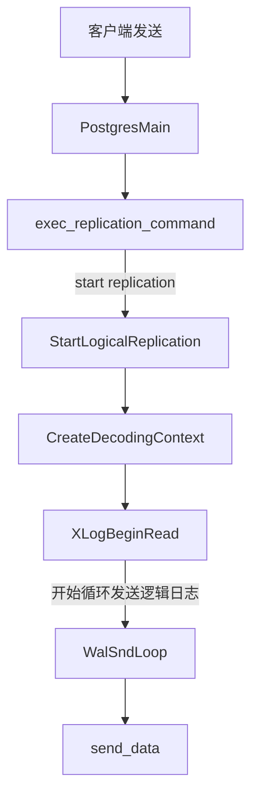
主要就是查看缓冲区里有没有数据，如果有数据就需要发送出去。
```c
	if (!pq_is_send_pending())
			send_data();
		else
			WalSndCaughtUp = false;
```

对于逻辑复制来说，send_data就是XLogSendLogical。

```mermaid
graph TB
XLogSendLogical-->XLogReadRecord-->LogicalDecodingProcessRecord-->｜非级联｜GetFlushRecPtr
LogicalDecodingProcessRecord-->|级联|GetXLogReplayRecPtr
```

在整个发送函数就记录了一个lsn位置：sentPtr，并最终将其赋值给了WalSnd。

```c
/* Update shared memory status */
	{
		WalSnd	   *walsnd = MyWalSnd;

		SpinLockAcquire(&walsnd->mutex);
		walsnd->sentPtr = sentPtr;
		SpinLockRelease(&walsnd->mutex);
	}
```

核心逻辑就两个，一个是读取wal日志，另外一个是对wal日志进行了逻辑解码。

读取wal日志流程如下：

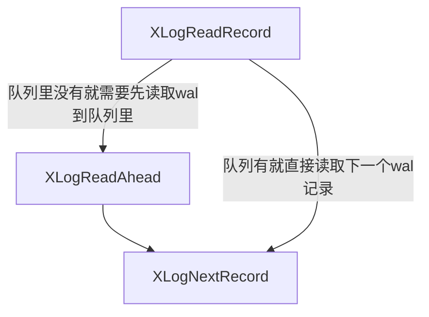

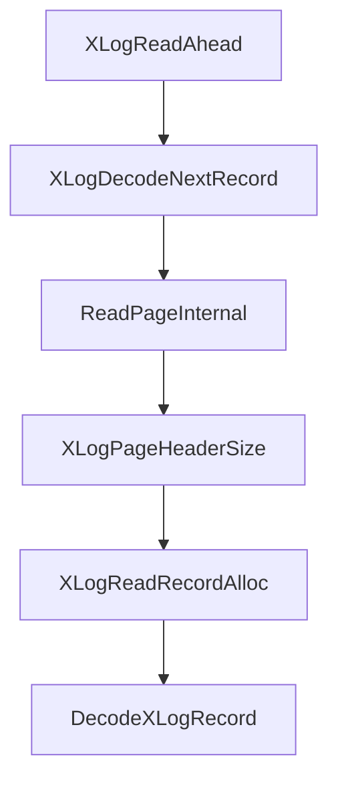

逻辑解码的流程如下：

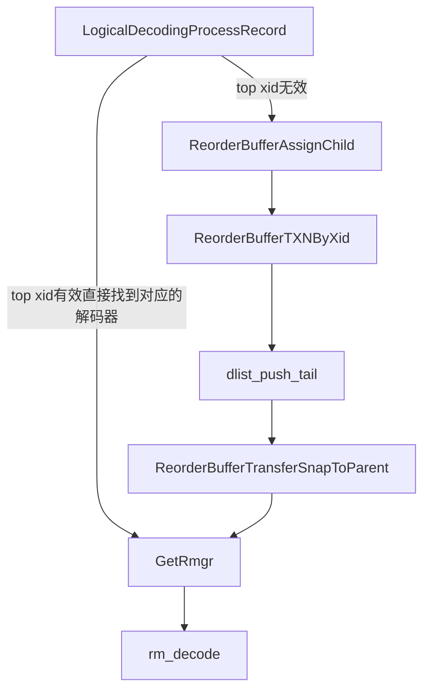

可以看到在上面的流程里数据并没有明显的发送，而是一直在做解码，并把解码的数据缓存在ReorderBuffer里。

其实逻辑解码发送端是以事务为单位的，只有解析到事务提交时才会把缓存下来的数据发送出去。

#### walsender主循环

逻辑复制walsender的主入口在`StartLogicalReplication`函数。主要流程：

1. 创建逻辑解码上下文（注册回调）
2. 启动复制流，进入`WalSndLoop`主循环，使用`XLogSendLogical`作为send_data回调

`WalSndLoop`主循环（在`walsender.c`）：
```c
static void
WalSndLoop(WalSndSendDataCallback send_data)
{
    for (;;)
    {
        /* 处理客户端回复、检查超时等 */
        if (!pq_is_send_pending())
            send_data();  /* 调用XLogSendLogical */
        /* 刷新输出、发送保活等 */
    }
}
```

#### 逻辑解码


在逻辑解码中，send_dataj就是`XLogSendLogical`.

`XLogSendLogical`函数是逻辑复制的核心驱动：

```c
static void
XLogSendLogical(void)
{
    XLogRecord *record;

    /* 读取WAL记录 */
    record = XLogReadRecord(logical_decoding_ctx->reader, &errm);

    if (record != NULL)
    {
        /* 处理WAL记录 */
        LogicalDecodingProcessRecord(logical_decoding_ctx,
                                     logical_decoding_ctx->reader);
        sentPtr = logical_decoding_ctx->reader->EndRecPtr;
    }

    /* 更新追赶状态等 */
}
```


`LogicalDecodingProcessRecord`函数（在`decode.c`）处理单个WAL记录：

1. 获取WAL记录的RMGR（资源管理器）
2. 调用RMGR的解码函数（如`heap_decode`、`xact_decode`）
3. RMGR解码函数将WAL记录解析为逻辑操作，调用ReorderBuffer函数

ReorderBuffer在适当时间调用输出插件回调：
- 事务开始时：调用`begin_cb`（`pgoutput_begin_txn`）
- 数据变更时：调用`change_cb`（`pgoutput_change`）
- 事务提交时：调用`commit_cb`（`pgoutput_commit_txn`）

输出插件回调通过`OutputPluginPrepareWrite`和`OutputPluginWrite`写入数据，最终调用walsender的writer回调。

调用过程如下所示：

```
WAL记录读取
    ↓
LogicalDecodingProcessRecord (decode.c)
    ↓
RMGR特定解码函数 (如heap_decode)
    ↓
ReorderBuffer处理 (reorderbuffer.c)
    ↓
输出插件回调 (pgoutput_*)
    ↓
OutputPluginPrepareWrite/OutputPluginWrite (logical.c)
    ↓
WalSndPrepareWrite/WalSndWriteData (walsender.c)
    ↓
pq_putmessage_noblock → 网络发送
```

关键数据结构如下图所示：

```
┌─────────────────────────────────────────────────────────────┐
│                   LogicalDecodingContext                     │
├─────────────────────────────────────────────────────────────┤
│  prepare_write ───→ WalSndPrepareWrite                      │
│  write ──────────→ WalSndWriteData                          │
│  update_progress → WalSndUpdateProgress                     │
│  reader_routine → XLogReaderRoutine                         │
│    ├─ page_read ──→ logical_read_xlog_page                  │
│    ├─ segment_open → WalSndSegmentOpen                      │
│    └─ segment_close → wal_segment_close                     │
│  callbacks ──────→ OutputPluginCallbacks (pgoutput)         │
│    ├─ startup_cb → pgoutput_startup                         │
│    ├─ begin_cb ──→ pgoutput_begin_txn                       │
│    ├─ change_cb ─→ pgoutput_change                          │
│    └─ commit_cb ─→ pgoutput_commit_txn                      │
└─────────────────────────────────────────────────────────────┘
                                    ↓
                          通过OutputPluginWrite调用
                                    ↓
┌─────────────────────────────────────────────────────────────┐
│                      网络发送 (libpq)                        │
└─────────────────────────────────────────────────────────────┘
```

### 用户接口

pg18官方文档参考[这里](https://www.postgresql.org/docs/18/sql-createpublication.html)。

```sql
CREATE PUBLICATION name
    [ FOR ALL TABLES
      | FOR publication_object [, ... ] ]
    [ WITH ( publication_parameter [= value] [, ... ] ) ]

where publication_object is one of:

    TABLE table_and_columns [, ... ]
    TABLES IN SCHEMA { schema_name | CURRENT_SCHEMA } [, ... ]

and table_and_columns is:

    [ ONLY ] table_name [ * ] [ ( column_name [, ... ] ) ] [ WHERE ( expression ) ]
```

实际的例子如下：

```sql
CREATE PUBLICATION mypublication FOR TABLE users, departments;

CREATE PUBLICATION active_departments FOR TABLE departments WHERE (active IS TRUE);

CREATE PUBLICATION alltables FOR ALL TABLES;

CREATE PUBLICATION insert_only FOR TABLE mydata
    WITH (publish = 'insert');


CREATE PUBLICATION production_publication FOR TABLE users, departments, TABLES IN SCHEMA production;

CREATE PUBLICATION sales_publication FOR TABLES IN SCHEMA marketing, sales;

CREATE PUBLICATION users_filtered FOR TABLE users (user_id, firstname);
```

执行流程如下：

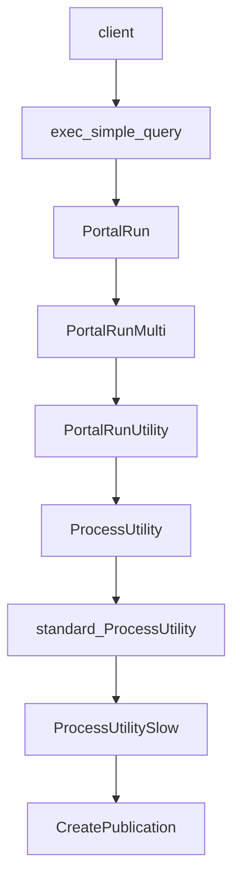

到这里就进入了创建pulication的流程：

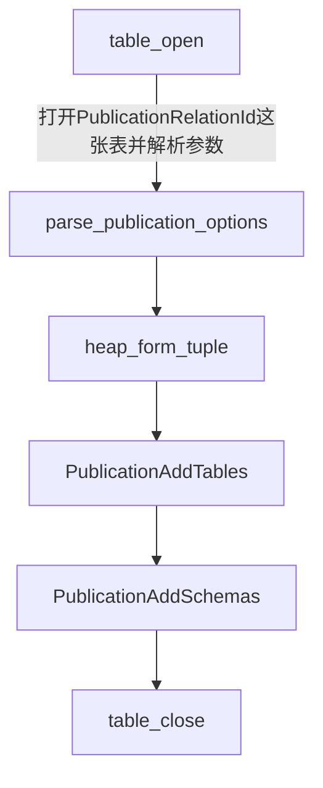

publication的系统表在catalog里定义：

```c

CATALOG(pg_publication,6104,PublicationRelationId)
{
	Oid			oid;			/* oid */

	NameData	pubname;		/* name of the publication */

	Oid			pubowner BKI_LOOKUP(pg_authid); /* publication owner */

	/*
	 * indicates that this is special publication which should encompass all
	 * tables in the database (except for the unlogged and temp ones)
	 */
	bool		puballtables;

	/*
	 * indicates that this is special publication which should encompass all
	 * sequences in the database (except for the unlogged and temp ones)
	 */
	bool		puballsequences;

	/* true if inserts are published */
	bool		pubinsert;

	/* true if updates are published */
	bool		pubupdate;

	/* true if deletes are published */
	bool		pubdelete;

	/* true if truncates are published */
	bool		pubtruncate;

	/* true if partition changes are published using root schema */
	bool		pubviaroot;

	/*
	 * 'n'(none) if generated column data should not be published. 's'(stored)
	 * if stored generated column data should be published.
	 */
	char		pubgencols;
} FormData_pg_publication;
```

### 数据发送

前面流程有说到发送端在不停的读取wal日志，然后进行逻辑解码。逻辑解码会根据不同的wal类型选择对应的解码函数，也就是rm_decode。

```c
/* symbol name, textual name, redo, desc, identify, startup, cleanup, mask, decode */
PG_RMGR(RM_XLOG_ID, "XLOG", xlog_redo, xlog_desc, xlog_identify, NULL, NULL, NULL, xlog_decode)
PG_RMGR(RM_XACT_ID, "Transaction", xact_redo, xact_desc, xact_identify, NULL, NULL, NULL, xact_decode)
PG_RMGR(RM_SMGR_ID, "Storage", smgr_redo, smgr_desc, smgr_identify, NULL, NULL, NULL, NULL)
PG_RMGR(RM_CLOG_ID, "CLOG", clog_redo, clog_desc, clog_identify, NULL, NULL, NULL, NULL)
PG_RMGR(RM_DBASE_ID, "Database", dbase_redo, dbase_desc, dbase_identify, NULL, NULL, NULL, NULL)
PG_RMGR(RM_TBLSPC_ID, "Tablespace", tblspc_redo, tblspc_desc, tblspc_identify, NULL, NULL, NULL, NULL)
PG_RMGR(RM_MULTIXACT_ID, "MultiXact", multixact_redo, multixact_desc, multixact_identify, NULL, NULL, NULL, NULL)
PG_RMGR(RM_RELMAP_ID, "RelMap", relmap_redo, relmap_desc, relmap_identify, NULL, NULL, NULL, NULL)
PG_RMGR(RM_STANDBY_ID, "Standby", standby_redo, standby_desc, standby_identify, NULL, NULL, NULL, standby_decode)
PG_RMGR(RM_HEAP2_ID, "Heap2", heap2_redo, heap2_desc, heap2_identify, NULL, NULL, heap_mask, heap2_decode)
PG_RMGR(RM_HEAP_ID, "Heap", heap_redo, heap_desc, heap_identify, NULL, NULL, heap_mask, heap_decode)
PG_RMGR(RM_BTREE_ID, "Btree", btree_redo, btree_desc, btree_identify, btree_xlog_startup, btree_xlog_cleanup, btree_mask, NULL)
PG_RMGR(RM_HASH_ID, "Hash", hash_redo, hash_desc, hash_identify, NULL, NULL, hash_mask, NULL)
PG_RMGR(RM_GIN_ID, "Gin", gin_redo, gin_desc, gin_identify, gin_xlog_startup, gin_xlog_cleanup, gin_mask, NULL)
PG_RMGR(RM_GIST_ID, "Gist", gist_redo, gist_desc, gist_identify, gist_xlog_startup, gist_xlog_cleanup, gist_mask, NULL)
PG_RMGR(RM_SEQ_ID, "Sequence", seq_redo, seq_desc, seq_identify, NULL, NULL, seq_mask, NULL)
PG_RMGR(RM_SPGIST_ID, "SPGist", spg_redo, spg_desc, spg_identify, spg_xlog_startup, spg_xlog_cleanup, spg_mask, NULL)
PG_RMGR(RM_BRIN_ID, "BRIN", brin_redo, brin_desc, brin_identify, NULL, NULL, brin_mask, NULL)
PG_RMGR(RM_COMMIT_TS_ID, "CommitTs", commit_ts_redo, commit_ts_desc, commit_ts_identify, NULL, NULL, NULL, NULL)
PG_RMGR(RM_REPLORIGIN_ID, "ReplicationOrigin", replorigin_redo, replorigin_desc, replorigin_identify, NULL, NULL, NULL, NULL)
PG_RMGR(RM_GENERIC_ID, "Generic", generic_redo, generic_desc, generic_identify, NULL, NULL, generic_mask, NULL)
PG_RMGR(RM_LOGICALMSG_ID, "LogicalMessage", logicalmsg_redo, logicalmsg_desc, logicalmsg_identify, NULL, NULL, NULL, logicalmsg_decode)
```

事务提交的解码函数为xact_decode，所有的数据发送都是xact_decode中。

#### xact_decode

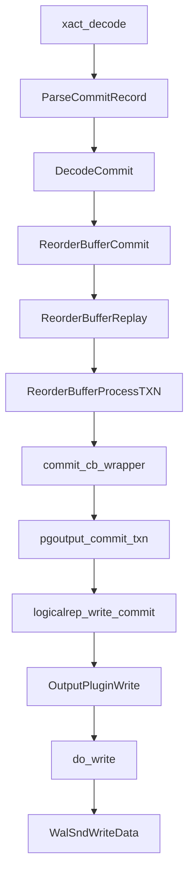


### 主要函数分析

#### XLogReadRecord

```c
record = XLogReadRecord(logical_decoding_ctx->reader, &errm);
```
这里会把xlog的头部读出来。

```c
typedef struct XLogRecord

{

	uint32 xl_tot_len; /* total len of entire record */
	
	TransactionId xl_xid; /* xact id */
	
	XLogRecPtr xl_prev; /* ptr to previous record in log */
	
	uint8 xl_info; /* flag bits, see below */
	
	RmgrId xl_rmid; /* resource manager for this record */
	
	/* 2 bytes of padding here, initialize to zero */
	
	pg_crc32c xl_crc; /* CRC for this record */
	
	
	/* XLogRecordBlockHeaders and XLogRecordDataHeader follow, no padding */

} XLogRecord;
```

xlog头主要记录了一条xlog记录（lsn）的总长度，事务id，上一条记录的lsn，记录的类型（insert、update、delete等）、对应的rmgr id（用来查找解码器的）以及记录的crc码（用于校验）。

xlog的实际读取在下面的这行代码：

```c
if (!XLogReaderHasQueuedRecordOrError(state))
	XLogReadAhead(state, false /* nonblocking */ );
```

xlog解析后会将它放到state->decode_queue_head队列里，如果队列为空的时候就会去打开wal文件并读取内容，可能会一次读取很多条xlog，都会把它放到队列里，然后依次出队。

主要读取xlog的函数是XLogDecodeNextRecord，里面是最终打开wal文件解析wal记录的详细实现。

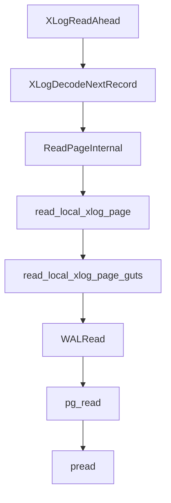

最终的数据读取到了state->readBuf里，

```c
readLen = state->routine.page_read(state, pageptr, Max(reqLen, 
									SizeOfXLogShortPHD),
									state->currRecPtr,
									state->readBuf);
```
读取出来后将其转换为xlog头来进行解析，即XLogPageHeader，先计算头部长度：

```c
pageHeaderSize = XLogPageHeaderSize((XLogPageHeader) state->readBuf);
```
解析record，

```c
record = (XLogRecord *) (state->readBuf + RecPtr % XLOG_BLCKSZ);
total_len = record->xl_tot_len;
```

然后申请DecodedXLogRecord

```c
decoded = XLogReadRecordAlloc(state,
							total_len,
							false /* allow_oversized */ );
```
然后调用DecodeXLogRecord函数进行解码，将二进制流转换为结构体。


#### LogicalDecodingProcessRecord

逻辑解码时会根据xlog头部读取到的rmgr id来获取对应的解码器。

```c
rmgr = GetRmgr(XLogRecGetRmid(record));
```
rmid在wal日志里有记录。
```c
#define XLogRecGetRmid(decoder) ((decoder)->record->header.xl_rmid)
```
逻辑复制对应的解码器定义如下：

```c
G_RMGR(RM_LOGICALMSG_ID, "LogicalMessage", logicalmsg_redo, logicalmsg_desc, logicalmsg_identify, NULL, NULL, NULL, logicalmsg_decode)
```
实际的解码函数是logicalmsg_decode。

#### logicalmsg_decode

需要先根据xid找到对应的事务对象ReorderBufferTXN：

```c
ReorderBufferProcessXid(ctx->reorder, XLogRecGetXid(r), buf->origptr);
```
最后将解码的消息放到recordBuffer

```c
ReorderBufferQueueMessage(ctx->reorder, xid, snapshot, buf->endptr,
							message->transactional,
							message->message, /* first part of message is
							* prefix */
							message->message_size,
							message->message + message->prefix_size);
```

事务消息继续放入队列里：

```c
change = ReorderBufferAllocChange(rb);
change->action = REORDER_BUFFER_CHANGE_MESSAGE;
change->data.msg.prefix = pstrdup(prefix);
change->data.msg.message_size = message_size;
change->data.msg.message = palloc(message_size);
memcpy(change->data.msg.message, message, message_size);
ReorderBufferQueueChange(rb, xid, lsn, change, false);
```
非事务消息直接处理：

```c
PG_TRY();

{
	rb->message(rb, txn, lsn, false, prefix, message_size, message);
	TeardownHistoricSnapshot(false);
}
PG_CATCH();
{
	TeardownHistoricSnapshot(true);
	PG_RE_THROW();
}
PG_END_TRY();
```
message处理函数是在逻辑解码初始化上下文的时候定义的，

```c
ctx->reorder->begin = begin_cb_wrapper;
ctx->reorder->apply_change = change_cb_wrapper;
ctx->reorder->apply_truncate = truncate_cb_wrapper;
ctx->reorder->commit = commit_cb_wrapper;
ctx->reorder->message = message_cb_wrapper;
```
执行message_cb_wrapper对消息进行解码，实际调用的函数是：

```c
ctx->callbacks.message_cb(ctx, txn, message_lsn, transactional, prefix,
							message_size, message);
```
而message_cb是是在逻辑解码插件里定义的，对于逻辑复制来说，解码插件用的是pgoutput，其函数赋值如下：

```c
cb->startup_cb = pgoutput_startup;
cb->begin_cb = pgoutput_begin_txn;
cb->change_cb = pgoutput_change;
cb->truncate_cb = pgoutput_truncate;
cb->message_cb = pgoutput_message;
cb->commit_cb = pgoutput_commit_txn;
```
即调用的函数为pgoutput_message。其流程如下：

```c
OutputPluginPrepareWrite(ctx, true);

logicalrep_write_message(ctx->out,
						xid,
						message_lsn,
						transactional,
						prefix,
						sz,
						message);

OutputPluginWrite(ctx, true);
```

logicalrep_write_message构造网络消息发送出去：

```c
void
logicalrep_write_message(StringInfo out, TransactionId xid, XLogRecPtr lsn,
						 bool transactional, const char *prefix, Size sz,
						 const char *message)
{
	uint8		flags = 0;

	pq_sendbyte(out, LOGICAL_REP_MSG_MESSAGE);

	/* encode and send message flags */
	if (transactional)
		flags |= MESSAGE_TRANSACTIONAL;

	/* transaction ID (if not valid, we're not streaming) */
	if (TransactionIdIsValid(xid))
		pq_sendint32(out, xid);

	pq_sendint8(out, flags);
	pq_sendint64(out, lsn);
	pq_sendstring(out, prefix);
	pq_sendint32(out, sz);
	pq_sendbytes(out, message, sz);
}
```
发送的消息格式如下：

```shell
+----------------------+----------------------+
| 字段                 | 大小                 |
+----------------------+----------------------+
| message type ('M')   | 1 byte              |
| xid (optional)       | 4 bytes             |
| flags                | 1 byte              |
| lsn                  | 8 bytes             |
| prefix               | null-terminated str |
| message_size         | 4 bytes             |
| message payload      | N bytes             |
+----------------------+----------------------+
```
要发送的数据记录在ctx->out中，

```c
ctx->out = makeStringInfo();
ctx->prepare_write = prepare_write;
```
ctx->out分别通过prepare_write和do_write写入。

```c
static void
WalSndPrepareWrite(LogicalDecodingContext *ctx, XLogRecPtr lsn, TransactionId xid, bool last_write)
{
	/* can't have sync rep confused by sending the same LSN several times */
	if (!last_write)
		lsn = InvalidXLogRecPtr;

	resetStringInfo(ctx->out);

	pq_sendbyte(ctx->out, 'w');
	pq_sendint64(ctx->out, lsn);	/* dataStart */
	pq_sendint64(ctx->out, lsn);	/* walEnd */

	/*
	 * Fill out the sendtime later, just as it's done in XLogSendPhysical, but
	 * reserve space here.
	 */
	pq_sendint64(ctx->out, 0);	/* sendtime */
}
```

do_write写入：

```c
static void
WalSndWriteData(LogicalDecodingContext *ctx, XLogRecPtr lsn, TransactionId xid,
				bool last_write)
{
	TimestampTz now;

	/*
	 * Fill the send timestamp last, so that it is taken as late as possible.
	 * This is somewhat ugly, but the protocol is set as it's already used for
	 * several releases by streaming physical replication.
	 */
	resetStringInfo(&tmpbuf);
	now = GetCurrentTimestamp();
	pq_sendint64(&tmpbuf, now);
	memcpy(&ctx->out->data[1 + sizeof(int64) + sizeof(int64)],
		   tmpbuf.data, sizeof(int64));

	/* output previously gathered data in a CopyData packet */
	pq_putmessage_noblock('d', ctx->out->data, ctx->out->len);

	CHECK_FOR_INTERRUPTS();

	/* Try to flush pending output to the client */
	if (pq_flush_if_writable() != 0)
		WalSndShutdown();

	/* Try taking fast path unless we get too close to walsender timeout. */
	if (now < TimestampTzPlusMilliseconds(last_reply_timestamp,
										  wal_sender_timeout / 2) &&
		!pq_is_send_pending())
	{
		return;
	}

	/* If we have pending write here, go to slow path */
	ProcessPendingWrites();
}
```

主要写入了时间戳和'd'.实际写入DML数据的流程在ReorderBufferProcessTXN。

#### ReorderBufferProcessTXN

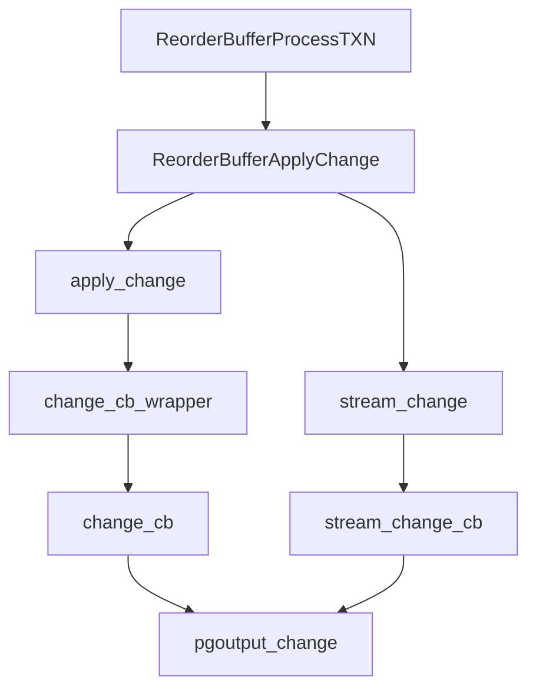

pgoutout_change会根据具体的类型调用对应的函数：

```c
/* Send the data */
	switch (action)
	{
		case REORDER_BUFFER_CHANGE_INSERT:
			logicalrep_write_insert(ctx->out, xid, targetrel, new_slot,
									data->binary, relentry->columns,
									relentry->include_gencols_type);
			break;
		case REORDER_BUFFER_CHANGE_UPDATE:
			logicalrep_write_update(ctx->out, xid, targetrel, old_slot,
									new_slot, data->binary, relentry->columns,
									relentry->include_gencols_type);
			break;
		case REORDER_BUFFER_CHANGE_DELETE:
			logicalrep_write_delete(ctx->out, xid, targetrel, old_slot,
									data->binary, relentry->columns,
									relentry->include_gencols_type);
			break;
		default:
			Assert(false);
	}
```


## 接收方


PostgreSQL逻辑复制订阅端（Subscriber）负责接收并应用来自发布者（Publisher）的数据变更。订阅端采用多进程架构，通过launcher进程管理worker进程，支持初始数据同步和增量变更应用，确保数据在订阅端的一致性。

接收方主要由三个个worker进程组成，launch、apply worker和table sync worker。

- **launcher进程** (`src/backend/replication/logical/launcher.c`)：逻辑复制worker启动器，管理worker生命周期
- **apply worker** (`src/backend/replication/logical/worker.c`)：主应用worker，接收并应用增量变更
- **tablesync worker** (`src/backend/replication/logical/tablesync.c`)：表同步worker，负责初始数据拷贝

### 启动流程

与物理复制不同的是，逻辑复制并没有walreceiver进程，而是有一个apply worker进程。

apply worker进程属于Background worker，Background worker通过注册的方式来启动。

在一个具体的worker注册后，postmaster会遍历BackgroundWorkerList链表，将对应的worker取出来执行。

Background worker的注册分为两种：

- 直接调用RegisterBackgroundWorker注册，比如apply launch worker
- 另外一种方式是RegisterDynamicBackgroundWorker，这个是由apply launch worker根据实际的配置动态注册的，比如 apply worker

#### worker注册机制

worker通过dlist保存了多个worker进程的启动信息，再postmaster启动的时候会往dlist里注册worker，比如

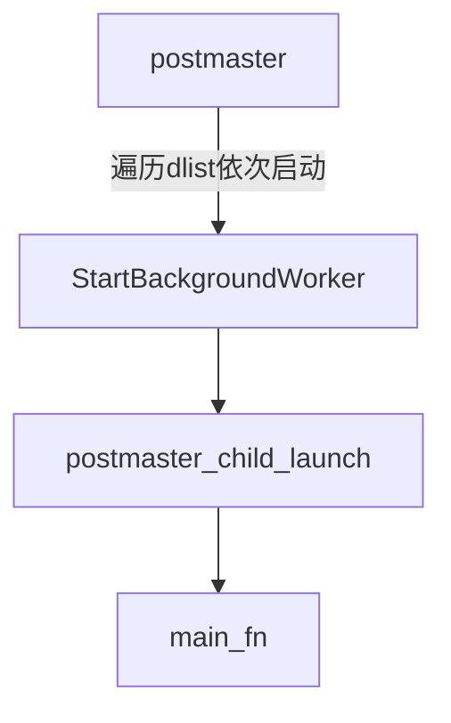

这里的main_fn就是postgres最外层的进程列表，其定义如下：

```c
static child_process_kind child_process_kinds[] = {
	[B_INVALID] = {"invalid", NULL, false},

	[B_BACKEND] = {"backend", BackendMain, true},
	[B_DEAD_END_BACKEND] = {"dead-end backend", BackendMain, true},
	[B_AUTOVAC_LAUNCHER] = {"autovacuum launcher", AutoVacLauncherMain, true},
	[B_AUTOVAC_WORKER] = {"autovacuum worker", AutoVacWorkerMain, true},
	[B_BG_WORKER] = {"bgworker", BackgroundWorkerMain, true},

	/*
	 * WAL senders start their life as regular backend processes, and change
	 * their type after authenticating the client for replication.  We list it
	 * here for PostmasterChildName() but cannot launch them directly.
	 */
	[B_WAL_SENDER] = {"wal sender", NULL, true},
	[B_SLOTSYNC_WORKER] = {"slot sync worker", ReplSlotSyncWorkerMain, true},

	[B_STANDALONE_BACKEND] = {"standalone backend", NULL, false},

	[B_ARCHIVER] = {"archiver", PgArchiverMain, true},
	[B_BG_WRITER] = {"bgwriter", BackgroundWriterMain, true},
	[B_CHECKPOINTER] = {"checkpointer", CheckpointerMain, true},
	[B_IO_WORKER] = {"io_worker", IoWorkerMain, true},
	[B_STARTUP] = {"startup", StartupProcessMain, true},
	[B_WAL_RECEIVER] = {"wal_receiver", WalReceiverMain, true},
	[B_WAL_SUMMARIZER] = {"wal_summarizer", WalSummarizerMain, true},
	[B_WAL_WRITER] = {"wal_writer", WalWriterMain, true},

	[B_LOGGER] = {"syslogger", SysLoggerMain, false},
};
```

采用的就是进程名，进程启动函数的方式命名。比如常见的walsender、bgwriter等。

而backendworker进程是一类进程，需要在postmaster启动时进行注册名，只有注册后才会启动。注册函数为RegisterBackgroundWorker，其主要流程如下：

```c
   rw = MemoryContextAllocExtended(PostmasterContext,
									sizeof(RegisteredBgWorker),
									MCXT_ALLOC_NO_OOM);
	if (rw == NULL)
	{
		ereport(LOG,
				(errcode(ERRCODE_OUT_OF_MEMORY),
				 errmsg("out of memory")));
		return;
	}

	rw->rw_worker = *worker;
	rw->rw_pid = 0;
	rw->rw_crashed_at = 0;
	rw->rw_terminate = false;

	dlist_push_head(&BackgroundWorkerList, &rw->rw_lnode);
```

其实就是分配结构体，然后添加到dlist里。其中主要的数据结构就是BackgroundWorker和RegisteredBgWorker，其定义如下：

```c
typedef struct BackgroundWorker
{
	char		bgw_name[BGW_MAXLEN];
	char		bgw_type[BGW_MAXLEN];
	int			bgw_flags;
	BgWorkerStartTime bgw_start_time;
	int			bgw_restart_time;	/* in seconds, or BGW_NEVER_RESTART */
	char		bgw_library_name[MAXPGPATH];
	char		bgw_function_name[BGW_MAXLEN];
	Datum		bgw_main_arg;
	char		bgw_extra[BGW_EXTRALEN];
	pid_t		bgw_notify_pid; /* SIGUSR1 this backend on start/stop */
} BackgroundWorker;

typedef struct RegisteredBgWorker
{
	BackgroundWorker rw_worker; /* its registry entry */
	pid_t		rw_pid;			/* 0 if not running */
	TimestampTz rw_crashed_at;	/* if not 0, time it last crashed */
	int			rw_shmem_slot;
	bool		rw_terminate;
	dlist_node	rw_lnode;		/* list link */
} RegisteredBgWorker;
```

而逻辑复制的apply launch进程就是在ApplyLauncherRegister函数中注册的，其主要注册逻辑如下：

```c
	BackgroundWorker bgw;
    memset(&bgw, 0, sizeof(bgw));
	bgw.bgw_flags = BGWORKER_SHMEM_ACCESS |
		BGWORKER_BACKEND_DATABASE_CONNECTION;
	bgw.bgw_start_time = BgWorkerStart_RecoveryFinished;
	snprintf(bgw.bgw_library_name, MAXPGPATH, "postgres");
	snprintf(bgw.bgw_function_name, BGW_MAXLEN, "ApplyLauncherMain");
	snprintf(bgw.bgw_name, BGW_MAXLEN,
			 "logical replication launcher");
	snprintf(bgw.bgw_type, BGW_MAXLEN,
			 "logical replication launcher");
	bgw.bgw_restart_time = 5;
	bgw.bgw_notify_pid = 0;
	bgw.bgw_main_arg = (Datum) 0;

	RegisterBackgroundWorker(&bgw);
```

postgres内部定义了多个worker，其定义如下：

```c
/*
 * List of internal background worker entry points.  We need this for
 * reasons explained in LookupBackgroundWorkerFunction(), below.
 */
static const struct
{
	const char *fn_name;
	bgworker_main_type fn_addr;
}			InternalBGWorkers[] =

{
	{
		"ParallelWorkerMain", ParallelWorkerMain
	},
	{
		"ApplyLauncherMain", ApplyLauncherMain
	},
	{
		"ApplyWorkerMain", ApplyWorkerMain
	},
	{
		"ParallelApplyWorkerMain", ParallelApplyWorkerMain
	},
	{
		"TablesyncWorkerMain", TablesyncWorkerMain
	}
};
```

在BackgroundWorkerMain函数中，通过传入startup_data（有worker的库名，要执行的函数名），然后在内部worker数组中（即InternalBGWorkers）进行查找，找到后执行对应的函数：

```c
/*
	 * Look up the entry point function, loading its library if necessary.
	 */
	entrypt = LookupBackgroundWorkerFunction(worker->bgw_library_name,
											 worker->bgw_function_name);

	/*
	 * Note that in normal processes, we would call InitPostgres here.  For a
	 * worker, however, we don't know what database to connect to, yet; so we
	 * need to wait until the user code does it via
	 * BackgroundWorkerInitializeConnection().
	 */

	/*
	 * Now invoke the user-defined worker code
	 */
	entrypt(worker->bgw_main_arg);
```

先根据函数名字找到对应的启动函数，再从对应的库里把函数符号加载出来。

```c
static bgworker_main_type
LookupBackgroundWorkerFunction(const char *libraryname, const char *funcname)
{
	/*
	 * If the function is to be loaded from postgres itself, search the
	 * InternalBGWorkers array.
	 */
	if (strcmp(libraryname, "postgres") == 0)
	{
		int			i;

		for (i = 0; i < lengthof(InternalBGWorkers); i++)
		{
			if (strcmp(InternalBGWorkers[i].fn_name, funcname) == 0)
				return InternalBGWorkers[i].fn_addr;
		}

		/* We can only reach this by programming error. */
		elog(ERROR, "internal function \"%s\" not found", funcname);
	}

	/* Otherwise load from external library. */
	return (bgworker_main_type)
		load_external_function(libraryname, funcname, true, NULL);
}
```

#### ApplyLauncherMain

注册apply launch的流程如下：

```mermaid
grpah TB

ApplyLauncherMain-->logicalrep_worker_launch-->RegisterDynamicBackgroundWorker-->|给postmaster发送backend_worker_change的信号|SendPostmasterSignal-->｜接收到信号｜CheckPostmasterSignal-->BackgroundWorkerStateChange-->｜将后端进程添加到dlist｜dlist_push_head
```

postmaster启动的时候注册apply launch worker，而apply lanuch worker负责把InternalBGWorkers数组里的其他worker注册到BackgroundWorkerList。


##### apply worker

Apply Worker 是由 Logical Replication Launcher 进程通过动态后台进程（BGWorker）机制启动的。

```c
if (!logicalrep_worker_launch(WORKERTYPE_APPLY,
							sub->dbid, sub->oid, sub->name,
							sub->owner, InvalidOid,
							DSM_HANDLE_INVALID))
```

然后根据对应的woker类型设置worker名字：

```c
	switch (worker->type)
	{
		case WORKERTYPE_APPLY:
			snprintf(bgw.bgw_function_name, BGW_MAXLEN, "ApplyWorkerMain");
			snprintf(bgw.bgw_name, BGW_MAXLEN,
					 "logical replication apply worker for subscription %u",
					 subid);
			snprintf(bgw.bgw_type, BGW_MAXLEN, "logical replication apply worker");
			break;

		case WORKERTYPE_PARALLEL_APPLY:
			snprintf(bgw.bgw_function_name, BGW_MAXLEN, "ParallelApplyWorkerMain");
			snprintf(bgw.bgw_name, BGW_MAXLEN,
					 "logical replication parallel apply worker for subscription %u",
					 subid);
			snprintf(bgw.bgw_type, BGW_MAXLEN, "logical replication parallel worker");

			memcpy(bgw.bgw_extra, &subworker_dsm, sizeof(dsm_handle));
			break;

		case WORKERTYPE_TABLESYNC:
			snprintf(bgw.bgw_function_name, BGW_MAXLEN, "TablesyncWorkerMain");
			snprintf(bgw.bgw_name, BGW_MAXLEN,
					 "logical replication tablesync worker for subscription %u sync %u",
					 subid,
					 relid);
			snprintf(bgw.bgw_type, BGW_MAXLEN, "logical replication tablesync worker");
			break;

		case WORKERTYPE_UNKNOWN:
			/* Should never happen. */
			elog(ERROR, "unknown worker type");
	}
```

到这里，postmaster就将apply woker启动了，后续apply woker的执行逻辑如下：

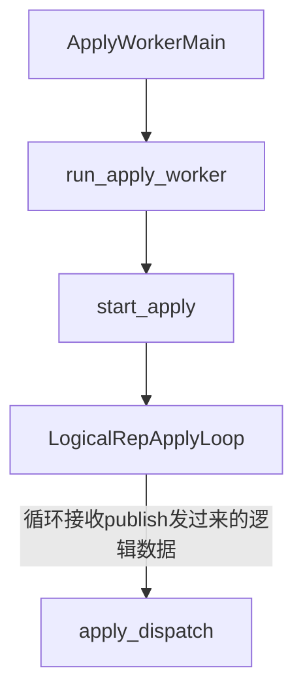

在apply_dispatch中根据msg的类型调用对应的处理函数进行处理，主要处理函数如下：

```c
switch (action)
	{
		case LOGICAL_REP_MSG_BEGIN:
			apply_handle_begin(s);
			break;

		case LOGICAL_REP_MSG_COMMIT:
			apply_handle_commit(s);
			break;

		case LOGICAL_REP_MSG_INSERT:
			apply_handle_insert(s);
			break;

		case LOGICAL_REP_MSG_UPDATE:
			apply_handle_update(s);
			break;

		case LOGICAL_REP_MSG_DELETE:
			apply_handle_delete(s);
			break;

		case LOGICAL_REP_MSG_TRUNCATE:
			apply_handle_truncate(s);
			break;

		case LOGICAL_REP_MSG_RELATION:
			apply_handle_relation(s);
			break;

		case LOGICAL_REP_MSG_TYPE:
			apply_handle_type(s);
			break;

		case LOGICAL_REP_MSG_ORIGIN:
			apply_handle_origin(s);
			break;

		case LOGICAL_REP_MSG_MESSAGE:

			/*
			 * Logical replication does not use generic logical messages yet.
			 * Although, it could be used by other applications that use this
			 * output plugin.
			 */
			break;

		case LOGICAL_REP_MSG_STREAM_START:
			apply_handle_stream_start(s);
			break;

		case LOGICAL_REP_MSG_STREAM_STOP:
			apply_handle_stream_stop(s);
			break;

		case LOGICAL_REP_MSG_STREAM_ABORT:
			apply_handle_stream_abort(s);
			break;

		case LOGICAL_REP_MSG_STREAM_COMMIT:
			apply_handle_stream_commit(s);
			break;

		case LOGICAL_REP_MSG_BEGIN_PREPARE:
			apply_handle_begin_prepare(s);
			break;

		case LOGICAL_REP_MSG_PREPARE:
			apply_handle_prepare(s);
			break;

		case LOGICAL_REP_MSG_COMMIT_PREPARED:
			apply_handle_commit_prepared(s);
			break;

		case LOGICAL_REP_MSG_ROLLBACK_PREPARED:
			apply_handle_rollback_prepared(s);
			break;

		case LOGICAL_REP_MSG_STREAM_PREPARE:
			apply_handle_stream_prepare(s);
			break;

		default:
			ereport(ERROR,
					(errcode(ERRCODE_PROTOCOL_VIOLATION),
					 errmsg("invalid logical replication message type \"??? (%d)\"", action)));
	}
```

逻辑复制里的主要消息类型如下：

```c
typedef enum LogicalRepMsgType
{
	LOGICAL_REP_MSG_BEGIN = 'B',
	LOGICAL_REP_MSG_COMMIT = 'C',
	LOGICAL_REP_MSG_ORIGIN = 'O',
	LOGICAL_REP_MSG_INSERT = 'I',
	LOGICAL_REP_MSG_UPDATE = 'U',
	LOGICAL_REP_MSG_DELETE = 'D',
	LOGICAL_REP_MSG_TRUNCATE = 'T',
	LOGICAL_REP_MSG_RELATION = 'R',
	LOGICAL_REP_MSG_TYPE = 'Y',
	LOGICAL_REP_MSG_MESSAGE = 'M',
	LOGICAL_REP_MSG_BEGIN_PREPARE = 'b',
	LOGICAL_REP_MSG_PREPARE = 'P',
	LOGICAL_REP_MSG_COMMIT_PREPARED = 'K',
	LOGICAL_REP_MSG_ROLLBACK_PREPARED = 'r',
	LOGICAL_REP_MSG_STREAM_START = 'S',
	LOGICAL_REP_MSG_STREAM_STOP = 'E',
	LOGICAL_REP_MSG_STREAM_COMMIT = 'c',
	LOGICAL_REP_MSG_STREAM_ABORT = 'A',
	LOGICAL_REP_MSG_STREAM_PREPARE = 'p',
} LogicalRepMsgType;
```

##### table sync worker

table sync worker用于同步历史数据，apply worker接收到逻辑复制的消息后，会根据具体的消息类型调用对应的函数进行处理。比如：

```c
		case LOGICAL_REP_MSG_COMMIT:
			apply_handle_commit(s);
			break;
```

而在apply_handle_commit里，就会触发启动 table sync worker，即：

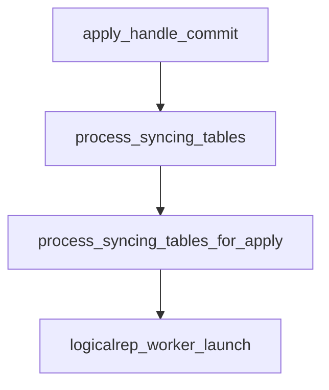
其启动函数如下：

```c
(void) logicalrep_worker_launch(WORKERTYPE_TABLESYNC,
								MyLogicalRepWorker->dbid,
								MySubscription->oid,
								MySubscription->name,
								MyLogicalRepWorker->userid,
								rstate->relid,
								DSM_HANDLE_INVALID);
```

可以看到使用和apply worker使用相同的launch函数，只是worker类型换成了WORKERTYPE_TABLESYNC。

这里可能让人费解的是process_syncing_tables里的函数逻辑：

```c
void
process_syncing_tables(XLogRecPtr current_lsn)
{
	switch (MyLogicalRepWorker->type)
	{
		case WORKERTYPE_PARALLEL_APPLY:

			/*
			 * Skip for parallel apply workers because they only operate on
			 * tables that are in a READY state. See pa_can_start() and
			 * should_apply_changes_for_rel().
			 */
			break;

		case WORKERTYPE_TABLESYNC:
			process_syncing_tables_for_sync(current_lsn);
			break;

		case WORKERTYPE_APPLY:
			process_syncing_tables_for_apply(current_lsn);
			break;

		case WORKERTYPE_UNKNOWN:
			/* Should never happen. */
			elog(ERROR, "Unknown worker type");
	}
}
```

其实就是最开始没有table sync worker，只有apply worker，因而开始时执行的函数是process_syncing_tables_for_apply，是在执行这个函数过程中发现满足table sync worker的启动逻辑，才把table sync worker启动。这个时候多了一个table sync worker进程，该进程执行到这里发现自己是WORKERTYPE_TABLESYNC，就会执行process_syncing_tables_for_apply了。

### 执行逻辑

接收方就是一个不停的接收数据并应用的过程，它的主要流程如下：

```c
for (;;)
{
    len = walrcv_receive(LogRepWorkerWalRcvConn, &buf, &fd);

    apply_dispatch(&s);
}
```

接收到数据后，根据数据的类型选择处理函数。

```c
	LogicalRepMsgType action = pq_getmsgbyte(s);
	LogicalRepMsgType saved_command;

	/*
	 * Set the current command being applied. Since this function can be
	 * called recursively when applying spooled changes, save the current
	 * command.
	 */
	saved_command = apply_error_callback_arg.command;
	apply_error_callback_arg.command = action;

	switch (action)
```

#### insert

以insert为例：

```c
switch (action)
{
    case LOGICAL_REP_MSG_INSERT:
        apply_handle_insert(s);
        break;
}
```

处理insert时要先建立映射表，主要函数是logicalrep_rel_open。

logicalrep_read_tuple会读取tuple，

```c
for (i = 0; i < natts; i++)
	{
		char	   *buff;
		char		kind;
		int			len;
		StringInfo	value = &tuple->colvalues[i];

		kind = pq_getmsgbyte(in);
		tuple->colstatus[i] = kind;

		switch (kind)
		{
			case LOGICALREP_COLUMN_NULL:
				/* nothing more to do */
				break;
			case LOGICALREP_COLUMN_UNCHANGED:
				/* we don't receive the value of an unchanged column */
				break;
			case LOGICALREP_COLUMN_TEXT:
			case LOGICALREP_COLUMN_BINARY:
				len = pq_getmsgint(in, 4);	/* read length */

				/* and data */
				buff = palloc(len + 1);
				pq_copymsgbytes(in, buff, len);
				buff[len] = '\0';

				initStringInfoFromString(value, buff, len);
				break;
			default:
				elog(ERROR, "unrecognized data representation type '%c'", kind);
		}
	}
```

接下来构建本地执行结构：

```c
slot = table_slot_create(rel, NULL);
```

#### update

#### 事务处理

### 用户接口

```sql
CREATE SUBSCRIPTION subscription_name
    CONNECTION 'conninfo'
    PUBLICATION publication_name [, ...]
    [ WITH ( subscription_parameter [= value] [, ... ] ) ]
```

subscription的创建流程与publication一致，只是创建函数变为了CreateSubscription。

```mermaind
graph TB
CreateSubscription-->parse_subscription_options-->table_open-->heap_form_tuple-->CatalogTupleInsert-->walrcv_connect-->check_publications-->check_publications_origin_tables-->check_publications_origin_sequences-->table_close-->ApplyLauncherWakeupAtCommit
```

创建subscription后需要连接publication，并对publication进行校验。

校验完成确认有效后，需要唤醒apply launch，apply launch会启动apply worker。

```c
/*
 * Request wakeup of the launcher on commit of the transaction.
 *
 * This is used to send launcher signal to stop sleeping and process the
 * subscriptions when current transaction commits. Should be used when new
 * tuple was added to the pg_subscription catalog.
*/
void
ApplyLauncherWakeupAtCommit(void)
{
	if (!on_commit_launcher_wakeup)
		on_commit_launcher_wakeup = true;
}
```

on_commit_launcher_wakeup被设置为true后，当有事务提交时就会触发AtEOXact_ApplyLauncher。

```c
/*
 * Wakeup the launcher on commit if requested.
 */
void
AtEOXact_ApplyLauncher(bool isCommit)
{
	if (isCommit)
	{
		if (on_commit_launcher_wakeup)
			ApplyLauncherWakeup();
	}

	on_commit_launcher_wakeup = false;
}
```

唤醒applylaunch通过发送信号的方式，发送SIGUSR1：

```c
/*
 * Wakeup the launcher immediately.
 */
void
ApplyLauncherWakeup(void)
{
	if (LogicalRepCtx->launcher_pid != 0)
		kill(LogicalRepCtx->launcher_pid, SIGUSR1);
}
```

applyLaunch继承了SIGUSR1的信号函数：

```c
pqsignal(SIGUSR1, procsignal_sigusr1_handler);
```

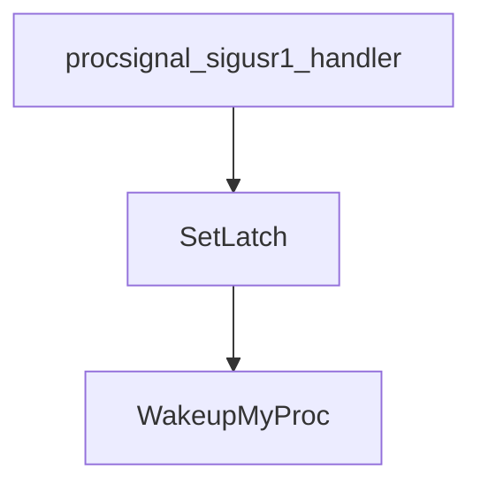

applylaunch 收到信号后就会把自己唤醒，然后开始进入处理流程。

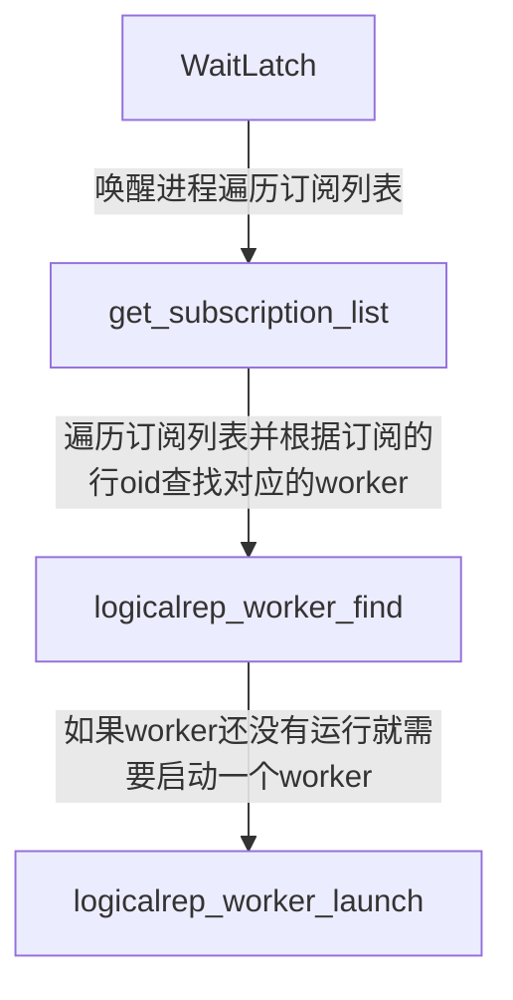
这里因为subscription是系统表，所以每一行都会有一个oid。（在pg12后，普通表已经没有oid了）因而才可以用行oid来唯一标识一个worker。

启动apply worker的流程参考前面。