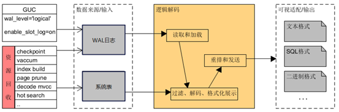
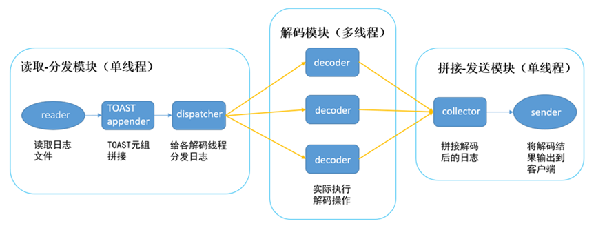
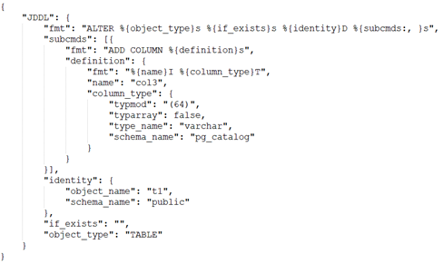

# 逻辑解码

## 逻辑解码是什么

逻辑解码（Logical Decoding）是 PostgreSQL（及其扩展版本）提供的一套机制，用来将 WAL（物理日志）中的数据修改恢复成“逻辑级别”的变更事件：

- INSERT → 行数据

- UPDATE → old/new tuple

- DELETE → old tuple key

- TRUNCATE → 表名

-（扩展）DDL → SQL 语句或结构变化

最终将这些变更输出给消费端：

- 订阅者（logical replication）

- Kafka / Flink / CDC / DataHub

- 自定义插件（wal2json、decoderbufs 等）

逻辑解码的核心原理如下：

```shell
           ┌──────────────┐
WAL 日志 → │ WAL Reader   │
           └───────┬──────┘
                   ↓
           ┌──────────────┐
           │ Decode WAL    │  ← 解码成逻辑记录（LR）
           └───────┬──────┘
                   ↓
           ┌──────────────┐
           │ ReorderBuffer │ ← 重组事务（排序、缓存、合并）
           └───────┬──────┘
                   ↓
           ┌──────────────┐
           │ OutputPlugin  │ ← test_decoding / wal2json 等
           └──────────────┘
```

## 逻辑解码和物理复制的区别

| 对比点   | 物理复制（Physical Replication） | 逻辑解码（Logical Decoding） |
| ----- | -------------------------- | ---------------------- |
| 实体级别  | WAL block（数据页）             | 行级、表级、DDL              |
| 关注点   | page 物理格式                  | 用户级变更                  |
| 适用    | 流复制、备库                     | CDC、跨版本、跨存储、数据交换       |
| 能否过滤表 | ❌ 不行                       | ✔️ 可以                  |
| 可否跨版本 | ❌                          | ✔️ 一般可以                |


## 异构数据库同步

异构数据库同步，即将不同类型、不同结构的数据库之间的数据进行同步处理，以确保数据在不同数据库之间的一致性。比如，将当前数据库的数据迁移到其他类型的数据库中，或者将当前数据库中的数据实时备份到另一个数据库，从而提升数据的安全性和可靠性。 比如从oracle数据库迁移到postgresql。

以GaussDB作为源数据库的DRS数据同步的原理如下图所示。


DRS驱动源端数据库GaussDB实时解析WAL日志，生成逻辑日志，随后DRS服务接收并解析逻辑日志，将其转换为目标数据库的SQL语句，并驱动目标数据库执行SQL语句，该过程被称为逻辑复制。

对于源端数据库来说，核心要解决的问题是如何将WAL日志转换成逻辑日志，该过程叫**逻辑解码**。

## guassdb逻辑解码

WAL日志包含数据库中发生的所有数据变更，包括插入、更新和删除等操作，同时还包含了诸多数据库内部细节和特有实现。

逻辑解码用于将WAL日志解析为易于理解和处理的逻辑日志格式，包括**JSON、二进制或者固定的text格式**。

用户和逻辑复制工具（如DRS）可以根据自身需求来解析和处理这些逻辑日志。

当启用逻辑解码时，GaussDB除了将每个事务的基本操作写入WAL日志，还会将少量的解码辅助信息（例如csn快照，用于解码阶段的可见性判断）记录到WAL日志中，以支持逻辑解码过程。同时还需要创建一个逻辑复制槽。逻辑复制槽的作用是阻止数据库将已落盘的WAL日志删除，并防止解码所需的系统表记录被清理。



如上图所示，逻辑解码主要包括**数据来源、读取/加载、解码、重排/发送**几个模块。
WAL日志和系统表中存储的表的元数据是逻辑解码的内容来源。
逻辑解码从WAL日志捕获用户表DML的变更记录，依据其中的物理存储标识（block number和offset等）和提交序列号（csn），加载系统表对应时刻的表的元数据，再将物理变更记录中强耦合的内部信息转换为用户可理解的表内容，生成和数据库实现无关的逻辑变更记录，最后重排和发送逻辑变更记录。

GaussDB逻辑解码有两种方式，分别为串行解码和并行解码。

- 串行解码流程分为读取、解码、发送三个步骤，整个串行解码流程均在同一个线程内完成，其中解码的耗时占据全流程的70%以上。串行解码性能约3-5M/s。

- 并行解码是通过多线程并行执行的方式，极大压缩了解码过程耗时。

### 并行解码

并行解码是通过多线程并发执行来提升逻辑解码性能。



### DDL解码

GaussDB逻辑解码支持DDL解码。如果GaussDB开启了逻辑解码，则会在DDL SQL执行阶段对DDL语句的解析树进行解析，解析的结果组装为Json格式的字符串（示例），并新增一种WAL日志类型，用于将该Json字符串写入WAL日志。

逻辑解码线程解析到该WAL日志类型时，按照原Json格式输出DDL的解码逻辑日志。

DDL语句alter table t1 add column col3 varchar(64)的Json格式解码结果如下图所示：



## polardb逻辑解码

PolarDB-PG 增强了 ProcessUtility_hook，并在执行 DDL 时：

1.捕获 AST（parse tree）

2.通过 deparse 还原 SQL

3. 使用 logical message WAL record 写入 WAL

4. 所有 subscriber 读到 WAL 后可得到 DDL

核心设计与 enhanced decoding（如 pglogical）类似，但做了更底层的优化。


# reference

1.https://www.cnblogs.com/huaweiyun/p/18510534