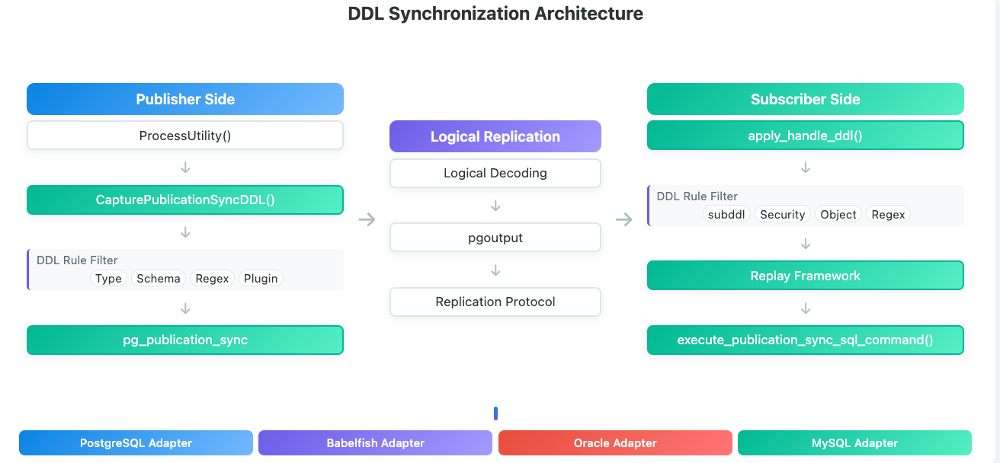
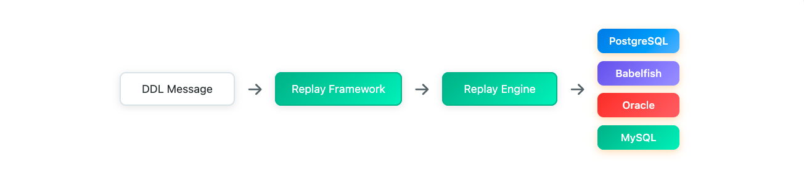

# 逻辑解码DDL Replay框架设计

# 1. 背景

当前逻辑复制支持DDL同步功能已适配PG模式，其整体流程如下：

1. 后端进程捕获客户端的原始ddl存入系统表（相当于队列）；
2. 通过逻辑复制协议将ddl同步到订阅端；
3. 订阅端识别到ddl后，对ddl进行replay（使用原始的ddl sql走parse再execute执行）；

这里面的replay最重要的就是apply worker需要有对应数据库模式的上下文。
对于PG模式来说，由于sql解析引擎是PG，天生就具有对应的ddl执行上下文，可以直接调用pg_parse_query执行。
但对于sqlserver模式来说，由于sqlserver模式使用bbf插件实现，并采用tcp端口来进行区分，
这对于replay的apply worker来说，worker进程没有数据库连接，当前机制无法构造完整的sqlserver执行上下文，因而需要进行单独适配。
同时考虑到后续可能会有其他数据库模式需要进行适配，比如mysql、oracle、db2等，因而需要考虑一种通用的replay 框架，方便后续扩展和完善。

## 整体架构



### replay 架构



### 接口定义

- 数据库模式定义

```c
typedef enum ReplayDialect {
        REPLAY_DIALECT_PG = 0,
        REPLAY_DIALECT_TSQL,
        REPLAY_DIALECT_ORACLE,
        REPLAY_DIALECT MYSQL,
        REPLAY_DIALECT_DB2,
        REPLAY_DIALECT_MAX
} ReplayDialect;
```text
- replay上下文定义

```c
typedef struct ReplayExecContext
{
        ReplayDialect dialect; // 数据库模式
        char *dbname; // 逻辑数据库名称
        char *search_path;
        oid user_oid;
        bool switched_user;
        UserContext ucxt;
        void *adpater_private; // 扩展数据
} ReplayExecContext;
```text
- replay回调函数接口

```c
typedef struct ReplayDialectAdapter {
        const char *name;
        bool (*init_context)(ReplayExecContext *ctx);
        bool (*execute_ddl)(ReplayExecContext *ctx,const char *sql);
        void (*cleanup_context)(ReplayExecContext *ctx);
} ReplayDialectAdapter;
```text
- replay框架注册初始化

```c
void ReplayFrameworkInit(void);

bool RegisterReplayDialectAdapter(ReplayDialect dialect,ReplayDialectAdapter *adapter);

ReplayDialectAdapter *GetReplayAdapter(ReplayDialect dialect);
```text
### replay 

## pg replay

对于pg repaly来说，只是封装一下replay ddl函数即可，不需要初始化和清理上下文。

```c
static ReplayDialectAdapter pg_adapter = {
        .name = "postgres",
        .init_context = pg_replay_init_context,
        .execute_ddl = pg_replay_execute_ddl,
        .cleanup_context = pg_replay_cleanup_context,
};
```text
## sqlserver replay

对于sqlserver来说，由于worker没有和后端进程的TDS端口建立连接，因而需要在worker进程启动的时候构建一个sqlserver parse的上下文。
而这个构建上下文又分为两种情况：
1. 简单上下文，仅修改worker进程内的sql_dialect，让捕获到tsql可以走bbf的parse；
2. 完整上下文，完整上下文需要在bbf内部设置逻辑数据库；

sqlserver replay同样需要实现接口定义中的如下三个函数：

- init_context
- execute_ddl
- cleanup_context

对于构建上下文的两种情况，共有两种replay实现方式：

1. simple方式，支持的ddl有限，但仅仅需要修改内核，不需要修改bbf插件
2. full方式，支持的ddl种类更多，但需要更改bbf的代码，实现上面提到的接口，并在bbf插件初始化时同步初始化sqlserver上下文；

### sqlserver simple replay

```c
static ReplayDialectAdapter tsql_simple_adapter =
{
        .name = "tsql-simple",
        .init_context = tsql_simple_init_context,
        .execute_ddl = tsql_simple_execute_ddl,
        .cleanup_context = tsql_simple_cleanup_context,
}
```text
simple方式实现基本和PG的实现一致，区别主要在init_context,sqlserver模式需要显示设置sql_dialect,

```c
(void) set_config_option("babelfishpg_tsql.sql_dialect","tsql",
                        PGC_USERSET, PGC_S_SESSION,
                        GUC_ACTION_SET, true, 0, false);
```text
### sqlserver custom replay

完整的sqlserver上下文构建需要在bbf插件内部注册对应的回调函数，并在bbf插件初始化时注册到replay 框架中。

在babelfishpg_tsql插件注册的_PG_init_函数中注册tsql replay的回调。

bbf插件源码需要引入replay的头文件，并实现对应的回调函数。

```c
void
bbf_register_tsql_replay_adapter(void)
{
        RegisterReplayDialectAdapter(REPLAY_DIALECT_TSQL, &bbf_tsql_adapter);
        get_current_dbname_hook = bbf_get_current_dbname;
}
```text
```c
static ReplayDialectAdapter pbf_tsql_adapter =
{
        .name = "tsql",
        .init_context = bbf_replay_init_context, 
        .execute_ddl = bbf_replay_execute_ddl,
        .cleanup_context = bbf_replay_cleanup_context,
};
```text
最终目标为：通过注册回调函数需要内核的worker进程能够拥有完整的sqlserver上下文，使worker进程执行ddl sql和客户端连接到TDS端口执行一致。

### 运行机制

simple replay因为只需要修改内核源码，因而默认在内核里实现。
如果bbf插件没有实现对应的replay回调函数，就会注册simple replay，采用simple replay的方式来回放执行ddl。
如果bbf插件实现了对应的回调函数并注册到replay框架，将不会注册simple replay。