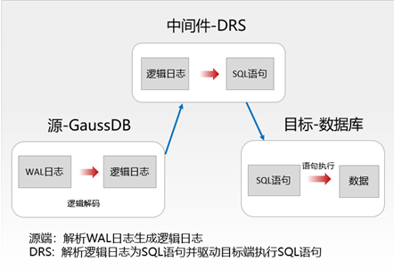

# 逻辑解码支持DDL

逻辑解码需要源端数据库把DDL转换成某一种格式存储，可以是某种数据库语法格式的sql或者其他格式的文本文件，比如json。

而对于目标端数据库，不管是我们的数据库还是其他的数据库，我们都需要提供一种能把源端存储格式转换为标准sql的方式。

这个时候就需要将DDL转换为目标数据库的sql语法格式。

## postgresql

postgresql逻辑解码原生不支持DDL，其逻辑复制流程如下：

```shell
WAL → logical decoding → output plugin → subscriber
```

WAL记录的是存储操作，并不是原始的SQL。

```shell
heap_insert
heap_update
heap_delete
```

```shell
INSERT INTO t ...
ALTER TABLE ...
```

逻辑解码的时候只会解析如下内容：

```shell
Relation OID
tuple data
```

最后通过系统 catalog 解析表结构。

在postgresql中，DDL 并不会进入 logical replication stream。postgreSQL 的逻辑复制要求：publisher 和 subscriber 必须 schema 完全一致。

postgresql的主要实现方式是pglogical。

## gaussdb



## polardb

polardb-for-postgresql扩展了pg的逻辑复制，使DDL能进入到logical replication。并通过 pubddl 参数控制复制范围。

```sql
CREATE PUBLICATION pub1
FOR ALL TABLES
WITH (pubddl='all');
```

todo：在源码中无法搜索到pubddl。

支持如下操作：

```shell
CREATE
ALTER
DROP
TRUNCATE
```
todo：是否还支持其他操作。

polardb实现流程如下：

```shell
DDL
 ↓
ProcessUtility 捕获
 ↓
LogLogicalMessage 写 WAL
 ↓
logical decoding decode message
 ↓
pgoutput 输出 message
 ↓
subscriber apply worker 执行 SQL
```

源码模块分布：

```shell
src/backend/tcop/
    utility.c                 ← 捕获DDL

src/backend/polar/
    polar_logical_ddl.c      ← DDL记录核心实现

src/backend/replication/logical/
    decode.c                 ← WAL decode
    reorderbuffer.c          ← change buffer

src/backend/replication/pgoutput/
    pgoutput.c               ← 输出DDL

src/backend/replication/logical/
    worker.c                 ← subscriber执行DDL
```

```shell
                PRIMARY

CREATE TABLE
     │
     ▼
event trigger
     │
     ▼
LogLogicalMessage
     │
     ▼
        WAL
   XLOG_LOGICAL_MESSAGE
     │
     ▼
logical decoding
     │
     ▼
pgoutput plugin
     │
     ▼
logical replication stream
     │
     ▼
           SUBSCRIBER
     │
     ▼
apply worker
     │
     ▼
SPI_execute(DDL)
```

```shell
src/backend/commands/event_trigger.c
src/backend/replication/logical/logical.c
src/backend/replication/logical/decode.c
src/backend/replication/logical/reorderbuffer.c
src/backend/replication/pgoutput/pgoutput.c
src/backend/replication/logical/worker.c
```

| 实现阶段       | 文件位置                                              | 主要职责                    |
| ---------- | ------------------------------------------------- | ----------------------- |
| DDL 捕获     | `src/backend/commands/event_trigger.c`            | 捕获 DDL 命令文本             |
| WAL 写入     | `src/backend/replication/logical/logical.c`       | 写入 logical message      |
| WAL Decode | `src/backend/replication/logical/decode.c`        | 解析 WAL logical message  |
| Buffer     | `src/backend/replication/logical/reorderbuffer.c` | 缓冲消息                    |
| Output     | `src/backend/replication/pgoutput/pgoutput.c`     | 输出到 logical replication |
| Apply      | `src/backend/replication/logical/worker.c`        | Subscriber apply SQL    |
| Policy     | `src/include/catalog/pg_publication.h`            | 控制 DDL replication      |


### 主要函数

#### decrib

ProcessUtilitySlow

EventTriggerDDLCommandEnd

pg_event_trigger_ddl_commands

pg_logical_emit_message_text(PG_FUNCTION_ARGS)

pg_logical_emit_message_bytea

LogLogicalMessage 

```c
XLogRecPtr
LogLogicalMessage(const char *prefix, const char *message, size_t size,
				  bool transactional)
{
	xl_logical_message xlrec;

	/*
	 * Force xid to be allocated if we're emitting a transactional message.
	 */
	if (transactional)
	{
		Assert(IsTransactionState());
		GetCurrentTransactionId();
	}

	xlrec.dbId = MyDatabaseId;
	xlrec.transactional = transactional;
	/* trailing zero is critical; see logicalmsg_desc */
	xlrec.prefix_size = strlen(prefix) + 1;
	xlrec.message_size = size;

	XLogBeginInsert();
	XLogRegisterData((char *) &xlrec, SizeOfLogicalMessage);
	XLogRegisterData(unconstify(char *, prefix), xlrec.prefix_size);
	XLogRegisterData(unconstify(char *, message), size);

	/* allow origin filtering */
	XLogSetRecordFlags(XLOG_INCLUDE_ORIGIN);

	return XLogInsert(RM_LOGICALMSG_ID, XLOG_LOGICAL_MESSAGE);
}
```

```c
PG_RMGR(RM_LOGICALMSG_ID, "LogicalMessage", logicalmsg_redo, logicalmsg_desc, logicalmsg_identify, NULL, NULL, NULL, logicalmsg_decode, NULL, NULL, NULL)
```

ddl的类型XLOG_LOGICAL_MESSAGE


LogicalDecodingProcessRecord

ReorderBufferQueueMessage

action类型 REORDER_BUFFER_CHANGE_MESSAGE

pgoutput_change

pgoutput_message

#### subscriber

apply_dispatch

LOGICAL_REP_MSG_MESSAGE M