# 火焰图怎么看:从一张图到优化方向的完整方法论

> 配套前文:[PostgreSQL 逻辑复制性能分析:火焰图实战](https://growdu.github.io/blog/db/postgresql/postgresql-flame-graph/) —— 那一篇讲 PG 实战,这一篇讲**通用方法论**。
>
> 读完本文你会获得:
> 1. 火焰图每根线条到底在表达什么
> 2. 如何从一张图判断"有/没有/有多少瓶颈"
> 3. 看到热点后,**按什么顺序**排查优化方向
> 4. 火焰图**看不到**的东西(以及用什么工具补齐)

---

## 一、火焰图到底是什么

火焰图(Flame Graph)是 **Brendan Gregg 在 2011 年提出**的一种调用栈可视化方式。它把 profiler(perf、async-profiler、bpftrace...)采样的调用栈数据,渲染成一张"金字塔":

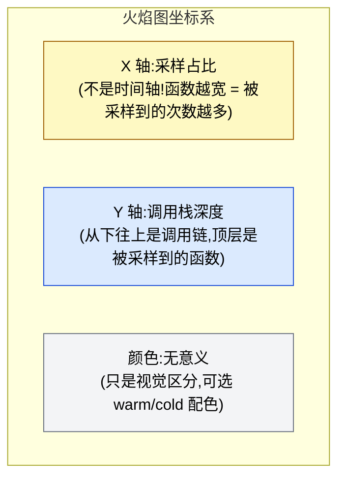

**核心三句话**:

1. **X 轴不表示时间** —— 它表示**采样的归一化占比**。整张图的 X 轴总宽是 100% 的采样样本,每个矩形的宽度 = 这个栈帧在所有采样中出现的比例。
2. **Y 轴表示栈深度** —— 顶层是 profiler 抓到 PC 时正在执行的函数,下面依次是它的调用者。
3. **颜色不携带信息** —— 默认是 random 或 warm(红=热,蓝=冷),用于视觉区分,**不应当根据颜色判断"严重程度"**。

理解这三点,你就已经超过了 80% 的"看图半吊子"。

---

## 二、生成火焰图:5 行命令搞定

不同 profiler 的命令不一样,但核心链路一致:

### 2.1 Linux perf + FlameGraph

```bash
# 1. 采样:99Hz 持续 30 秒,采样进程 PID 1234
perf record -F 99 -p 1234 -g -- sleep 30

# 2. 折叠栈帧(同一栈的样本合并)
perf script | ./stackcollapse-perf.pl > out.folded

# 3. 生成火焰图
./flamegraph.pl out.folded > out.svg
```

> **采样频率 99Hz 不是 100Hz**:Brendan Gregg 专门说,用 99Hz 可以避开和某些周期性任务(秒级定时器)的同步偏差。

### 2.2 async-profiler(JVM)

```bash
./profiler.sh -d 30 -f out.html <pid>
```

### 2.3 bpftrace + 开源工具

```bash
profile-bpfcc -F 99 -p <pid> 30 > out.stacks
```

### 2.4 关键参数

| 参数 | 推荐值 | 说明 |
|------|--------|------|
| 频率 `-F` | 99 | 避开与定时器同步 |
| 持续时间 `-d` | 30~60s | 太短没代表性,太长污染数据 |
| 栈深度 `-g` | 必须开 | 不带 `-g` 火焰图就是平的 |
| 目标 | 进程 PID | **不要在整机采样**,会包含噪音 |

---

## 三、读图三步法

看一张火焰图,按这三步走。

### 步骤 1:看整体形状 —— 找"平顶山"

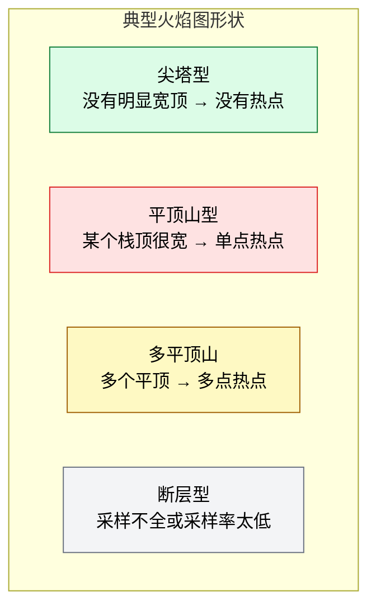

#### 平顶山的定义

> **平顶山**:某个函数或某段调用链在 X 轴上占比较大(经验阈值 **≥ 10%**),且顶部是平的(代表该函数自身在消耗 CPU)。

#### 平顶山宽度阈值(经验法则)

| 宽度 | 含义 | 行动 |
|------|------|------|
| **< 5%** | 一般噪声 | 忽略 |
| **5%~15%** | 值得关注 | 看是否可优化 |
| **15%~30%** | 明确热点 | **优先优化** |
| **> 30%** | 严重瓶颈 | **必须优化** |

### 步骤 2:从下往上看 —— 追溯调用链

平顶山找到了,从山顶往下走,就能看到这条"瓶颈调用链":

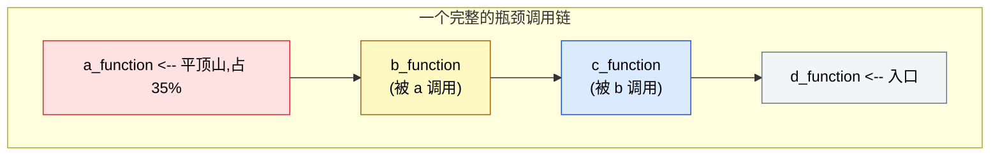

**阅读规则**:
- 顶层(平顶)→ 实际消耗 CPU 的函数
- 中间层 → 上下游调用关系
- 底层(根部) → 入口函数(`main`、`__libc_start_main`、线程入口)

### 步骤 3:从左往右看 —— 找分支

X 轴上**同一个函数被切成多段**,意味着它的调用上下文不同:

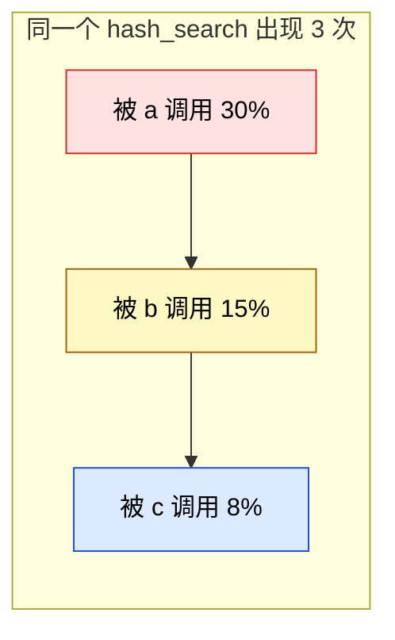

**含义**:同一个函数被多个调用方调用,各自占不同时间。要优化,先优化**最宽的那一段**(大概率是热点路径)。

---

## 四、判断"有没有瓶颈":8 个信号

拿到一张火焰图,**按这个清单逐项检查**。

### 信号 1:平顶山宽度

✅ 已有定义。**没有平顶山 ≠ 没有瓶颈**(可能瓶颈在锁)。

### 信号 2:是否有大片的"矮宽"栈

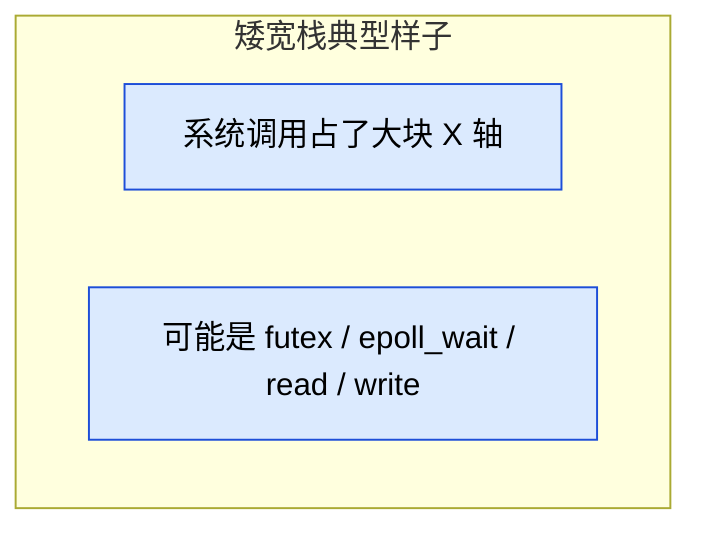

**含义**:进程经常被踢出 CPU,或在系统调用里睡。常见原因:
- 锁等待(`futex`)
- 网络 IO(`epoll_wait`、`recvfrom`)
- 磁盘 IO(`read`、`write`、`pread64`)
- 主动 sleep(`nanosleep`)

### 信号 3:是否有大片的"深而窄"栈

**含义**:某条代码路径罕见但深,可能:
- 错误处理路径(每次报错都走一遍)
- 罕见分支(可能是冷启动路径)
- 递归很深(注意:**深 ≠ 慢**,要看宽度)

### 信号 4:用户态 / 内核态比例

火焰图工具一般会标注:
- **On-CPU**:进程在 CPU 上跑(纯计算)
- **Off-CPU**:进程不在 CPU 上(等 IO、等锁)

如果你看到的是 **Off-CPU 火焰图**,所有"宽度"都是**等的时间**,不是消耗的 CPU。

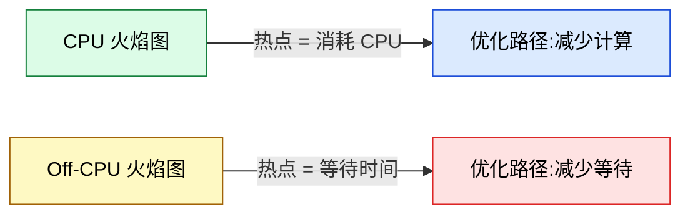

### 信号 5:是否存在 `spin / pollbusy` 等循环

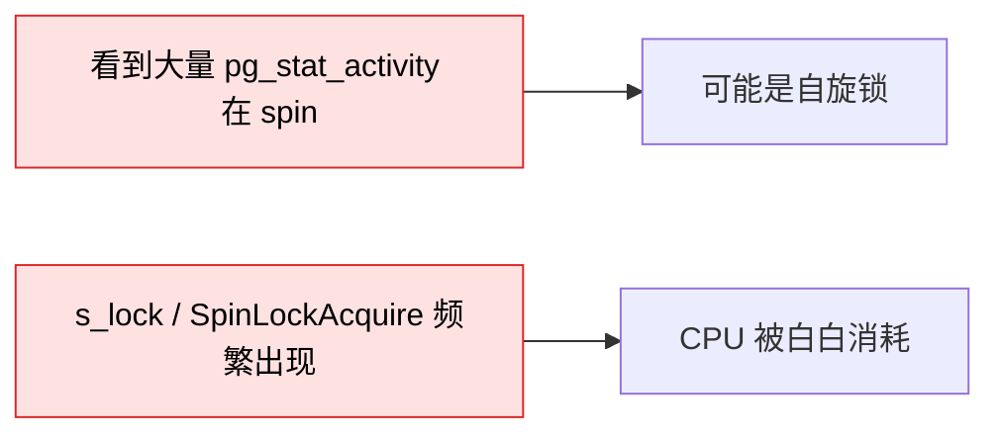

PG 中常见的自旋锁 `s_lock` / `SpinLockAcquire` 大量出现 → CPU 在空转,**但实际上是"等锁"的另一种形式**。

### 信号 6:多个相互独立的平顶山

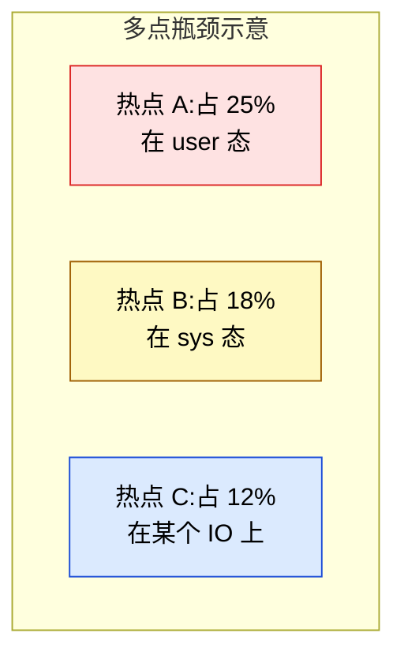

**含义**:**多热点通常意味着问题分布在多个层面**——例如 CPU 和 IO 都不行,这种时候优化单点效果有限,需要先解决**最严重的那个**。

### 信号 7:某个第三方库的调用特别深

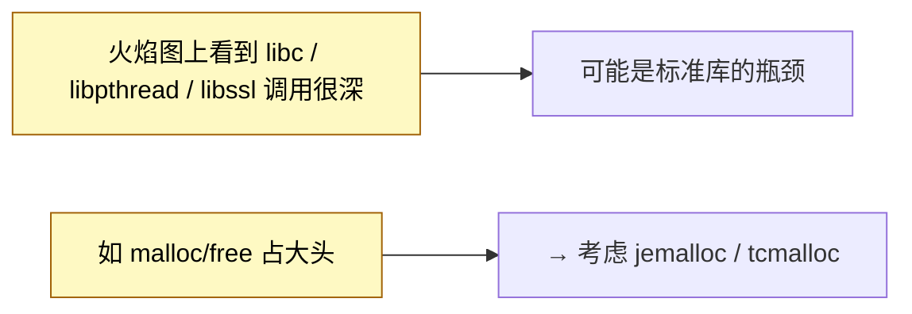

### 信号 8:大量未命名的栈帧 `[unknown]`

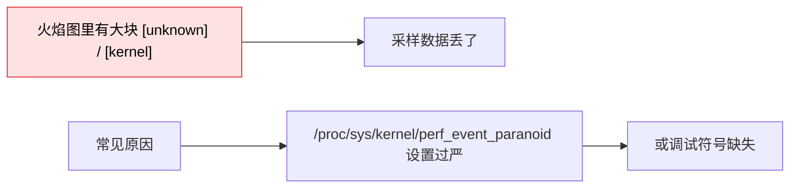

**修复**:
```bash
# 临时解决
sudo sysctl -w kernel.perf_event_paranoid=-1

# 永久:加到 /etc/sysctl.conf
echo 'kernel.perf_event_paranoid = -1' >> /etc/sysctl.conf
```

---

## 五、确定优化方向:4 类瓶颈对应 4 类解法

看到热点后,按这个分类法判断优化方向。

### 5.1 分类 1:用户态 CPU 热点(`user%` 高)

**典型形态**:

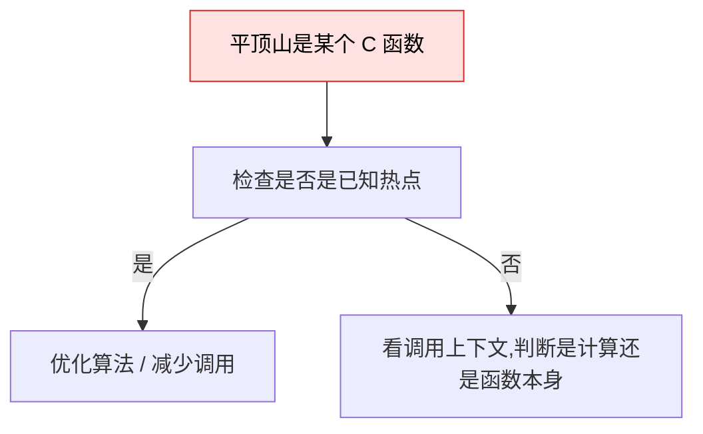

**典型场景**:

| 看到的栈 | 优化方向 |
|---------|---------|
| `hash_search` / `hash_seq_search` | 减少 hash 查找(加缓存、改用数组) |
| `palloc` / `MemoryContextAlloc` | 减少内存分配(对象池、arena) |
| `palloc` 大量 + `memcpy` | 序列化反序列化 |
| `pg_utf8_verifychar` 等编码函数 | 字符集转换开销 |
| `memcmp` / `strcmp` | 字符串比较(可以用 hash) |
| `json_*` | JSON 解析开销(改 binary JSON) |

**PG 实战案例**:

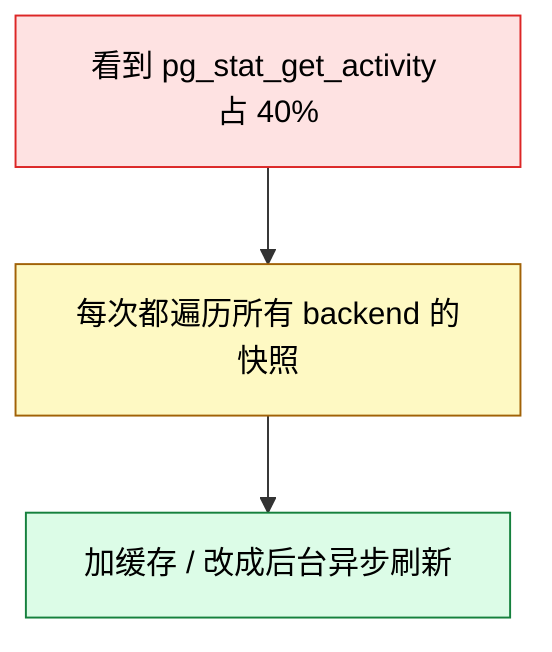

### 5.2 分类 2:内核态 CPU 热点(`sys%` 高)

**典型形态**:

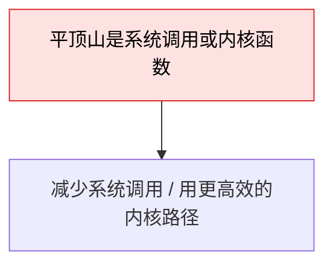

**典型场景**:

| 看到的栈 | 优化方向 |
|---------|---------|
| `sys_write` / `sys_read` 频繁 | 改用 `writev`/`readv` / 批量 IO |
| `sys_futex` 频繁 | 锁竞争严重(改用无锁、扩分区) |
| `sys_epoll_wait` | 网络 IO 等待(考虑同步/异步模型) |
| `copy_user_generic_string` | 用户/内核态拷贝频繁(改用 sendfile / splice) |
| `tcp_sendmsg` | TCP 发送频繁(调 socket buffer) |
| `__schedule` / `schedule` | 调度器压力大(可能 CPU 太多、NUMA 不均) |

### 5.3 分类 3:Off-CPU(等锁、IO、调度)

**关键**:Off-CPU 火焰图**默认看不到**,需要特别采集:

```bash
# Off-CPU 火焰图(需要 systemtap 或 bcc)
# 推荐用 bcc 的 offcputime
offcputime-bpfcc -F 99 -p <pid> 30 > offcpu.stacks
./flamegraph.pl --title="Off-CPU" --countname=us offcpu.stacks > offcpu.svg
```

**典型栈形态**:

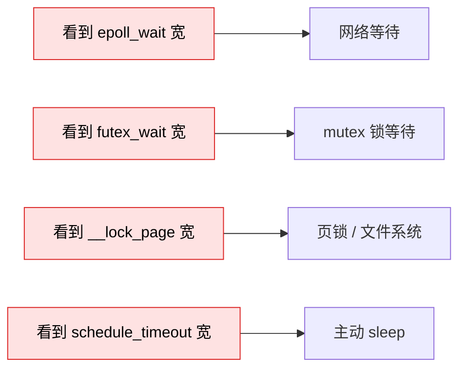

**优化方向**:

| 等的对象 | 优化方向 |
|---------|---------|
| 网络 IO | 改异步 / 加大 buffer / 减少 RTT |
| 磁盘 IO | 加 cache / 换 SSD / 调整 IO 调度器 |
| 用户态锁 | 锁粒度细化 / 改用无锁结构 |
| LWLock (PG) | 分区 / 减少持有时间 |
| 自旋锁 | 改用阻塞锁 / 减少临界区 |

### 5.4 分类 4:内存子系统

**典型形态**:火焰图上看到 `malloc` / `free` / `mmap` 占比高。

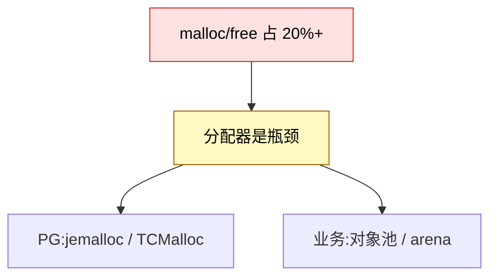

**PG 特别提示**:`palloc` 内部走 `malloc`,但有 `MemoryContext` 抽象。火焰图看的是底层 `malloc`,所以看到的可能是分配器的实际瓶颈。

---

## 六、3 个真实火焰图解读(实战演练)

### 案例 1:CPU 100% 但 QPS 上不去

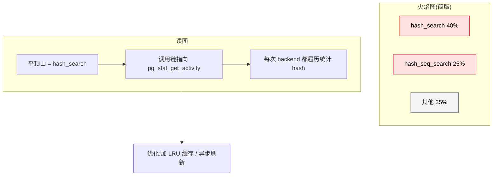

**判断过程**:
1. 看到 `hash_search` 平顶山 40% → 明确热点
2. 向下追栈 → 发现被 `pg_stat_get_activity` 调用
3. **结论**:统计视图被频繁查询,每次都遍历所有 backend 的内存 hash

**优化方向**:
- 加缓存(后台定时刷新,前台查缓存)
- 减少调用频率

### 案例 2:CPU 不高但事务慢

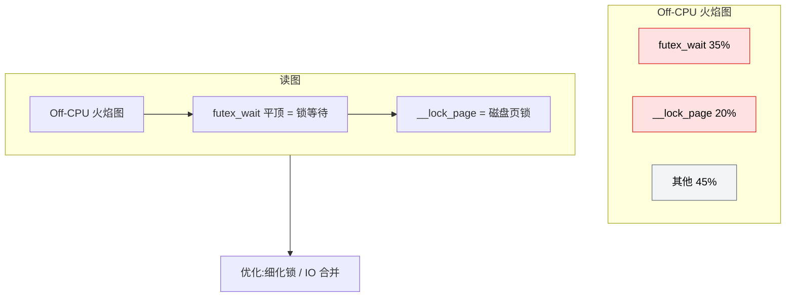

**判断过程**:
1. **关键观察**:这是 Off-CPU 火焰图(栈顶都是系统等待)
2. `futex_wait` 占 35% → mutex 锁竞争
3. `__lock_page` 占 20% → 磁盘 IO 同步

**优化方向**:
- 锁竞争:细化锁粒度 / 用无锁结构
- 磁盘 IO:加 page cache / 换 SSD

### 案例 3:看似热点其实是噪声

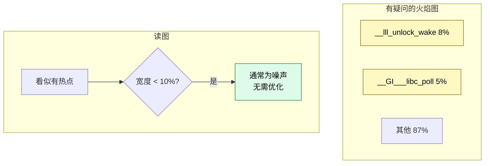

**判断过程**:
1. 最大宽度 8% → **未达热点阈值**
2. 两个"热点"加起来不到 15% → 不算瓶颈
3. **结论**:不需要优化,误诊常见

---

## 七、火焰图看不到的东西(必读)

火焰图是采样,**只能反映"被采样到"的栈**。它有四大盲区。

### 盲区 1:看不到"为什么慢"


**需要补充工具**:
- `perf stat` → 看 cache miss、TLB miss
- `perf mem record` → 看内存访问
- `valgrind --tool=cachegrind` → 缓存命中率

### 盲区 2:看不到数据本身

火焰图**只看到代码路径**,看不到:
- 处理的数据量
- 数据的内容
- 用户的输入

**意义**:同一个 `hash_search` 平顶,可能是:
- 1 亿次正常调用(优化空间小)
- 1 万次但每次都在冲突(优化空间大)

**需要补充**:业务层监控、慢查询日志。

### 盲区 3:看不到因果关系

```mermaid
flowchart LR
    A["A 函数 30%"] -->|?"调用"| B["B 函数 25%"]
    A -->|"是父调用"| B
    A -->|"是同时间被另一个进程调用"| C["其实没关系"]
    style A fill:#fee2e2,stroke:#dc2626,color:#000
    style C fill:#fef9c3,stroke:#a16207,color:#000
```

火焰图是**时间归并**的,看不出"先后"或"因果"。**两个同时出现的热点可能是巧合**。

### 盲区 4:看不到跨进程协作

```mermaid
flowchart LR
    A["进程 A 火焰图"] -->|"看不到"| B["进程 B 火焰图"]
    C["分布式场景下"] --> D["需要分布式追踪<br/>(Jaeger / Zipkin)"]
    style A fill:#fee2e2,stroke:#dc2626,color:#000
    style D fill:#fef9c3,stroke:#a16207,color:#000
```

数据库的主备复制、分布式事务,只采样一个进程看不到完整图。

---

## 八、进阶:差分火焰图(Differential Flame Graph)

**问题**:优化前后两张火焰图怎么对比?

Brendan Gregg 在 2017 年提出 **差分火焰图**:颜色编码"前 vs 后"的变化:

```mermaid
flowchart LR
    A["优化前火焰图"] --> Tool[flamegraph-diff 工具]
    B["优化后火焰图"] --> Tool
    Tool --> C["差分火焰图"]
    C --> D["红色:变热了<br/>蓝色:变冷了<br/>灰色:没变"]
    style D fill:#dbeafe,stroke:#1d4ed8,color:#000
```

**生成命令**:

```bash
# 安装 FlameGraph 工具集
git clone https://github.com/brendangregg/FlameGraph

# 生成差分
./flamegraph.pl \
  --title="Before vs After" \
  --negate \
  before.folded after.folded > diff.svg
```

**用途**:
- 验证优化效果(应该看到目标函数变蓝)
- 发现意外的副作用(本来不热的函数变红了)

---

## 九、10 个常见陷阱

### 陷阱 1:优化"看起来很热"的函数

```mermaid
flowchart LR
    A["看到某个第三方库函数占 15%"] --> B["就想优化它"]
    B --> C["可能根本不在你的代码控制范围"]
    C --> D["先优化你能控制的"]
    style A fill:#fee2e2,stroke:#dc2626,color:#000
    style D fill:#dcfce7,stroke:#15803d,color:#000
```

### 陷阱 2:忽略 Off-CPU

**症状**:CPU 火焰图一切正常,但业务慢。
**真相**:瓶颈在 IO/锁,**采样不到**。
**对策**:同时采 Off-CPU。

### 陷阱 3:采样时间过短

**30 秒不够**可能采不到偶发问题。建议:
- 短问题:60s 起步
- 长周期问题:多次采样,或 `perf record -a -g -o /tmp/perf.data sleep 600`

### 陷阱 4:采样时业务不繁忙

```mermaid
flowchart LR
    A["半夜空闲时采样"] --> B["火焰图一片空白"]
    B --> C["当然没热点,你也没业务"]
    style A fill:#fee2e2,stroke:#dc2626,color:#000
```

**必须压测场景下采样**,或者等待业务高峰。

### 陷阱 5:看 CPU 火焰图找锁问题

**CPU 火焰图看不到锁**——锁等待时进程不在 CPU 上。**必须 Off-CPU 火焰图**。

### 陷阱 6:看到 `poll` / `epoll_wait` 就以为是问题

```mermaid
flowchart LR
    A["看到 epoll_wait 占 60%"] --> B["进程没事做?<br/>还是网络模型就是异步?"]
    B -->|异步服务| C["正常"]
    B -->|同步服务| D["可能是瓶颈"]
    style B fill:#fef9c3,stroke:#a16207,color:#000
    style C fill:#dcfce7,stroke:#15803d,color:#000
    style D fill:#fee2e2,stroke:#dc2626,color:#000
```

### 陷阱 7:符号解析失败误判

```mermaid
flowchart LR
    A["火焰图一堆 0x00000000xxxx"] --> B["符号丢了"]
    B --> C["/usr/bin/postgres 缺 -g"]
    C --> D["重新编译带调试符号"]
    style A fill:#fee2e2,stroke:#dc2626,color:#000
```

### 陷阱 8:perf 在容器里采不到数据

```bash
# 容器内需要特殊权限
docker run --privileged --pid=host ...

# 或者用 --cap-add
docker run --cap-add=SYS_ADMIN --cap-add=SYS_PTRACE ...
```

### 陷阱 9:采样改变了程序行为

```mermaid
flowchart LR
    A["perf 采样"] --> B["程序会稍微变慢(1~5%)"]
    B --> C["极端情况下可能改变调度"]
    C --> D["压测场景要排除 perf 干扰"]
    style A fill:#fef9c3,stroke:#a16207,color:#000
```

### 陷阱 10:把不同进程的火焰图叠加

```mermaid
flowchart LR
    A["进程 A 的火焰图"] --> C["❌ 不能叠加"]
    B["进程 B 的火焰图"] --> C
    C --> D["两个进程调度独立<br/>叠加没意义"]
    style C fill:#fee2e2,stroke:#dc2626,color:#000
```

多进程场景需要**逐个分析**,或者用专门的 multi-process flame graph。

---

## 十、工具链速查

| 工具 | 适用 | 命令示例 |
|------|------|---------|
| **perf** | Linux 通用 | `perf record -F 99 -p <pid> -g -- sleep 30` |
| **bcc / bpftrace** | 高级、容器友好 | `profile-bpfcc -F 99 -p <pid> 30` |
| **async-profiler** | JVM | `./profiler.sh -d 30 -f out.html <pid>` |
| **py-spy** | Python | `py-spy record -o out.svg --pid <pid>` |
| **rbspy** | Ruby | `rbspy record --pid <pid>` |
| **pprof** | Go | `go tool pprof http://.../debug/pprof/profile` |
| **offcputime** | Off-CPU | `offcputime-bpfcc -F 99 -p <pid> 30` |
| **biolatency** | 块设备延迟 | `biolatency-bpfcc 30` |
| **execsnoop** | 短进程追踪 | `execsnoop-bpfcc` |

---

## 十一、完整工作流(cheat sheet)

```mermaid
flowchart TB
    Start["业务慢"] --> Q1{"CPU 高?"}
    Q1 -->|是| P1["On-CPU 火焰图<br/>perf record -F 99 -g"]
    Q1 -->|否| P2["Off-CPU 火焰图<br/>offcputime-bpfcc"]
    Q1 -->|不确定| P3["同时采 On 和 Off"]

    P1 --> Find["找平顶山"]
    P2 --> Find
    P3 --> Find

    Find --> Check{"宽度 ≥ 10%?"}
    Check -->|否| Noise["噪声<br/>忽略"]
    Check -->|是| Analyze["判断类型"]
    Analyze --> Type{"user / sys / off-cpu?"}
    Type -->|user| U["计算瓶颈<br/>优化算法/缓存"]
    Type -->|sys| S["系统调用瓶颈<br/>合并 IO/换 syscall"]
    Type -->|off-cpu| O["等待瓶颈<br/>减少锁/IO"]
    U --> Verify["修改后重采<br/>差分对比"]
    S --> Verify
    O --> Verify

    style Start fill:#fee2e2,stroke:#dc2626,color:#000
    style Noise fill:#f3f4f6,stroke:#6b7280,color:#000
    style Verify fill:#dcfce7,stroke:#15803d,color:#000
```

---

## 十二、一句话总结

> **火焰图不是答案,是问题清单。**
> 它告诉你"哪里热",但不会自动告诉你"怎么优化"。
> 真正的工作是**从热出发,结合代码上下文和业务语义,找到根因**。
>
> 三个关键习惯:
> 1. **看平顶山宽度**,别被颜色骗
> 2. **同时采 On 和 Off**,别忽略锁
> 3. **验证优化效果**,别只看代码改对了

---

## 参考

- [PostgreSQL 逻辑复制性能分析:火焰图实战](https://growdu.github.io/blog/db/postgresql/postgresql-flame-graph/)
- Brendan Gregg - [The Flame Graph](https://www.brendangregg.com/flamegraphs.html)
- Brendan Gregg - [Off-CPU Flame Graphs](https://www.brendangregg.com/offcpuanalysis.html)
- Brendan Gregg - [Differential Flame Graphs](https://www.brendangregg.com/blog/2017-09-30/differential-flame-graphs.html)
- [FlameGraph GitHub](https://github.com/brendangregg/FlameGraph)
- [Linux perf wiki](https://perf.wiki.kernel.org/)
- [bcc Tools](https://github.com/iovisor/bcc)
