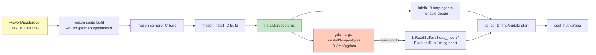
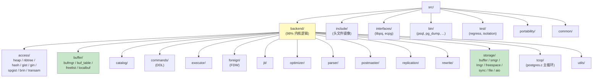
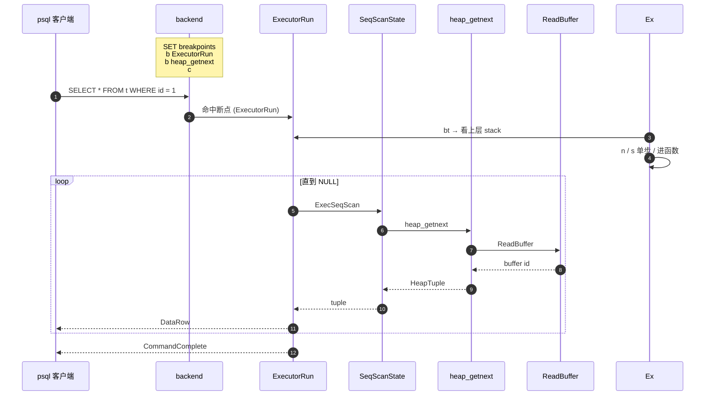

# 01 编译调试与代码布局

> 目标：能在 `~/cwork/postgresql` 上 **30 分钟内编译成功**、能 GDB 跟一条 SQL、能用 `ctags` / `cscope` 在代码里跳转。

## 1.1 编译：meson 路线（PG 15+ 推荐）

PG 18 已默认走 meson。文档与脚本也都在跟进。

```bash
cd ~/cwork/postgresql
meson setup build --prefix=$(pwd)/install --buildtype=debugoptimized
meson compile -C build -j$(nproc)
meson install -C build
```

- `--buildtype=debugoptimized` 打开 `-O2 -g`，既优化又能断点。
- 想要更激进，加 `-Dc_args='-O0 -ggdb3'` 重置 `-O2`。
- 启用扩展：`meson configure -Dssl=openssl -Dldap=enabled -Dlibxml=enabled`。
- 想要 ICU：`meson configure -Dicu=enabled`。

> 注：旧文档（如本目录下 `使用meson编译pg.md`）记的是 PG 16 之前的写法，参数顺序与 `meson configure` 用法都仍然适用，但要确认你的 PG 版本对应。

## 1.2 启动一个 debug 实例

```bash
./install/bin/initdb -D /tmp/pgdata --enable-debug -E UTF8
./install/bin/pg_ctl -D /tmp/pgdata -l /tmp/pg.log start
psql -h /tmp -p 5432 postgres
```

`--enable-debug` 会让 initdb 输出更详细的 hint，并且在 `pg_settings` 里 `lc_messages` 默认带文件位置，便于出问题定位。

## 1.3 源码树导航

```
src/
├── backend/        # 服务端 C 代码（98% 的内核逻辑都在这）
│   ├── access/     # 各种 access method
│   │   ├── heap/      # 堆表
│   │   ├── nbtree/    # B-Tree
│   │   ├── hash/      # Hash
│   │   ├── gist/, gin/, spgist/, brin/
│   │   ├── transam/   # xlog / xact / clog / multixact
│   │   └── ...
│   ├── catalog/    # 系统表缓存
│   ├── commands/    # DDL 语句执行
│   ├── executor/    # 执行器
│   ├── optimizer/   # 查询优化器
│   │   ├── plan/      # 计划生成
│   │   ├── path/      # 路径选择
│   │   └── prep/      # 预处理
│   ├── parser/      # 语法分析
│   ├── postmaster/  # 主进程
│   ├── rewrite/     # 规则重写
│   ├── storage/     # 缓冲、文件、锁、smgr
│   │   ├── buffer/
│   │   ├── smgr/
│   │   ├── lmgr/      # lock manager
│   │   ├── aio/       # PG 18 新：AIO 子系统
│   │   └── ...
│   └── tcop/        # traffic cop：postgres.c 主循环
├── include/        # 头文件（与 backend/ 一一对应）
├── interfaces/     # 客户端：libpq、ecpg
├── bin/            # 服务端命令（psql、pg_dump、initdb 等）
├── test/           # 回归测试
└── ...
```

**约定**：
- 头文件镜像 `src/backend/...` 结构。修改 `src/backend/foo/bar.c` 时，对应声明在 `src/include/foo/bar.h`。
- 几乎所有重要数据结构都在 `nodes/` 下定义（`plannode.h`、`execnodes.h`、`pg_class.h` ...）。
- `pg_config.h` 是构建期生成的，**不要手动改**。要改编译参数请走 meson。

## 1.4 阅读辅助工具

### ctags + vim

```bash
cd ~/cwork/postgresql
ctags -R --fields=+l src/   # -R 递归，+l 加 line number
vim -t smgropen              # 直接跳到函数
```

### cscope

```bash
cscope -R src/                # 进入交互界面
# 常用快捷键：
#   s: 找 symbol
#   c: 找调用此函数的地方
#   g: 找定义
#   t: 找被谁调用
#   f: 找文件
```

### ripgrep

```bash
# 找所有引用 BufferDesc 的地方
rg -n 'BufferDesc\b' src/backend/storage/buffer/
# 找所有对某个函数的调用
rg -n '^\s*heap_insert\(' src/backend/
```

## 1.5 GDB 套路

### 1.5.1 启动并设置断点

```bash
gdb --args ./install/bin/postgres -D /tmp/pgdata
(gdb) set pagination off
(gdb) set print pretty on
(gdb) b postgres.c:postgres          # 主入口
(gdb) b execMain.c:ExecutorRun
(gdb) b heapam.c:heap_insert
(gdb) c
```

### 1.5.2 跟一条 SELECT

```bash
# 另开窗口
psql -h /tmp -p 5432 postgres
postgres=# SELECT * FROM t WHERE id = 1;
```

GDB 停在 `ExecutorRun`，按 `n` 单步，`s` 进函数。常用：
- `p ExecInitNode(planstate, estate, 0)` —— 初始化节点
- `p estate->es_processed` —— 已处理的元组数
- `bt` —— 看调用栈
- `finish` —— 跳出当前函数

### 1.5.3 跟一条 UPDATE（看 WAL 写入）

```sql
postgres=# BEGIN;
postgres=# UPDATE t SET v = v + 1 WHERE id = 1;
postgres=# COMMIT;
```

关键断点：
- `b heapam.c:heap_update`
- `b xlog.c:XLogInsert`
- `b xlog.c:XLogFlush`

### 1.5.4 条件断点

```bash
(gdb) b heapam.c:heap_insert if relation->rd_id == 16384
```

`16384` 是 `pg_class` 的 oid，可在 psql 里 `SELECT relname, oid FROM pg_class WHERE relname='t';` 查到。

## 1.6 实战：30 分钟热身

1. 编译 + 启动实例（5 分钟）
2. `psql` 里 `CREATE TABLE t(id int, v text); INSERT INTO t SELECT g, md5(g::text) FROM generate_series(1,1000) g;`
3. GDB 跟 `SELECT * FROM t WHERE id = 999`，依次在 `ExecutorRun`、`ExecSeqScan`、`heap_getnext` 打断点，记录调用栈。
4. 跟 `UPDATE t SET v='x' WHERE id = 1`，观察 `heap_update` → `XLogInsert` → `XLogFlush` 的顺序。
5. 在 `pg_log` 里能看到 PID 与 statement，配合 GDB 里的 `bt` 对照。

完成上述 5 步后，L1 阶段“编译 + GDB + 跟 SQL”的能力就算入门。

## 1.7 调试符号与 core

如果编译时 strip 了符号：
```bash
ls -l ./install/bin/postgres   # 看是否过小
meson configure -Dstrip=false   # 关掉 strip
meson compile -C build
```

Core dump：
```bash
ulimit -c unlimited
sudo sysctl -w kernel.core_pattern=/tmp/core.%e.%p
# 在 postgresql.conf 里打开
# data_checksums = on  # 也可加，启动慢一点
# log_min_messages = debug1
```

## 1.8 小结

| 能力 | 工具 | 一句话 |
| --- | --- | --- |
| 编译 | meson | `meson compile -C build` |
| 跳转 | ctags/cscope | 在 110 万行 C 里秒级定位 |
| 跟踪 SQL | GDB | 任意函数可断点 |
| 看页内容 | `xxd` + pageinspect | 把页面以 hexdump 看待 |
| 看 WAL | `pg_xlogdump` | 看 redo 记录 |
| 看锁 | `pg_locks`、`pg_stat_activity` | 运行时观察 |


## 1.9 图示

### 1.9.1 编译 → 运行 → 调试工作流



### 1.9.2 源码树导航



### 1.9.3 GDB 跟踪 SELECT 全流程



> 图示配套源码：`~/cwork/postgresql/src/backend/postmaster/postmaster.c`、`src/backend/tcop/postgres.c`、`src/backend/executor/{execMain.c,execScan.c}`、`src/backend/access/heap/heapam.c`、`src/backend/storage/buffer/bufmgr.c`。
