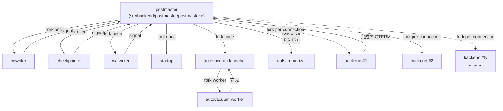
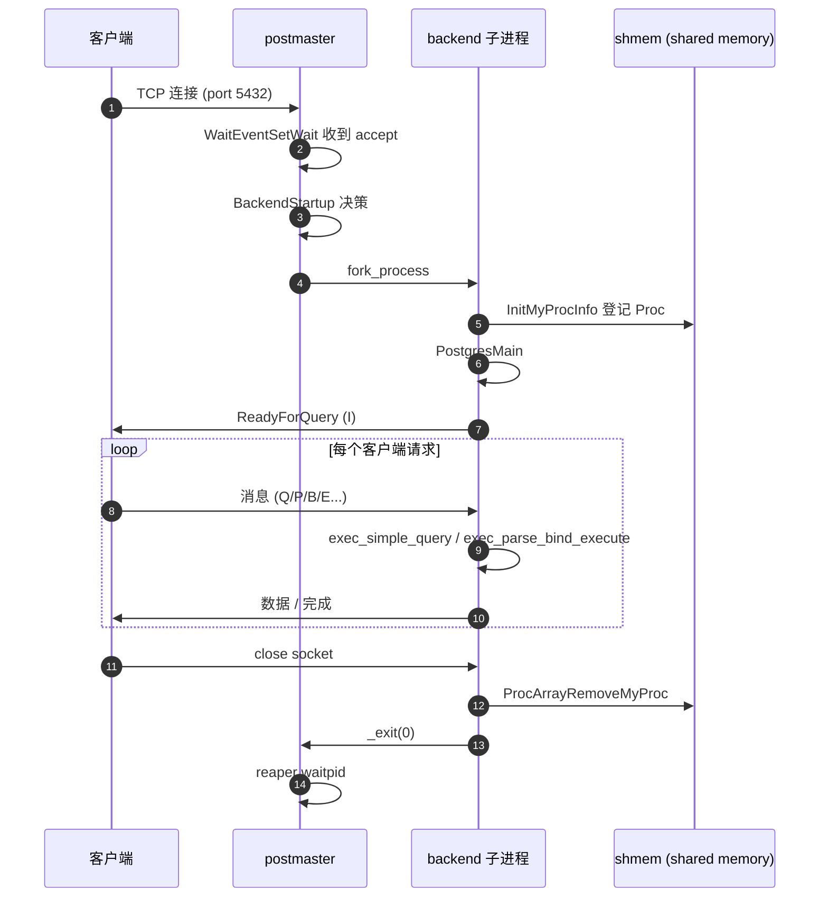
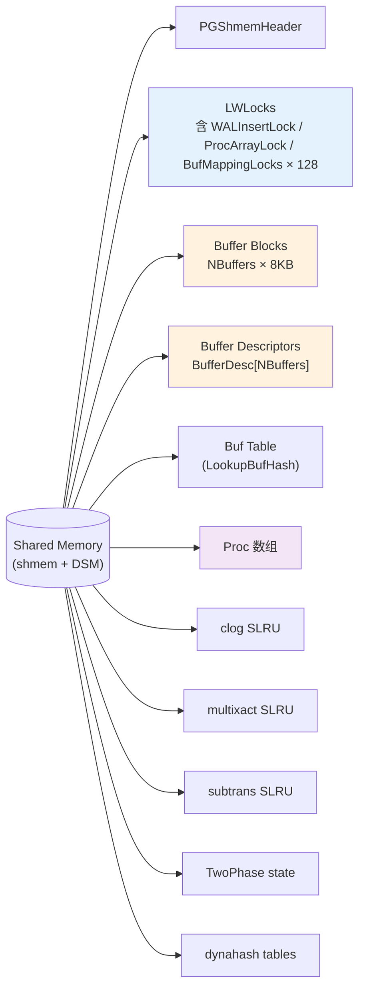
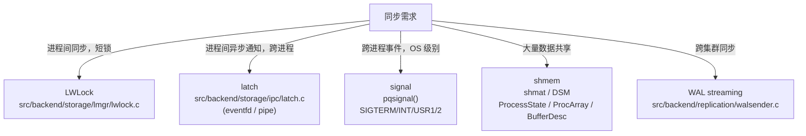

# 02 进程架构与生命周期

> 目标：理解“一个客户端连接 = 一个 backend 进程”的进程模型，掌握 postmaster 如何 fork / signal 整个家族，以及每个子进程的工作。

## 2.1 进程家族一览

```
            +-----------------+
            |   postmaster    |  <- 唯一常驻监听进程
            +--------+--------+
                     |
   +------+----------+-----+----+----+----+----+----+----+----+
   |      |          |     |    |    |    |    |    |    |    |
 bgwriter checkpointer walwriter startup autovacuum launcher walsummarizer
                                                                  (PG16+)
                                                                  ... 以及
                按需 fork 的 backend (每个客户端连接一个)
```

| 进程 | 入口 | 角色 |
| --- | --- | --- |
| postmaster | `src/backend/postmaster/postmaster.c:PostmasterMain` | 总控：监听、fork、signal、shutdown 协调 |
| backend | `src/backend/tcop/postgres.c:PostgresMain` | 服务一个客户端连接，跑完一条 SQL 退出 |
| bgwriter | `src/backend/postmaster/bgwriter.c:BackgroundWriterMain` | 周期性刷共享 buffer 中的脏页 |
| checkpointer | `src/backend/postmaster/checkpointer.c:CheckpointerMain` | 周期性做 checkpoint |
| walwriter | `src/backend/postmaster/walwriter.c:WalWriterMain` | 把 WAL 刷到磁盘 |
| startup | `src/backend/postmaster/startup.c:StartupProcessMain` | 启动时回放 WAL / standby 持续 replay |
| autovacuum launcher | `src/backend/postmaster/autovacuum.c:AutoVacLauncherMain` | 按表调度 autovacuum worker |
| walsummarizer | `src/backend/postmaster/walsummarizer.c:WalSummarizerMain` | PG 16+：把 WAL 摘要写到 .summary 文件供逻辑复制/增量备份 |

## 2.2 启动序列

入口：`src/backend/main/main.c:main()`。

```c
progname = get_progname(argv[0]);
startup_hacks(progname);                 // 平台相关
argv = save_ps_display_args(argc, argv);  // 给 ps 显示用
if (argc > 1) {
    if (strcmp(argv[1], "--boot") == 0)        // 单用户/boot 模式
        AuxiliaryProcessMain(argc, argv);
    else if (strcmp(argv[1], "--describe-config") == 0)
        ...
    else
        PostmasterMain(argc, argv);           // 正常路径
}
```

`PostmasterMain` 流程（`postmaster.c`）：
1. 解析命令行选项（端口、数据目录、`-h`、`-i` 等）
2. `pq_init()` 初始化 libpq 内存
3. 读取 `postgresql.conf`（`guc_file.l`）
4. 校验配置（shared_buffers、max_connections 等）
5. `create_data_dir_paths()` 确认 PGDATA 合法
6. **早期启动**：fork 一个子进程跑 `StartupProcessMain` 做 crash recovery（如果有）
7. **fork 各种辅助进程**：bgwriter / checkpointer / walwriter / walsummarizer / autovacuum launcher
8. 进入主循环：监听 socket、accept 新连接、fork backend

## 2.3 接受新连接

主循环的关键调用（伪代码）：
```c
for (;;) {
    SELinuxReloadConfig();                 // 周期性 reload
    TouchSocketFiles();
    FarKeeperMainLoop();                   // 处理一些 background 任务
    HandleMainLoop();                      // 核心：accept + fork
}
```

`HandleMainLoop()` 里：
```c
for (;;) {
    selret = WaitEventSetWait(...);        // poll/select/epoll 包装
    for (i = 0; i < selret.num_events; i++) {
        if (event is listen socket)
            conn = ConnCreate(listen_sock);
            BackendStartup(conn);          // fork backend
        else if (event is a backend's socket)
            SignalBackend(...);
        ...
    }
}
```

`BackendStartup` 干两件事：
1. `fork_process()` 创建一个子进程，子进程跑 `BackendRun → PostgresMain`
2. 父进程继续监听

子进程里：
```c
// postgres.c
PostgresMain(int argc, char *argv[])
{
    BaseInit();                            // 初始化内存上下文、portable signal
    InitMyProcInfo();                      // 在 shared memory 里登记
    InitProcessPhase2();                   // latch、signal handler
    InitPostgres(...);                     // 跑 initdb 的 bootstrap、连接数据库
    for (;;) {
        // 读一条 query（PostgresMain 的 inner loop）
        // → exec_simple_query 或 exec_execute_message
    }
}
```

## 2.4 信号机制

PG 用自实现的 `pqsignal()` 取代 `sigaction()`，原因是同一信号在不同平台上行为不同，需要可移植封装。

`ProcessInterrupts` 是 backend 里“信号-逻辑”的核心桥（`src/backend/storage/ipc/procsignal.c` / `src/backend/utils/init/interrupt.c`）：
- `SIGQUIT` → 立即 abort，core dump，不跑 shutdown
- `SIGTERM` → smart shutdown：拒绝新连接、跑完现有事务再退
- `SIGINT`  → fast shutdown：拒绝新连接、cancel running query、退出
- `SIGUSR1` → 触发 log rotation
- `SIGUSR2` → 通常没动作，给某些 extension 用

关键函数：
- `pqsignal(SIGTERM, die)` —— `die` 是 postmaster.c 的信号处理函数
- `die(SIGTERM)` 触发 `SetQuitSignalReason()`，让 backend 在合适时机检查 `ProcDiePending`
- `ProcessInterrupts()` 在 `tcop/postgres.c:PostgresMain` 的 inner loop 里被调用

**记住**：信号处理函数里 **几乎什么都不能做**，只能设标志位。所有清理工作都在主循环的“安全点”做。这点跟 Linux 内核的 `TASK_INTERRUPTIBLE` 思路一致。

## 2.5 共享内存布局

每个进程（postmaster 启动后所有子进程）通过 `shmem` 映射同一片内存：

```
shmem 起始
+----------------------------------+
| PGShmemHeader                     |  <- magic + size
+----------------------------------+
| LWLocks array                     |
+----------------------------------+
| Buffer Blocks (NBuffers * 8KB)    |
+----------------------------------+
| Buffer Descriptors                |  BufferDesc[NBuffers]
+----------------------------------+
| Lock hash table                   |
| Proc header + Proc array          |
+----------------------------------+
| ... 其他共享结构 (clog, multixact, ...) ...
+----------------------------------+
```

- **Buffer Blocks**：NBuffers 个 8KB 页面在 `shmem` 里（也可以 `huge_pages=try` 走大页）。
- **Buffer Descriptors**：`BufferDesc` 在 `src/include/storage/buf_internals.h`，每个 buffer 一份。包含：
  - `tag`：relfilenode + forkNum + blockNum
  - `buf_id`：在 buffer pool 里的索引
  - `state`：`BM_LOCKED / BM_DIRTY / BM_JUST_DIRTIED / BM_IO_IN_PROGRESS / BM_PIN_COUNT_WAITER / BM_VALID`
  - `usage_count`：clock-sweep 替换策略用的引用计数
  - `wait_backend_pgprocno`：等 pin 的等待者

每个 backend 还通过 dsm（dynamic shared memory）申请自己的私有段。GUC `dynamic_shared_memory_type` 控制实现（`posix` / `sysv` / `mmap` / `windows`）。

## 2.6 进程间通信

PG 用三套机制：

1. **共享内存** —— 大量无锁/lwlock 同步。Buffer pool、锁、Proc array、clog、subtrans、multixact 等。
2. **信号** —— postmaster → backend 的单向通知（cancel、die 等）。
3. **latch** —— 自实现的轻量唤醒（基于 eventfd / pipe）。`src/backend/storage/ipc/latch.c`。
   - `WaitLatch(MyLatch, WL_LATCH_SET | WL_TIMEOUT | WL_POSTMASTER_DEATH, ...)`
   - 线程/进程间极快的唤醒，比 signal 便宜。

`MyLatch` 是 `pgproc.h` 里 Proc 结构体中的一个字段，postmaster 与各 backend 都映射到同一片内存里。

## 2.7 一次 backend 的一生

```
fork (postmaster)
   │
   ├── 子进程执行 BackendRun
   ├── PostgresMain:
   │      BaseInit
   │      InitMyProcInfo      ← 把自己的 Proc 结构挂进 ProcArray
   │      InitPostgres        ← 解析 database/user, 跑 session 级别 init
   │      │
   │      for (;;) {
   │          read command from libpq
   │          switch (command) {
   │              case 'Q':  exec_simple_query     → PortalRun
   │              case 'P':  exec_parse_bind_execute → PortalRun
   │              ...
   │          }
   │          CHECK_FOR_INTERRUPTS();
   │      }
   │
   ├── 收到 SIGTERM:
   │      die(SIGTERM) → SetProcDieFlag
   │      PostgresMain 内循环检查到 → 关闭连接
   │
   ├── shutdown:
   │      ProcArrayRemoveMyProc
   │      CleanupProc
   │      _exit(0)
   │
   └── postmaster reaps
```

## 2.8 实战练习

### 2.8.1 数进程

```sql
postgres=# SELECT pid, application_name, backend_type, state, query
           FROM pg_stat_activity;
```

`backend_type` 会显示 `client backend / autovacuum worker / checkpointer / walwriter / background worker / etc.`。

### 2.8.2 给 backend 发信号

```bash
# 找到 backend 的 PID
psql -h /tmp -U postgres -c "SELECT pg_backend_pid()"
# 假设返回 12345
kill -INT 12345       # fast shutdown: 取消当前 query
kill -TERM 12345      # smart shutdown: 等当前 query 结束
```

### 2.8.3 GDB 跟踪 fork

```bash
gdb --args ./install/bin/postgres -D /tmp/pgdata
(gdb) set follow-fork-mode child       # 跟子进程
(gdb) set detach-on-fork off
(gdb) b PostmasterMain
(gdb) c
```

然后 psql 连一下，观察 GDB 切到 backend 子进程，断点在 `PostgresMain`。

### 2.8.4 看共享内存

```bash
# macOS
sudo ipcs -m
# Linux
ipcs -m
```

PG 启动时会创建一段以 `GlobalPostgresSharedMemory` 为 key 的 shmem。

## 2.9 小结

- 一个 client 连接 = 一个 backend 进程。**没有连接池**（除非用 PgBouncer）。
- postmaster 是唯一监听进程，所有连接都从它 fork。
- 进程间通信三件套：shmem / signal / latch。
- 后端进程的生命周期由信号驱动，但所有清理都在“安全点”做。
- PG 18 新增 `walsummarizer` 进程，逻辑复制和增量备份更便宜。

下一章（03）会从 backend 收到一条 SQL 那一刻开始，继续往里走。


## 2.10 图示

### 2.10.1 进程家族结构



### 2.10.2 backend 进程的生死时序



### 2.10.3 共享内存布局（横截面）



### 2.10.4 信号 vs latch vs shmem 对照



> 图示配套源码：`src/backend/postmaster/{postmaster,bgwriter,checkpointer,walwriter,startup,autovacuum,walsummarizer}.c`，`src/backend/storage/ipc/{latch,procsignal}.c`，`src/backend/storage/lmgr/lwlock.c`。
