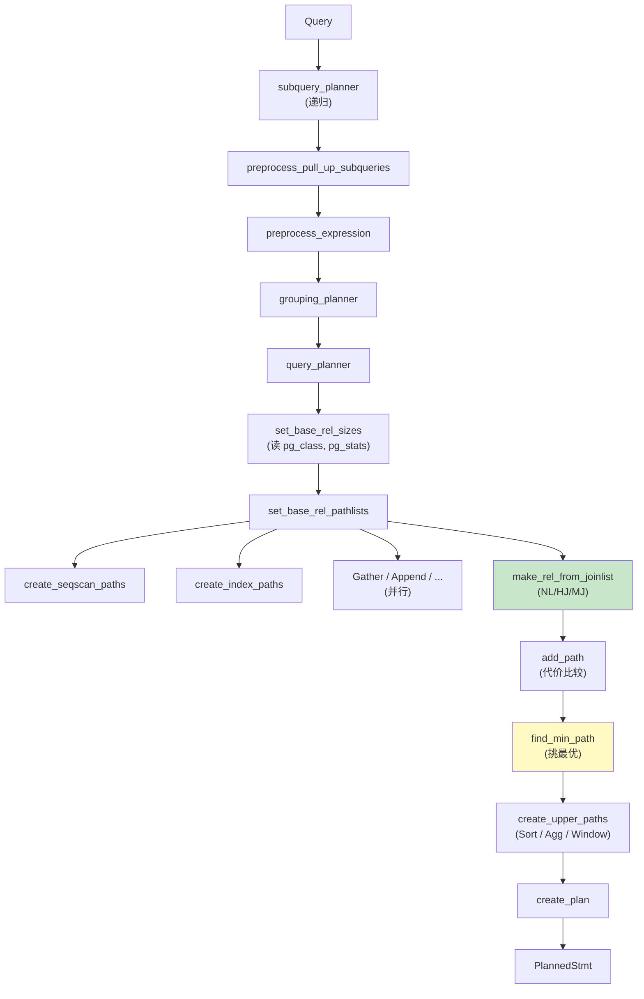
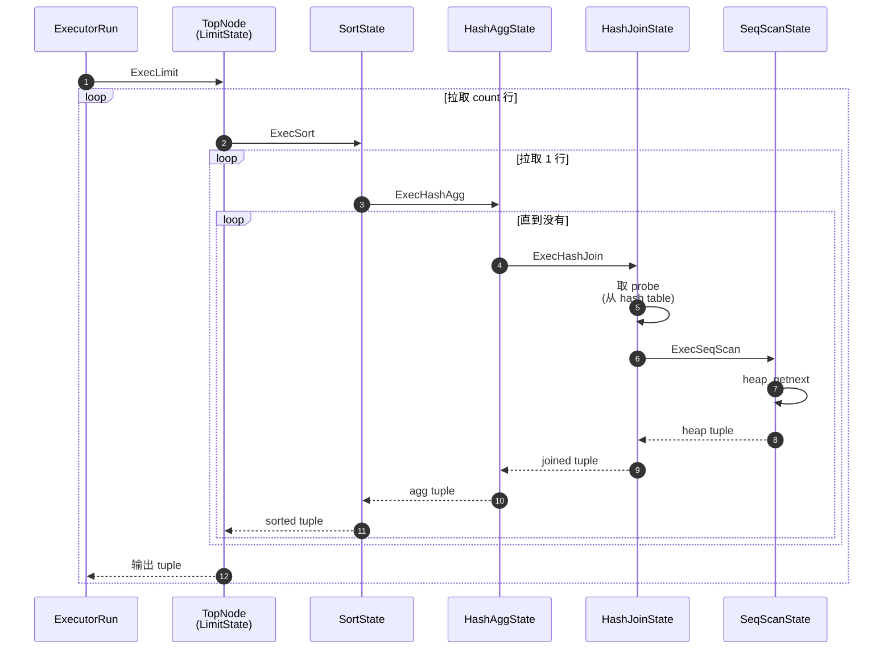
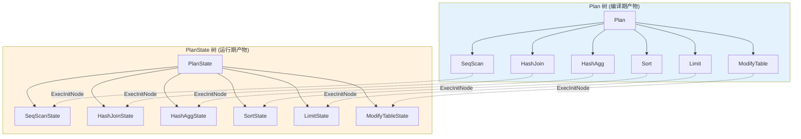

# 03 查询管线全景

> 目标：从 backend 收到一条 query 字节那一刻起，逐函数跟踪到执行器出口。理解 **解析 → 重写 → 优化 → 执行** 四阶段的产物（`RawStmt` / `Query` / `PlannedStmt` / `PlanState`）。

## 3.1 全景图

```
                client
                  │ libpq protocol
                  ▼
   ┌────────────────────────────────┐
   │ tcop/postgres.c : PostgresMain │  inner loop 读消息
   └─────────────┬──────────────────┘
                 │
   ┌─────────────▼──────────────────┐
   │ exec_simple_query /  prepared  │  parse/plan 入口
   └─────────────┬──────────────────┘
                 │
   ┌─────────────▼──────────────────┐
   │ parser / parser_analyze        │  RawStmt / Query
   └─────────────┬──────────────────┘
                 │
   ┌─────────────▼──────────────────┐
   │ rewrite / QueryRewrite         │  Query (规则展开后)
   └─────────────┬──────────────────┘
                 │
   ┌─────────────▼──────────────────┐
   │ planner / planner              │  PlannedStmt (Plan 树)
   └─────────────┬──────────────────┘
                 │
   ┌─────────────▼──────────────────┐
   │ executor / ExecutorRun         │  PlanState 树, 返回 tuple
   └─────────────┬──────────────────┘
                 │
                 ▼
            client (结果集)
```

## 3.2 入口：`exec_simple_query`

`src/backend/tcop/postgres.c:exec_simple_query(const char *query_string)` 是简单查询协议（`Q` 消息）的入口。流程：

```c
exec_simple_query(const char *query_string)
{
    parsetree = pg_parse_query(query_string);              // 解析
    ... 
    for each RawStmt {
        query = pg_analyze(parsetree, ...);                // 分析 → Query
        query = pg_rewrite(query, ...);                    // 重写 → Query'
        plantree = pg_plan_queries(query, ...);            // 优化 → PlannedStmt
        ... log: stmt_start ...
        PortalRun(portal, ...);                             // 执行
        ... log: stmt_end ...
    }
}
```

每一步都接受 GUC 控制日志、错误、内存上下文。

## 3.3 解析：`parser`

PG 的 parser 是 **手写递归下降** + Bison LALR(1) 语法，**不是 Bison 生成的**。

- 词法：`src/backend/parser/parser.c` → `lexer.c`（Flex 生成）
- 语法：`src/backend/parser/gram.y`（Bison）
- AST：`src/include/nodes/parsenodes.h` —— `RawStmt`、`SelectStmt`、`InsertStmt` ...
- 入口函数：`raw_parser(query_string)` 返回 `RawStmt *` 列表

```c
// gram.y 简版主干
topLevelStmt:  ...
             |  SelectStmt
             |  InsertStmt
             |  UpdateStmt
             |  DeleteStmt
             |  ...
             ;
```

输出举例 `SELECT * FROM t WHERE id=1`：
```c
RawStmt {
  .stmt = SelectStmt {
    .targetList = [ResTarget{* , NULL}],   // *
    .fromClause = [RangeVar{t}]
    .whereClause = A_Expr{=, id, 1}
  }
}
```

注意：这里还是 **AST**，没有 type info、没有 catalog lookup。

## 3.4 分析：`pg_analyze`

`src/backend/parser/analyze.c:transformStmt()` 把 AST 翻成语义 Query（`src/include/nodes/primnodes.h`）。

这一阶段做的事：
- 名字 → OID（表、列、函数、类型）
- 类型推导（`SELECT 1 + 'a'` 在这里报错）
- 子查询上拉
- 常量折叠（`WHERE 1=2` → FALSE）
- `IN → EXISTS`、VIEW 展开
- 安全检查（权限）

产物：`Query` 树（`src/include/nodes/primnodes.h`）。

```c
typedef struct Query {
    NodeTag     type;
    CmdType     commandType;    // CMD_SELECT / CMD_UPDATE / ...
    QuerySource querySource;    // QRC_*
    bool        hasSubLinks;
    List       *cteList;
    List       *rtable;         // RangeTblEntry 列表：每个 FROM 一个
    List       *jointree;       // FromExpr
    List       *targetList;     // TargetEntry 列表：每个输出列
    List       *returningList;
    List       *qualList;
    ...
} Query;
```

`rtable` 是 RangeTblEntry，保存这个查询涉及到的每个表/子查询/CTE。每个 `Var` 节点通过 `varno / varattno` 引用 rtable 里的元素。

## 3.5 重写：`pg_rewrite`

`src/backend/rewrite/rewriteHandler.c:QueryRewrite()`：

- 展开视图（把 `SELECT * FROM v` 替换成 v 的定义）
- 应用 RLS 策略
- 处理 INSTEAD OF / DO INSTEAD 规则
- 处理可更新视图
- 实现 `WITH` (CTE) 的语义：`MATERIA LIZED` / `NOT MATERIALIZED`

输出还是 `Query`，只是 rtable / targetList / qualList 被替换 / 增加。

## 3.6 规划：`pg_plan_queries`

`src/backend/optimizer/plan/planner.c:planner()` 是入口。流程：

```
Query
  │
  ├──> pull_var_clause + quals_normalize
  │
  ├──> subquery_planner  (递归处理子查询)
  │       │
  │       ├──> preprocess_pull_up_subqueries
  │       ├──> preprocess_expression
  │       │
  │       ├──> grouping_planner
  │       │     │
  │       │     ├──> query_planner (生成 join paths)
  │       │     │     │
  │       │     │     ├──> setup_simple_rel_arrays
  │       │     │     ├──> make_one_rel
  │       │     │     │     │
  │       │     │     │     ├──> set_base_rel_sizes   ← pg_stats, pg_class
  │       │     │     │     ├──> set_base_rel_pathlists
  │       │     │     │     │     │
  │       │     │     │     │     ├──> create_seqscan_paths
  │       │     │     │     │     ├──> create_index_paths
  │       │     │     │     │     ├──> Gather path (并行)
  │       │     │     │     │     └── ...
  │       │     │     │     ├──> make_rel_from_joinlist
  │       │     │     │     │     └──> generate join paths:
  │       │     │     │     │           ├── nestloop
  │       │     │     │     │           ├── hash join
  │       │     │     │     │           ├── merge join
  │       │     │     │     │           └── ...
  │       │     │     │     └──> add_path  ← 用 add_path 加进来
  │       │     │     │
  │       │     │     └──> find_min_path  ← 比较代价，挑最优
  │       │     │
  │       │     ├──> create_upper_paths   ← sort, agg, window, distinct
  │       │     │
  │       │     └──> create_plan          ← 选中的 path 变成 plan node
  │       │
  │       └──> extract_needed_outer
  │
  └──> top_plan = ... (返回 PlannedStmt)
```

### 3.6.1 关键数据结构

`src/include/nodes/relation.h`：
- `RelOptInfo` —— 优化器对“关系”的内部表示（一个基表 / 一个子查询 / 一个 join 的中间结果）
- `Path` —— 候选执行路径
- `Cost` —— 估算代价
- `PathKey` —— 排序键（merge join / order 用）

`src/include/nodes/plannodes.h`：
- `Plan` —— plan node 基类
- `Scan` —— 扫描类（SeqScan / IndexScan / BitmapHeapScan / ...）
- `Join` —— 连接类（NestLoop / HashJoin / MergeJoin）
- `ModifyTable` —— DML
- `PlannedStmt` —— 整棵 plan 的容器

### 3.6.2 Path 是什么

```c
typedef struct Path {
    NodeTag     type;
    RelOptInfo *parent;          // 所属 RelOptInfo
    Path       *pathkeys;        // 排序键
    Cost        start_cost;
    Cost        total_cost;
    List       *path;            // 子 path 列表
    ...
} Path;
```

特殊 Path：`IndexPath`、`HashPath`、`NestPath`、`MergePath`、`GatherPath`（并行）等。

### 3.6.3 代价估算

- 顺序扫描：`cpu_tuple_cost * tuples + seq_page_cost * pages`
- 索引扫描：`cpu_index_tuple_cost * tuples + random_page_cost * pages`
- Hash join：`cpu_hash_cost + ...`

代价参数在 `src/backend/optimizer/path/costsize.c` 的 `cost_seqscan` / `cost_index` / `cost_nestloop` 等函数中具体定义。

## 3.7 执行：`ExecutorRun`

`src/backend/executor/execMain.c:ExecutorRun()` 是统一入口，被 prepared statement / simple query / cursor 都复用。

```c
typedef struct EState {
    ...
    TupleDesc    es_tupleDesc;   // 输出元组描述
    PlanState  **es_subplanstates;
    EPQState     *es_epq_active;  // EvalPlanQual for updates
    ...
} EState;
```

每条 Plan 节点都有对应的 `PlanState`：
```
Plan             -> PlanState
SeqScan          -> SeqScanState
HashJoin         -> HashJoinState
...
```

`ExecutorRun` 流程：
```c
ExecutorRun(QueryDesc *queryDesc, ScanDirection direction, uint64 count)
{
    // 1. ExecutorStart: 把 Plan 翻成 PlanState
    estate = CreateExecutorState();
    InitPlan(queryDesc, estate);    // 递归初始化所有节点
    ...
    // 2. 跑
    if (operation == CMD_SELECT)
        ExecutePlan(estate, ...);   // 取 count 行或到 NULL
    else
        ExecModifyTable(...);       // INSERT/UPDATE/DELETE/MERGE
    
    // 3. ExecutorEnd: 清理
}
```

`ExecutePlan` 是 Volcano 模型的实现：
```c
ExecutePlan(EState *estate, PlanState *planstate, ...)
{
    for (;;) {
        slot = ExecProcNode(planstate);     // 取下一行
        if (TupIsNull(slot)) break;
        // 把 slot 送到 client
        if (++(estate->es_processed) >= count) break;
    }
}
```

`ExecProcNode` 是一个 dispatch：
```c
ExecProcNode(PlanState *node)
{
    // 根据 node->type 分发
    switch (nodeTag(node)) {
        case T_SeqScanState:    return ExecSeqScan(node);
        case T_IndexScanState:  return ExecIndexScan(node);
        case T_HashJoinState:   return ExecHashJoin(node);
        ...
    }
}
```

## 3.8 一条 SQL 的完整旅程（实例）

```sql
SELECT u.name, count(*) FROM users u JOIN orders o ON u.id = o.user_id
WHERE u.active = true
GROUP BY u.name
HAVING count(*) > 5
ORDER BY count(*) DESC
LIMIT 10;
```

1. **parse**：`gram.y` 生成一棵 AST（SelectStmt）
2. **analyze**：每个 `users` / `orders` 在 rtable 中登记一个 RangeTblEntry；`u.name` / `o.user_id` 翻译成 Var 节点（带 varno / varattno / vartype）
3. **rewrite**：没有 view / rule，不动
4. **plan**：
   - 路径候选：
     - HashJoin(SeqScan users, SeqScan orders, hash on u.id=o.user_id) + HashAgg + Sort
     - MergeJoin(IndexScan users, IndexScan orders, u.id 索引) + HashAgg
     - HashJoin + 走 u.active 上的部分索引 ...
   - 比较 cost，挑代价最低
5. **execute**：
   ```
   LimitState
     └── SortState (DESC, count(*))
          └── HashAggState
               └── HashJoinState
                    ├── HashState (build: users)
                    │     └── SeqScanState (users, qual: u.active=true)
                    └── SeqScanState (orders, hash probe: o.user_id = build keys)
   ```

每个节点在 `ExecInitNode` 里创建对应的 `*State`，在 `ExecEnd` 里清理。

## 3.9 实践：trace 一条 query

```bash
gdb --args ./install/bin/postgres -D /tmp/pgdata
(gdb) b pg_parse_query
(gdb) b pg_analyze
(gdb) b pg_plan_queries
(gdb) b ExecutorRun
(gdb) b ExecInitNode
(gdb) c
```

```sql
SELECT * FROM t WHERE id = 1;
```

依次停在每个函数。注意 GDB 里用 `p query.commandType` 看 `CMD_SELECT`，用 `p plantree->commandType` 也看 `CMD_SELECT`，但 `plantree` 的字段已经完全不同了。

设置 `debug_print_parse = on` / `debug_print_rewritten = on` / `debug_print_plan = on` / `debug_pretty_print = on` 也能看到文本版中间产物，但内容很冗长，建议只在调试时打开。

## 3.10 小结

- **parser**：AST，语法层
- **analyzer**：Query，语义层（带类型、带 OID）
- **rewriter**：Query，应用规则/视图
- **planner**：PlannedStmt（Plan 树），代价层
- **executor**：PlanState 树，运行时层

后四章会专门深入存储侧：smgr、bufmgr、heap/索引、wal。前面这三章把“上层”摆好，再往里走才不会迷路。


## 3.11 图示

### 3.11.1 查询管线全景

```mermaid
flowchart LR
    Q["SQL 文本<br/>(libpq Q 消息)"]
    Q --> P1["1. pg_parse_query<br/>(gram.y)"]
    P1 --> RS["RawStmt AST<br/>(SelectStmt / InsertStmt)"]
    RS --> P2["2. pg_analyze<br/>(analyze.c)"]
    P2 --> QY["Query<br/>(带 OID / 类型)"]
    QY --> P3["3. pg_rewrite<br/>(rewriteHandler.c)"]
    P3 --> QR["Query'<br/>(视图 / 规则展开)"]
    QR --> P4["4. pg_plan_queries<br/>(planner.c)"]
    P4 --> PS["PlannedStmt<br/>(Plan 树)"]
    PS --> P5["5. ExecutorStart / Run<br/>(execMain.c)"]
    P5 --> EX["PlanState 树<br/>Volcano 取元组"]
    EX --> OUT["结果集<br/>(DataRow / CommandComplete)"]
    
    style P1 fill:#bbdefb
    style P2 fill:#c8e6c9
    style P3 fill:#fff9c4
    style P4 fill:#ffccbc
    style P5 fill:#f8bbd0
```



### 3.11.2 planner 内部决策流



### 3.11.3 Volcano 执行器模型



### 3.11.4 plan / planstate 关系图



> 图示配套源码：`src/backend/tcop/postgres.c`、`src/backend/parser/{gram.y,analyze.c}`、`src/backend/rewrite/rewriteHandler.c`、`src/backend/optimizer/plan/planner.c`、`src/backend/executor/{execMain.c,execProcnode.c}`。
