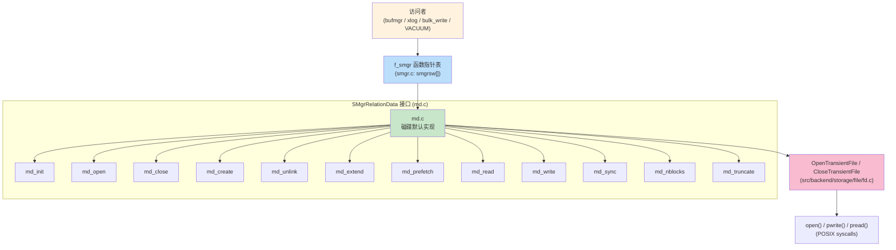
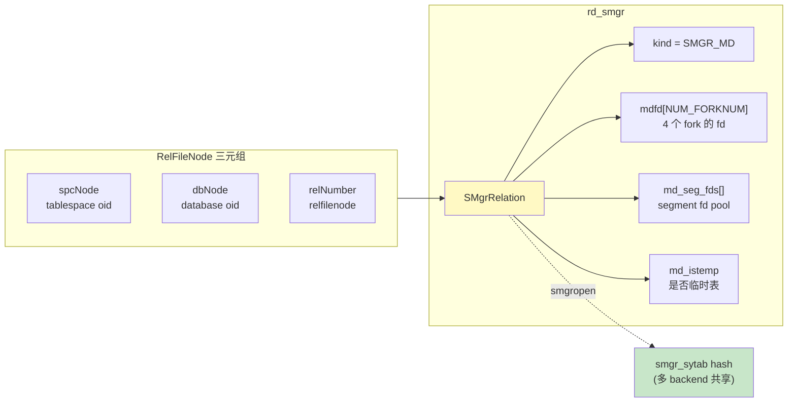
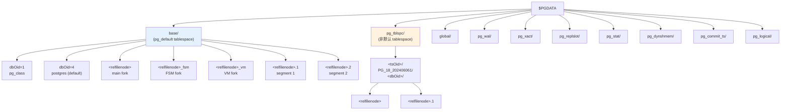
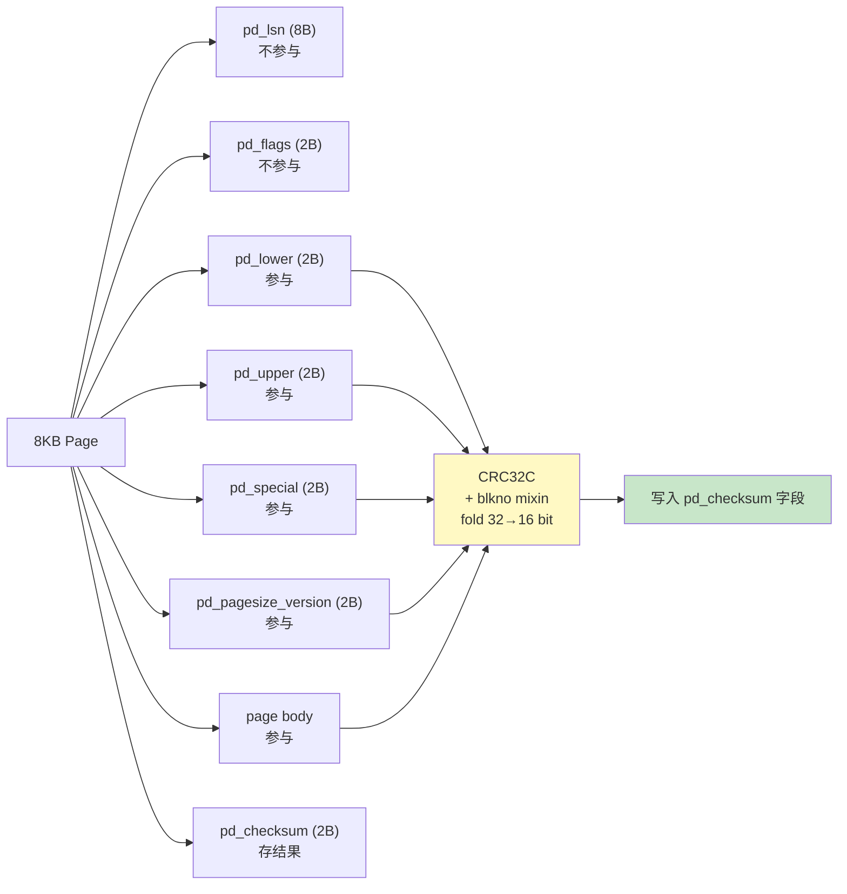

# 04 存储抽象层 SMGR

> 目标：理解 PG 在“OS 文件系统”和“表/索引页面”之间插的一层抽象（Storage Manager），以及默认实现磁碟版（md.c）。**这一层是 PG 与其它 DBMS 在工程上差异最大的一处**——比 InnoDB 的 `fil_system` 还更“裸露”。

## 4.1 为什么需要 SMGR

理论上，backend 可以直接 `open()` / `read()` / `write()` 关系文件。但 PG 把这层抽出来有三点好处：

1. **多 backend 共享同一组文件描述符**：避免每个 backend 自己开 N×表数×fork数个 fd，超过 `ulimit -n`。
2. **表空间、相对文件节点、fork 概念清晰**：`relfilenode + tablespace + fork` 三元组唯一确定一段磁盘内容。
3. **可插拔**：未来可替换为支持压缩、远程的对象存储实现；现在已经有 bulk_write.c 处理大块顺序写。

PG 没有把 SMGR 写成 `class + virtual function`，而是手写 **函数指针 dispatch 表**（`smgr.c:f_smgr`）。

## 4.2 关键数据结构

### 4.2.1 SMgrRelation（一个打开的表/索引）

```c
// src/include/storage/smgr.h
typedef struct SMgrRelation {
    RelFileNode      rd_node;        // tablespace + db + relfilenode
    SMgrRelationData rd_smgr;        // 由具体 smgr 实现填
    struct SMgrRelationData *smgr_rnode;  // 被多 backend 共享的“骨架”
    ...
} SMgrRelation;

typedef struct SMgrRelationData {
    int                  kind;          // SMGR_MD 等
    /* 由 md.c 维护： */
    int                  mdfd[NUM_FORKNUM];  // 每个 fork 的 fd（main/fsm/vm/init）
    BlockNumber          md_seg_fds[NUM_FORKNUM];
    bool                 md_istemp;
    ...
} SMgrRelationData;
```

### 4.2.2 RelFileNode

```c
typedef struct RelFileNode {
    Oid     spcNode;     // tablespace oid（pg_default 是 InvalidOid）
    Oid     dbNode;      // database oid
    RelFileLocatorBackend rel;  // 含 RelFileNumber
} RelFileNode;
```

`RelFileNode` 决定了一个段在磁盘上的名字：`base/<dbOid>/<relfilenode>` 或 `base/<tsOid>/<dbOid>/<relfilenode>`。

### 4.2.3 ForkNumber

PG 把每个 relation 切成若干 **fork**：

| ForkNumber | 含义 | 后缀 |
| --- | --- | --- |
| `MAIN_FORKNUM` (0) | 数据本身 | 无 |
| `FSM_FORKNUM` (1) | Free Space Map | `_fsm` |
| `VISIBILITYMAP_FORKNUM` (2) | 可见性位图 | `_vm` |
| `INIT_FORKNUM` (3) | 模板 fork（unlogged table 用） | `_init` |

索引则只有 MAIN + FSM + VM。

## 4.3 函数指针表

```c
// src/backend/storage/smgr/smgr.c
static const f_smgr smgrsw[] = {
    /* magnetic disk */
    { md_init, md_exit, md_open, md_close, md_create, md_exists,
      md_unlink, md_extend, md_prefetch, md_read, md_write,
      md_writeback, md_sync, md_nblocks, md_truncate, md_immedsync,
      md_request_ao_size }
};

static const f_smgr *smgr = smgrsw;
```

调用侧全部走：
```c
smgr->md_open(reln);
smgr->md_read(reln, blocknum, buffer);
```

避免在头文件里出现 `static inline` 时绑定死实现。这是 PG 经典的 **f_smgr 函数指针风格**，与 `fd.c`、`xlog.c` 的回调风格统一。

## 4.4 主要操作

### 4.4.1 smgropen / smgrclose

```c
SMgrRelation smgropen(RelFileNode rnode, BackendId backend);
void smgrclose(SMgrRelation reln);
```

- `smgropen` 在缓存（`smgr_sytab`）里查有没有已开过的 `RelFileNode`，没有就 `md_open` 并填到 `rd_smgr`。
- **重要**：多个 backend 共享一个 `SMgrRelationData` 骨架（refcount 计数），自己的 backend-only 状态在 `rd_smgr` 里。

### 4.4.2 smgrread / smgrwrite

```c
void smgrread(SMgrRelation reln, ForkNumber forknum, BlockNumber blocknum,
              void *buffer);
void smgrwrite(SMgrRelation reln, ForkNumber forknum, BlockNumber blocknum,
               const void *buffer, bool skipFsync);
```

- 落到 `md.c:mdread/mdwrite` 时 **不再检查权限/缓存**，假定 BufferDesc 已经 pin 住了 buffer。
- `skipFsync` 让 WAL writer 在 flush 时跳过 fsync（已由 WAL 担保）。

### 4.4.3 smgrprefetch（异步预取）

```c
bool smgrprefetch(SMgrRelation reln, ForkNumber forknum, BlockNumber blocknum);
```

PG 18 用 `libpgsync` 把预取请求塞到 AIO 队列（见 05 章），由 io worker 真正发出 `pread()`。

### 4.4.4 smgrextend

```c
void smgrextend(SMgrRelation reln, ForkNumber forknum, BlockNumber blocknum,
                const void *buffer, bool skipFsync);
```

新建一个段时会创建文件、扩展到目标 block + 1。**核心点：extend 不是 write**，第一次写新段时必须用 extend，pg 保证页面里空位是 0。

### 4.4.5 smgrnblocks

```c
BlockNumber smgrnblocks(SMgrRelation reln, ForkNumber forknum);
```

返回 fork 的当前 block 数。

## 4.5 md.c 的实现要点

`src/backend/storage/smgr/md.c` 是磁碟默认实现。要点：

### 4.5.1 文件描述符表

```c
// md.c 全局
static MdfdVec *md_fdset = NULL;  // 共享 fd 池
```

`md_open` 不一定真 `open()`：
- 走 `_mdfd_open_for` / `_mdfd_segment_open` 在 `md_fdset` 数组里查是否已打开。
- 真正 open 是 lazy：第一次 `read` 时如果发现 fd 未打开，就 `OpenTransientFile()`。

### 4.5.2 分段（segment）

PG 8.4+ 默认 1 GB 一个段（`RELSEG_SIZE = 131072` 个 8KB 页）。文件命名：

```
relfilenode                              <- segment 0
relfilenode.1                            <- segment 1
relfilenode.2
...
```

切换 segment 时 `md.c` 会关闭旧段 fd、打开新段 fd。

### 4.5.3 bulk_write.c

PG 18 把大块顺序写从 md.c 抽出成 `bulk_write.c`：

- 写 WAL segment、relation extend 等场景
- 用 `pwritev()` 一次性写多个块
- 与 AIO 配合：AIO 提交后写穿到 bulk_write 队列再下盘

## 4.6 SMGR 与 Buffer Manager 的接口

`bufmgr.c` 调用 SMGR 的两个动作：
- `smgrread(rel, forknum, blkno, buf)` —— 填 buffer
- `smgrwrite(rel, forknum, blkno, buf, skipFsync)` —— 写回脏 buffer

而 `bufmgr.c` 调用 SMGR 的更上层包装在 `src/backend/storage/buffer/localbuf.c`（local buffer）和 `bufmgr.c`（shared buffer）里。

## 4.7 tablespace 的实现

`pg_tblspc/<oid>/<dbOid>/<relfilenode>[.seg]` 是 tablespace 的路径。`tblspc_oid` 通过 `pg_tablespace.oid` → `pg_class.reltablespace` 反查到。

- 当 `spcNode == InvalidOid`（即 `pg_default`），路径是 `base/<dbOid>/<relfilenode>`。
- 当 `spcNode != InvalidOid`，路径是 `pg_tblspc/<spcNode>/PG_18_202406061/<dbOid>/<relfilenode>`（`PG_18_202406061` 是 PG 18 的 catalog version）。

PG 在每个 tablespace 目录下都会生成一个版本号目录，避免版本不一致。

## 4.8 unlogged table 的 INIT_FORKNUM

`CREATE UNLOGGED TABLE t (...)` 会创建：
- `t`（MAIN）—— 启动时为 0，commit 后才可见
- `t_init`（INIT）—— 在 `initdb` / 复制时模板使用

Postmaster 启动时若发现 `unlogged` relation 的 MAIN fork 为 0，会从 `t_init` 拷贝一份填回去。源码在 `src/backend/catalog/storage.c` 的 `ResetUnloggedRelations()`。

## 4.9 实战

### 4.9.1 看一个表的文件

```sql
postgres=# SELECT pg_relation_filepath('pg_class');
postgres=# \! ls -l $PGDATA/base/4/ | head -20
```

### 4.9.2 触发 segment 切换

```sql
postgres=# CREATE TABLE big (id int);
postgres=# INSERT INTO big SELECT generate_series(1, 200000000);
-- 等写完，看 $PGDATA/base/16384/ 下是否出现 big.1, big.2 ...
postgres=# \! ls -l $PGDATA/base/16384/big*
```

### 4.9.3 跟踪 SMGR 调用

GDB：
```bash
(gdb) b smgr.c:smgrread
(gdb) b md.c:mdread
(gdb) c
```

任意 `SELECT * FROM t WHERE id=1`，看 smgrread 是否进入，以及 mdread 实际做了什么。

## 4.10 SMGR 层的限制与未来

1. **没有 page checksum** —— 不在这一层，在 bufpage.c 算，由 bgwriter 写入前重算。
2. **没有 encryption** —— 需要 `pg_tde` 这样的 extension 来提供。
3. **没有压缩** —— 默认磁碟不压缩，只有 `pg_compression` 等 extension。
4. **AIO**：PG 16 引入了基础设施，PG 18 已经能在多个地方（bulk_read / bulk_write / WAL）走 AIO；smgr 层提供 `smgrprefetch` 入口，但 IO 提交走 `src/backend/storage/aio/`。

下一章（05）会讲 buffer manager 如何与 SMGR 协作、它自己的并发协议，以及 AIO 是怎么挂上去的。

## 4.11 进阶：page checksum 算法细节

PG 的 page checksum 是 **算法名称 pd_checksum**，位于 `src/backend/storage/page/bufpage.c`。

### 4.11.1 校验范围

```
Page (8KB):
  pd_lsn (8B) + pd_flags (2B)       <- 不参与校验
  pd_lower (2B) + pd_upper (2B) +
  pd_special (2B) + pd_pagesize_version (2B)  <- 这些参与
  ... (整个 page body)
```

校验公式：CRC32C over `(page_body[lower..upper]) + (pd_special..pagesize)`。pd_lsn 和 pd_flags 不参与是为了让 HOT hint bit 更新不需要重算 checksum（但实际上 PG 在写盘时会重算，因为 hint bit 写入会让 page 变 dirty）。

### 4.11.2 实现

```c
// src/include/storage/bufpage.h
#define PG_PAGE_LAYOUT_VERSION  4

// src/backend/storage/page/checksum.c
uint16 pg_checksum_page(char *page, BlockNumber blkno);
bool pg_verify_checksum(char *page, BlockNumber blkno);
```

`pg_checksum_page` 实现：
```c
uint16 pg_checksum_page(char *page, BlockNumber blkno)
{
    // 1. 把 pd_checksum 位置置 0
    // 2. CRC32C over entire page
    // 3. mix with blkno (防止 page 拷贝错位)
    // 4. fold 32 -> 16 bit
    return checksum;
}
```

### 4.11.3 torn write 与是否需要 doublewrite

PG 默认没有 doublewrite buffer（不像 InnoDB）。后果：

- 8KB page 写入过程中断电 → page 半写半写
- PG 检测不到（checksum 校验会失败）
- 用户可能看到 `ERROR: invalid page in block ...`

PG 18 在 AIO 上加 page_checksum 验证，但**不写 doublewrite**。生产建议：
- 文件系统用 `wal=always`（XFS/Ext4）
- 用 `initdb -k` 开启 `data_checksums`
- 监控 `pg_stat_database.checksum_failures`

## 4.12 进阶：segment 文件命名与查找

### 4.12.1 文件命名

PG 用 `<timelineid><logid, 8 hex><segid, 8 hex>` 命名 **WAL segment**。但 relation 文件不一样：

```
relation 文件（base / pg_tblspc）：
   relfilenode                 <- segment 0（主段）
   relfilenode.1               <- segment 1
   relfilenode.2
   ...
```

WAL 文件（pg_wal）：
```
   000000010000000000000001    <- TLI 1, logid 0, segid 1
   000000010000000000000002
   00000001000000000000000A
   ...
```

### 4.12.2 segment 切换算法

md.c 中 `mdnblocks()`：

```c
BlockNumber _mdnblocks(SMgrRelation reln, ForkNumber forknum)
{
    // 1. 读 file size (stat / fstat)
    // 2. 按 segment 大小计算
    //    nsegments = filesize / RELSEG_SIZE
    //    last_segment_size = filesize % RELSEG_SIZE
    // 3. 返回总 blocks = nsegments * (RELSEG_SIZE / BLCKSZ)
    //    + last_segment_blocks
}
```

segment 切换在 `smgrextend`：

```c
void mdextend(SMgrRelation reln, ForkNumber forknum, BlockNumber blocknum,
              char *buffer, bool skipFsync)
{
    if (blocknum >= RELSEG_SIZE) {
        // 需要切到下一个 segment
        segment = blocknum / RELSEG_SIZE;
        seg_blocknum = blocknum % RELSEG_SIZE;
        open_segment_file(reln, forknum, segment);
    }
    ...
}
```

## 4.13 进阶：tablespace 物理路径与版本号

### 4.13.1 路径格式

```
pg_default tablespace:
   $PGDATA/base/<dbOid>/<relfilenode>[.seg]

非默认 tablespace:
   $PGDATA/pg_tblspc/<tsOid>/PG_<version>_<yyyymmdd>/<dbOid>/<relfilenode>[.seg]
```

例子：

```
/var/lib/postgresql/data/pg_tblspc/16385/PG_18_202406061/16384/4567
```

### 4.13.2 version号的由来

每个 PG 大版本会 bump catalog version号（`src/backend/catalog/catalog.c:CatalogControlData`）。
- PG 17 → `PG_18_202406061`
- 路径中嵌入这个号是为了防止版本不一致：
  - 旧版本启动时拒绝打开新版本目录
  - pg_upgrade 强制要求 catalog version 一致

### 4.13.3 强制 catalog version 检查

```c
// src/backend/catalog/storage.c:CreateTableSpace
// 检查 spcOid 路径下的目录名是否是当前版本
if (strcmp(dirname, CATALOG_VERSION_NO) != 0)
    ereport(ERROR, "tablespace is for a different PostgreSQL version");
```

## 4.14 进阶：smgr_sytab 缓存与多 backend 共享

### 4.14.1 共享 SMgrRelation 骨架

PG 让多个 backend 共享 SMgrRelationData，但每个 backend 持有自己的引用：

```c
// src/backend/storage/smgr/smgr.c
SMgrRelation smgropen(RelFileNode rnode, BackendId backend)
{
    // 1. 查 hash 表 smgr_sytab
    //    key = (rnode.node.spcNode, rnode.node.dbNode, rnode.node.relNumber)
    
    // 2. 命中：refcount++
    
    // 3. 未命中：
    //    a) 创建新的 SMgrRelation
    //    b) 调 smgr->md_open
    //    c) refcount = 1
    //    d) 加进 hash
}
```

### 4.14.2 多 backend 同步问题：
- backend A 调用 smgropen → 建好 fd
- backend B 调用 smgropen → 复用，但 fd 是共享还是单独？
- **答案是**：fd 放在 SMgrRelationData 里（共享）。但 PG 8.4+ 把 fd 做成 ref-counted pool（`MdfdVec`），多个 backend 通过 `fdset` 共享同一份打开的 fd 集合。

### 4.14.3 表空间 / 表 / fork 三元组唯一性

每个 (spcNode, dbNode, relNumber) 三元组在 PG 实例里**唯一**。这由：
- `CREATE TABLE` 时生成新 relNumber
- DROP 后才能复用
- ALTER TABLE 不会改 relNumber

## 4.15 进阶：smgrprefetch 与 AIO 整合

### 4.15.1 smgrprefetch 接口

```c
bool smgrprefetch(SMgrRelation reln, ForkNumber forknum, BlockNumber blocknum);
```

- 默认实现（`md_prefetch`）：在 libaio/io_uring 上提交一次 read，**立即返回**
- backend 继续做事（同步路径仍可继续）
- 当 backend 真正访问这个 block 时，调 `ReadBuffer` 检查是否已完成：
  - 已完成：直接返回
  - 未完成：要么等（同步 fallback），要么 yield 给 io worker

### 4.15.2 实现

```c
// src/backend/storage/smgr/md.c
void md_prefetch(SMgrRelation reln, ForkNumber forknum, BlockNumber blocknum)
{
    // 1. 拿到 fd
    // 2. 调 aio_submit 提交 read
    // 3. 记录在 backend 的 outstanding list
    //    当 backend 之后调 smgrread，且 block 还没回填，
    //    等 io completion
}
```

### 4.15.3 AIO 实战配置

```sql
postgres=# SET io_method = 'worker';
postgres=# SET io_workers = 4;
postgres=# SET io_direct = 'data';    -- 绕过 OS cache
postgres=# SET io_writes = 'normal';  -- 顺序写开 direct
```

## 4.16 进阶：smgr 错误处理与恢复

### 4.16.1 错误码

```c
// src/backend/storage/smgr/smgr.c
#define SMGR_ERRSTR(...)   // 错误码 + 文本
#define SMGR_CRITICAL      // 致命错误（无法恢复）
```

常见：
- `ENOSPC`：磁盘满
- `EIO`：IO 错误
- `EMFILE`：fd 用尽

### 4.16.2 fd 用尽的恢复

PG 默认 `max_files_per_process = 1000`。如果某 backend 把 fd 用完：
1. `open()` 失败
2. 抛 `ERROR: could not open file ... too many open files`
3. backend 退出，连接断开

生产建议：
- 提高 ulimit -n
- 监控 `pg_locks` / `pg_stat_activity`
- 用 `pg_file_settings` 配合 `max_files_per_process`

## 4.17 小结

- Page checksum 是 CRC32C over page body + blkno mixin，**不防 torn write**。
- Segment 文件命名按 `RELSEG_SIZE` 切分。
- Tablespace 路径含 catalog version，强制版本检查。
- smgr_sytab hash 共享 SMgrRelation，多 backend 共享 fd pool。
- AIO 让 smgrprefetch 真正异步，与 io worker 协作完成 read。

这些补完了 04 章关于"存储"与"page"深度不足的问题，下一节给 05 章补 buffer pool 细节。


## 4.18 图示

### 4.18.1 SMGR 函数指针 dispatch 层



### 4.18.2 SMgrRelation 数据结构关系



### 4.18.3 关系文件目录结构



### 4.18.4 page checksum 计算范围



> 图示配套源码：`src/backend/storage/smgr/{smgr.c,md.c,bulk_write.c}`、`src/include/storage/smgr.h`、`src/backend/storage/file/fd.c`、`src/backend/storage/page/{bufpage.c,checksum.c}`、`src/backend/storage/freespace/freespace.c`、`src/backend/access/heap/visibilitymap.c`。
