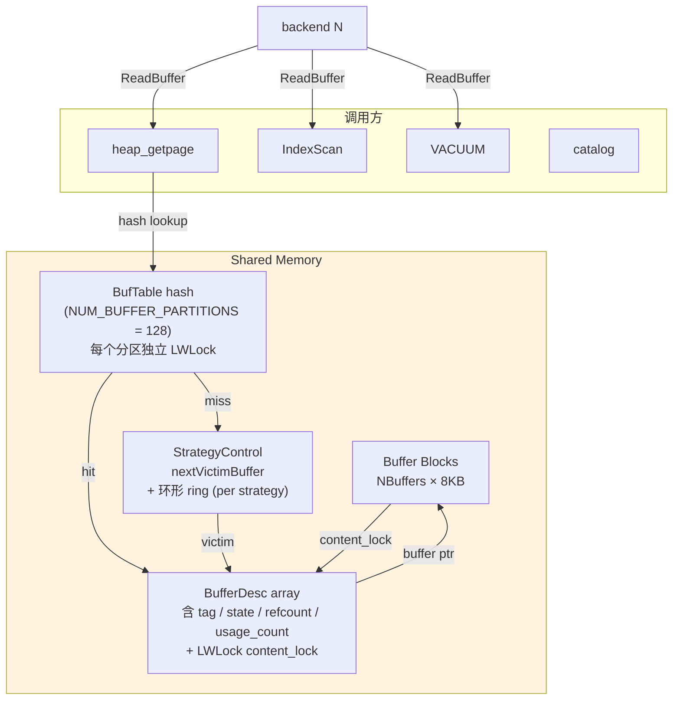
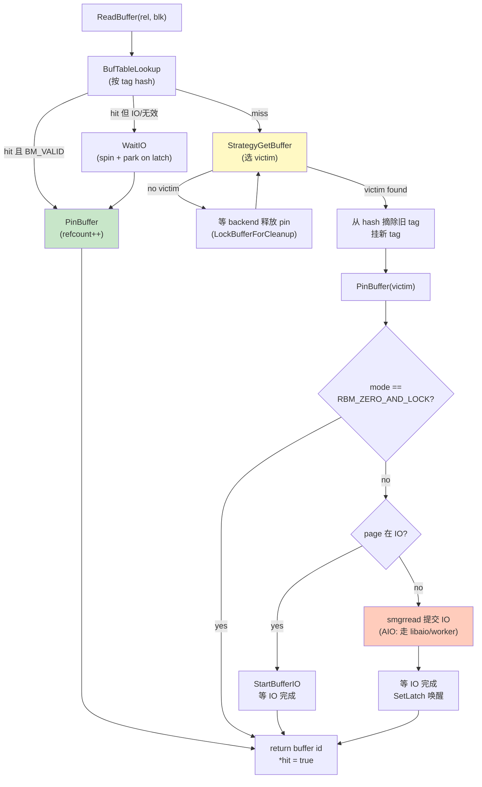
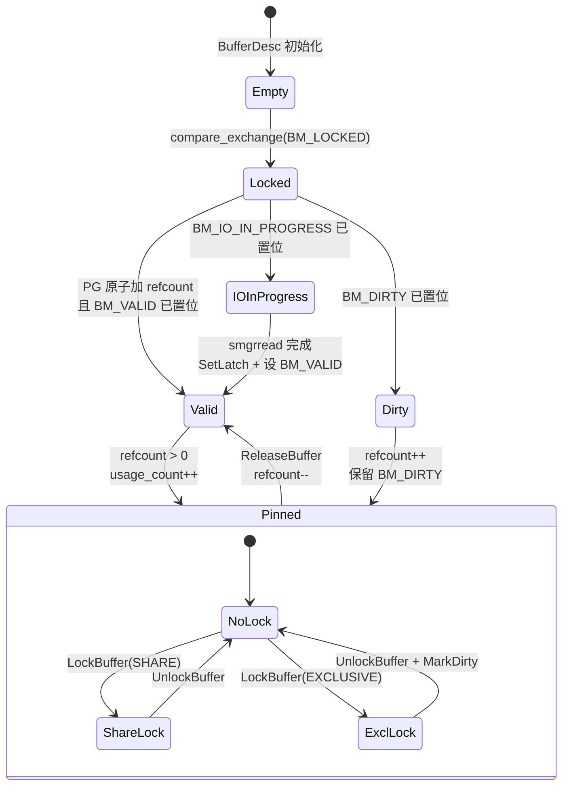
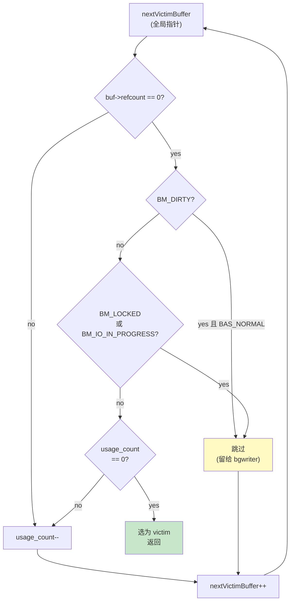
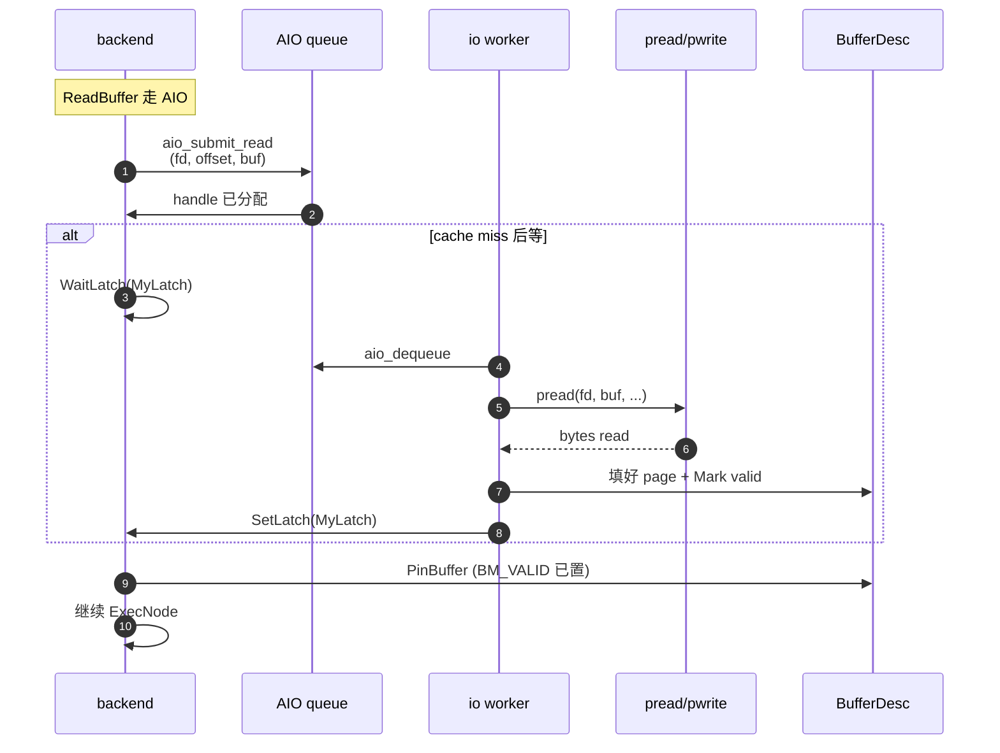

# 05 缓冲区管理

> 目标：掌握 PostgreSQL shared buffer pool 的实现——`BufferDesc` 元数据、hash 索引、clock-sweep 替换策略、AIO 集成、lock 与 pin 的差别。**这一章是“存储引擎内核”最关键的章节**。

## 5.1 整体结构

```
                        backend A             backend B
                            │                     │
                            ▼                     ▼
                ReadBuffer(rel, blk) ────────────────────
                            │
                ┌───────────▼───────────┐
                │   bufmgr.c            │
                │   ─────────           │
                │   ReadBuffer_core     │
                │   ReadBuffer_common   │
                └────┬─────────────┬────┘
                     │             │
            miss ────│             │──── hit
                     ▼             ▼
            ┌────────────────┐  ┌──────────────┐
            │ md.c (smgrread) │  │ return slot  │
            └────────┬───────┘  └──────────────┘
                     │
                     ▼
              disk / AIO queue
```

## 5.2 关键数据结构

### 5.2.1 BufferDesc（元数据）

```c
// src/include/storage/buf_internals.h
typedef struct BufferDesc {
    BufferTag   tag;             // 关系 + fork + block（哈希键）
    int         buf_id;          // 在 buffer pool 里的索引
    ...
    pg_atomic_uint32 state;      // BM_LOCKED / BM_DIRTY / ...
    int         usage_count;     // clock-sweep 引用计数
    uint32      wait_backend_pgprocno;  // 等 pin 的等待者 pid
    int         refcount;        // 当前 pin 数
    int         oldest_lsn;     // 该 buffer 最近一次变脏的 LSN（PG 18）
    ...
    LWLock      content_lock;    // 保护 buffer 内容（page data）
} BufferDesc;
```

### 5.2.2 BufferTag

```c
typedef struct BufferTag {
    RelFileNode rnode;           // spcNode + dbNode + relNumber
    ForkNumber  forkNum;
    BlockNumber blockNum;
} BufferTag;
```

整个 buffer pool 用 **hash 表** `LookupBufHash(tag) -> buf_id` 找到候选 buffer，hash 表在 `buf_table.c` 里。

### 5.2.3 状态位

```c
#define BM_LOCKED               (1 << 0)   // 正在被 pin/unpin
#define BM_DIRTY                (1 << 1)   // 页面被改但未写盘
#define BM_JUST_DIRTIED         (1 << 2)   // 当前 backend 刚改
#define BM_IO_IN_PROGRESS       (1 << 3)   // IO 正在路上
#define BM_PIN_COUNT_WAITER     (1 << 4)   // 有 backend 在等 pin 释放
#define BM_VALID                (1 << 5)   // 页面内容已可用
```

操作这些位用 `pg_atomic_compare_exchange_u32`，从无锁变有锁。

## 5.3 关键函数

### 5.3.1 ReadBuffer(rel, block)

`src/backend/storage/buffer/bufmgr.c:ReadBuffer()` 是入口。背后三步：

```c
Buffer ReadBuffer(Relation rel, BlockNumber blockNum)
{
    // 1. smgropen
    smgr = smgropen(rel->rd_smgr->smgr_rnode, rel->rd_backend);
    
    // 2. ReadBuffer_common → ReadBuffer_common_core
    buf = ReadBuffer_common_core(smgr, REL_FORK_NUMBER, blockNum,
                                  strategy, NULL);
    
    // 3. 如果本地 buffer（用于临时表）要走 localbuf.c
    if (BufferIsLocal(buf))
        return buf;
    
    return buf;  // 返回 buffer id（0..NBuffers-1）
}
```

### 5.3.2 ReadBuffer_common（核心路径）

```c
Buffer ReadBuffer_common(SMgrRelation smgr, char relpersistence,
                         ForkNumber forkNum, BlockNumber blockNum,
                         ReadBufferMode mode, BufferAccessStrategy strategy,
                         bool *hit)
{
    for (;;) {
        buf = ReadBuffer_common_core(smgr, relpersistence, forkNum,
                                     blockNum, mode, strategy, hit);
        if (buf != InvalidBuffer) break;
        // 路径：pin 等待 / IO 等待 / 替换等待
        WaitIO(buf_id);   // 或 LockBufferForCleanup 等
    }
    return buf;
}
```

### 5.3.3 ReadBuffer_common_core

流程（精简）：
```c
ReadBuffer_common_core(...)
{
    tag = MakeBufferTag(rnode, forkNum, blockNum);
    buf_id = BufTableLookup(&tag);   // 1) hash 查
    
    if (buf_id >= 0 && mode != RBM_ZERO_AND_LOCK) {
        buf = &BufferDescriptors[buf_id];
        // 2) 尝试 pin 已有 buffer
        valid = PinBuffer(buf, strategy);
        if (valid) {
            *hit = true;
            return BufferDescriptorGetBuffer(buf);
        }
        // pin 失败 -> 等
    }
    
    // 3) 没找到 或 不能 pin，要找 victim
    if (mode == RBM_NORMAL && strategy == NULL) {
        // 走 freelist 替换策略
        victim = StrategyGetBuffer(strategy);
    } else if (mode == RBM_ZERO_AND_LOCK) {
        // 冷启动场景：直接选个 unused buffer
        victim = ...
    } else if (mode == RBM_ZERO_AND_CLEANUP_LOCK) {
        ...
    }
    
    // 4) 把 victim 从 hash 表上摘掉，挂新 tag
    // 5) PinBuffer(victim, ...) 拿住
    // 6) 如果是新读：smgrread() / smgrextend()
    // 7) 如果 IO_IN_PROGRESS: 等 IO
}
```

要点：
- `PinBuffer` 在 lock 状态机下做原子操作
- `StrategyGetBuffer` 来自 `freelist.c`，是 clock-sweep 算法
- 替换时如果有 `BM_PIN_COUNT_WAITER`，要先 `LockBufferForCleanup` 把对方赶走（让其释放 pin）

## 5.4 Pin / Unpin / Lock

PG 中三个易混淆的概念：

| 概念 | 含义 | 操作 |
| --- | --- | --- |
| **Pin** | 持有 buffer（不被替换） | `PinBuffer(buf)` / `ReleaseBuffer(buf)` |
| **Lock** | 保护 buffer 内容 | `LockBuffer(buf, BUFFER_LOCK_SHARE/EXCLUSIVE)` |
| **LWLock** | 进程间同步 | `LWLockAcquire(&buf->content_lock, LW_SHARED/EXCLUSIVE)` |

锁定规则：
- 想读页内容：pin + BUFFER_LOCK_SHARE
- 想改页内容：pin + BUFFER_LOCK_EXCLUSIVE
- 通常用 `heap_page_prune_opt` 或 `LockBuffer(buf, BUFFER_LOCK_EXCLUSIVE)` 即可；前者会偷看 `BM_JUST_DIRTIED` 决定是否真正 EXCLUSIVE。

**特别注意**：pin 与 LWLock **不是同一种锁**。前者由 `PinBuffer` 维护 refcount，后者单独由 `content_lock` 维护。

## 5.5 替换策略：clock-sweep

`src/backend/storage/buffer/freelist.c`：

- 维护一个环形数组，每个 `BufferDesc` 有 `usage_count`（0–5）
- 一个全局指针 `nextVictimBuffer`，扫描时：
  - `usage_count > 0` → 减 1，继续
  - `usage_count == 0` 且未 pin 且未 dirty → 选为 victim
  - 已 dirty → 跳过（或等 checkpoint）
- 也支持 `BufferAccessStrategy`：bulk read 时不再计 usage_count（在 `BAS_BULKREAD` 等策略下）

不同策略：
- `BAS_NORMAL`：正常使用，参与 clock-sweep
- `BAS_BULKREAD`：`SeqScan` 大表时用，不增加 usage_count
- `BAS_BULKWRITE`：`COPY` 时用，替换后立即 dirty
- `BAS_VACUUM`：`VACUUM` 用，不被替换（环形不会被扫走）

```c
BufferDesc *
StrategyGetBuffer(BufferAccessStrategy strategy, uint32 *buf_state)
{
    for (;;) {
        // 1) 从 strategy 自己的环形里找（如果有）
        // 2) 否则从全局 nextVictimBuffer 扫描
        // 3) 跳过 BM_LOCKED / BM_IO_IN_PROGRESS / dirty
        // 4) usage_count == 0 && 可用 -> 返回
    }
}
```

## 5.6 AIO（异步 I/O）

PG 16+ 引入了 `src/backend/storage/aio/`，PG 18 已经成熟可用。

### 5.6.1 为什么引入 AIO

同步 I/O 在 `ReadBuffer` miss 时会阻塞：等磁盘回填后才继续。问题是：
- 一次 miss 至少 ~10µs（NVMe）/ 100ms（HDD）
- backend 在这段时间 CPU 空转（如果只发 syscall）或等 IO（如果用 libaio）

AIO 允许 backend **发出 IO 后继续干别的**（比如 prefetch 一个 hash join 的 build side），IO 完成时通过 `io worker` 回调 `bufmgr.c` 完成 buffer 标记。

### 5.6.2 入口

`src/backend/storage/aio/method.c` 定义三种实现：
- `IoMethodSync`：传统同步（默认 fallback）
- `IoMethodWorker`：用户态 io worker 线程（PG 18 新）
- `IoMethodLibaio`：用 libaio（Linux）

GUC `io_method` 控制选择。

### 5.6.3 调用链

```
ReadBuffer
  └─ smgrprefetch (PG 16+: 异步预取)
       └─ md_prefetch → smgrsubmit
            └─ aio_submit  (method=worker: 走 PgAioCompletion)
                 └─ io worker 线程取走任务
                      └─ pwrite / pread
                           └─ 调用 callback（往 bufmgr 回填）
                                └─ SetLatch 唤醒 backend
```

### 5.6.4 关键结构

```c
// src/backend/storage/aio/aio.h
typedef struct PgAioHandle {
    PgAioHandleFD  fd;
    int            offset;
    int            length;
    PgAioOp        operation;   // PGAIO_OP_READ / WRITE / FSYNC
    bool           inFlight;
    ...
} PgAioHandle;

typedef struct PgAioCompletion {
    PgAioHandle *handle;
    int          result;       // 字节数 / errno
    uint64       generation;
} PgAioCompletion;
```

backend 在等 IO 完成时调用 `WaitLatch(MyLatch, ...)`，IO worker 完成后会 `SetLatch(MyLatch)`。

### 5.6.5 io_worker

GUC `io_workers`（默认 0，即不开 AIO）。设置为 `2` 即起 2 个 worker 线程。

注意：worker 不是新进程，是 backend 内的额外线程（用 `pthread`）。这是 PG 的权衡，避免引入新进程管理复杂度。

## 5.7 dirty page 写回

脏 buffer 在下列时机被写盘：

| 触发者 | 函数 | 时机 |
| --- | --- | --- |
| bgwriter | `bgwriter.c:BackgroundWriterMain` | 周期刷，扫 BUF_DIRTY_LIST |
| backend | `FlushRelationBuffers / FlushDatabaseBuffers` | 显式调用，如 `VACUUM` 后 |
| checkpoint | `checkpointer.c:CheckpointerMain` | checkpoint 时刷所有 dirty |
| backend 替换 | `StrategyGetBuffer` 跳过 dirty | 替换压力大时把 dirty 留待 bgwriter |

写盘路径：`FlushBuffer(buf, smgr) → smgrwrite` → mdwrite → `pwrite()` → `pg_flush_data(fd, ...)`。

## 5.8 checksum 与 torn write 防护

- 计算：在 `bufpage.c:PageSetChecksumCopy` / `PageSetChecksumInplace`。
- 校验：`PageIsVerified` 在读取时校验。
- torn write 防护：默认没有 double-write buffer（不像 InnoDB），但 **每个 page 默认带 checksum**；断电后 corrupt 会在 hint bit 更新或 vacuum 时被检测到，并通过 `ignore_checksum_failure` 决定是否报错。

> 注：PG 18 正在推进 AIO 上的 double-write buffer 实验，将来可能会补齐这个。

## 5.9 与上层的关系

| 调用者 | 函数 | 备注 |
| --- | --- | --- |
| heap | `heapgetpage` | SeqScan 触发 |
| heap | `heap_insert` / `heap_update` / `heap_delete` | 修改页面 |
| nbtree | `_bt_getbuf` | 索引读 |
| gin | `ginHeapTupleFastInsert` | GIN 索引 |
| autovacuum | `lazy_vacuum_heap` | VACUUM |

## 5.10 实战

### 5.10.1 制造一次 buffer miss

```sql
-- 把 shared_buffers 调小，方便观察 miss
postgres=# SET shared_buffers = '16MB';
postgres=# CREATE TABLE t (id int, v text);
postgres=# INSERT INTO t SELECT g, md5(g::text) FROM generate_series(1,100000) g;

-- pg_buffercache 扩展
postgres=# CREATE EXTENSION pg_buffercache;
postgres=# SELECT relname, isdirty, count(*) FROM pg_buffercache b
           JOIN pg_class c ON b.relfilenode = c.relfilenode
           WHERE c.relname='t' GROUP BY 1,2;

-- 触发 cache miss
postgres=# SELECT pg_prewarm('t', 'prefetch');
postgres=# \! sync; echo 3 > /proc/sys/vm/drop_caches   -- 清 OS cache
postgres=# SELECT * FROM t WHERE id = 999;
```

### 5.10.2 GDB 跟踪

```bash
(gdb) b ReadBuffer_common_core
(gdb) b StrategyGetBuffer
(gdb) b smgrread
(gdb) c
```

任意 `SELECT * FROM t WHERE id=1`，会停在 `ReadBuffer_common_core`。`p tag.rnode`、`p buf_id`、`p buf->state` 看状态。

### 5.10.3 看 io_worker

```sql
postgres=# SET io_method = 'worker';
postgres=# SET io_workers = 4;
postgres=# EXPLAIN (ANALYZE, BUFFERS) SELECT * FROM t WHERE id = 999;
```

`BUFFERS` 会显示 hit/read/dirtied。

## 5.11 小结

- `BufferDesc` 是元数据，`BufferTag` 是 key。
- `PinBuffer` 用原子状态机代替传统锁，是 PG 的标志性工程手法。
- `clock-sweep` 替换策略 + `BufferAccessStrategy` 是性能调优的核心。
- AIO（PG 18）是新一代 I/O 子系统，PF 友好、与 bulk_write 配合，正在成为主路径。

下一章 06 讲堆表 + MVCC —— buffer 里的“页面”到底是什么样的。

## 5.12 进阶：buffer hash 表实现

### 5.12.1 数据结构

`src/backend/storage/buffer/buf_table.c`：

```c
// global
static HTAB *SharedBufHash;
```

PG 用动态哈希表实现（`src/backend/utils/hash/dynahash.c`），buffer lookup 走这里。

每个 entry：
```c
typedef struct BufferLookupEnt {
    BufferTag  tag;
    int        id;             // BufferDesc index
} BufferLookupEnt;
```

### 5.12.2 分区锁（NUM_BUFFER_PARTITIONS）

PG 18+ 把 hash 表分成 **128 个分区**，每个分区独立 lock：

```c
#define NUM_BUFFER_PARTITIONS  128

LWLock *BufMappingLocks;  // array of 128
```

为什么分？hash table 是高竞争热点——`ReadBuffer` 每次都要查。128 分区让冲突降低到 ~1/128。

`BufTableHashPartition(hash)` 计算落到哪个分区：

```c
#define BufTableHashPartition(hashcode)  ((hashcode) % NUM_BUFFER_PARTITIONS)
```

`BufTableLookup` 时只锁对应分区的 LWLock。

### 5.12.3 hash 冲突解决

PG 用 **chained hash**（链表），不是 open addressing：
- 冲突链表头在 hash table 的 entry
- 链表节点分配自 dynahash 自己的内存

PG 13+ 改用 **simple-8b hash**：减少 8-byte key 序列化开销。

### 5.12.4 哈希扩容

```c
// dynahash.c
// 当 load_factor > 0.75 时扩容
// 扩容时拿全局 BufMappingLock 排他
// 影响：扩容时所有 lookup 阻塞（但很短）
```

## 5.13 进阶：PinBuffer 状态机详解

PinBuffer 是 buffer pool 的灵魂。`src/backend/storage/buffer/bufmgr.c`：

```c
static bool PinBuffer(BufferDesc *buf, BufferAccessStrategy strategy)
{
    // 1. 拿 BM_LOCKED
    //    用 compare-and-swap，无 spinlock
    
    // 2. 检查 BM_VALID：
    //    是 → 已 valid，直接 pin
    //    否 → 调用者需要重新尝试
    
    // 3. 调整 usage_count
    
    // 4. 释放 BM_LOCKED
}
```

要点：
- BM_LOCKED 是“保护元数据”的短锁，不是 buffer 内容
- BM_VALID 表示 page 已经从磁盘填好

### 5.13.1 状态机细节

PG buffer 用 **atomic uint32** 表示状态，每个 bit 有含义：

```c
#define BM_LOCKED           (1U << 16)
#define BM_DIRTY            (1U << 17)
#define BM_JUST_DIRTIED     (1U << 18)
#define BM_IO_IN_PROGRESS   (1U << 19)
#define BM_PIN_COUNT_WAITER (1U << 22)
#define BM_VALID            (1U << 23)
```

低 16 位是 refcount。

```c
bool PinBuffer(...)
{
    // 原子增加 refcount
    state = pg_atomic_fetch_or_u32(&buf->state, 1);  // pin_count + 1
    old_state = state;
    
    // 检查 valid / IO / dirty
    if (state & BM_VALID)
        return true;  // 已 valid
    
    return false;     // 调用者需要重试
}
```

### 5.13.2 BM_PIN_COUNT_WAITER

表示有 backend 等待这个 buffer 的 pin。当 unpin 时：

```c
void ReleaseBuffer(BufferDesc *buf)
{
    // 1. 拿 BM_LOCKED
    // 2. refcount - 1
    // 3. 检查是否还有 waiters
    // 4. 如有，唤醒一个（设置 wakeupBackend）
    // 5. 释放 BM_LOCKED
}
```

## 5.14 进阶：content_lock 与 Pin 的区别

**经常被搞混**：Pin 是“buffer 在我的手里”，content_lock 是“buffer 内容被我保护”。

```
+-----------------------------------+
|           BufferDesc              |
|  tag, state, refcount, usage_count|
+-----------------------------------+
|       Buffer (实际 page 8KB)       |
+-----------------------------------+

Pin = refcount++
content_lock = 进程间同步（谁能改 page 内容）
```

调用模式：
```c
// 读 page
Buffer buf = ReadBuffer(rel, blk);
LockBuffer(buf, BUFFER_LOCK_SHARE);
// ... 读 page 内容 ...
UnlockBuffer(buf);
ReleaseBuffer(buf);

// 改 page
Buffer buf = ReadBuffer(rel, blk);
LockBuffer(buf, BUFFER_LOCK_EXCLUSIVE);
// ... 改 page 内容 ...
MarkBufferDirty(buf);
XLogInsert(...);
UnlockBuffer(buf);
ReleaseBuffer(buf);
```

**为什么需要双锁？**
- Pin 只防被替换（victim 时机）
- content_lock 防并发修改 page 内容

如果只 pin 不 lock，可能出现：A 改了 page 内容、B 同时改了 page 内容，结果二人都写脏。

## 5.15 进阶：clock-sweep 替换策略算法

### 5.15.1 完整算法

```c
BufferDesc *
StrategyGetBuffer(BufferAccessStrategy strategy, uint32 *buf_state)
{
    // 1. 如果 strategy 不空，先扫 strategy 自己的环形
    
    // 2. 否则扫全局环形 nextVictimBuffer
    
    // 3. 跳过条件：
    //    - BM_LOCKED
    //    - BM_IO_IN_PROGRESS
    //    - refcount > 0（被 pin）
    //    - BM_DIRTY && bgwriter 还来不及刷
    
    // 4. 命中后：
    //    - BM_JUST_DIRTIED 检查
    //    - usage_count--
    //    - 当 usage_count == 0 且 满足其他条件 → 选中
    
    // 5. 死循环保护：如果扫完整轮都没找到，回到 nextVictimBuffer 从头扫
}
```

### 5.15.2 dead tuple 的回收压力

`usage_count` 最高 5，每访问一次 +1，替换时 -1。这意味着：
- 高频读 page 的 usage_count 长期在 5
- 这些 page 永远不会被选中为 victim
- 实际上，PG 用 BM_PIN_COUNT_WAITER / BM_JUST_DIRTIED 等其它条件选择 victim

### 5.15.3 BufferAccessStrategy 详解

4 种：
- `BAS_NORMAL`：正常使用，参与 clock-sweep
- `BAS_BULKREAD`：SeqScan 大表，**不让 usage_count 增加**（一次扫完就丢）
- `BAS_BULKWRITE`：COPY / `INSERT INTO SELECT`，**让 usage_count = 1**（写完立即被替换）
- `BAS_VACUUM`：VACUUM，**不让 usage_count = 0**（保证不被换）

实现：`BufferAccessStrategy` 是 `src/backend/storage/buffer/freelist.c` 中的 ring buffer：

```c
typedef struct BufferAccessStrategyData {
    BufferStrategyControl *control;
    int                    ring_size;
    int                    current;
} BufferAccessStrategyData;
```

## 5.16 进阶：AIO 实现细节（PG 18）

### 5.16.1 io worker 模式

PG 18 的 worker 模式：

```c
// src/backend/storage/aio/method_worker.c

// worker 线程入口
static void *io_worker_main(void *arg)
{
    PgAioHandle *handle;
    
    for (;;) {
        // 1. 拿 work queue
        handle = aio_dequeue();
        if (!handle) {
            // 等条件变量
        }
        
        // 2. 执行 IO
        result = pwrite64(handle->fd, handle->buf, handle->len, handle->offset);
        
        // 3. 调 completion callback
        PgAioCompletion *comp = aio_get_completion(handle);
        comp->result = result;
        comp->state = PGAIO_COMPLETION_READY;
        aio_complete(handle);
    }
}
```

### 5.16.2 backend vs worker 的关系

backend 不再是 io 的执行者，而是“等待者”：

```c
// backend 内
buffer = ReadBuffer(rel, blk);

// 路径 1：cache hit → 直接返回

// 路径 2：cache miss → 提交 IO 到 worker
aio_submit_read(handle, fd, blk, buf);

// 路径 3：等 IO 完成
WaitLatch(MyLatch, WL_LATCH_SET, ...);
// 唤醒后，buffer 已 valid
```

### 5.16.3 libaio backend

```c
// src/backend/storage/aio/method_libaio.c
// 用 Linux io_submit
struct iocb cb;
io_prep_pread(&cb, fd, buf, len, offset);
io_submit(ctx, 1, &cb);

// 完成后：
io_getevents(ctx, 1, 1, &event, NULL);
```

### 5.16.4 GUC

```sql
postgres.conf:
io_method = 'worker'      # 'sync' / 'worker' / 'libaio'
io_workers = 4
io_direct = 'data'        # 'off' / 'data' / 'wal'
io_writes = 'normal'      # 'normal' / 'readahead' / 'random' / 'sequential'
```

## 5.17 进阶：bgwriter / checkpointer 协作

### 5.17.1 bgwriter

`src/backend/postmaster/bgwriter.c`：

```c
void BackgroundWriterMain(void)
{
    // 1. 周期刷：
    //    - 从 BUF_DIRTY_LIST 挑 dirty buffer
    //    - 调 FlushBuffer(buf)
    //    - 不写 fsync（wal flush 已经担保了）
    
    // 2. 控制节奏：
    //    - bgwriter_delay: ms
    //    - bgwriter_lru_maxpages: 单次最多刷多少
    //    - bgwriter_lru_multiplier: 算 ratio
}
```

bgwriter 把 buffer 写回 md，但**不调 fsync**。fsync 由 walwriter 和 checkpointer 做。

### 5.17.2 checkpointer

`src/backend/postmaster/checkpointer.c`：

```c
void CheckpointerMain(void)
{
    // 1. 周期触发：
    //    - 距上次 checkpoint > checkpoint_timeout
    //    - WAL 已用 > max_wal_size
    
    // 2. 刷所有 dirty buffer：
    //    - 由 bgwriter 协作刷
    //    - 写 control file（checkpoint 记录）
    //    - 写 XLOG_CHECKPOINT record
    
    // 3. 让 WAL segment 可被 recycle
}
```

### 5.17.3 walwriter

`src/backend/postmaster/walwriter.c`：

```c
void WalWriterMain(void)
{
    // 周期 flush WAL buffer 到磁盘：
    // - IssueXLogFsyncRequest
    // - 等 fsync 完成
    
    // 关键：synchronous_commit=remote_write 时
    // 需要 walwriter 加速刷盘
}
```

### 5.17.4 三者协作

```
INSERT 流程：
1. backend 写 XLogInsert → wal buffer
2. backend 写 heap → page → dirty
3. transaction commit → XLogFlush (等 wal 持久)
5. walwriter 后台 flush wal buffer → disk
6. bgwriter 后台 flush dirty page → disk
7. checkpointer 后台 → 触发 checkpoint
8. smart shutdown → XLOG_CHECKPOINT_SHUTDOWN → 0 恢复时间
```

## 5.18 进阶：local buffer vs shared buffer

### 5.18.1 为什么有 local buffer

临时表 / unlogged table / catalog 用 local buffer：

- 不进 shared buffer pool
- 不被其他 backend 共享
- WAL 不写（unlogged 时）

`src/backend/storage/buffer/localbuf.c`：

```c
Buffer ReadLocalBuffer(Relation rel, BlockNumber blk)
{
    // 1. 找 LocalBufferLookup（hash 表）
    // 2. 命中 → pin + return
    // 3. 未命中 → 选 victim（local array）
    // 4. 调 smgrread
}
```

### 5.18.2 GUC

```sql
temp_buffers = '8MB'        # local buffer 大小
```

## 5.19 进阶：buffer pool 监控

### 5.19.1 pg_buffercache

```sql
postgres=# CREATE EXTENSION pg_buffercache;

-- 看 buffer pool 状态
SELECT c.relname,
       count(*) AS buffers,
       count(*) FILTER (WHERE b.isdirty) AS dirty,
       count(*) FILTER (WHERE b.relfork = 'f') AS fsm,
       count(*) FILTER (WHERE b.relfork = 'v') AS vm,
       count(*) FILTER (WHERE b.pinning_backends > 0) AS pinned
FROM pg_buffercache b
LEFT JOIN pg_class c ON b.relfilenode = c.relfilenode
GROUP BY 1 ORDER BY 2 DESC;
```

### 5.19.2 pg_stat_io（PG 16+）

```sql
postgres=# SELECT backend_type, object, context, reads, writes,
                  extends, fsyncs
           FROM pg_stat_io
           WHERE backend_type = 'client backend';
```

PG 18 重新设计了 io 统计：`reads / writes / extends / fsyncs`。

### 5.19.3 看 IO 模式

```sql
-- 查 blk_read_time / blk_write_time
SELECT datname, blk_read_time, blk_write_time
FROM pg_stat_database;
```

PG 18 用 `pg_stat_io` 更细致。

## 5.20 进阶：buffer pool 调优

### 5.20.1 大小

```sql
shared_buffers = '4GB'      # 一般为物理内存 25%
```

太小 → cache miss 多 → 性能差
太大 → 内存压力 → kernel swap → 性能差

### 5.20.2 OS cache

```bash
# /proc/sys/vm/dirty_* 控制 OS 写回
vm.dirty_ratio = 20         # 脏数据占内存 20% 才刷
vm.dirty_background_ratio = 5
```

### 5.20.3 huge pages

```sql
shared_buffers = '4GB'
huge_pages = 'try'
```

启用 huge page 减少 TLB miss。

### 5.20.4 AIO 调优

```sql
io_method = 'worker'        # 默认 sync
io_workers = 8              # 一般 ≤ CPU 物理核
io_direct = 'data'          # 大缓冲池 + 数据本地时有用
```

## 5.21 小结

- buffer hash 表分 128 区段锁，减少 hot 锁竞争。
- PinBuffer 用 atomic state machine，BM_LOCKED 等短状态。
- content_lock 与 pin 是两个独立概念：pin 防替换，content_lock 防并发改。
- clock-sweep + BufferAccessStrategy 共同决定替换行为。
- AIO 让 cache miss 不再阻塞 backend，io worker 异步执行。
- bgwriter / checkpointer / walwriter 协作管理 dirty 与持久化。

下一节给 06 章补 MVCC 与 heap 的进阶深度。


## 5.22 图示

### 5.22.1 Buffer Pool 整体架构



### 5.22.2 ReadBuffer 决策流



### 5.22.3 PinBuffer 状态机



### 5.22.4 clock-sweep 替换流程



### 5.22.5 AIO 异步 IO 数据流



> 图示配套源码：`src/backend/storage/buffer/{bufmgr.c,buf_table.c,buf_init.c,freelist.c,localbuf.c}`、`src/backend/storage/buffer/buf_internals.h`、`src/backend/storage/aio/{aio.c,method_worker.c,method_libaio.c}`。
