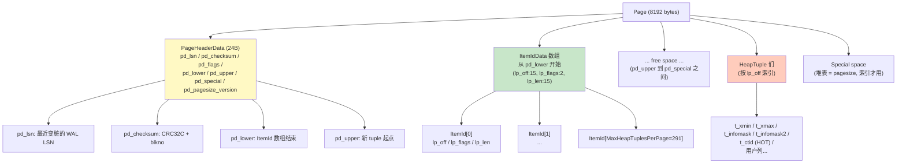
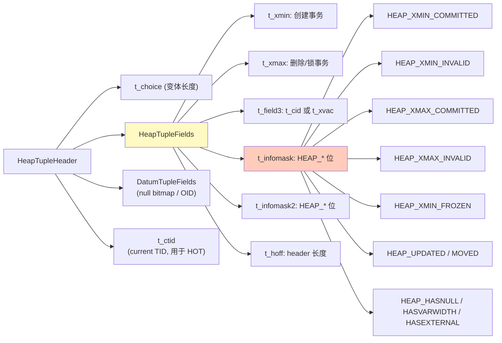
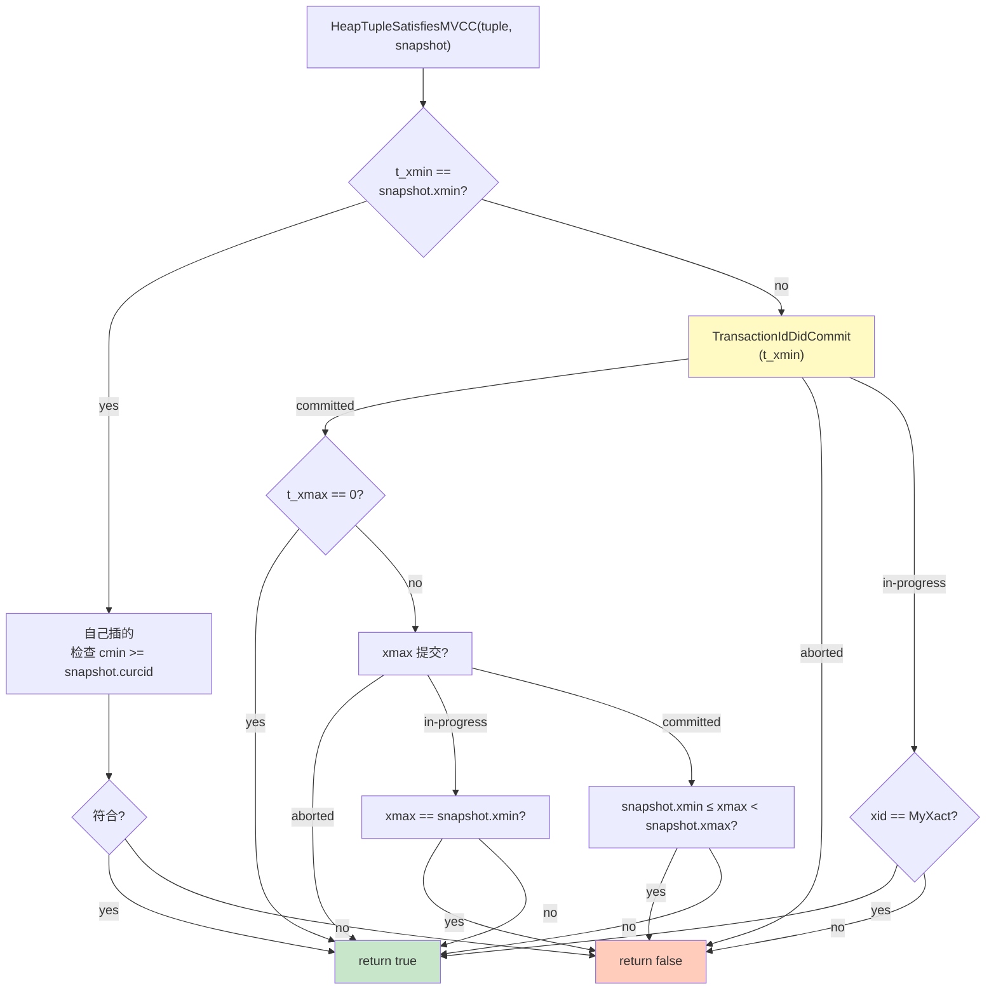
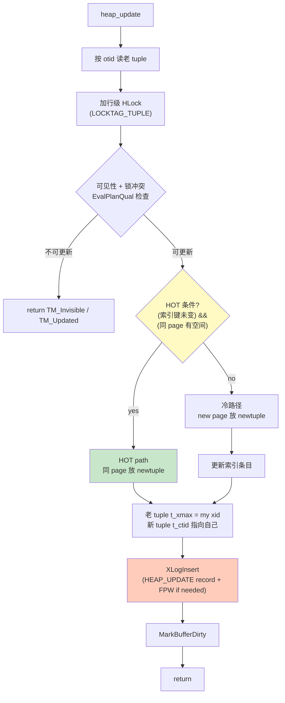
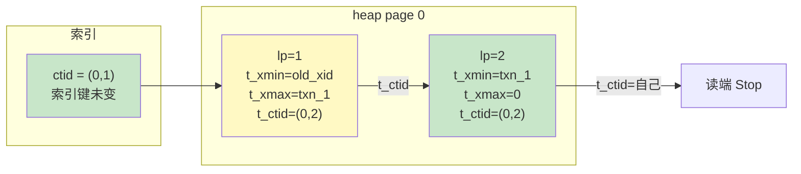
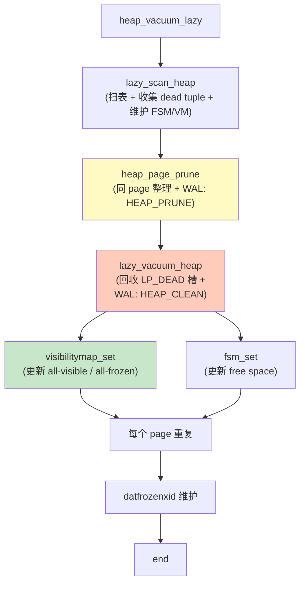

# 06 堆表与 MVCC

> 目标：理解 PostgreSQL 堆表的页面布局、HeapTuple 结构、xmin/xmax/cmin/cmax 语义、HOT 链、pruning、vacuumlazy。**这是 PG 与 MySQL InnoDB 在工程上最大的差异点**。

## 6.1 页面布局

```
Page (8KB)
+-----------------------------------+
| PageHeaderData (24 bytes)         |  ← pd_lsn, pd_checksum, pd_flags, pd_lower, pd_upper, pd_special
+-----------------------------------+
| ItemIdData 数组 (lp_off, lp_flags)|  ← 最多 MaxHeapTuplesPerPage (~291) 个
+-----------------------------------+
| ... free space ...               |
+-----------------------------------+
| HeapTuple 们（lp_off 指向）| ← 实际数据
|-----------------------------------+
| Special space (索引专用)          |  ← 堆表这里没用
+-----------------------------------+
```

```c
// src/include/storage/bufpage.h
typedef struct PageHeaderData {
    XLogRecPtr  pd_lsn;       // 页面最近一次变更的 WAL LSN
    uint16      pd_checksum;
    uint16      pd_flags;
    LocationIndex pd_lower;   // ItemId 数组结束（start of free space）
    LocationIndex pd_upper;   // 新 tuple 开始位置
    LocationIndex pd_special; // special 区开始（堆表 = pagesize）
    ...
} PageHeaderData;

typedef struct ItemIdData {
    unsigned    lp_off:15,    // 指向 HeapTuple 起始
                lp_flags:2,   // LP_NORMAL=1 / LP_REDIRECT=2 / LP_DEAD=3
                lp_len:15;
} ItemIdData;
```

## 6.2 HeapTuple 与 HeapTupleHeader

```c
// src/include/access/htup_details.h
typedef struct HeapTuple {
    HeapTupleHeader t_data;   // 指向页内
    Oid             t_tableOid;
    ItemPointerData t_self;   // (block, offnum)
    int             t_len;
} HeapTuple;

typedef struct HeapTupleHeaderData {
    t_choice        t_choice; // 长度变体标记
    HeapTupleFields t_heap;
    DatumTupleFields t_data;
} HeapTupleHeaderData;

typedef struct HeapTupleFields {
    TransactionId t_xmin;       // 插入此 tuple 的 xid
    TransactionId t_xmax;       // 删除/更新此 tuple 的 xid（0 = 仍在）
    CommandId     t_field3;     // t_cid (insert cmin) | t_xvac (vacuum)
    TransactionId t_choice;     // heap movable / frozen / xmin/xmax 元信息
} HeapTupleFields;
```

`t_xmin` 是 **创建事务**，`t_xmax` 是 **删除/锁事务**。当 `t_xmax != 0` 且对应事务未提交时，tuple 还在；提交后才真正“死掉”。

## 6.3 可见性判断

`src/backend/access/heap/heapam_visibility.c:HeapTupleSatisfiesMVCC()` 是核心：

```c
bool HeapTupleSatisfiesMVCC(HeapTuple tuple, Snapshot snapshot,
                             Buffer buffer)
{
    HeapTupleHeader tup = tuple->t_data;
    
    if (tup->t_xmin == snapshot->xmin)
        ...  // 自己插的
    
    if (!TransactionIdDidCommit(tup->t_xmin))
        return false;  // xmin 未提交 → 不可见
    
    if (TransactionIdDidCommit(tup->t_xmax))
        // xmax 已提交 → 这条 tuple 对当前快照不可见
        return !(((snapshot)->xmin <= tup->t_xmax) &&
                 (tup->t_xmax < snapshot->xmax));
    
    if (tup->t_xmax == snapshot->xmin)
        return false;  // 自己删的
    
    // xmax 未提交 → tuple 仍可见
    return true;
}
```

注：这是简化版，PG 17+ 区分了 `HeapTupleSatisfiesMVCC` 与 `HeapTupleIsVisible`，后者多走快照队列。

### 6.3.1 clog

判断一个事务是否提交，不是查 catalog，而是查 `clog`（commit log）。

- `clog` 在 `src/backend/access/transam/clog.c`
- 是 SLRU（simple LRU），驻在 shmem
- 每个事务占 2 bit：`COMMITED/ABORTED/IN_PROGRESS/SUB_COMMITTED`
- API：`TransactionIdDidCommit(xid)`

### 6.3.2 subtrans

嵌套子事务时，clog 只记录最外层 xid 的提交状态。子事务提交状态存在 `pg_subtrans`（其实是 SLRU 化的子结构）。

## 6.4 Hint bits

tuple header 上的 hint bit 是性能优化：
- `HEAP_XMIN_COMMITTED`
- `HEAP_XMAX_COMMITTED`
- `HEAP_XMIN_INVALID`
- `HEAP_XMAX_INVALID`

设置时机：读取 tuple 时，第一次发现 clog 已记录，就把对应 hint bit 写入 tuple header。下次直接读 hint bit，避免再查 clog。

```c
// heapam_visibility.c
if (TransactionIdDidCommit(tup->t_xmin)) {
    tup->t_infomask |= HEAP_XMIN_COMMITTED;
    SetHintBits(tup, buffer, HEAP_XMIN_COMMITTED, ...);
}
```

**关键**：写 hint bit 会让 tuple 变脏。极端场景下，hint bit 写入可以占整体 dirty page 的 80%，是 IO 放大源。

## 6.5 插入 / 更新 / 删除

### 6.5.1 heap_insert

```c
Oid heap_insert(Relation relation, HeapTuple tup, CommandId cid,
                int options, BulkInsertState bistate)
{
    // 1. 选 page（优先 freespace map）
    // 2. PinBuffer + BUFFER_LOCK_EXCLUSIVE
    // 3. RelationPutHeapTuple(relation, buffer, tup)
    // 4. XLogInsert(HEAP_INSERT record)
    // 5. MarkBufferDirty(buf)
    // 6. UnlockBuffer / Unpin
}
```

### 6.5.2 heap_update

```c
TM_Result heap_update(Relation relation, ItemPointer otid, HeapTuple newtup,
                      CommandId cid, Snapshot crosscheck, bool wait,
                      TM_FailureData *tmfd, bool *old_tuple_was_heap)
{
    // 1. 按 otid 找老 tuple，验证当前事务能 UPDATE
    // 2. 锁相关行（行级锁）
    // 3. HOT 判断：若新 tuple 与老 tuple 索引键不变 → 走 HOT
    // 4. 决定老 tuple 处置方式（标记 deleted 或迁移）
    // 5. 在新 page（可能相同 / 不同）放 newtup
    // 6. 写 WAL: HEAP_UPDATE
    // 7. 处理 ctid 链
}
```

要点：
- **PG 的 UPDATE 不 in-place**：老 tuple 的 `t_xmax` 设为当前 xid，新 tuple 写入（同一 page 或新 page），两者通过 ctid 链串联。
- 索引条目指向 ctid；如果索引键变了，需要新加索引条目。

### 6.5.3 heap_delete

```c
TM_Result heap_delete(...)
{
    // 找 tuple，置 t_xmax = current xid
    // 写 WAL: HEAP_DELETE
    // 写 hint bit
}
```

## 6.6 HOT（Heap-Only Tuples）

PG 8.3+ 的核心优化。规则：
- 新 tuple 与老 tuple 都在 **同一页**
- 新 tuple 的索引键未变化

HOT 时不更新索引（索引 ctid 仍指老 tuple），而是通过 tuple header 中的 `t_ctid` 形成链。读端按 ctid 走，能跳过老 tuple。

```c
// heapam.c:heap_update
if (HeapTupleIsHeapOnly(newtup) || ...)
    // HOT path: same page, no index update
```

HOT 收益：减少索引更新量；代价：链过长影响读。`VACUUM` 后回收老 tuple。

## 6.7 Pruning（页面内清理）

页面内死的 tuple 不立即清除（vacuumlazy 才回收），但通过 pruneheap **释放 ItemIdData 槽位**，让出空间给新插入。

`src/backend/access/heap/pruneheap.c:heap_page_prune_opt`：

```c
void heap_page_prune_opt(Relation relation, Buffer buffer)
{
    // 1. 拿 EXCLUSIVE lock
    // 2. 遍历 ItemId，找 LP_DEAD / LP_REDIRECT
    // 3. 重排 HeapTuple，把死 tuple 的字节空出来（用 PageRepairFragmentation）
    // 4. 写 WAL: HEAP_PRUNE
}
```

触发时机：
- `SELECT` 看到 LP_DEAD 项过多时
- `UPDATE/INSERT` 时若 freespace map 显示不足

## 6.8 VACUUM

`src/backend/access/heap/vacuumlazy.c:heap_vacuum_lazy()`。

```c
void heap_vacuum_lazy(Relation rel, VacuumParams *params,
                      BufferAccessStrategy bstrategy)
{
    // 1. 收集 dead tuple: lazy_scan_heap
    // 2. 对每个 page：
    //    - LP_DEAD 项回收
    //    - 旧 xmin 清零 → frozen
    //    - FSM 更新空闲空间
    //    - VM 更新 all-visible
    // 3. 维护 pg_database.datfrozenxid
}
```

要点：
- **frozen**：`t_infomask |= HEAP_XMIN_FROZEN`，相当于 xmin = 0，跳过 clog 查询。
- **VM (visibility map)**：每个 page 一个 bit，标记“所有 tuple 都对所有活跃事务可见”，让 index-only scan 不必回 heap 验。
- **FSM**：记录 page 剩余空间，insert 时优先挑。
- **aggressive vacuum**：手动 `VACUUM FREEZE` 时强制全表扫描并冻结老 tuple。

## 6.9 Autovacuum

`src/backend/postmaster/autovacuum.c`：
- launcher 进程周期性 `SELECT * FROM pg_class WHERE reloptions ...` 找需要 vacuum 的表
- 计算公式：`n_dead_tup > threshold + scale_factor * n_live_tup`
- fork worker 执行实际 vacuum

关键 GUC：
- `autovacuum_vacuum_threshold` / `autovacuum_vacuum_scale_factor`
- `autovacuum_naptime`
- `autovacuum_max_workers`

## 6.10 实战

### 6.10.1 pageinspect 查页面

```sql
postgres=# CREATE EXTENSION pageinspect;
postgres=# CREATE TABLE t (id int, v text);
postgres=# INSERT INTO t VALUES (1, 'a'), (2, 'b'), (3, 'c');

-- 看 page 0 头部
postgres=# SELECT * FROM page_header(get_raw_page('t', 0));
postgres=# SELECT lp, lp_off, lp_flags, lp_len, t_xmin, t_xmax, t_data
           FROM heap_page_items(get_raw_page('t', 0));
```

### 6.10.2 看 HOT 链

```sql
postgres=# UPDATE t SET v = 'a2' WHERE id = 1;
postgres=# SELECT lp, lp_off, lp_len, t_xmin, t_xmax, t_ctid
           FROM heap_page_items(get_raw_page('t', 0));

-- 老 tuple (lp=1) t_xmax = 当前 xid, t_ctid = (0,2)
-- 新 tuple (lp=2) t_xmin = 当前 xid, t_xmax = 0
```

### 6.10.3 看 xmin/xmax 与 clog

```sql
postgres=# SELECT pg_xact_status(t_xmin::text::xid), t_xmin,
                  pg_xact_status(t_xmax::text::xid), t_xmax
           FROM heap_page_items(get_raw_page('t', 0));
```

### 6.10.4 手动 freeze

```sql
postgres=# VACUUM (FREEZE, VERBOSE) t;
```

`VERBOSE` 会输出每个 page 的 prune、dead、frozen 数量。

### 6.10.5 GDB 跟踪

```bash
(gdb) b heapam.c:heap_insert
(gdb) b heapam.c:heap_update
(gdb) b heapam.c:heap_delete
(gdb) b heapam_visibility.c:HeapTupleSatisfiesMVCC
(gdb) b pruneheap.c:heap_page_prune_opt
(gdb) c
```

任意 UPDATE，会依次停在各点。注意 `p tup->t_data->t_xmin/xmax/cmin/cmax` 看 hint bit 变化。

## 6.11 与 InnoDB 对照（重要）

| 维度 | PostgreSQL Heap | InnoDB |
| --- | --- | --- |
| 锁模型 | 锁单 tuple（xmax） | row lock |
| undo log | 没有，tuple 链 + ctid | 有专门的 undo log |
| UPDATE 行为 | 写新 tuple + 老 tuple t_xmax 标记 | 写 undo log，原地改 |
| 索引更新 | 仅在索引键变化时 | 几乎总是更新（二级索引指向 PK） |
| 历史回溯 | 不支持（除非 logical decoding） | 支持（MVCC 链 + undo） |
| 防 torn write | 无 double-write，依赖 checksum | 有 doublewrite buffer |
| 快照隔离 | snapshot 由快照创建时 clog 状态决定 | 由 undo log + read view 决定 |

读 PG 源码时，**时刻记住**：没有 undo log。所有“历史”信息都在 tuple 链里。所以 PG 的 VACUUM 实际上是 InnoDB 的 “purge”——回收老版本 + 维护 undo。

## 6.12 小结

- 堆表页面 = PageHeader + ItemId 数组 + HeapTuples + Special。
- MVCC 通过 `t_xmin / t_xmax` + clog + Snapshot 协作完成。
- HOT 让索引在小更新场景下免改。
- prune 复用页面空间；vacuumlazy 才彻底清理死 tuple。
- 与 InnoDB 最大的不同：没有 undo log，历史版本全在 heap page 内。

下一章 07 进入 B-Tree 索引——PG 的默认索引，也是最常被问到“它到底怎么实现的”话题。

## 6.13 进阶：TOAST 大对象存储

### 6.13.1 TOAST 的目的

PG page size 默认 8KB。如果一行数据 > 2KB（`TOAST_TUPLE_THRESHOLD`），会自动触发 TOAST（The Oversized-Attribute Storage Technique）。

### 6.13.2 TOAST 策略

```c
// src/backend/access/common/toast_internals.h
typedef enum ToastCompressionStrategy {
    TOAST_PGLZ_COMPRESSION,         // 内置 pglz
    TOAST_LZ4_COMPRESSION,         // lz4（PG 14+）
    TOAST_ZSTD_COMPRESSION         // zstd（PG 16+）
} ToastCompressionStrategy;
```

每列的 storage attribute：
- `PLAIN`：不允许 toast，inline 存
- `EXTENDED`：先压，再 external
- `EXTERNAL`：不压，external
- `MAIN`：优先 inline，超过阈值再 external（保持 inline 16KB 容量）

### 6.13.3 TOAST 表结构

```sql
-- 自动创建
CREATE TABLE bigdata (
    id int,
    content text
);
-- 自动建：
SELECT relname, reltoastrelid FROM pg_class WHERE relname='bigdata';
-- reltoastrelid: 一个独立的 toast 表
```

TOAST 表 schema：

```c
typedef struct {
    Oid     chunk_id;        // 大对象的 OID
    int32   chunk_seq;       // 块序号
    bytea   chunk_data;      // 块内容
} FormData_pg_toast_<chunk_id>;
```

### 6.13.4 读写路径

```c
// src/backend/access/heap/heaptoast.c
HeapTuple toast_insert_or_update(Relation rel, HeapTuple tup, ...);

// 读时
struct varlena *heap_tuple_untoast_attr(struct varlena *attr);
```

读一条带 TOAST 的行：
1. 先读主表，得到一个 toast pointer（指向 chunk_id + 起始位置）
2. 调 `pg_toast_*` 读 chunk table，合并
3. （可选）解压

### 6.13.5 TOAST 索引

```sql
-- toast 表也有索引
SELECT relname FROM pg_class WHERE relname LIKE 'pg_toast_%_index';
```

索引是 `chunk_id, chunk_seq` 上的 btree。读时顺序扫这一组合。

## 6.14 进阶：heap tuple 的 hint bits 完整语义

### 6.14.1 完整位定义

```c
// src/include/access/htup_details.h
#define HEAP_HASNULL         0x0001  // tuple 有 NULL
#define HEAP_HASVARWIDTH     0x0002  // 有变长字段
#define HEAP_HASEXTERNAL     0x0004  // 有 toast pointer
#define HEAP_HASOID_OLD      0x0008  // （已不用）
#define HEAP_XMAX_IS_MULTI   0x0010  // t_xmax 是 multixact
#define HEAP_UPDATED         0x0040  // 已被 update (invisible bit?)
#define HEAP_MOVED_OFF       0x0080
#define HEAP_MOVED_IN        0x0100

// Hint bits
#define HEAP_XMIN_COMMITTED  0x0100  // xmin 已 commit
#define HEAP_XMIN_INVALID    0x0200  // xmin 已 abort
#define HEAP_XMAX_COMMITTED  0x0400  // xmax 已 commit
#define HEAP_XMAX_INVALID    0x0800  // xmax 已 abort

// Frozen
#define HEAP_XMIN_FROZEN     (HEAP_XMIN_INVALID | HEAP_XMIN_COMMITTED)
// 表示 xmin 在所有活跃事务之前 → 视为 INVALID（=0）
```

### 6.14.2 Hint bits 写入时机

1. **读时 lazy**：第一次检查可见性时，查 clog，发现结果后写入 hint bit
2. **写时 eager**：`heap_update` / `heap_delete` 时如果发现 clog 已 commit，直接写 hint bit
3. **vacuum eager**：vacuum 时批量更新 hint bit

```c
// src/backend/access/heap/heapam_visibility.c
static inline void
SetHintBits(HeapTupleHeader tuple, Buffer buffer, uint16 infomask,
            TransactionId xid)
{
    // 拿 EXCLUSIVE lock（如果是 share 会升 lock）
    LockBuffer(buffer, BUFFER_LOCK_EXCLUSIVE);
    tuple->t_infomask |= infomask;
    MarkBufferDirtyHint(buffer, true);
    LockBuffer(buffer, BUFFER_LOCK_UNLOCK);
}
```

**性能影响**：读时写 hint bit 可能让 80%+ page 变 dirty，导致大量 IO。PG 18 用 WAL 减少冗余（hint bit 写入不计 WAL，因为不需要 redo）。

## 6.15 进阶：lazy vacuum 完整流程

### 6.15.1 入口

`src/backend/access/heap/vacuumlazy.c:heap_vacuum_lazy()`：

```c
void heap_vacuum_lazy(Relation rel, VacuumParams *params,
                      BufferAccessStrategy bstrategy)
{
    // 1. 选择 candidate pages（all-visible map 标记的跳过）
    
    // 2. for each candidate page:
    //    a) lazy_scan_heap → heap_prune_page
    //    b) lazy_vacuum_heap → 物理清理 LP_DEAD ItemId
    //    c) 检查 all-visible / all-frozen 标记
    
    // 3. 维护 pg_database.datfrozenxid
    
    // 4. 更新 FSM / VM
}
```

### 6.15.2 heap_prune_page 详解

```c
void heap_page_prune(Relation rel, Buffer buffer, OldestXmin oldestxmin,
                     bool report_stats, bool allow_lock_wait)
{
    // 1. 拿 EXCLUSIVE lock
    
    // 2. 遍历 ItemId：
    //    - LP_REDIRECT → 检查是否需要重定向或删除
    //    - LP_DEAD → 标记 dead
    //    - LP_NORMAL → 检查 t_xmax：
    //      * xmax 是 FrozenXid 之前 → 可回收
    //      * xmax 提交且早于 oldestxmin → 可回收
    //      * xmax 提交但晚于 oldestxmin → 保留（hot standby 用）
    
    // 3. PageRepairFragmentation：把 alive tuple 移到 page 头部，释放尾部
    
    // 4. 写 XLOG_HEAP_PRUNE
    
    // 5. 解锁
}
```

### 6.15.3 lazy_vacuum_heap

```c
static void lazy_vacuum_heap(Relation rel, LVPageStats *vacrelstats)
{
    // 1. 收集 dead ItemId 列表
    
    // 2. 逐个 PageIndexTupleDelete
    
    // 3. 写 XLOG_HEAP_CLEAN
    
    // 4. 更新 FSM（剩余空间）
    
    // 5. 更新 VM（all-visible / all-frozen）
}
```

### 6.15.4 aggressive vacuum

```sql
VACUUM (FREEZE, VERBOSE) t;
```

强制冻结：
- 把所有 tuple 的 t_infomask 写 `HEAP_XMIN_FROZEN`
- 跳过 vm 优化（重写所有 page）
- 用于表被大量 UPDATE 时

### 6.15.5 anti-wraparound vacuum

```sql
postgres=# SELECT relname, age(relfrozenxid) FROM pg_class
           WHERE relkind='r' ORDER BY 2 DESC LIMIT 5;
```

`autovacuum_freeze_max_age`：到 200M transactions 强制 vacuum。

`pg_database.datfrozenxid` 全实例最老的 relfrozenxid。

## 6.16 进阶：snapshot 实现细节

### 6.16.1 GetSnapshotData

`src/backend/storage/ipc/procarray.c:GetSnapshotData()`：

```c
Snapshot GetSnapshotData(Snapshot snapshot)
{
    // 1. 拿 ProcArrayLock (shared)
    
    // 2. 计算 xmax：
    //    xmax = XidFromFullTransactionId(ShmemVariableCache->nextXid)
    
    // 3. 收集 active xids：
    //    遍历 ProcArray，把不在 MyProc 之前的 xid 加入
    
    // 4. 计算 xmin = 数组中最小 xid
    
    // 5. curcid = MyCmdId
    
    // 6. 释放 ProcArrayLock
    
    return snapshot;
}
```

### 6.16.2 PG 17 快照优化

PG 17+ 把快照信息存到 `ProcArrayLock` 上的 `procArrayGroupNext`，减少 lock 持有时间。

### 6.16.3 Hot Standby 快照

recovery 模式下也需要快照：
- replay 时把每个事务的 xid → snapshot xmin
- standby 的查询拿这个 xmin
- `hot_standby_feedback` 让 primary 知道 standby 看到的最老 xid

## 6.17 进阶：READ COMMITTED 的特殊语义

### 6.17.1 EvalPlanQual (EPQ)

在 `READ COMMITTED` 下：
- UPDATE 遇到 row 已被另一个并发事务修改过
- 不能直接等（可能在另一边未提交）
- 走 EPQ：用更新后的值重试

```c
// src/backend/executor/execMain.c
// EPQ 处理：
// 1. 锁当前 tuple
// 2. 重新评估 query qual
// 3. 如果符合 → 重新评估 SET 子句
// 4. 如果不符合 → 跳过
```

### 6.17.2 READ COMMITTED vs REPEATABLE READ

```c
// executor
estate->es_snapshot = GetSnapshotData(snapshot);
// READ COMMITTED: 每条 query 重新取 snapshot
// REPEATABLE READ: 事务第一个 query 时取一次
```

## 6.18 进阶：visibilitymap 算法

### 6.18.1 数据结构

`src/backend/access/heap/visibilitymap.c`：

```c
typedef struct {
    bits8    data[VI_BLOCKMAP_SIZE];  // 每 page 一位
} VisibilityMap;

#define VI_BLOCKMAP_SIZE (BLCKSZ / 2)  // 4096 bit per page
```

每个 visibility map page 覆盖 32768 个 heap page（32K）。

### 6.18.2 三种状态

每 page 有 3 个位：
- `VISIBILITYMAP_ALL_VISIBLE`：所有 tuple 对所有活跃事务可见 → index-only scan 可用
- `VISIBILITYMAP_ALL_FROZEN`：所有 tuple 的 xmin < frozenXid
- `VISIBILITYMAP_HAS_DEAD_TUPLES`（PG 17+）：有死 tuple 需要 prune

### 6.18.3 visibilitymap_get_status

```c
bool visibilitymap_get_status(Relation rel, BlockNumber blkno, uint8 flags)
{
    // 1. 计算 vm 的 block
    Buffer mapBuf = vm_readbuffer(rel, blkno, false);
    Page page = BufferGetPage(mapBuf);
    
    // 2. 计算 bit 位置
    int mapByte = ...;
    int mapBit = ...;
    
    // 3. 读 bit
    uint8 status = page[mapByte] & (1 << mapBit);
    
    // 4. 释放 pin
    ReleaseBuffer(mapBuf);
    return (status & flags) == flags;
}
```

### 6.18.4 visibilitymap_set

```c
void visibilitymap_set(Relation rel, BlockNumber blkno,
                       Buffer heapBuf, XLogRecPtr recptr,
                       uint8 flags, TransactionId cutoffs[], int ncutoffs)
{
    // 1. 拿到 vm block（pin + share lock）
    
    // 2. 算位置
    
    // 3. 设置 bit
    
    // 4. 写 WAL：XLOG_HEAP_VISIBLE
    
    // 5. 解锁 + unpin
}
```

## 6.19 进阶：free space map (FSM)

### 6.19.1 数据结构

`src/backend/storage/freespace/freespace.c`：

每个 FSM page 跟踪一个 heap page 的剩余空间：

```c
typedef struct {
    uint8 space[BLCKSZ];   // 每 byte 表示一定范围的剩余空间
} FSMAddress;
```

### 6.19.2 等级 0-255

```c
// level 0 = 0 - 7 bytes
// level 255 = full page
```

插入时：
```c
void RecordAndGetPageWithFreeSpace(Relation rel, BlockNumber oldPage,
                                    Size spaceNeeded)
{
    // 1. 找到最接近的 level
    int target_level = fsm_set_category(spaceNeeded, ...);
    
    // 2. 在 FSM 中标为这个 level
    
    // 3. 找到有足够空间的 page
}
```

### 6.19.3 插入时的顺序

```c
// heap_insert
for (int ntries = 0; ntries < max_pages; ntries++) {
    BlockNumber blk = fsm_search(rel, target_level);
    if (blk == InvalidBlockNumber) break;
    
    // 试插入
    Buffer buf = ReadBuffer(rel, blk);
    LockBuffer(buf, BUFFER_LOCK_EXCLUSIVE);
    
    int nfree = PageGetHeapFreeSpace(page);
    if (nfree >= tup_len) {
        RelationPutHeapTuple(rel, buf, tup);
        // success
    }
    
    UnlockBuffer(buf);
    ReleaseBuffer(buf);
}
```

如果都失败，最后走 relation extension。

## 6.20 进阶：catalog 表的 MVCC 行为

PG 的 catalog 表（pg_class / pg_attribute / ...）也是普通 heap 表，**有同样的 MVCC 行为**。

```sql
postgres=# SELECT relname FROM pg_class WHERE relname LIKE '%toast%';
```

每条 DDL：
1. 修改 catalog 表
2. 写 WAL（HEAP_UPDATE 等）
3. Cache invalidation（让其他 backend 重新加载）

```c
// src/backend/utils/cache/inval.c
CacheInvalidateRelcache(Relation rel);  // 广播
```

这让 PG 的 catalog 修改是事务性的。

### 6.20.1 一致性问题

```
backend A: 启动事务 → 读 pg_class
backend B: ALTER TABLE → 改 pg_class
backend A: 再次读 → 是否能看到新 schema？
```

PG 的方案：
- READ COMMITTED：每条 query 重新走 syscache（看是否 invalidation）
- REPEATABLE READ：cache 整个事务不会失效，**但 ALTER TABLE 提交时发 invalidation 消息**

实际效果：READ COMMITTED 下能很快看到新 schema，REPEATABLE READ 下也是。

## 6.21 进阶：HIO / 高并发插入

`src/backend/access/heap/hio.c` 处理 high-concurrency insert：

```c
// heap_insert → hio.c
Buffer RelationGetBufferForTuple(Relation relation, Size len,
                                  Buffer otherBuffer, int options,
                                  BulkInsertState bistate)
{
    // 1. 选择 target block：
    //    - 检查 FSM
    //    - 检查 all-visible flag
    
    // 2. 如果 pages 都满：
    //    - extend 一页
    //    - 或竞争 existing page（并发扩展）
    
    // 3. 返回 Buffer
}
```

### 6.21.1 并发扩展

PG 18+ 支持 concurrent relation extension：
- 多个 backend 同时调 extend 时不竞争
- 各自 extend 不同的 page

`src/backend/storage/smgr/bulk_write.c` 是 AIO 时代的核心。

## 6.22 小结

- TOAST 用 chunk table + 压缩存放大对象。
- Hint bit 通过 lazy write 减少 clog 查询；脏 page 比例高是主要 IO 源。
- Lazy vacuum 包含 prune + clean；aggressive vacuum 用于冻结。
- Snapshot = xmin/xmax/active xids；PG 17 优化 lock 持有。
- READ COMMITTED 走 EPQ 重新评估，更灵活但可能 retry 多次。
- visibilitymap + FSM 都依赖 WAL 持久化。
- Catalog 表本身也是 heap 表，DDL 走普通 WAL + invalidation 协议。

下一节给 07 章补 B-Tree 索引的进阶深度。


## 6.23 图示

### 6.23.1 Heap Page 字节级布局



### 6.23.2 HeapTupleHeader 字段语义



### 6.23.3 MVCC 可见性判定流



### 6.23.4 UPDATE 流程（含 HOT 判断）



### 6.23.5 HOT 链结构



### 6.23.6 Lazy Vacuum 工作流



> 图示配套源码：`src/include/storage/bufpage.h`、`src/include/access/htup_details.h`、`src/backend/access/heap/{heapam.c,heapam_visibility.c,heapam_xlog.c,hio.c,pruneheap.c,vacuumlazy.c,visibilitymap.c,heaptoast.c,rewriteheap.c}`。
