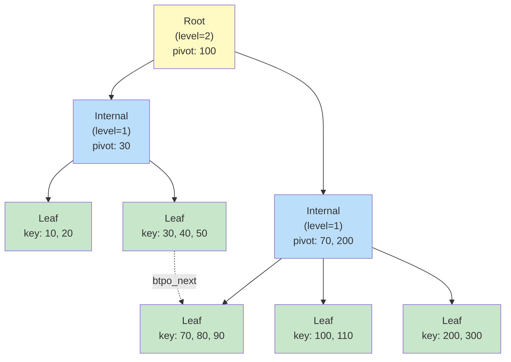
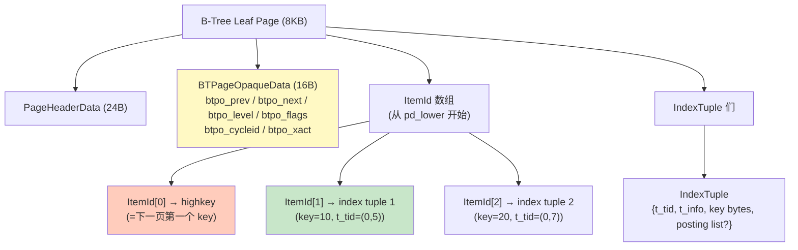
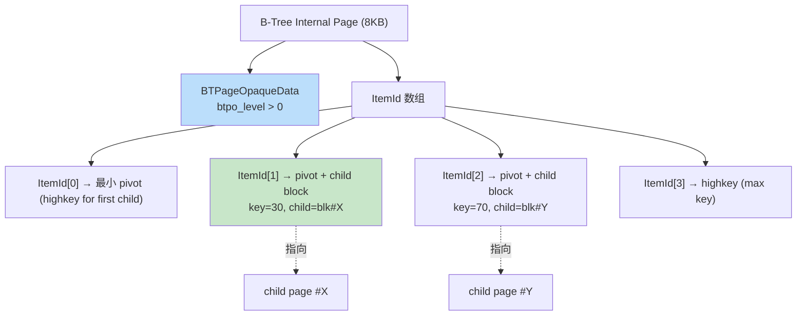
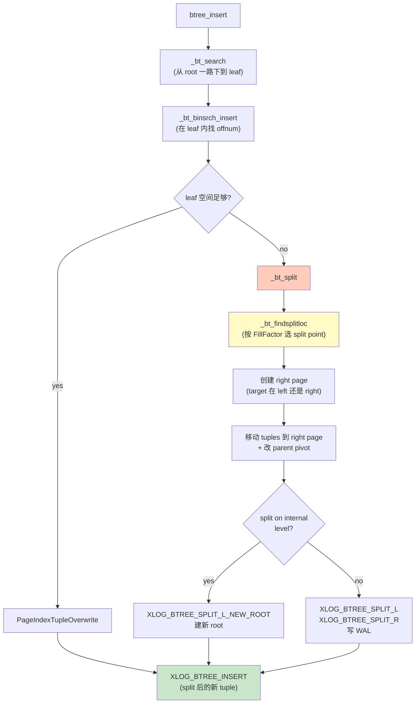
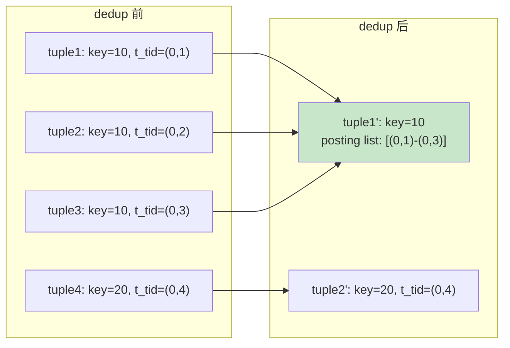
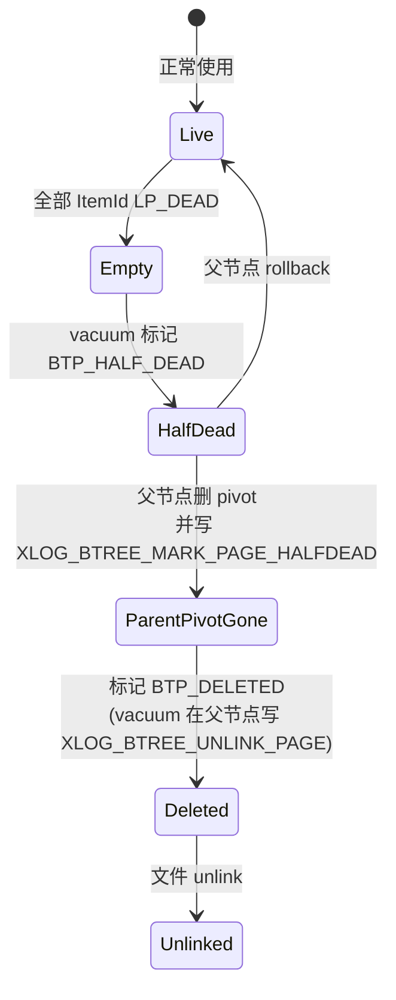

# 07 B-Tree 索引

> 目标：从页面布局到搜索 / 插入 / 分裂 / 删除 / WAL 全流程吃透 PG 的 B-Tree 实现。PG 13+ 引入的 **deduplication** 是重点。

## 7.1 为什么先讲 B-Tree

- 默认索引（`CREATE INDEX` 不写 `USING` 即 btree）
- 唯一索引、主键、外键几乎都走 btree
- 它的实现是 PG 中 **最工程化、最复杂、最有学习价值** 的 access method

## 7.2 总体流程

```
客户端: CREATE INDEX t_idx ON t(id);
                │
                ▼
   index.c:index_build → btbuild (→ tuplesort → btbuildcallback)
                │
   之后运行: SELECT ... WHERE id = 1
                │
                ▼
   nbtree/nbtree.c:btgettuple → btbeginscan → _bt_first → _bt_search
                │
                ▼
   命中 → IndexScanState → heap
```

## 7.3 关键数据结构

### 7.3.1 BTPageOpaqueData

```c
// src/include/access/nbtree.h
typedef struct BTPageOpaqueData {
    BlockNumber btpo_prev;          // 左兄弟
    BlockNumber btpo_next;          // 右兄弟
    uint32      btpo_level;         // 0 = leaf, >0 = internal
    uint16      btpo_flags;         // BTP_LEAF / BTP_ROOT / BTP_DELETED / BTP_HALF_DEAD / BTP_SPLIT_END / BTP_INCOMPLETE_SPLIT
    uint16      btpo_cycleid;       // VACUUM 用，标记扫描过
    TransactionId btpo_xact;        // 当前 page 持有事务（split 时清空时记）
    ...
} BTPageOpaqueData;
```

页面通用部分：
```
BTPageOpaqueData 紧跟 PageHeader（special 指向这里）
+ ItemId 数组
+ IndexTuple 们（按 key 升序）
+ (leaf) 链表：可能跟随 highkey
```

### 7.3.2 IndexTuple

```c
typedef struct IndexTupleData {
    ItemPointerData t_tid;     // (block, offnum) → heap tuple
    unsigned        t_info;    // size 信息
    IndexAttributeBitMapData t_bm;
    // 紧接着是 index key 字节流
} IndexTupleData;
```

PG 的 IndexTuple 是 **按需长度**，根据 key 个数和大小决定。`INDEXTUPLE_SIZE` / `index_deform_tuple` 负责序列化与反序列化。

### 7.3.3 IndexScanDesc

```c
typedef struct IndexScanDescData {
    Relation     indexRelation;
    Relation     heapRelation;
    ...
    BTScanOpaque opaque;        // nbtree 私有
} IndexScanDescData;
```

`BTScanOpaque` 保存扫描的当前 page、当前 position、mark position 等。

## 7.4 页面布局详解（leaf vs internal）

### 7.4.1 Leaf 页面

```
+-----------------------------------+
| PageHeaderData (24B)            |
+-----------------------------------+
| BTPageOpaqueData (16B)           |
+-----------------------------------+
| ItemId 1 → highkey (optional)    |
| ItemId 2 → index tuple 1         |
| ItemId 3 → index tuple 2         |
| ...                              |
+-----------------------------------+
```

- leaf 页的最后一个 tuple 总是 `highkey`，等于“下一页的第一个 key”。
- 内部 page 没有 highkey，而是用 key-as-pivot。

### 7.4.2 Internal 页面

```
+-----------------------------------+
| PageHeaderData                    |
+-----------------------------------+
| BTPageOpaqueData                  |
+-----------------------------------+
| ItemId 1 → key(-∞)               |  // 最小的 pivot
| ItemId 2 → key + child 0      |
| ItemId 3 → key + child 1      |
| ...                              |
+-----------------------------------+
```

每个 internal tuple 由两部分组成：pivot key + child block number。

### 7.4.3 PageInit vs _bt_pageinit

`_bt_pageinit(page, size)` 初始化一个 page 为空 B-Tree 页（设置 btpo_level、special 偏移等）。**注意**：B-Tree 页的 special 区不是空，btpo 占用。

## 7.5 搜索

`src/backend/access/nbtree/nbtsearch.c:_bt_search()`：

```c
BTStack _bt_search(Relation rel, BTScanInsert itup_in_page, Buffer *bufp,
                   bool firstPage)
{
    page = BufferGetPage(*bufp);
    opaque = BTPageGetOpaque(page);
    
    // 1. 在当前 page 上二分
    //    ScanDirection 是 Forward
    //    比较函数来自 relation->rd_indcollation
    off = _bt_binsrch(rel, page, itup_in_page->scankey);
    
    // 2. 如果 off 在 opaque->btpo_level == 0 (leaf)，返回
    // 3. 否则 ItemId 指向 internal tuple：
    //    child = (ItemPointerGetBlockNumber(&itup->t_tid));
    //    _bt_relandgetbuf → child page，递归
}
```

`_bt_binsrch` 是标准二分，但 **带 binary-search-friendly key 压缩**（PG 13+ 的 prefix/suffix dedup 让压缩更高效）。

## 7.6 唯一索引 vs 非唯一索引

- 唯一索引：在插入时多一次冲突检查。
- 非唯一索引：t_tid（行指针）也参与索引排序，所以同一 key 不同行也能区分。

## 7.7 插入

`src/backend/access/nbtree/nbtinsert.c:_bt_insert()` 主入口。

```c
InsertIndexResult _bt_insert(Relation rel, IndexTuple itup, ...)
{
    // 1. 找目标 leaf page（_bt_search）
    // 2. 在 leaf 上找位置（_bt_binsrch_insert）
    // 3. 如有空闲空间 → 插入（PageIndexTupleOverwrite 或 index_form_tuple）
    // 4. 否则 → _bt_split 触发分裂
}
```

### 7.7.1 WAL 写

B-Tree 插入会写 **一条 XLOG_BTREE_INSERT**：
```c
xl_btree_insert xlrec;
xlrec.offnum = ...;
XLogRegisterBuffer(0, buf, REGBUF_WILL_INIT);
XLogRegisterData(...);
recptr = XLogInsert(RM_BTREE_ID, XLOG_BTREE_INSERT);
PageSetLSN(page, recptr);
```

崩溃恢复时 redo 直接重放：把 tuple 写到指定 offnum。

### 7.7.2 dedup（PG 13+ 重要特性）

非唯一索引若多个 key 相同，每行都要存 key。dedup 把相同的 key 合并成一个 leaf tuple，后跟一个 **posting list**（tids 的差分数组）。

```c
// nbtinsert.c: _bt_dedup_pass -> _bt_dedup_save_extra
// posting list: [tid1, tid2, tid3, ...]
```

读端反向解：`postinglist.c:btintset`。

收益：
- 写：少 insert tuple，wins。
- 读：多一次 posting list 解码，但 cache 友好，多数情况收益更大。
- WAL：插入 posting list 也算 redo 的一部分。

## 7.8 分裂

`src/backend/access/nbtree/nbtinsert.c:_bt_split()` 是最长的一段代码。

### 7.8.1 三种分裂策略

1. **right-split**：新建 page，把后半部分移到新 page，原 page 留前半 + new highkey。
2. **left-split**：用新 page 存前半部分，原 page 留后半 + new highkey。
3. **new-root split**：内部节点分裂时新建 root。

### 7.8.2 split 分隔点选择（nbtsearch.c: _bt_findsplitloc）

PG 不用“中间点”，而是用 **目标 free space**：
```c
// 试图使 split 后两边 page 都至少有
// FillFactor * 8KB 字节的空位
```

### 7.8.3 WAL

分裂产生多条 WAL：
- XLOG_BTREE_SPLIT_L：左 page 初始化
- XLOG_BTREE_SPLIT_R：右 page 初始化
- XLOG_BTREE_SPLIT_L_NEW_ROOT：新建 root
- XLOG_BTREE_INSERT：当 split 时同步插入的新 entry

### 7.8.4 BTP_INCOMPLETE_SPLIT

如果 split 进行中 backend crash，会留下 `BTP_INCOMPLETE_SPLIT` 标记。redo 时由下一个 backend 触发 `BTPageGetOpaque` 检查并继续 split。

## 7.9 删除

`src/backend/access/nbtree/nbtpage.c:_bt_delitems_delete()`：

- leaf：把 ItemId 标记为 LP_DEAD，**不立即回收**（回收由 VACUUM 负责）。
- internal：标记后还要上溯更新 parent（如果 pivot 是删除的 key）。

### 7.9.1 BTP_HALF_DEAD / BTP_DELETED

PG 提供 **page delete** 优化：
1. leaf page 变空 → 标记 `BTP_HALF_DEAD`
2. 父节点删 pivot → 标记 `BTP_DELETED`
3. 文件上 unlink

`_bt_unlink_halfdead_page` 是 page delete 的入口，与 `VACUUM` 配合。

### 7.9.2 BTP_DELETED

被删除但还没 unlink 的 page。在遍历 B-Tree 时跳过。

## 7.10 VACUUM

`VACUUM` 会触发 **btree cleanup**：
- 标记 dead tuple → 移除
- 回收 half-dead page
- 清理父节点无用 pivot

入口：`nbtpage.c:_bt_vacuum_cycle()`。

## 7.11 Index-only scan

`vm` 标记 all-visible 的 page，index-only scan 不必回 heap 验可见性。要点：
- 走 visibilitymap，必要时回 heap 验证 hint bit 不一致。
- PG 13+ 引入了 `index-only scan with parallel workers`。

## 7.12 B-Tree 与 WAL

B-Tree 是 **操作型 WAL** 的代表：每次 insert/delete/split 都同步写 WAL。崩溃恢复时从 LSN 重放，按页面 LSN 与 redo record LSN 对比决定是否 apply。

注意：B-Tree 的 WAL 写很多（insert 一条可能 2-3 条 WAL），所以大量索引维护时 IO 放大明显。

## 7.13 实战

### 7.13.1 pageinspect 看索引页

```sql
postgres=# CREATE EXTENSION pageinspect;
postgres=# CREATE TABLE t (id int, v text);
postgres=# INSERT INTO t SELECT g, md5(g::text) FROM generate_series(1,1000) g;
postgres=# CREATE INDEX t_idx ON t(id);

postgres=# SELECT * FROM bt_metap('t_idx');
-- magic / version / root / level / fastroot / fastlevel / ...
```

```sql
postgres=# SELECT * FROM bt_page_stats('t_idx', 1);
-- blkno / type ('l' leaf / 'i' internal) / live_items / dead_items / avg_item_size / page_size / free_size / btpo_prev / btpo_next / btpo_level
```

```sql
postgres=# SELECT itemoffset, itempointer, itemlen, data
           FROM bt_page_items('t_idx', 1);
```

### 7.13.2 触发分裂

```sql
postgres=# CREATE TABLE b (id int);
postgres=# CREATE INDEX b_idx ON b(id);
postgres=# INSERT INTO b SELECT generate_series(1, 100000);
-- 看索引高度
postgres=# SELECT level FROM bt_metap('b_idx');
-- 看每个 leaf page 的项数
postgres=# SELECT blkno, type, live_items FROM bt_page_stats('b_idx', 1);
```

填满一张 leaf 后再 INSERT 会触发 split。可在 GDB 里停 `_bt_split`。

### 7.13.3 跟踪搜索

```bash
(gdb) b nbtree.c:btgettuple
(gdb) b nbtsearch.c:_bt_search
(gdb) b nbtsearch.c:_bt_binsrch
(gdb) c
```

任意 `SELECT * FROM t WHERE id = 999`，停在 btgettuple。看 `scankey` / `opaque->btpo_level` / 命中的 ItemId。

### 7.13.4 跟踪 dedup

```sql
postgres=# CREATE TABLE d (k int, v text);
postgres=# INSERT INTO d SELECT 1, g::text FROM generate_series(1,10000) g;
postgres=# CREATE INDEX d_idx ON d(k);
-- 大量 INSERT 后重启，dedup pass 会跑

postgres=# SELECT blkno, type, live_items, dead_items, avg_item_size
           FROM bt_page_stats('d_idx', 1);
-- live_items 远小于 10000，但页大小仍在 ~8KB
```

### 7.13.5 看 WAL

```bash
pg_xlogdump -p $PGDATA/pg_wal -s 0/2000000 -n 100 | grep -E "B-tree|BTREE"
```

找 `XLOG_BTREE_INSERT` / `XLOG_BTREE_SPLIT_*`。

## 7.14 与 InnoDB B-Tree 对照

| 维度 | PG B-Tree | InnoDB B-Tree |
| --- | --- | --- |
| Page size | 8KB 默认 | 16KB 默认 |
| Key sort | 按 B 升序 + 唯一约束时含 tid | 总是含 PK |
| Dedup | PG 13+ 支持 | 不需要（PK 唯一） |
| Page delete | BTP_HALF_DEAD / BTP_DELETED | 复用 space，不物理删除 |
| WAL | XLOG_BTREE_* 完整覆盖 | redo log 增量 |
| AIO | PG 18 起走 AIO 队列 | 已全 AIO |
| MVCC 联动 | 与 heap tuple ctid 紧密 | 与 cluster key 紧密 |

## 7.15 小结

- B-Tree 是 PG 默认索引，dedup 是 PG 13+ 后性能拐点。
- 核心数据结构：BTPageOpaque + IndexTuple + ItemId。
- 关键流程：search / insert / split / delete / vacuum。
- WAL 记录完整覆盖页级变更，崩溃可重放。
- 与 heap 联动通过 ctid + MVCC 链。

下一章 08 进入并发核心：xact、lmgr、lwlock、SSI。

## 7.16 进阶：B-Tree page delete 状态机

### 7.16.1 BTP_HALF_DEAD 与 BTP_DELETED

PG 提供 page delete 减少空间浪费。当一个 leaf page 完全 empty：
1. 标记 `BTP_HALF_DEAD`
2. 在父节点删除指向它的 pivot
3. 标记 `BTP_DELETED`
4. 在文件系统中 unlink

```c
// src/backend/access/nbtree/nbtpage.c

// 入口
void _bt_unlink_halfdead_page(Relation rel, BlockNumber leafblkno,
                              bool *rightsiblings, bool *unrels,
                              BlockNumber *target, BlockNumber *nextsibling)
{
    // 1. 读 leaf page
    
    // 2. 向上找父节点（每次 parent = topparent）
    
    // 3. 在 parent 上找到指向 leafblkno 的 ItemId
    
    // 4. 写 WAL：XLOG_BTREE_UNLINK_PAGE
    
    // 5. 检查 leaf page 的右兄弟（rightsiblings 集合）
    
    // 6. 释放父节点链上不需要的 internal page（unrels 集合）
    
    // 7. 在 leaf page 上标记 BTP_DELETED
    
    // 8. 收尾：unlink 文件
}
```

### 7.16.2 vacuum 时的 page delete

```c
// src/backend/access/nbtree/nbtvacuum.c
void btvacuumscan(Relation rel)
{
    // 1. 扫描 B-Tree
    // 2. 收集空 leaf page
    // 3. 调 _bt_unlink_halfdead_page
    // 4. 回收 ItemId 空间
}
```

`VACUUM (INDEX_CLEANUP OFF)` 时不删，只标记。

## 7.17 进阶：deduplication 实现细节

### 7.17.1 入口

`src/backend/access/nbtree/nbtdedup.c:_bt_dedup_pass()`：

```c
void _bt_dedup_pass(Relation rel, Buffer buf, IndexTuple itup, ...)
{
    // 1. 收集当前 page 所有 index tuple
    
    // 2. 按 key 分组（同 key 的相邻 tuple 放一起）
    
    // 3. 对每组：
    //    - 算空间节省
    //    - 决定是否 dedup
    
    // 4. 写 dedup 后结果
    
    // 5. 写 WAL：XLOG_BTREE_DEDUP
}
```

### 7.17.2 posting list 编码

```c
// src/backend/access/nbtree/nbtutils.c
typedef struct {
    int      nintervals;          // intervals 数
    PostingInterval intervals[];  // [start, end] 区间
} ItemPointerData;
```

posting list 用 **interval encoding**：
- 相同 tid 序列编码为 `[start, end)` 区间
- 节省空间
- 多个区间连续时合并

### 7.17.3 posting list 读

```c
// src/backend/access/nbtree/nbtsearch.c
void _bt_posting_values(IndexTuple itup, int16 *pindex, ItemPointer tid);
```

读端按需 decode。

### 7.17.4 触发条件

- 唯一索引不 dedup（key 必唯一）
- 非唯一索引 + key 重复 ≥ 2 → 触发
- dedup 后空间节省 > threshold 才执行

## 7.18 进阶：BTP_INCOMPLETE_SPLIT 恢复

### 7.18.1 触发场景

backend 正在 split，突然 crash 或被 cancel：

```c
typedef struct {
    uint32    level;            // split 时的 level
    // 之前的 split 状态：left / right
} BTIncompleteSplitData;
```

redo 时检测：

```c
void btree_xlog_incomplete_split(...)
{
    // 1. 找到对应的待完成 split 的 page
    
    // 2. 完成 split（继续把 tuple 移到新 page）
    
    // 3. 标记 complete
}
```

### 7.18.2 路径

```
1. backend A 触发 split
2. 创建 right page
3. 移一部分 tuple 到 right page
4. 修改 left page 的 highkey
5. 写 WAL: XLOG_BTREE_SPLIT_R
6. 写 WAL: XLOG_BTREE_SPLIT_L

如果 crash 在 5 和 6 之间 → BTP_INCOMPLETE_SPLIT
```

redo：
- 检测到 BTP_INCOMPLETE_SPLIT
- 调 XLOG_BTREE_SPLIT_L 的 redo 完成 split

## 7.19 进阶：B-Tree 的 WAL 完整记录

PG 的 B-Tree WAL records：

```
XLOG_BTREE_INSERT              // 单条 insert
XLOG_BTREE_SPLIT_L             // left page 在 split 后状态
XLOG_BTREE_SPLIT_R             // right page 在 split 后状态
XLOG_BTREE_SPLIT_L_NEW_ROOT    // 内部节点 split 时新 root
XLOG_BTREE_DELETE              // 单条 delete
XLOG_BTREE_UNLINK_PAGE         // page delete
XLOG_BTREE_MARK_PAGE_HALFDEAD  // 标记 BTP_HALF_DEAD
XLOG_BTREE_VACUUM              // vacuum 操作
XLOG_BTREE_DEDUP               // dedup pass
XLOG_BTREE_NEWROOT             // 新 root
```

每种 WAL 都有自己的 redo 函数。

### 7.19.1 XLOG_BTREE_INSERT 结构

```c
typedef struct xl_btree_insert {
    OffsetNumber offnum;
} xl_btree_insert;

typedef struct xl_btree_split {
    uint32    level;
    bool      firstflag;
    bool      rightflag;
    bool      newitemflag;
    OffsetNumber offnum;          // left page 删/改的 offset
    BlockNumber leftblk;
    BlockNumber rightblk;
    Size       leftlen;
    Size       rightlen;
    /* 数据跟随 */
} xl_btree_split;
```

redo 时：
```c
void btree_redo(XLogReaderState *record)
{
    uint8 info = XLogRecGetInfo(record) & ~XLR_INFO_MASK;
    
    switch (info) {
        case XLOG_BTREE_INSERT:
            btree_xlog_insert(record);
            break;
        case XLOG_BTREE_SPLIT_L:
            btree_xlog_split(record, ...);
            break;
        // ...
    }
}
```

## 7.20 进阶：B-Tree 锁协议

### 7.20.1 并发扫描

PG B-Tree 允许多 backend 同时扫描同一棵树，但写时需锁：

```c
// src/backend/access/nbtree/nbtsearch.c
BTStack _bt_search(Relation rel, BTScanInsert itup_in_page,
                   Buffer *bufp, bool firstPage)
{
    // 1. 不加锁（读路径）
    // 2. 用 _bt_walk_rel_page 等
}
```

读操作：
- 用 PinBuffer（不持锁）
- 用 ItemId 读 IndexTuple

写操作：
- 用 LockBuffer(buf, BUFFER_LOCK_EXCLUSIVE)
- 在 split / delete 时短暂持有

### 7.20.2 scan-vs-insert 冲突

当 split 发生时，读路径如何应对？

PG 用 `btpo_level == 0` 判断 leaf：
- 读路径在 leaf 上
- 写路径在 leaf 上 split → 读路径可能错过新增的 tuple
- 解决方案：读路径沿 `next` 链向后找

```c
// _bt_search 内
if (offnum == items + 1) {
    // 已经到 page 末尾，需要 follow next pointer
    next_buf = _bt_relandgetbuf(rel, opaque->btpo_next);
    ...
}
```

## 7.21 进阶：mark / restore 的 scan 优化

### 7.21.1 位置记录

PG 的 IndexScanState 维护 `markPos`，能“回到上一位置”：

```c
typedef struct BTScanPosData {
    Buffer      buf;
    OffsetNumber off;
    ...
    HeapTuple   curHeapTuple;     // 当前 heap tuple
    ItemPointerData curTid;
    ...
} BTScanPosData;
```

### 7.21.2 markPos / restPos

```c
void btmarkpos(IndexScanDesc scan);
void btrestrpos(IndexScanDesc scan);
```

场景：`SELECT * FROM t WHERE id BETWEEN 100 AND 200 ORDER BY id` 时，外层可能多次 restart 内层 scan，markPos 可以恢复。

## 7.22 进阶：GiST / GIN / SP-GiST / BRIN 简要

### 7.22.1 GiST

`src/backend/access/gist/`：

- **结构**：平衡树，每个 internal node 用 **predicate** 描述子空间
- **页面布局**：
  ```
  GiSTPageOpaqueData
  ItemId 1 → gist tuple 1
  ...
  ItemId N → gist tuple N
  ```
- **操作**：
  - consistent(t, query) → 决定是否进 sub-tree
  - union(t1, t2) → 父节点 predicate
  - penalty(t, newt) → split 时选择 sibling
  - picksplit(t) → 分裂算法
- **应用**：PostGIS、tsvector、范围

### 7.22.2 GIN

`src/backend/access/gin/`：

- **结构**：倒排索引。每个 term 指向 posting list
- **posting tree**：term 的 posting 本身是 B-Tree
- **应用**：tsvector、数组、JSONB、jsonb_path

### 7.22.3 SP-GiST

`src/backend/access/spgist/`：

- **结构**：trie 风格
- **每种数据类型**有自己的"树"——由 4 个 support 函数定义
- **应用**：IP 前缀、电话号码前缀、点（KD-tree 风格）

### 7.22.4 BRIN

`src/backend/access/brin/`：

- **结构**：每 N 个 page（`pages_per_range`）一个 min/max 摘要
- **索引小**：扫描时按 min/max 过滤
- **应用**：日志、时序、自然顺序表

## 7.23 进阶：AM 与 operator class

### 7.23.1 opclass 机制

```sql
postgres=# CREATE INDEX t_idx ON t USING btree (id);
-- 背后：pg_amop / pg_amproc 表
```

```sql
postgres=# SELECT amname, amstrategies, amsupport
           FROM pg_am;
--  amname   | amstrategies | amsupport
--  btree    |            5 |          5
--  hash     |            1 |          1
--  gist     |            0 |          8
--  gin      |            0 |          5
--  spgist   |            0 |          4
--  brin     |            0 |          4
```

每个 opclass 提供 N 个 strategy（操作）和 M 个 support function（内部函数）。

### 7.23.2 自定义 AM

PG 18 起支持 `CREATE ACCESS METHOD`：

```sql
CREATE ACCESS METHOD my_am TYPE INDEX HANDLER my_am_handler;
```

源码：`src/backend/access/index/indexam.c`。

## 7.24 小结

- page delete 用 BTP_HALF_DEAD / BTP_DELETED 状态机，vacuum 触发。
- dedup 用 interval encoding 的 posting list，节省 50%+ 空间。
- split crash 时留下 BTP_INCOMPLETE_SPLIT，redo 自动续 split。
- WAL 记录覆盖所有 B-Tree 操作，每条都有 redo 函数。
- 读路径不持锁，靠 PinBuffer + follow next 链处理 split。
- markPos / restPos 是 IndexScan 状态保存机制。

下一节给 08 章补锁与并发的进阶深度。


## 7.25 图示

### 7.25.1 B-Tree 整体结构



### 7.25.2 Leaf 页面布局



### 7.25.3 Internal 页面布局



### 7.25.4 B-Tree Insert + Split 流程



### 7.25.5 Dedup Posting List 编码示意



### 7.25.6 BTP_HALF_DEAD / BTP_DEED 删除状态机



> 图示配套源码：`src/include/access/nbtree.h`、`src/backend/access/nbtree/{nbtree.c,nbtsearch.c,nbtinsert.c,nbtpage.c,nbtsplitloc.c,nbtutils.c,nbtcompare.c,nbtdedup.c,nbtsort.c,nbtvalidate.c,nbtxlog.c,nbtpreprocesskeys.c}`。
