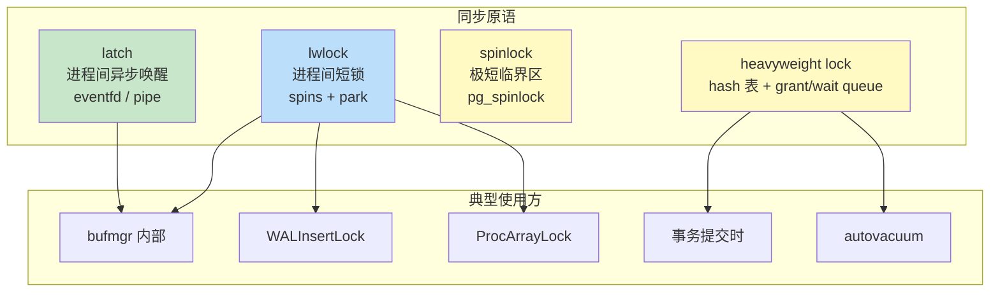
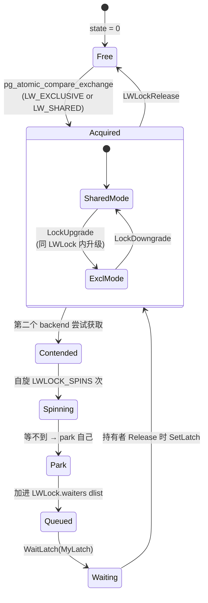
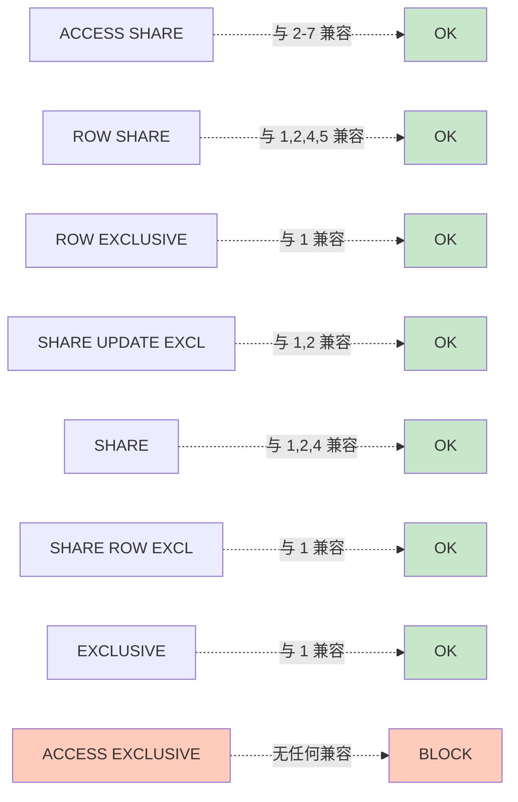
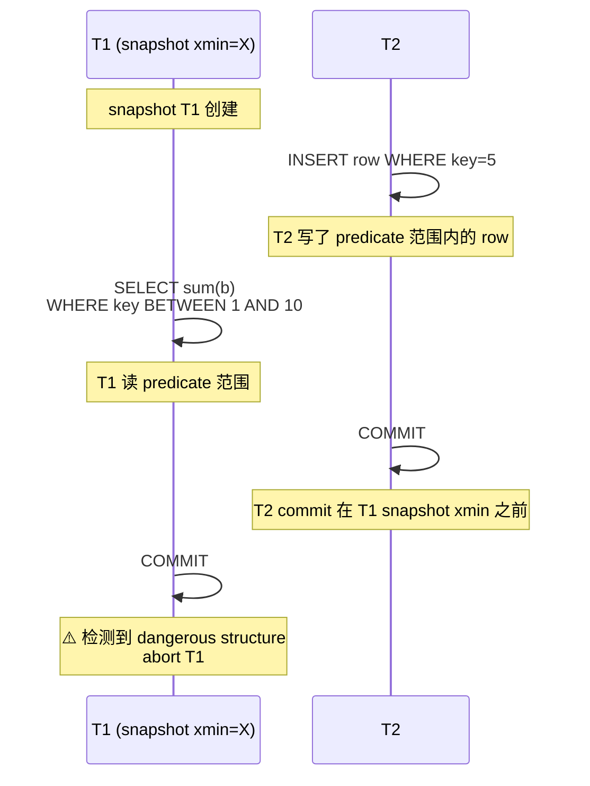
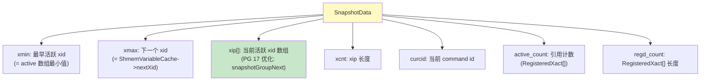
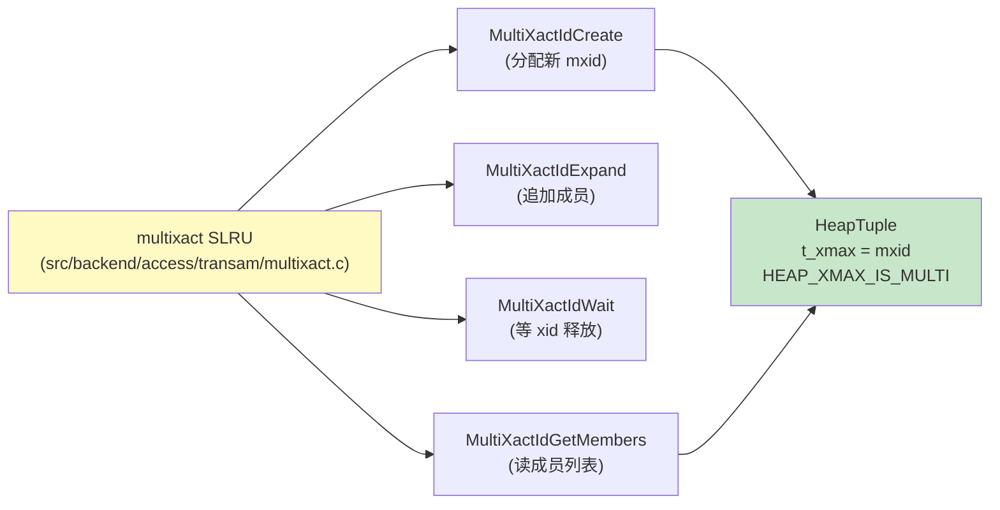

# 08 事务、锁与并发

> 目标：把 PG 的“事务子系统”吃透：xact 状态机、Snapshot、clog/subtrans、lmgr 的表/页/元组三级锁、lwlock、SSI 实现。**这是“资深内核开发”与“会用 PG”的分水岭**。

## 8.1 事务子系统全景

```
                ┌──────────────────────────────────┐
                │ xact.c : TransactionState 状态机   │
                │ COMMIT/ABORT/ROLLBACK                │
                └──┬──────────────────────┬───────┘
                   │                      │
        提交/回滚    │                      │ 锁 / 可见性
                   ▼                      ▼
        ┌──────────────────┐    ┌──────────────────┐
        │ clog.c: TransactionId       │ lmgr/lock.c │
        │ commit log            │ Heavyweight Locks│
        │ subtrans.c: 子事务    │ (TABLE/ROW/...) │
        └──────────────────┘    └──────────────────┘
                                       │
                                       ▼
                          lwlock.c: 轻量级锁
                          proc.c:  PROC 数组 / 信号
                          predicate.c: SSI
```

## 8.2 xact.c 状态机

`src/backend/access/transam/xact.c` 维护一个当前 backend 的 `MyXactFlags` 和状态：

```c
typedef enum TransState {
    TRANS_DEFAULT, TRANS_START, TRANS_INPROGRESS,
    TRANS_COMMIT, TRANS_ABORT,
    TRANS_PREPARE                // 两阶段提交
} TransState;
```

`TransactionState` 数据结构：
```c
typedef struct TransactionStateData {
    TransactionId   xid;             // 当前事务 ID（Invalid 表示没事务）
    CommandId       cid;             // 当前命令 ID
    ...
    int             subXidsCount;    // 子 xid 数
    TransactionId  *subXids;         // 子 xid 数组
    ...
    XLogRecPtr      prevXLogRecPtr;  // 上次 WAL 位置
    ...
} TransactionStateData;
```

### 8.2.1 关键函数

- `StartTransaction()` / `CommitTransaction()` / `AbortTransaction()`
- `RecordTransactionCommit()`：写 COMMIT WAL
- `RecordTransactionAbort()`：写 ABORT WAL（可选，仅 debug）

## 8.3 Snapshot（快照）

`src/include/utils/snapshot.h`：

```c
typedef struct SnapshotData {
    TransactionId xmin;            // 活跃的最老 xid
    TransactionId xmax;            // 下一个 xid
    TransactionId *xip;            // 活跃 xid 数组
    uint32        xcnt;            // 数组长度
    ...
    CommandId     curcid;
    uint32        active_count;    // 引用计数
} SnapshotData;
```

四个标准快照：
- `SnapshotSelf` —— 仅自己未提交的修改可见
- `SnapshotAny` —— 忽略可见性（用于维护命令）
- `SnapshotToast` —— TOAST 表读
- `SnapshotDirty` —— 不提交/回滚读，dirty 也可见

`GetSnapshotData()` 在 PG 18 里会从 `procarray.c:ProcArray` 获取当前活跃 xid 列表。

## 8.4 PROC 数组与 ProcArrayLock

`src/backend/storage/lmgr/proc.c`：

```c
typedef struct PGPROC {
    ...
    TransactionId xid;             // 当前 backend xid
    TransactionId xmin;            // 我的快照 xmin
    int           pid;             // 后端 PID
    ...
    Latch       *procLatch;        // 唤醒 latch
    ...
} PGPROC;
```

`MyProc` 是 backend 自己的 `PGPROC`；`ProcArray` 是 backend 们组成的数组。

`ProcArrayLock` 是 lwlock，分为 **共享 / 排他 / 重新拍快照**：
- 共享：扫描 PROC 数组
- 排他：把自己加入 / 退出 PROC 数组
- 重新拍快照：GetSnapshotData 内部会升锁

## 8.5 clog 与可见性

`src/backend/access/transam/clog.c`：

- SLRU（Simple LRU）结构：4 个文件循环覆盖
- 每事务 2 bit
- 关键 API：
  ```c
  void TransactionIdSetCommitBit(TransactionId xid);
  void TransactionIdSetAbortBit(TransactionId xid);
  bool TransactionIdDidCommit(TransactionId xid);
  bool TransactionIdIsInProgress(TransactionId xid);
  ```
- 实现细节：`TRANSACTION_STATUS_IN_PROGRESS / COMMITTED / ABORTED / SUB_COMMITTED`

`subtrans.c` 记录父 xid → 子 xid 数组。当父提交时还要 update 自己的 clog 标记。

## 8.6 锁子系统（lmgr）

PG 的锁分两种：

| 锁类型 | 实现 | 例子 |
| --- | --- | --- |
| **LWLock** | 进程间互斥短锁 | `BufMappingLocks`、`ProcArrayLock`、`WALInsertLock` |
| **Heavyweight Lock (HLock)** | 表/页/行级长锁 | `LOCKTAG_RELATION` / `LOCKTAG_TUPLE` |

### 8.6.1 LWLock

`src/backend/storage/lmgr/lwlock.c`：

- 自实现，**不依赖 OS futex**
- 排队算法：每个 LWLock 维护一个 `PGPROC` 链表（wait queue）
- 后到先服务 / FIFO 都支持

```c
void LWLockAcquire(LWLock *lock, LWLockMode mode);
void LWLockRelease(LWLock *lock);
bool LWLockWaitForVar(LWLock *lock, uint64 *valptr, uint64 oldval, uint32 *myprocno);
```

重要 LWLock：
- `BufMappingLocks`（partitioned，多个）—— 保护 buffer hash table
- `WALInsertLock` —— 序列化 WAL 插入
- `ProcArrayLock` —— 见 8.4
- `LockMgrLocks` —— heavyweight lock 自己的锁

### 8.6.2 Heavyweight Lock

`src/backend/storage/lmgr/lock.c`：

- 用 hash 表存所有锁对象
- 锁粒度：`TABLE` / `EXTENSION` / `PAGE` / `TUPLE` / `TRANSACTION` / `OBJECT` / `USERLOCK` / `ADVISORY`
- 模式：`ACCESS SHARE` / `ROW SHARE` / `ROW EXCLUSIVE` / `SHARE UPDATE EXCLUSIVE` / `SHARE` / `SHARE ROW EXCLUSIVE` / `EXCLUSIVE` / `ACCESS EXCLUSIVE`

冲突矩阵非常经典，可以从 `pg_locks` 看。

```sql
postgres=# SELECT locktype, mode, granted, count(*) FROM pg_locks GROUP BY 1,2,3;
```

### 8.6.3 行级锁

PG 没有真正的“row lock”，而是：
- `SELECT FOR UPDATE / SHARE / NO KEY UPDATE / KEY SHARE`：写 `t_infomask2 |= HEAP_KEYS_UPDATED`，并加 `LOCKTAG_TUPLE`
- `t_xmax = current xid` 标记删除/锁状态

`src/backend/access/heap/heapam.c:heap_lock_tuple()` 实现。

### 8.6.5 多事务锁 (multixact)

`SELECT FOR KEY SHARE` / `FOR SHARE` 等允许多个事务同时锁同一行。用 `multixact.c` 维护 MultiXactId。

```c
// multixact.c: MultiXactIdCreate(members, n)
// members[i] = {TransactionId, LockMode}
```

clog → multixact → lock 三层配合完成行级锁的 MVCC 语义。

## 8.7 死锁检测

`src/backend/storage/lmgr/deadlock.c:LockCheckConflicts()`：

- 维护 `DEADLOCK_INFO` 队列
- 检测算法：从当前等待者画 Edges（依赖图），DFS 找环
- 强制 abort 一个事务回退

GUC `deadlock_timeout`（默认 1s）：等这么久还没获得锁，开始检测。

## 8.8 SSI（Serializable Snapshot Isolation）

PG 9.1+ 引入，避免 RI 下的幻读异常。算法基于 **predicate locks**：
- 锁的不是行，而是谓词（用 page-level SIReads 维护）
- 检测到 dangerous structure 时强制 abort

`src/backend/storage/lmgr/predicate.c`：

```c
void PredicateLockPage(Relation rel, BlockNumber blkno);
void PredicateLockTuple(Relation rel, HeapTuple tuple);
bool CheckForSerializableConflictIn(PGPROC *proc, ...);
```

实现细节见 `README-SSI`。

## 8.9 隔离级别

| 级别 | 实现 |
| --- | --- |
| READ UNCOMMITTED | 视为 READ COMMITTED（PG 不允许脏读） |
| READ COMMITTED | 每条 query 取一个 snapshot |
| REPEATABLE READ | 事务开始时取 snapshot，整个事务不动 |
| SERIALIZABLE | REPEATABLE READ + SSI 检测 |

## 8.10 实战

### 8.10.1 看 PROC 数组

```sql
postgres=# SELECT pid, usename, state, query_start, xact_start, wait_event_type, wait_event
           FROM pg_stat_activity;
```

`wait_event_type='Lock'` 表示正在等 heavyweight lock；`'LWLock'` 是 lwlock。

### 8.10.2 制造死锁

```sql
-- session A
BEGIN;
UPDATE t SET v='a' WHERE id = 1;
-- 不 commit

-- session B
BEGIN;
UPDATE t SET v='b' WHERE id = 2;
UPDATE t SET v='c' WHERE id = 1;  -- 等 A
```

```sql
-- 回到 A
UPDATE t SET v='d' WHERE id = 2;  -- 等 B → 死锁
```

PG 检测后 abort 较轻的事务。

### 8.10.3 看 lwlock 等待

```sql
postgres=# SELECT mode, granted, locktype, relation::regclass FROM pg_locks
           WHERE NOT granted;
```

### 8.10.4 GDB 跟踪

```bash
(gdb) b lock.c:LockAcquire
(gdb) b lwlock.c:LWLockAcquire
(gdb) b proc.c:ProcArrayAdd
(gdb) b xact.c:CommitTransaction
(gdb) c
```

执行 `BEGIN; UPDATE t SET v='x' WHERE id=1; COMMIT;` 看依次在哪些函数停留。

### 8.10.5 观察 clog

```bash
# 找到 pg_xact 的物理路径（其实是 SLRU）
pg_controldata $PGDATA | grep -i xid
# 看 SLRU 占用（pg_xact/ 子目录）
```

## 8.11 与 InnoDB 对照

| 维度 | PG | InnoDB |
| --- | --- | --- |
| 行锁 | 多事务 multixact | 集中 lock manager |
| 谓词锁 | SSI（PG 9.1+） | 无 |
| 锁等待 | 锁队列 + 死锁检测 | 类似 |
| 锁信息 | `pg_locks` | `information_schema.innd_trx` 等 |

## 8.12 小结

- 事务 = xact 状态机 + Snapshot + clog。
- 锁分两层：LWLock（短锁） + Heavyweight Lock（长锁）。
- 行锁通过 t_xmax + multixact 实现。
- SSI 让 SERIALIZABLE 真有效。
- 与 heap/page/索引的可见性判定相互依赖，必须串起来看。

下一章 09 进入 WAL 与恢复——把 buffer 与 heap/索引的“纸面变化”落到磁盘与故障恢复。

## 8.12 进阶：LWLock 内部实现

### 8.12.1 数据结构

`src/include/storage/lwlock.h`：

```c
typedef struct LWLock {
    uint16          truncate;            // 0 / 1
    pg_atomic_uint32 state;              // 状态位 + 等待数
    dlist_head      waiters;             // 等待队列
} LWLock;

// state 编码：
#define LW_FLAG_HAS_WAITERS   0x40000000
#define LW_FLAG_RELEASE_OK    0x20000000
#define LW_FLAG_LOCKED        0x10000000
#define LW_FLAG_BIT_MASK      0x3FFFFFFF
```

### 8.12.2 自旋 vs park

PG 的 LWLock 分两段：
1. **spin**：自旋 n 次（`LWLOCK_SPINS`，默认 100）
3. **park**：让出 CPU（`WaitLatch` 或 `sem_wait`）

```c
void LWLockAcquire(LWLock *lock, LWLockMode mode)
{
    // 1. 尝试原子获取
    while (!pg_atomic_compare_exchange_u32(&lock->state, ...)) {
        // 2. 自旋
        for (int i = 0; i < LWLOCK_SPINS; i++) {
            // 读 state
            // 自旋
        }
        // 3. park：把自己挂到等待队列
        //    （自旋过的 PGPROC 会增加 wait_event）
    }
}
```

### 8.12.3 等待队列管理

```c
// src/backend/storage/ipc/proc.c
dlist_head LWLockWaitList;   // 全局

// 加锁失败时
queue = &lock->waiters;
dlist_push_tail(queue, &MyProc->lwWaitLink);
```

解锁时遍历等待队列，挑第一个授予：

```c
void LWLockRelease(LWLock *lock)
{
    // 1. 清 LOCKED bit
    
    // 2. 遍历 waiters 列表
    dlist_foreach(iter, &lock->waiters) {
        proc = dlist_container(PGPROC, lwWaitLink, iter);
        if (proc->lwWaitMode == LW_EXCLUSIVE) continue;
        // 第一个 shared waiter
        SetLatch(&proc->procLatch);
        break;
    }
}
```

### 8.12.4 LWLockWaitForVar

`LWLockWaitForVar(lock, valptr, oldval, myprocno)` 用于等待条件变化：

```c
// src/backend/storage/lmgr/lwlock.c
void LWLockWaitForVar(LWLock *lock, uint64 *valptr, uint64 oldval,
                      uint32 *myprocno)
{
    // 1. 拿 LW_SHARED on lock
    
    // 2. 等 valptr != oldval
    
    // 3. 释放 LW_SHARED
}
```

典型用法：`heap_lock_tuple` 等 `t_xmax` 提交。

## 8.13 进阶：Heavyweight Lock 内部

### 8.13.1 锁标签与冲突矩阵

```c
// src/include/storage/lock.h
typedef struct LOCKTAG {
    uint32  locktag_field1;     // relation OID
    uint16  locktag_field2;     // db OID (for relations)
    uint16  locktag_field3;
    uint32  locktag_field4;
    uint32  locktag_field5;
} LOCKTAG;

typedef enum LockTagType {
    LOCKTAG_RELATION,        // 表级
    LOCKTAG_RELATION_EXTEND, // ALTER TABLE
    LOCKTAG_PAGE,            // 页级
    LOCKTAG_TUPLE,           // tuple 级
    LOCKTAG_TRANSACTION,
    LOCKTAG_VIRTUALTRANSACTION,
    LOCKTAG_SPECULATIVE_TOKEN,
    LOCKTAG_OBJECT,
    LOCKTAG_USERLOCK,
    LOCKTAG_ADVISORY,
} LockTagType;
```

### 8.13.2 锁 hash 表

```c
// src/backend/storage/lmgr/lock.c
static HTAB *LockMethodLockHash;
static HTAB *LockMethodProcLockHash;
static HTAB *LockMethodConflictHash;
```

`LockMethodLockHash` 存所有活跃 lock 对象，按 `LOCKTAG` hash 查找。

### 8.13.3 锁的兼容矩阵

```c
// 8 种 mode：
// ACCESS SHARE         (SELECT)
// ROW SHARE            (SELECT FOR UPDATE)
// ROW EXCLUSIVE        (UPDATE)
// SHARE UPDATE EXCLUSIVE (VACUUM)
// SHARE                (CREATE INDEX)
// SHARE ROW EXCLUSIVE  (某些 DDL)
// EXCLUSIVE            (DROP TABLE 等)
// ACCESS EXCLUSIVE     (ALTER TABLE)
```

冲突矩阵完整版（src/backend/storage/lmgr/lock.c 的 lock_compatibility 表）：
- ACCESS SHARE 与所有非 EXCLUSIVE 兼容
- ROW EXCLUSIVE 与 ROW EXCLUSIVE / SHARE UPDATE EXCLUSIVE / SHARE ROW EXCLUSIVE / EXCLUSIVE 不兼容
- 等等

### 8.13.4 grant_queue 与 wait_queue

每个 LOCK 对象维护：
```c
typedef struct LOCK {
    LOCKTAG      tag;
    GRANT_PROC  *granted;     // 已授予列表
    WAIT_PROC   *waiting;     // 等待列表
    int          nGranted;
    int          nRequested;
    int          requested;   // mode bitmask
    int          grantedMask; // mode bitmask
    ...
} LOCK;
```

`LockAcquire` 时根据冲突矩阵判断：
- 兼容：立即 granted
- 不兼容：挂到 wait_queue

## 8.14 进阶：行级锁与 multixact

### 8.14.1 锁的粒度

PG 的“行级锁”其实是 **tuple-level HLock + t_infomask + t_xmax** 的组合：

```c
// heap_lock_tuple
TM_Result heap_lock_tuple(Relation relation, HeapTuple tuple,
                          LockTupleMode mode, ...)
{
    // 1. 检查 t_xmax：
    //    a) = 0 → 可以直接锁：t_xmax = current_xid
    //    b) = current_xid → 已经是自己
    //    c) 其他 xid → 走 multixact
    
    // 2. 多事务锁：
    //    MultiXactIdCreate(members, ...)
    
    // 3. 加 HLock: LOCKTAG_TUPLE
}
```

### 8.14.2 multixact 数据结构

```c
// src/backend/access/transam/multixact.c
typedef struct {
    TransactionId xid;
    uint16        mode;     // LockTupleMode 枚举
} MultiXactMember;

typedef struct {
    MultiXactId   id;
    int           nmembers;
    MultiXactMember members[1];
} MultiXactEntry;
```

multixact 是 SLRU 化的存储，类似 clog。

### 8.14.3 multixact id 的分配

```c
MultiXactId MultiXactIdCreate(MultiXactMember *members, int nmembers)
{
    // 1. 拿 MultiXactGenLock (lwlock)
    
    // 2. 分配新 MultiXactId
    
    // 3. 写到 SLRU
    
    // 4. 释放 lock
}
```

每个 PG 实例有一个 monotonic 计数器，从 `MultiXactOffsetTable` 跟踪。

### 8.14.4 multixact 与 freeze

```c
// vacuumlazy
MultiXactIdSetOldestVisible();
```

multixact 也会"过期"，由 vacuum 处理。

## 8.15 进阶：死锁检测详解

### 8.15.1 算法

`src/backend/storage/lmgr/deadlock.c:LockCheckConflicts()`：

```c
bool DeadLockCheck(PGPROC *proc)
{
    // 1. 从 proc 开始，构建等待图
    
    // 2. BFS 找环：
    //    queue = [proc]
    //    visited = {proc}
    //    while queue:
    //        cur = queue.pop()
    //        for neighbor in cur.waiters:
    //            if neighbor in visited: continue
    //            visited.add(neighbor)
    //            queue.push(neighbor)
    //            if neighbor == proc: dead lock!
    
    // 3. abort 一个：按 cost 决定（事务做的工作量）
}
```

### 8.15.2 死锁触发时机

每个 backend 等锁到 `deadlock_timeout`（默认 1s）时触发检测：

```c
// lock.c:LockAcquire
if (MyProc->waitStart >= deadline) {
    deadlock = DeadLockCheck(MyProc);
    if (deadlock) {
        ereport(ERROR, "deadlock detected");
    }
}
```

### 8.15.3 死锁的常见场景

| 场景 | 描述 |
| --- | --- |
| A→B→A | 两个事务互锁 |
| 长链 | A→B→C→D→A |
| 锁升级 | shared → exclusive 时与新 shared 互锁 |
| 多 lock tag | 不同粒度的锁互锁 |

## 8.16 进阶：SSI（Serializable Snapshot Isolation）

### 8.16.1 为什么需要 SSI

`REPEATABLE READ` 在 PG 中只防止了不可重复读，但仍有幻读 / serialization anomaly。

例子：
```
T1: SELECT sum(b) FROM t WHERE a BETWEEN 1 AND 100;
T2: INSERT INTO t VALUES (50, 10);
T2: COMMIT;
T1: SELECT sum(b) FROM t WHERE a BETWEEN 1 AND 100;  -- 包含 T2 的插入
T1: COMMIT;
```

T1 看到两次结果不同，但序列化执行时不应如此。

### 8.16.2 SSI 的核心思想

用 **predicate locks**（谓词锁）记录事务读取的数据范围，结合 commit order 检测 dangerous structure。

### 8.16.3 关键数据结构

`src/backend/storage/lmgr/predicate.c`：

```c
typedef struct {
    TransactionId xmin;      // 最早活跃 xid
    SERIALIZABLEXACT *conflictingIn;  // 谁可能导致 conflict
    SERIALIZABLEXACT *inConflicts;   // 我可能导致谁
    ...
} SERIALIZABLEXACT;
```

### 8.16.4 dangerous structure

当 T2 写一个 tuple，T1 读 range，T2 commit 在 T1 之前，且 T1 之后 commit —— 这就是 dangerous structure：

```
T2: write tuple
T1: read range 包含 tuple
T2: COMMIT
T1: COMMIT (此时 T2 已 commit，T1 应 abort)
```

### 8.16.5 PredicateLockPage

```c
void PredicateLockPage(Relation rel, BlockNumber blkno)
{
    // 1. 找 predicate lock table
    
    // 2. 加 entry（lock tuple / page）
    
    // 3. 关联到当前 SERIALIZABLEXACT
}
```

### 8.16.6 CheckForSerializableConflictIn

```c
bool CheckForSerializableConflictIn(Relation rel, ...)
{
    // 1. 拿到当前 SERIALIZABLEXACT
    
    // 2. 找其他 SERIALIZABLEXACT 中有 conflict 的
    
    // 3. 检测 dangerous structure
    
    // 4. 如有：abort 当前事务
}
```

### 8.16.7 性能开销

SSI 比 REPEATABLE READ 慢约 10-30%，因为：
- 维护 predicate lock table
- commit 时检测 dangerous structure
- 可能大量事务 abort

## 8.17 进阶：pg_locks 视图

### 8.17.1 解读

```sql
postgres=# SELECT * FROM pg_locks;
```

字段：
- `locktype`：relation / tuple / transaction / virtualxid
- `database`：db OID
- `relation`：table OID
- `page`：page number（tuple 锁才有）
- `tuple`：tuple number
- `virtualxid`：backend virtual transaction
- `transactionid`：real xid
- `pid`：backend PID
- `mode`：锁模式
- `granted`：true/false
- `fastpath`：是否走 fastpath（见 8.17.2）

### 8.17.2 fastpath lock

PG 13+ 提供 fastpath：
- `LockTagRelation` 在 fastpath 上
- 占用 backend 私有的 fastpath array（每个 mode 一位）
- 跳过 hash 表 → 快

```c
// src/backend/storage/lmgr/lock.c
#define FASTPATH_NUM_LOCKS 16

// 装填 fastpath
fastpath->locks[lockmode] |= (1 << rid);
```

但仅限于：
- 表级
- 没等待者
- 无冲突

### 8.17.3 pg_blocking_pids / pg_safe_snapshot_blocking_pids

```sql
postgres=# SELECT pid, pg_blocking_pids(pid) FROM pg_stat_activity;
```

显示每个 backend 正在阻塞谁。

## 8.18 进阶：wait_event 与 pg_stat_activity

### 8.18.1 wait_event_type

```sql
postgres=# SELECT pid, wait_event_type, wait_event FROM pg_stat_activity
           WHERE wait_event IS NOT NULL;
```

`wait_event_type` 分类：
- `Lock`：HLock / LWLock
- `LWLock`：lwlock 类型
- `IO`：读 / 写
- `Activity`：系统活动
- `BufferPin`：等 buffer pin
- `Extension`：扩展
- `Client`：client 读
- `IPC`：等子进程
- `Timeout`：sleep
- `MultiXact`：等 multixact 释放

### 8.18.2 常见 wait_event

| wait_event | 含义 |
| --- | --- |
| `Lock:relation` | 等表锁 |
| `Lock:transactionid` | 等其他事务提交 |
| `Lock:tuple` | 等行锁 |
| `LWLock:buffer_content` | 等 buffer content lock |
| `LWLock:buffer_mapping` | 等 buffer hash 表 lock |
| `LWLock:wal_insert` | 等 WAL insert lock |
| `LWLock:lock_manager` | 等 HLock manager 锁 |
| `IO:BufFileRead` | 读临时文件 |
| `IO:DataFileRead` | 读数据文件 |
| `IO:WALWrite` | 写 WAL |

### 8.18.3 用 pg_wait_sampling 监控

```sql
postgres=# CREATE EXTENSION pg_wait_sampling;

SELECT wait_event, count(*) FROM pg_wait_sampling_history
GROUP BY 1 ORDER BY 2 DESC;
```

## 8.19 进阶：MyXactFlags 与事务状态机

### 8.19.1 flags

```c
// src/include/access/xact.h
typedef enum XactEvent {
    XACT_EVENT_COMMIT,
    XACT_EVENT_ABORT,
    XACT_EVENT_PARALLEL_COMMIT,
    XACT_EVENT_PARALLEL_ABORT,
} XactEvent;

#define XACT_FLAGS_ACCESSEDTEMP     (1U << 0)
#define XACT_FLAGS_ACCESSEDXLOG     (1U << 1)
```

### 8.19.2 状态机

```c
typedef enum TransState {
    TRANS_DEFAULT,
    TRANS_START,
    TRANS_INPROGRESS,
    TRANS_COMMIT,
    TRANS_ABORT,
    TRANS_PREPARE
} TransState;
```

状态转换由 `CommitTransaction` / `AbortTransaction` 等函数推进。

## 8.20 进阶：两阶段提交（2PC）

### 8.20.1 流程

```sql
postgres=# BEGIN;
postgres=# PREPARE TRANSACTION 'my_xact';
-- 通知协调者
-- 协调者决定 commit 或 rollback
postgres=# COMMIT PREPARED 'my_xact';
-- 或
postgres=# ROLLBACK PREPARED 'my_xact';
```

PG 的 2PC 是 **XA 兼容的接口**：
- `PREPARE TRANSACTION` → 写 XLOG_XACT_PREPARE
- WAL 持久化后才返回 prepared
- `COMMIT PREPARED` / `ROLLBACK PREPARED` 走 normal commit/abort path

### 8.20.2 2PC 与 clog

2PC prepared 状态写 clog：
- `TRANSACTION_STATUS_SUB_COMMITTED`
- 协调者发 commit 后 → clog 更新为 COMMITTED
- 协调者发 rollback → clog 更新为 ABORTED

### 8.20.3 恢复

recovery 时遇到 XLOG_XACT_PREPARE：
1. 写 clog SUB_COMMITTED
2. 不释放 locks，等 commit/rollback

## 8.21 进阶：subxact / savepoint

### 8.21.1 实现

```sql
postgres=# BEGIN;
postgres=# SAVEPOINT s1;
postgres=# INSERT ...;
postgres=# ROLLBACK TO s1;
postgres=# COMMIT;
```

PG 用 `SubTransactionId` 跟踪：
- 每个 subxact 有自己的 xid
- 主事务有 Parent xid + 子 xid 数组

### 8.21.2 pg_subtrans

记录父 xid → 子 xid 的映射：

```c
// subtrans.c
// SLRU 存储
// key = parent xid
// value = 子 xid array
```

### 8.21.3 commit 处理

```c
void CommitSubTransaction()
{
    // 1. 写子 xid 的 commit（不进 clog）
    //    只更新 subtrans 中父 xid 的 status
    
    // 2. 父事务 commit 时：
    //    - 子 xid 数组写到 clog
    //    - 释放子 xid 的 locks
}
```

## 8.22 小结

- LWLock 用 state atomic + waiters dlist 实现，自旋 + park。
- Heavyweight Lock 走 hash 表 + grant/wait queue，按兼容矩阵授予。
- 行级锁 = tuple HLock + t_xmax + multixact。
- 死锁用 BFS 检测 wait-for graph，按 cost abort。
- SSI 用 predicate lock + dangerous structure 检测，处理 serialization anomaly。
- pg_locks / pg_stat_activity 是观察窗口，wait_event_type / wait_event 精确定位等待原因。

下一节给 09 章补 WAL 与恢复的进阶深度。


## 8.23 图示

### 8.23.1 锁层次结构



### 8.23.2 LWLock 队列模型



### 8.23.3 Heavyweight Lock 兼容矩阵



### 8.23.4 死锁等待图示例

```mermaid
graph LR
    T1[事务 A<br/>持: lock(id=1)<br/>等: lock(id=2)]
    T2[事务 B<br/>持: lock(id=2)<br/>等: lock(id=1)]
    
    T1 -.->|BEFORE| T2
    T2 -.->|BEFORE| T1
    
    style T1 fill:#ffccbc
    style T2 fill:#ffccbc
```

### 8.23.5 SSI Dangerous Structure



### 8.23.6 Snapshot 数据结构



### 8.23.7 多事务锁（multixact）数据流



> 图示配套源码：`src/include/storage/lwlock.h`、`src/backend/storage/lmgr/{lwlock.c,lock.c,deadlock.c,proc.c,predicate.c,lmgr.c,condition_variable.c,s_lock.c}`、`src/include/storage/lock.h`、`src/backend/access/transam/{multixact.c,clog.c,subtrans.c}`、`src/include/utils/snapshot.h`、`src/backend/storage/ipc/procarray.c`。
