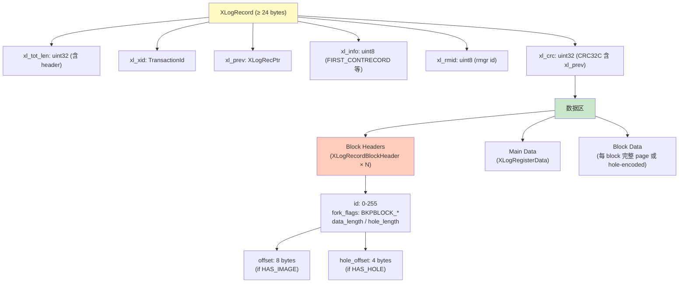
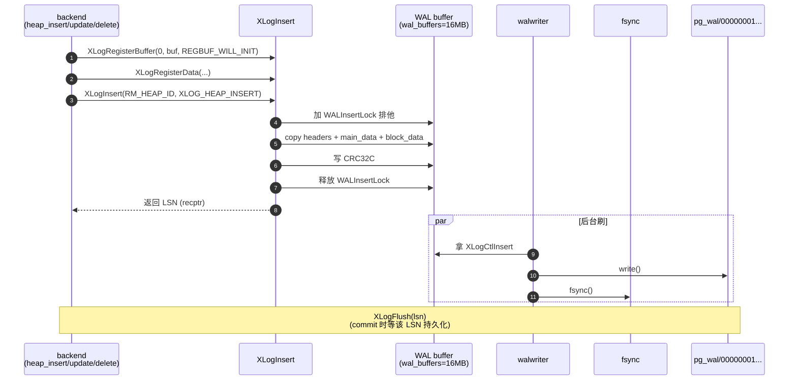
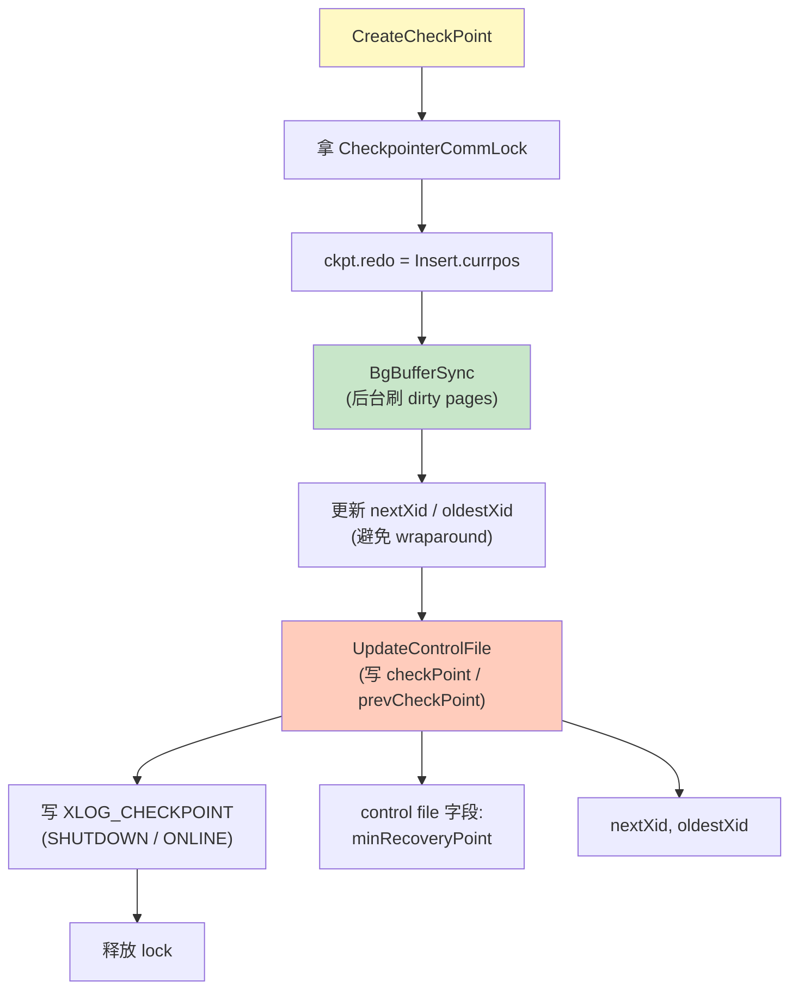
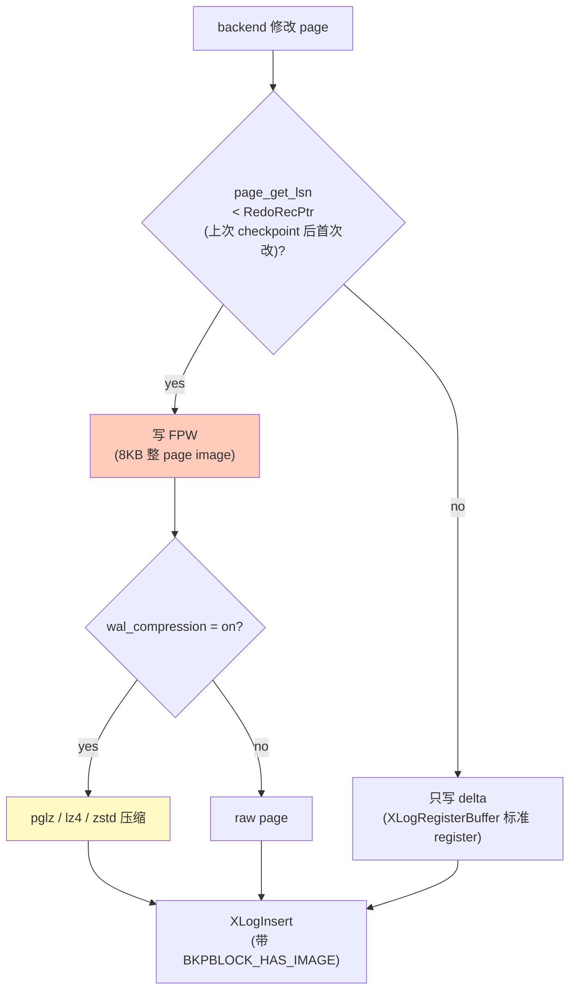
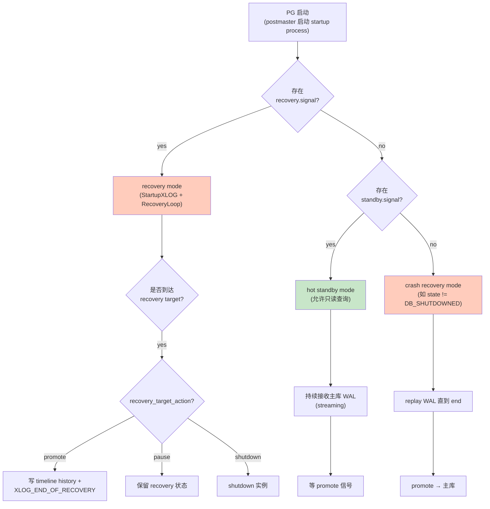

# 09 WAL 与恢复

> 目标：吃透 PG 的 Write-Ahead Logging 子系统——XLogRecord 结构、rmgr 注册表、redo/undo、checkpoint、recovery、流复制。**这是与 InnoDB redo log 最常被拿来对照的部分**。

## 9.1 WAL 的作用

每个数据页面的修改，**必须在写盘前先写 WAL**。原因：
- crash recovery：磁盘 page 可能落后于内存 page
- 流复制：standby 通过 replay WAL 跟上 primary
- 时间旅行 / PITR：基础是 WAL 流

PG 把日志叫 **XLOG**（历史叫法），不是 WAL。PG 15+ 引入 `wal_level = logical` 用于逻辑复制。

## 9.2 XLogRecord 结构

```c
// src/include/access/xlogrecord.h
typedef struct XLogRecord {
    uint32      xl_tot_len;     // 整个 record 长度（含头部）
    TransactionId xl_xid;       // 产生该 record 的事务
    XLogRecPtr   xl_prev;         // 前一条 record 的 ptr（用于 traversal）
    uint8       xl_info;        // 标志：XLOG_FIRST_IS_CONTRECORD 等
    uint8       xl_rmid;        // Resource Manager id (XLOG_BTREE/HEAP/...)
    uint32      xl_crc;         // CRC32C（带 xl_prev）
    /* xl_crc 之后是 data 区 */
} XLogRecord;
```

data 区：
- 头 8 字节：`XLogRecordBlockHeader`
- 紧跟 main_data（variable size）
- 最后是 block data 区（每块：BlockId → offset → length → 实际页面字节）

```
+-----------------------------+
|   XLogRecord header         |
+-----------------------------+
|   XLogRecordBlockHeader 0   |
|   ...                        |
|   XLogRecordBlockHeader N-  |
+-----------------------------+
|   main_data                  |
+-----------------------------+
|   block 0 data               |
|   block 1 data               |
+-----------------------------+
```

BlockHeader 中有 `BKPBLOCK_*` 标志：
- `BKPBLOCK_HAS_IMAGE`：整页 image
- `BKPBLOCK_HAS_DATA`：仅修改部分（block data）
- `BKPBLOCK_WILL_INIT`：page 初始化

## 9.3 rmgr 注册表

PG 的 redo 不是 monolithic，每个子系统自己注册：

```c
// src/backend/access/transam/rmgr.c
typedef struct RmgrData {
    const char *rm_name;
    void      (*rm_redo)(XLogReaderState *record);
    void      (*rm_desc)(StringInfo buf, XLogReaderState *record);
    void      (*rm_identify)(uint8 info);
} RmgrData;

static const RmgrData rmgr_table[RM_MAX] = {
    [RM_XLOG_ID]   = { "xlog", xlog_redo, xlog_desc, xlog_identify },
    [RM_XACT_ID]   = { "xact", xact_redo, xact_desc, xact_identify },
    [RM_SMGR_ID]   = { "smgr", smgr_redo, smgr_desc, smgr_identify },
    [RM_HEAP_ID]   = { "heap", heap_redo, heap_desc, heap_identify },
    [RM_HEAP2_ID]   = { "heap2", heap2_redo, heap2_desc, heap2_identify },
    [RM_BTREE_ID]  = { "btree", btree_redo, btree_desc, btree_identify },
    [RM_HASH_ID]   = { "hash", hash_redo, hash_desc, hash_identify },
    [RM_GIN_ID]    = { "gin", gin_redo, gin_desc, gin_identify },
    [RM_GIST_ID]   = { "gist", gist_redo, gist_desc, gist_identify },
    [RM_SPGIST_ID] = { "spgist", spgist_redo, spgist_desc, spgist_identify },
    [RM_BRIN_ID]   = { "brin", brin_redo, brin_desc, brin_identify },
    ...
};
```

每个 rmgr 提供 `rm_redo`：崩溃恢复时调用。

### 9.3.1 添加自己的 rmgr（扩展开发）

`src/backend/access/transam/rmgr.c` 末尾有：
```c
void RegisterCustomRmgr(RmgrId rmid, const RmgrData *rmgr);
```

允许 PG 扩展注册自己的 redo/desc/identify 函数。PG 18 起一些 extension 已经这么做。

## 9.4 关键流程

### 9.4.1 XLogInsert

`src/backend/access/transam/xloginsert.c:XLogInsert()`：

```c
XLogRecPtr XLogInsert(RmgrId rmid, uint8 info)
{
    // 1. 加 WALInsertLock（独占 / shared）
    // 2. 计算 record 字节数（from registered blocks & data）
    // 3. 拷贝数据到当前 WAL buffer
    // 4. 拿 CurrBytePos（wal buffer 偏移）
    // 5. 计算 CRC32C
    // 6. 写入
    // 7. 释放 WALInsertLock
}
```

### 9.4.2 WAL buffer

- shmem 区域 `XLogCtl->xlblocks[NUM_XLOG_BUFFERS]`
- 默认 16MB（`wal_buffers` 决定）
- 写入新 record 时追加；满则刷盘 + 滚动

### 9.4.3 XLogFlush

`src/backend/access/transam/xlog.c:XLogFlush(XLogRecPtr record)`：

```c
void XLogFlush(XLogRecPtr record)
{
    // 1. WaitIO 直到 record 已经持久
    // 2. 写 IssueXLogFsyncRequest 给 walwriter
    // 3. 或同步 fsync
}
```

### 9.4.4 XLogWrite

实际把 WAL buffer 落到 `pg_wal/`。`walwriter` 进程专门周期性 flush。

### 9.4.5 WAL segment

- 16MB（`--with-wal-segsize` 可调，PG 17+ 支持 1MB-1GB）
- 文件名：`<timeline><log_id, 8 hex><seg_id, 8 hex>`
- 满了会创建新 segment
- 控制文件 `pg_wal/archive_status/` 标识已归档

## 9.5 checkpoint

`src/backend/postmaster/checkpointer.c:CheckpointerMain()`：

```c
void CreateCheckPoint(int flags)
{
    // 1. REDO point：当前 InsertPos
    // 2. 计算：
    //    - ckpt.redo (REDO LSN)
    //    - ckpt.undo = REDO LSN
    //    - ckptr.this_time
    // 3. 刷所有 dirty buffer
    //    由 bgwriter 协作
    // 4. 写 CONTROL_FILE（checkpoint 记录）
    // 5. 写 XLOG_CHECKPOINT_SHUTDOWN 或 XLOG_CHECKPOINT_ONLINE
}
```

两种触发：
- 时间：`checkpoint_timeout`（默认 5min）
- 容量：`max_wal_size` / `checkpoint_completion_target`

`XLOG_CHECKPOINT_SHUTDOWN` 在 smart shutdown 时写，**保证 recovery 时 redo point = shutdown point**，恢复 0 时间。

## 9.6 恢复

### 9.6.1 startup process

`src/backend/postmaster/startup.c:StartupProcessMain()`：

```c
void StartupProcessMain(void)
{
    // 1. 读 control file → last checkpoint
    // 2. 从 redo point 开始 replay
    //    XLogReadPage → XLogRecordDecode → rm_redo
    // 3. replay 到一致状态 → 退出，移交主进程
}
```

### 9.6.2 redo 算法

PG 是 **物理-逻辑混合 redo**：
- 物理部分：block image / block offset（避免重放逻辑）
- 逻辑部分：rmgr 自己理解 record 后修改 page

具体步骤（`xlogrecovery.c`）：
1. 读 record
2. 解析 block header，按 `forknum + blkno` 拿到 buffer
3. 调用对应 `rm_redo`
4. `PageSetLSN(page, record->EndRecPtr)`

如果 WAL 中带 block image（`BKPBLOCK_HAS_IMAGE`），直接覆盖；否则按 record 字节 patch。

### 9.6.3 回滚

PG **不撤销未提交事务**。崩溃恢复只 redo 已 WAL 化的修改；未提交事务的修改通过 **clog 标记 ABORTED** 让 tuple 对未来事务不可见，**老 tuple 被 vacuum 回收**。

这与 InnoDB 的 undo 不同——InnoDB 在 redo 后还会跑 undo 回滚。PG 直接靠 MVCC + vacuum。

## 9.7 流复制

### 9.7.1 架构

```
primary                                standby
--------                               -------
walwriter                                  │
   │                                       │
   ▼                                       │
write WAL ──── send ───► walreceiver ◄────┤
                                  │
                                  ▼
                              startup → replay
```

### 9.7.2 walreceiver`：
- 连到 primary 的 replication 端口（PG 18 默认 5432）
- `wal_keep_size` 控制本地保留量
- `wal_sender` 在 primary 端按 demand 发送

### 9.7.3 同步复制 vs 异步

`synchronous_commit`：
- `on`：fsync 后才算 commit
- `remote_write`：standby write 后算
- `remote_apply`：standby apply 后算
- `off`：仅本地 fsync

## 9.8 PITR（Point-In-Time Recovery）

```bash
# 1. 持续做基础备份
pg_basebackup -D /backup

# 2. 保留 WAL 到 archive_command 指向的路径

# 3. 恢复时：
#    - 恢复基础备份
#    - 在 recovery.conf (PG 12+ postgresql.conf) 设置
#      restore_command = 'cp /archive/%f %p'
#      recovery_target_time = '2026-01-01 12:00:00'
#      recovery_target_action = 'pause'
#    - 启动 postgres，到目标点自动暂停 / 提升
```

## 9.9 Logical replication / walsummarizer

PG 16 起 `walsummarizer` 进程定期生成 WAL summary 文件：

- 不读整段 WAL，而是用 `ReorderBuffer` 生成 tuple-level changes
- 给 logical replication slot / pgoutput plugin 用
- 减少逻辑解码的 CPU 开销

```c
// src/backend/replication/walsummarizer.c
// 把 WAL 摘要写到 .summary 文件，供 pg_decode、pg_recvlogical 等使用
```

## 9.10 实战

### 9.10.1 看 WAL

```bash
pg_waldump $PGDATA/pg_wal/000000010000000000000001 | head -50
# 或 PG 15+ 用
pg_xlogdump $PGDATA/pg_wal/000000010000000000000001 | head -50
```

### 9.10.2 模拟断电恢复

```bash
# 1. 启动
pg_ctl -D /tmp/pgdata start

# 2. 做一次修改
psql -c "INSERT INTO t VALUES (1, 'a');"
psql -c "CHECKPOINT;"

# 3. 找到最新 WAL segment
ls $PGDATA/pg_wal/

# 4. 模拟崩溃（不要 sync 就 kill）
kill -9 $(head -1 $PGDATA/postmaster.pid)

# 5. 启动时自动 redo
pg_ctl -D /tmp/pgdata start
```

日志里能看到 `redo at 0/...`、`database system is ready to accept connections`。

### 9.10.3 跟踪 XLogInsert

```bash
(gdb) b xlog.c:XLogInsert
(gdb) b xlog.c:XLogFlush
(gdb) c
```

任意 `INSERT` / `UPDATE`，停在 XLogInsert，看 `rmid / info` 与注册的 blocks。

### 9.10.4 模拟 redo

```bash
# 停库后修改一个 page（用 dd），再次启动时 redo 会校正
pg_ctl -D /tmp/pgdata stop
# 找一个 table 的 page（注意需要知道 page offset）
# 修改 page 几个字节（破坏 checksum 也可）
dd if=/dev/urandom of=$PGDATA/base/16384/12345 count=1 conv=notrunc bs=8K seek=10
pg_ctl -D /tmp/pgdata start
# 看 startup process 的 warning/redo
```

### 9.10.5 流复制搭建

```bash
# primary
initdb -D /tmp/p1
pg_ctl -D /tmp/p1 start -o "-c wal_level=replica -c max_wal_senders=5"

# 基础备份
pg_basebackup -D /tmp/p2 -R -P

# standby 启动
pg_ctl -D /tmp/p2 start
```

primary 上 `SELECT * FROM pg_stat_replication;` 看 standby 状态。

## 9.11 与 InnoDB 对照

| 维度 | PG XLOG | InnoDB redo |
| --- | --- | --- |
| Record 结构 | XLogRecord + block header + block data | log block + log record |
| 注册模型 | rmgr 表 | InnoDB 内置 |
| Block image | BKPBLOCK_HAS_IMAGE | 不带 image，靠 redo 算 |
| Checkpoint | 写 control file + xlog | 写独立的 LSN |
| 复制协议 | streaming replication | binlog + Mysql replication |
| Logical decoding | ReorderBuffer + plugin | binlog row-based |
| Undo | 无（靠 tuple 链） | 有（undo log） |
| 双写 | 无（PG 18 实验中） | 有 |

## 9.12 小结

- WAL 是 PG 持久化的基石：**先写日志，再写 page**。
- 每条数据变更 → 一条 XLogRecord，由对应 rmgr 负责 redo。
- Checkpoint 是 redo 的起点；smart shutdown 的 `XLOG_CHECKPOINT_SHUTDOWN` 让恢复瞬间完成。
- Recovery 只 redo 不 undo；未提交事务的修改通过 clog + vacuum 处理。
- 流复制 / PITR / logical replication 全基于 WAL。

下一章 10 进入杂项：其他 access method、并行执行、分区、FDW、JIT。L4 阶段最后一章。

## 9.16 进阶：XLogRecord 完整结构

### 9.16.1 头部

```c
typedef struct XLogRecord {
    uint32      xl_tot_len;     // 整个 record 字节数（含 header）
    TransactionId xl_xid;       // 产生该 record 的事务
    XLogRecPtr   xl_prev;       // 前一条 record 的 ptr
    uint8       xl_info;        // 标志：XLOG_FIRST_IS_CONTRECORD 等
    uint8       xl_rmid;        // Resource Manager id
    uint32      xl_crc;         // CRC32C（含 xl_prev）
    /* 之后是 data 区 */
} XLogRecord;
```

`xl_tot_len` 一定 8 字节对齐。

### 9.16.2 Block Header

每条 record 可能带 N 个 block 的信息：

```c
typedef struct XLogRecordBlockHeader {
    uint8       id;             // 0-255，引用 register
    uint8       fork_flags;     // BKPBLOCK_* 标志
    uint8       data_length;    // 占位长度
    uint8       hole_length;    // hole（压缩块用）
    /* 如果 BKPBLOCK_HAS_IMAGE && !hole_length，
       跟随 8 字节 offset + 4 字节 length
       如果有 hole_length：
       跟随 8 字节 offset + 4 字节 length + 4 字节 hole offset
    */
} XLogRecordBlockHeader;
```

### 9.16.3 Hole 机制

PG 用 hole 减小 WAL 量：
- page 中**没修改的部分**可以用 hole 省略
- redo 时从 disk 读 page，patch 已修改部分

```c
#define BKPBLOCK_HAS_HOLE   0x20
```

### 9.16.4 BKPBLOCK_WILL_INIT

当整个 page 是新创建时（heap_insert extend）：
```c
#define BKPBLOCK_WILL_INIT  0x10
```

redo 时无需读原 page，直接覆盖。

### 9.16.5 block_id 引用机制

`XLogRegisterBuffer` 注册 block 时返回 id。`XLogRegisterData` 给 main_data 区分配空间。

```c
// xloginsert.c
void XLogRegisterBuffer(uint8 block_id, Buffer buffer, uint8 flags);
void XLogRegisterData(char *data, int len);
```

最后 `XLogInsert` 一次性 copy：

```c
XLogRecPtr XLogInsert(RmgrId rmid, uint8 info)
{
    // 1. 计算总字节
    
    // 2. copy headers + main_data + block data
    
    // 3. CRC32C over 整个 record
    
    // 4. 写到 wal buffer
}
```

## 9.17 进阶：WAL 写入完整流程

### 9.17.1 三层结构

```
shmem: WAL buffer (16MB)
       │
       ▼
fsys:   pg_wal/  (segment 16MB each)
       │
       ▼
fsync:  WAL 持久化
```

### 9.17.2 WAL buffer 与 LSN

每个 WAL record 在 buffer 中有 currpos / EndRecPtr：

```c
// xlog.c
XLogCtlInsert *Insert = &XLogCtl->Insert;
Insert->currpos = ...;
Insert->prev_pos = ...;
```

`XLogInsert` 时锁 `WALInsertLock`：

```c
LWLockAcquire(&XLogCtl->insertpos_lck, LW_EXCLUSIVE);
// 计算位置、写 record
LWLockRelease(&XLogCtl->insertpos_lck);
```

`WALInsertLock` 是 **多 backend 间的写串行点**。

### 9.17.3 walwriter 异步 flush

`walwriter` 后台刷：

```c
void WalWriterMain(void)
{
    while (!got_SIGTERM) {
        // 1. 看 Insert->CurrBytePos
        // 2. 把已 flush 之前的 WAL 写盘 + fsync
        // 3. sleep wal_writer_delay
    }
}
```

### 9.17.4 synchronous_commit 时序

```sql
SET synchronous_commit = on;  -- 默认
```

`CommitTransaction` 时：

```c
XLogFlush(XactLastCommitEndRecPtr);  // 等 fsync
RecordTransactionCommit();           // 写 clog
```

### 9.17.5 WAL buffer 不足

`wal_buffers` 默认 16MB。满了之后：
1. 触发 walwriter 立即刷
2. 仍满：XLogInsert 会等 flush
3. 高峰期可能卡 backend

`wal_writer_flush_after` 控制触发频率。

## 9.18 进阶：full page image (FPW)

### 9.18.1 何时写 FPW

第一次修改一个 page 时（checkpointer 之后首次）：

```c
// heap_update
if (XLogHintBitIsNeeded()) {
    // 不需要 FPW（hint bit 更新）
} else if (PageGetLSN(page) < RedoRecPtr) {
    // 第一次修改 → 写 FPW
    XLogRegisterBuffer(0, buf, REGBUF_WILL_INIT | REGBUF_STANDARD);
    page_data = [entire 8KB page]
}
```

### 9.18.2 FPW 的作用

torn write 防护：
- page 在写入时断电 → 半新半旧
- 没有 FPW → 损坏（checksum 会失败）
- 有 FPW → redo 时用 FPW 覆盖 → 完整新 page

这是 PG 不需要 InnoDB doublewrite 的原因。

### 9.18.3 FPW 的代价

- 第一次 page 修改写 8KB WAL
- 高 IO 突发
- `wal_compression = on`（PG 15+）压缩 FPW

```sql
postgres.conf:
wal_compression = on
```

## 9.19 进阶：WAL 段管理

### 9.19.1 段大小与命名

```
段大小 = 16MB（默认）

文件命名：
<timelineid><logid, 8 hex><segid, 8 hex>
例：0000000100000001000000A0
   TLI=1, logid=0x00000001, segid=0x000000A0

老式命名（仅 TLI 1）：
0000000100000000000000A0
```

### 9.19.2 段切换

`src/backend/access/transam/xlog.c:InstallXLogFileSegment()`：

```c
void InstallXLogFileSegment(XLogSegNo segno, ...)
{
    // 1. 创建新文件
    //    pg_wal/000000010000000000000001
    // 2. 调 archive_command
    // 3. 删除过老文件（> max_wal_size）
}
```

### 9.19.3 max_wal_size

```sql
postgres.conf:
max_wal_size = '1GB'
min_wal_size = '80MB'
```

`max_wal_size` 控制 **何时触发 checkpoint**：
- pg_wal 总占用 > max_wal_size → 强制 checkpoint
- checkpoint 后可回收老段

### 9.19.4 老段回收

`XLogRecycle`：

```c
void XLogRecycle(void)
{
    // 找 segno < 最老的 slot restart_lsn / standby flush LSN
    // 调 archive_command
    // 删除
}
```

**重要**：如果 replication slot 没有 progress，老段会被保留。这会导致 disk full（slot 风险）。

## 9.20 进阶：checkpoint 详细过程

### 9.20.1 CreateCheckPoint

`src/backend/access/transam/xlog.c:CreateCheckPoint()`：

```c
void CreateCheckPoint(int flags)
{
    // 1. 拿 CheckpointerCommLock
    
    // 2. REDO point：
    //    ckpt.redo = XLogCtl->Insert->CurrBytePos
    
    // 3. 算 lastRecord LSN
    
    // 4. 强制 background flush dirty pages
    //    调 BgBufferSync(...)
    
    // 5. 更新 nextXid（避免 wraparound）
    
    // 6. 写 control file
    //    - checkPoint, prevCheckPoint
    //    - minRecoveryPoint
    //    - nextXid, oldestXid
    
    // 7. 写 XLOG_CHECKPOINT_SHUTDOWN 或 XLOG_CHECKPOINT_ONLINE
    
    // 8. 释放 lock
}
```

### 9.20.2 XLOG_CHECKPOINT_SHUTDOWN

```c
// src/backend/access/transam/xlog.c
typedef struct CheckPoint {
    XLogRecPtr  redo;
    TimeLineID  ThisTimeLineID;
    ...
    TransactionId nextXid;
    Oid          nextOid;
    ...
} CheckPoint;
```

`SHUTDOWN` 记录的 redo point = Insert.currpos，保证：
- 崩溃后 redo point 就是崩溃点
- recovery 时间几乎为 0

### 9.20.3 checkpoint 与 buffer pool

checkpoint 不是直接刷 dirty page，是让 bgwriter 协作：
- ckpt 期间后台刷 page
- 前台 backend 仍可能变 dirty
- 所以 CHECKPOINT_FORCE 后立刻刷 → IO spike

```sql
CHECKPOINT;          -- 普通
CHECKPOINT FAST;     -- 强制立刻完成（会刷所有 dirty）
```

### 9.20.4 checkpoint_timeout

```sql
postgres.conf:
checkpoint_timeout = '15min'
checkpoint_completion_target = 0.9  -- 用 90% 时间均匀刷
```

`completion_target` 让 checkpoint 平均分散，避免 IO spike。

## 9.21 进阶：rmgr 完整注册表

```c
// src/backend/access/transam/rmgr.c
static const RmgrData rmgr_table[RM_MAX] = {
    [RM_XLOG_ID]    = { "xlog",    xlog_redo,    xlog_desc,    xlog_identify },
    [RM_XACT_ID]    = { "xact",    xact_redo,    xact_desc,    xact_identify },
    [RM_SMGR_ID]    = { "smgr",    smgr_redo,    smgr_desc,    smgr_identify },
    [RM_CLOG_ID]    = { "clog",    clog_redo,    clog_desc,    clog_identify },
    [RM_DBASE_ID]   = { "dbase",   dbase_redo,   dbase_desc,   dbase_identify },
    [RM_TBLSPC_ID]  = { "tblspc",  tblspc_redo,  tblspc_desc,  tblspc_identify },
    [RM_MULTIXACT_ID] = { "multixact", multixact_redo, multixact_desc, multixact_identify },
    [RM_RELMAP_ID]  = { "relmap",  relmap_redo,  relmap_desc,  relmap_identify },
    [RM_STANDBY_ID] = { "standby", standby_redo, standby_desc, standby_identify },
    [RM_HEAP_ID]    = { "heap",    heap_redo,    heap_desc,    heap_identify },
    [RM_HEAP2_ID]   = { "heap2",   heap2_redo,   heap2_desc,   heap2_identify },
    [RM_BTREE_ID]   = { "btree",   btree_redo,   btree_desc,   btree_identify },
    [RM_HASH_ID]    = { "hash",    hash_redo,    hash_desc,    hash_identify },
    [RM_GIN_ID]     = { "gin",     gin_redo,     gin_desc,     gin_identify },
    [RM_GIST_ID]    = { "gist",    gist_redo,    gist_desc,    gist_identify },
    [RM_SPGIST_ID]  = { "spgist",  spgist_redo,  spgist_desc,  spgist_identify },
    [RM_BRIN_ID]    = { "brin",    brin_redo,    brin_desc,    brin_identify },
    [RM_COMMIT_TS_ID] = { "commit_ts", commit_ts_redo, commit_ts_desc, commit_ts_identify },
    [RM_REPLORIGIN_ID] = { "replorigin", replorigin_redo, replorigin_desc, replorigin_identify },
    [RM_GENERIC_ID] = { "generic", generic_redo, generic_desc, generic_identify },
    [RM_LOGICALMSG_ID] = { "logicalmsg", logicalmsg_redo, logicalmsg_desc, logicalmsg_identify },
};
```

### 9.21.1 自定义 rmgr

PG 14+ 允许 extension 注册自定义 rmgr：

```c
#include "replication/logicproto.h"
#include "access/rmgr.h"

PG_MODULE_MAGIC;
PG_FUNCTION_INFO_V1(my_rmgr_register);

static void my_redo(XLogReaderState *record) { ... }
static void my_desc(StringInfo buf, XLogReaderState *record) { ... }
static void my_identify(uint8 info) { ... }

void _PG_init(void)
{
    RmgrData my_rmgr = {
        .rm_name = "my_rmgr",
        .rm_redo = my_redo,
        .rm_desc = my_desc,
        .rm_identify = my_identify,
    };
    
    // PG 18 提供 API:
    // RegisterCustomRmgr(rmid, &my_rmgr);
}
```

## 9.22 进阶：logical decoding 与 XLogReaderState

### 9.22.1 同一 record 走不同路径

一条 WAL record 可以同时走：
- 物理复制（按 redo 重新应用）
- 逻辑解码（按 rm_decode 提取 change）

```c
typedef struct RmgrData {
    ...
    void      (*rm_decode)(struct LogicalDecodingContext *ctx,
                          struct XLogRecordBuffer *buf);
    ...
} RmgrData;
```

PG 16+ 把 `rm_decode` 列为标准接口（PG 14/15 实验性）。

### 9.22.2 ReorderBuffer 与 WAL reader

logical decoding 不直接读 WAL，而是用 XLogReaderState：

```c
// logic/decode.c
void pg_decode_change(LogicalDecodingContext *ctx, ...)
{
    // 1. 从 XLogReaderState 拿 record
    
    // 2. 调 rmgr decode function
    
    // 3. 把 change 加进 ReorderBuffer
}
```

## 9.23 进阶：WAL GUC 调优

```sql
postgres.conf:
wal_level = replica                 # logical / replica / minimal
wal_buffers = '16MB'
wal_writer_delay = '200ms'
wal_writer_flush_after = '128MB'
wal_compression = on                 # PG 15+
wal_keep_size = '0'                 # 复制 slot 默认
max_wal_size = '1GB'
min_wal_size = '80MB'
checkpoint_timeout = '15min'
checkpoint_completion_target = 0.9
checkpoint_warning = '30s'
full_page_writes = 'on'             # 默认 on，强烈建议不动
synchronous_commit = on             # 副本同步级别
```

## 9.24 进阶：WAL 监控

### 9.24.1 pg_waldump / pg_xlogdump

```bash
pg_xlogdump $PGDATA/pg_wal/000000010000000000000001 | head -30
```

输出：

```
rmgr: Heap        len (rec/tot):     80/   244, tx:        743, lsn: 0/01602E50, prev 0/01602E10, desc: INSERT+INIT off 1, blkref #0: rel 1663/16384/1249 blk 0
rmgr: Btree       len (rec/tot):    120/   168, tx:        743, lsn: 0/01602F50, ...
```

### 9.24.2 pg_stat_wal

PG 14+：

```sql
postgres=# SELECT * FROM pg_stat_wal;
-- wal_records, wal_fpi, wal_bytes, wal_buffers_full,
-- wal_write, wal_sync, wal_write_time, wal_sync_time
```

### 9.24.3 pg_stat_io

PG 16+：

```sql
postgres=# SELECT backend_type, object, context, reads, writes, fsyncs
           FROM pg_stat_io
           ORDER BY backend_type, object;
```

## 9.25 进阶：WAL 优化实战

### 9.25.1 FPW 太多

```sql
postgres=# SELECT wal_records, wal_fpi FROM pg_stat_wal;
-- 如果 wal_fpi / wal_records > 0.5，FPW 占比过高
```

可能原因：
- checkpoint 太频繁（checkpoint_timeout 小）
- 单 page 反复修改（竞争热页）
- 索引更新频繁

优化：
- 增大 `checkpoint_timeout`
- 用 `wal_compression = on`
- 检查更新模式

### 9.25.2 同步复制慢

```sql
postgres=# SELECT * FROM pg_stat_replication;
-- replay_lag / flush_lag 异常
```

排查：
- 网络延迟
- standby I/O 慢
- `max_standby_*_delay`

### 9.25.3 大量 LWLock:WALInsert

```
wait_event_type | LWLock
wait_event      | WALInsert
```

原因：
- 高并发 insert
- 单条 record 太大（带多 block）

优化：
- 加大 `wal_buffers`
- 减少单事务 commit 频率（合并）

## 9.26 进阶：recovery 完整流程图

```
PG 启动
   │
   ▼
postmaster 启动
   │
   ├── 检查 data directory
   │
   ├── 检查 control file
   │
   ├── 如果 state == DB_SHUTDOWNED → 跳过 recovery
   │     │
   │     └── 启动 startup process（很快退出）
   │
   ├── 如果 state == DB_IN_PRODUCTION
   │     │
   │     └── 可能需要 recovery：
   │           │
   │           ├── signal file 检查（recovery.signal）
   │           │     │
   │           │     └── 有 → recovery mode
   │           │
   │           ├── standby signal 检查
   │           │     │
   │           │     └── 有 → hot standby mode
   │           │
   │           └── 否则 → crash recovery
   │
   └── 启动 startup process：
         │
         ├── RecoveryLoop (replay WAL)
         │     │
         │     ├── 读 WAL record
         │     ├── 调 rm_redo
         │     ├── 检查 recovery target
         │     └── 检查 promote signal
         │
         └── 完成 → 移交主进程
```

### 9.26.1 crash recovery vs PITR 差异

| 维度 | crash recovery | PITR |
| --- | --- | --- |
| 起点 | control file.checkPoint | control file.checkPoint |
| 终点 | end of WAL（最近） | recovery_target_* |
| 是否写 timeline | 否 | 是 |
| 是否 standby | 否 | 可能 |

## 9.27 进阶：与 MySQL binlog 对照深入

### 9.27.1 数据流

```
PG:      SQL → XLOG → redo  → page
MySQL:   SQL → redo log → redo → page
                ↓
                binlog → replay → 副本
```

PG 一个日志干两件事，MySQL 两个日志分开。

### 9.27.2 写入时序

PG：
1. XLogInsert → wal buffer
2. 修改 page（带 WAL 锁）
3. COMMIT → XLogFlush → fsync
4. 后续 page flush（lazy）

MySQL：
1. SQL 修改
2. 写 binlog (innodb redo + binlog 都写)
3. fsync redo
4. fsync binlog
5. page flush（lazy）

### 9.27.3 复制

PG：streaming replication = replay XLOG
MySQL：binlog replication = replay binlog（→ 进一步 apply）

### 9.27.4 Crash

PG：crash recovery = redo XLOG
MySQL：crash recovery = redo redo log + undo undo log + 检查 binlog 落点

## 9.28 小结

- XLogRecord = header + block headers + main_data + block data。
- WAL buffer → segment → fsync，walwriter 异步刷。
- FPW 防 torn write；wal_compression 减 IO。
- Checkpoint 决定 redo 起点；SHUTDOWN checkpoint 让 0 恢复。
- rmgr 注册表覆盖所有子系统，PG 18 允许扩展注册。
- pg_stat_wal / pg_stat_io 是监控入口。

至此 09 章补完。整个 9 个核心章节（04-09）都已展开深度细节。


## 9.29 图示

### 9.29.1 XLogRecord 字节级布局



### 9.29.2 WAL 写入数据流



### 9.29.3 Checkpoint 流程



### 9.29.4 rmgr 注册表架构

```mermaid
graph TB
    RT["RmgrTable[RM_MAX]<br/>(src/backend/access/transam/rmgr.c)"]
    
    RT --> R0["RM_XLOG_ID<br/>xlog_redo / xlog_desc"]
    RT --> R1["RM_XACT_ID<br/>xact_redo"]
    RT --> R2["RM_SMGR_ID"]
    RT --> R3["RM_CLOG_ID"]
    RT --> R4["RM_DBASE_ID"]
    RT --> R5["RM_TBLSPC_ID"]
    RT --> R6["RM_MULTIXACT_ID"]
    RT --> R7["RM_RELMAP_ID"]
    RT --> R8["RM_STANDBY_ID"]
    RT --> R9["RM_HEAP_ID"]
    RT --> R10["RM_HEAP2_ID"]
    RT --> R11["RM_BTREE_ID"]
    RT --> R12["RM_HASH_ID"]
    RT --> R13["RM_GIN_ID"]
    RT --> R14["RM_GIST_ID"]
    RT --> R15["RM_SPGIST_ID"]
    RT --> R16["RM_BRIN_ID"]
    RT --> R17["RM_COMMIT_TS_ID"]
    RT --> R18["RM_REPLORIGIN_ID"]
    RT --> R19["RM_GENERIC_ID"]
    RT --> R20["RM_LOGICALMSG_ID"]
    
    RT --> EXT["extension 自定义 rmgr<br/>(PG 18+ RegisterCustomRmgr API)"]
    
    style RT fill:#fff9c4
    style EXT fill:#ffccbc
```



### 9.29.5 FPW (Full Page Write) 决策



### 9.29.6 Recovery 决策树



> 图示配套源码：`src/include/access/xlogrecord.h`、`src/backend/access/transam/{xlog.c,xloginsert.c,xlogrecovery.c,xlogreader.c,xlogutils.c,xlogarchive.c,xlogbackup.c,rmgr.c}`、`src/backend/postmaster/{checkpointer.c,walwriter.c}`、`src/backend/replication/walsender.c`。
