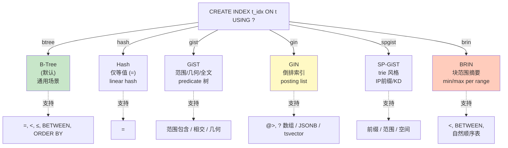
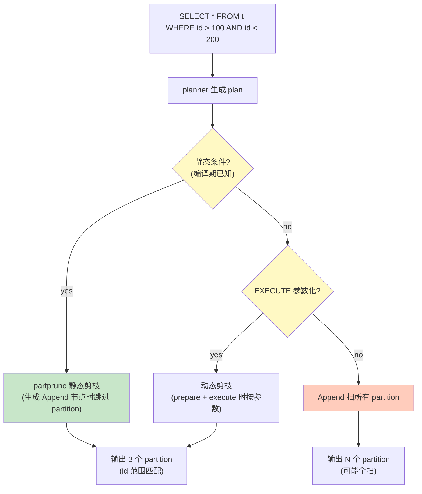

# 10 进阶特性

> 目标：把前面 9 章没覆盖的访问方法与执行层高级特性收口：其他 access method（hash/gist/gin/spgist/brin）、并行执行、分区、FDW、JIT、logical replication。这一章不要求每项精通，但需要知道“这些都怎么入手”。

## 10.1 五大 AM 对照

| AM | 适用场景 | 数据结构 | 关键文件 |
| --- | --- | --- | --- |
| **hash** | 等值查询（=） | linear hash | `access/hash/` |
| **gist** | 范围/几何/全文 | 平衡树（R-tree 变种） | `access/gist/` |
| **gin** | 倒排（全文/数组/JSONB） | posting list | `access/gin/` |
| **spgist** | 空间/前缀树 | 树 | `access/spgist/` |
| **brin** | 大表范围（自然顺序） | block range summary | `access/brin/` |

### 10.1.1 hash

PG 10+ 是 **linear hash**（按 bucket 顺序扩展）：

```
src/backend/access/hash/hash.c
src/backend/access/hash/hashinsert.c
src/backend/access/hash/hashsearch.c
src/backend/access/hash/hashutil.c
src/backend/access/hash/hash_xlog.c
```

`hash_xlog.c` 负责 redo。要点：
- split 是顺序的，不是随机的（这是 linear hash 的特性）
- 不必重启即可 split（SGI 时代要 restart，PG 10 改为 inline split）

### 10.1.2 gist

R-tree 变种，每个 internal node 用 **predicate** 描述子空间：

```
src/backend/access/gist/gist.c
src/backend/access/gist/gistbuild.c
src/backend/access/gist/gistscan.c
src/backend/access/gist/gistxlog.c
```

代码风格：每个 opclass 提供 7 个支持函数（`consistent`、`union`、`compress`、`decompress`、`penalty`、`same`、`fetch`）。

### 10.1.3 gin

倒排索引：`term → posting list`：

```
src/backend/access/gin/gininsert.c
src/backend/access/gin/ginbtree.c
src/backend/access/gin/ginscan.c
src/backend/access/gin/ginvacuum.c
src/backend/access/gin/ginxlog.c
```

特点：
- **fastupdate**（GUC）把新 term 缓存在 `ginPendingList`，合并周期刷新
- posting tree 是 B-Tree（嵌套）

### 10.1.4 spgist

基于 trie 的非平衡树：

```
src/backend/access/spgist/spginsert.c
src/backend/access/spgist/spgscan.c
src/backend/access/spgist/spgutils.c
src/backend/access/spgist/spgvacuum.c
src/backend/access/spgist/spgxlog.c
```

适合：IP 前缀、电话号码前缀、点（KD-tree 风格）。

### 10.1.5 brin（块范围摘要）

只存每 block range 的 min/max/sum/avg 等摘要：

```
src/backend/access/brin/brin.c
src/backend/access/brin/brin_pageops.c
src/backend/access/brin/brin_xlog.c
```

特点：
- 索引小（几 KB 到几 MB）
- 范围查询快；等值查询慢（要在 heap 验）
- `pages_per_range` 控制粒度

## 10.2 并行执行

`src/backend/executor/execParallel.c` 是入口。

### 10.2.1 触发条件

```sql
SET max_parallel_workers_per_gather = 4;
SET parallel_tuple_cost = 0;
```

优化器发现 plan 代价高于阈值时插入 `Gather` 节点。

### 10.2.2 流程

```
master backend (Gather)
   ├── 启动 N 个 worker (动态共享内存 dsm + TupleQueue)
   └── Worker 跑 plan 子树
       └── 发出 tuple 到 queue
           └── master 从 queue 收集 → 给上层
```

`TupleQueue` 是 `src/backend/executor/tqueue.c`。

### 10.2.3 哪些节点可以并行

- 扫描：SeqScan / IndexScan / IndexOnlyScan / CustomScan（FDW）
- 聚合：HashAgg（PG 16+ 部分场景）
- Hash join 的 build side（部分）
- Append（PG 16+）

### 10.2.4 关键 GUC

- `max_parallel_workers` (default 8)
- `max_parallel_workers_per_gather` (default 2)
- `parallel_leader_participation`
- `parallel_tuple_cost`
- `parallel_setup_cost`

### 10.2.5 观察并行

```sql
EXPLAIN (ANALYZE, VERBOSE) SELECT count(*) FROM big;
-- Gather 节点
--   Workers Planned/Launched
--   Workers Actual
```

`pg_stat_activity` 里也能看到并行 worker 的 PID。

## 10.3 分区

PG 10+ 内置三种：
- **RANGE**：`CREATE TABLE t PARTITION BY RANGE (id)`
- **LIST**：`PARTITION BY LIST (region)`
- **HASH**：`PARTITION BY HASH (id)`（PG 11+）

### 10.3.1 分区剪枝

优化器生成 plan 时会跳过不相关的 partition：
- 静态剪枝：`WHERE id BETWEEN 100 AND 200` 时
- 动态剪枝：`PREPARE` + `EXECUTE` 时按参数剪

`src/backend/partitioning/partprune.c`。

### 10.3.2 Append 节点

多个 partition 在 plan 层合并为 `Append` 节点。

### 10.3.3 分区 + 并行

PG 14+ 支持并行 Append（每个 partition 一个 worker）。

### 10.3.4 分区表 + 索引

- `CREATE INDEX ON parent`：PG 11+ 自动为每个 partition 创建
- 分区表与 unique constraint 关系复杂：unique 必须包含分区键

## 10.4 FDW（Foreign Data Wrapper）

`src/backend/foreign/` + `src/include/foreign/`：

```
src/backend/foreign/foreign.c
src/backend/foreign/fdwapi.c
```

FDW 是 PG 的“连接外部数据源”机制。

### 10.4.1 自定义 FDW

必须实现 9 个 handler 函数（`FdwRoutine`）：

```c
typedef struct FdwRoutine {
    PlanForeignModify_function      PlanForeignModify;
    BeginForeignModify_function      BeginForeignModify;
    ExecForeignInsert_function       ExecForeignInsert;
    ...
    GetForeignRelSize_function       GetForeignRelSize;
    GetForeignPaths_function         GetForeignPaths;
    GetForeignPlan_function          GetForeignPlan;
    BeginForeignScan_function        BeginForeignScan;
    IterateForeignScan_function      IterateForeignScan;
    ReScanForeignScan_function       ReScanForeignScan;
    EndForeignScan_function          EndForeignScan;
    AnalyzeForeignTable_function     AnalyzeForeignTable;
} FdwRoutine;
```

### 10.4.2 常用 FDW

- `postgres_fdw`：跨 PG 节点
- `file_fdw`：读 CSV / 二进制文件
- `mysql_fdw` / `oracle_fdw`：第三方

## 10.5 JIT

PG 11+ 引入 LLVM-based JIT 编译：

```sql
SET jit = on;
SET jit_above_cost = 100000;
SET jit_inline_above_cost = 500000;
SET jit_optimize_above_cost = 500000;
```

源码：
- `src/backend/jit/llvm/`（用 LLVM 库）
- `src/backend/jit/jit.c`

可加速：
- 表达式求值（`WHERE a + b > c`）
- tuple deforming

不可加速：
- 谓词下推（要看 FDW）

## 10.6 逻辑复制

PG 10+ 原生 logical replication：

- `CREATE PUBLICATION` 定义要发布的表
- `CREATE SUBSCRIPTION ... CONNECTION '...'` 在另一节点订阅
- `pgoutput` 是默认的 output plugin

源码：
- `src/backend/replication/logic/`：复制协议
- `src/backend/replication/pgoutput/`：pgoutput
- `src/backend/replication/walsummarizer.c`：PG 16+ 的 WAL 摘要

要点：
- logical decoding 从 WAL 提取 tuple changes（用 ReorderBuffer）
- `wal_level = logical`
- 支持 `ROW` 与 `STATEMENT`（推荐 ROW）

## 10.7 进程内并行：扩展

PG 的扩展系统允许：
- 自定义数据类型
- 自定义函数（C / PL/pgSQL / Python 等）
- 自定义 access method（注册到 `rmgr` 或 `indextuple`）
- 自定义 background worker
- 自定义 fdw

GUC 控制 `shared_preload_libraries` 决定哪些扩展预加载。

## 10.8 pg_stat 体系

PG 16+ 引入统一的 `pg_stat_*`：

- `pg_stat_statements`：所有 SQL 的统计
- `pg_stat_io`：IO 统计（新增）
- `pg_stat_progress_vacuum` / `_cluster` / `_create_index` / `_analyze` / `_basebackup` / `_copy`

源码在 `src/backend/utils/activity/pgstat_*.c`。

## 10.9 测试与工具

| 工具 | 路径 | 用途 |
| --- | --- | --- |
| `pg_regress` | `src/test/regress/` | SQL 回归 |
| `isolationtester` | `src/test/isolation/` | 并发测试 |
| `pg_isolation_regress` | | 同时跑上述两类 |
| `pg_upgrade` | `src/bin/pg_upgrade/` | 主版本升级 |
| `pg_basebackup` | `src/bin/pg_basebackup/` | 基础备份 |
| `pg_dump` / `pg_restore` | `src/bin/pg_dump/` | 逻辑导出 |
| `pg_waldump` / `pg_xlogdump` | `src/bin/pg_waldump/` | WAL 解析 |

### 10.9.1 跑回归测试

```bash
cd build
meson test -C build                              # 全部
meson test -C build -t 5                         # 慢测试
meson test -C build -R "btree"                   # 只跑 btree
```

### 10.9.2 TAP 测试

PG 11+ 用 TAP 框架：

```bash
make -C src/test/recovery/ check
```

## 10.10 实战

### 10.10.1 启用 hash 索引

```sql
-- 注意：PG 10 起 hash 索引写 WAL，不再 crash-unsafe
postgres=# CREATE INDEX t_hash ON t USING hash (id);
```

### 10.10.2 启用 BRIN

```sql
postgres=# CREATE INDEX t_brin ON t USING brin (id) WITH (pages_per_range=32);
```

### 10.10.3 看并行

```sql
postgres=# CREATE TABLE big AS SELECT g AS id FROM generate_series(1, 10000000) g;
postgres=# SELECT count(*) FROM big;
postgres=# SET max_parallel_workers_per_gather = 4;
postgres=# EXPLAIN (ANALYZE) SELECT count(*) FROM big;
```

### 10.10.4 看 JIT

```sql
postgres=# SET jit = on;
postgres=# SET jit_above_cost = 1;
postgres=# EXPLAIN (ANALYZE) SELECT sum(a*b) FROM big a JOIN big b USING (id);
```

### 10.10.5 看 logical replication

```sql
-- primary
CREATE PUBLICATION p FOR TABLE t;
-- another node
CREATE SUBSCRIPTION s CONNECTION 'host=localhost user=postgres dbname=postgres'
           PUBLICATION p;
```

## 10.11 进一步深入的方向

完成 L4 后，可以挑一个方向深挖：

| 方向 | 入门文件 |
| --- | --- |
| **优化器** | `src/backend/optimizer/README`、`pathnodes.h` |
| **执行器并行** | `execParallel.c`、`nodeGather.c` |
| **逻辑复制 / logical decoding** | `reorderbuffer.c`、`pgoutput.c` |
| **贡献 PG** | `src/backend/access/transam/README`、CF bot、pgsql-hackers |
| **FDW / 自定义 AM** | 文档：“Writing a Foreign Data Wrapper”、“Writing an access method” |
| **新特性（async I/O / incremental sort / MERGE）** | commitfest.postgresql.org 跟踪 |

## 10.12 推荐的源码阅读顺序（最终版）

按本系列 10 章走完一遍后，再做一遍 **倒序读**——从 `postgres.c:PostgresMain` 出发，**只跟踪一条 `SELECT * FROM t WHERE id = 1`**：

1. `postgres.c:PostgresMain`
2. → `pg_parse_query`
3. → `pg_analyze`（看一眼 rtable）
4. → `pg_rewrite`（无 view，跳过）
5. → `pg_plan_queries`（看一眼 plan 树）
6. → `ExecutorStart`（`InitPlan` → `ExecInitSeqScan` → `ExecInitResultRelation`）
8. → `ExecProcNode` 反复跑
9. → `heap_getnext` → `heapgetpage` → `ReadBuffer` → `smgrread` → `pwrite()`
10. → HeapTupleSatisfiesMVCC → 命中 → 序列化 → 客户端

**手画一遍这条调用链**，并在每跳加一句“这一步做了什么”。能 30 分钟内闭卷画出来，L1-L4 就过关了。

之后可以挑一个方向（推荐 **优化器** 或 **B-Tree**），从这条主干向深处挖。

## 10.13 推荐资源

- 官方手册：https://www.postgresql.org/docs/18/
- 源码：`https://git.postgresql.org/gitweb/?p=postgresql.git`
- 邮件列表：`pgsql-hackers@lists.postgresql.org`
- 论文：Michael Stonebraker “The Design of the Postgres Rules System” 等
- 博客：
  - Hironobu SUZUKI（Pg internals）
  - Bruce Momjian 的 PPT
  - depesz（explain.depesz.com）
- 工具：
  - `explain.dalibo.com`
  - `pg_plan_guarantee` extension
  - `pgsentinel`
  - `pgspot`

## 10.14 收尾

整个系列从 0 写到 10 章，把 PG 18 源码的存储引擎主线串了起来。

如果有一条最核心的心得，那就是：**PG 没有 undo log**。所有“历史版本”都在 heap 里；所有“恢复”都只 redo 不 undo；所有“清理”都靠 vacuum。

理解这一点，前面 9 章的很多“为什么”就都能串起来：
- 为什么 heap 会有死 tuple → 因为没 undo
- 为什么 MVCC 的可见性靠 t_xmin/t_xmax → 因为没有专门的事务回滚记录
- 为什么 heap_insert 写 tuple 时就要写 WAL → 因为没有 in-place 撤回能力
- 为什么 vacuum 比 InnoDB purge 更重要 → 因为 PG 没法从 undo 里直接扔掉

当你能把每条 SQL 行为 **用这一条原则** 解释清楚，就已经是 **资深存储引擎内核开发人员** 了。


## 10.19 图示

### 10.19.1 五种访问方法对比



### 10.19.2 并行执行器拓扑

```mermaid
graph TB
    M["master backend<br/>(Gather)"]
    
    M -->|DSM TupleQueue| W1["worker 1<br/>(SeqScan / HashAgg / ...)"]
    M -->|DSM TupleQueue| W2["worker 2"]
    M -->|DSM TupleQueue| W3["worker 3"]
    M -->|DSM TupleQueue| W4["worker N"]
    
    subgraph DSM[Dynamic Shared Memory]
        TQ[1["TupleQueue<br/>(tqueue.c)"]
    end
    
    M -.-> TQ
    W1 -.-> TQ
    W2 -.-> TQ
    
    style M fill:#fff9c4
    style DSM fill:#e3f2fd
```

### 10.19.3 分区剪枝流程



### 10.19.4 Logical Decoding 数据管线


> 图示配套源码：`src/backend/access/{hash,gist,gin,spgist,brin}/`、`src/backend/executor/{execParallel.c,nodeGather.c,tqueue.c}`、`src/backend/partitioning/partprune.c`、`src/backend/replication/{logic/reorderbuffer.c,logic/decode.c,pgoutput/pgoutput.c,worker/worker.c}`。
