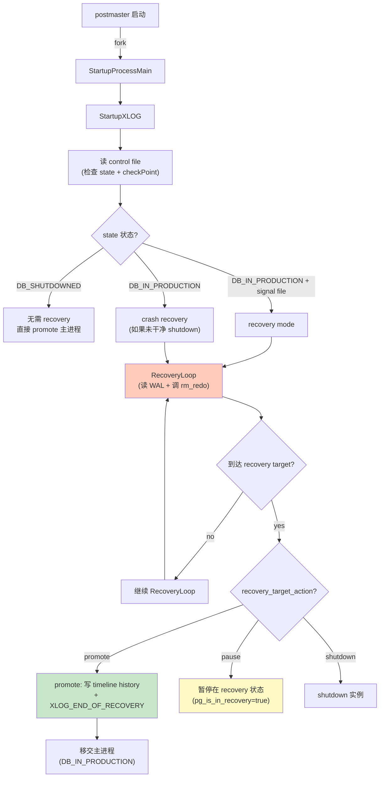
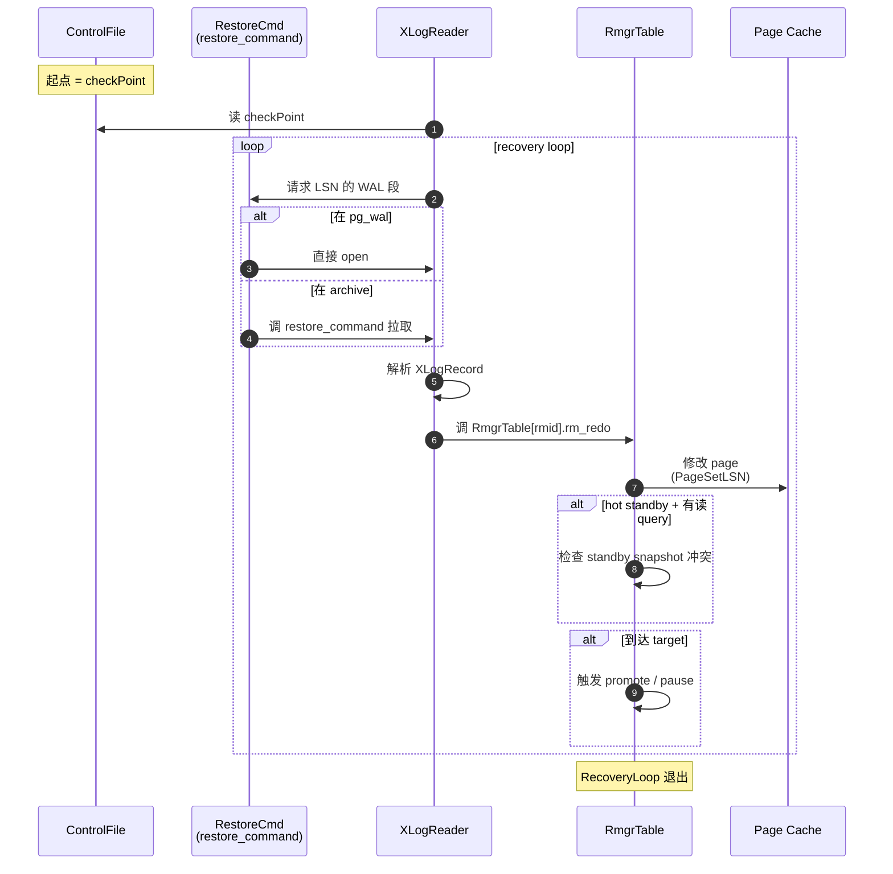
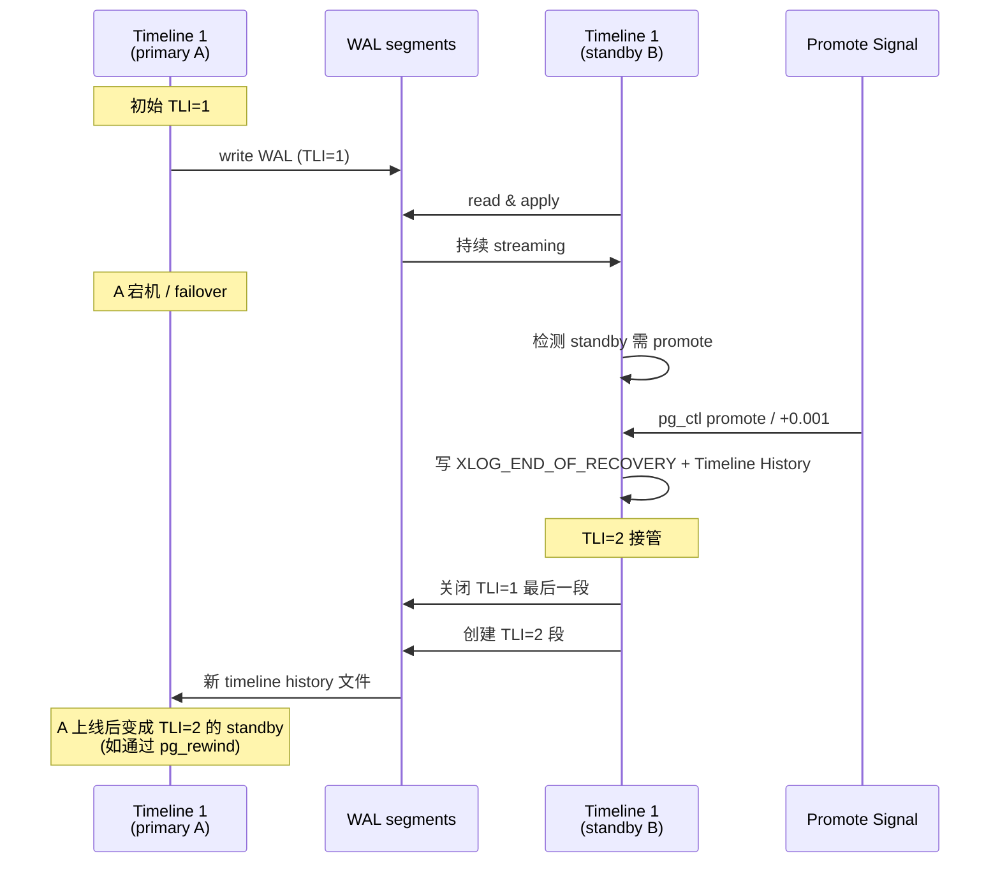
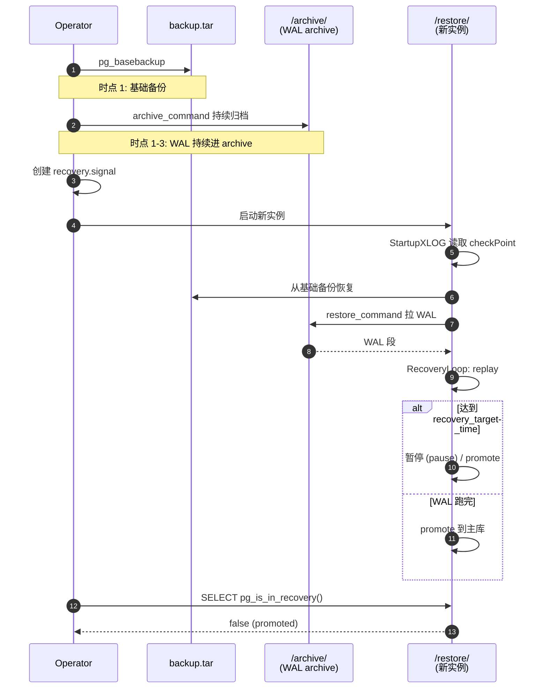

# 11 崩溃恢复深入

> 目标：把 PG 的 crash recovery 单独成章，吃透 redo 全流程、timeline 切换、PITR 的内部细节、partial restore、recovery target 与 promote。**这是"内核工程师"与"会用 PG"的关键分水岭**，因为很多线上故障都靠它定位。

## 11.1 恢复模型回顾

PG 的 WAL **只 redo 不 undo**。这意味着：
- 已 WAL 化的事务 ⇒ 一定要 redo
- 未 WAL 化的事务 ⇒ 丢失（即"提交前 crash"）
- 未提交但已 WAL 化的 ⇒ 通过 clog 标 ABORTED + vacuum 回收

对比：
- **InnoDB** 在 redo 后还会按 undo log 反向 rollback
- **PG** 直接靠 MVCC + clog 让 tuple 看不见，由 vacuum 清理

## 11.2 control file 与起点定位

`$PGDATA/global/pg_control` 是 recovery 起点。内容由 `src/backend/utils/misc/pg_controldata.c` 写。

关键字段（`src/include/catalog/pg_control.h`）：
```c
typedef struct ControlFileData {
    pg_crc32c  crc;
    uint64     pg_control_version;
    ...
    XLogRecPtr checkPoint;          // 最近一次 checkpoint redo point
    XLogRecPtr prevCheckPoint;
    ...
    TimeLineID checkPointCopyThisTime;  // checkpoint 时的 timeline
    TimeLineID minRecoveryPointTLI;
    XLogRecPtr minRecoveryPoint;
    ...
    pg_time_t  time;
    ...
} ControlFileData;
```

`pg_controldata $PGDATA` 命令读这个文件。

恢复时 startup process：
1. 读 control file → 拿 `checkPoint`
2. 从 `checkPoint` 开始读 WAL
3. replay 直到一致点

## 11.3 startup process 详解

`src/backend/postmaster/startup.c:StartupProcessMain()`：

```c
void StartupProcessMain(void)
{
    // 1. 读 control file，决定是否需要恢复
    if (ControlFile.state == DB_IN_PRODUCTION && !standby)
        exit;  // 正常启动，不需要恢复
    
    // 2. 走 redo 流程
    StartupXLOG();
}
```

`StartupXLOG()` (`src/backend/access/transam/xlogrecovery.c`) 是核心：

```c
void StartupXLOG(void)
{
    // 1. 解析 recovery.conf / GUC
    //    - restore_command
    //    - recovery_target_* （time/xid/name/include/pause）
    //    - recovery_target_timeline
    //    - standby_mode
    //    - archive_cleanup_command
    
    // 2. 找 checkpoint 起点
    
    // 3. 进入主循环：
    for (;;) {
        record = ReadRecord(xlogreader, ...);   // 读 WAL record
        if (record == NULL) break;
        
        // 4. apply
        RmgrTable[record->xl_rmid].rm_redo(record);
        
        // 5. 检查 recovery target 是否达成
        
        // 6. 检查是否 promote（接收 SIGUSR1）
    }
    
    // 7. 完成恢复，移交主进程
}
```

## 11.4 redo 主循环算法

`src/backend/access/transam/xlogrecovery.c:RecoveryLoop()`：

```c
void RecoveryLoop(void)
{
    bool recoveryStopsBefore = false;
    
    for (;;) {
        record = ReadRecord(xlogreader);
        if (record == NULL) break;
        
        // 1. 检查 timeline 切换
        //    (recovery_target_timeline = "latest" 时需要读 history 文件)
        if (record->xl_rmid == RM_XLOG_ID) {
            if (record->xl_info == XLOG_TIME_LINE_SWITCH) {
                // 切换 timeline
            }
        }
        
        // 2. 检查是否到达 recovery target
        if (recovery_target_set && reached_target(record)) {
            recoveryTargetReached = true;
            if (recovery_target_action == "p")
                break;  // promote
            else if (recovery_target_action == "s")
                ereport(FATAL, ...);  // shutdown
        }
        
        // 3. redo
        RmgrTable[record->xl_rmid].rm_redo(record);
        
        // 4. 处理 hot-standby feedback (standby 时)
        //    - xact_redo 标记 snapshot xmin
        //    - standby snapshot 维护
        
        // 5. 写 WAL 历史（recovery_done）
        
        // 6. 周期性刷 control file
    }
}
```

### 11.4.1 XLogReaderState

PG 用 `XLogReaderState` 抽象 WAL reader：

```c
typedef struct XLogReaderState {
    XLogPageReadPrivate *private_data;
    XLogRecPtr          currRecPtr;   // 当前 record 起点
    XLogRecPtr          EndRecPtr;    // 当前 record 结束
    char               *currPageBuf;  // 当前 page
    uint32              currPageTLI;
    DecodedBkpBlock     blocks[...];  // 解码后的 block 数据
    ...
} XLogReaderState;
```

每个 rmgr 在 redo 时从 `decoded_blocks[i]` 取所需字节。

## 11.5 Timeline History

PG 用 timeline ID (TLI) 处理多次 PITR / promote：

```
TLI 1: 初始
  └─ promote → TLI 2
TLI 2: 主库继续
  └─ 再次 promote / 切换 → TLI 3
```

时间线切换发生在：
- promote（standby → primary）
- 管理员手动指定 TLI
- cascading standby 多级链

切换时：
1. 当前 TLI 最后一段 WAL 关闭
2. 创建新 timeline history file：`pg_xlog/archive_status/<timeline>.history`
3. WAL 文件命名切换为新 TLI

```
000000010000000000000001  <- 老
000000010000000000000002  
00000002.history         <- 记录切换点
000000020000000000000003 <- 新 TLI
```

`XLogTimelineHistoryRead` 在 standby 切换时读 history 文件，知道哪些 TLI 段可以读。

## 11.6 PITR 完整流程

```bash
# 1. 基础备份
pg_basebackup -D /backup -F tar -X stream -P
# -X stream: 流式把 WAL 也一起备份（无需 archive_command）
# -X fetch: 备份结束时再 fetch WAL

# 2. 归档归档（如果有 archive_command）
postgres.conf:
archive_mode = on
archive_command = cp %p /archive/%f

# 3. 恢复
mkdir /restore
tar xf /backup/base.tar -C /restore
touch /restore/recovery.signal

cat >> /restore/postgresql.conf << EOF
restore_command = cp /archive/%f %p
recovery_target_time = "2026-08-18 12:00:00"
recovery_target_action = "pause"
EOF

# 4. 启动
pg_ctl -D /restore start

# 5. 验证（暂停状态）
psql -c "SELECT pg_is_in_recovery()"  -- true

# 6. 决定 promote 或停止
pg_ctl -D /restore promote        # promote
pg_ctl -D /restore stop           # 停止（保留状态）
```

`recovery.signal` 文件的存在触发恢复模式。

## 11.7 recovery target 的几种形式

```sql
recovery_target = immediate    -- 默认：跑到 end of WAL
recovery_target_time = ...     -- 时间点
recovery_target_xid = ...      -- 事务 ID
recovery_target_lsn = ...      -- LSN
recovery_target_name = ...     -- pg_create_restore_point() 创建的 named point
recovery_target_inclusive = true -- 默认 true；false 表示恢复到该点之前
recovery_target_action = pause | promote | shutdown
```

## 11.8 hot standby

PG 9.0+ 引入。恢复中允许只读查询。

```sql
postgres.conf (on standby):
hot_standby = on
max_standby_streaming_delay = 30s
max_standby_archive_delay = 30s
hot_standby_feedback = on
```

实现：
- replay 时维护 standby 的 snapshot xmin
- primary 通过 `hot_standby_feedback` 知道 standby 的"最老活跃 xid"
- primary 不 vacuum 比 standby xmin 更老的 tuple

冲突处理：
- standby 查询持有 snapshot，应用 replay 时遇到 tuple 删除 → cancel query (`max_standby_*_delay` 后)
- `vacuum_defer_cleanup_age`（PG 16+ 移除） 用来延迟 vacuum

## 11.9 recovery.conf 变迁

- **PG 11 及之前**：`recovery.conf` 是独立文件
- **PG 12+**：恢复参数移到 `postgresql.conf`，由 `recovery.signal` 触发恢复模式
- **PG 16+**：`recovery.conf` 完全废弃

## 11.10 partial restore / 表级恢复

PG 原生 **没有** 表级 PITR。只能恢复到整个实例的状态。但可以通过：
- logical replication + slot 配合
- `pg_dirtyread` 之类 extension
- 全量恢复 + 导出表

`restore_command` 与 `recovery_target_*` 只针对整个集群。

## 11.11 recovery 过程中的 WAL 行为

恢复期间：
- startup process **不**生成新的 WAL（只读 replay）
- standby mode 时 standby 会接收主库的 WAL（持续 replay）
- 如果在 promote 过程中 replay 到 time → 转换为主库，新 WAL 从那一刻起产生

## 11.12 实战

### 11.12.1 看 checkpoint LSN

```bash
pg_controldata $PGDATA | grep -iE "checkpoint|redo"
```

输出：
```
Latest checkpoint location:    0/4F4A8B0
Latest checkpoint's REDO location:    0/4F4A8B0
Latest checkpoint's TimeLineID:       1
```

### 11.12.2 强制崩溃恢复

```bash
# 1. 写入一些
psql -c "INSERT INTO t VALUES (100, crash_test);"

# 2. 检查 checkpoint 之前有 WAL
ls $PGDATA/pg_wal/

# 3. kill -9 模拟崩溃
kill -9 $(head -1 $PGDATA/postmaster.pid)

# 4. 启动
pg_ctl -D $PGDATA start
# 日志里会有
#   database system was interrupted; last known up at ...
#   starting backup recovery: ...
#   redo at ...
#   completed recovery: ...
#   database system is ready to accept connections
```

### 11.12.3 制造半写 page（模拟 torn write）

```bash
# 停库
pg_ctl -D $PGDATA stop

# 备份一个 page
cp $PGDATA/base/16384/<relfilenode> /tmp/page.bak

# 修改 page 中间几个字节（破坏 checksum）
dd if=/dev/urandom of=$PGDATA/base/16384/<relfilenode> bs=1 count=8    seek=4096 conv=notrunc

# 启动
pg_ctl -D $PGDATA start
# 可能会报：
#   WARNING:  page verification failed, calculated checksum ...
#   ERROR: invalid page in block ...
```

### 11.12.4 跟踪 startup process

```bash
gdb --args ./install/bin/postgres -D /tmp/pgdata
(gdb) set follow-fork-mode child
(gdb) b startup.c:StartupProcessMain
(gdb) b xlogrecovery.c:RecoveryLoop
(gdb) b heap_redo
(gdb) c
```

### 11.12.5 PITR 演练

```bash
# 1. 启动 + archive
mkdir /tmp/archive
postgres.conf:
    archive_mode = on
    archive_command = cp %p /tmp/archive/%f
pg_ctl -D $PGDATA restart

# 2. 基线
psql -c "CREATE TABLE pitr (id int, ts timestamp default now());"
psql -c "INSERT INTO pitr VALUES (1);"
psql -c "SELECT pg_switch_wal();"   # 强制归档

# 4. 制造更多数据
psql -c "INSERT INTO pitr VALUES (2);"
psql -c "SELECT pg_switch_wal();"

# 5. 记下时间
date +%Y-%m-%d %H:%M:%S

# 6. 再写
psql -c "INSERT INTO pitr VALUES (3);"

# 7. 备份 + 恢复（按 11.6 流程）
```

恢复完成后 `SELECT * FROM pitr` 应只看到 1, 2（不到第 3 行）。

### 11.12.6 timeline 演练

```bash
# 1. 主库 A
pg_ctl -D /tmp/pga start

# 2. standby B
pg_basebackup -D /tmp/pgb -R
pg_ctl -D /tmp/pgb start

# 3. A 上插数据
psql -h /tmp -p 5432 -c "INSERT INTO pitr VALUES (100);"

# 4. promote B
pg_ctl -D /tmp/pgb promote
# A 上的 B 变成 TLI 2

# 5. 看 history
ls /tmp/pga/pg_wal/*.history
cat /tmp/pga/pg_wal/00000002.history
```

## 11.13 timeline 与复制链路

```
TLI 1: A (primary)
        │
        │ streaming
        ▼
TLI 1: B (standby)
        │
        │ streaming (cascade)
        ▼
TLI 1: C (cascading standby)
```

如果 A promote 出 TLI 2，B 与 C 会感知到新的 timeline history 文件并切换。

`recovery_target_timeline = latest` 让 standby 走到最新 TLI。

## 11.14 常见问题与排查

| 问题 | 排查 |
| --- | --- |
| 恢复卡住 | `pg_is_in_recovery()`、检查 restore_command、看 startup log |
| recovery target 不达 | 检查 `recovery_target_*` 配置、看 WAL 是否被 archive 收齐 |
| timeline 切换异常 | 检查 history 文件、recovery_target_timeline 设置 |
| standby 查询被 cancel | `max_standby_*_delay` 调大、`hot_standby_feedback = on` |
| WAL 缺失 | restore_command 返回 non-zero → startup 停住 |
| PITR 后数据少 | 可能是 archive_command 漏写 WAL 段 |

## 11.15 与 MySQL/Mongo 对照

| 维度 | PG | MySQL InnoDB | Mongo |
| --- | --- | --- | --- |
| 持久化基础 | XLOG | redo + undo + binlog | journal |
| Binlog/ | 物理逻辑混合 | logical（binlog） | logical |
| PITR | 整实例 | binlog 整实例 | oplog 整实例 |
| 时间线 | TLI | relay log + position | — |
| 表级恢复 | 不支持 | 不支持 | 不支持 |
| 增量 checkpoint | 是 | 是 | 是 |
| Promote | 自动 / manual | GTID + orchestrator | — |

## 11.16 小结

- Recovery 只 redo 不 undo；事务提交状态由 clog 决定。
- 起点 = control file.checkPoint；终点 = recovery target。
- Timeline 是 PITR + promote 的基础。
- Hot standby 让恢复过程中可读。
- PG 原生没有表级 PITR，绕道方案见 11.10。

下一章 12 进入物理复制 — 这是 PG 高可用与读写分离的基础。


## 11.17 图示

### 11.17.1 startup process 决策总览



### 11.17.2 RecoveryLoop 数据流



### 11.17.3 Timeline 切换机制



### 11.17.4 PITR 完整时序



> 图示配套源码：`src/backend/postmaster/{startup.c,postmaster.c}`、`src/backend/access/transam/{xlogrecovery.c,xlog.c,xlogarchive.c,timeline.c}`、`src/include/catalog/pg_control.h`。
