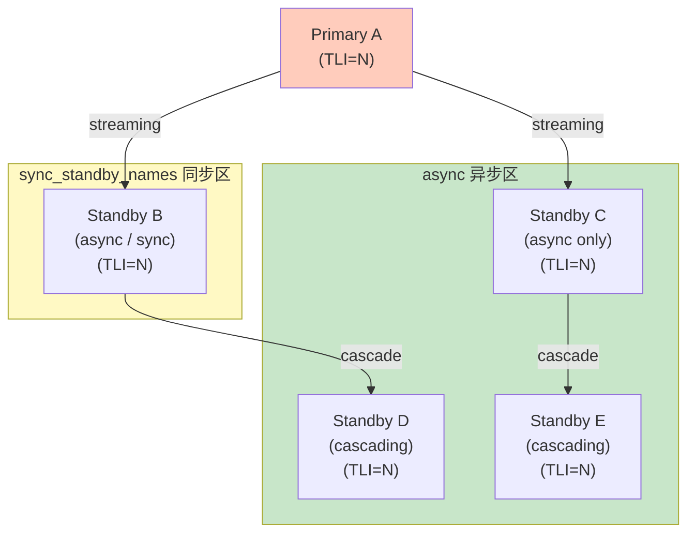
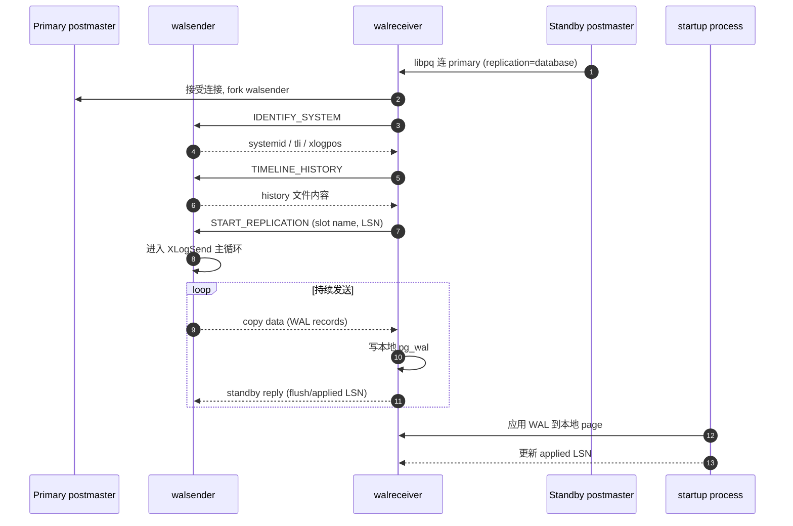
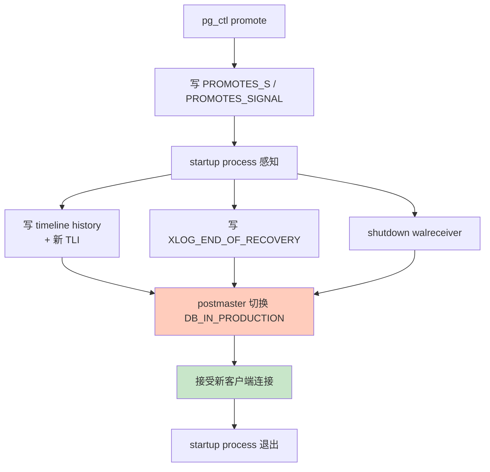
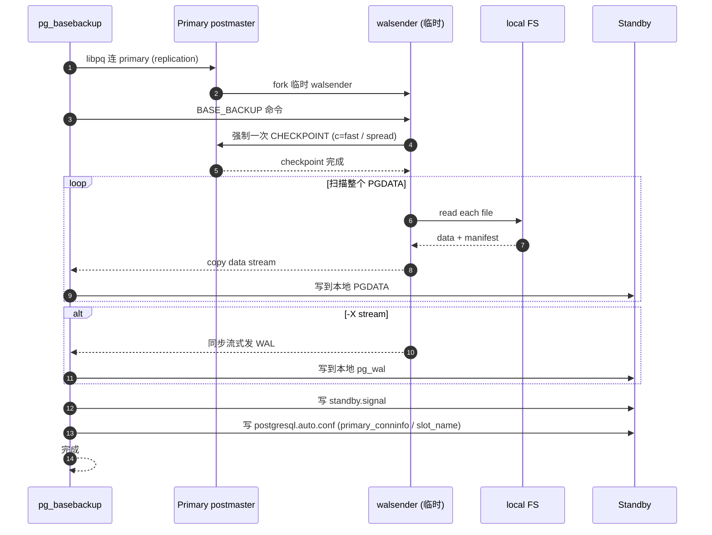

# 12 物理复制深入

> 目标：吃透 PG 的 streaming replication 全套机制——wal sender、wal receiver、replication slot、sync vs async、cascade、failover、monitoring。**这是读写分离、高可用、灾备的基石**。

## 12.1 复制架构概览

```
                        primary (postmaster)
                            │
              ┌─────────────┼─────────────┐
              │             │             │
         wal sender     wal sender    wal sender
              │             │             │
              ▼             ▼             ▼
         standby A     standby B     standby C
         (receiver)    (receiver)    (receiver)
            │              │              │
         startup        startup        startup
       (apply redo)  (apply redo)  (apply redo)
```

每个 standby 都：
1. wal receiver 连到 primary（PG 17+ 默认连 5432；早期连单独的 replication 端口）
2. 接收 WAL，流式写到本地 pg_wal
3. startup process replay WAL（与 crash recovery 同一代码路径）

## 12.2 walsender 进程

`src/backend/replication/walsender.c:WalsenderMain()`：

```c
void WalsenderMain(void)
{
    // 1. 解析连接参数（replication=database）
    // 2. 进入主循环：
    for (;;) {
        // a) 读 standby 发的请求
        XLogReadPageReq req = read_message();
        
        // b) 从本地 WAL 队列读 record
        //    - WALSendLock 持有
        //    - 跳过没刷盘的（除非 streaming）
        
        // c) 按协议组装（copy data）
        SendXlogData(req);
        
        // d) 处理 standby 的 standby reply message
        //    - 上报 flushed / applied LSN
        //    - 上报 hot standby feedback
    }
}
```

`pg_stat_replication` 视图正是读 `WalSndCtl` 结构。

## 12.3 walreceiver 进程

`src/backend/replication/walreceiver.c:walreceiver_main()`：

```c
void walreceiver_main(void)
{
    // 1. 连接 primary（libpq 协议）
    //    connection_string = primary_conninfo
    
    // 2. 解析 timeline
    
    // 3. 主循环：
    for (;;) {
        // a) 读 timeline history（identify_system → TIMELINE_HISTORY）
        // b) 拉 primary 的 timeline + WAL
        // c) 写到本地 pg_wal
        // d) 周期发 standby reply message（flush/applied LSN）
        // e) 接收 hot standby feedback
    }
}
```

## 12.4 replication slot

PG 9.4 引入。**关键作用**：让 primary 知道 standby “需要”哪些 WAL，从而不提前回收。

```sql
postgres=# SELECT pg_create_physical_replication_slot('standby_a');
postgres=# SELECT pg_create_physical_replication_slot('standby_b', true);  -- reserve_wal
```

底层：`src/backend/replication/slot.c`：

```c
typedef struct ReplicationSlot {
    char       slot_name[NAMEDATALEN];
    Oid        plugin;          // 物理 slot = InvalidOid
    XLogRecPtr restart_lsn;     // standby 进度
    ...
    XLogRecPtr confirmed_flush_lsn;
} ReplicationSlot;
```

- **物理 slot**：plugin 字段为 InvalidOid
- **逻辑 slot**：plugin 非空，restart_lsn 是解码起点

slot 数据存在 `$PGDATA/pg_replslot/<name>`：

```
state         # 文件，记录 restart_lsn
# 两阶段：wal 里存的 slot 元数据 + 文件里存的状态
```

### 12.4.1 slot 的副作用

如果 standby 长时间下线，**primary 不会回收该 slot 之后的 WAL**。后果：
- pg_wal 越来越多
- 最终磁盘满 → primary 挂掉

运维注意：
- 监控：`SELECT slot_name, restart_lsn, pg_size_pretty(pg_wal_lsn_diff(pg_current_wal_lsn(), restart_lsn)) FROM pg_replication_slots;`
- 删除无用 slot：`SELECT pg_drop_replication_slot('name');`

### 12.4.2 sync vs async slot

物理 slot 只是"保留 WAL"，不直接与同步复制绑定。同步复制由 `synchronous_standby_names` 控制（见 12.6）。

## 12.5 同步复制

`synchronous_commit` 参数：
- `on`：fsync WAL 后 commit
- `remote_apply`：等 standby replay 才 commit
- `remote_write`：等 standby write 才 commit
- `off`：本地 fsync 后即 commit

`synchronous_standby_names` 配置同步候选：
- `FIRST 1 (s1, s3)`：任一即可
- `ANY 2 (s1, s2, s3)`：任意两个
- `[*]`：所有已 connected

```c
// xlog.c:SyncRepWaitForLSN(lsn, ...)
void SyncRepWaitForLSN(XLogRecPtr lsn, bool commit)
{
    // 1. 检查 synchronous_commit
    if (MySyncRepQueue == NULL) return;
    
    // 2. 等待 latch
    //    - sync_standby_defined + sync_standby_priority > 0
    //    - 等 LSN ≤ LSN[latch][priority]
    WaitLatch(MyLatch, WL_LATCH_SET | WL_TIMEOUT, ...);
}
```

## 12.6 cascade replication

```sql
-- A (primary)
wal_level = replica
max_wal_senders = 10
synchronous_standby_names = 'B'

-- B (mid-tier standby)
primary_conninfo = 'host=A ...'
# 注意：B 也得开 max_wal_senders 才能继续向下游发
```

B 既接收 A 的 WAL 又向下游 C 发。要点：
- B 的 primary_slot_name / primary_conninfo 不影响 B 作为 sender
- B 自己要启 max_wal_senders

## 12.7 hot standby 与 apply 冲突

详见 11.8。补充几个内部细节：

- startup process 在 replay 时维护 **standby snapshot**（`standby_xmin`）
- 通过 `hot_standby_feedback = on`，primary vacuum 知道不能清理 standby 看到的 tuple
- 否则 standby 查询可能被 cancel（`max_standby_streaming_delay` 默认 30s）

## 12.8 pg_basebackup 内部

```bash
pg_basebackup -D /backup -h primary -P -X stream -R -c fast
```

内部实现 `src/backend/backup/basebackup.c`：

1. **CONNECT**（协议），声明为 replication 连接
2. **IDENTIFY_SYSTEM** → 拿 systemid / timeline / xlogpos
3. **START_REPLICATION** 或 **BASE_BACKUP** 命令
4. BASE_BACKUP 流程：
   - 强制一次 checkpoint（`-c fast` 或 `-c spread`）
   - 启动一个内部 walsender，流式把整个数据目录打包发送
   - manifest 信息写在 `backup_manifest`
   - `-X stream` 同步把 WAL 也一起发送

`-R` 自动生成 `standby.signal` 与 `postgresql.auto.conf` 里的 primary_conninfo / primary_slot_name。

## 12.9 监控复制

### 12.9.1 primary 端

```sql
postgres=# SELECT pid, usename, application_name, client_addr,
                  state, sync_state, write_lsn, flush_lsn, replay_lsn,
                  sent_lsn, replay_lag
           FROM pg_stat_replication;
```

字段：
- `sent_lsn`：walsender 已发
- `write_lsn`：standby 写入 pg_wal
- `flush_lsn`：standby fsync
- `replay_lsn`：已 replay
- `replay_lag`：延迟

### 12.9.2 standby 端

```sql
postgres=# SELECT pid, status, receive_start_lsn, received_lsn,
                  last_msg_send_time, last_msg_receipt_time,
                  latest_end_lsn, slot_name, conninfo
           FROM pg_stat_wal_receiver;
```

`status` 字段：
- `startup`：连接中
- `streaming`：正常 streaming
- `catchup`：追赶
- `stopping`：停止中

### 12.9.3 滞后报警

```sql
SELECT slot_name,
       pg_size_pretty(pg_wal_lsn_diff(pg_current_wal_lsn(), restart_lsn)) AS lag_size
FROM pg_replication_slots;
```

lag 越大说明 standby 越落后或网络越慢。

## 12.10 promote 与 failover

### 12.10.1 promote 流程

```bash
# 1. 触发
pg_ctl -D /tmp/pgb promote
# 或 SELECT pg_promote();
```

`src/backend/postmaster/postmaster.c:ProcessPromoteSignal()`：

```c
void ProcessPromoteSignal(void)
{
    // 1. 写 promote signal file
    //    $PGDATA/PROMOTE_SIGNAL 或 + 或 +0.001
    // 2. 等 startup process 感知
    // 3. startup: 写 timeline history + XLOG_END_OF_RECOVERY
    // 4. shutdown WAL receiver
    // 5. 切换为 DB_IN_PRODUCTION
}
```

### 12.10.2 switchover vs failover

- **switchover**：优雅切换，主库先等所有 standby 同步再关
- **failover**：强制切换，主库可能丢失最后一段未同步的 WAL

PG 原生没有自动 failover，需配合 Patroni / repmgr / pg_auto_failover 等工具。

### 12.10.3 pg_rewind

切换后让老主库能成为新主库的 standby：

```bash
pg_rewind --target-pgdata=/tmp/old_pga --source-server="host=new_primary ..."
```

PG 9.5+ 通过识别 timeline history 自动同步。

## 12.11 物理复制的限制

| 限制 | 原因 | 绕过 |
| --- | --- | --- |
| 复制粒度 = cluster | WAL 是全实例级别 | logical replication / FDW |
| 不支持 DDL 转换 | pg_dump init db 是 schema 同步 | logical + DDL replication（PG 16+ 部分） |
| 同步复制只支持 ≥1 个 standby | quorum 限制 | quorom 协议需外部工具 |
| 不能跨大版本升级 | 物理格式变化 | pg_upgrade / logical replication |

## 12.12 实战

### 12.12.1 搭建同步复制

```bash
# primary
pg_ctl -D /tmp/pga start -o "-c synchronous_standby_names='b' -c synchronous_commit=on"

# standby
pg_basebackup -D /tmp/pgb -R -P -c fast
# postgresql.auto.conf 里加 application_name='b'
pg_ctl -D /tmp/pgb start

# 验证
psql -h /tmp/pga -c "SELECT * FROM pg_stat_replication;"
# sync_state 应为 'sync'

# 测试：primary 上 INSERT，看 INSERT 是否等到 standby replay
psql -h /tmp/pga -c "INSERT INTO t VALUES (1);"   # 阻塞等
# 在 standby 上：
psql -h /tmp/pgb -c "SELECT * FROM t;"
# 回主库，INSERT 完成
```

### 12.12.2 cascade 复制

```bash
# 三节点：A -> B -> C
# A 正常配置
# B 配置：
# - primary_conninfo = 'host=A ...'
# - max_wal_senders = 5
# - hot_standby = on
# C 配置：
# - primary_conninfo = 'host=B ...'
```

### 12.12.3 模拟 lag

```bash
# 1. 在 primary 上持续 INSERT
psql -h /tmp/pga -c "INSERT INTO big SELECT generate_series(1,10000000);"

# 2. 在 standby 上看 replay_lag
psql -h /tmp/pgb -c "SELECT replay_lag FROM pg_stat_wal_receiver;"

# 3. 在 standby 上 GDB 暂停 startup
gdb --args ./install/bin/postgres -D /tmp/pgb
(gdb) b startup.c:StartupProcessMain
(gdb) c
```

### 12.12.4 promote 演练

```bash
# 1. 主备都活着
# 2. 备：pg_ctl promote
# 3. 老主库现在成了"老 standby"
# 4. 看 timeline
ls /tmp/pgb/pg_wal/*.history
```

### 12.12.5 pg_rewind 演练

```bash
# 1. 切换：promote B
# 2. A 上还有一段没同步的写入（failover 前的）
# 3. 在 A 上：
pg_ctl -D /tmp/pga stop
pg_rewind --target-pgdata=/tmp/pga --source-server="host=B ..."
# 4. A 作为 B 的新 standby
pg_ctl -D /tmp/pga start
```

### 12.12.6 GDB 跟踪 walsender

```bash
gdb --args ./install/bin/postgres -D /tmp/pga
(gdb) set follow-fork-mode child
(gdb) b walsender.c:WalsenderMain
(gdb) b walsender.c:XLogSend
(gdb) c
```

用 psql -h pgb 连一次 standby（如果是 hot_standby=on），触发 walsender 子进程。

## 12.13 与 MySQL 对照

| 维度 | PG | MySQL |
| --- | --- | --- |
| 协议 | streaming replication | binlog + GTID |
| Slot | 物理 + 逻辑 slot | 无原生 slot |
| Sync | 同步复制（on/remote_apply） | semi-sync（ack） |
| Slot 回收 | 不会自动 | binlog 自动 purge |
| Promote | pg_ctl promote / pg_promote() | restart with read_only=0 |
| DDL 同步 | 原生不复制 | 默认复制 |
| 大版本 | pg_upgrade / logical | in-place / logical |

## 12.14 小结

- 物理复制 = streaming WAL + replay，是 PG HA / DR 的核心
- slot 防 WAL 提前回收，但要避免长 lagging slot 撑满磁盘
- 同步 vs 异步取决于业务对 RPO 的容忍度
- promote / pg_rewind 配合 failover 工具（Patroni）实现自动 HA
- 与 logical replication 的对比见下一章

下一章 13 进入逻辑复制 —— 跨大版本、跨表、跨粒度的复制。


## 12.15 图示

### 12.15.1 Streaming Replication 拓扑



### 12.15.2 walsender / walreceiver 交互



### 12.15.3 Replication Slot 状态机

```mermaid
stateDiagram-v2
    [*] --> Created: CREATE_SLOT 命令
    
    Created --> Reserved: reserve_wal=true<br/>(立刻 prevent WAL recycle)
    Created --> Active: START_REPLICATION 连接
    
    Active --> Streaming: 持续发 WAL + 收 standby reply
    Streaming --> Lagging: restart_lsn &lt; primary 当前 LSN
    
    state Lagging {
        [*] --> CheckLag
        CheckLag --> Warn: lag &gt; 阈值
        CheckLag --> Alert: lag 持续增长
        Warn --> CheckLag
        Alert --> AlertAction: 监控告警<br/>(磁盘满风险)
    end
    
    Lagging --> Streaming: 追上 primary
    Streaming --> Inactive: 断开连接
    Inactive --> Active: 重连
    Inactive --> Dropped: DROP_SLOT / 保留过久
    
    Reserved --> Dropped: pg_drop_replication_slot
```

### 12.15.4 Promote 流程



### 12.15.5 pg_basebackup 数据流



> 图示配套源码：`src/backend/replication/{walsender.c,walreceiver.c,slot.c,basebackup.c,wal_redo.h}`、`src/backend/postmaster/postmaster.c`、`src/include/replication/{walreceiver.h,slot.h}`、`src/bin/pg_basebackup/`。
