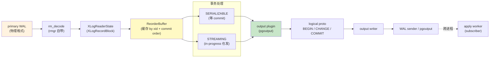
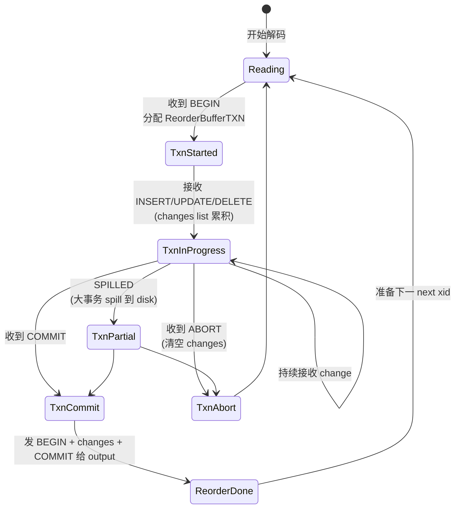
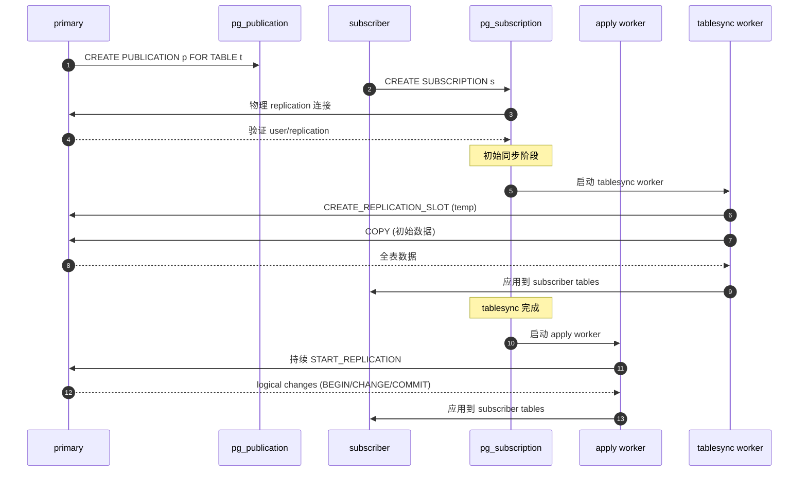
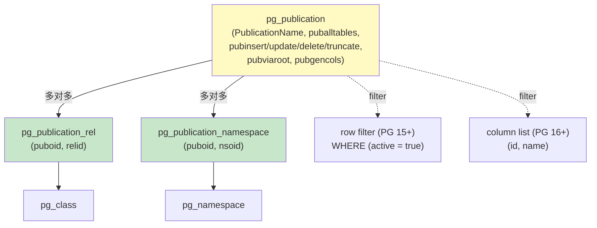
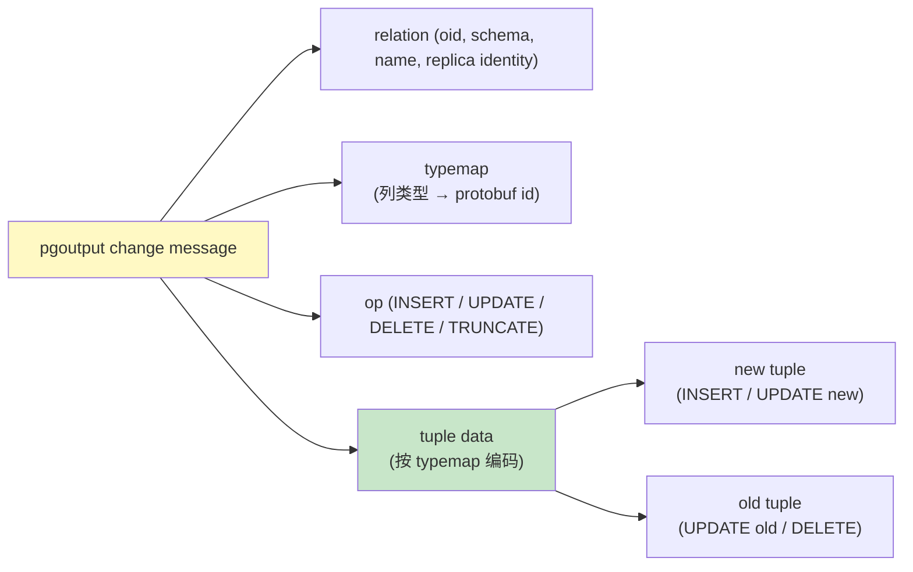

# 13 逻辑复制深入

> 目标：吃透 PG 的 logical replication 全套机制——logical decoding、ReorderBuffer、output plugin、publication/subscription、initial sync、conflict handling、walsummarizer。**这是 PG 实现跨大版本、跨表、跨粒度复制的核心能力**。

## 13.1 为什么需要逻辑复制

物理复制的限制（见 12.11）让逻辑复制成为必然：
- **跨大版本**：物理格式不兼容（pg_upgrade 也不支持跨多版本）；逻辑只关心 row data
- **表级粒度**：只想复制某些表
- **异构数据**：要把变化同步到 Kafka / Redis / Snowflake
- **双向同步**：多写模型（logical 可识别主键，物理不行）

PG 10+ 内置逻辑复制（基于 publication/subscription 模型），PG 16+ 还加了 walsummarizer 加速解码。

## 13.2 整体架构

```
primary                                    subscriber
--------                                   ---------
INSERT/UPDATE/DELETE
   │
   ▼
WAL → logical decoding
   │
   ├── ReorderBuffer 重组 tuple changes
   │
   ├── output plugin (pgoutput)
   │
   ├── WAL 流 (logical proto)
   │
   ▼
subscriber apply worker (PG 10+)
   │
   ▼
apply 到 subscriber 表
```

## 13.3 logical decoding 原理

入口：`src/backend/replication/logic/decode.c:pg_decode_begin`。

解码流程：
1. **找起始 LSN**（来自 replication slot 的 restart_lsn）
2. **读 WAL records**（与物理复制共用 XLogReadRecord）
3. **按 rmid 分配**给对应 rmgr 的 `rm_decode`（PG 16+ 引入）
4. **元组解码**：从 rmgr 提供的信息还原 HeapTupleChange
5. **ReorderBuffer 重组**：
   - 同一事务的多个 change 按 commit 顺序串起来
   - **streamed transactions**（PG 14+）可在事务未提交时就开始 stream
   - **change stream**（PG 16+）WAL summarize 加速

### 13.3.1 ReorderBuffer

`src/backend/replication/logic/reorderbuffer.c`：

```c
typedef struct ReorderBuffer {
    ...
    dlist_head   transactions;    // 待处理事务列表
    HTAB        *by_txn;          // xid -> ReorderBufferTXN
    HTAB        *by_serialized_txn;
    XLogRecPtr   last_flush_lsn;
} ReorderBuffer;

typedef struct ReorderBufferTXN {
    TransactionId   xid;
    XLogRecPtr      first_lsn;
    XLogRecPtr      commit_lsn;
    XLogRecPtr      final_lsn;
    List           *changes;      // 排好序的 changes
    ...
} ReorderBufferTXN;
```

要点：
- 同一事务的 changes 必须 cache 到 commit 时才能发出（保证一致性）
- 但 streamed transactions 可以提前 stream 给订阅端
- LSN 重叠检测：restart_lsn 之前的 LSN 不再解码

### 13.3.2 pgoutput plugin

`src/backend/replication/pgoutput/pgoutput.c`：

```c
typedef struct PGOutputData {
    MemoryContext    context;
    List            *publications;
    bool             publish_via_partition_root;
    List            *tables;          // 已发布的表 cache
    HTAB            *typemap;         // 类型映射
} PGOutputData;
```

启动协议：
- `START_REPLICATION` 命令
- 协议内用 logical proto（pgoutput_proto.c）
- 每个 change 是 `pgoutput_message`：含 relation 元信息、insert/update/delete

subscriber 端 `worker.c:ApplyWorkerMain` 接收并执行。

## 13.4 publication

```sql
postgres=# CREATE PUBLICATION my_pub FOR TABLE users, orders;
postgres=# CREATE PUBLICATION all_pub FOR ALL TABLES;
postgres=# CREATE PUBLICATION my_pub FOR TABLE users WHERE (active = true);  -- PG 15+
postgres=# ALTER PUBLICATION my_pub ADD TABLE products;
postgres=# ALTER PUBLICATION my_pub SET TABLE users, products;
postgres=# DROP PUBLICATION my_pub;
```

底层：
- `pg_publication` 表（`src/include/catalog/pg_publication.h`）
- `pg_publication_rel` 多对多关系
- `pg_publication_namespace` 配合 FOR TABLES IN SCHEMA

### 13.4.1 WHERE 子句（PG 15+）

```sql
CREATE PUBLICATION p FOR TABLE users WHERE (active);
CREATE PUBLICATION p FOR TABLE users WHERE (city = 'shanghai');
```

实现：subscriber 端在 apply 时由 output plugin 过滤。

### 13.4.2 列过滤（PG 16+）

```sql
CREATE PUBLICATION p FOR TABLE users (id, name);
```

只有 id 与 name 列变化产生 events。

## 13.5 subscription

```sql
postgres=# CREATE SUBSCRIPTION my_sub
           CONNECTION 'host=primary port=5432 dbname=app user=rep password=xxx'
           PUBLICATION my_pub
           WITH (copy_data = true, create_slot = true, enabled = true);
```

参数：
- `connection`：libpq conninfo
- `publication`：订阅的 publication 列表
- `copy_data`：是否先 COPY 一次初始数据
- `create_slot`：自动创建 slot
- `enabled`：false 时订阅存在但不工作

### 13.5.1 apply worker 架构

```
subscriber postmaster
   │
   ├── apply worker (1 per subscription)
   │     ├── 连 primary（一个 walsender）
   │     ├── 接收 changes
   │     └── apply 到本地表
   │
   └── tablesync worker (PG 10+ 初始同步)
         ├── 初始 COPY 表数据
         └── 完成后退出
```

代码：
- `src/backend/worker/worker.c:ApplyWorkerMain`
- `src/backend/worker/worker.c:TablesyncWorkerMain`
- `src/backend/replication/logic/worker.c`

### 13.5.2 conflict 处理

**没有自动冲突解决**！默认 apply 失败会停 worker：

```sql
postgres=# ALTER SUBSCRIPTION my_sub DISABLE;
postgres=# ALTER SUBSCRIPTION my_sub SET (slot_name = 'new_slot');
postgres=# SELECT pg_replication_origin_advance(...);
```

配置参数：
- `origin = none`：跳过 origin 标识（双向同步需要）
- `subscriber copy_data = false`：跳过初始 COPY
- `apply_delay`：延迟 apply（防误操作）

## 13.6 initial sync（初始同步）

PG 10+：
1. **创建 subscription 时**触发 tablesync worker
2. tablesync 创建一个临时 slot（与订阅 slot 同步）
3. 用 `COPY ... TO STDOUT` 把 publisher 的表拉过来
4. **两段时间差**：
   - COPY 期间，publisher 也在产生 WAL
   - tablesync 完成后，从 slot 拉 incremental 复制

PG 17+ 引入了 `binary = true` 选项：用二进制 COPY 加速。

## 13.7 streamed transactions（PG 14+）

```sql
postgres=# ALTER SUBSCRIPTION my_sub SET (streaming = on);
```

默认 `streaming = parallel`（PG 14+）：长事务未提交时就把已有 change stream 出来；应用端有 partial apply 风险。

`streaming = on`：publisher 把 in-progress transaction 也发出，但要求 transactional = true 的 apply（事务原子性）。

```sql
ALTER SUBSCRIPTION my_sub SET (streaming = parallel, binary = true);
```

## 13.8 walsummarizer（PG 16+）

问题：long-running transaction 的变化必须 cache 到 commit。这会导致：
- 大事务占用大量 ReorderBuffer 内存
- restart_lsn 卡住

PG 16 引入 walsummarizer：

```
src/backend/replication/walsummarizer.c
src/backend/replication/logic/summary.c
```

它周期性扫描 WAL，把 page changes 摘要写到 .summary 文件。

subscriber 端的逻辑解码可以：
- 跳过未引用 summary 的事务
- 加快启动速度

GUC：
- `wal_summarizer_timeout`（PG 18+ 新）
- `wal_summary_keep_time`

## 13.9 行过滤 vs DDL

**默认不复制 DDL**！

```sql
-- primary
ALTER TABLE users ADD COLUMN email text;

-- subscriber
-- 表结构不会自动变化
```

解决方案：
- 手工同步 schema（`pg_dump --schema-only`）
- 第三方工具（pglogical）
- PG 16+ 的 `ddl_deparse`（实验）

## 13.10 与 logical decoding 集成

不必用 subscription，可以自己接 output plugin：

```bash
# 1. 创建 slot
psql -c "SELECT pg_create_logical_replication_slot('my_slot', 'pgoutput');"

# 2. 启动 pg_recvlogical 接收
pg_recvlogical -d mydb -S my_slot -f /tmp/out.log --start

# 3. 看 output
tail /tmp/out.log
```

用 `test_decoding` plugin 看人可读格式：

```sql
CREATE SUBSCRIPTION ... PUBLICATION pub;
# OR
SELECT * FROM pg_logical_slot_get_changes('my_slot', NULL, NULL);
```

## 13.11 内部数据结构精读

### 13.11.1 pg_publication

```c
typedef struct FormData_pg_publication {
    Oid     oid;
    NameData pubname;
    Oid     pubowner;
    bool    puballtables;
    bool    pubinsert, pubupdate, pubdelete, pubtruncate;  // PG 14+
    bool    pubviaroot;            // 分区 root 发布
} FormData_pg_publication;
```

### 13.11.2 ReorderBufferChange

```c
typedef struct ReorderBufferChange {
    enum ReorderBufferChangeType { REORDER_BUFFER_CHANGE_INSERT,
                                   REORDER_BUFFER_CHANGE_UPDATE,
                                   REORDER_BUFFER_CHANGE_DELETE,
                                   REORDER_BUFFER_CHANGE_MESSAGE,
                                   REORDER_BUFFER_CHANGE_INVALIDATION,
                                   REORDER_BUFFER_CHANGE_INTERNAL_SNAPSHOT,
                                   REORDER_BUFFER_CHANGE_TRUNCATE,
                                   REORDER_BUFFER_CHANGE_STREAMING_START,
                                   REORDER_BUFFER_CHANGE_STREAMING_STOP,
                                   ...
                                  } action;
    Relation    relation;
    ReorderBufferTupleBuf *newtuple, *oldtuple;
    TransactionId xid;
    ...
} ReorderBufferChange;
```

## 13.12 replication origin

PG 10+ 提供 origin tracking，避免双向同步死循环：

```c
typedef struct ReplicationState {
    TransactionId roident;
    XLogRecPtr    origin_lsn;
    TimestampTz   origin_timestamp;
} ReplicationState;
```

每次 apply 前 `replication_origin_advance(ident, lsn)`。apply 时 `replication_origin_session_setup()` 标记 origin id，让 trigger 不重复触发。

## 13.13 实战

### 13.13.1 搭建 logical replication

```bash
# primary
postgres.conf:
    wal_level = logical
    max_replication_slots = 10
    max_wal_senders = 10
pg_ctl -D /tmp/pga restart

psql -h /tmp/pga -c "CREATE PUBLICATION p FOR TABLE t;"

# subscriber
psql -h /tmp/pgb -c "CREATE TABLE t (id int, v text);"

psql -h /tmp/pgb -c "CREATE SUBSCRIPTION s   CONNECTION 'host=localhost port=5432 dbname=postgres'   PUBLICATION p;"
```

### 13.13.2 看 publication 元数据

```sql
postgres=# SELECT * FROM pg_publication;
postgres=# SELECT * FROM pg_publication_rel;
postgres=# SELECT subname, subenabled, substream FROM pg_subscription;
postgres=# SELECT * FROM pg_stat_subscription;
```

### 13.13.3 修改 schema 不一致

```sql
-- primary
ALTER TABLE users ADD COLUMN email text;

-- subscriber
ALTER TABLE users ADD COLUMN email text;  -- 手工
-- 之后 logical replication 继续
```

### 13.13.4 conflict 模拟

```sql
-- primary
INSERT INTO t VALUES (1, 'a');
-- subscriber
INSERT INTO t VALUES (1, 'b');
-- primary: UPDATE t SET v='x' WHERE id=1;
-- → apply 失败，subscriber worker 停住
```

```sql
-- 看错误
SELECT * FROM pg_stat_subscription;
SELECT * FROM pg_stat_wal_receiver;  -- 看 worker 状态
```

### 13.13.5 列过滤（PG 16+）

```sql
-- primary
CREATE TABLE u (id int, name text, secret text);
INSERT INTO u VALUES (1, 'alice', 'pwd1');

CREATE PUBLICATION p FOR TABLE u (id, name);
-- subscriber 只看到 id, name 的变化
```

### 13.13.6 双向同步实验

```sql
-- node A: 创建 origin
SELECT pg_replication_origin_create('node_b');

-- node B: 同样
SELECT pg_replication_origin_create('node_a');

-- 在每个 node 上配 trigger：检查 origin 后跳过
CREATE FUNCTION skip_origin() RETURNS trigger AS $$
BEGIN
    IF current_setting('session_replication_role') = 'origin' THEN
        RETURN NULL;
    END IF;
    RETURN NEW;
END;
$$ LANGUAGE plpgsql;
```

复杂场景，建议用 pglogical 扩展。

### 13.13.7 test_decoding 实战

```sql
SELECT pg_create_logical_replication_slot('test', 'test_decoding');

-- 在另一个窗口
INSERT INTO t VALUES (1, 'a');
UPDATE t SET v='b' WHERE id=1;

-- 看 changes
SELECT * FROM pg_logical_slot_get_changes('test', NULL, NULL);
-- output:
-- table public.t: INSERT: id[1]:1 v[2]:'a'
-- table public.t: UPDATE: old-key: id=1 new-tuple: id=1 v='b'
```

### 13.13.8 GDB 跟踪

```bash
gdb --args ./install/bin/postgres -D /tmp/pga
(gdb) b reorderbuffer.c:ReorderBufferCommit
(gdb) b pgoutput.c:pg_output_change
(gdb) c
```

任意 INSERT，会停在 pg_output_change。

## 13.14 限制与坑

| 问题 | 原因 | 解决 |
| --- | --- | --- |
| DDL 不复制 | logical 只解码 DML | 手工 schema sync |
| 大事务内存爆炸 | ReorderBuffer cache | streaming = on / walsummarizer |
| 序列不同步 | sequence 不进 WAL | 手工设置 |
| TRUNCATE 默认不复制（PG 14+ 改） | pubtruncate GUC | `publish = insert, update, delete, truncate` |
| Conflict 不解决 | 设计如此 | 手工 / pglogical |
| 双向同步循环 | origin 没设置 | replication_origin_* |

## 13.15 pglogical 扩展

第三方 `pglogical` 弥补了原生 logical 的诸多缺陷：
- 自动 DDL 同步
- 双向同步
- Conflict 解决策略
- 列过滤、行过滤

源码：https://github.com/2ndQuadrant/pglogical

## 13.16 与其他系统

| 维度 | PG logical | MySQL binlog | Mongo oplog |
| --- | --- | --- | --- |
| 协议 | pgoutput | binlog_row_image | bson |
| Slot | 物理 + 逻辑 | 无 | 无 |
| 跨版本 | 是 | 有限 | 是 |
| 异构 | 是（CDC） | 有限 | 是 |
| 性能 | 较慢（逻辑解码） | 高 | 中 |

## 13.17 小结

- Logical replication = logical decoding + publication/subscription
- 解决物理复制的跨大版本、表级粒度、双向同步问题
- 性能较慢（decode 开销），但灵活性高
- DDL 不复制是大坑，配合 schema migration 工具或 pglogical
- walsummarizer（PG 16+）是性能拐点

下一章 14 是本系列最后一章——列存与 cstore。


## 13.18 图示

### 13.18.1 Logical Decoding 完整管线



### 13.18.2 ReorderBuffer 状态机



### 13.18.3 Publication/Subscription 时序



### 13.18.4 Publication 元数据关系



### 13.18.5 pgoutput change 内部结构



> 图示配套源码：`src/backend/replication/logic/{decode.c,reorderbuffer.c,workfile.c,slotsync.c}`、`src/backend/replication/pgoutput/{pgoutput.c,pgoutput_proto.c}`、`src/backend/replication/walsummarizer.c`、`src/backend/worker/worker.c`、`src/include/catalog/{pg_publication.h,pg_subscription.h}`。
