# 13 逻辑复制深入

> 目标：吃透 PG 的 logical replication 全套机制——logical decoding、ReorderBuffer、output plugin、publication/subscription、initial sync、conflict handling、walsummarizer。**这是 PG 实现跨大版本、跨表、跨粒度复制的核心能力**。

## 13.1 为什么需要逻辑复制

物理复制的限制（见 12.11）让逻辑复制成为必然：
- **跨大版本**：物理格式不兼容（pg_upgrade 也不支持跨多版本）；逻辑只关心 row data
- **表级粒度**：只想复制某些表
- **异构数据**：要把变化同步到 Kafka / Redis / Snowflake
- **双向同步**：多写模型（logical 可识别主键，物理不行）

PG 10+ 内置逻辑复制（基于 publication/subscription 模型），PG 16+ 还加了 walsummarizer 加速解码。

## 13.2 整体架构

```
primary                                    subscriber
--------                                   ---------
INSERT/UPDATE/DELETE
   │
   ▼
WAL → logical decoding
   │
   ├── ReorderBuffer 重组 tuple changes
   │
   ├── output plugin (pgoutput)
   │
   ├── WAL 流 (logical proto)
   │
   ▼
subscriber apply worker (PG 10+)
   │
   ▼
apply 到 subscriber 表
```

## 13.3 logical decoding 原理

入口：`src/backend/replication/logic/decode.c:pg_decode_begin`。

解码流程：
1. **找起始 LSN**（来自 replication slot 的 restart_lsn）
2. **读 WAL records**（与物理复制共用 XLogReadRecord）
3. **按 rmid 分配**给对应 rmgr 的 `rm_decode`（PG 16+ 引入）
4. **元组解码**：从 rmgr 提供的信息还原 HeapTupleChange
5. **ReorderBuffer 重组**：
   - 同一事务的多个 change 按 commit 顺序串起来
   - **streamed transactions**（PG 14+）可在事务未提交时就开始 stream
   - **change stream**（PG 16+）WAL summarize 加速

### 13.3.1 ReorderBuffer

`src/backend/replication/logic/reorderbuffer.c`：

```c
typedef struct ReorderBuffer {
    ...
    dlist_head   transactions;    // 待处理事务列表
    HTAB        *by_txn;          // xid -> ReorderBufferTXN
    HTAB        *by_serialized_txn;
    XLogRecPtr   last_flush_lsn;
} ReorderBuffer;

typedef struct ReorderBufferTXN {
    TransactionId   xid;
    XLogRecPtr      first_lsn;
    XLogRecPtr      commit_lsn;
    XLogRecPtr      final_lsn;
    List           *changes;      // 排好序的 changes
    ...
} ReorderBufferTXN;
```

要点：
- 同一事务的 changes 必须 cache 到 commit 时才能发出（保证一致性）
- 但 streamed transactions 可以提前 stream 给订阅端
- LSN 重叠检测：restart_lsn 之前的 LSN 不再解码

### 13.3.2 pgoutput plugin

`src/backend/replication/pgoutput/pgoutput.c`：

```c
typedef struct PGOutputData {
    MemoryContext    context;
    List            *publications;
    bool             publish_via_partition_root;
    List            *tables;          // 已发布的表 cache
    HTAB            *typemap;         // 类型映射
} PGOutputData;
```

启动协议：
- `START_REPLICATION` 命令
- 协议内用 logical proto（pgoutput_proto.c）
- 每个 change 是 `pgoutput_message`：含 relation 元信息、insert/update/delete

subscriber 端 `worker.c:ApplyWorkerMain` 接收并执行。

## 13.4 publication

```sql
postgres=# CREATE PUBLICATION my_pub FOR TABLE users, orders;
postgres=# CREATE PUBLICATION all_pub FOR ALL TABLES;
postgres=# CREATE PUBLICATION my_pub FOR TABLE users WHERE (active = true);  -- PG 15+
postgres=# ALTER PUBLICATION my_pub ADD TABLE products;
postgres=# ALTER PUBLICATION my_pub SET TABLE users, products;
postgres=# DROP PUBLICATION my_pub;
```

底层：
- `pg_publication` 表（`src/include/catalog/pg_publication.h`）
- `pg_publication_rel` 多对多关系
- `pg_publication_namespace` 配合 FOR TABLES IN SCHEMA

### 13.4.1 WHERE 子句（PG 15+）

```sql
CREATE PUBLICATION p FOR TABLE users WHERE (active);
CREATE PUBLICATION p FOR TABLE users WHERE (city = 'shanghai');
```

实现：subscriber 端在 apply 时由 output plugin 过滤。

### 13.4.2 列过滤（PG 16+）

```sql
CREATE PUBLICATION p FOR TABLE users (id, name);
```

只有 id 与 name 列变化产生 events。

## 13.5 subscription

```sql
postgres=# CREATE SUBSCRIPTION my_sub
           CONNECTION 'host=primary port=5432 dbname=app user=rep password=xxx'
           PUBLICATION my_pub
           WITH (copy_data = true, create_slot = true, enabled = true);
```

参数：
- `connection`：libpq conninfo
- `publication`：订阅的 publication 列表
- `copy_data`：是否先 COPY 一次初始数据
- `create_slot`：自动创建 slot
- `enabled`：false 时订阅存在但不工作

### 13.5.1 apply worker 架构

```
subscriber postmaster
   │
   ├── apply worker (1 per subscription)
   │     ├── 连 primary（一个 walsender）
   │     ├── 接收 changes
   │     └── apply 到本地表
   │
   └── tablesync worker (PG 10+ 初始同步)
         ├── 初始 COPY 表数据
         └── 完成后退出
```

代码：
- `src/backend/worker/worker.c:ApplyWorkerMain`
- `src/backend/worker/worker.c:TablesyncWorkerMain`
- `src/backend/replication/logic/worker.c`

### 13.5.2 conflict 处理

**没有自动冲突解决**！默认 apply 失败会停 worker：

```sql
postgres=# ALTER SUBSCRIPTION my_sub DISABLE;
postgres=# ALTER SUBSCRIPTION my_sub SET (slot_name = 'new_slot');
postgres=# SELECT pg_replication_origin_advance(...);
```

配置参数：
- `origin = none`：跳过 origin 标识（双向同步需要）
- `subscriber copy_data = false`：跳过初始 COPY
- `apply_delay`：延迟 apply（防误操作）

## 13.6 initial sync（初始同步）

PG 10+：
1. **创建 subscription 时**触发 tablesync worker
2. tablesync 创建一个临时 slot（与订阅 slot 同步）
3. 用 `COPY ... TO STDOUT` 把 publisher 的表拉过来
4. **两段时间差**：
   - COPY 期间，publisher 也在产生 WAL
   - tablesync 完成后，从 slot 拉 incremental 复制

PG 17+ 引入了 `binary = true` 选项：用二进制 COPY 加速。

## 13.7 streamed transactions（PG 14+）

```sql
postgres=# ALTER SUBSCRIPTION my_sub SET (streaming = on);
```

默认 `streaming = parallel`（PG 14+）：长事务未提交时就把已有 change stream 出来；应用端有 partial apply 风险。

`streaming = on`：publisher 把 in-progress transaction 也发出，但要求 transactional = true 的 apply（事务原子性）。

```sql
ALTER SUBSCRIPTION my_sub SET (streaming = parallel, binary = true);
```

## 13.8 walsummarizer（PG 16+）

问题：long-running transaction 的变化必须 cache 到 commit。这会导致：
- 大事务占用大量 ReorderBuffer 内存
- restart_lsn 卡住

PG 16 引入 walsummarizer：

```
src/backend/replication/walsummarizer.c
src/backend/replication/logic/summary.c
```

它周期性扫描 WAL，把 page changes 摘要写到 .summary 文件。

subscriber 端的逻辑解码可以：
- 跳过未引用 summary 的事务
- 加快启动速度

GUC：
- `wal_summarizer_timeout`（PG 18+ 新）
- `wal_summary_keep_time`

## 13.9 行过滤 vs DDL

**默认不复制 DDL**！

```sql
-- primary
ALTER TABLE users ADD COLUMN email text;

-- subscriber
-- 表结构不会自动变化
```

解决方案：
- 手工同步 schema（`pg_dump --schema-only`）
- 第三方工具（pglogical）
- PG 16+ 的 `ddl_deparse`（实验）

## 13.10 与 logical decoding 集成

不必用 subscription，可以自己接 output plugin：

```bash
# 1. 创建 slot
psql -c "SELECT pg_create_logical_replication_slot('my_slot', 'pgoutput');"

# 2. 启动 pg_recvlogical 接收
pg_recvlogical -d mydb -S my_slot -f /tmp/out.log --start

# 3. 看 output
tail /tmp/out.log
```

用 `test_decoding` plugin 看人可读格式：

```sql
CREATE SUBSCRIPTION ... PUBLICATION pub;
# OR
SELECT * FROM pg_logical_slot_get_changes('my_slot', NULL, NULL);
```

## 13.11 内部数据结构精读

### 13.11.1 pg_publication

```c
typedef struct FormData_pg_publication {
    Oid     oid;
    NameData pubname;
    Oid     pubowner;
    bool    puballtables;
    bool    pubinsert, pubupdate, pubdelete, pubtruncate;  // PG 14+
    bool    pubviaroot;            // 分区 root 发布
} FormData_pg_publication;
```

### 13.11.2 ReorderBufferChange

```c
typedef struct ReorderBufferChange {
    enum ReorderBufferChangeType { REORDER_BUFFER_CHANGE_INSERT,
                                   REORDER_BUFFER_CHANGE_UPDATE,
                                   REORDER_BUFFER_CHANGE_DELETE,
                                   REORDER_BUFFER_CHANGE_MESSAGE,
                                   REORDER_BUFFER_CHANGE_INVALIDATION,
                                   REORDER_BUFFER_CHANGE_INTERNAL_SNAPSHOT,
                                   REORDER_BUFFER_CHANGE_TRUNCATE,
                                   REORDER_BUFFER_CHANGE_STREAMING_START,
                                   REORDER_BUFFER_CHANGE_STREAMING_STOP,
                                   ...
                                  } action;
    Relation    relation;
    ReorderBufferTupleBuf *newtuple, *oldtuple;
    TransactionId xid;
    ...
} ReorderBufferChange;
```

## 13.12 replication origin

PG 10+ 提供 origin tracking，避免双向同步死循环：

```c
typedef struct ReplicationState {
    TransactionId roident;
    XLogRecPtr    origin_lsn;
    TimestampTz   origin_timestamp;
} ReplicationState;
```

每次 apply 前 `replication_origin_advance(ident, lsn)`。apply 时 `replication_origin_session_setup()` 标记 origin id，让 trigger 不重复触发。

## 13.13 实战

### 13.13.1 搭建 logical replication

```bash
# primary
postgres.conf:
    wal_level = logical
    max_replication_slots = 10
    max_wal_senders = 10
pg_ctl -D /tmp/pga restart

psql -h /tmp/pga -c "CREATE PUBLICATION p FOR TABLE t;"

# subscriber
psql -h /tmp/pgb -c "CREATE TABLE t (id int, v text);"

psql -h /tmp/pgb -c "CREATE SUBSCRIPTION s   CONNECTION 'host=localhost port=5432 dbname=postgres'   PUBLICATION p;"
```

### 13.13.2 看 publication 元数据

```sql
postgres=# SELECT * FROM pg_publication;
postgres=# SELECT * FROM pg_publication_rel;
postgres=# SELECT subname, subenabled, substream FROM pg_subscription;
postgres=# SELECT * FROM pg_stat_subscription;
```

### 13.13.3 修改 schema 不一致

```sql
-- primary
ALTER TABLE users ADD COLUMN email text;

-- subscriber
ALTER TABLE users ADD COLUMN email text;  -- 手工
-- 之后 logical replication 继续
```

### 13.13.4 conflict 模拟

```sql
-- primary
INSERT INTO t VALUES (1, 'a');
-- subscriber
INSERT INTO t VALUES (1, 'b');
-- primary: UPDATE t SET v='x' WHERE id=1;
-- → apply 失败，subscriber worker 停住
```

```sql
-- 看错误
SELECT * FROM pg_stat_subscription;
SELECT * FROM pg_stat_wal_receiver;  -- 看 worker 状态
```

### 13.13.5 列过滤（PG 16+）

```sql
-- primary
CREATE TABLE u (id int, name text, secret text);
INSERT INTO u VALUES (1, 'alice', 'pwd1');

CREATE PUBLICATION p FOR TABLE u (id, name);
-- subscriber 只看到 id, name 的变化
```

### 13.13.6 双向同步实验

```sql
-- node A: 创建 origin
SELECT pg_replication_origin_create('node_b');

-- node B: 同样
SELECT pg_replication_origin_create('node_a');

-- 在每个 node 上配 trigger：检查 origin 后跳过
CREATE FUNCTION skip_origin() RETURNS trigger AS $$
BEGIN
    IF current_setting('session_replication_role') = 'origin' THEN
        RETURN NULL;
    END IF;
    RETURN NEW;
END;
$$ LANGUAGE plpgsql;
```

复杂场景，建议用 pglogical 扩展。

### 13.13.7 test_decoding 实战

```sql
SELECT pg_create_logical_replication_slot('test', 'test_decoding');

-- 在另一个窗口
INSERT INTO t VALUES (1, 'a');
UPDATE t SET v='b' WHERE id=1;

-- 看 changes
SELECT * FROM pg_logical_slot_get_changes('test', NULL, NULL);
-- output:
-- table public.t: INSERT: id[1]:1 v[2]:'a'
-- table public.t: UPDATE: old-key: id=1 new-tuple: id=1 v='b'
```

### 13.13.8 GDB 跟踪

```bash
gdb --args ./install/bin/postgres -D /tmp/pga
(gdb) b reorderbuffer.c:ReorderBufferCommit
(gdb) b pgoutput.c:pg_output_change
(gdb) c
```

任意 INSERT，会停在 pg_output_change。

## 13.14 限制与坑

| 问题 | 原因 | 解决 |
| --- | --- | --- |
| DDL 不复制 | logical 只解码 DML | 手工 schema sync |
| 大事务内存爆炸 | ReorderBuffer cache | streaming = on / walsummarizer |
| 序列不同步 | sequence 不进 WAL | 手工设置 |
| TRUNCATE 默认不复制（PG 14+ 改） | pubtruncate GUC | `publish = insert, update, delete, truncate` |
| Conflict 不解决 | 设计如此 | 手工 / pglogical |
| 双向同步循环 | origin 没设置 | replication_origin_* |

## 13.15 pglogical 扩展

第三方 `pglogical` 弥补了原生 logical 的诸多缺陷：
- 自动 DDL 同步
- 双向同步
- Conflict 解决策略
- 列过滤、行过滤

源码：https://github.com/2ndQuadrant/pglogical

## 13.16 与其他系统

| 维度 | PG logical | MySQL binlog | Mongo oplog |
| --- | --- | --- | --- |
| 协议 | pgoutput | binlog_row_image | bson |
| Slot | 物理 + 逻辑 | 无 | 无 |
| 跨版本 | 是 | 有限 | 是 |
| 异构 | 是（CDC） | 有限 | 是 |
| 性能 | 较慢（逻辑解码） | 高 | 中 |

## 13.17 小结

- Logical replication = logical decoding + publication/subscription
- 解决物理复制的跨大版本、表级粒度、双向同步问题
- 性能较慢（decode 开销），但灵活性高
- DDL 不复制是大坑，配合 schema migration 工具或 pglogical
- walsummarizer（PG 16+）是性能拐点

下一章 14 是本系列最后一章——列存与 cstore。


## 13.18 图示

### 13.18.1 Logical Decoding 完整管线

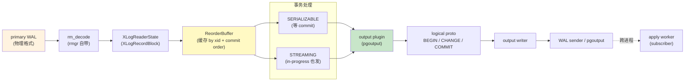
```mermaid
flowchart LR
    WAL["primary WAL<br/>(物理格式)"]
    WAL --> RM["rm_decode<br/>(rmgr 自带)"]
    RM --> XB["XLogReaderState<br/>(XLogRecordBlock)"]
    
    XB --> RB["ReorderBuffer<br/>(缓存 by xid + commit order)"]
    
    subgraph TX[事务处理]
        direction TB
        SP["SERIALIZABLE<br/>(等 commit)"]
        ST["STREAMING<br/>(in-progress 也发)"]
    end
    
    RB --> SP
    RB --> ST
    
    SP --> OP["output plugin<br/>(pgoutput)"]
    ST --> OP
    
    OP --> PROTO["logical proto<br/>BEGIN / CHANGE / COMMIT"]
    PROTO --> WR["output writer"]
    WR --> SK["WAL sender / pgoutput"]
    
    SK -.->|跨进程| APPLY["apply worker<br/>(subscriber)"]
    
    style WAL fill:#fff3e0
    style RB fill:#fff9c4
    style OP fill:#c8e6c9
```

### 13.18.2 ReorderBuffer 状态机

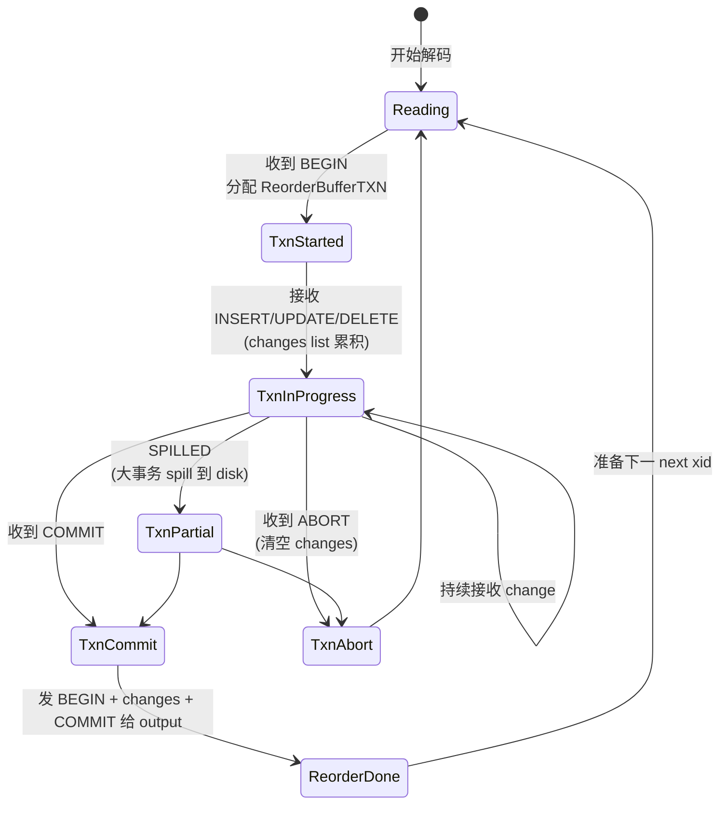
```mermaid
stateDiagram-v2
    [*] --> Reading: 开始解码
    
    Reading --> TxnStarted: 收到 BEGIN<br/>分配 ReorderBufferTXN
    TxnStarted --> TxnInProgress: 接收 INSERT/UPDATE/DELETE<br/>(changes list 累积)
    TxnInProgress --> TxnInProgress: 持续接收 change
    TxnInProgress --> TxnPartial: SPILLED<br/>(大事务 spill 到 disk)
    
    TxnInProgress --> TxnCommit: 收到 COMMIT
    TxnPartial --> TxnCommit
    TxnInProgress --> TxnAbort: 收到 ABORT<br/>(清空 changes)
    TxnPartial --> TxnAbort
    
    TxnCommit --> ReorderDone: 发 BEGIN + changes + COMMIT 给 output
    ReorderDone --> Reading: 准备下一 next xid
    
    TxnAbort --> Reading
```

### 13.18.3 Publication/Subscription 时序

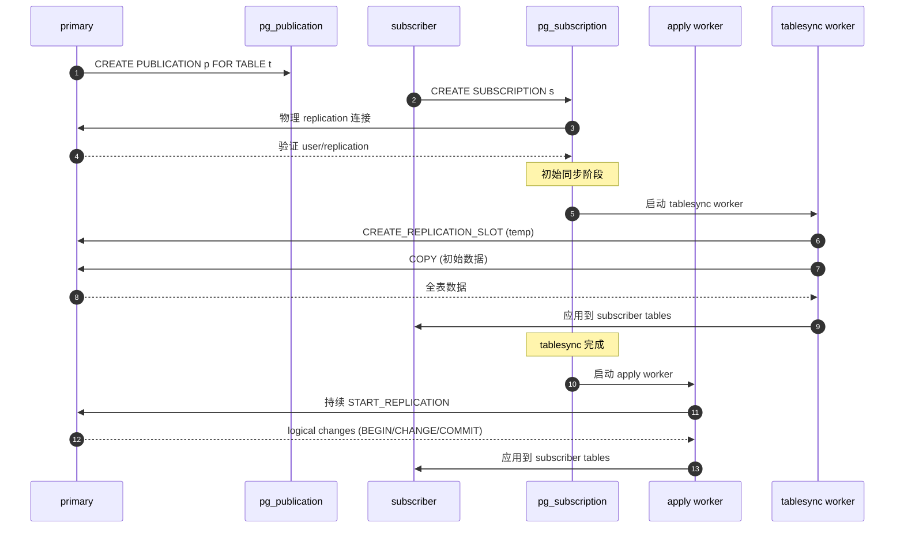
```mermaid
sequenceDiagram
    autonumber
    participant P as primary
    participant PUB as pg_publication
    participant S as subscriber
    participant SUB as pg_subscription
    participant AW as apply worker
    participant TS as tablesync worker
    
    P->>PUB: CREATE PUBLICATION p FOR TABLE t
    S->>SUB: CREATE SUBSCRIPTION s
    SUB->>P: 物理 replication 连接
    P-->>SUB: 验证 user/replication
    
    Note over SUB: 初始同步阶段
    SUB->>TS: 启动 tablesync worker
    TS->>P: CREATE_REPLICATION_SLOT (temp)
    TS->>P: COPY (初始数据)
    P-->>TS: 全表数据
    TS->>S: 应用到 subscriber tables
    
    Note over SUB: tablesync 完成
    
    SUB->>AW: 启动 apply worker
    AW->>P: 持续 START_REPLICATION
    P-->>AW: logical changes (BEGIN/CHANGE/COMMIT)
    AW->>S: 应用到 subscriber tables
```

### 13.18.4 Publication 元数据关系

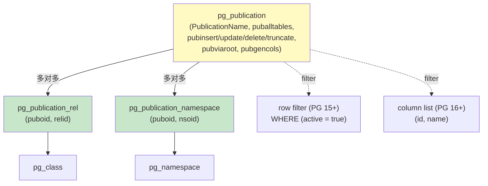
```mermaid
graph TB
    PUB["pg_publication<br/>(PublicationName, puballtables,<br/>pubinsert/update/delete/truncate,<br/>pubviaroot, pubgencols)"]
    
    PUB -->|多对多| REL["pg_publication_rel<br/>(puboid, relid)"]
    PUB -->|多对多| NS["pg_publication_namespace<br/>(puboid, nsoid)"]
    
    REL --> C["pg_class"]
    NS --> SCH["pg_namespace"]
    
    PUB -.->|filter| WHERE["row filter (PG 15+)<br/>WHERE (active = true)"]
    PUB -.->|filter| COL["column list (PG 16+)<br/>(id, name)"]
    
    style PUB fill:#fff9c4
    style REL fill:#c8e6c9
    style NS fill:#c8e6c9
```

### 13.18.5 pgoutput change 内部结构

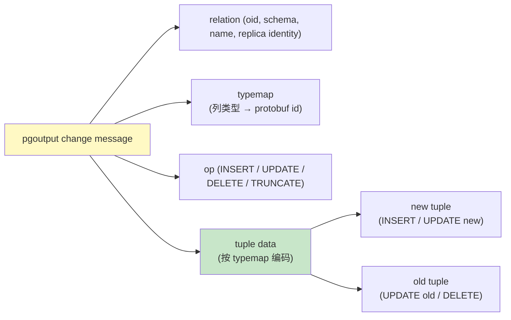
```mermaid
graph LR
    P["pgoutput change message"]
    P --> REL["relation (oid, schema, name, replica identity)"]
    P --> TY["typemap<br/>(列类型 → protobuf id)"]
    P --> OP["op (INSERT / UPDATE / DELETE / TRUNCATE)"]
    
    P --> CH["tuple data<br/>(按 typemap 编码)"]
    
    CH --> NEW["new tuple<br/>(INSERT / UPDATE new)"]
    CH --> OLD["old tuple<br/>(UPDATE old / DELETE)"]
    
    style P fill:#fff9c4
    style CH fill:#c8e6c9
```

> 图示配套源码：`src/backend/replication/logic/{decode.c,reorderbuffer.c,workfile.c,slotsync.c}`、`src/backend/replication/pgoutput/{pgoutput.c,pgoutput_proto.c}`、`src/backend/replication/walsummarizer.c`、`src/backend/worker/worker.c`、`src/include/catalog/{pg_publication.h,pg_subscription.h}`。


## 13.19 深入：logical decoding 全链路概览

logical replication 不是一条简单的"publisher 推 → subscriber 收"的管道，而是 **物理 WAL → 语义解码 → 事务重排序 → 流式输出 → apply** 的五级 pipeline，且 **每一级都强依赖前面几级**：

```
                  ┌───────────────────────────────────────┐
   物理 WAL  ───► │ XLogReaderState + rm_decode per rmid   │  13.20-13.21
                  └─────────────────────┬─────────────────┘
                                        │ 按 rmid 还原 HeapTupleChange
                                        ▼
                  ┌───────────────────────────────────────┐
                  │ ReorderBuffer (按 xid 排序 + commit order)│  13.22-13.23
                  └─────────────────────┬─────────────────┘
                                        │ 同时用 snapbuild 维护 historic snapshot
                                        ▼
                  ┌───────────────────────────────────────┐
                  │ Snapshot + relcache (catalog 可见性)   │  13.24
                  └─────────────────────┬─────────────────┘
                                        │ 决定 tuple 字段解码时的类型映射
                                        ▼
                  ┌───────────────────────────────────────┐
                  │ output plugin (pgoutput / test_decoding)│  13.27
                  └─────────────────────┬─────────────────┘
                                        │ logical proto
                                        ▼
                  ┌───────────────────────────────────────┐
                  │ apply worker (subscriber 端执行)       │  13.28
                  └───────────────────────────────────────┘
```

### 13.19.1 一条 `INSERT` 在 logical 通道里的全轨迹

> 设表 `t (id int, v text)`，publisher 上跑：
> `INSERT INTO t VALUES (1, 'a'); COMMIT;`
> 假设 subscriber 订阅了 `t`。

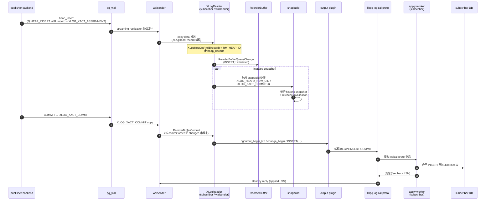
```mermaid
sequenceDiagram
    autonumber
    participant B as publisher backend
    participant WAL as pg_wal
    participant WS as walsender
    participant XC as XLogReader<br/>(subscriber / walsender)
    participant RB as ReorderBuffer
    participant SB as snapbuild
    participant OP as output plugin
    participant LT as libpq logical proto
    participant AW as apply worker<br/>(subscriber)
    participant DB as subscriber DB
    
    B->>WAL: heap_insert<br/>(写 HEAP_INSERT WAL record + XLOG_XACT_ASSIGNMENT)
    WAL->>WS: streaming replication 协议发出
    WS->>XC: copy data 推送<br/>(XLogReadRecord 解码)
    
    Note over XC: XLogRecGetRmid(record) = RM_HEAP_ID<br/>走 heap_decode
    XC->>RB: ReorderBufferQueueChange<br/>(INSERT, t.xmin=xid)
    
    par catalog snapshot
        XC->>SB: 触发 snapbuild 处理<br/>XLOG_HEAP2_NEW_CID /<br/>XLOG_XACT_COMMIT 等
        SB->>SB: 维护 historic snapshot<br/>+ relcache invalidation
    end
    
    B->>WAL: COMMIT → XLOG_XACT_COMMIT
    WAL->>WS: XLOG_XACT_COMMIT copy
    WS->>XC: ReorderBufferCommit<br/>(按 commit order 把 changes 串起来)
    
    XC->>OP: pgoutput_begin_txn / change_begin / INSERT(...)
    OP->>LT: 编码 BEGIN INSERT COMMIT
    LT->>AW: 接收 logical proto 消息
    AW->>DB: 应用 INSERT 到 subscriber 表
    AW->>LT: 流控 (feedback LSN)
    LT->>WS: standby reply (applied LSN)
```

### 13.19.2 这条链路里最关键的 4 个核心机制

| 机制 | 文件 | 作用 |
| --- | --- | --- |
| **rm_decode** | `rmgr.c:rmgr_table[]` | 把物理 WAL record 翻成语义 change |
| **ReorderBuffer** | `reorderbuffer.c` | 按 xid 累积 changes，commit 时按顺序串行发 |
| **snapbuild** | `snapbuild.c` | 用 WAL 反推 historic snapshot，给 catalog tuple 还原类型 |
| **output plugin** | `pgoutput.c` / `test_decoding.c` | 把 ReorderBufferTXN 编码成 subscriber 协议 |

下面逐个展开。

## 13.20 logical decoding 入口与 XLogReaderState

### 13.20.1 启动入口

主入口在 `src/backend/replication/logical/logical.c:LogicalDecodingProcessRecord()`（被 walsender 在 streaming 时调用）。

```c
void LogicalDecodingProcessRecord(LogicalDecodingContext *ctx,
                                  XLogReaderState *record)
{
    XLogRecordBuffer buf;
    
    /* 1. 把 record 包装成 XLogRecordBuffer */
    buf.record = record;
    buf.msglen = XLogRecGetDataLen(record);
    buf.data = XLogRecGetData(record);
    buf.origptr = record->EndRecPtr;
    
    /* 2. 按 rmid 调用对应 rm_decode */
    RmgrTable[record->xl_rmid].rm_decode(ctx, &buf);
}
```

> 注意：`rm_decode` 是 `RmgrData` 里的新成员（PG 16+ 才标准化，PG 18 已经是必备）。早期版本直接复用 `rm_redo` 的解析路径。

### 13.20.2 XLogReaderState 的角色

`XLogReaderState`（`src/include/access/xlogreader.h`）是物理 WAL record 的"已解码视图"：

```c
typedef struct XLogReaderState {
    XLogPageReadPrivate *private_data;
    XLogRecPtr  currRecPtr;
    XLogRecPtr  EndRecPtr;
    char       *currPageBuf;
    DecodedBkpBlock blocks[XLR_MAX_BKP_BLOCKS];
    /* ... */
} XLogReaderState;
```

`blocks[i]` 是从 WAL record 里解出来的 block 信息：

```c
typedef struct DecodedBkpBlock {
    /* 关系 file locator + fork + block num */
    RelFileLocator rlocator;
    ForkNumber     forknum;
    BlockNumber    blkno;
    
    /* page image / delta data */
    char  *image;
    uint16 hole_offset, hole_length;
    uint16 has_image;       // BKPBLOCK_HAS_IMAGE
    uint16 will_init;       // BKPBLOCK_WILL_INIT
    
    /* 完整原 page 字节 (用于 RelFileLocator 反查) */
    char  *origdata;
} DecodedBkpBlock;
```

### 13.20.3 logical 用的特殊 reader flag

`logical.c` 创建 `XLogReaderState` 时启用 **logical_only** 标志：

```c
// src/backend/replication/logical/logical.c
static void CreateDecodingContext(...)
{
    ctx->reader = XLogReaderAllocate(...);
    ctx->reader->private_data = ctx;
    
    // 设置 logical_only 跳过 RMGR 重做部分 (only decode)
    ctx->reader->DecodeBuffersOnly = true;
}
```

这意味着 reader 只关心 change extraction，不 redo 物理修改。

## 13.21 rm_decode 钩子机制

每个 rmgr 在 `rmgr.c` 注册时提供 `rm_decode`，把物理 WAL record 还原成 logical change。

### 13.21.1 rmgr 注册结构

```c
// src/backend/access/transam/rmgr.c (PG 18)
typedef struct RmgrData {
    const char *rm_name;
    void (*rm_redo)(XLogReaderState *record);
    void (*rm_desc)(StringInfo buf, XLogReaderState *record);
    void (*rm_identify)(uint8 info);
    
    /* PG 16+ 新增 */
    void (*rm_decode)(LogicalDecodingContext *ctx, XLogRecordBuffer *buf);
    void (*rm_filter)(LogicalDecodingContext *ctx, XLogRecordBuffer *buf,
                      bool *include);
} RmgrData;
```

### 13.21.2 heap_decode 实现（典型模式）

`src/backend/access/heap/heapdecode.c`（PG 18 起独立文件）：

```c
void heap_decode(LogicalDecodingContext *ctx, XLogRecordBuffer *buf)
{
    uint8 info = XLogRecGetInfo(buf->record) & ~XLR_INFO_MASK;
    
    switch (info) {
        case XLOG_HEAP_INSERT:
            DecodeInsert(ctx, buf);
            break;
        case XLOG_HEAP_UPDATE:
            DecodeUpdate(ctx, buf);
            break;
        case XLOG_HEAP_DELETE:
            DecodeDelete(ctx, buf);
            break;
        case XLOG_HEAP_TRUNCATE:
            DecodeTruncate(ctx, buf);
            break;
        case XLOG_HEAP_HOT_UPDATE:
            // HOT update = 拆为 UPDATE + UPDATE
            // 包含 ctid 链
            break;
    }
}
```

### 13.21.3 DecodeInsert 实现骨架

```c
static void DecodeInsert(LogicalDecodingContext *ctx, XLogRecordBuffer *buf)
{
    DecodedXLogTuple xlrec;
    xl_heap_insert *xlrec_data;
    Relation relation;
    ReorderBufferChange *change;
    
    /* 1. 解析 WAL header */
    xlrec_data = (xl_heap_insert *) XLogRecGetData(buf->record);
    
    /* 2. 通过 relfilenode 找到 Relation (catalog lookup) */
    relation = RelationIdGetRelation(xlrec_data->target_node.spcNode, ...);
    if (!relation)
        return;  // 关系已被 drop
    
    /* 3. 用 snapbuild 提供的 snapshot 解码 tuple */
    DecodeXLogTuple(xlrow.data, len, &xlrec.tup);
    
    /* 4. 构造 ReorderBufferChange */
    change = ReorderBufferGetChange(ctx->reorder, sizeof(*change));
    change->action = REORDER_BUFFER_CHANGE_INSERT;
    change->data.tp.newtuple = ReorderBufferGetTupleBuf(ctx->reorder, ...);
    // 拷贝元数据
    
    /* 5. 加进 ReorderBuffer */
    ReorderBufferQueueChange(ctx->reorder, xid, change);
    
    RelationClose(relation);
}
```

### 13.21.4 DecodeXLogTuple —— 类型解码靠 snapbuild snapshot

```c
static void DecodeXLogTuple(char *data, Size len, HeapTuple tuple)
{
    /* 用 historic snapshot 查 pg_type / pg_attribute */
    /* 这是 logical decoding 与 MVCC snapshot 最深的连接点 */
    Form_pg_attribute *attrs = ...;
    
    /* 解析 tuple header (t_infomask, t_infomask2, ...) */
    tuple->t_data = (HeapTupleHeader) data;
    tuple->t_len = len;
    
    /* deform 各列 */
    for (i = 0; i < natts; i++) {
        attrs[i] = /* 查 pg_attribute 拿类型 */;
        values[i] = heap_getattr(tuple, i+1, ...);
        /* typbyval / typlen 影响 datum 编码 */
    }
}
```

> 关键：**没有 snapbuild 提供的 snapshot，DecodeXLogTuple 不知道列类型，就没法把 WAL 字节流还原成 semantic tuple**。这是 logical replication 与 MVCC 的本质耦合。

### 13.21.5 btree_decode 配合（update 触发）

```c
void btree_decode(LogicalDecodingContext *ctx, XLogRecordBuffer *buf)
{
    uint8 info = XLogRecGetInfo(buf->record) & ~XLR_INFO_MASK;
    
    switch (info) {
        case XLOG_BTREE_INSERT:
        case XLOG_BTREE_DELETE:
        case XLOG_BTREE_DEDUP:
            /* 把 btree 变更解码成"这是哪个 heap tuple 变化了"的信号 */
            /* 一般不直接生成 INSERT/DELETE，而是触发对应的 heap tuple change */
            
            /* 例：XLOG_BTREE_DELETE 包含 (heap_block, offnum) */
            /* 让 reorderbuffer 知道"xid 改了某个 heap tuple" */
            ReorderBufferQueueChange(ctx->reorder, xid, ...);
            break;
    }
}
```

### 13.21.6 xact_decode —— commit / abort 触发顺序

```c
void xact_decode(LogicalDecodingContext *ctx, XLogRecordBuffer *buf)
{
    uint8 info = XLogRecGetInfo(buf->record) & ~XLR_INFO_MASK;
    
    switch (info) {
        case XLOG_XACT_COMMIT:
            DecodeCommit(ctx, buf, info);
            break;
        case XLOG_XACT_ABORT:
            DecodeAbort(ctx, buf, info);
            break;
        case XLOG_XACT_PREPARE:
            DecodePrepare(ctx, buf, info);
            break;
        case XLOG_XACT_ASSIGNMENT:
            /* 更新 subxid → top xid 的映射 */
            ReorderBufferAssignChild(ctx->reorder, xid, subxid, ...);
            break;
        case XLOG_XACT_COMMIT_COMPACT:
            /* 压缩提交的 clog 信息 */
            break;
    }
}
```

### 13.21.7 rm_filter：output plugin 的过滤钩子

PG 16+ 增加 `rm_filter`，让 plugin 在 record 阶段就跳过无关 rmid：

```c
typedef struct RmgrData {
    ...
    void (*rm_filter)(LogicalDecodingContext *ctx, XLogRecordBuffer *buf,
                      bool *include);
};
```

例如 `pgoutput` 不会对 `RM_XLOG_ID` 解码（XLOG record 不是数据变更）。

## 13.22 ReorderBuffer 内部数据结构

### 13.22.1 三个核心结构

`src/backend/replication/logical/reorderbuffer.c` + `reorderbuffer.h`：

```c
typedef struct ReorderBuffer {
    slist_head  candidates;          // 待处理 transactions 列表
    HTAB       *by_txn;             // xid → ReorderBufferTXN 哈希
    HTAB       *by_serialized_txn;  // 已 serialized 的 xid 哈希
    HTAB       *by_tuplecid;        // (rel, ctid) → (cmin,cmax) 哈希
    HTAB       *txn_by_base_xid;    // subxact 树查找
    HTAB       *index_tuples;       // 用于 index decode 反查 heap
    ...
} ReorderBuffer;

typedef struct ReorderBufferTXN {
    TransactionId   xid;             // 顶层 xid
    XLogRecPtr      first_lsn;
    XLogRecPtr      commit_lsn;     // commit 时填
    XLogRecPtr      final_lsn;
    CommandId       command_id;     // 当前 command id (cmin)
    
    List           *changes;        // 累积的 changes 链表
    List           *tuplecids;      // (rel,ctid)→(cmin,cmax) 映射
    bool            is_commit;      // 是否提交
    ...
} ReorderBufferTXN;

typedef struct ReorderBufferChange {
    XLogRecPtr  lsn;
    ReorderBufferChangeType action;  // 12 种类型 (见下)
    struct ReorderBufferTXN *txn;
    RepOriginId origin_id;
    /* union of payload */
    union {
        ReorderBufferTupleBuf *newtuple, *oldtuple;  // INSERT/UPDATE/DELETE
        ...
    } data;
} ReorderBufferChange;
```

### 13.22.2 12 种 ChangeType

```c
typedef enum ReorderBufferChangeType {
    REORDER_BUFFER_CHANGE_INSERT,              // 普通 INSERT
    REORDER_BUFFER_CHANGE_UPDATE,              // UPDATE
    REORDER_BUFFER_CHANGE_DELETE,              // DELETE
    REORDER_BUFFER_CHANGE_MESSAGE,             // generic message (pg_logical_emit_message)
    REORDER_BUFFER_CHANGE_INVALIDATION,        // catalog cache 失效
    REORDER_BUFFER_CHANGE_INTERNAL_SNAPSHOT,   // snapbuild 通知 snapshot 更新
    REORDER_BUFFER_CHANGE_INTERNAL_COMMAND_ID, // command id 边界
    REORDER_BUFFER_CHANGE_INTERNAL_TUPLECID,   // ctid→(cmin,cmax) 映射
    REORDER_BUFFER_CHANGE_INTERNAL_SPEC_INSERT,   // speculative (subxact 时)
    REORDER_BUFFER_CHANGE_INTERNAL_SPEC_CONFIRM,
    REORDER_BUFFER_CHANGE_INTERNAL_SPEC_ABORT,
    REORDER_BUFFER_CHANGE_TRUNCATE,
} ReorderBufferChangeType;
```

### 13.22.3 核心 API

```c
// 申请一个 change slot
ReorderBufferChange *
ReorderBufferGetChange(ReorderBuffer *rb, Size size);

// 把 change 加进 xid 对应的 txn
void
ReorderBufferQueueChange(LogicalDecodingContext *ctx, TransactionId xid,
                         ReorderBufferChange *change);

// 处理 commit/abort
void ReorderBufferCommit(LogicalDecodingContext *ctx, TransactionId xid,
                         XLogRecPtr commit_lsn, ...);
void ReorderBufferAbort(LogicalDecodingContext *ctx, TransactionId xid,
                        XLogRecPtr abort_lsn);

// speculative (PG 14+ streamed transactions)
void ReorderBufferStreamCommit(LogicalDecodingContext *ctx, ...);
void ReorderBufferStreamAbort(LogicalDecodingContext *ctx, ...);
void ReorderBufferStreamPrepare(LogicalDecodingContext *ctx, ...);
void ReorderBufferStreamStart(LogicalDecodingContext *ctx, ...);
void ReorderBufferStreamStop(LogicalDecodingContext *ctx, ...);

// 序列化（发给 output plugin）
void
ReorderBufferIterTXNInit(LogicalDecodingContext *ctx, ReorderBufferTXN *txn,
                         ReorderBufferIterTXNState *state);
ReorderBufferChange *
ReorderBufferIterTXNNext(ReorderBufferIterTXNState *state);
```

### 13.22.4 spill-to-disk

大事务超出 `logical_decoding_work_mem` 时 spill：

```c
// reorderbuffer.c
static void ReorderBufferSerializeChange(ReorderBuffer *rb,
                                          ReorderBufferChange *change)
{
    if (rb->spillToDisk && totalSize > rb->spillThreshold) {
        // 把 changes 写到磁盘: $PGDATA/pg_replslot/<name>/txn-<xid>-<seq>
        ReorderBufferDiskChange disk_change;
        disk_change.vfd = OpenTransientFile(...);
        FileWrite(disk_change.vfd, change, sizeof(change));
    }
}
```

serialization 时按顺序读回：

```c
static ReorderBufferChange *
ReorderBufferIterTXNNext(ReorderBufferIterTXNState *state)
{
    if (state->file.vfd >= 0) {
        // 从磁盘读
        FileRead(state->file.vfd, &change, sizeof(change));
    } else {
        // 从内存 list 取
        change = linitial(state->changes);
        state->changes = list_delete_first(state->changes);
    }
    return change;
}
```

### 13.22.5 cmin/cmax 追踪 (ctid→cid 映射)

为什么需要 cmin/cmax？WAL 不写 cmin/cmax（节约空间），但 logical decoding 需要知道 tuple 的"command id 边界"。

机制：

1. heap 在 INSERT/UPDATE/DELETE 时显式写 `XLOG_HEAP2_NEW_CID` WAL record
2. logical decoding 收到 `XLOG_HEAP2_NEW_CID` 时把 `(relfilelocator, ctid) → (cmin, cmax)` 加进 hash
3. apply 时用 cmin/cmax 处理同一 tuple 多次 change 的边界

```c
// snapbuild.c / heapdecode.c
static void
DecodeCidLookup(LogicalDecodingContext *ctx, XLogRecordBuffer *buf)
{
    xl_heap_new_cid *xlrec = (xl_heap_new_cid *) XLogRecGetData(buf->record);
    
    ReorderBufferChange *change = ReorderBufferGetChange(...);
    change->action = REORDER_BUFFER_CHANGE_INTERNAL_TUPLECID;
    change->data.tuplecid.locator = xlrec->target_node;
    change->data.tuplecid.tid = xlrec->target_tid;
    change->data.tuplecid.cmin = xlrec->cmin;
    change->data.tuplecid.cmax = xlrec->cmax;
    
    ReorderBufferQueueChange(ctx->reorder, xid, change);
}
```

### 13.22.6 speculative (subxact) 机制

`subxact` 在 stream mode 下用 speculative 机制：

```c
typedef struct {
    TransactionId  xid;
    /* 父 xid */
    TransactionId  parent;
    /* 自有 changes（仅当 parent 未提交时可见）*/
    List          *changes;
    /* commit 时合并到 parent */
    bool           is_confirmed;
} ReorderBufferTXN;
```

PG 14+ streamed transactions：
1. 父事务启动 → ReorderBufferStreamStart
2. 子事务变更 → REORDER_BUFFER_CHANGE_INTERNAL_SPEC_INSERT 写入 speculative 队列
3. 父 commit → 把 speculative 队列 merge 到 parent changes → ReorderBufferStreamCommit

### 13.22.7 suboverflowed 防御

```c
// reorderbuffer.c
if (TransactionIdFollowsOrEquals(subxid, xid)) {
    /* 超过顶层 xid 范围 — 是 suboverflow */
    /* 降级处理：抛弃 subxact 信息 */
    ereport(LOG, "subtransaction id overflow");
}
```

## 13.23 ReorderBuffer 完整状态机

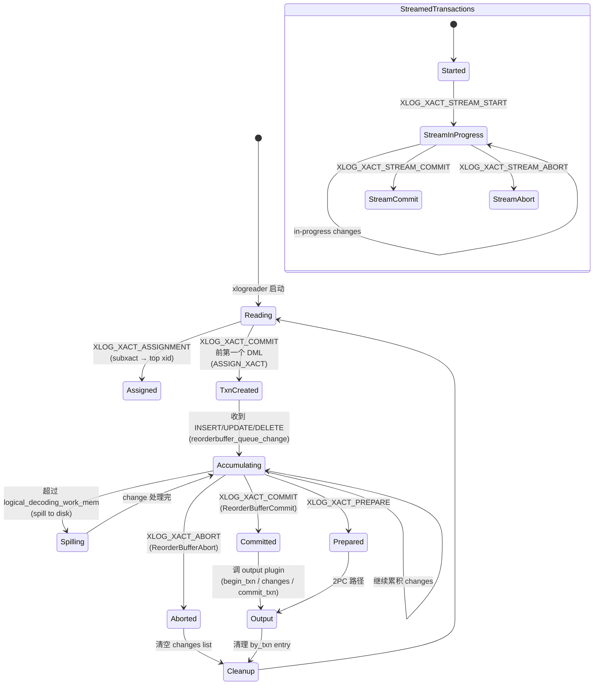
```mermaid
stateDiagram-v2
    [*] --> Reading: xlogreader 启动
    
    Reading --> Assigned: XLOG_XACT_ASSIGNMENT<br/>(subxact → top xid)
    Reading --> TxnCreated: XLOG_XACT_COMMIT<br/>前第一个 DML<br/>(ASSIGN_XACT)
    
    TxnCreated --> Accumulating: 收到 INSERT/UPDATE/DELETE<br/>(reorderbuffer_queue_change)
    
    Accumulating --> Accumulating: 继续累积 changes
    Accumulating --> Spilling: 超过 logical_decoding_work_mem<br/>(spill to disk)
    Spilling --> Accumulating: change 处理完
    
    Accumulating --> Committed: XLOG_XACT_COMMIT<br/>(ReorderBufferCommit)
    Accumulating --> Aborted: XLOG_XACT_ABORT<br/>(ReorderBufferAbort)
    Accumulating --> Prepared: XLOG_XACT_PREPARE
    
    Committed --> Output: 调 output plugin<br/>(begin_txn / changes / commit_txn)
    Aborted --> Cleanup: 清空 changes list
    Prepared --> Output: 2PC 路径
    
    Output --> Cleanup: 清理 by_txn entry
    Cleanup --> Reading
    
    state StreamedTransactions {
        [*] --> Started
        Started --> StreamInProgress: XLOG_XACT_STREAM_START
        StreamInProgress --> StreamInProgress: in-progress changes
        StreamInProgress --> StreamCommit: XLOG_XACT_STREAM_COMMIT
        StreamInProgress --> StreamAbort: XLOG_XACT_STREAM_ABORT
    }
```

### 13.23.1 每种 change 的处理

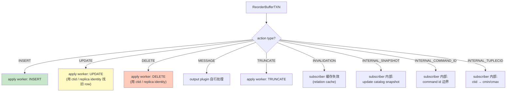
```mermaid
flowchart TD
    A["ReorderBufferTXN"] --> B{action type?}
    B -->|INSERT| C1["apply worker: INSERT"]
    B -->|UPDATE| C2["apply worker: UPDATE<br/>(用 ctid / replica identity 找旧 row)"]
    B -->|DELETE| C3["apply worker: DELETE<br/>(用 ctid / replica identity)"]
    B -->|MESSAGE| C4["output plugin 自行处理"]
    B -->|TRUNCATE| C5["apply worker: TRUNCATE"]
    B -->|INVALIDATION| C6["subscriber 缓存失效<br/>(relation cache)"]
    B -->|INTERNAL_SNAPSHOT| C7["subscriber 内部:<br/>update catalog snapshot"]
    B -->|INTERNAL_COMMAND_ID| C8["subscriber 内部:<br/>command id 边界"]
    B -->|INTERNAL_TUPLECID| C9["subscriber 内部:<br/>ctid → cmin/cmax"]
    
    style C1 fill:#c8e6c9
    style C2 fill:#fff9c4
    style C3 fill:#ffccbc
```

### 13.23.2 ReorderBuffer 与 transaction hash

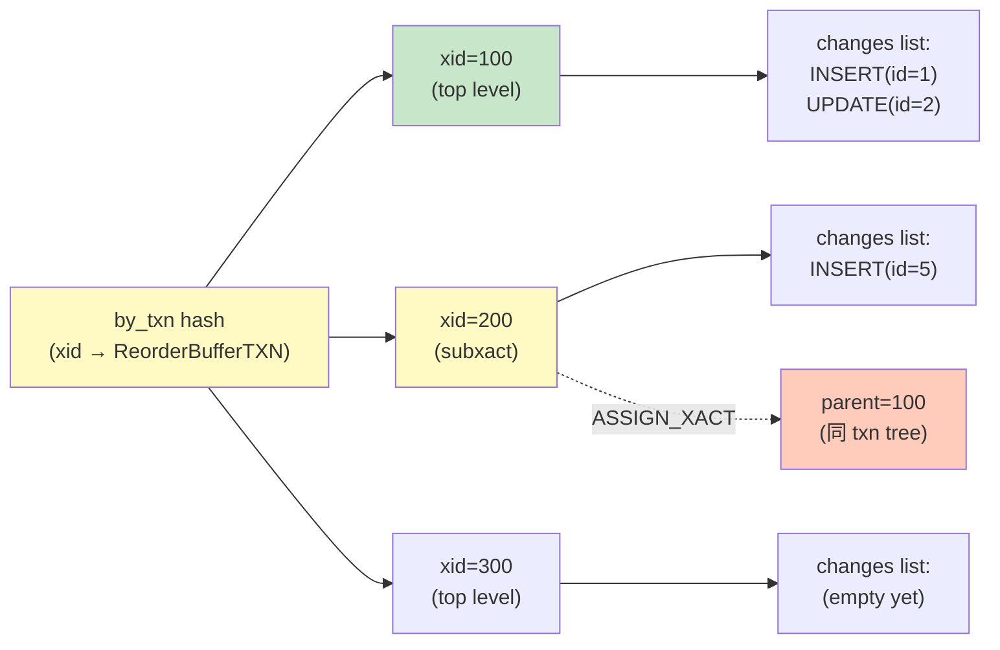
```mermaid
graph LR
    H1["by_txn hash<br/>(xid → ReorderBufferTXN)"]
    
    H1 --> X1["xid=100<br/>(top level)"]
    H1 --> X2["xid=200<br/>(subxact)"]
    H1 --> X3["xid=300<br/>(top level)"]
    
    X1 --> X11["changes list:<br/>INSERT(id=1)<br/>UPDATE(id=2)"]
    X2 --> X21["changes list:<br/>INSERT(id=5)"]
    X3 --> X31["changes list:<br/>(empty yet)"]
    
    X2 -.->|ASSIGN_XACT| P2["parent=100<br/>(同 txn tree)"]
    
    style H1 fill:#fff9c4
    style X1 fill:#c8e6c9
    style X2 fill:#fff9c4
    style P2 fill:#ffccbc
```


## 13.24 Snapshot 构建（snapbuild.c）

### 13.24.1 为什么需要 historic snapshot

WAL 记录的是 **物理字节**，要把 `HEAP_INSERT` record 还原成 semantic HeapTuple，必须知道每个字段的类型。字段类型存在 `pg_attribute` 里，而 `pg_attribute` 本身也是表（catalog table）。

要查 catalog tuple 的当前形态，必须有一个 **snapshot**：
- 看到的是 WAL record 产生那一刻的 catalog 状态
- 而不是"现在"的 catalog 状态

这就是 snapbuild 的职责：**从 WAL 反推当时 catalog 的可见性**。

### 13.24.2 snapbuild 实现

`src/backend/replication/logical/snapbuild.c`：

```c
typedef struct SnapBuild {
    /* 当前构建中的 snapshot */
    Snapshot  snapshot;
    /* 起始 xid (avoid full snapshot) */
    TransactionId xmin;
    /* 当前已知的 top-level committed xid 范围 */
    TransactionId xmax;
    
    /* state machine */
    enum SnapBuildState {
        SNAPBUILD_START,            /* 还没准备好 */
        SNAPBUILD_CONSISTENT,       /* snapshot 一致，可解码 */
        SNAPBUILD_FULL,             /* full snapshot 已建 */
    } state;
    
    /* running transactions at snapshot time */
    HTAB *running_xacts;
    
    /* catalog tuple 缓存 */
    HTAB *cached_tuplecid;
    
    /* relcache invalidation queue */
    dlist_head invalidation_queue;
    
    /* next LSN to process */
    XLogRecPtr next_lsn;
} SnapBuild;
```

### 13.24.3 snapbuild 处理流程

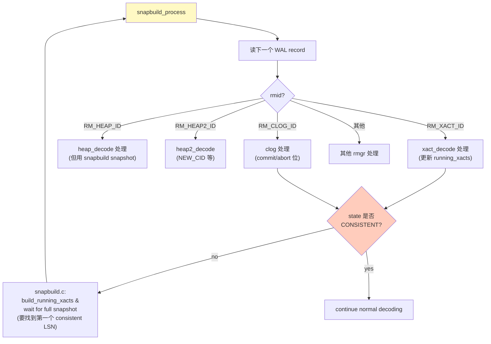
```mermaid
flowchart TD
    S["snapbuild_process"]
    S --> R["读下一个 WAL record"]
    R --> R0{"rmid?"}
    
    R0 -->|RM_XACT_ID| RXA["xact_decode 处理<br/>(更新 running_xacts)"]
    R0 -->|RM_HEAP_ID| RH["heap_decode 处理<br/>(但用 snapbuild snapshot)"]
    R0 -->|RM_HEAP2_ID| RH2["heap2_decode<br/>(NEW_CID 等)"]
    R0 -->|RM_CLOG_ID| RC["clog 处理<br/>(commit/abort 位)"]
    R0 -->|其他| RO["其他 rmgr 处理"]
    
    RXA --> CHECK{"state 是否<br/>CONSISTENT?"}
    RC --> CHECK
    
    CHECK -->|no| BLD["snapbuild.c:<br/>build_running_xacts &<br/>wait for full snapshot<br/>(要找到第一个 consistent LSN)"]
    CHECK -->|yes| CONT["continue normal decoding"]
    
    BLD --> S
    
    style S fill:#fff9c4
    style CHECK fill:#ffccbc
```

### 13.24.4 SNAPBUILD_CONSISTENT 达成

**最关键的步骤**：

```c
// snapbuild.c
bool SnapBuildConsistent(SnapBuild *builder, XLogRecPtr *next_lsn)
{
    /* 当且仅当以下都满足时返回 true:
     *  1. 没有 running xact
     *  2. catalog 没有 in-progress 变更
     *  3. 没有 uncommitted subxact
     */
    
    /* 1. running_xacts 为空 */
    if (hash_get_num_entries(builder->running_xacts) > 0)
        return false;
    
    /* 2. latest snapshot xmin 之前的所有 xact 都已 commit/abort */
    /* 3. 没有未提交的 subxact */
    
    return true;
}
```

### 13.24.5 snapbuild 与 relcache 失效

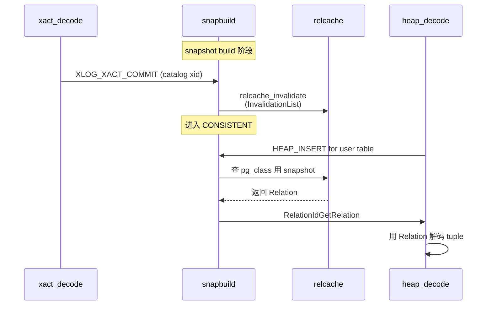
```mermaid
sequenceDiagram
    participant XA as xact_decode
    participant SB as snapbuild
    participant RC as relcache
    participant HD as heap_decode
    
    Note over SB: snapshot build 阶段
    XA->>SB: XLOG_XACT_COMMIT (catalog xid)
    SB->>RC: relcache_invalidate<br/>(InvalidationList)
    
    Note over SB: 进入 CONSISTENT
    HD->>SB: HEAP_INSERT for user table
    SB->>RC: 查 pg_class 用 snapshot
    RC-->>SB: 返回 Relation
    SB->>HD: RelationIdGetRelation
    HD->>HD: 用 Relation 解码 tuple
```

### 13.24.6 historic snapshot 数据结构

```c
typedef struct SnapshotData {
    TransactionId xmin;
    TransactionId xmax;
    TransactionId *xip;        // 活跃 xid 数组
    uint32 xcnt;
    
    /* logical-specific fields */
    TransactionId oldestRunningXid;  // 最老的 running xid
    TransactionId xminAssigned;      // 假设已 commit 的最低 xid
} SnapshotData;
```

> 与第 6 章 MVCC snapshot 的差别：historic snapshot 的 `xmin/xmax/xip` 来自 WAL 反推，而不是实时 Proc 数组。

## 13.25 事务生命周期与 ASSIGN_XACT

### 13.25.1 事务状态在 logical 视角下

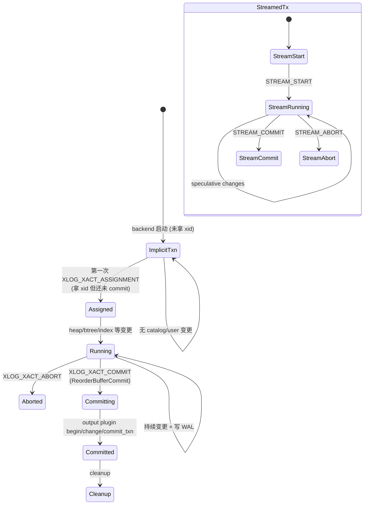
```mermaid
stateDiagram-v2
    [*] --> ImplicitTxn: backend 启动 (未拿 xid)
    ImplicitTxn --> ImplicitTxn: 无 catalog/user 变更
    
    ImplicitTxn --> Assigned: 第一次 XLOG_XACT_ASSIGNMENT<br/>(拿 xid 但还未 commit)
    
    Assigned --> Running: heap/btree/index 等变更
    
    Running --> Running: 持续变更 + 写 WAL
    Running --> Aborted: XLOG_XACT_ABORT
    
    Running --> Committing: XLOG_XACT_COMMIT<br/>(ReorderBufferCommit)
    Committing --> Committed: output plugin begin/change/commit_txn
    Committed --> Cleanup: cleanup
    
    state StreamedTx {
        [*] --> StreamStart
        StreamStart --> StreamRunning: STREAM_START
        StreamRunning --> StreamRunning: speculative changes
        StreamRunning --> StreamCommit: STREAM_COMMIT
        StreamRunning --> StreamAbort: STREAM_ABORT
    }
```

### 13.25.2 XLOG_XACT_ASSIGNMENT 处理

```c
// src/backend/replication/logical/decode.c
static void DecodeXactAssignment(LogicalDecodingContext *ctx, XLogRecordBuffer *buf)
{
    xl_xact_assignment *xlrec = (xl_xact_assignment *) XLogRecGetData(buf->record);
    
    ReorderBufferAssignChild(ctx->reorder,
                             xlrec->xtop,           // top-level xid
                             buf->record->xl_xid,    // subxid
                             xlrec->xid_array);      // 已分配的 subxid 列表
}
```

`ReorderBufferAssignChild` 把 subxid 关联到 top-level xid：

```c
// reorderbuffer.c
void ReorderBufferAssignChild(ReorderBuffer *rb, TransactionId xid,
                              TransactionId sub_xid, XLogRecPtr *sub_xtop_lsn)
{
    /* 1. 找 top-level txn */
    top_txn = ReorderBufferTXNByXid(rb, xid);
    if (!top_txn) {
        /* 还没建 → 建一个 */
        top_txn = ReorderBufferTXNInit(rb, xid);
    }
    
    /* 2. 关联 subxid */
    sub_txn = ReorderBufferTXNByXid(rb, sub_xid);
    if (!sub_txn) {
        sub_txn = ReorderBufferTXNInit(rb, sub_xid);
        sub_txn->toptxn = top_txn;
        /* 也可继承 top_txn 的 snapshot */
    }
}
```

### 13.25.3 ReorderBufferCommit 完整流程

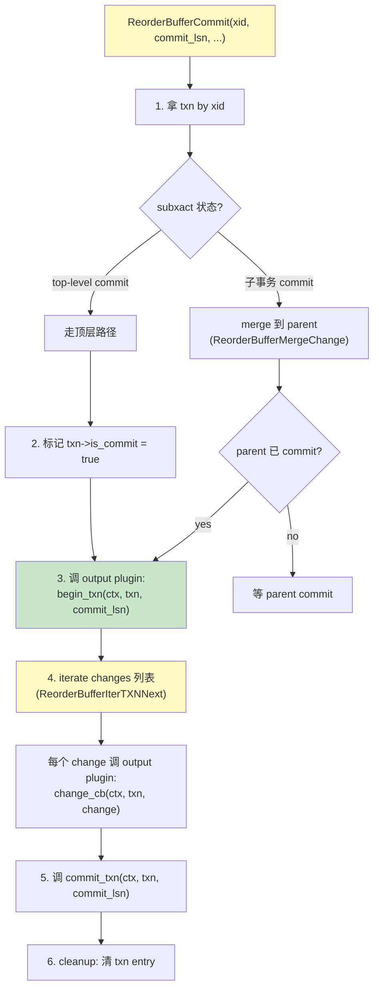
```mermaid
flowchart TD
    A["ReorderBufferCommit(xid, commit_lsn, ...)"]
    A --> B["1. 拿 txn by xid"]
    B --> C{"subxact 状态?"}
    
    C -->|子事务 commit| C1["merge 到 parent<br/>(ReorderBufferMergeChange)"]
    C -->|top-level commit| C2["走顶层路径"]
    
    C1 --> C3{"parent 已 commit?"}
    C3 -->|yes| E["立即 output"]
    C3 -->|no| C4["等 parent commit"]
    
    C2 --> D["2. 标记 txn->is_commit = true"]
    D --> E["3. 调 output plugin:<br/>begin_txn(ctx, txn, commit_lsn)"]
    
    E --> F["4. iterate changes 列表<br/>(ReorderBufferIterTXNNext)"]
    F --> G["每个 change 调 output plugin:<br/>change_cb(ctx, txn, change)"]
    G --> H["5. 调 commit_txn(ctx, txn, commit_lsn)"]
    H --> I["6. cleanup: 清 txn entry"]
    
    style A fill:#fff9c4
    style E fill:#c8e6c9
    style F fill:#fff9c4
```

### 13.25.4 ASSIGN_XACT 的重要性

PG 的 WAL 不一定每个 subxact 都写自己的 xid，**节约空间**。所以：

```
BEGIN;
SAVEPOINT s1;     -- 拿 subxid 1，写 XLOG_XACT_ASSIGNMENT
INSERT ...;        -- HEAP_INSERT (xid=subxid1)
ROLLBACK TO s1;    -- 写 ABORT(subxid1)
INSERT ...;        -- HEAP_INSERT (xid=subxid1)
SAVEPOINT s2;      -- 拿 subxid2
INSERT ...;
COMMIT;            -- 写 COMMIT(topxid)
```

logical decoding 必须把 subxid1 的两个 INSERT 都算到 top-level commit 后的输出里。

ASSIGN_XACT 是这里唯一能让 decoder 知道 subxid 与 top-xid 映射的 record。

### 13.25.5 top-level commit 的"等待子事务"

```c
void ReorderBufferCommit(LogicalDecodingContext *ctx, TransactionId xid,
                         XLogRecPtr commit_lsn, ...)
{
    txn = ReorderBufferTXNByXid(ctx->reorder, xid);
    
    /* 如果 top-xid 但有未完成子事务：
     *  调 ReorderBufferCommitOrdered 处理（按 commit_lsn 顺序） */
    
    /* 如果是子事务 commit 但 top 未 commit：
     *  把 changes merge 到 top_txn，标记 is_commit = true */
}
```

### 13.25.6 abort 流程

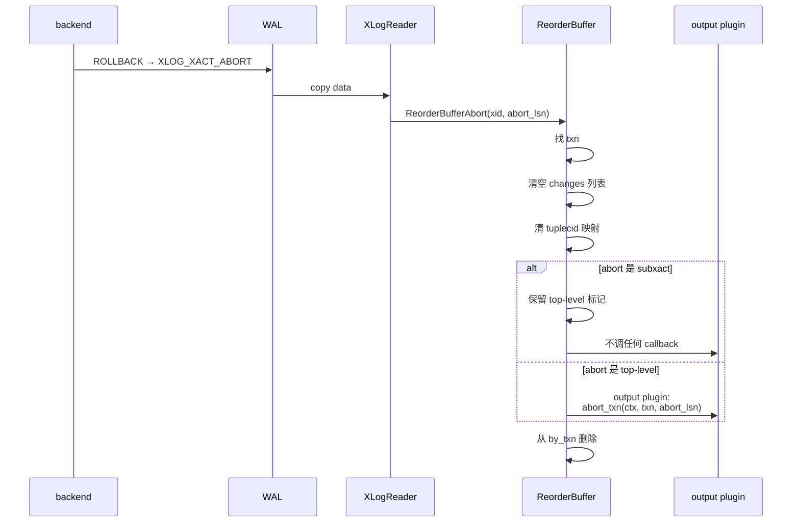
```mermaid
sequenceDiagram
    participant B as backend
    participant WAL as WAL
    participant XC as XLogReader
    participant RB as ReorderBuffer
    participant OP as output plugin
    
    B->>WAL: ROLLBACK → XLOG_XACT_ABORT
    WAL->>XC: copy data
    XC->>RB: ReorderBufferAbort(xid, abort_lsn)
    
    RB->>RB: 找 txn
    RB->>RB: 清空 changes 列表
    RB->>RB: 清 tuplecid 映射
    
    alt abort 是 subxact
        RB->>RB: 保留 top-level 标记
        RB->>OP: 不调任何 callback
    else abort 是 top-level
        RB->>OP: output plugin:<br/>abort_txn(ctx, txn, abort_lsn)
    end
    
    RB->>RB: 从 by_txn 删除
```

## 13.26 subtransaction 与 xact 树

### 13.26.1 txactree 数据结构

```c
// reorderbuffer.c 内部结构
typedef struct ReorderBufferTXN {
    TransactionId  xid;
    
    /* subxact 关联 */
    struct ReorderBufferTXN *toptxn;   // 顶层 txn 指针
    List          *subtxns;             // 子事务列表
    List          *changes;             // 自己的 changes
    List          *tuplecids;           // 自己的 tuplecid 映射
    
    /* 维护 */
    bool           is_commit;
    bool           is_aborted;
    XLogRecPtr     commit_lsn;
    ...
} ReorderBufferTXN;
```

### 13.26.2 subxact commit 顺序

当 subxact 1 commit，top-xid 还没 commit：

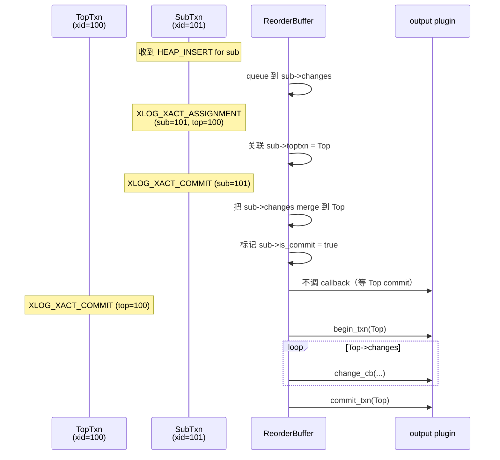
```mermaid
sequenceDiagram
    participant Top as TopTxn<br/>(xid=100)
    participant Sub as SubTxn<br/>(xid=101)
    participant RB as ReorderBuffer
    participant OP as output plugin
    
    Note over Sub: 收到 HEAP_INSERT for sub
    RB->>RB: queue 到 sub->changes
    
    Note over Sub: XLOG_XACT_ASSIGNMENT<br/>(sub=101, top=100)
    RB->>RB: 关联 sub->toptxn = Top
    
    Note over Sub: XLOG_XACT_COMMIT (sub=101)
    RB->>RB: 把 sub->changes merge 到 Top
    RB->>RB: 标记 sub->is_commit = true
    RB->>OP: 不调 callback（等 Top commit）
    
    Note over Top: XLOG_XACT_COMMIT (top=100)
    RB->>OP: begin_txn(Top)
    loop Top->changes
        RB->>OP: change_cb(...)
    end
    RB->>OP: commit_txn(Top)
```

### 13.26.3 suboverflowed 保护

```c
// reorderbuffer.c
#define XID_SUBTRANS_WIDTH 17  // 最多 2^17 subxact per top-xact

if (subidx >= XID_SUBTRANS_WIDTH) {
    /* 满了 → 抛弃 subxact 映射 */
    ereport(WARNING, "subxact overflow");
    /* 后续 subxact 都被当作 top-level xid */
    txn->toptxn = NULL;
}
```

## 13.27 pgoutput 输出插件协议

### 13.27.1 pgoutput 入口

`src/backend/replication/pgoutput/pgoutput.c`：

```c
PG_MODULE_MAGIC;
PG_FUNCTION_INFO_V1(pgoutput_init);
PG_FUNCTION_INFO_V1(pgoutput_shutdown);
PG_FUNCTION_INFO_V1(pgoutput_startup);

extern void _PG_output_plugin_init(OutputPluginCallbacks *cb);
```

`_PG_output_plugin_init` 注册 5 个 callback：

```c
void _PG_output_plugin_init(OutputPluginCallbacks *cb)
{
    cb->startup_cb = pgoutput_startup;
    cb->begin_cb = pgoutput_begin_txn;
    cb->change_cb = pgoutput_change;
    cb->commit_cb = pgoutput_commit_txn;
    cb->shutdown_cb = pgoutput_shutdown;
    /* abort_cb / message_cb / truncate_cb / filter_cb 在 PG 16+ 也注册 */
}
```

### 13.27.2 pgoutput_startup —— 建上下文

```c
static List *pgoutput_startup(LogicalDecodingContext *ctx,
                              OutputPluginOptions *opt,
                              bool is_init)
{
    PGOutputData *data;
    
    data = palloc0(sizeof(PGOutputData));
    data->context = AllocSetContextCreate(...);
    
    /* publications 列表 */
    data->publications = opt->publication_names;
    
    /* publication 中涉及的 tables 缓存 */
    data->typemap = NULL;
    
    ctx->output_plugin_private = data;
    return NIL;
}
```

### 13.27.3 pgoutput_begin_txn —— 发 BEGIN 消息

```c
static void pgoutput_begin_txn(LogicalDecodingContext *ctx, ReorderBufferTXN *txn)
{
    PGOutputData *data = (PGOutputData *) ctx->output_plugin_private;
    
    /* 输出 begin 消息: 'B' + xid + timestamp + xact_id */
    OutputPluginPrepareWrite(ctx, true);
    pq_sendbyte(ctx->out, 'B');
    pq_sendint64(ctx->out, txn->xid);          // 8 byte xid
    /* ... */
    
    /* 第一个 change 前的 relation 消息 */
    output_relation_first(ctx, txn);
}
```

### 13.27.4 pgoutput_change —— 发变更消息

```c
static void pgoutput_change(LogicalDecodingContext *ctx, ReorderBufferTXN *txn,
                           Relation relation, ReorderBufferChange *change)
{
    PGOutputData *data = (PGOutputData *) ctx->output_plugin_private;
    
    switch (change->action) {
        case REORDER_BUFFER_CHANGE_INSERT:
            /* 'I' + relid → typemap + tuple */
            pgoutput_insert(ctx, relation, change);
            break;
        case REORDER_BUFFER_CHANGE_UPDATE:
            pgoutput_update(ctx, relation, change);
            break;
        case REORDER_BUFFER_CHANGE_DELETE:
            pgoutput_delete(ctx, relation, change);
            break;
        ...
    }
}
```

### 13.27.5 pgoutput_change 内部流程

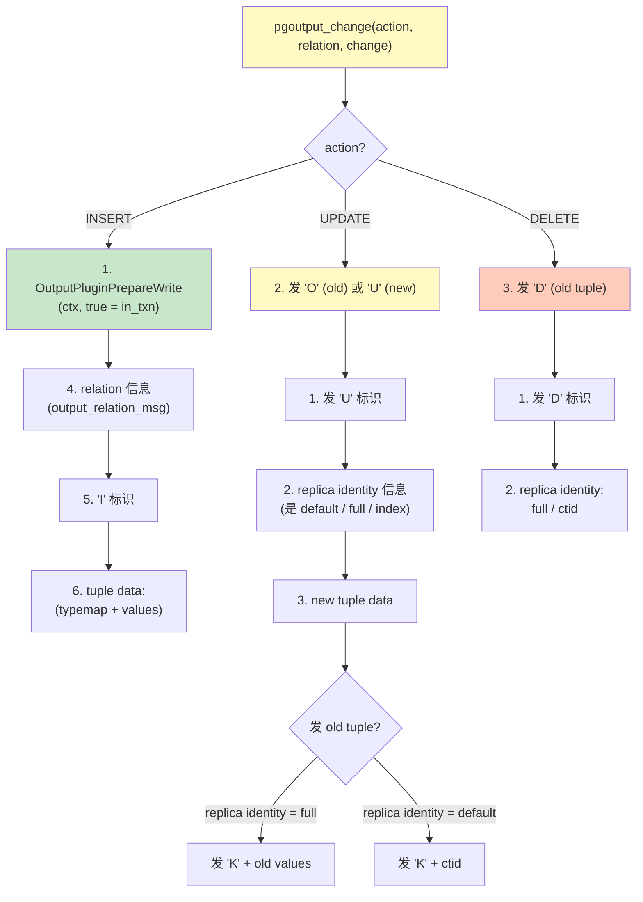
```mermaid
flowchart TD
    A["pgoutput_change(action, relation, change)"]
    A --> B{"action?"}
    
    B -->|INSERT| C1["1. OutputPluginPrepareWrite<br/>(ctx, true = in_txn)"]
    B -->|UPDATE| C2["2. 发 'O' (old) 或 'U' (new)"]
    B -->|DELETE| C3["3. 发 'D' (old tuple)"]
    
    C1 --> C1a["4. relation 信息<br/>(output_relation_msg)"]
    C1a --> C1b["5. 'I' 标识"]
    C1b --> C1c["6. tuple data:<br/>(typemap + values)"]
    
    C2 --> C2a["1. 发 'U' 标识"]
    C2a --> C2b["2. replica identity 信息<br/>(是 default / full / index)"]
    C2b --> C2c["3. new tuple data"]
    C2c --> C2d{"发 old tuple?"}
    C2d -->|replica identity = full| C2e["发 'K' + old values"]
    C2d -->|replica identity = default| C2f["发 'K' + ctid"]
    
    C3 --> C3a["1. 发 'D' 标识"]
    C3a --> C3b["2. replica identity:<br/>full / ctid"]
    
    style A fill:#fff9c4
    style C1 fill:#c8e6c9
    style C2 fill:#fff9c4
    style C3 fill:#ffccbc
```

### 13.27.6 pgoutput 协议头格式

```c
// proto.c

/* BEGIN message */
'b'                -- tag
int64              -- xid
int64              -- xact commit timestamp

/* COMMIT message */
'C'                -- tag
int8               -- flag (0/1 commit/xact)
int64              -- xid

/* RELATION message (列定义) */
'R'                -- tag
int32              -- relid
string             -- namespace
string             -- relname
int8               -- replica identity
int16              -- num columns
[col]
  byte             -- flag
  string           -- column name
  int32            -- column oid
  int32            -- typmod

/* INSERT message */
'I'                -- tag
int16              -- natts
[column]
  byte             -- flag (NORMAL/NULL/TOASTED/UNCHANGED)
  bytes            -- value

/* UPDATE message */
'U' (full new)
'K' (old tuple)
/ or
'U' + 'N' (new tuple via replica identity)

/* DELETE message */
'D' + 'K' (old tuple)
```

### 13.27.7 typemap 缓存

```c
typedef struct PGOutputTypemap {
    /* relations cache: oid → RelationMeta */
    HTAB *relmeta;
    
    /* relation 的列信息 */
    typedef struct RelationMeta {
        Relation  rel;
        int       natts;
        TupleDesc tupdesc;
    } RelationMeta;
    
    /* type cache */
    Oid      *typisarray;
    Form_pg_type *attrtyps;
} PGOutputTypemap;
```

## 13.28 apply worker 完整流程

### 13.28.1 apply worker 启动

`src/backend/replication/logical/worker.c:ApplyWorkerMain()`：

```c
void ApplyWorkerMain(void)
{
    /* 1. 解析 subscription 信息 */
    sub = GetSubscription(subid, ShareUpdateExclusiveLock);
    
    /* 2. 建立 publisher connection */
    conn = libpq_connect(sub->conninfo);
    
    /* 3. START_REPLICATION 启动 stream */
    libpq_send_query(conn, "START_REPLICATION ...");
    
    /* 4. 进入主循环 */
    for (;;) {
        /* 5. 接收 logical proto 消息 */
        handle_streamed_message(conn);
    }
}
```

### 13.28.2 handle_streamed_message 主循环

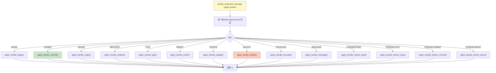
```mermaid
flowchart TD
    A["handle_streamed_message (apply worker)"]
    A --> M["读一条 libpq logical proto 消息"]
    M --> T{"tag?"}
    
    T -->|BEGIN| AB["apply_handle_begin()"]
    T -->|COMMIT| AC["apply_handle_commit()"]
    T -->|ORIGIN| AO["apply_handle_origin()"]
    T -->|RELATION| AR["apply_handle_relation()"]
    T -->|TYPE| AT["apply_handle_type()"]
    T -->|INSERT| AI["apply_handle_insert()"]
    T -->|UPDATE| AU["apply_handle_update()"]
    T -->|DELETE| AD["apply_handle_delete()"]
    T -->|TRUNCATE| ATR["apply_handle_truncate()"]
    T -->|MESSAGE| AM["apply_handle_message()"]
    T -->|STREAM START| ASS["apply_handle_stream_start()"]
    T -->|STREAM STOP| ASE["apply_handle_stream_stop()"]
    T -->|STREAM COMMIT| ASC["apply_handle_stream_commit()"]
    T -->|STREAM ABORT| ASA["apply_handle_stream_abort()"]
    
    AB --> LOOP
    AC --> LOOP
    AO --> LOOP
    AR --> LOOP
    AT --> LOOP
    AI --> LOOP
    AU --> LOOP
    AD --> LOOP
    ATR --> LOOP
    AM --> LOOP
    ASS --> LOOP
    ASE --> LOOP
    ASC --> LOOP
    ASA --> LOOP
    
    LOOP["回到 A"]
    
    style A fill:#fff9c4
    style AC fill:#c8e6c9
    style AD fill:#ffccbc
```

### 13.28.3 apply_handle_insert 完整实现

```c
static void apply_handle_insert(StringInfo s)
{
    /* 1. 解析消息：relid + replica identity + new tuple */
    relid = pq_getmsgint(s, 4);
    /* ... 读 ncols, t_values, t_isnull ... */
    
    /* 2. 通过 relation cache 找目标表 */
    targetrel = table_open(relid, RowExclusiveLock);
    
    /* 3. 构造 HeapTuple */
    newtup = heap_form_tuple(targetrel->rd_att, t_values, t_isnull);
    
    /* 4. 调 heap_insert 写入 */
    simple_heap_insert(targetrel, newtup);
    
    /* 5. XLogInsert (在 subscriber WAL 里记一笔) */
    
    /* 6. 更新 apply progress */
    flush_progress();
}
```

### 13.28.4 apply_handle_update 与 replica identity

```c
static void apply_handle_update(StringInfo s)
{
    /* 1. 解析消息 */
    relid = pq_getmsgint(s, 4);
    /* old tuple: 用 replica identity 列找 */
    /* new tuple: 替换列 */
    
    /* 2. 找 old tuple */
    /* replica identity = DEFAULT: 用 ctid (block+offnum) */
    /* replica identity = FULL: 用所有列 */
    /* replica identity = USING INDEX: 用索引列 */
    
    /* 3. heap_update(targetrel, old_tid, new_tup, ...) */
    simple_heap_update(targetrel, old_tid, newtup);
}
```

### 13.28.5 流控与 LSN feedback

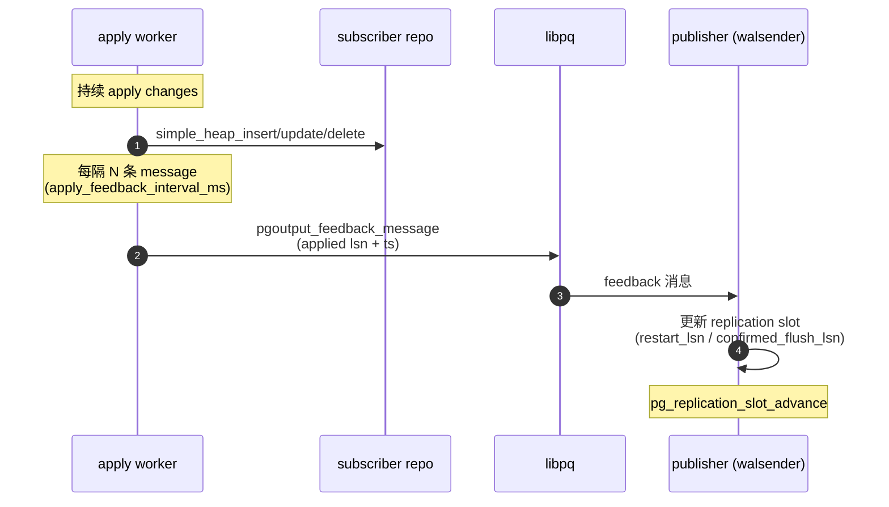
```mermaid
sequenceDiagram
    autonumber
    participant AW as apply worker
    participant SR as subscriber repo
    participant LT as libpq
    participant PS as publisher (walsender)
    
    Note over AW: 持续 apply changes
    AW->>SR: simple_heap_insert/update/delete
    
    Note over AW: 每隔 N 条 message<br/>(apply_feedback_interval_ms)
    AW->>LT: pgoutput_feedback_message<br/>(applied lsn + ts)
    LT->>PS: feedback 消息
    
    PS->>PS: 更新 replication slot<br/>(restart_lsn / confirmed_flush_lsn)
    
    Note over PS: pg_replication_slot_advance
```

### 13.28.6 apply worker 错误处理

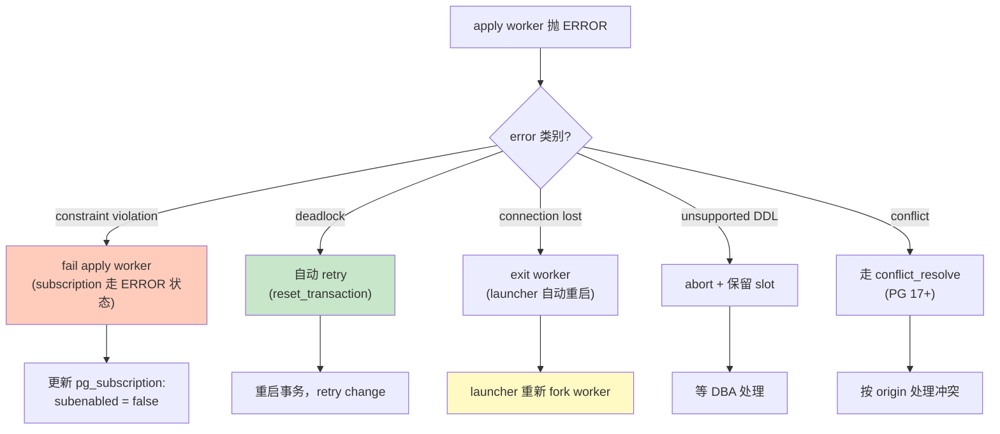
```mermaid
flowchart TD
    A["apply worker 抛 ERROR"]
    A --> B{"error 类别?"}
    
    B -->|constraint violation| C1["fail apply worker<br/>(subscription 走 ERROR 状态)"]
    B -->|deadlock| C2["自动 retry<br/>(reset_transaction)"]
    B -->|connection lost| C3["exit worker<br/>(launcher 自动重启)"]
    B -->|unsupported DDL| C4["abort + 保留 slot"]
    B -->|conflict| C5["走 conflict_resolve<br/>(PG 17+)"]
    
    C1 --> SUB_STATE["更新 pg_subscription:<br/>subenabled = false"]
    C2 --> RETRY["重启事务，retry change"]
    C3 --> LAUNCHER["launcher 重新 fork worker"]
    C4 --> WAIT["等 DBA 处理"]
    C5 --> HANDLER["按 origin 处理冲突"]
    
    style C1 fill:#ffccbc
    style C2 fill:#c8e6c9
    style LAUNCHER fill:#fff9c4
```

### 13.28.7 tablesync worker (初始同步)

```c
// src/backend/replication/logical/tablesync.c
void TablesyncWorkerMain(void)
{
    /* 1. 同步目标表的结构 (DDL) */
    remote_rel = fetch_remote_table_def(...);
    create_target_table_if_not_exists(remote_rel);
    
    /* 2. 启动 temporary replication slot */
    create_slot();
    
    /* 3. COPY 全表数据 */
    libpq_send_query(conn, "COPY ...");
    while ((row = PQgetResult(conn))) {
        simple_heap_insert(targetrel, row);
    }
    
    /* 4. 等待 apply worker 接管 */
    wait_for_apply_worker();
    
    /* 5. 标记同步完成 (substate = SYNCDONE) */
    update_sub_state(subid, ...);
}
```


## 13.29 WAL summarizer 与 decoding 加速

### 13.29.1 引入动机

PG 16 之前，logical decoding 必须 **顺序读完 restart_lsn 之后所有 WAL**。这意味着：
- 一个运行 7 天没重启的 publisher，apply worker 重启后必须 rewind 7 天的 WAL
- 大 WAL 量场景下，启动代价巨大

PG 16+ 的 `walsummarizer` 把"每个 page 是否被该 xid 改过"摘要写到 `.summary` 文件。

### 13.29.2 walsummarizer 进程

`src/backend/replication/walsummarizer.c`：

```c
void WalSummarizerMain(void)
{
    /* 周期循环：summarize current WAL */
    while (!got_SIGTERM) {
        WalSummarizerReadNextRecord(&state);
        
        if (state.recptr != InvalidXLogRecPtr) {
            /* 把 page 改动写到 summary */
            summarize_record(&state);
        }
        
        sleep(wal_summarizer_timeout);
    }
}
```

### 13.29.3 summary 文件格式

`$PGDATA/pg_wal/summaries/<timeline>-<logid>-<segid>.summary`：

```
| header 16 bytes |
| per-record: 4 bytes bitmap + 8 bytes tli + ... |
| per-page: 1 bit "modified" |
```

PG 18+ 把 summary 写到 `pg_wal/summaries/`。

### 13.29.4 与 ReorderBuffer 的协作

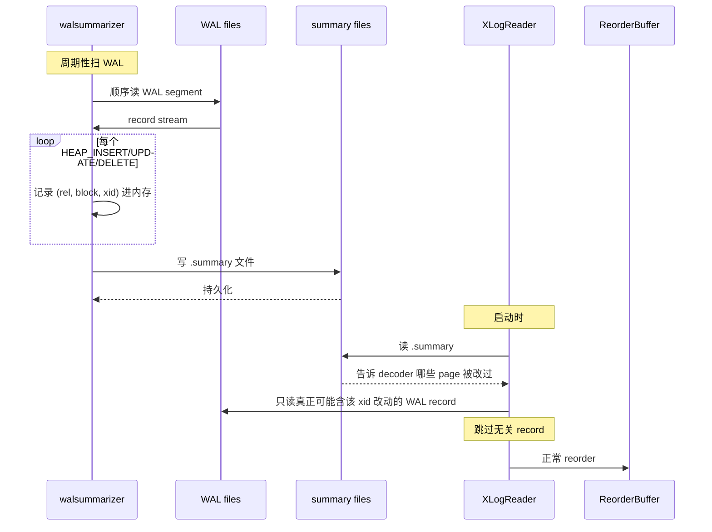
```mermaid
sequenceDiagram
    participant WS as walsummarizer
    participant WAL as WAL files
    participant SUM as summary files
    participant XC as XLogReader
    participant RB as ReorderBuffer
    
    Note over WS: 周期性扫 WAL
    WS->>WAL: 顺序读 WAL segment
    WAL->>WS: record stream
    
    loop 每个 HEAP_INSERT/UPDATE/DELETE
        WS->>WS: 记录 (rel, block, xid) 进内存
    end
    
    WS->>SUM: 写 .summary 文件
    SUM-->>WS: 持久化
    
    Note over XC: 启动时
    XC->>SUM: 读 .summary
    SUM-->>XC: 告诉 decoder 哪些 page 被改过
    
    XC->>WAL: 只读真正可能含该 xid 改动的 WAL record
    Note over XC: 跳过无关 record
    XC->>RB: 正常 reorder
```

### 13.29.5 GUC

```sql
postgres.conf:
wal_summarizer_timeout = '30min'  -- PG 18+
wal_summary_keep_time = '7d'      -- summary 保留时间
```

> PG 17- 时通过 `wal_summarizer` 进程启用；PG 18 把 timeout 加进了 GUC。

## 13.30 错误处理与冲突解决

### 13.30.1 conflict 的来源

双向同步或多写场景下，apply worker 可能遇到冲突：

```mermaid
graph TB
    A["apply worker apply change"]
    A --> B1["unique key 冲突<br/>(PK 重复)"]
    A --> B2["foreign key 违反"]
    A --> B3["trigger ERROR"]
    A --> B4["NOT NULL 违反"]
    A --> B5["replica identity 不匹配<br/>(找不到 old row)"]
    A --> B6["row 已被本地修改<br/>(UPDATE / DELETE)"]
    
    B1 --> ERR["apply ERROR"]
    B2 --> ERR
    B3 --> ERR
    B4 --> ERR
    B5 --> ERR
    B6 --> CONFLICT["冲突 (PG 17+)"]
    
    ERR --> SUB_STATE["pg_subscription.subenabled=false"]
    CONFLICT --> HANDLER["冲突解决策略"]
```

### 13.30.2 conflict resolution (PG 17+)

PG 17 起，订阅端可定义 **冲突解决策略**：

```sql
-- 表级策略
ALTER SUBSCRIPTION my_sub SET (
    conflict_resolution = 'apply' | 'keep' | 'remote' | 'origin'
);
```

策略：
- `error`（默认）：直接 ERROR
- `apply`：应用 change，丢弃本地修改
- `keep`：保留本地，丢弃 incoming change
- `origin`：按 origin_id 决定谁赢

### 13.30.3 origin 在 conflict 解决中的作用

```c
// src/backend/replication/logical/conflict.c
void
ResolveConflict(ApplyExecutionState *state, ...)
{
    if (origin == REMOTE_ORIGIN) {
        /* 应用 incoming change） */
        return ApplyTuple(...);
    } else if (origin == LOCAL_ORIGIN) {
        /* 保留本地） */
        return SKIP;
    }
}
```

### 13.30.4 apply worker ERROR 后的恢复

```mermaid
sequenceDiagram
    participant DBA as DBA
    participant AW as apply worker
    participant SUB as pg_subscription
    participant LW as launcher
    
    AW-->>SUB: error → 状态 disabled
    Note over SUB: subenabled = false<br/>substate = 'disable'
    
    DBA->>SUB: SELECT pg_subscription<br/>(看 status)
    DBA->>DBA: 解决冲突 (例如：删 conflict row)
    
    DBA->>SUB: ALTER SUBSCRIPTION my_sub ENABLE
    LW->>LW: 看到 enabled → fork 新 apply worker
    LW->>AW: 新 worker 启动
    AW->>AW: 从 restart_lsn 继续 apply
```

## 13.31 test_decoding 源码走读

`contrib/test_decoding/test_decoding.c` 是参考实现，**理解 logical decoding 最干净的方式**。

### 13.31.1 test_decoding 输出格式

```sql
postgres=# SELECT * FROM pg_logical_slot_get_changes('test', NULL, NULL);
```

输出（人可读）：

```
table public.t: INSERT: id[integer]:1 v[text]:'a'
table public.t: UPDATE: old-key: id=1 new-tuple: id=1 v='b'
table public.t: DELETE: id[integer]:1
BEGIN 745
COMMIT 745
```

### 13.31.2 test_decoding callback 全部

```c
// contrib/test_decoding/test_decoding.c
PG_MODULE_MAGIC;

PG_FUNCTION_INFO_V1(pg_test_decoding_startup);
PG_FUNCTION_INFO_V1(pg_test_decoding_shutdown);
PG_FUNCTION_INFO_V1(pg_test_decoding_begin_txn);
PG_FUNCTION_INFO_V1(pg_test_decoding_commit_txn);
PG_FUNCTION_INFO_V1(pg_test_decoding_change);
PG_FUNCTION_INFO_V1(pg_test_decoding_filter);
PG_FUNCTION_INFO_V1(pg_test_decoding_message);
PG_FUNCTION_INFO_V1(pg_test_decoding_truncate);

extern void _PG_output_plugin_init(OutputPluginCallbacks *cb);

void
_PG_output_plugin_init(OutputPluginCallbacks *cb)
{
    cb->startup_cb = pg_test_decoding_startup;
    cb->begin_cb = pg_test_decoding_begin_txn;
    cb->change_cb = pg_test_decoding_change;
    cb->commit_cb = pg_test_decoding_commit_txn;
    cb->shutdown_cb = pg_test_decoding_shutdown;
    cb->filter_cb = pg_test_decoding_filter;
    cb->message_cb = pg_test_decoding_message;
    cb->truncate_cb = pg_test_decoding_truncate;
}
```

### 13.31.3 pg_test_decoding_change (核心)

```c
static void
pg_test_decoding_change(LogicalDecodingContext *ctx,
                        ReorderBufferTXN *txn,
                        Relation relation,
                        ReorderBufferChange *change)
{
    StringInfo  s;
    Form_pg_class class_form;
    TransactionId xid;
    
    xid = txn->xid;
    s = ctx->out;
    
    switch (change->action) {
        case REORDER_BUFFER_CHANGE_INSERT:
            appendStringInfo(s, "table %s.%s INSERT: ",
                             get_namespace_name(...),
                             get_rel_name(...));
            
            /* tuple_desc 来自 relation */
            tupdesc = RelationGetDescr(relation);
            
            for (i = 0; i < tupdesc->natts; i++) {
                Form_pg_attribute attr = TupleDescAttr(tupdesc, i);
                Datum val;
                bool isnull;
                
                val = heap_getattr(tup, i + 1, tupdesc, &isnull);
                appendStringInfo(s, "%s[%s]:",
                                 NameStr(attr->attname),
                                 format_type_be(attr->atttypid));
                
                if (isnull)
                    appendStringInfoString(s, "null");
                else
                    appendStringInfoString(s,
                                           OidOutputFunctionCall(outfunc, val));
            }
            break;
        
        case REORDER_BUFFER_CHANGE_UPDATE:
            /* old */
            appendStringInfo(s, " UPDATE: old-key: ");
            /* 输出 replica identity 的列 */
            
            /* new */
            appendStringInfo(s, " new-tuple: ");
            for (i = 0; i < tupdesc->natts; i++) {
                /* 输出全部列 */
            }
            break;
        
        case REORDER_BUFFER_CHANGE_DELETE:
            appendStringInfo(s, " DELETE: ");
            /* 输出 replica identity */
            break;
    }
}
```

### 13.31.4 pg_test_decoding_filter (PG 16+)

```c
static bool
pg_test_decoding_filter(LogicalDecodingContext *ctx,
                        RepOriginId origin_id,
                        TransactionId xid,
                        TupleTableSlot *tuple,
                        FilterCallbackContext *fcctx)
{
    /* 这里可以按 xid / relation / origin_id 过滤
     * return false → 不发送该 tuple */
    return true;
}
```

### 13.31.5 test_decoding 适合当模板来学

读这个 plugin 的源码是最快的"看懂 logical decoding"路径：
- 不依赖 PostgreSQL 内部复杂结构
- 用 StringInfo 直接组装输出
- 没有 PG catalog cache 细节

### 13.31.6 自己写一个 plugin

最小 plugin 模板（伪）：

```c
#include "postgres.h"
#include "replication/output_plugin.h"
#include "replication/reorderbuffer.h"

PG_MODULE_MAGIC;

typedef struct MyData {
    int64 changes_seen;
} MyData;

static void my_begin(LogicalDecodingContext *ctx, ReorderBufferTXN *txn)
{
    OutputPluginPrepareWrite(ctx, true);
    pq_sendbyte(ctx->out, 'B');
    pq_sendint64(ctx->out, txn->xid);
}

static void my_change(LogicalDecodingContext *ctx, ReorderBufferTXN *txn,
                      Relation rel, ReorderBufferChange *change)
{
    MyData *data = ctx->output_plugin_private;
    data->changes_seen++;
    
    switch (change->action) {
        case REORDER_BUFFER_CHANGE_INSERT:
            /* ... */
            break;
        ...
    }
}

static void my_commit(LogicalDecodingContext *ctx, ReorderBufferTXN *txn,
                     XLogRecPtr commit_lsn)
{
    OutputPluginPrepareWrite(ctx, true);
    pq_sendbyte(ctx->out, 'C');
}

extern void _PG_output_plugin_init(OutputPluginCallbacks *cb)
{
    cb->begin_cb = my_begin;
    cb->change_cb = my_change;
    cb->commit_cb = my_commit;
}
```

## 13.32 图示（更多流程图）

### 13.32.1 logical decoding + MVCC snapshot 耦合关系

```mermaid
graph TB
    WAL["WAL<br/>(物理 record)"]
    WAL --> XC["XLogReaderState<br/>(logical_only)"]
    XC --> RM["rm_decode"]
    
    RM --> H["heap_decode"]
    RM --> X["xact_decode"]
    RM --> B["btree_decode"]
    
    H --> CD["DecodeXLogTuple<br/>(要查 catalog 类型)"]
    X --> SB["snapbuild: 维护 snapshot"]
    
    CD -.->|依赖| SB
    
    SB --> HSN["Historic Snapshot"]
    HSN --> CAT["pg_class / pg_attribute /<br/>pg_type catalog tuple"]
    CAT -.->|按 (xmin, xmax) 过滤| CD
    
    style WAL fill:#fff3e0
    style XC fill:#fff9c4
    style SB fill:#ffccbc
    style HSN fill:#c8e6c9
```

### 13.32.2 ReorderBuffer 内存与磁盘交互

```mermaid
flowchart LR
    M["changes list<br/>(内存)"]
    
    M -->|size &gt; threshold| S["spill to disk<br/>$PGDATA/pg_replslot/<br/>txn-<xid>-<seq>"]
    S --> F["TXNEntryFile.vfd"]
    F --> M
    
    R["ReorderBufferIterTXNNext"]
    R -->|还有 memory changes| M
    R -->|memory empty, file open| F
    R -->|return change| CALL["output plugin callback"]
    
    style M fill:#fff9c4
    style S fill:#c8e6c9
    style F fill:#ffccbc
```

### 13.32.3 logical replication 与 WAL summarizer 协作

```mermaid
sequenceDiagram
    autonumber
    participant B as backend
    participant WAL as WAL
    participant WS as walsummarizer
    participant SUM as summary files
    participant RB as ReorderBuffer
    participant OP as output plugin
    participant AW as apply worker
    
    B->>WAL: WAL records (XLOG_HEAP_INSERT, ...)
    
    par walsummarizer 后台
        WS->>WAL: 顺序读
        WS->>SUM: 写摘要
    and apply worker 启动 (假设之前 crash)
        AW->>SUM: 读 summary (PG 17+)
        AW->>AW: 决定从哪个 LSN 读 WAL
        AW->>WAL: 跳到正确 LSN
        AW->>RB: 重放 + reorder
        RB->>OP: 发 change
        OP->>AW: 接收 change
    end
```

### 13.32.4 snapbuild state machine

```mermaid
stateDiagram-v2
    [*] --> Start: 初始 / 新 slot 创建
    
    Start --> Building: 启动读 WAL<br/>开始建立 snapshot
    
    Building --> Building: 累积 running xacts<br/>(处理 XLOG_XACT_ASSIGNMENT)
    
    Building --> FullSnapshot: 找到第一个 consistent LSN<br/>(pg_running_xacts snapshot)
    
    FullSnapshot --> CatchingUp: 拉起 running xacts 的最终状态<br/>(等所有 running 终止)
    
    CatchingUp --> Consistent: 全部 known committed/aborted
    
    Consistent --> Consistent: 持续 normal decode
    Consistent --> Restart: snapshot 被 invalidate<br/>(e.g. relation rename)
    
    Restart --> Building: 重新建立 snapshot
```

### 13.32.5 apply worker 状态机

```mermaid
stateDiagram-v2
    [*] --> Init: ApplyWorkerMain 启动
    
    Init --> InitConn: 建立 publisher 连接
    InitConn --> ApplyInit: 准备 relations / typemap
    ApplyInit --> Streaming: START_REPLICATION 成功
    
    Streaming --> ApplyChange: 收到 'I' / 'U' / 'D'
    ApplyChange --> ApplyChange: heap_insert/update/delete
    ApplyChange --> Streaming
    
    Streaming --> HandleStream: 收到 STREAM_START/STOP/COMMIT
    Streaming --> TruncateTable: 收到 'T'
    Streaming --> SendFeedback: 周期性发 feedback
    SendFeedback --> Streaming
    
    Streaming --> ApplierError: 抛 ERROR
    ApplierError --> Disabled: subscription 标记 disabled
    Disabled --> [*]
    
    Streaming --> ConnectionLost: 网络断
    ConnectionLost --> InitConn: launcher 自动重启
```

### 13.32.6 logical decoding 全栈一次交互图

```mermaid
sequenceDiagram
    autonumber
    participant App as publisher app
    participant BK as backend
    participant HWal as heap WAL
    participant XWal as xact WAL
    participant WSe as walsender
    participant XRE as XLogReader
    participant RB as ReorderBuffer
    participant SB as snapbuild
    participant OP as pgoutput
    participant AW as apply worker
    participant SB2 as subscriber DB
    
    App->>BK: BEGIN
    App->>BK: INSERT INTO t VALUES (1, 'a')
    BK->>HWal: XLOG_HEAP_INSERT<br/>(含 block / tuple bytes)
    BK->>XWal: XLOG_XACT_ASSIGNMENT<br/>(implicit xid)
    
    App->>BK: COMMIT
    BK->>XWal: XLOG_XACT_COMMIT<br/>(含 commit_lsn / xid)
    
    HWal->>WSe: copy data
    XWal->>WSe: copy data
    WSe->>XRE: streaming protocol
    
    XRE->>XRE: rm_decode(heap)<br/>→ ReorderBufferQueueChange
    XRE->>SB: snapbuild 处理<br/>(更新 historic snapshot)
    XRE->>XRE: rm_decode(xact)<br/>→ ReorderBufferCommit
    
    XRE->>RB: 按 commit_lsn 触发 output
    RB->>OP: begin_txn / changes / commit_txn
    OP->>WSe: pgoutput encoded bytes
    
    WSe->>AW: logical proto via replication connection
    AW->>AW: pg_logical_slot_advance
    AW->>SB2: simple_heap_insert
    
    AW->>WSe: pgoutput feedback<br/>(applied LSN)
    WSe->>WSe: 更新 slot restart_lsn
```

### 13.32.7 apply worker 与 replica identity

```mermaid
flowchart TD
    U["apply UPDATE for relation R"]
    U --> R{"R.replica<br/>identity?"}
    
    R -->|DEFAULT| R1["用 ctid<br/>(block + offnum) 找 old row"]
    R -->|FULL| R2["用所有列<br/>(更慢, 但稳定)"]
    R -->|USING INDEX idx| R3["用 idx 列<br/>(中等代价, 精确)"]
    R -->|NOTHING| R4["拒绝 UPDATE<br/>(必须 schema 改)"]
    
    R1 --> HEAP["simple_heap_update"]
    R2 --> HEAP
    R3 --> HEAP
    R4 --> ERR["抛 ERROR:<br/>column list required"]
    
    style R1 fill:#c8e6c9
    style R2 fill:#fff9c4
    style R3 fill:#fff9c4
    style R4 fill:#ffccbc
```

### 13.32.8 streaming transactions 路径

```mermaid
sequenceDiagram
    autonumber
    participant P as publisher<br/>(streaming=on)
    participant WS as walsender
    participant AW as apply worker<br/>(subscriber)
    
    P->>WS: BEGIN; long running txn
    Note over P: INSERT 100k rows
    
    P->>WS: XLOG_XACT_STREAM_START<br/>(streaming=true)
    WS->>AW: pgoutput STREAM START
    Note over AW: 准备 partial apply
    
    loop in-progress changes
        P->>WS: XLOG_HEAP_INSERT
        WS->>AW: pgoutput INSERT
        AW->>AW: simple_heap_insert<br/>(没 commit, 还没持久化)
    end
    
    alt streaming=parallel
        P->>WS: COMMIT<br/>(XLOG_XACT_COMMIT)
        WS->>AW: COMMIT<br/>(apply worker 把 partial commit)
    else streaming=on
        P->>WS: COMMIT<br/>(STREAM_COMMIT)
        WS->>AW: STREAM STOP + COMMIT
    end
```

### 13.32.9 logical replication 与物理 replication 对照

```mermaid
graph TB
    subgraph PHYSICAL["物理复制"]
        PW["primary WAL"]
        PW -.->|streaming| SW["standby WAL"]
        SW -.->|replay| SP["standby pages"]
    end
    
    subgraph LOGICAL["逻辑复制"]
        LW["primary WAL"]
        LW -.->|decode| RB["ReorderBuffer"]
        RB -.->|plugin| OP["pgoutput proto"]
        OP -.->|apply| LA["subscriber changes"]
    end
    
    style PHYSICAL fill:#fff9c4
    style LOGICAL fill:#c8e6c9
```

### 13.32.10 实战：跟踪 logical decoding 一条 SQL

```bash
gdb --args ./install/bin/postgres -D /tmp/pga
(gdb) b src/backend/replication/logical/decode.c:heap_decode
(gdb) b src/backend/replication/logical/reorderbuffer.c:ReorderBufferCommit
(gdb) b src/backend/replication/logical/snapbuild.c:SnapBuildConsistent
(gdb) b src/backend/replication/pgoutput/pgoutput.c:pgoutput_change
(gdb) c
```

```sql
psql -c "INSERT INTO t VALUES (1, 'a');"
```

依次停在各点。注意：
- `heap_decode` 停 1 次
- `SnapBuildConsistent` 可能停多次（直到 consistent）
- `ReorderBufferCommit` 停 1 次
- `pgoutput_change` 停 1 次

### 13.32.11 整体流程：5 个核心数据结构的关系

```mermaid
graph TB
    subgraph A["publisher 端"]
        WS["XLogReaderState"]
        RB["ReorderBuffer"]
        SB["SnapBuild"]
        OP["pgoutput plugin"]
    end
    
    subgraph B["subscriber 端"]
        AW["apply worker"]
        SR["subscriber relations"]
    end
    
    WS -->|reorderbuffer_queue_change| RB
    RB -->|commit order| OP
    SB -.->|historic snapshot| WS
    
    OP -.->|libpq logical proto| AW
    AW -->|heap_insert/update/delete| SR
    
    WS -.->|同一 instance| RB
    RB -.->|shared via ctx| SB
    
    style WS fill:#fff9c4
    style RB fill:#c8e6c9
    style SB fill:#ffccbc
    style OP fill:#c8e6c9
```

> **关键洞察**：`XLogReaderState`、`ReorderBuffer`、`SnapBuild`、`pgoutput` 全部在一个 backend 进程里（Walsender）。它们通过 `LogicalDecodingContext` 这个大 struct 关联。
> 
> **关键洞察 2**：**SnapBuild 与 heap_decode 是互相依赖的**：snapbuild 提供 snapshot 给 heap_decode 查 catalog，heap_decode 的输出反过来推进 snapbuild 状态机。这就是为什么 logical decoding 启动时必须先等"consistent LSN"。

## 13.33 小结

这一章把 logical decoding 从"publisher 推 → subscriber 收"的简化视角提升到了完整的内核视角：

1. **WAL → XLogReaderState**（物理 → 半物理）
2. **rm_decode**（按 rmid 分发到各 rmgr 的解码回调）
3. **ReorderBuffer**（按 xid 累积 changes + commit order 排序）
4. **SnapBuild**（用 WAL 反推 historic snapshot，给 catalog tuple 还原类型）
5. **output plugin**（pgoutput/test_decoding 等，把 ReorderBufferTXN 编码）
6. **apply worker**（subscriber 端解码 + apply）
7. **conflict resolution**（PG 17+ 错误处理）
8. **WAL summarizer**（PG 16+ 启动加速）

### 关键源码位置

- 主入口：`src/backend/replication/logical/logical.c:LogicalDecodingProcessRecord()`
- XLogReader：`src/backend/access/transam/xlogreader.c`
- rm_decode：`src/backend/access/transam/rmgr.c` + 各 rmgr 自带
- ReorderBuffer：`src/backend/replication/logical/reorderbuffer.c`
- SnapBuild：`src/backend/replication/logical/snapbuild.c`
- output plugin：`src/backend/replication/pgoutput/pgoutput.c`
- apply worker：`src/backend/replication/logical/worker.c`
- tablesync：`src/backend/replication/logical/tablesync.c`
- conflict：`src/backend/replication/logical/conflict.c`
- WAL summarizer：`src/backend/replication/walsummarizer.c`

### 复盘：与 MVCC / Snapshot / WAL / Xact 的关系

logical replication 是 **第 06 / 08 / 09 章的交汇点**：

- **与 MVCC（第 06 章）**：靠 `t_infomask` + clog 判断可见性。logical decoding 用 `XLOG_HEAP2_NEW_CID` 把 cmin/cmax 单独记录，避免丢信息。
- **与 Snapshot（第 08 章）**：snapbuild 构建的是 MVCC snapshot 的"反推版本"，用于查 catalog tuple 的当前形态。
- **与 WAL（第 09 章）**：WAL 是 raw material，logical decoding 是"二次加工"。
- **与 Xact（第 08 章）**：ReorderBufferTXN 与事务 1:1 对应；ASSIGN_XACT 处理 subxact；commit/abort 在 logical 视角下只代表"是否发 change"，不影响持久性。

到这里，整套 PG 内核已经按"数据落地 → 事务 → 锁 → WAL → 复制 → 列存"的完整栈串好了。资深内核工程师应该能用这套框架回答任何一条 SQL 的全栈行为。
