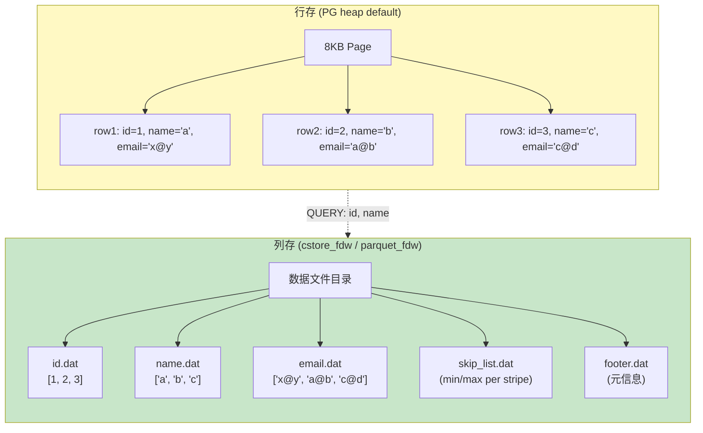
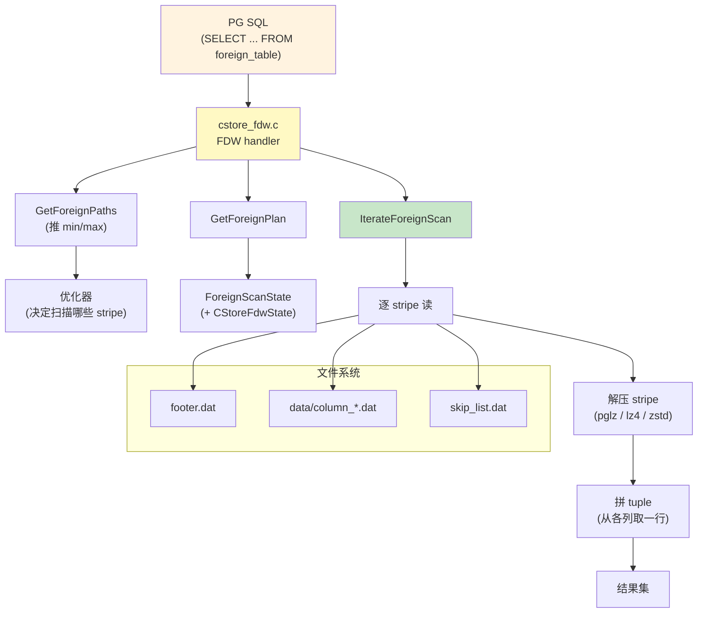
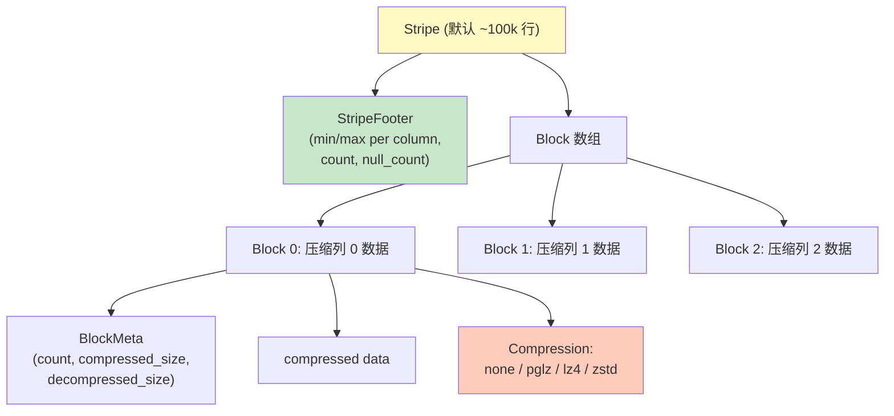
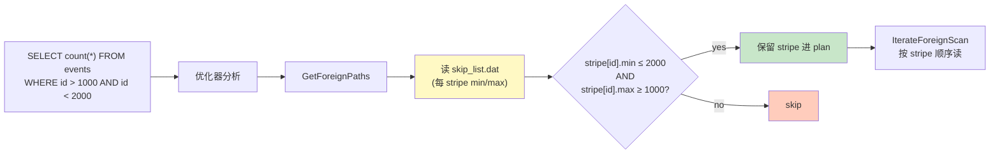
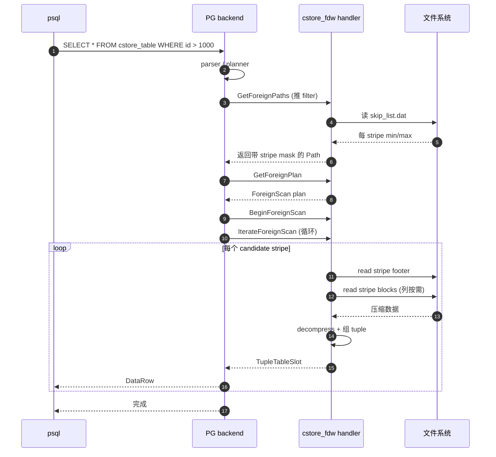
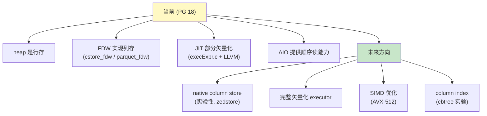

# 14 列存与 cstore_fdw

> 目标：搞清楚 OLTP 的行存与 OLAP 的列存的本质差异，了解 PG 原生为啥是行存、cstore_fdw / parquet_fdw / Hydra 怎么实现列存、PG 17/18 列存方向。**这是面试常被问、也是存储引擎内核最常被重构的方向之一**。

## 14.1 行存 vs 列存：本质区别

### 14.1.1 行存布局（PG heap）

```
Page 1 (8KB)
+------+----+------+----+
| id=1 | v= | id=2 | v= |
| "a"  |    | "b"  |    |
+------+----+------+----+
```

- 写入：一次 INSERT 写一整行
- 读取：访问单列时把整行都读出来
- 压缩：整行压缩（mixed 类型难压）
- 适合：OLTP——点查、事务

### 14.1.2 列存布局

```
table: t (id, name, email)
files:
   id.dat    [1, 2, 3, 4, 5]
   name.dat  ["a", "b", "c", "d", "e"]
   email.dat ["a@x", "b@y", "c@z", "d@w", "e@v"]
```

- 写入：每个列写一段
- 读取：只读需要的列（**column pruning**）
- 压缩：同类型压缩比高（run-length、delta、dictionary）
- 适合：OLAP——扫表聚合

## 14.2 PG 为何原生是行存

PG 的设计目标是 **通用 OLTP**：
- 单条 SQL 经常涉及多列
- 高并发更新
- MVCC per-tuple

列存会破坏：
- MVCC：每个列独立更新 → 列存事务
- 索引：B-Tree 索引值 + ROWID，列存下 ROWID 是什么？

PG 12+ 已有 BRIN（min/max per range）这种“准列存”，但不是真列存。

## 14.3 cstore_fdw（Citus）

### 14.3.1 起源

Citus Data 公司早期为 PG 写的列存 FDW：
- 仓库：https://github.com/citusdata/cstore_fdw
- 状态：2018 年停止开发，被 parquet_fdw / Hydra 等取代
- **教学价值高**：实现简洁，把 FDW 与列存思想讲清楚

### 14.3.2 架构

```
                  FDW handler
                       │
                       ▼
            ┌────────────────────┐
            │   cstore_fdw.c     │
            └─────────┬──────────┘
                      │
        ┌─────────────┴─────────────┐
        ▼                           ▼
   footer.dat                  data/column_*.dat
   (元数据: 类型、min/max)        (每列一个 stripe)
```

**stripe**：每个列文件被切成 ~100k 行一组（默认）

### 14.3.3 数据文件布局

```
<relfilenode>_cstore/
├── footer.dat           # 元信息：列数、每列类型、min/max、stripe count
├── data/
│   ├── column_0.dat      # stripe 0 的列 0
│   ├── column_1.dat      # stripe 0 的列 1
│   └── ...
└── skip_list.dat         # stripe 跳表（min/max 索引）
```

每个 stripe 内是按列存写的：
```
column_N.dat:
┌──────────────────────────┐
│ stripe 0 (compressed)    │ ← 16KB 左右
├──────────────────────────┤
│ stripe 1                  │
├──────────────────────────┤
│ ...                       │
└──────────────────────────┘
```

### 14.3.4 数据块（block）

```c
// cstore_fdw 的内部 block 结构
struct CStoreColumnBlock {
    uint64  count;        // 本块有效行数
    uint32  compressed_size;
    uint32  decompressed_size;
    char    data[];       // 压缩后数据
};
```

压缩选项：
- `none`
- `pglz`（PG 自带）
- `zstd` / `lz4`（编译时开关）

### 14.3.5 FDW 接口实现

```c
// cstore_fdw.c
void cstore_GetForeignPaths(PlannerInfo *root, RelOptInfo *baserel,
                           Oid foreigntableid);
void cstore_GetForeignPlan(PlannerInfo *root, RelOptInfo *baserel,
                           Oid foreigntableid, ForeignPath *best_path,
                           List *tlist, List *scan_clauses,
                           Plan *outer_plan);
void cstore_BeginForeignScan(ForeignScanState *node, int eflags);
TupleTableSlot *cstore_IterateForeignScan(ForeignScanState *node);
```

实现要点：
- `GetForeignPaths` 把 stripe 的 min/max 作为参数推给优化器做 predicate pushdown
- `IterateForeignScan` 按列读 stripe，组装 tuple
- 没实现 push-down 聚合（早期版本）

### 14.3.6 优势与局限

**优势**：
- 简单易读（适合学习）
- 压缩比高
- 仅读场景下性能好

**局限**：
- 只支持 append-only（不能 UPDATE/DELETE）
- 没并发写
- 不能索引（只能 stripe skip）
- 已停止维护

## 14.4 parquet_fdw

### 14.4.1 与 cstore_fdw 的差别

parquet_fdw 直接读 Parquet 格式文件：

```
PG SQL → parquet_fdw → Parquet 文件（本地 or S3 / HDFS）
```

Parquet 格式本身是列存，且支持：
- 多级压缩
- predicate pushdown（min/max）
- row group 分块

### 14.4.2 接口

```sql
postgres=# CREATE EXTENSION parquet_fdw;
postgres=# CREATE SERVER parquet_srv FOREIGN DATA WRAPPER parquet_fdw;
postgres=# CREATE FOREIGN TABLE events (id int, name text, ts timestamp)
             SERVER parquet_srv
             OPTIONS (filename '/data/events.parquet');
```

### 14.4.3 实战

```bash
# 1. 用 python pandas 写 parquet
python3 -c "
import pandas as pd
df = pd.DataFrame({'id': range(10), 'ts': pd.date_range('2026-01-01', periods=10)})
df.to_parquet('/tmp/events.parquet')
"

# 2. PG 查询
psql -c "SELECT * FROM events WHERE id < 5;"
```

## 14.5 pg_duckdb / pg_lakehouse

DuckDB 嵌入式列存引擎 + FDW：

```sql
postgres=# INSTALL duckdb_fdw;
postgres=# CREATE FOREIGN TABLE events USING duckdb_fdw
             (filename '/data/events.parquet');
```

优点：
- DuckDB 自己的矢量化执行非常快
- 直接读 parquet / csv / json
- 适合数仓/分析场景

## 14.6 原生列存方向（PG 17/18）

PG 17 起官方在做 native column store 的预研：

### 14.6.1 zheap / zedstore

- **zedstore**：CMU 学术实验项目，做原生列存引擎
- 架构类似 HyPer / SAP HANA

### 14.6.2 cbtree（PG 16+ 实验）

B-Tree 的列存版索引，配合 heap 列存。

### 14.6.3 PG 18 的 vectorization

`src/backend/jit/llvm/vec_expr.c`：

- 表达式矢量化
- tuple deforming 批处理
- 配合 AIO 让顺序读受益

## 14.7 列存的几个关键工程问题

### 14.7.1 MVCC

列存的 MVCC 难题：
- 行存：t_xmin/xmax 写在 tuple header
- 列存：每列独立 → 怎么记 version？

方案：
1. **delta store**：每个列存对应一个行存 delta，新值写入 delta，定期 merge
2. **version vectors**：每列加 version 字段，类似 tuple header
3. **per-column snapshot**：按列取 snapshot（PG/ClickHouse 风格）

cstore_fdw 用方案 1 的简化版：append-only。

### 14.7.2 压缩算法

| 算法 | 适用 | 压缩比 |
| --- | --- | --- |
| RLE | 重复值多 | 高 |
| Delta | 单调值（id, time） | 中 |
| Dictionary | 基数低 | 高 |
| ZSTD | 通用 | 中 |
| Bit-packing | 整数小范围 | 高 |

cstore_fdw 用 ZSTD + RLE 简易组合。

### 14.7.3 Skip index / Zone map

```c
// stripe header
struct StripeFooter {
    Datum min[NUM_COLS];
    Datum max[NUM_COLS];
    int64  count;
    int64  null_count;
};
```

查询时：`WHERE id > 100 AND id < 200` 时跳过 id.min/max 不满足的 stripe。

### 14.7.4 矢量化执行

```c
// 一次处理一批列数据
for (int i = 0; i < batch_size; i++) {
    // SIMD 加速
    predicate[i] = (col_a[i] > 100) && (col_b[i] == "x");
}
```

PG 18 `src/backend/executor/execExpr.c` 已有部分矢量化。

## 14.8 其他列存方案

| 系统 | 类型 | 列存方式 |
| --- | --- | --- |
| ClickHouse | 独立 DB | native column |
| DuckDB | 嵌入式 | native column + vectorized |
| MonetDB | 独立 DB | native column + vectorized |
| HyPer / SAP HANA | 独立 DB | hybrid column+row |
| Apache Doris | 独立 DB | native column + segment |
| TiFlash (TiDB) | 独立 | native column + raft |
| Citus columnar | 列存 FDW | 列存 + FDW |
| Hydra | 列存 extension | 列存 + WiscKey |
| Zedstore | 原生实验 | column |

## 14.9 实战：cstore_fdw 安装与使用

```bash
# 1. 编译 cstore_fdw（已停止维护，需要 PG 14 之前的版本）
git clone https://github.com/citusdata/cstore_fdw
cd cstore_fdw
make USE_PGXS=1 PG_CONFIG=/path/to/postgresql-config
make USE_PGXS=1 PG_CONFIG=/path/to/postgresql-config install

# 2. psql
psql -c "CREATE EXTENSION cstore_fdw;"

# 3. 创建外部表
psql -c "
CREATE FOREIGN TABLE events_cstore (
    id int,
    name text,
    ts timestamp
)
SERVER cstore_server
OPTIONS (
    filename '/data/events.cstore',
    format 'columnar',
    compression 'pglz'
);"

# 4. COPY 数据
psql -c "\COPY events_cstore FROM '/tmp/events.csv' WITH (FORMAT csv);"

# 5. 查询
psql -c "SELECT count(*), name FROM events_cstore GROUP BY name;"
```

## 14.10 实战：parquet_fdw 实战

```bash
# 1. 安装
git clone https://github.com/adjust/parquet_fdw
cd parquet_fdw
make USE_PGXS=1
make install

# 2. psql
psql -c "CREATE EXTENSION parquet_fdw;"
psql -c "CREATE SERVER parquet_srv FOREIGN DATA WRAPPER parquet_fdw;"

# 3. 准备数据
python3 -c "
import pyarrow as pa, pyarrow.csv as csv, pyarrow.parquet as pq
t = pa.Table.from_pydict({'id': [1,2,3], 'name': ['a','b','c']})
pq.write_table(t, '/tmp/events.parquet')
"

# 4. PG 查询
psql -c "
CREATE FOREIGN TABLE events
    (id int, name text)
SERVER parquet_srv
OPTIONS (filename '/tmp/events.parquet');
SELECT * FROM events;"
```

## 14.11 实战：min/max skip 演示

```sql
-- 用 parquet_fdw 测 predicate pushdown
EXPLAIN VERBOSE SELECT * FROM events WHERE id < 2;
-- 应该看到 foreign scan 上 Filter: (id < 2)
-- 或者更精细的 pushdown 信息

-- cstore_fdw 的 stripe skip
EXPLAIN SELECT count(*) FROM events_cstore WHERE id > 1000000;
```

## 14.12 决策：什么时候用列存

| 场景 | 推荐 | 理由 |
| --- | --- | --- |
| 报表数仓 | parquet_fdw / DuckDB | 离线分析 |
| 数据湖查询 | parquet_fdw / pg_lakehouse | 读 parquet |
| 实时 OLTP | heap | PG 默认就行 |
| 时序数据 | TimescaleDB | 时序优化 |
| IoT 大宽表 | 列存 FDW | 单列聚合多 |
| BI dashboard | 列存 + materialized view | 预聚合 |

## 14.13 列存与 FDW 的关系

PG 的列存方案基本都是 **FDW**，因为：
1. 原生修改内核涉及 catalog、MVCC、索引，工作量太大
2. FDW 是干净的扩展点
3. append-only 场景够用

FDW 的限制：
- 不能 `INSERT VALUES (1, 2, 3)`（除了 COPY）
- 性能比原生差（context switch）
- 索引 / 触发器受限

## 14.14 与专有列存对比

```
                 行存（PG heap）   列存（cstore_fdw / native）
                 ---------------  --------------------------
单行点查          极快              慢（拼装 tuple）
范围扫描          一般              快（按列读）
聚合              一般              快（矢量化）
写入              快                慢（重写 stripe）
压缩              一般              极好
索引              B-Tree/Hash/...    仅 min-max / 跳表
事务              强                弱（无 UPDATE/DELETE）
空间回收          VACUUM            重建 stripe
MVCC              强                弱
```

## 14.15 列存 FDW 实现要点（教学向）

如果你想自己写一个 mini 列存 FDW，按以下步骤：

1. **元数据**：外部表定义在 PG catalog；FDW 维护本地 footer
2. **数据文件**：每列一个文件（或者一个文件按 stripe 切）
3. **写入**：COPY 阶段按 stripe 切分（每 100k 行一个 stripe）
4. **压缩**：ZSTD / lz4
5. **Footer**：每 stripe 的 min/max
6. **Skip**：查询时按 predicate 过滤 stripe
7. **读**：IterateForeignScan 中：
   - 找到候选 stripe
   - 解压需要的列
   - 拼接 tuple
8. **Push-down**：在 GetForeignPaths / GetForeignPlan 中调 ForeignPath 推 filter

### 14.15.1 简化版代码（伪）

```c
static TupleTableSlot *
cstore_IterateForeignScan(ForeignScanState *node)
{
    CStoreFdwState *state = node->fdw_state;
    
    // 1. 拿到 candidate stripe 列表（已 push-down 过滤过）
    
    // 2. 顺序读 stripe
    
    while (state->current_stripe < state->num_stripes) {
        // 3. 读 stripe footer
        StripeFooter footer = read_footer(state->current_stripe);
        
        // 4. 应用谓词（min/max 跳过）
        if (state->filter && !apply_filter(footer, state->filter))
            continue;
        
        // 5. 解压需要的列
        Datum **columns = decompress_columns(footer, state->target_columns);
        
        // 6. 拼 tuple
        for (int i = 0; i < footer.count; i++) {
            HeapTuple tup = build_tuple(columns, i, state->tupdesc);
            ExecStoreTuple(tup, slot, InvalidBuffer, false);
            state->current_row = i;
            return slot;
        }
    }
    
    return ExecClearTuple(slot);
}
```

## 14.16 未来方向

PG 17/18：
- 矢量化的 executor 部分优化
- 列存索引（实验）
- 顺序 AIO + 列存结合

更远（PG 19+）：
- native column store
- vectorized executor 完整化
- SIMD 优化

## 14.17 小结

- PG 原生是行存；列存通过 FDW（cstore_fdw / parquet_fdw / DuckDB FDW）实现
- 列存优势：扫描快、压缩好、聚合快
- 列存劣势：写入慢、无原生 MVCC、索引受限
- 教学价值：cstore_fdw 简单干净，最适合入门
- 生产推荐：parquet_fdw（与数据湖集成）+ DuckDB FDW（嵌入式）
- 原生列存是 PG 长期方向，目前还没到生产可用

## 14.18 整个系列的总结

10+4 = 14 章，从编译调试到崩溃恢复、复制、列存，把 PG 18 源码的存储引擎主线串了起来。

**核心原则回顾**：PG 没有 undo log。所有版本、所有恢复、所有清理都围着这条展开：
- MVCC → tuple header + clog + snapshot
- 恢复 → redo only
- 清理 → vacuum
- 复制 → WAL 是基础
- 列存 → 绕过原生，用 FDW

**L4 验收**：能讲清楚下面 5 个问题的就是资深内核：
1. 一条 UPDATE 在 PG 里经过哪些层？
2. crash 后 redo 为什么不需要 undo？
3. 物理复制与逻辑复制的 trade-offs？
5. cstore_fdw 是怎么“拼接”成 tuple 的？

完成 → 推荐：
- 走读 PG 17 release notes / PG 18 release notes
- 订阅 pgsql-hackers
- 在 commitfest 跟踪感兴趣的 patch
- 自己写一个 FDW / 改一个 AM


## 14.19 图示

### 14.19.1 行存 vs 列存本质对比



### 14.19.2 cstore_fdw 内部架构



### 14.19.3 stripe 内部结构



### 14.19.4 predicate pushdown 与 skip list



### 14.19.5 列存读路径时序



### 14.19.6 列存未来方向 (PG 17/18)



> 图示配套源码（cstore_fdw）：`src/backend/foreign/foreign.c`、`fdwapi.h`、`ext/cstore_fdw/cstore_fdw.c`、`ext/cstore_fdw/cstore_compression.c`、`ext/cstore_fdw/cstore_metadata.c`。
