# applyparallelworker.c 之 LA 端源码深度解析:Leader Apply Worker 的指挥中枢

## 引言:为什么需要单独分析 LA 端

`applyparallelworker.c` 表面上是一个 1646 行的文件,但里面同时承载了 **两套截然不同的角色**:

- **LA(Leader Apply Worker)**:subscription 的主 apply worker,从 publisher 拉取消息,负责分派任务、串行化协调、错误汇聚
- **PA(Parallel Apply Worker)**:LA 派生出来的 worker,实际执行 apply 工作,接收 LA 投递的变更

上一篇《`applyparallelworker.c` 源码深度解析》侧重 PA 端的接收循环与 apply 入口。本篇换一个视角,**完整解析 LA 端** 的代码:

- LA 如何决定是"自己 apply"还是"派给 PA"
- LA 如何管理 worker pool、缓存 hash table
- LA 如何与 PA 通过 DSM、shm_mq、lmgr lock 协作
- LA 在 partial-serialize 模式下如何接管
- LA 的"生命周期"与 worker.c 的耦合点

读完本文,你会对 `applyparallelworker.c` 有一个 **从 LA 视角俯瞰** 的完整图景。

## 1. 文件总体定位与 LA/PA 角色划分

### 1.1 源码规模与位置

| 维度 | 数值 |
|---|---|
| 文件路径 | `src/backend/replication/logical/applyparallelworker.c` |
| 总行数 | 1646 行 |
| LA 端非 static 函数 | 11 个 |
| PA 端非 static 函数 | 8 个 |
| 两端共享 static | 5 个 |
| 宏定义 | 4 个(DSM_KEY、QUEUE_SIZE、LOCK_TYPE、SIZE_STATS_MESSAGE) |
| 全局静态变量 | 6 个 |
| 共享数据结构 | 3 个(`ParallelApplyWorkerShared` / `ParallelApplyWorkerInfo` / `ParallelApplyWorkerEntry`) |
| 状态枚举 | 2 个(`ParallelTransState` / `PartialFileSetState`) |

> **阅读提示**:本文主要聚焦 LA 端,但部分函数(如 `pa_set_xact_state` / `pa_lock_stream`)两端都会调用,会明确指出调用方。

### 1.2 LA vs PA:同一份代码,两个世界

```mermaid
flowchart TB
    subgraph "文件 applyparallelworker.c"
        LA["LA 端代码<br>(~700 行)<br>LA = 任务分派者"]
        PA["PA 端代码<br>(~700 行)<br>PA = 实际执行者"]
        SHARED["共享代码<br>(~200 行)<br>dsm 初始化 / 状态读写"]
    end

    LA -- "am_leader_apply_worker() == true" --> SHARED
    PA -- "am_parallel_apply_worker() == true" --> SHARED

    LA -. "调用: pa_send_data / pa_lock_stream / pa_xact_finish ..." --> PA
    PA -. "设置: shared->xact_state / fileset_state ..." --> LA

    classDef la fill:#fce7f3,stroke:#be185d,color:#000
    classDef pa fill:#dbeafe,stroke:#1d4ed8,color:#000
    classDef sh fill:#fef9c3,stroke:#a16207,color:#000
    class LA la
    class PA pa
    class SHARED sh
```

> 关键洞察:`am_leader_apply_worker()` 和 `am_parallel_apply_worker()` 在 `worker_internal.h:341-354` 中定义为 inline 函数,判断依据是 `MyLogicalRepWorker->type` 是否为 `WORKERTYPE_APPLY` 或 `WORKERTYPE_PARALLEL_APPLY`。

## 2. LA 端的非 static 函数清单

下表按"调用频度 + 重要性"排序,所有行号基于 PostgreSQL 18 master 分支。

| 行号 | 函数名 | 调用方 | 作用 |
|---|---|---|---|
| 470 | `pa_allocate_worker(xid)` | worker.c:1516 | **入口**:为某个 xid 分配 PA(优先从 pool 取) |
| 1153 | `pa_send_data(winfo, nbytes, data)` | worker.c 6 处 | **核心**:通过 shm_mq 把变更投递给 PA |
| 1250 | `pa_switch_to_partial_serialize(winfo, locked)` | worker.c 6 处 | **降级**:shm_mq 超时后切到 partial 模式 |
| 1280 | `pa_wait_for_xact_finish(winfo)` | `pa_xact_finish` | 等待 PA 把 xact_state 推到 FINISHED |
| 1325 | `pa_get_xact_state(wshared)` | LA + PA | 读 `shared->xact_state`(加 spinlock) |
| 1340 | `pa_set_stream_apply_worker(winfo)` | worker.c:1560, 1585, 1674 | 缓存"当前 stream 的 PA" |
| 1368 | `pa_start_subtrans(current, top)` | worker.c:629 | 在 PA 端定义 SAVEPOINT(subxact) |
| 1408 | `pa_reset_subtrans(void)` | worker.c:1392, 2236 | 清空 subxact 列表 |
| 1422 | `pa_stream_abort(abort_data)` | worker.c:1958 | PA 端处理 STREAM ABORT(rollback) |
| 1546/1553 | `pa_lock_stream` / `pa_unlock_stream` | 两端各多处 | session 级 STREAM 锁 |
| 1579/1586 | `pa_lock_transaction` / `pa_unlock_transaction` | 两端各多处 | session 级 XACT 锁(双向死锁检测) |
| 1597 | `pa_decr_and_wait_stream_block` | PA 端专用 | PA 在每条变更后减计数,无 chunk 时抢 STREAM 锁 |
| 1624 | `pa_xact_finish(winfo, lsn)` | worker.c:1341, 1362, 1919, 1945, 2193, 2213 | **收尾**:commit 时 LA 等待 PA 完成 |
| 1069 | `ProcessParallelApplyMessages` | 信号处理 | 处理 PA 推送过来的 ErrorResponse |
| 995 | `HandleParallelApplyMessageInterrupt` | 信号处理 | LA 收到 PROCSIG_PARALLEL_APPLY_MESSAGE 后的 latch 设置 |
| 1504 | `pa_set_fileset_state(wshared, state)` | worker.c:1359, 1944, 2210 | 写 `shared->fileset_state` |
| 621 | `pa_detach_all_error_mq` | worker.c | LA 退出时 detach 所有 error_mq |

> 行 1368-1408 标注 LA 但实际由 PA 端调用,统一列在 LA 端表格中以便对比。

## 3. LA 端的状态机:`TransApplyAction` 五态转换

虽然 `TransApplyAction` 在 `worker.c:262-268` 定义,但它是 **LA 端调度的核心抽象**。`get_transaction_apply_action` (`worker.c:5199-5234`) 决定 LA 收到一条 stream 变更时的动作。

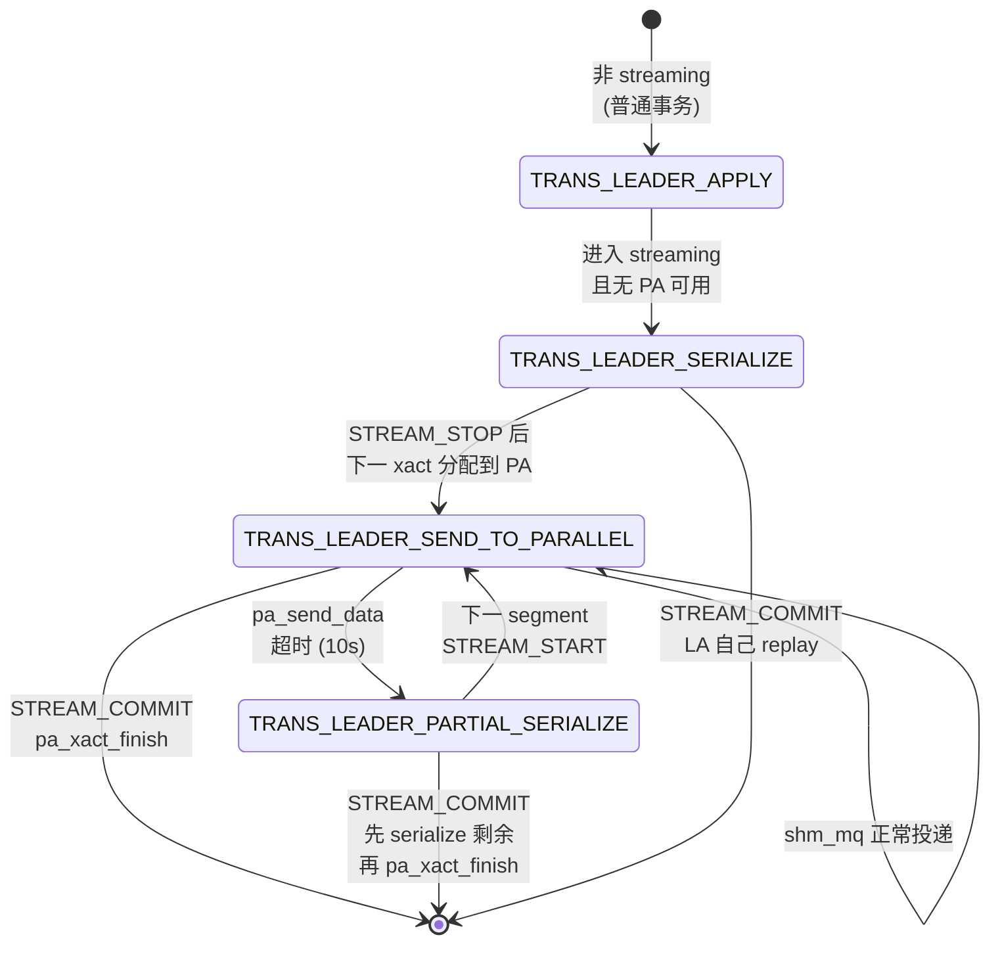

### 3.1 关键代码:`get_transaction_apply_action`(`worker.c:5199`)

```c
static TransApplyAction
get_transaction_apply_action(TransactionId xid, ParallelApplyWorkerInfo **winfo)
{
    *winfo = NULL;

    if (am_parallel_apply_worker())        // PA 端:自己处理
        return TRANS_PARALLEL_APPLY;

    *winfo = pa_find_worker(xid);          // LA 端:查 xid -> PA 的 hash

    if (*winfo && (*winfo)->serialize_changes)
        return TRANS_LEADER_PARTIAL_SERIALIZE;
    else if (*winfo)
        return TRANS_LEADER_SEND_TO_PARALLEL;
    else if (in_streamed_transaction)
        return TRANS_LEADER_SERIALIZE;
    else
        return TRANS_LEADER_APPLY;
}
```

**LA 决策表**:

| 条件 | 返回值 | 实际行为 |
|---|---|---|
| 不在 streaming | `TRANS_LEADER_APPLY` | LA 直接执行 |
| 在 streaming + 无 PA | `TRANS_LEADER_SERIALIZE` | LA 写文件 |
| 在 streaming + 有 PA + 未降级 | `TRANS_LEADER_SEND_TO_PARALLEL` | LA 通过 shm_mq 投递 |
| 在 streaming + 有 PA + 已降级 | `TRANS_LEADER_PARTIAL_SERIALIZE` | LA 写文件 + STREAM_STOP 时再投递 |

## 4. LA 端核心数据结构全景

虽然结构体定义在 `worker_internal.h`,但**只有 LA 端会创建/写入/管理这些结构**。

### 4.1 `LogicalRepWorker` 中的 LA 字段(`worker_internal.h:37-97`)

```c
typedef struct LogicalRepWorker {
    ...
    Oid         subid;              // subscription oid
    FileSet    *stream_fileset;     // LA 端:partial-serialize 的临时文件集
    pid_t       leader_pid;         // PA 端:指向 LA,LA 端为 InvalidPid
    bool        parallel_apply;     // LA 端:本 sub 是否开启 parallel mode
    ...
} LogicalRepWorker;
```

### 4.2 `ParallelApplyWorkerShared` (`worker_internal.h:138-186`)

> 这是 **LA 与 PA 共享的 DSM 段核心结构**。LA 写入、PA 读取的字段通过 `slock_t mutex` 保护,`pending_stream_count` 用 `pg_atomic_uint32`。

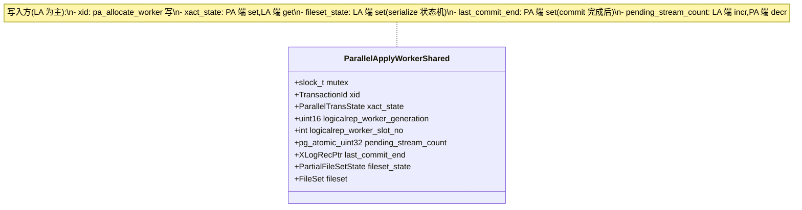

### 4.3 `ParallelApplyWorkerInfo` (`worker_internal.h:188-209`)

> **纯 LA 端结构**,不放入 DSM。每个 PA 一个实例,存放在 `ParallelApplyWorkerPool` 链表里。

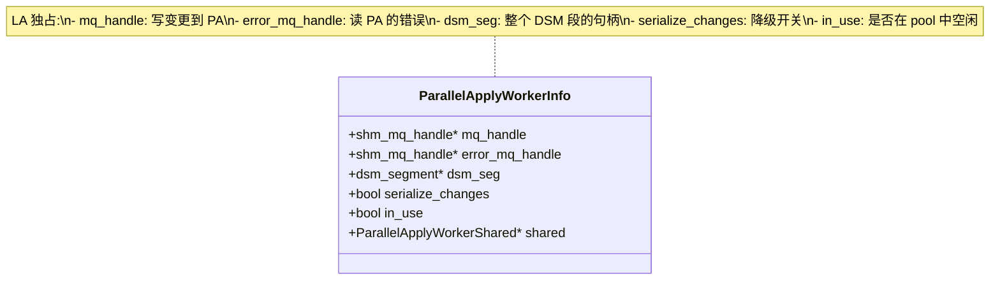

### 4.4 `ParallelApplyTxnHash` 与 `ParallelApplyWorkerPool`(`applyparallelworker.c:225-234`)

```c
static HTAB *ParallelApplyTxnHash = NULL;   // xid -> ParallelApplyWorkerInfo
static List *ParallelApplyWorkerPool = NIL; // 所有 PA 的链表(含 in_use=false)
```

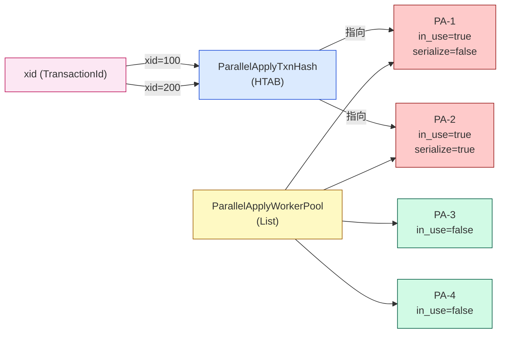

**两套索引的设计意图**:
- `ParallelApplyTxnHash`:**O(1) 查 xid 对应的 PA**(每次 `get_transaction_apply_action` 都要查)
- `ParallelApplyWorkerPool`:**O(n) 遍历找空闲 PA**(`pa_launch_parallel_worker` 时遍历,设上限为 `max_parallel_apply_workers_per_subscription / 2`)

## 5. LA 端启动 PA 的完整流程:`pa_allocate_worker` 深度解析

这是 LA **唯一**对外暴露的"启动 PA"入口。`worker.c:1516` 在 STREAM_START 收到时调用。

### 5.1 函数全景

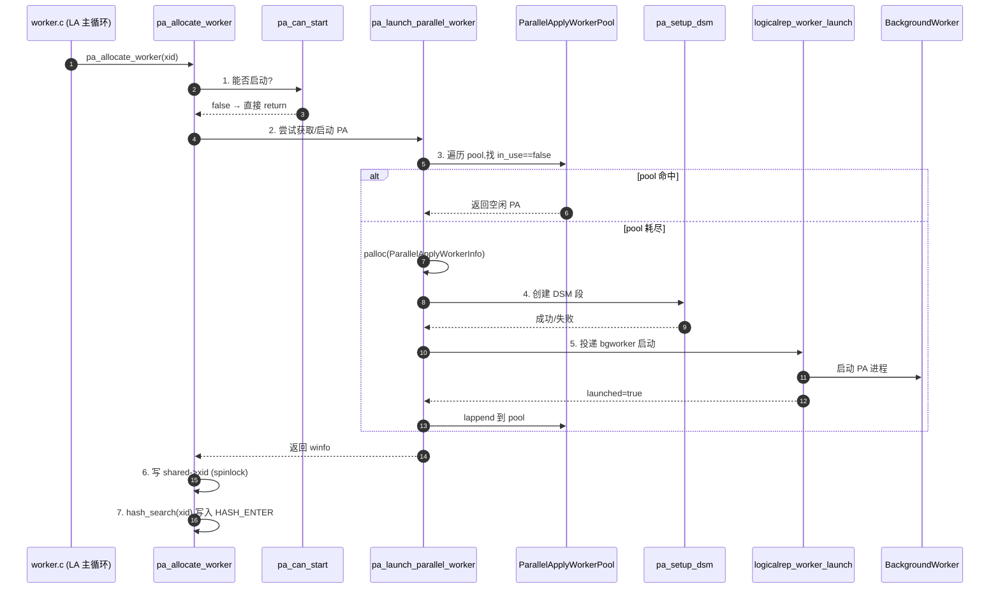

### 5.2 `pa_can_start` 的所有拦截条件(`applyparallelworker.c:264-325`)

```c
static bool pa_can_start(void)
{
    if (!am_leader_apply_worker())              // (1) 必须是 LA
        return false;

    maybe_reread_subscription();                // (2) 长期任务需刷新 sub 参数

    if (!MyLogicalRepWorker->parallel_apply)    // (3) sub 必须开启 parallel
        return false;

    if (!XLogRecPtrIsInvalid(MySubscription->skiplsn))  // (4) skip 模式下要落盘才能判断
        return false;

    if (!AllTablesyncsReady())                  // (5) tablesync 没就绪不能并行
        return false;

    return true;
}
```

**5 个拦截条件的设计意图**:

| # | 条件 | 原因 |
|---|---|---|
| 1 | `am_leader_apply_worker` | PA 不能启动 PA,防止递归 |
| 2 | `maybe_reread_subscription` | 长时间运行的 LA 不会感知 sub 参数变更,这里强刷 |
| 3 | `parallel_apply == false` | sub 未开启 streaming=parallel |
| 4 | `skiplsn` 有效 | skip 决策需要先看完整 xact 的最后 LSN,只能先 serialize |
| 5 | `AllTablesyncsReady` | 否则 `should_apply_changes_for_rel` 拿不到 `remote_final_lsn` |

### 5.3 `pa_setup_dsm` 的 DSM 段布局(`applyparallelworker.c:327-401`)

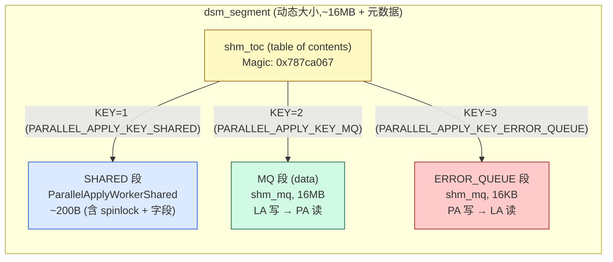

**两个 shm_mq 的设计差异**:

| 维度 | MQ(数据) | ERROR_QUEUE(错误) |
|---|---|---|
| 方向 | LA → PA | PA → LA |
| 大小 | 16 MB | 16 KB |
| 写端 | `shm_mq_set_sender(LA)` | `shm_mq_set_sender(PA)` |
| 读端 | `shm_mq_set_receiver(PA)` | `shm_mq_set_receiver(LA)` |
| 阻塞语义 | 写满后 LA 走 10s 超时降级 | 阻塞后 PA 必 panic(exit 前必须投递完) |

**注释里的设计原因(`applyparallelworker.c:114-118`)**:

> Error queue size 是 16KB,期望"typical ErrorResponse 一次性写完就退出",这样 PA 异常时不必等用户后端。

### 5.4 `pa_launch_parallel_worker` 的两层 fallback(`applyparallelworker.c:403-468`)

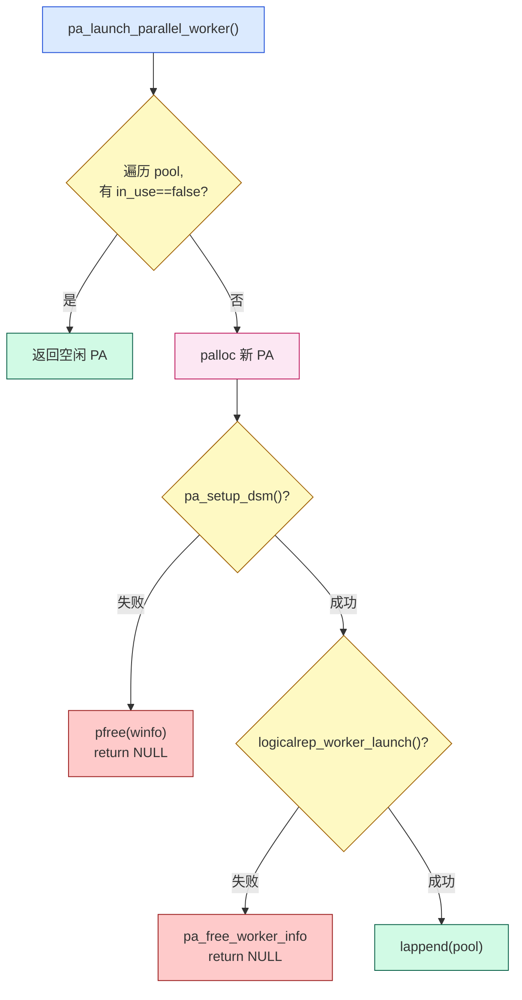

### 5.5 `pa_allocate_worker` 末尾的"写 shared->xid"

`applyparallelworker.c:512-514`:

```c
SpinLockAcquire(&winfo->shared->mutex);
winfo->shared->xact_state = PARALLEL_TRANS_UNKNOWN;
winfo->shared->xid = xid;
SpinLockRelease(&winfo->shared->mutex);
```

**为什么必须用 spinlock 写两个字段?** 因为 PA 端在 `ParallelApplyWorkerMain` 后会立即读 `MyParallelShared->xid` 决定处理哪个 xact,如果不加锁可能读到"xid 已变但 xact_state 未重置"的不一致状态。

## 6. LA 端的核心投递通道:`pa_send_data`

这是 LA **用得最频繁**的函数,在 `worker.c` 中出现 6 次,所有 `TRANS_LEADER_SEND_TO_PARALLEL` 路径都走这里。

### 6.1 函数签名与断言

```c
bool pa_send_data(ParallelApplyWorkerInfo *winfo, Size nbytes, const void *data);
```

```c
Assert(!IsTransactionState());                // LA 端投递时不能有本地事务
Assert(!winfo->serialize_changes);            // 已经降级的不再投递
if (unlikely(debug_logical_replication_streaming == DEBUG_LOGICAL_REP_STREAMING_IMMEDIATE))
    return false;                              // 测试模式:直接走 serialize
```

### 6.2 带超时的非阻塞发送(`applyparallelworker.c:1153-1217`)

```c
#define SHM_SEND_RETRY_INTERVAL_MS 1000
#define SHM_SEND_TIMEOUT_MS        (10000 - SHM_SEND_RETRY_INTERVAL_MS)

for (;;) {
    result = shm_mq_send(winfo->mq_handle, nbytes, data, true, true);
    if (result == SHM_MQ_SUCCESS)
        return true;
    else if (result == SHM_MQ_DETACHED)
        ereport(ERROR, ...);                  // PA 已退出,报错

    Assert(result == SHM_MQ_WOULD_BLOCK);

    rc = WaitLatch(MyLatch, WL_LATCH_SET | WL_TIMEOUT | WL_EXIT_ON_PM_DEATH,
                   SHM_SEND_RETRY_INTERVAL_MS, WAIT_EVENT_LOGICAL_APPLY_SEND_DATA);
    if (rc & WL_LATCH_SET) {
        ResetLatch(MyLatch);
        CHECK_FOR_INTERRUPTS();                // 收到中断立即处理
    }

    if (startTime == 0)
        startTime = GetCurrentTimestamp();
    else if (TimestampDifferenceExceeds(startTime, GetCurrentTimestamp(), SHM_SEND_TIMEOUT_MS))
        return false;                          // 9秒后仍未发送成功
}
```

**为什么是 9s 而不是整数?**

```c
#define SHM_SEND_TIMEOUT_MS (10000 - SHM_SEND_RETRY_INTERVAL_MS)
```

- 总预算 10s
- 减去 1s 的重试间隔,留 9s 的"实际超时"
- 这样保证最后一次 `WaitLatch` 之后立刻超时,**不会再多等 1 秒**

### 6.3 返回 false 之后:调用方必须切换模式

`worker.c:607-615`:

```c
if (pa_send_data(winfo, s->len, s->data))
    return (action != LOGICAL_REP_MSG_RELATION && action != LOGICAL_REP_MSG_TYPE);
pa_switch_to_partial_serialize(winfo, false);  // 投递失败 → 降级
/* fall through */
```

**为什么 fall through?** 因为降级后 LA 必须把当前这条变更也写入文件(用 `original_msg`,没动 cursor 的版本)。

### 6.4 立即模式的特殊处理

```c
if (unlikely(debug_logical_replication_streaming == DEBUG_LOGICAL_REP_STREAMING_IMMEDIATE))
    return false;
```

这是测试用的 GUC:把 `pa_send_data` 永远返回 false,模拟"shm_mq 永远满"的场景,用于测试 partial-serialize 流程。

## 7. LA 端降级机制:`pa_switch_to_partial_serialize`

### 7.1 触发场景

```mermaid
flowchart LR
    A["STREAM_START<br>(pa_allocate_worker)"]:::start
    B["pa_send_data 成功"]:::ok
    C["pa_send_data 超时<br>(9s)"]:::warn
    D["pa_switch_to_partial_serialize<br>(stream_locked=false)"]:::switch
    E["落盘剩余变更<br>stream_write_change"]:::ok
    F["STREAM_STOP<br>(pa_xact_finish)"]:::stop
    G["pa_set_fileset_state(FS_SERIALIZE_DONE)"]:::ok

    A --> B
    B --> C
    C --> D
    D --> E
    E --> B
    E --> F
    F --> G

    classDef start fill:#dbeafe,stroke:#1d4ed8
    classDef ok fill:#d1fae5,stroke:#065f46
    classDef warn fill:#fecaca,stroke:#991b1b
    classDef switch fill:#fce7f3,stroke:#be185d
    classDef stop fill:#fef9c3,stroke:#a16207
```

### 7.2 降级函数实现(`applyparallelworker.c:1217-1249`)

```c
void pa_switch_to_partial_serialize(ParallelApplyWorkerInfo *winfo, bool stream_locked)
{
    ereport(LOG, (errmsg("logical replication apply worker will serialize the "
                         "remaining changes of remote transaction %u to a file",
                         winfo->shared->xid)));

    winfo->serialize_changes = true;              // (1) 标记降级

    stream_start_internal(winfo->shared->xid, true);  // (2) 初始化 stream_fileset

    if (!stream_locked)
        pa_lock_stream(winfo->shared->xid, AccessExclusiveLock);  // (3) 抢 STREAM 锁

    pa_set_fileset_state(winfo->shared, FS_SERIALIZE_IN_PROGRESS);  // (4) 通知 PA
}
```

**5 个动作的因果链**:

1. `serialize_changes = true`:`pa_free_worker` 看到这个标志会**强制停掉 PA**(避免残留部分写入消息)
2. `stream_start_internal(xid, first_segment=true)`:初始化 LA 端的 `LogicalRepWorker->stream_fileset`,为落盘做准备
3. `pa_lock_stream(..., AccessExclusiveLock)`:LA 抢独占锁,后续 STREAM_STOP 时才释放;**PA 抢共享锁会被阻塞**,等 LA 全部落盘完才继续
4. `FS_SERIALIZE_IN_PROGRESS`:PA 在 `pa_process_spooled_messages_if_required` 中看到这个状态会主动 `pa_lock_stream` + `pa_unlock_stream`(空抢一次,确保 LA 还没释放 STREAM 锁)
5. `ereport(LOG)`:把降级事件记入日志,运维可监控

### 7.3 `stream_locked` 参数的微妙之处

观察 `pa_switch_to_partial_serialize` 在 6 个调用点的传入值:

| 调用点 | `stream_locked` | 含义 |
|---|---|---|
| `worker.c:615` (STREAM_CHANGED 路径) | `false` | 第一次降级,需要抢锁 |
| `worker.c:1349` (STREAM_PREPARE 路径) | `true` | 之前 STREAM_STOP 中已抢过,无需再抢 |
| `worker.c:1568` (STREAM_START 第二段起) | `!first_segment` | 第一段不抢(进入新 segment),后续要抢 |
| `worker.c:1682` (STREAM_START 边界) | `true` | 上一个 segment 末已抢 |
| `worker.c:1928` (STREAM_COMMIT 路径) | `true` | STREAM_STOP 中已抢 |
| `worker.c:2201` (STREAM_COMMIT 路径) | `true` | STREAM_STOP 中已抢 |

**设计意图**:STREAM_STOP 期间 LA 一定会抢 STREAM 锁(用于死锁检测),所以 commit/prepare 阶段的降级可以省略一次锁操作。

## 8. LA 端的 lmgr 锁机制:双向死锁检测

### 8.1 两种 session lock

`applyparallelworker.c:147-152`:

```c
#define PARALLEL_APPLY_LOCK_STREAM  0
#define PARALLEL_APPLY_LOCK_XACT    1
```

| 锁类型 | 持有方 | 时机 | 模式 | 作用 |
|---|---|---|---|---|
| **STREAM** | LA 独占,PA 共享 | LA 投递变更期间 / PA 等变更 | X / S | 让 PA 在等变更时进入 lmgr,LA 可以检测到 |
| **XACT** | LA 独占,PA 独占 | commit 等待 / 第一个 chunk 接收 | X / X | 双向依赖检测:PA 等 LA 完成,LA 等 PA 完成 |

### 8.2 死锁场景与锁的关系

`applyparallelworker.c:73-90` 的注释给出了 **3 个死锁场景**:

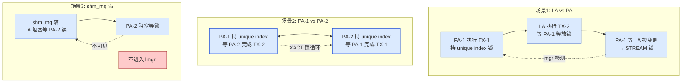

**LA 如何用 XACT 锁检测 PA-PA 死锁?**

`pa_wait_for_xact_finish`(`applyparallelworker.c:1280-1312`):

```c
pa_wait_for_xact_state(winfo, PARALLEL_TRANS_STARTED);  // 等 PA 进入"已获取 XACT 锁"状态

pa_lock_transaction(winfo->shared->xid, AccessShareLock);  // 共享锁
pa_unlock_transaction(winfo->shared->xid, AccessShareLock);  // 立刻释放

if (pa_get_xact_state(winfo->shared) != PARALLEL_TRANS_FINISHED)
    ereport(ERROR, ...);                                   // PA 死了
}
```

**这里关键的两步**:

1. **`pa_wait_for_xact_state(PARALLEL_TRANS_STARTED)`**:必须等 PA 把 `xact_state` 推到 `STARTED`,否则 LA 抢 XACT 锁可能比 PA 早,PA 就检测不到 LA 的等待
2. **空抢一次 XACT 锁**:LA 把自己加入 lmgr 等待图;如果 PA-PA 死锁已经形成,这里 lmgr 会抛 `ERROR: deadlock detected`

**为什么不能直接用 `XactLockTableWait()`?** 注释 `applyparallelworker.c:91-96` 明确说:prepared transaction 在 `XactLockTableWait` 看来仍"in progress",即使 PA 已经 prepare 也不会释放锁。session-level lock 没有这个问题。

### 8.3 场景 3 的解决方案:`pa_send_data` 9s 超时

shm_mq 满 → LA 在 shm_mq_send 阻塞 → 这个阻塞**不进入 lmgr** → 死锁无法检测。

`pa_send_data` 用 **9 秒超时 + 降级** 解决:

- 9 秒后 LA 切换到 `TRANS_LEADER_PARTIAL_SERIALIZE`
- 把剩余变更落盘 + 抢 STREAM 锁(独占)
- PA 抢共享 STREAM 锁时进入 lmgr 等待图
- LA 在 `pa_xact_finish` 中再等 XACT 锁,**进入死锁检测可见范围**

## 9. LA 端的 cache 优化:`stream_apply_worker` 静态变量

### 9.1 为什么需要 cache?

考虑一个 streaming transaction 的处理:
- 1 个 STREAM_START
- 几十~几千个 STREAM_CHANGED
- 1 个 STREAM_STOP / COMMIT

每次 `get_transaction_apply_action` 都会 `pa_find_worker(xid)`,而 `pa_find_worker` 是 **hash 查表**,虽然 O(1) 但仍有自旋锁/缓存 miss 开销。

### 9.2 cache 机制(`applyparallelworker.c:251-253`)

```c
static ParallelApplyWorkerInfo *stream_apply_worker = NULL;  // 当前 stream 的 PA 缓存
```

`pa_find_worker`(`applyparallelworker.c:518-555`):

```c
if (stream_apply_worker)                 // (1) 命中 cache 直接返回
    return stream_apply_worker;

entry = hash_search(ParallelApplyTxnHash, &xid, HASH_FIND, &found);  // (2) 未命中走 hash
if (found) {
    Assert(entry->winfo->in_use);
    return entry->winfo;
}
return NULL;
```

`pa_set_stream_apply_worker`(`applyparallelworker.c:1340-1352`):

```c
void pa_set_stream_apply_worker(ParallelApplyWorkerInfo *winfo)
{
    stream_apply_worker = winfo;          // 每次 STREAM_START 调一次
}
```

`worker.c` 中调用点:

| 行号 | 调用时机 |
|---|---|
| 1560 | STREAM_START 第一次分配 PA 时 |
| 1585 | STREAM_START 第二/三...次(serialize 切换后) |
| 1674 | `pa_set_stream_apply_worker(NULL)` STREAM_STOP 时清空 |

### 9.3 cache 与 pool 的关系

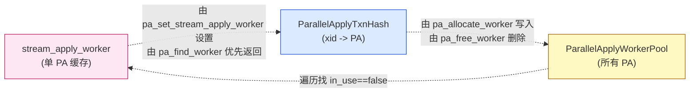

> **洞察**:Hash 是 "xid 视角",Pool 是 "worker 视角",Cache 是 "当前 stream 视角"。三层索引的写入时机不同,共同支撑 LA 端的高频查表。

## 10. LA 端的退出与 worker pool 收缩

### 10.1 `pa_free_worker` 的两条路径

`applyparallelworker.c:555-594`:

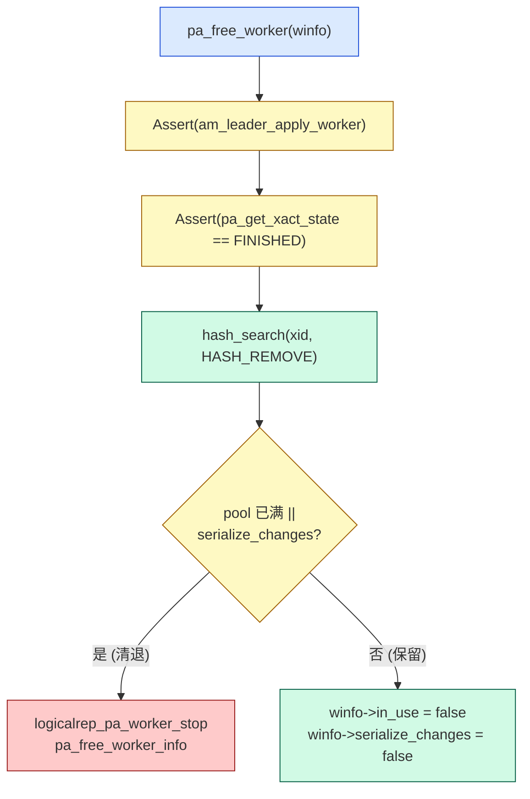

**清退 vs 保留 的判定**:

```c
if (winfo->serialize_changes ||
    list_length(ParallelApplyWorkerPool) > (max_parallel_apply_workers_per_subscription / 2))
{
    logicalrep_pa_worker_stop(winfo);
    pa_free_worker_info(winfo);
    return;
}
winfo->in_use = false;
winfo->serialize_changes = false;
```

| 条件 | 结果 | 原因 |
|---|---|---|
| `pool 长度 > max_parallel_apply_workers_per_subscription / 2` | 清退 | 防止 pool 无限增长 |
| `serialize_changes == true` | 清退 | shm_mq 中可能有部分写入,只能停掉重起 |
| 其他 | 保留 | 标 `in_use=false` 等下一个 xact 复用 |

### 10.2 `pa_free_worker_info` 的清理顺序(`applyparallelworker.c:594-620`)

```c
static void pa_free_worker_info(ParallelApplyWorkerInfo *winfo)
{
    if (winfo->mq_handle)
        shm_mq_detach(winfo->mq_handle);                 // (1) detach 数据 MQ

    if (winfo->error_mq_handle)
        shm_mq_detach(winfo->error_mq_handle);           // (2) detach 错误 MQ

    if (winfo->serialize_changes)
        stream_cleanup_files(MyLogicalRepWorker->subid, winfo->shared->xid);  // (3) 删落盘文件

    if (winfo->dsm_seg)
        dsm_detach(winfo->dsm_seg);                      // (4) detach DSM 段

    ParallelApplyWorkerPool = list_delete_ptr(ParallelApplyWorkerPool, winfo);  // (5) 从 pool 删除

    pfree(winfo);                                         // (6) 释放结构体
}
```

**清理顺序的依赖**:
- MQ / error MQ / DSM 段 detach 后才删文件,因为文件可能还在 DSM 中引用
- 必须先从 pool 删再 pfree,否则 list 中悬空指针

### 10.3 `pa_detach_all_error_mq` 的特殊用途

`applyparallelworker.c:621-639` 的注释:

> The leader will detach from the error queue and set it to NULL before preparing to stop all parallel apply workers, so we don't need to handle error messages anymore.

`worker.c` 在 LA 准备退出前会调这个,把 `winfo->error_mq_handle` 置 NULL,这样后续的 `ProcessParallelApplyMessages` 遍历到该 PA 时直接 `continue`,不会再去读已 detach 的队列(避免再次触发 detach 报错)。

## 11. LA 端的消息处理:`ProcessParallelApplyMessages`

### 11.1 调用栈

```mermaid
flowchart LR
    Sig["PA 进程通过 PROCSIG_PARALLEL_APPLY_MESSAGE 通知 LA"]:::sig
    SigH["HandleParallelApplyMessageInterrupt<br>(信号处理函数)<br>SetLatch(MyLatch)<br>ParallelApplyMessagePending=true"]:::signh
    Check["CHECK_FOR_INTERRUPTS<br>(在 LA 主循环)"]:::check
    Proc["ProcessParallelApplyMessages<br>遍历所有 PA 的 error_mq_handle"]:::proc
    Msg["ProcessParallelApplyMessage<br>解析单条消息"]:::msg
    Ereport["ereport(ERROR)<br>重抛 PA 的错误"]:::err

    Sig -->|"kill"| SigH
    SigH --> Check
    Check --> Proc
    Proc --> Msg
    Msg --> Ereport

    classDef sig fill:#fecaca,stroke:#991b1b
    classDef signh fill:#fce7f3,stroke:#be185d
    classDef check fill:#dbeafe,stroke:#1d4ed8
    classDef proc fill:#fef9c3,stroke:#a16207
    classDef msg fill:#d1fae5,stroke:#065f46
    classDef err fill:#fca5a5,stroke:#7f1d1d
```

### 11.2 信号机制(从 PA 到 LA)

`pa_shutdown`(`applyparallelworker.c:843-855`):

```c
static void pa_shutdown(int code, Datum arg)
{
    SendProcSignal(MyLogicalRepWorker->leader_pid,
                   PROCSIG_PARALLEL_APPLY_MESSAGE,
                   INVALID_PROC_NUMBER);
    dsm_detach((dsm_segment *) DatumGetPointer(arg));
}
```

`before_shmem_exit(pa_shutdown, ...)` 在 PA 退出时自动调用,目的是告诉 LA"我有消息要投递"。

### 11.3 信号处理(LA 端)

`HandleParallelApplyMessageInterrupt`(`applyparallelworker.c:995-1006`):

```c
void HandleParallelApplyMessageInterrupt(void)
{
    InterruptPending = true;
    ParallelApplyMessagePending = true;
    SetLatch(MyLatch);
}
```

> 注意:信号处理函数中**只设置 flag**,不读取队列。实际读取在 `ProcessParallelApplyMessages` 中。

### 11.4 消息解析(`applyparallelworker.c:1008-1067`)

```c
static void ProcessParallelApplyMessage(StringInfo msg)
{
    char msgtype = pq_getmsgbyte(msg);
    switch (msgtype) {
        case 'E': {  // ErrorResponse
            ErrorData edata;
            pq_parse_errornotice(msg, &edata);
            if (edata.context)
                edata.context = psprintf("%s\n%s", edata.context,
                                          _("logical replication parallel apply worker"));
            else
                edata.context = pstrdup(_("logical replication parallel apply worker"));
            error_context_stack = apply_error_context_stack;
            ereport(ERROR, (errcode(ERRCODE_OBJECT_NOT_IN_PREREQUISITE_STATE),
                            errmsg("logical replication parallel apply worker exited due to error"),
                            errcontext("%s", edata.context)));
        }
        case 'N':   // NoticeResponse
        case 'A':   // NotifyResponse
            break;
        default:
            elog(ERROR, "unrecognized message type ...");
    }
}
```

> **注意 `'A'`**:这个值是 `libpq` 的 `AsyncMessage` 类型,跟 NotificationResponse 同名。代码注释里没解释为什么 PA 也会发,但因为 LA 不需要,直接 `break` 即可。

### 11.5 私有内存上下文(`applyparallelworker.c:1080-1090`)

```c
static MemoryContext hpam_context = NULL;

if (!hpam_context)
    hpam_context = AllocSetContextCreate(TopMemoryContext,
                                         "ProcessParallelApplyMessages",
                                         ALLOCSET_DEFAULT_SIZES);
else
    MemoryContextReset(hpam_context);
```

**为什么需要专用 context?**

`ProcessParallelApplyMessages` 是从 `ProcessInterrupts()` 调用的,`CurrentMemoryContext` 可能是任何上下文。`pq_parse_errornotice` 中分配 `edata.context` 等会污染上层。用专用 context + `MemoryContextReset` 保证每次调用都干净。

### 11.6 防御性 `HOLD_INTERRUPTS`(`applyparallelworker.c:1075-1078`)

```c
HOLD_INTERRUPTS();
...
RESUME_INTERRUPTS();
```

> 防止 ProcessInterrupts 递归进入。

## 12. LA 端的 sub-transaction 处理

### 12.1 为什么需要 subxact?

streaming transaction 可能包含多个 sub-transaction(SAVEPOINT 包裹)。PA 端在 apply 时也会按 subxact 处理,但**需要在 LA 端先识别 subxact 边界**,以便:

- subxact 启动时定义 SAVEPOINT
- subxact abort 时回滚到 SAVEPOINT

### 12.2 `pa_start_subtrans`(`applyparallelworker.c:1368-1407`)

```c
void pa_start_subtrans(TransactionId current_xid, TransactionId top_xid)
{
    if (current_xid != top_xid && !list_member_xid(subxactlist, current_xid)) {
        ...
        pa_savepoint_name(MySubscription->oid, current_xid, spname, sizeof(spname));
        if (!IsTransactionBlock()) {
            if (!IsTransactionState())
                StartTransactionCommand();
            BeginTransactionBlock();
            CommitTransactionCommand();
        }
        DefineSavepoint(spname);
        CommitTransactionCommand();
        ...
        subxactlist = lappend_xid(subxactlist, current_xid);
    }
}
```

> 注意:这个函数 **从 worker.c:629 调用**,而 worker.c 那一行代码是 PA 端(`TRANS_PARALLEL_APPLY` 分支),不是 LA 端。所以 **PA 端"自己定义 SAVEPOINT"**,LA 端只负责在 abort 时回滚。

### 12.3 `pa_stream_abort` 的两层逻辑(`applyparallelworker.c:1422-1502`)

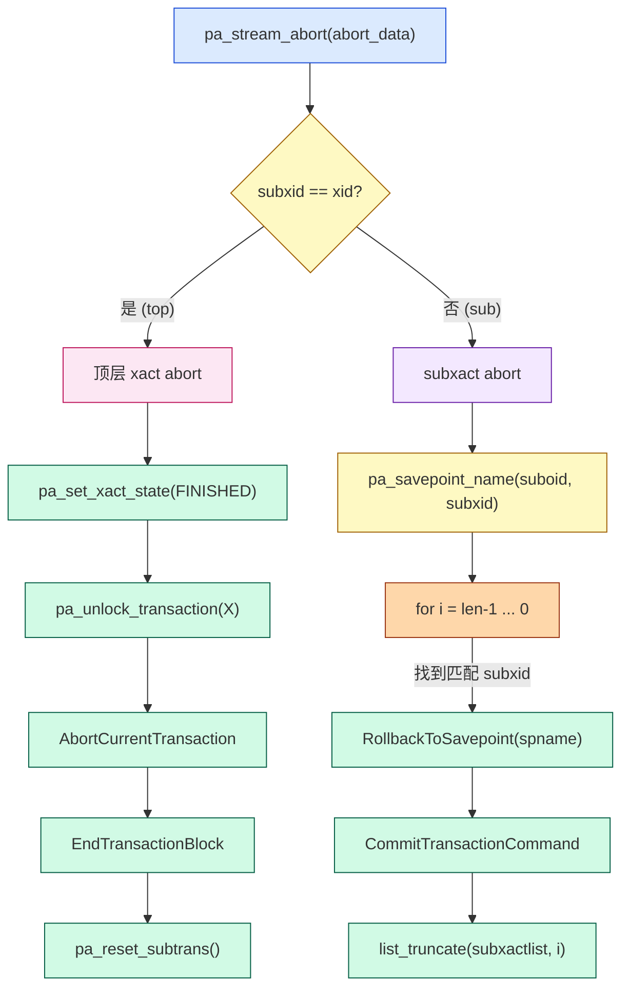

**关键:为什么 abort 顶层 xact 时先 unlock XACT 锁?**

注释 `applyparallelworker.c:1444-1452` 明确说:

> Release the lock as we might be processing an empty streaming transaction in which case the lock won't be released during transaction rollback. Note that it's ok to release the transaction lock before aborting the transaction because even if the parallel apply worker dies due to crash or some other reason, such a transaction would still be considered aborted.

**含义**:空 streaming xact(只有 STREAM_START/STREAM_COMMIT)没有"实际锁释放"过程,要靠 LA 显式 unlock。提前 unlock 在 abort 场景下是安全的(其他 worker 看到的还是 aborting)。

## 13. LA 与 PA 端共享的"5 状态机"

`ParallelTransState`(`worker_internal.h:103-108`):

```c
typedef enum ParallelTransState {
    PARALLEL_TRANS_UNKNOWN,    // 初始
    PARALLEL_TRANS_STARTED,    // PA 已获取 XACT 锁
    PARALLEL_TRANS_FINISHED,   // PA 已完成(commit/prepare/abort)
} ParallelTransState;
```

`PartialFileSetState`(`worker_internal.h:126-136`):

```c
typedef enum PartialFileSetState {
    FS_EMPTY,                    // 初始,无需落盘
    FS_SERIALIZE_IN_PROGRESS,    // LA 正在落盘
    FS_SERIALIZE_DONE,           // LA 落盘完成,等待 PA 读取
    FS_READY,                    // PA 可以读取
} PartialFileSetState;
```

**两者的关系**:

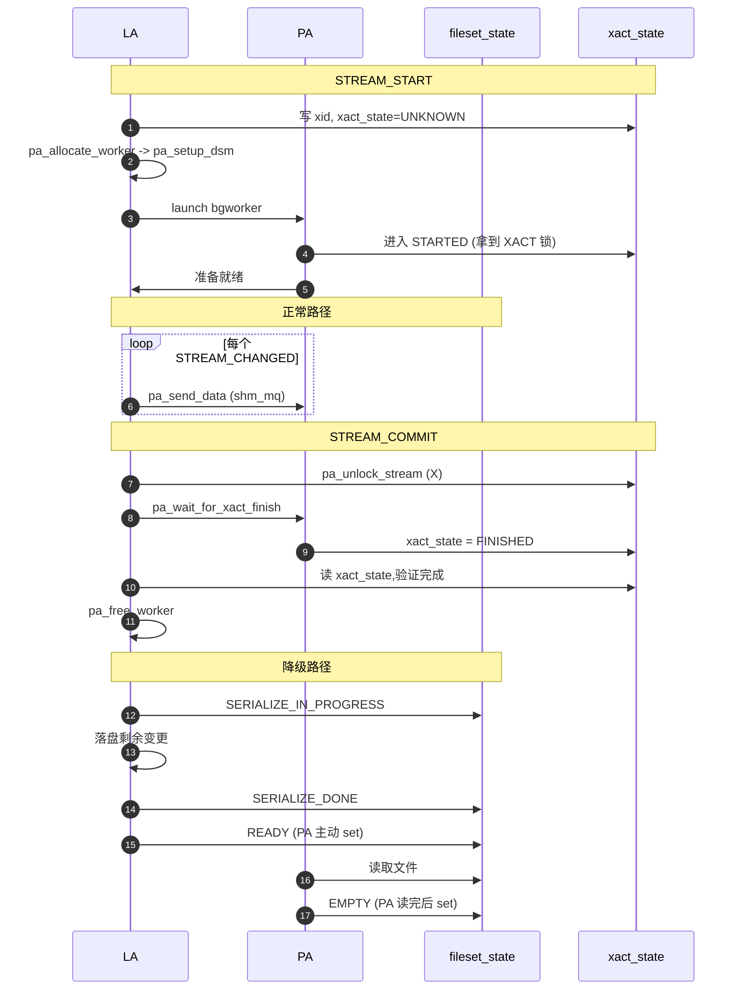

**5 状态机的协同点**:

| 阶段 | xact_state | fileset_state | 操作方 |
|---|---|---|---|
| STREAM_START | UNKNOWN | EMPTY | LA 写 xid,FS 维持 EMPTY |
| PA 启动 | UNKNOWN -> STARTED | EMPTY | PA 拿到 XACT 锁时 set |
| 降级触发 | STARTED | EMPTY -> SERIALIZE_IN_PROGRESS | LA |
| 落盘完成 | STARTED | SERIALIZE_IN_PROGRESS -> SERIALIZE_DONE | LA |
| PA 准备读 | STARTED | SERIALIZE_DONE -> READY | PA 在 pa_process_spooled_messages_if_required 中 set |
| PA 读完 | STARTED | READY -> EMPTY | PA 读完 spooled messages 后 set |
| 正常 commit | STARTED -> FINISHED | EMPTY | PA 完成时 set,LA 等待 |

## 14. LA 端的内存模型与上下文

### 14.1 5 个 MemoryContext 的角色

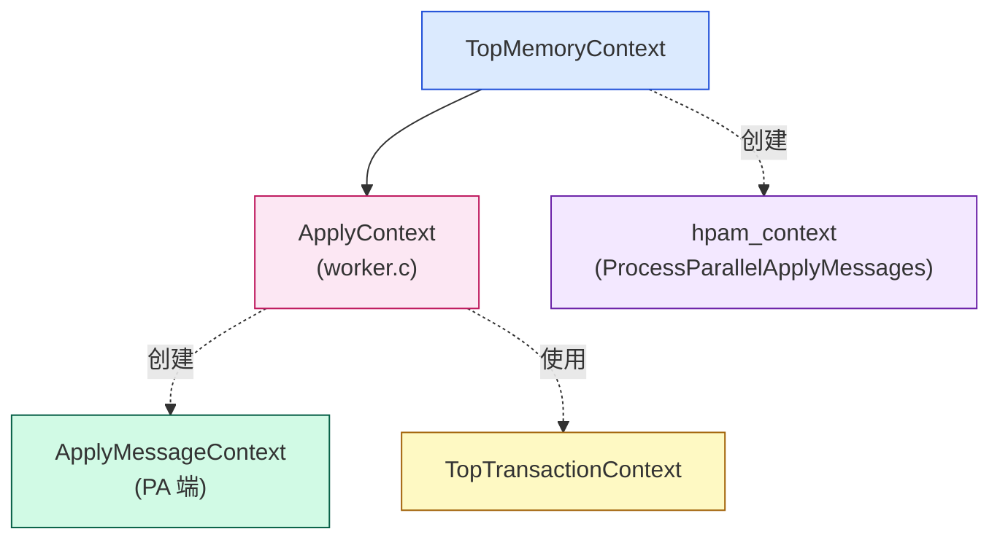

| Context | 创建时机 | 用途 | LA 端使用频率 |
|---|---|---|---|
| ApplyContext | worker.c:InitializeLogRepWorker | worker 整个生命周期 | 总是 |
| ApplyMessageContext | applyparallelworker.c:741 (PA 端) | 单条消息处理 | 不使用 |
| TopTransactionContext | PG 内核 | 事务内 alloc | subxact 时偶尔 |
| hpam_context | applyparallelworker.c:1081 | 处理 PA 错误消息 | 每次中断处理 |
| ApplyContext 用于 ParallelApplyTxnHash | applyparallelworker.c:486-488 | hash 表 | 整个生命周期 |

### 14.2 hash 表的 HASH_CONTEXT 标志(`applyparallelworker.c:486-493`)

```c
HASHCTL ctl;
MemSet(&ctl, 0, sizeof(ctl));
ctl.keysize = sizeof(TransactionId);
ctl.entrysize = sizeof(ParallelApplyWorkerEntry);
ctl.hcxt = ApplyContext;                        // 关键

ParallelApplyTxnHash = hash_create("logical replication parallel apply workers hash",
                                    16, &ctl,
                                    HASH_ELEM | HASH_BLOBS | HASH_CONTEXT);
```

**为什么用 HASH_CONTEXT?** hash 表条目(ParallelApplyWorkerEntry)的内存从 ApplyContext 分配,LA 退出时整个 ApplyContext 被销毁,hash 表自动释放。**省去手动 hash_destroy**。

## 15. LA 端与外部模块的依赖关系全景

### 15.1 模块依赖图

```mermaid
flowchart TB
    subgraph "applyparallelworker.c (LA 端)"
        LA1["pa_allocate_worker<br>pa_launch_parallel_worker<br>pa_setup_dsm"]
        LA2["pa_send_data<br>pa_switch_to_partial_serialize"]
        LA3["pa_xact_finish<br>pa_wait_for_xact_finish"]
        LA4["pa_lock_*<br>pa_unlock_*"]
        LA5["ProcessParallelApplyMessages<br>HandleParallelApplyMessageInterrupt"]
    end

    subgraph "worker.c (调用方)"
        W1["handle_streamed_transaction<br>(STREAM_CHANGED)"]
        W2["apply_handle_stream_prepare<br>(STREAM_PREPARE)"]
        W3["apply_handle_stream_commit<br>(STREAM_COMMIT)"]
        W4["apply_handle_stream_abort<br>(STREAM_ABORT)"]
        W5["LogicalRepApplyLoop<br>(主循环)"]
    end

    subgraph "launcher.c (启动入口)"
        L1["logicalrep_pa_worker_stop"]
        L2["logicalrep_worker_launch"]
    end

    subgraph "worker_internal.h (共享结构)"
        I1["LogicalRepWorker"]
        I2["ParallelApplyWorkerShared"]
        I3["ParallelApplyWorkerInfo"]
        I4["ParallelTransState<br>PartialFileSetState"]
        I5["am_leader_apply_worker<br>am_parallel_apply_worker"]
    end

    subgraph "PG 核心 (基础服务)"
        C1["shm_mq / DSM"]
        C2["lmgr<br>LockApplyTransactionForSession"]
        C3["PROCSIG_PARALLEL_APPLY_MESSAGE<br>SendProcSignal"]
        C4["pq_parse_errornotice<br>ereport"]
        C5["spinlock / pg_atomic_*"]
    end

    W1 --> LA2
    W2 --> LA2
    W2 --> LA3
    W3 --> LA2
    W3 --> LA3
    W4 --> LA3
    W5 --> LA1

    LA1 --> L2
    LA1 --> I2
    LA1 --> C1
    LA2 --> C1
    LA2 --> C5
    LA3 --> LA1
    LA4 --> C2
    LA5 --> C3
    LA5 --> C4

    classDef la fill:#fce7f3,stroke:#be185d
    classDef w fill:#dbeafe,stroke:#1d4ed8
    classDef l fill:#d1fae5,stroke:#065f46
    classDef i fill:#fef9c3,stroke:#a16207
    classDef c fill:#f3e8ff,stroke:#6b21a8
    class LA1,LA2,LA3,LA4,LA5 la
    class W1,W2,W3,W4,W5 w
    class L1,L2 l
    class I1,I2,I3,I4,I5 i
    class C1,C2,C3,C4,C5 c
```

### 15.2 完整调用栈(STREAM_START 路径)

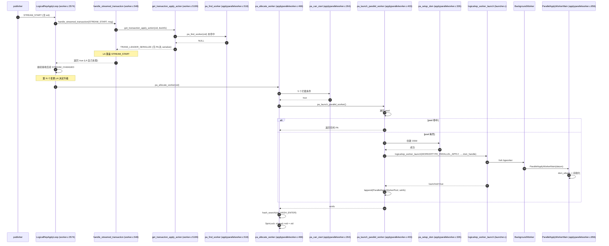

### 15.3 完整调用栈(STREAM_COMMIT 路径)

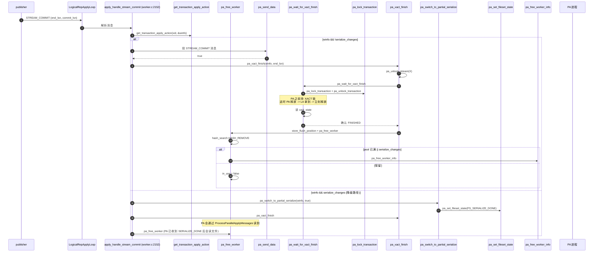

## 16. LA 端的 5 个不变量(Invariants)

阅读 LA 端代码时,这些不变量是理解"为什么这样写"的关键:

### 16.1 角色不变量

| 不变量 | 保证机制 |
|---|---|
| 只有 LA 调 pa_allocate_worker | pa_can_start 第一行 am_leader_apply_worker() |
| 只有 LA 写 ParallelApplyWorkerInfo.serialize_changes | pa_switch_to_partial_serialize 是 LA 专属 |
| 只有 LA 写 ParallelApplyWorkerInfo.in_use | pa_allocate_worker 和 pa_free_worker 都是 LA |
| 只有 LA 写 stream_apply_worker | pa_set_stream_apply_worker 仅 worker.c 调 |

### 16.2 时序不变量

| 不变量 | 保证机制 |
|---|---|
| pa_allocate_worker 必在 pa_send_data 前 | pa_find_worker 找不到时 apply_action=TRANS_LEADER_SERIALIZE,走落盘 |
| pa_lock_stream(X) 后必有 pa_unlock_stream(X) | LA 持锁期间 + 1,COMMIT 时解锁;STREAM_STOP 中提前解锁 |
| pa_wait_for_xact_state(STARTED) 必在 pa_lock_transaction 前 | 否则 LA 抢锁比 PA 早,PA 检测不到死锁 |
| DSM 段 attach 后必有 detach | pa_free_worker_info 中 4 个 detach + pa_shutdown 兜底 |

### 16.3 资源不变量

| 不变量 | 保证机制 |
|---|---|
| pool 长度 <= max_parallel_apply_workers_per_subscription / 2 | pa_free_worker 退出时强制清退超限 |
| 每个 PA 一个独立 DSM 段 | pa_setup_dsm 每次新建,不复用 |
| ParallelApplyTxnHash 不泄漏 | HASH_CONTEXT + ApplyContext 自动回收 |
| stream_apply_worker 不会指向已 free 的 PA | 仅在 pa_set_stream_apply_worker(NULL) / pa_set_stream_apply_worker(new) 时改 |

## 17. LA 端的设计洞察与最佳实践

### 17.1 Worker Pool 阈值的"XXX 临时值"

applyparallelworker.c:42-44 的注释:

> XXX This worker pool threshold is arbitrary and we can provide a GUC variable for this in the future if required.

意味着当前 max_parallel_apply_workers_per_subscription / 2 的硬编码是 **临时设计**,未来会做 GUC。这给运维的启示:

- 当前如果发现 PA 创建/销毁过于频繁,可能不是 bug,是 pool 阈值不合适
- 不要硬编码这个比值,要监控 pg_stat_subscription 的 worker 数

### 17.2 5 个 pa_can_start 拦截的实战影响

| 拦截 | 实战含义 | 监控信号 |
|---|---|---|
| parallel_apply==false | sub 配置不是 parallel | pg_subscription.substream |
| skiplsn 有效 | 用户在调 skip 流程 | pg_subscription.skiplsn 非空 |
| AllTablesyncsReady()==false | 还有表在初始同步 | pg_subscription_rel.srsubstate != 'r' |
| !am_leader_apply_worker | 不在 LA 上 | 一般不发生 |
| maybe_reread_subscription 失败 | 内部错误 | 查 log |

### 17.3 pa_send_data 9s 超时的可调性

当前硬编码 SHM_SEND_TIMEOUT_MS = 9000。如果监控发现频繁降级,可能需要:
- 调大 GUC logical_decoding_work_mem 减少发送批次
- 调小 max_parallel_apply_workers_per_subscription 减少并发 PA
- 检查 PA 是否被别的 session 阻塞(查 pg_locks)

### 17.4 parallel_apply 字段的来源

worker.c:4465-4477:

```c
case WORKERTYPE_APPLY:
    MyLogicalRepWorker->parallel_apply = true;       // LA 端启动时默认 true
    break;
case WORKERTYPE_PARALLEL_APPLY:
    MyLogicalRepWorker->parallel_apply = false;      // PA 端必须是 false
    break;
case WORKERTYPE_TABLE_SYNC:
    MyLogicalRepWorker->parallel_apply = false;      // tablesync 不并行
    break;
```

**这意味着**:parallel_apply 字段本质上是"角色标记" + "sub 是否允许并行"的复合。实际判断是否启动 PA 还要看 MySubscription->substream == SUBSTREAM_PARALLEL。

## 18. 关键源码速查表

### 18.1 文件级速查(applyparallelworker.c LA 端)

| 行号 | 名称 | 性质 | 一句话 |
|---|---|---|---|
| 225-256 | 模块级静态变量 | LA 独占 | 5 个全局状态 + 2 个 helper 前置声明 |
| 264-325 | pa_can_start | static | 5 个拦截条件 |
| 327-401 | pa_setup_dsm | static | 创建 DSM 段(3 个 key) |
| 403-468 | pa_launch_parallel_worker | static | 优先 pool,否则启动新 PA |
| 470-516 | pa_allocate_worker | extern | LA 启动 PA 的唯一入口 |
| 518-555 | pa_find_worker | extern | xid 查 PA(优先 cache) |
| 555-594 | pa_free_worker | static | 释放 PA(可能清退) |
| 595-620 | pa_free_worker_info | static | 释放 PA 资源(7 步清理) |
| 621-639 | pa_detach_all_error_mq | extern | LA 退出前 detach error MQ |
| 641-655 | pa_has_spooled_message_pending | static | 判断 fileset_state != FS_EMPTY |
| 658-709 | pa_process_spooled_messages_if_required | static | PA 端 spooled 消息 replay |
| 995-1006 | HandleParallelApplyMessageInterrupt | extern | LA 端信号处理 |
| 1008-1067 | ProcessParallelApplyMessage | static | 解析单条消息(E/N/A) |
| 1069-1151 | ProcessParallelApplyMessages | extern | 遍历所有 PA 的 error MQ |
| 1153-1217 | pa_send_data | extern | 9s 超时非阻塞 shm_mq 发送 |
| 1217-1249 | pa_switch_to_partial_serialize | extern | 降级:shm_mq 超时切落盘 |
| 1250-1279 | pa_wait_for_xact_state | static | 自旋等 xact_state 推进 |
| 1280-1312 | pa_wait_for_xact_finish | static | 等 PA 完成后用 XACT 锁做死锁检测 |
| 1313-1324 | pa_set_xact_state | extern | 写 shared->xact_state |
| 1325-1339 | pa_get_xact_state | static | 读 shared->xact_state |
| 1340-1352 | pa_set_stream_apply_worker | extern | 设置 cache |
| 1354-1366 | pa_savepoint_name | static | 拼 SAVEPOINT 名 |
| 1368-1407 | pa_start_subtrans | extern | PA 端定义 SAVEPOINT |
| 1408-1421 | pa_reset_subtrans | extern | 清空 subxactlist |
| 1422-1502 | pa_stream_abort | extern | PA 端处理 STREAM ABORT |
| 1504-1523 | pa_set_fileset_state | extern | 写 shared->fileset_state |
| 1524-1545 | pa_get_fileset_state | static | 读 shared->fileset_state |
| 1546-1553 | pa_lock_stream / pa_unlock_stream | extern | session STREAM 锁 |
| 1579-1596 | pa_lock_transaction / pa_unlock_transaction | extern | session XACT 锁 |
| 1597-1623 | pa_decr_and_wait_stream_block | extern | PA 端等 STREAM 锁 |
| 1624-1646 | pa_xact_finish | extern | LA 端 commit 收尾 |

### 18.2 LA 端 -> PA 端的调用

| LA 调用 | 触发场景 | PA 端反应 |
|---|---|---|
| pa_send_data (正常) | 每条变更 | PA 在 LogicalParallelApplyLoop 中 receive |
| pa_send_data (超时) | 9s 还没发出 | LA 自己降级 |
| pa_unlock_stream(X) | STREAM_STOP 时 | PA 抢到 STREAM 锁,继续 receive |
| pa_set_fileset_state(FS_SERIALIZE_DONE) | 落盘完毕 | PA 在 pa_process_spooled_messages_if_required 中读到 |
| pa_switch_to_partial_serialize(..., stream_locked=true) | 降级 | PA 在 pa_process_spooled_messages_if_required 中空抢 STREAM 锁 |
| pa_lock_transaction (空抢) | pa_wait_for_xact_finish | PA 释放 XACT 锁,LA 拿到再释放 |
| pa_xact_finish | STREAM_COMMIT | PA 写 xact_state=FINISHED |
| pa_stream_abort | STREAM_ABORT | PA 端 PA 自己处理(在 worker.c 中) |

### 18.3 LA 端调用的外部模块

| 模块 | LA 用到的接口 | 用途 |
|---|---|---|
| worker_internal.h | MyLogicalRepWorker, MySubscription, MyParallelShared | 全局状态 |
| worker_internal.h | am_leader_apply_worker, am_parallel_apply_worker | 角色判断 |
| worker.c | maybe_reread_subscription, AllTablesyncsReady | 拦截条件 |
| worker.c | stream_start_internal, stream_cleanup_files, apply_spooled_messages | 落盘/回放 |
| launcher.c | logicalrep_worker_launch, logicalrep_pa_worker_stop | bgworker 启停 |
| storage/lmgr | LockApplyTransactionForSession, UnlockApplyTransactionForSession | session 锁 |
| storage/ipc | shm_mq_*, dsm_* | 共享内存队列 |
| libpq/pqmq | pq_redirect_to_shm_mq | PA 端错误转 MQ |
| libpq/pqformat | pq_getmsgbyte, pq_parse_errornotice | 消息解析 |
| replication/origin | replorigin_session_* | 复制起点 |
| utils/inval | CacheRegisterSyscacheCallback | syscache 失效回调 |
| utils/memutils | AllocSetContextCreate, MemoryContextReset | 内存上下文 |
| utils/syscache | invalidate_syncing_table_states | 失效回调函数 |
| postmaster/interrupt | ProcessParallelApplyInterrupts | 中断处理 |

## 19. 实战案例:跟踪一次完整的 PA 生命周期

下面用伪代码跟踪一次 pa_allocate_worker -> pa_send_data -> pa_xact_finish 的完整流程,标注 LA/PA 端。

### 19.1 场景设定

```sql
-- 订阅端配置
CREATE SUBSCRIPTION sub_test
  CONNECTION 'host=pub port=5432 dbname=test'
  PUBLICATION pub_test
  WITH (streaming = parallel, streaming_mode = 'on');
```

streaming = parallel 会让 substream = SUBSTREAM_PARALLEL,从而 MyLogicalRepWorker->parallel_apply = true。

### 19.2 完整生命周期

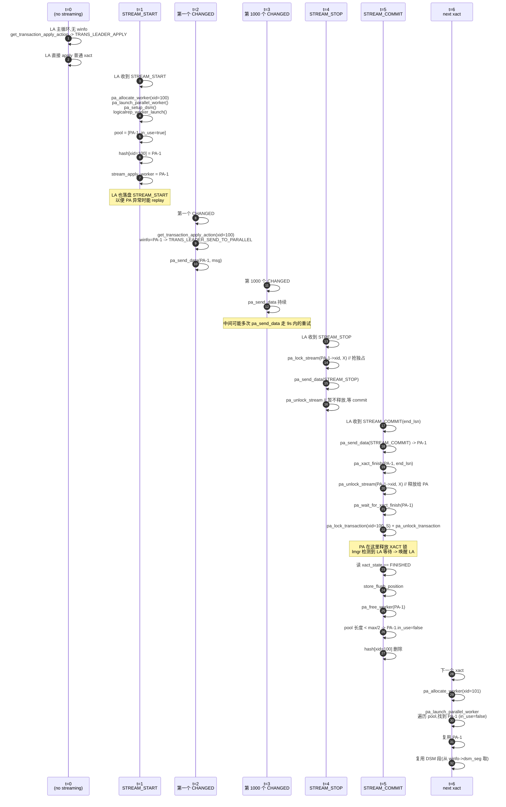

**关键时长**(理论值):
- 每次 pa_send_data:0~9 秒(9s 是降级阈值)
- pa_wait_for_xact_finish:取决于 PA apply 速度
- 一个 streaming xact 的总耗时 ≈ streaming 期间 LA 的 wall clock + commit 等待

## 20. 与《applyparallelworker.c 源码深度解析》的关系

| 维度 | 上一篇(总览) | 本篇(LA 端) |
|---|---|---|
| 视角 | PA 端为主,LA 端简略 | 完全 LA 视角 |
| 重点 | DSM 段布局、shm_mq、3 个状态机 | 5 状态机的协同、worker pool、降级、锁 |
| 代码 | 34 个函数全表 | 17 个 LA 端函数深度解析 |
| 时序图 | 1 张 | 5 张精细时序 |
| 实战 | DSM 创建 | 完整生命周期跟踪 |
| 模块 | 跨文件依赖 | 11 个外部模块接口 |

两篇配合阅读,即可对 applyparallelworker.c 形成完整认知。

## 21. 总结与下一步

### 21.1 LA 端的核心定位

> **LA 是"调度 + 协调 + 容错"中枢,PA 是"执行"单元。**

LA 端做的事:
1. **资源管理**:worker pool、DSM 段、hash 表
2. **任务分派**:get_transaction_apply_action 五态决策
3. **流量控制**:pa_send_data 9s 超时降级
4. **死锁防护**:STREAM + XACT 双 session 锁
5. **错误汇聚**:ProcessParallelApplyMessages 把 PA 错误回灌 LA
6. **生命周期管理**:pa_free_worker 清退/保留

### 21.2 关键洞察清单

1. **LA 的"并发"是有上限的**:pool 长度 <= max_parallel_apply_workers_per_subscription / 2
2. **shm_mq 9s 超时是"妥协"**:为避免 shm_mq 满导致的不可见死锁
3. **5 个状态机协同保证正确性**:xact_state + fileset_state + DSM 字段
4. **am_leader_apply_worker() 是 LA/PA 切换的"开关"**:同一份代码,不同路径
5. **session 锁是双向死锁检测的"前提"**:没它,lmgr 看不到等待关系
6. **pa_wait_for_xact_finish 的"空抢"是死锁检测的核心**:必须 wait STARTED -> 空抢 -> 读 state

### 21.3 推荐关联阅读

- [applyparallelworker.c 源码深度解析(总览)](../postgresql-apply-parallel-worker-code-analysis/) — 上一篇,看 PA 端
- [PostgreSQL 逻辑复制 apply parallel worker 调优](../postgresql-logical-replication-apply-parallel-tuning/) — 调优实战
- [apply parallel worker lock stream 机制](../postgresql-apply-parallel-lock-stream/) — 死锁防护细节
- [PostgreSQL 逻辑复制 streaming 机制](../postgresql-logical-replication-streaming/) — streaming 原理
- [PostgreSQL 逻辑复制 spill 文件分析](../postgresql-logical-replication-spill-files/) — partial-serialize 落盘

## 参考

- src/backend/replication/logical/applyparallelworker.c (1646 行) — 本篇分析对象
- src/backend/replication/logical/worker.c (5239 行) — LA 主循环,所有 PA 接口的调用方
- src/backend/replication/logical/launcher.c (1394 行) — logicalrep_worker_launch / logicalrep_pa_worker_stop
- src/include/replication/worker_internal.h (354 行) — 共享结构、宏、inline 函数
- src/include/replication/logicallauncher.h — 启动器公共 API
- src/backend/storage/lmgr/proc.c — LockApplyTransactionForSession 实现
- src/backend/storage/ipc/shm_mq.c — shm_mq 实现
- src/backend/storage/ipc/dsm.c — DSM 实现
- PostgreSQL 18 源码:git log --follow src/backend/replication/logical/applyparallelworker.c 可查看提交历史
