# Apply Parallel Worker 的 lock_stream 与 unlock_stream:为什么"获得就释放"的死锁防护机制

> 配套源码:`~/cwork/postgresql`(基于 PG 18 主干)
>
> 配套前文:
> - [PostgreSQL 18 Apply Parallel Worker 运行机制](https://growdu.github.io/blog/db/postgresql/postgresql-apply-parallel-worker/)
> - [Apply Parallel Worker 参数调优实战](https://growdu.github.io/blog/db/postgresql/postgresql-logical-replication-apply-parallel-tuning/)
>
> 本文聚焦一个**反直觉**的设计:
>
> ```c
> pa_lock_stream(MyParallelShared->xid, AccessShareLock);
> pa_unlock_stream(MyParallelShared->xid, AccessShareLock);  // ← 立刻释放!
> ```
>
> 既然立刻释放,为什么要加锁?读完本文你会理解——**它的目的不是互斥,而是在 lmgr 的 wait-for 图中插入一条边,让死锁检测器能看到**。
>
> 读完本文你会获得:
> 1. **lock_stream 的本质**:**死锁检测信号**,不是互斥机制
> 2. **3 种典型死锁场景**(源码注释 + 完整推导)
> 3. **两种锁的区别**:`PA_LOCK_STREAM` vs `PA_LOCK_XACT`
> 4. **为什么不能用 `XactLockTableWait()`**
> 5. **lock + unlock 的精确时序图**
> 6. **源码定位速查**

---

## 一、反直觉的代码

源码位置:`src/backend/replication/logical/applyparallelworker.c:1598`。

```c
// src/backend/replication/logical/applyparallelworker.c:1598
void
pa_decr_and_wait_stream_block(void)
{
    Assert(am_parallel_apply_worker());

    if (pg_atomic_read_u32(&MyParallelShared->pending_stream_count) == 0)
    {
        if (pa_has_spooled_message_pending())
            return;

        elog(ERROR, "invalid pending streaming chunk 0");
    }

    if (pg_atomic_sub_fetch_u32(&MyParallelShared->pending_stream_count, 1) == 0)
    {
        pa_lock_stream(MyParallelShared->xid, AccessShareLock);
        pa_unlock_stream(MyParallelShared->xid, AccessShareLock);   // ← 立刻释放!
    }
}
```

**第一眼看上去**:
- `pa_lock_stream` 加锁
- `pa_unlock_stream` 立刻释放
- **这不就是 noop 吗?**

**不**。这两行是 **精心设计的死锁防护**。让我解释。

---

## 二、真正目的:在 lmgr 中插入一条 wait-for 边

PG 的 **Lock Manager(lmgr)** 在 PG 内存里维护一个 **wait-for 图**。当一个进程等待另一个进程持有的锁时,会建立一条边。

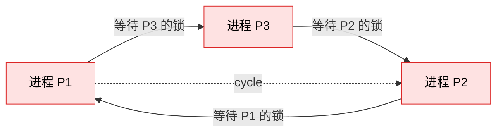

**核心洞察**:

> `pa_lock_stream` **不是用来互斥**——它是在 **lmgr wait-for 图** 中插入一条 **PA → LA** 的等待边。

如果 PA 此刻**没有真的等 LA 的锁**,lmgr 就**看不到**这个依赖关系,死锁检测器自然就检测不到。

**通过 `pa_lock_stream` 强制等一下**(获得就释放,几乎瞬间完成),**让 lmgr 知道**"PA 当前在等 LA"。这样死锁检测器才能在 LMGR 内部跑它的图算法。

源码注释(`applyparallelworker.c:60-110`)有完整说明:

> "We have a risk of deadlock due to concurrently applying the transactions in parallel mode that were independent on the publisher side but became dependent on the subscriber side due to the different database structures (like schema of subscription tables, constraints, etc.) on each side."

---

## 三、3 种典型死锁场景

### 场景 1:LA ↔ PA 死锁(行锁冲突)

**场景前提**:订阅表有 unique key(发布端没有),导致两边的数据修改顺序产生冲突。

```mermaid
sequenceDiagram
    participant LA as Leader Apply Worker
    participant PA as Parallel Apply Worker
    participant DB as 数据库(唯一索引)

    Note over LA: LA 在执行 TX-2
    Note over PA: PA 在执行 TX-1

    LA->>DB: INSERT/UPDATE 触发 unique key 冲突
    DB-->>LA: 等待 PA 释放 unique key 锁
    Note over PA: PA 处理完一轮 stream,等 LA 发下一批
    PA->>LA: 等下一批 stream chunks
    Note over LA: LA 被 PA 阻塞,<br/>而 PA 等 LA → 死锁!

    style LA fill:#fee2e2,stroke:#dc2626,color:#000
    style PA fill:#fee2e2,stroke:#dc2626,color:#000
```

**wait-for 图**:

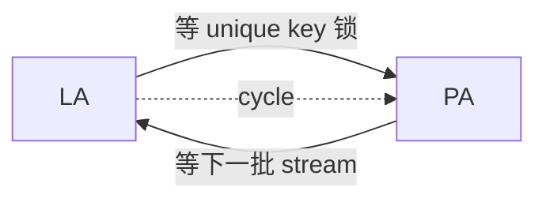

**没有 lock_stream 时**:lmgr 看不到 PA 等 LA。死锁检测器**无法发现**。

**有 lock_stream 时**:

源码 `applyparallelworker.c:88-92`:

> "In order for lmgr to detect this, we have LA acquire a session lock on the remote transaction (by pa_lock_stream()) and have PA wait on the lock before trying to receive the next stream of changes."

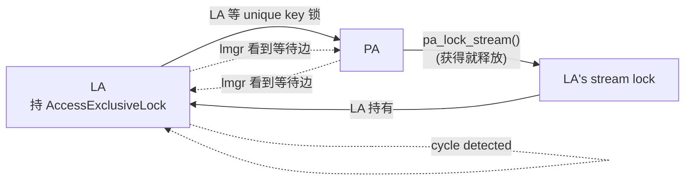

**LMGR 内部**:

```
T1 (PA): 等待 LA 的 Stream Lock  ←  ←  ← lock_stream 触发的边
T2 (LA): 等待 PA 的 unique key 锁
→ 形成环 → 触发死锁检测 → 回滚某个事务
```

### 场景 2:LA ↔ PA-2 ↔ PA-1 三方死锁

**场景**:两个并行 worker,各自处理一个事务,但事务之间有依赖(commit 顺序保证)。

源码 `applyparallelworker.c:106-115`:

> "In this scenario, PA-2 is waiting for PA-1 to complete its transaction while PA-1 is waiting for subsequent input from LA. Also, LA is waiting for PA-2 to complete its transaction in order to preserve the commit order."

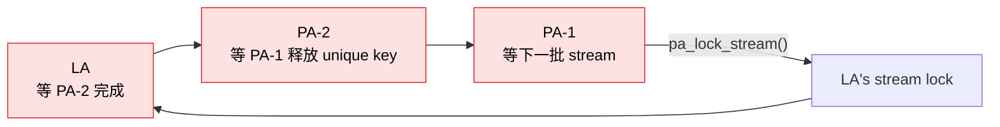

**通过 `PA_LOCK_XACT`** 解决,详见第六章。

### 场景 3:shm_mq 缓冲区满

源码 `applyparallelworker.c:135-145`:

> "In the previous scenario, if the shm_mq buffer between LA and PA-2 is full, LA has to wait to send messages, and this wait doesn't appear in lmgr."

**问题**:shm_mq 写满时,LA 等待 PA 消费,**但 lmgr 不知道这个等待**(因为它是应用层等待)。

**解决方案**(源码注释):

> "To avoid this wait, we use a non-blocking write and wait with a timeout. If the timeout is exceeded, the LA will serialize all the pending messages to a file and indicate PA-2 that it needs to read that file for the remaining messages. Then LA will start waiting for commit as in the previous case which will detect deadlock if any."

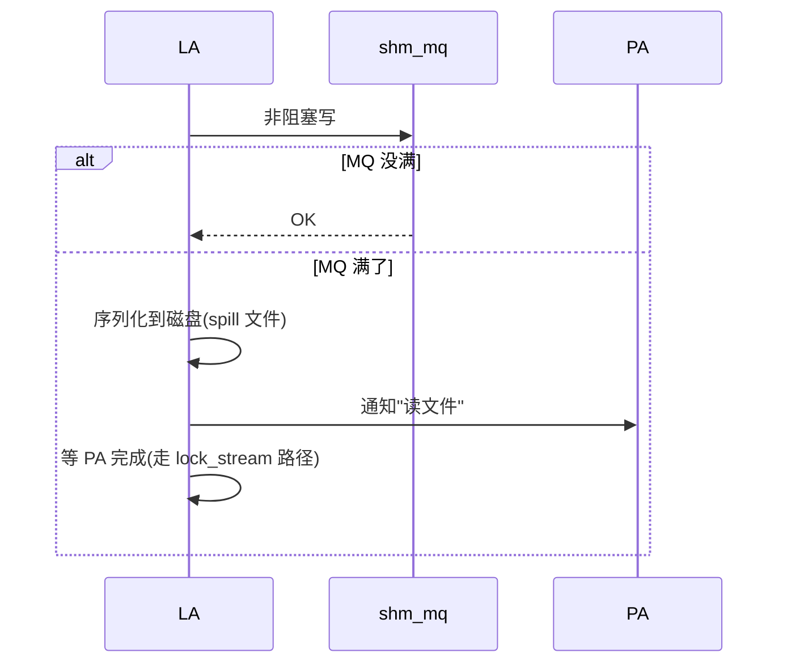

---

## 四、lock_stream 的精确时序

源码 `applyparallelworker.c:78-95`(节选):

> "LA will acquire the lock in AccessExclusive mode before sending the STREAM_STOP and will release it if already acquired after sending the STREAM_START, STREAM_ABORT (for toplevel transaction), STREAM_PREPARE, and STREAM_COMMIT. The PA will acquire the lock in AccessShare mode after processing STREAM_STOP and STREAM_ABORT (for subtransaction) and then release the lock immediately after acquiring it."

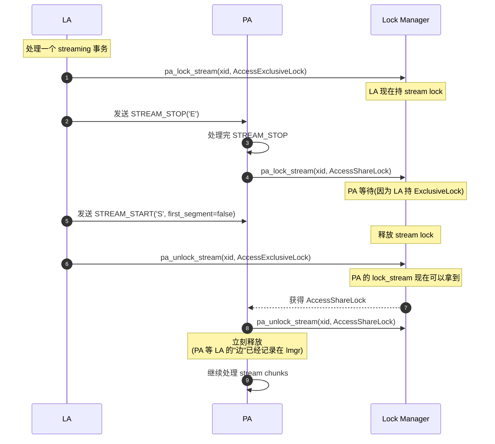

**关键点**:
1. **LA 在发 STREAM_STOP 前拿 ExclusiveLock** —— 阻塞 PA
2. **PA 在 STREAM_STOP 后想拿 AccessShareLock** —— **这里形成 PA → LA 的等待边**
3. **LA 发完 STREAM_START 后立刻解锁** —— PA 的 lock 立即获得
4. **PA 立刻释放 AccessShareLock** —— "获得就释放",但等待边已在 lmgr 中

**整个过程的锁状态**:

```
时间线:
  ─────┬─────────┬─────────┬─────────┬─────────┬─────
       │ LA 拿 X │LA 发 STOP│ LA 发...│ LA 释放 │ PA 拿 S
       │         │ PA 想拿 S│         │         │ PA 释放
  wait │   -     │   YES    │   YES   │   -     │   -

LA lock 持有状态: [████ X ████][██████ X ██████][释放]
PA lock 状态:                  [等 X ... 获得 ... 释放]
lmgr 等待边:                    [PA → LA]    (在 PA 获得前)
```

---

## 五、锁的标识与定位

### 5.1 LockTag 的构成

源码 `src/backend/storage/lmgr/lmgr.c:1209`、`src/include/storage/lock.h`(`SET_LOCKTAG_APPLY_TRANSACTION`):

```c
// src/include/storage/lock.h
#define SET_LOCKTAG_APPLY_TRANSACTION(locktag, dboid, suboid, xid, objid)     ((locktag).locktag_field1 = (dboid),      (locktag).locktag_field2 = (suboid),      (locktag).locktag_field3 = (xid),      (locktag).locktag_field4 = (objid),      (locktag).locktag_type = LOCKTAG_APPLY_TRANSACTION,      (locktag).locktag_lockmethodid = DEFAULT_LOCKMETHOD)
```

| 字段 | 值 | 含义 |
|------|---|------|
| `locktag_type` | `LOCKTAG_APPLY_TRANSACTION` | 标识这是"apply 事务锁" |
| `locktag_field1` | 数据库 OID | 区分不同 database |
| `locktag_field2` | subscription OID | 区分不同 sub |
| `locktag_field3` | 远端事务 XID | 区分不同事务 |
| `locktag_field4` | `PARALLEL_APPLY_LOCK_STREAM` (0) 或 `PARALLEL_APPLY_LOCK_XACT` (1) | **区分两种锁** |

源码 `applyparallelworker.c:209`:

```c
#define PARALLEL_APPLY_LOCK_STREAM   0
#define PARALLEL_APPLY_LOCK_XACT     1
```

### 5.2 实现

源码 `src/backend/storage/lmgr/lmgr.c:1209`:

```c
void
LockApplyTransactionForSession(Oid suboid, TransactionId xid, uint16 objid,
                               LOCKMODE lockmode)
{
    LOCKTAG    tag;

    SET_LOCKTAG_APPLY_TRANSACTION(tag,
                                  MyDatabaseId,
                                  suboid,
                                  xid,
                                  objid);

    (void) LockAcquire(&tag, lockmode, true, false);
    //                                                  ↑↑↑
    //                                  sessionLock=true, dontWait=false
}
```

**两个关键参数**:

| 参数 | 值 | 含义 |
|------|---|------|
| `sessionLock` | `true` | **session-level lock**,在事务外仍保持 |
| `dontWait` | `false` | **阻塞等待**直到拿到锁 |

**为什么是 session lock?**

源码注释 `lmgr.c:1200-1208`:

> "Obtain a session-level lock on a transaction being applied on a logical replication subscriber. See LockRelationIdForSession for notes about session-level locks."

`LockApplyTransactionForSession` 与 `LockRelationIdForSession` 模式相同。**session-level lock 的特点**:即使当前事务结束,锁仍保持,**只在 session 结束时释放**。

**为什么需要 session-level?**

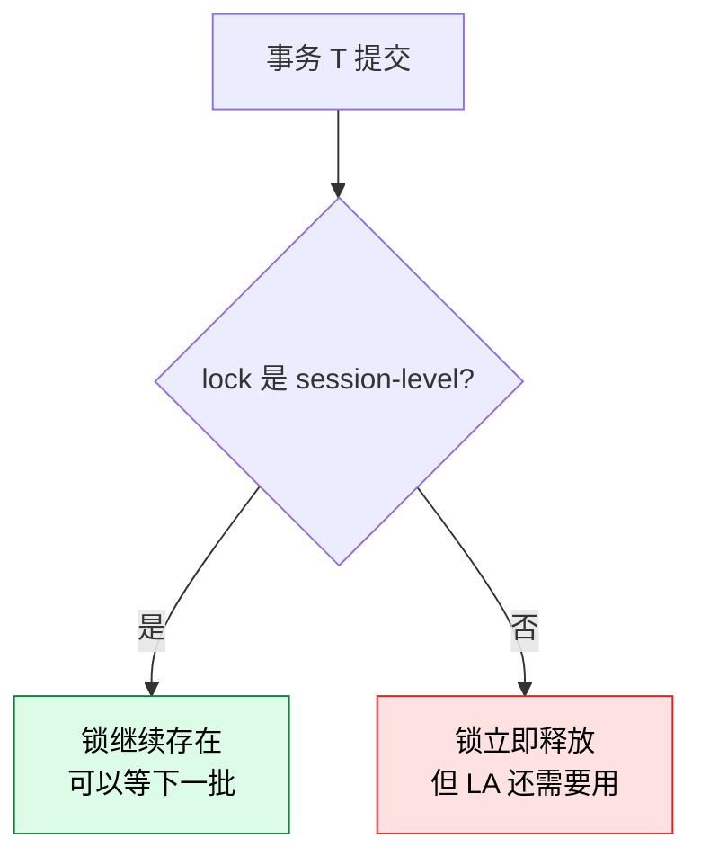

**关键场景**:LA 拿 ExclusiveLock 后,**事务可能已经提交**,但 LA 还在等 PA 完成最后的工作。如果锁是事务级的,会立即释放,**PA 就拿不到等待信号**。

### 5.3 `pa_lock_stream` 包装

源码 `applyparallelworker.c:1547-1558`:

```c
void
pa_lock_stream(TransactionId xid, LOCKMODE lockmode)
{
    LockApplyTransactionForSession(MyLogicalRepWorker->subid, xid,
                                   PARALLEL_APPLY_LOCK_STREAM, lockmode);
}

void
pa_unlock_stream(TransactionId xid, LOCKMODE lockmode)
{
    UnlockApplyTransactionForSession(MyLogicalRepWorker->subid, xid,
                                     PARALLEL_APPLY_LOCK_STREAM, lockmode);
}
```

**作用**:把 `(subid, xid, objid=STREAM, lockmode)` 组合成一个 lock tag,调用 lmgr。

---

## 六、两种锁的对比:`STREAM` vs `XACT`

源码 `applyparallelworker.c:60-145` 注释中详细对比了两种锁。

| 维度 | `PARALLEL_APPLY_LOCK_STREAM` | `PARALLEL_APPLY_LOCK_XACT` |
|------|---------------------------|---------------------------|
| **常量值** | `0` | `1` |
| **目的** | 让 lmgr 看到 PA 等 LA | 让 lmgr 看到 LA 等 PA |
| **调用方** | LA 拿 ExclusiveLock,PA 拿 AccessShareLock | PA 拿 ExclusiveLock,LA 拿 AccessShareLock |
| **时机** | 跨 stream chunks | 跨整个事务 |
| **保护场景** | 场景 1(LA↔PA)、场景 3(MQ 满) | 场景 2(LA↔PA-2↔PA-1) |

### 6.1 STREAM LOCK 的角色

源码 `applyparallelworker.c:80-92`:

> "LA will acquire the lock in AccessExclusive mode before sending the STREAM_STOP and will release it if already acquired after sending the STREAM_START..."

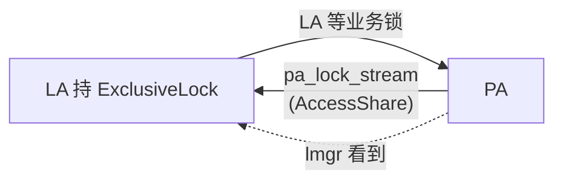

### 6.2 XACT LOCK 的角色

源码 `applyparallelworker.c:115-130`:

> "PA will acquire this lock in AccessExclusive mode before executing the first message of the transaction and release it at the xact end. LA will acquire this lock in AccessShare mode at transaction finish commands and release it immediately."

```mermaid
flowchart LR
    LA[LA 等 PA-2 完成] -->|LA 拿 AccessShare<br/>(等 PA-2 释放 XACT lock)| P2[PA-2 持 Exclusive]
    P2 -->|PA-2 等业务锁| P1[PA-1]
    P1 -->|"pa_lock_stream"| LA
    LA -.lmgr 看到.-> P2
    P2 -.lmgr 看到.-> P1
    P1 -.lmgr 看到.-> LA
```

**完整 3 方死锁链路**:

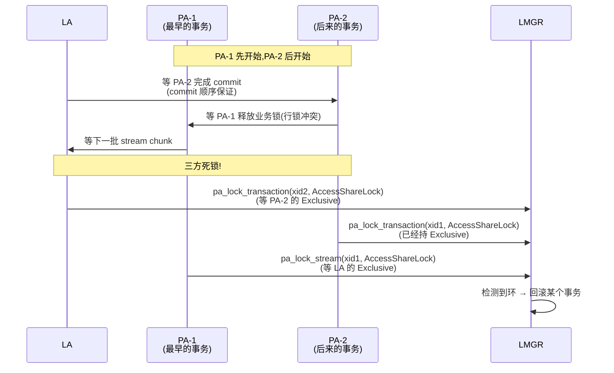

**关键洞察**:

| 锁 | 谁持 | 谁等 | 边方向 |
|----|------|------|--------|
| `STREAM` | LA | PA | PA → LA |
| `XACT` | PA | LA | LA → PA |

**两者组合**形成**双向依赖**,lmgr 能检测所有方向的死锁。

### 6.3 源码位置

```c
// src/backend/replication/logical/applyparallelworker.c:1281
pa_wait_for_xact_finish(ParallelApplyWorkerInfo *winfo)
{
    /* 1. 等 PA 拿到 XACT lock(PARALLEL_TRANS_STARTED) */
    pa_wait_for_xact_state(winfo, PARALLEL_TRANS_STARTED);

    /* 2. 等 PA 释放 XACT lock(AccessShare 拿到立刻放) */
    pa_lock_transaction(winfo->shared->xid, AccessShareLock);
    pa_unlock_transaction(winfo->shared->xid, AccessShareLock);
    ...
}
```

```c
// src/backend/replication/logical/applyparallelworker.c:1296
/* PA 在开始 apply 第一个 change 前,拿 XACT lock */
pa_lock_transaction(winfo->shared->xid, AccessShareLock);
pa_unlock_transaction(winfo->shared->xid, AccessShareLock);
```

---

## 七、为什么不能用 `XactLockTableWait()`

源码 `applyparallelworker.c:131-134`:

> "One might think we can use XactLockTableWait(), but XactLockTableWait() considers PREPARED TRANSACTION as still in progress which means the lock won't be released even after the parallel apply worker has prepared the transaction."

**问题**:

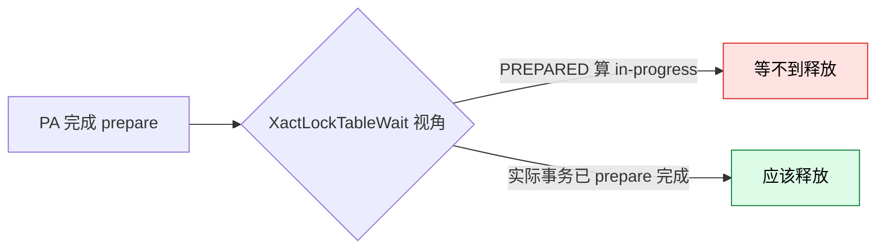

**`XactLockTableWait()` 的语义**:等到事务"完成"——**包括 abort 和 commit**。但 **PREPARED 事务不算"完成"**(它在等 COMMIT PREPARED)。

**后果**:如果用 `XactLockTableWait`,PA 在 prepare 后,**即使 PA 进程已经退出**,LA 还在等,**永久死锁**。

**`LockApplyTransactionForSession` 的优势**:session-level lock,**在进程退出时自动释放**——即使事务没真正完成。

---

## 八、实战:看一个完整的 PA 调用流程

源码 `worker.c:1718`、`applyparallelworker.c:1598` 调用链:

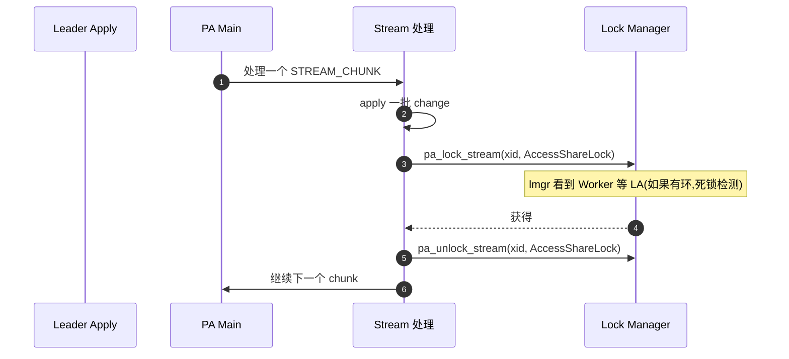

**关键调用点汇总**:

| 位置 | 调用 | 作用 |
|------|------|------|
| `applyparallelworker.c:680-681` | `pa_lock_stream + pa_unlock_stream` | 处理一个 chunk 后的"心跳" |
| `applyparallelworker.c:1241` | `pa_lock_stream(xid, AccessExclusiveLock)` | LA 准备发 STREAM_STOP |
| `applyparallelworker.c:1296-1297` | `pa_lock_transaction + pa_unlock_transaction` | PA 在事务开始时声明 |
| `applyparallelworker.c:1616-1617` | `pa_lock_stream + pa_unlock_stream` | 处理 STREAM_ABORT |
| `applyparallelworker.c:1633` | `pa_unlock_stream(ExclusiveLock)` | LA 完成发 STREAM_START 后释放 |
| `worker.c:1551` | `pa_unlock_stream(ExclusiveLock)` | LA 释放 stream lock |
| `worker.c:1592` | `pa_lock_transaction(ExclusiveLock)` | LA 等 commit 顺序时获取 |
| `worker.c:1670` | `pa_lock_stream(ExclusiveLock)` | LA 在某个路径下获取 |
| `worker.c:1718` | `pa_decr_and_wait_stream_block()` | PA 处理完一个 chunk 后等下一批 |
| `worker.c:1891-1893` | `pa_unlock_stream + pa_lock_stream` | STREAM_ABORT 路径下重新调整锁 |

---

## 九、监控与诊断

### 9.1 看到锁等待

```sql
-- 查看当前 PG 进程的锁状态
SELECT
    pg_class.relname,
    pg_locks.locktype,
    pg_locks.mode,
    pg_locks.granted,
    pg_locks.pid,
    pg_locks.waitstart,
    pg_locks.locktag_field1 AS dboid,
    pg_locks.locktag_field2 AS suboid,
    pg_locks.locktag_field3 AS xid
FROM pg_locks
LEFT JOIN pg_class ON pg_class.oid = pg_locks.relation
WHERE pg_locks.locktype = 'applytransaction'
ORDER BY pg_locks.granted, pg_locks.waitstart;
```

**输出示例**:

```
 locktype        | mode           | granted | pid  | waitstart
-----------------+----------------+---------+------+----------
 applytransaction | AccessExclusive| t       | 1234 | [null]
 applytransaction | AccessShare    | f       | 1235 | 2026-09-16 10:00:01
 applytransaction | AccessExclusive| t       | 1236 | [null]
```

### 9.2 识别死锁

PG 日志中会出现:

```
ERROR:  deadlock detected
DETAIL: Process 1235 waits for AccessShareLock on transaction 5678; blocked by process 1234.
        Process 1234 waits for AccessExclusiveLock on transaction 5679; blocked by process 1235.
```

**关键**:`locktype` 会显示为 `applytransaction`,标识这是 logical replication 的死锁。

### 9.3 验证 lock_stream 是否在保护你的场景

```sql
-- 创建一个 unique key 不一致的场景
-- 发布端:无 unique key
CREATE TABLE pub_t (id int);
-- 订阅端:有 unique key
CREATE TABLE sub_t (id int UNIQUE);
```

如果两个并发事务在订阅端产生 unique key 冲突,**没有 lock_stream 就会死锁**;有 lock_stream 就会被检测并回滚。

---

## 十、设计精妙之处总结

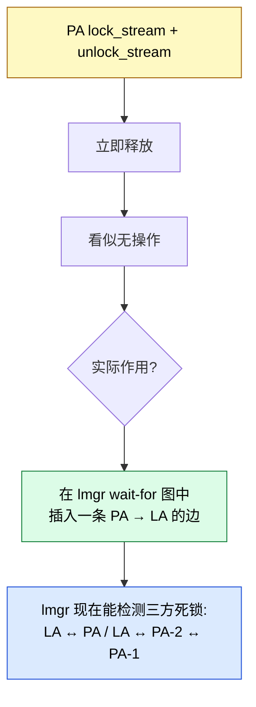

**3 个核心设计原则**:

1. **不是为了互斥,而是为了观察** —— 加锁瞬间就释放,目的是让 lmgr 看到依赖
2. **session-level 而非事务级** —— 即使事务结束,锁仍保持,直到 PA 真正退出
3. **组合两种锁覆盖所有死锁路径** —— STREAM(LA→PA)+ XACT(PA→LA)= 完整

---

## 十一、源码速查

| 关注点 | 文件 | 行/位置 |
|--------|------|---------|
| **完整注释(必读)** | `src/backend/replication/logical/applyparallelworker.c` | **L60-160** |
| `PARALLEL_APPLY_LOCK_STREAM/XACT` 常量 | `src/backend/replication/logical/applyparallelworker.c` | L209-210 |
| `pa_lock_stream` 实现 | `src/backend/replication/logical/applyparallelworker.c` | L1547 |
| `pa_unlock_stream` 实现 | `src/backend/replication/logical/applyparallelworker.c` | L1554 |
| `pa_lock_transaction` 实现 | `src/backend/replication/logical/applyparallelworker.c` | L1580 |
| `pa_decr_and_wait_stream_block` | `src/backend/replication/logical/applyparallelworker.c` | L1598 |
| `pa_wait_for_xact_finish` | `src/backend/replication/logical/applyparallelworker.c` | L1281 |
| `LockApplyTransactionForSession` | `src/backend/storage/lmgr/lmgr.c` | L1209 |
| `SET_LOCKTAG_APPLY_TRANSACTION` | `src/include/storage/lock.h` | (宏定义) |
| `LOCKTAG_APPLY_TRANSACTION` | `src/include/storage/lock.h` | (enum) |
| Worker 端调用点 | `src/backend/replication/logical/worker.c` | L1551, 1592, 1670, 1718, 1891 |

---

## 十二、参考

- 配套前文:
  - [PostgreSQL 18 Apply Parallel Worker 运行机制](https://growdu.github.io/blog/db/postgresql/postgresql-apply-parallel-worker/)
  - [Apply Parallel Worker 参数调优实战](https://growdu.github.io/blog/db/postgresql/postgresql-logical-replication-apply-parallel-tuning/)
- 必读源码注释:`src/backend/replication/logical/applyparallelworker.c` L60-160(完整死锁防护说明)
- [PostgreSQL 文档 - Locking Considerations](https://www.postgresql.org/docs/18/explicit-locking.html)
