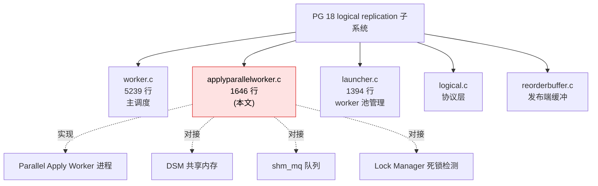
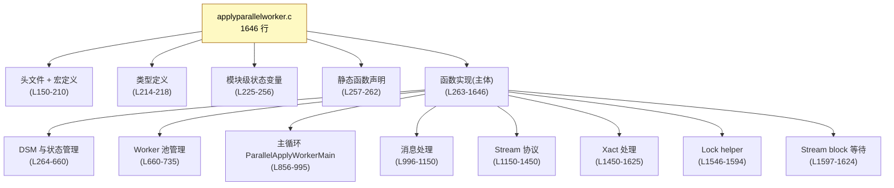
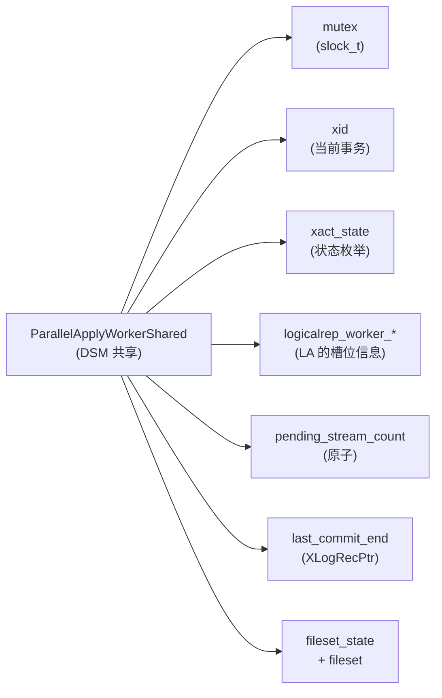
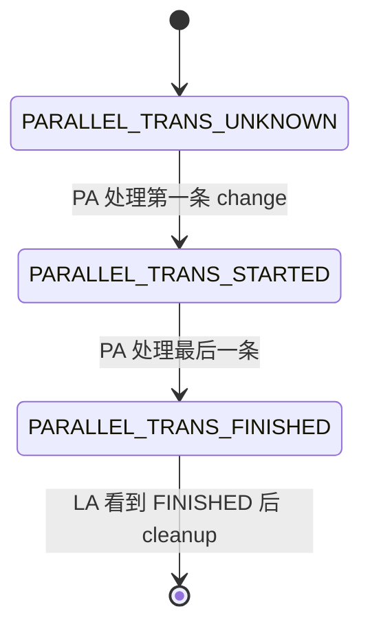
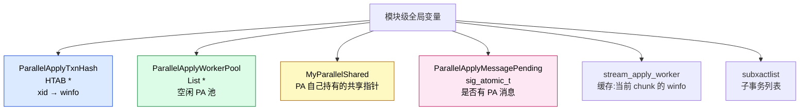
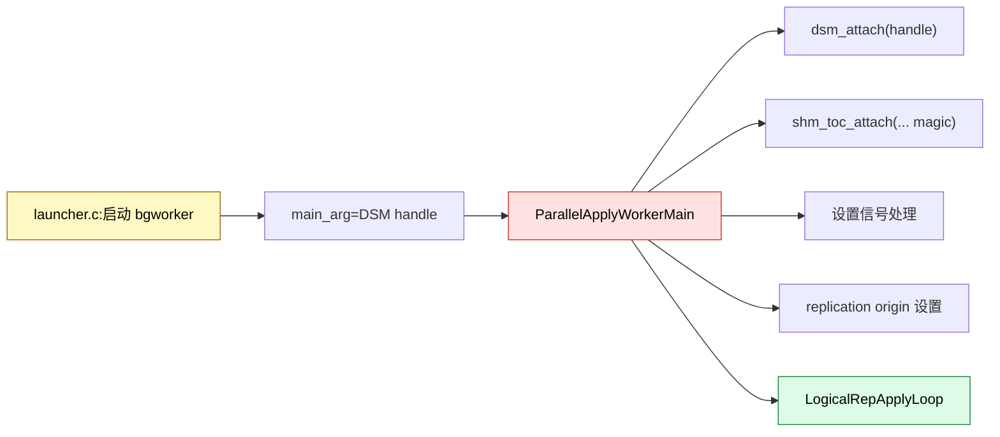
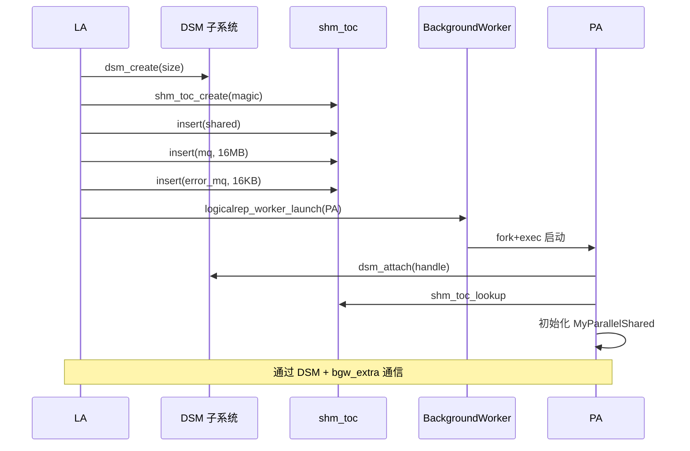
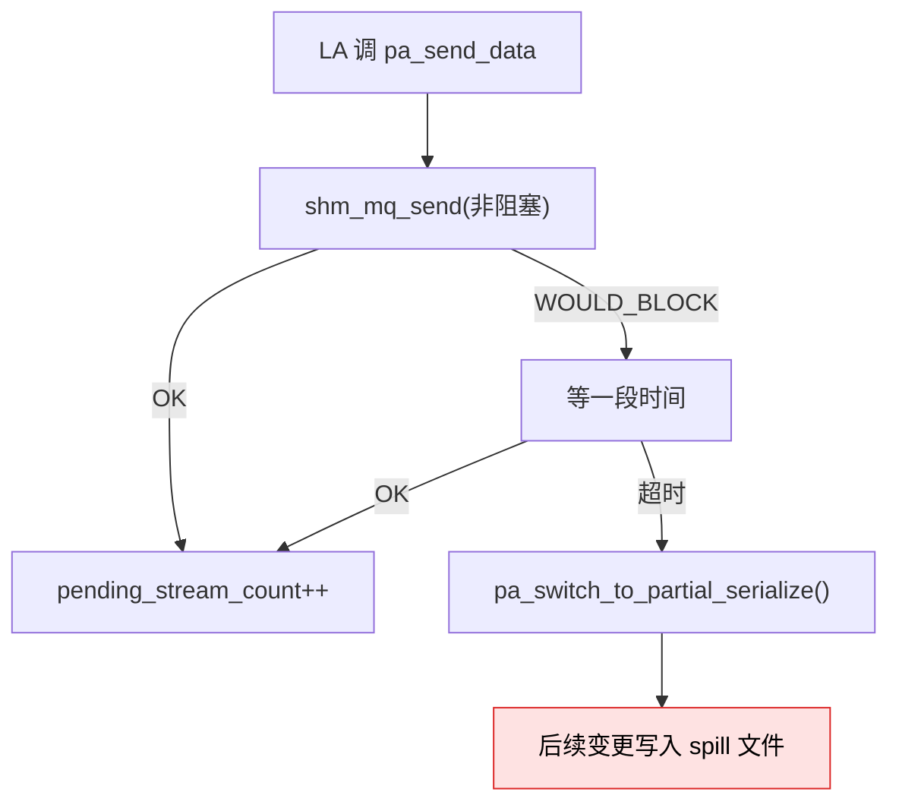
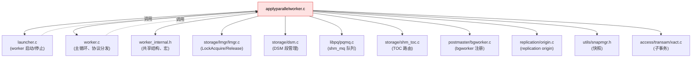
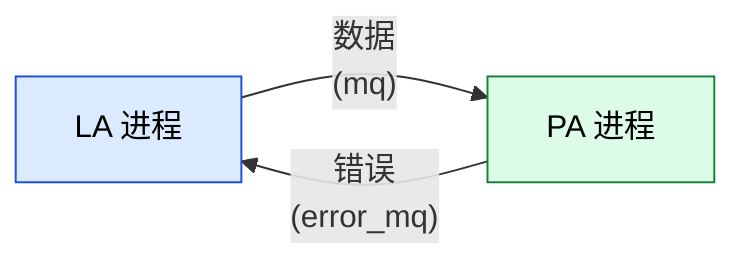

# applyparallelworker.c 源码深度解析:1646 行代码的完整结构与模块协作

> 配套源码:`~/cwork/postgresql`(基于 PG 18 主干)
>
> 配套前文:
> - [Apply Parallel Worker 运行机制](https://growdu.github.io/blog/db/postgresql/postgresql-apply-parallel-worker/)
> - [lock_stream 死锁防护机制](https://growdu.github.io/blog/db/postgresql/postgresql-apply-parallel-lock-stream/)
> - [Apply Parallel Worker 参数调优](https://growdu.github.io/blog/db/postgresql/postgresql-logical-replication-apply-parallel-tuning/)
>
> 本文聚焦 `src/backend/replication/logical/applyparallelworker.c` 这一个文件的 **完整结构**:
> - 4 个核心数据结构
> - 9 大类函数(按职责分类)
> - 与 worker.c / launcher.c / lmgr.c / DSM 子系统的依赖关系
> - 完整数据流时序图

---

## 一、文件总体定位

源码位置:`src/backend/replication/logical/applyparallelworker.c`(1646 行)。



**职责一句话**:实现 **PA worker 进程** 的入口、生命周期管理、共享内存通信、与 LA(leader apply)的协调。

**代码规模**:1646 行,在 logical replication 子系统中是中等规模。

---

## 二、文件结构划分

源码 `applyparallelworker.c` 顶部注释(150-160 行)揭示了文件骨架:



---

## 三、模块级宏定义

源码 `applyparallelworker.c:170-210`:

```c
// 共享内存 magic(用于校验)
#define PG_LOGICAL_APPLY_SHM_MAGIC 0x787ca067

// DSM keys(本模块专用)
#define PARALLEL_APPLY_KEY_SHARED       1   // ParallelApplyWorkerShared 结构
#define PARALLEL_APPLY_KEY_MQ           2   // 数据 shm_mq
#define PARALLEL_APPLY_KEY_ERROR_QUEUE  3   // 错误 shm_mq

// 队列大小
#define DSM_QUEUE_SIZE         (16 * 1024 * 1024)   // 16 MB
#define DSM_ERROR_QUEUE_SIZE   (16 * 1024)          // 16 KB

// 消息头大小(LsnPair + 时间)
#define SIZE_STATS_MESSAGE (2 * sizeof(XLogRecPtr) + sizeof(TimestampTz))

// 锁类型标识
#define PARALLEL_APPLY_LOCK_STREAM   0
#define PARALLEL_APPLY_LOCK_XACT     1
```

**关键设计决策**:

| 宏 | 含义 | 设计意图 |
|----|------|---------|
| `DSM_QUEUE_SIZE = 16MB` | 数据队列 | **够装大多数 stream chunk**,溢出才走 spill 文件 |
| `DSM_ERROR_QUEUE_SIZE = 16KB` | 错误队列 | **够发一个 ErrorResponse** 而不阻塞 |
| `PARALLEL_APPLY_KEY_*` | DSM key 1/2/3 | 不像 parallel query 要担心和 plan_node_id 冲突 |
| `PARALLEL_APPLY_LOCK_*` | 锁类型 0/1 | locktag_field4 区分两种 session lock |

---

## 四、4 个核心数据结构

### 4.1 `ParallelApplyWorkerShared`(DSM 中的共享数据)

源码 `src/include/replication/worker_internal.h:140-189`:



**逐字段解读**:

| 字段 | 类型 | 作用 | 访问者 |
|------|------|------|--------|
| `mutex` | `slock_t` | 保护其他字段 | LA + PA |
| `xid` | `TransactionId` | 当前 PA 处理的事务 | LA 写入,PA 读取 |
| `xact_state` | `ParallelTransState` | **commit 顺序保证** | PA 写入,LA 读取 |
| `logicalrep_worker_generation` | `uint16` | LA worker 槽的 generation | 防止 LA 重启后误用旧 slot |
| `logicalrep_worker_slot_no` | `int` | LA 的 worker slot 索引 | PA 标识自己的 LA |
| `pending_stream_count` | `pg_atomic_uint32` | 等多少 stream blocks | LA 增减,PA 查询 |
| `last_commit_end` | `XLogRecPtr` | PA 的 commit 结束位置 | PA 写入,LA 读取 |
| `fileset_state` | `PartialFileSetState` | spill 文件状态 | LA + PA |
| `fileset` | `FileSet` | 序列化变更的文件集合 | LA 写入,PA 读取 |

### 4.2 `ParallelApplyWorkerInfo`(LA 端管理)

源码 `worker_internal.h:194-219`(节选):

```c
typedef struct ParallelApplyWorkerInfo
{
    shm_mq_handle *mq_handle;          // 数据队列句柄
    shm_mq_handle *error_mq_handle;    // 错误队列句柄
    dsm_segment *dsm_seg;              // DSM 段指针
    bool serialize_changes;            // 是否需要 spill
    bool in_use;                       // 池中是否可用
    int slot_idx;                      // 缓存槽索引
    uint64 generation;                 // 缓存版本
    ParallelApplyWorkerShared *shared; // 共享数据指针
} ParallelApplyWorkerInfo;
```

**关键**:这个结构体只在 **LA 端**(parent process)有意义,PA 端不持有。

### 4.3 两个枚举:状态机

源码 `worker_internal.h:103-132`:

```c
typedef enum ParallelTransState
{
    PARALLEL_TRANS_UNKNOWN,    // 初始/未启动
    PARALLEL_TRANS_STARTED,    // PA 已开始处理
    PARALLEL_TRANS_FINISHED,   // PA 已完成
} ParallelTransState;

typedef enum PartialFileSetState
{
    FS_EMPTY,                  // 初始,无 spill 文件
    FS_SERIALIZE_IN_PROGRESS,  // LA 正在写 spill
    FS_SERIALIZE_DONE,         // LA 写完 spill
    FS_READY,                  // PA 可以读 spill
} PartialFileSetState;
```

**状态转换图**:



### 4.4 `ParallelApplyWorkerEntry`(哈希表)

源码 `applyparallelworker.c:215-219`:

```c
typedef struct ParallelApplyWorkerEntry
{
    TransactionId xid;            // 哈希键
    ParallelApplyWorkerInfo *winfo;
} ParallelApplyWorkerEntry;
```

---

## 五、模块级全局状态(7 个)

源码 `applyparallelworker.c:225-256`:



**逐个作用**:

| 变量 | 类型 | 作用 | 在哪里用 |
|------|------|------|---------|
| `ParallelApplyTxnHash` | `HTAB *` | xid → winfo 映射,O(1) 查找 PA | `pa_find_worker`、`pa_allocate_worker` |
| `ParallelApplyWorkerPool` | `List *` | 已结束 PA 的 winfo,供下次复用 | `pa_find_worker`、`pa_free_worker` |
| `MyParallelShared` | `ParallelApplyWorkerShared *` | **PA 端的关键指针**,指向自己 attach 的 DSM | `ParallelApplyWorkerMain` 入口初始化 |
| `ParallelApplyMessagePending` | `sig_atomic_t volatile` | 信号安全的标志位,LA 有未读消息 | 信号处理 + 主循环 poll |
| `stream_apply_worker` | `winfo *` | 缓存当前 chunk 的 winfo | `pa_set_stream_apply_worker`、`pa_find_worker` |
| `subxactlist` | `List *` | 当前事务的子事务记录 | `pa_start_subtrans`、`pa_reset_subtrans` |

---

## 六、9 大类函数全表

源码 `applyparallelworker.c`(全 1646 行)。下面按职责分类:

### 类别 1:DSM 与初始化(4 个)

| 函数 | 行 | 作用 |
|------|---|------|
| `pa_can_start()` | L264 | PA 是否可以启动(检查 LA 状态) |
| `pa_can_serialize_changes()` | L326 | 是否可以切换到 spill 模式 |
| `pa_launch_parallel_worker()` | L403 | LA 端:启动一个 PA 子进程 |
| `pa_setup_dsm()` | L327 | 创建 DSM 段 + 队列 + 共享结构 |

### 类别 2:Worker 分配与查找(4 个)

| 函数 | 行 | 作用 |
|------|---|------|
| `pa_allocate_worker()` | L469 | 为某个 xid 分配 PA(池里取 or 新建) |
| `pa_find_worker()` | L517 | 通过 xid 查找 PA winfo |
| `pa_free_worker()` | L555 | 释放 PA(返回池 or 销毁) |
| `pa_free_worker_info()` | L594 | 销毁 PA 的所有资源 |

### 类别 3:Worker 池管理(2 个)

| 函数 | 行 | 作用 |
|------|---|------|
| `pa_detach_all_error_mq()` | L621 | detach 所有 PA 的错误队列 |
| `pa_decr_and_wait_stream_block()` | L641 | 减少计数 + 等下一批 chunk(关键!用了 lock_stream 机制) |

### 类别 4:Spool/Serialize 文件管理(2 个)

| 函数 | 行 | 作用 |
|------|---|------|
| `pa_has_spooled_message_pending()` | L657 | 检查是否有 spool 文件待读 |
| `pa_process_spooled_messages_if_required()` | L711 | 从 spool 文件读取剩余变更 |

### 类别 5:主循环与消息处理(5 个)

| 函数 | 行 | 作用 |
|------|---|------|
| `ParallelApplyWorkerMain()` | L856 | **PA 进程入口** |
| `ParallelApplyWorkerHandleMessage()` | L995 | PA 处理从 shm_mq 来的消息 |
| `apply_handle_streamed_transaction()` | L1007 | PA 处理一个 stream 块 |
| `pa_fetch_stream_data()` | L1069 | LA 端:从 wire protocol 读 stream 块 |
| `pa_process_streamed_message()` | L1152 | 处理单条消息 |

### 类别 6:Stream 协议相关(8 个)

| 函数 | 行 | 作用 |
|------|---|------|
| `pa_switch_to_partial_serialize()` | L1217 | LA 切换到 spill 文件模式 |
| `pa_try_to_fetch_from_stream()` | L1250 | LA 试图从 shm_mq 拉数据 |
| `pa_wait_for_xact_finish()` | L1280 | LA 等 PA 完成事务 |
| `pa_xact_finish()` | L1313 | 处理事务 finish (commit/prepare/abort) |
| `pa_get_xact_state()` | L1325 | 读取共享 xact_state |
| `pa_set_xact_state()` | L1340 | 设置共享 xact_state |
| `pa_set_stream_apply_worker()` | L1354 | 缓存当前 chunk 的 winfo |
| `pa_stream_abort()` | L1368 | 处理 STREAM_ABORT |

### 类别 7:状态与子事务(3 个)

| 函数 | 行 | 作用 |
|------|---|------|
| `pa_start_subtrans()` | L1408 | 开始一个子事务 |
| `pa_reset_subtrans()` | L1422 | 重置子事务 |
| `pa_stream_abort_internal()` | L1504 | STREAM_ABORT 的实际工作 |

### 类别 8:Fileset 状态(2 个)

| 函数 | 行 | 作用 |
|------|---|------|
| `pa_get_fileset_state()` | L1524 | 读 fileset_state |
| `pa_set_fileset_state()` | L1534 | 写 fileset_state |

### 类别 9:Lock Helper(4 个)

| 函数 | 行 | 作用 |
|------|---|------|
| `pa_lock_stream()` | L1546 | stream 锁(用于死锁防护) |
| `pa_unlock_stream()` | L1553 | 释放 stream 锁 |
| `pa_lock_transaction()` | L1579 | xact 锁(用于 commit 顺序) |
| `pa_unlock_transaction()` | L1586 | 释放 xact 锁 |

---

## 七、关键函数详解

### 7.1 `ParallelApplyWorkerMain`——PA 进程入口

源码 `applyparallelworker.c:856`(节选):

```c
void
ParallelApplyWorkerMain(Datum main_arg)
{
    ParallelApplyWorkerShared *shared;
    dsm_handle handle;
    dsm_segment *seg;
    shm_toc    *toc;
    shm_mq    *mq;
    shm_mq_handle *mqh;
    shm_mq_handle *error_mqh;
    RepOriginId originid;
    int worker_slot = DatumGetInt32(main_arg);
    char originname[NAMEDATALEN];

    InitializingApplyWorker = true;

    /* 信号处理 */
    pqsignal(SIGHUP, SignalHandlerForConfigReload);
    pqsignal(SIGTERM, die);
    pqsignal(SIGUSR2, SignalHandlerForShutdownRequest);  // LA 用的优雅退出信号
    BackgroundWorkerUnblockSignals();

    /* attach 到 LA 创建的 DSM */
    handle = dsm_segment_handle(main_arg);
    seg = dsm_attach(handle);
    toc = shm_toc_attach(PG_LOGICAL_APPLY_SHM_MAGIC, dsm_segment_address(seg), ...);

    /* 找 3 个对象:shared / mq / error_mq */
    shared = shm_toc_lookup(toc, PARALLEL_APPLY_KEY_SHARED, false);
    MyParallelShared = shared;

    mq = shm_toc_lookup(toc, PARALLEL_APPLY_KEY_MQ, false);
    shm_mq_set_receiver(mq, MyProc);
    mqh = shm_mq_attach(mq, dsm_segment_address(seg), NULL);

    /* attach 错误队列(发送端) */
    error_mqh = ...;  // 反向

    /* 设置 replication origin */
    ReplicationOriginNameForLogicalRep(subid, InvalidOid, originname, sizeof(originname));
    originid = replorigin_by_name(originname, true);

    /* 内存上下文初始化 */
    ApplyContext = AllocSetContextCreate(...);
    ApplyMessageContext = AllocSetContextCreate(...);

    /* 主循环 */
    InitializingApplyWorker = false;
    MyLogicalRepWorker = &worker;
    worker.type = WORKERTYPE_PARALLEL_APPLY;
    worker.parallel_apply = true;

    LogicalRepApplyLoop();

    /* cleanup */
    ...
}
```

**关键调用链**:



### 7.2 `pa_launch_parallel_worker`——LA 启动 PA

源码 `applyparallelworker.c:403`(核心逻辑):

```c
static ParallelApplyWorkerInfo *
pa_launch_parallel_worker(void)
{
    ParallelApplyWorkerInfo *winfo;
    dsm_segment *seg;
    char *seg_address;
    shm_toc *toc;
    ...
    BackgroundWorker bgw;

    /* 1. 创建 DSM 段 */
    seg = dsm_create(sizeof(ParallelApplyWorkerShared) + ...);
    seg_address = dsm_segment_address(seg);

    /* 2. 创建 TOC(table of contents) */
    toc = shm_toc_create(PG_LOGICAL_APPLY_SHM_MAGIC, seg_address, ...);

    /* 3. 分配 shared 结构 */
    ParallelApplyWorkerShared *shared = ...;
    SpinLockInit(&shared->mutex);
    shm_toc_insert(toc, PARALLEL_APPLY_KEY_SHARED, shared);

    /* 4. 创建数据 shm_mq */
    mq = shm_mq_create(seg_address, DSM_QUEUE_SIZE);
    shm_toc_insert(toc, PARALLEL_APPLY_KEY_MQ, mq);

    /* 5. 创建错误 shm_mq(反向) */
    error_mq = shm_mq_create(seg_address, DSM_ERROR_QUEUE_SIZE);
    shm_toc_insert(toc, PARALLEL_APPLY_KEY_ERROR_QUEUE, error_mq);

    /* 6. 启动 bgworker */
    bgw.bgw_main = NULL;  // 由 bgw_function_name 决定
    snprintf(bgw.bgw_function_name, ..., "ParallelApplyWorkerMain");
    bgw.bgw_main_arg = Int32GetDatum(dsm_segment_handle(seg));
    strcpy(bgw.bgw_type, "logical replication parallel worker");
    strcpy(bgw.bgw_library_name, "postgres");
    memcpy(bgw.bgw_extra, &dsm_segment_handle(seg), sizeof(dsm_handle));

    launched = logicalrep_worker_launch(WORKERTYPE_PARALLEL_APPLY, ...);

    /* 7. 注册到池中 */
    if (launched)
        ParallelApplyWorkerPool = lappend(ParallelApplyWorkerPool, winfo);

    return winfo;
}
```

**关键流程图**:



### 7.3 `pa_send_data`——LA 发送 stream chunk

源码 `applyparallelworker.c`(核心逻辑):

```c
bool
pa_send_data(ParallelApplyWorkerInfo *winfo, Size nbytes, const void *data)
{
    /* 非阻塞发送 */
    shm_mq_result res = shm_mq_send(winfo->mq_handle, nbytes, data, false);

    switch (res) {
        case SHM_MQ_SUCCESS:
            pg_atomic_write_u32(&winfo->shared->pending_stream_count, ...);
            return true;

        case SHM_MQ_WOULD_BLOCK:
            /* 队列满,等一小段时间 */
            pg_usleep(1000);

            if (超时) {
                /* 切换到 spill 模式 */
                pa_switch_to_partial_serialize(winfo, false);
            }
            return false;
    }
}
```

**两种模式**:



### 7.4 `pa_decr_and_wait_stream_block`——PA 等下一批

源码 `applyparallelworker.c:1597`(这是 `lock_stream` 机制的核心):

```c
void
pa_decr_and_wait_stream_block(void)
{
    Assert(am_parallel_apply_worker());

    if (pg_atomic_read_u32(&MyParallelShared->pending_stream_count) == 0)
    {
        if (pa_has_spooled_message_pending())
            return;
        elog(ERROR, "invalid pending streaming chunk 0");
    }

    if (pg_atomic_sub_fetch_u32(&MyParallelShared->pending_stream_count, 1) == 0)
    {
        pa_lock_stream(MyParallelShared->xid, AccessShareLock);
        pa_unlock_stream(MyParallelShared->xid, AccessShareLock);
    }
}
```

**关键**:这一步会在 lmgr 中插入 PA → LA 的等待边(详见 `lock_stream` 文档)。

### 7.5 `pa_wait_for_xact_finish`——LA 等 PA 完成事务

源码 `applyparallelworker.c:1280`:

```c
static void
pa_wait_for_xact_finish(ParallelApplyWorkerInfo *winfo)
{
    /* 1. 等 PA 拿到 XACT lock(PARALLEL_TRANS_STARTED) */
    pa_wait_for_xact_state(winfo, PARALLEL_TRANS_STARTED);

    /* 2. 等 PA 释放 XACT lock(AccessShare 拿到立刻放) */
    pa_lock_transaction(winfo->shared->xid, AccessShareLock);
    pa_unlock_transaction(winfo->shared->xid, AccessShareLock);

    /* 3. 检查 PA 状态 */
    if (pa_get_xact_state(winfo->shared) != PARALLEL_TRANS_FINISHED)
        ereport(ERROR, ...);
}
```

**这是 `xact lock` 机制的核心**,与 `lock_stream` 配对使用。

---

## 八、与其他模块的依赖关系

### 8.1 依赖图



### 8.2 `worker.c` 的调用点

源码 `worker.c` 引用 `applyparallelworker.c` 的 30+ 个位置(按重要性):

| `worker.c` 行 | 调用的 pa_* 函数 | 作用 |
|--------------|------------------|------|
| L408 | `pa_allocate_worker` | 为 xid 分配 PA |
| L555 | `pa_find_worker` | 找处理当前 xid 的 PA |
| L1283 | `pa_find_worker` | STREAM_START 路径 |
| L1551 | `pa_unlock_stream` | STREAM_STOP 前释放 |
| L1592 | `pa_lock_transaction` | LA 等 PA commit |
| L1670 | `pa_lock_stream` | 拿 stream lock |
| L1718 | `pa_decr_and_wait_stream_block` | 处理完一批等下一批 |
| L1891 | `pa_unlock_stream` | STREAM_ABORT |
| L1893 | `pa_lock_stream` | STREAM_ABORT |
| L1969 | `pa_decr_and_wait_stream_block` | 同步路径 |
| L2152 | `pa_find_worker` | 路由决策 |
| L2234 | `pa_unlock_transaction` | 处理 xact finish |
| L2231 | `pa_wait_for_xact_finish` | 阻塞等 PA 完成 |

### 8.3 `launcher.c` 的关键集成点

源码 `launcher.c:486`(PA 的 bgworker 入口):

```c
case WORKERTYPE_PARALLEL_APPLY:
    snprintf(bgw.bgw_function_name, BGW_MAXLEN, "ParallelApplyWorkerMain");
    snprintf(bgw.bgw_name, BGW_MAXLEN,
             "logical replication parallel apply worker for subscription %u", subid);
    snprintf(bgw.bgw_type, BGW_MAXLEN, "logical replication parallel worker");
    memcpy(bgw.bgw_extra, &subworker_dsm, sizeof(dsm_handle));
    break;
```

源码 `launcher.c:421-422`(并发限制):

```c
if (is_parallel_apply_worker &&
    nparallelapplyworkers >= max_parallel_apply_workers_per_subscription)
    continue;  // 超过上限,跳过启动
```

源码 `launcher.c:643`(PA 停止):

```c
void
logicalrep_pa_worker_stop(ParallelApplyWorkerInfo *winfo)
{
    logicalrep_worker_stop(MySubscription->oid, MyLogicalRepWorker->relid);
}
```

### 8.4 共享头文件

源码 `worker_internal.h` 声明的所有 `pa_*` 函数原型:

```c
// 分配 / 查找
extern void pa_allocate_worker(TransactionId xid);
extern ParallelApplyWorkerInfo *pa_find_worker(TransactionId xid);
extern void pa_detach_all_error_mq(void);

// 数据发送
extern bool pa_send_data(ParallelApplyWorkerInfo *winfo, Size nbytes, const void *data);
extern void pa_switch_to_partial_serialize(ParallelApplyWorkerInfo *winfo, bool stream_locked);

// 状态设置
extern void pa_set_xact_state(ParallelApplyWorkerShared *wshared, ParallelTransState xact_state);
extern void pa_set_stream_apply_worker(ParallelApplyWorkerInfo *winfo);

// 子事务
extern void pa_start_subtrans(TransactionId current_xid, TransactionId top_xid);
extern void pa_reset_subtrans(void);

// Stream 协议
extern void pa_stream_abort(LogicalRepStreamAbortData *abort_data);
extern void pa_set_fileset_state(ParallelApplyWorkerShared *wshared, PartialFileSetState fileset_state);

// 锁
extern void pa_lock_stream(TransactionId xid, LOCKMODE lockmode);
extern void pa_unlock_stream(TransactionId xid, LOCKMODE lockmode);
extern void pa_lock_transaction(TransactionId xid, LOCKMODE lockmode);
extern void pa_unlock_transaction(TransactionId xid, LOCKMODE lockmode);

// 事务 finish
extern void pa_xact_finish(ParallelApplyWorkerInfo *winfo, XLogRecPtr remote_lsn);
```

### 8.5 PA / LA 的代码分支判断

源码 `worker_internal.h:329-352`(关键宏):

```c
#define isParallelApplyWorker(worker)     ((worker)->in_use && (worker)->type == WORKERTYPE_PARALLEL_APPLY)

#define isApplyWorker(worker)     ((worker)->in_use && (worker)->type == WORKERTYPE_APPLY)

#define isTablesyncWorker(worker)     ((worker)->in_use && (worker)->type == WORKERTYPE_TABLESYNC)

static inline bool am_leader_apply_worker(void)
{
    Assert(MyLogicalRepWorker->in_use);
    return (MyLogicalRepWorker->type == WORKERTYPE_APPLY);
}

static inline bool am_parallel_apply_worker(void)
{
    Assert(MyLogicalRepWorker->in_use);
    return isParallelApplyWorker(MyLogicalRepWorker);
}
```

**在 `worker.c` 中的使用**(节选):

```c
// worker.c:3540
if (am_parallel_apply_worker())
    pa_xact_finish(...);

// worker.c:4782
Assert(am_tablesync_worker() || am_leader_apply_worker());
// 关键断言:某些函数只在 LA 或 tablesync 中调用

// worker.c:3948
if (am_leader_apply_worker())
    ...   // LA 专属逻辑

// worker.c:4033
if (am_parallel_apply_worker())
    ...   // PA 专属逻辑
```

---

## 九、完整数据流时序图

一个典型的大事务从 publisher 发送,经发布端、协议层、LA 路由、PA apply,到 commit 完成的全过程:

```mermaid
sequenceDiagram
    autonumber
    participant Pub as Publisher<br/>事务发起
    participant RB as Reorder Buffer<br/>发布端
    participant WAL as WAL Sender
    participant Wire as 网络/wire
    participant LA as Leader Apply<br/>(worker.c)
    participant PA as Parallel Apply<br/>(applyparallelworker.c)
    participant DB as 订阅端 DB

    Pub->>RB: BEGIN; INSERT ... x N
    Note over RB: 超 logical_decoding_work_mem<br/>触发 stream
    RB->>WAL: STREAM_START
    WAL->>Wire: 发送
    Wire->>LA: 收到 STREAM_START

    LA->>LA: apply_handle_stream_start()
    LA->>LA: pa_lock_stream(xid, Exclusive)  -- [1]
    LA->>LA: get_transaction_apply_action()
    LA->>LA: pa_allocate_worker(xid)  -- [2]
    Note over LA: 在池中找空闲 PA,<br/>或启动新 PA
    LA->>PA: bgworker fork
    PA->>PA: ParallelApplyWorkerMain()
    PA->>PA: dsm_attach + shm_toc_lookup
    Note over PA: 设置 MyParallelShared

    LA->>LA: pa_unlock_stream(xid, Exclusive)  -- [3]
    PA->>PA: pa_lock_stream(xid, Share)  -- [4]
    PA->>PA: pa_unlock_stream(xid, Share)    -- [5]

    loop 每个 stream chunk
        LA->>LA: pa_send_data(winfo, msg)  -- [6]
        LA->>PA: shm_mq 发送 INSERT/UPDATE
        PA->>PA: shm_mq 接收
        PA->>PA: apply_handle_insert/update/delete
        PA->>DB: SQL 执行
        PA->>LA: shm_mq 反向(可选错误)
        LA->>LA: 轮询错误队列
    end

    Note over PA: pa_decr_and_wait_stream_block()
    PA->>LA: lock_stream(xid, Share)  -- [7]
    Note over LA,PA: 形成 PA → LA 的等待边

    LA->>LA: STREAM_STOP
    LA->>LA: pa_lock_stream(xid, Exclusive)
    PA->>PA: pa_lock_stream(xid, Share)
    Note over LA,PA: lmgr wait-for 图检测死锁

    Pub->>RB: COMMIT
    LA->>LA: apply_handle_stream_commit()
    LA->>LA: pa_lock_transaction(xid, Share)  -- [8]
    LA->>LA: pa_wait_for_xact_finish()
    PA->>PA: pa_set_xact_state(FINISHED)
    PA->>PA: pa_unlock_transaction(xid, Exclusive)
    LA->>PA: shm_mq 发送 STREAM_COMMIT
    PA->>DB: COMMIT
    LA->>LA: 更新 origin LSN
    LA->>LA: pa_free_worker()  -- [9]
    Note over LA: winfo 进入 worker池
```

**关键调用标注对照表**:

| 标注 | 位置 | 作用 |
|------|------|------|
| [1] | worker.c | LA 在 STREAM_START 路径前拿 Exclusive |
| [2] | applyparallelworker.c:469 | 分配 PA(从池或新建) |
| [3] | applyparallelworker.c:1546 | LA 释放 Exclusive,PA 可以拿 Share |
| [4][5] | applyparallelworker.c:1597 | PA 锁立即释放,形成等待边 |
| [6] | applyparallelworker.c | 数据通过 shm_mq 传递 |
| [7] | applyparallelworker.c:1597 | PA 等下一批,lock_stream 路径 |
| [8] | applyparallelworker.c:1280 | LA 等 PA 完成(commit 顺序) |
| [9] | applyparallelworker.c:555 | PA 释放,可能进 worker pool |

---

## 十、关键设计洞察

### 10.1 为什么用独立 DSM(每 PA 一个)

源码注释(`applyparallelworker.c:30-50`):

> "The leader apply worker will create a separate dynamic shared memory segment when each parallel apply worker starts. The reason for this design is that we cannot predict how many workers will be needed. It may be possible to allocate enough shared memory in one segment based on the maximum number of parallel apply workers (max_parallel_apply_workers_per_subscription), but this would waste memory if no process is actually started."

**理由**:

- 不预分配 → **不浪费**
- 按需分配 → **更灵活**
- 单一 shm_toc 路由 → **清晰**

### 10.2 两个 shm_mq 的精妙



| 队列 | 方向 | 大小 | 设计意图 |
|------|------|------|---------|
| `mq` | LA → PA | 16MB | **装大多数 chunk**,溢出才 spill |
| `error_mq` | PA → LA | 16KB | **够发 ErrorResponse**,PA 出错立刻退出不阻塞 |

### 10.3 Worker Pool 的阈值

源码 `applyparallelworker.c:578-582`:

```c
if (winfo->serialize_changes ||
    list_length(ParallelApplyWorkerPool) >
    (max_parallel_apply_workers_per_subscription / 2))
{
    logicalrep_pa_worker_stop(winfo);
    pa_free_worker_info(winfo);
    return;
}
```

**关键洞察**:池上限是 **GUC/2**——**不是 GUC**!源码注释说未来可能开放 GUC。

### 10.4 `serialize_changes` 标志的语义

源码 `worker_internal.h:204-208`:

```c
/*
 * Indicates whether the leader apply worker needs to serialize the
 * remaining changes to a file due to timeout when attempting to send data
 * to the parallel apply worker via shared memory.
 */
bool serialize_changes;
```

**为 true 时**:
- PA 处理完后,**不进入 worker pool**(直接销毁)
- 避免新的事务复用 PA 后,又遇到同样问题
- 强制 LA 下一个事务切回串行 apply 或重新分配 PA

---

## 十一、源码速查

### 11.1 文件级速查

| 关注点 | 文件 | 行/函数 |
|--------|------|---------|
| **完整注释(必读)** | `applyparallelworker.c` | **L25-160** |
| `ParallelApplyWorkerShared` 结构 | `worker_internal.h` | L140-189 |
| `ParallelApplyWorkerInfo` 结构 | `worker_internal.h` | L194-219 |
| `ParallelTransState` 枚举 | `worker_internal.h` | L103-107 |
| `PartialFileSetState` 枚举 | `worker_internal.h` | L126-132 |
| 头文件 / 宏定义 | `applyparallelworker.c` | L150-210 |
| `ParallelApplyWorkerEntry` | `applyparallelworker.c` | L215-219 |
| 模块级状态变量 | `applyparallelworker.c` | L225-256 |
| 静态函数声明 | `applyparallelworker.c` | L257-262 |
| `pa_can_start` | `applyparallelworker.c` | L264 |
| `pa_setup_dsm` | `applyparallelworker.c` | L327 |
| `pa_launch_parallel_worker` | `applyparallelworker.c` | L403 |
| `pa_allocate_worker` | `applyparallelworker.c` | L469 |
| `pa_find_worker` | `applyparallelworker.c` | L517 |
| `pa_free_worker` | `applyparallelworker.c` | L555 |
| `pa_free_worker_info` | `applyparallelworker.c` | L594 |
| `pa_detach_all_error_mq` | `applyparallelworker.c` | L621 |
| `pa_decr_and_wait_stream_block` | `applyparallelworker.c` | L641 |
| `pa_has_spooled_message_pending` | `applyparallelworker.c` | L657 |
| `pa_process_spooled_messages_if_required` | `applyparallelworker.c` | L711 |
| `ParallelApplyWorkerMain` | `applyparallelworker.c` | L856 |
| `ParallelApplyWorkerHandleMessage` | `applyparallelworker.c` | L995 |
| `apply_handle_streamed_transaction` | `applyparallelworker.c` | L1007 |
| `pa_fetch_stream_data` | `applyparallelworker.c` | L1069 |
| `pa_process_streamed_message` | `applyparallelworker.c` | L1152 |
| `pa_switch_to_partial_serialize` | `applyparallelworker.c` | L1217 |
| `pa_try_to_fetch_from_stream` | `applyparallelworker.c` | L1250 |
| `pa_wait_for_xact_finish` | `applyparallelworker.c` | L1280 |
| `pa_xact_finish` | `applyparallelworker.c` | L1313 |
| `pa_get_xact_state` | `applyparallelworker.c` | L1325 |
| `pa_set_xact_state` | `applyparallelworker.c` | L1340 |
| `pa_set_stream_apply_worker` | `applyparallelworker.c` | L1354 |
| `pa_stream_abort` | `applyparallelworker.c` | L1368 |
| `pa_start_subtrans` | `applyparallelworker.c` | L1408 |
| `pa_reset_subtrans` | `applyparallelworker.c` | L1422 |
| `pa_get_fileset_state` | `applyparallelworker.c` | L1524 |
| `pa_set_fileset_state` | `applyparallelworker.c` | L1534 |
| `pa_lock_stream` | `applyparallelworker.c` | L1546 |
| `pa_unlock_stream` | `applyparallelworker.c` | L1553 |
| `pa_lock_transaction` | `applyparallelworker.c` | L1579 |
| `pa_unlock_transaction` | `applyparallelworker.c` | L1586 |

### 11.2 外部调用速查

| 调用者 | 位置 | 调用内容 |
|--------|------|---------|
| `worker.c` | L408, L555, L1283, L1487, L1645, L1834, L2152 | `pa_find_worker`、`pa_allocate_worker` |
| `worker.c` | L1551, L1891, L2234 | `pa_unlock_stream`、`pa_unlock_transaction` |
| `worker.c` | L1592, L1670 | `pa_lock_stream`、`pa_lock_transaction` |
| `worker.c` | L1718, L1969 | `pa_decr_and_wait_stream_block` |
| `worker.c` | L2231 | `pa_wait_for_xact_finish` |
| `launcher.c` | L486 | bgworker 入口设置 |
| `launcher.c` | L421-422 | PA 并发数限制 |
| `launcher.c` | L643 | `logicalrep_pa_worker_stop` |

### 11.3 关键依赖模块

| 依赖 | 用途 |
|------|------|
| `storage/dsm.c` | 动态共享内存 |
| `storage/shm_toc.c` | 共享内存目录(TOC) |
| `storage/lmgr/lmgr.c` | Lock Manager |
| `storage/lmgr/lock.c` | 锁实现 |
| `libpq/pqmq.c` | shm_mq 队列 |
| `postmaster/bgworker.c` | 后台 worker 注册 |
| `replication/origin.c` | replication origin |
| `storage/file/fileset.c` | 文件集合(spill) |

---

## 十二、参考

- 配套前文:
  - [PostgreSQL 18 Apply Parallel Worker 运行机制](https://growdu.github.io/blog/db/postgresql/postgresql-apply-parallel-worker/)
  - [Apply Parallel Worker lock_stream 死锁防护机制](https://growdu.github.io/blog/db/postgresql/postgresql-apply-parallel-lock-stream/)
  - [Apply Parallel Worker 参数调优实战](https://growdu.github.io/blog/db/postgresql/postgresql-logical-replication-apply-parallel-tuning/)
- PG 源码:`~/cwork/postgresql`
- 关键文件:
  - `src/backend/replication/logical/applyparallelworker.c` (1646 行)
  - `src/backend/replication/logical/worker.c` (5239 行)
  - `src/backend/replication/logical/launcher.c` (1394 行)
  - `src/include/replication/worker_internal.h` (354 行)
