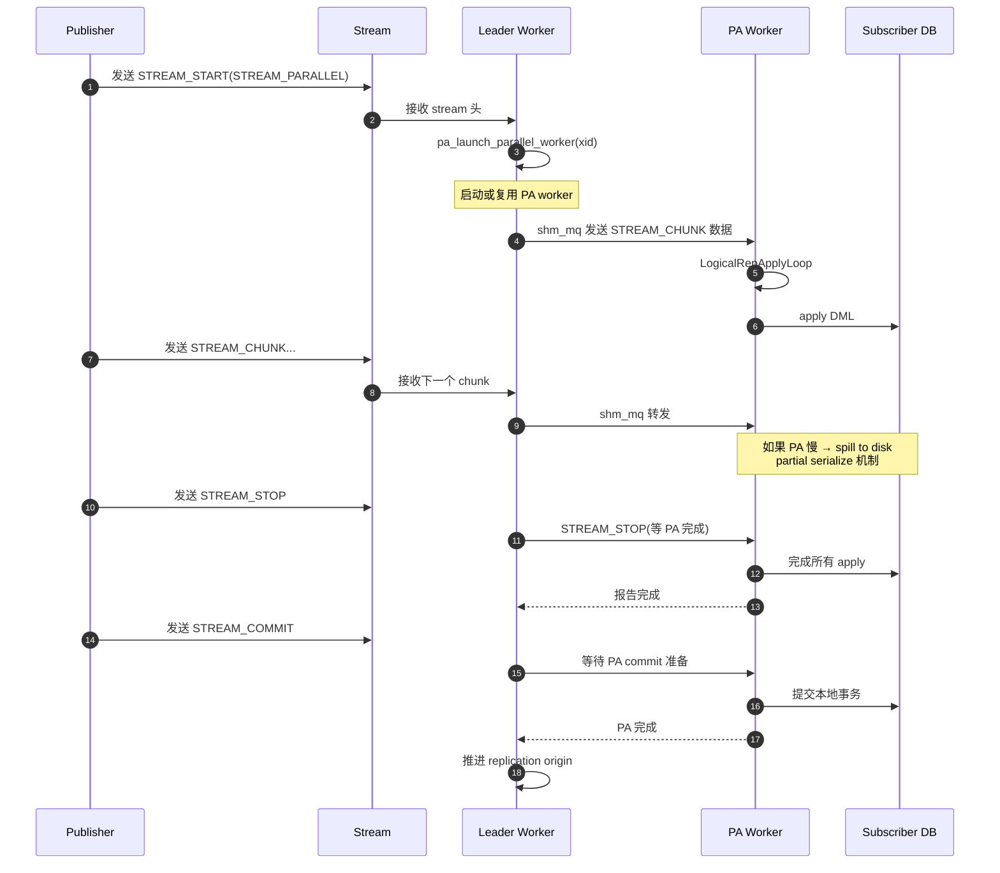
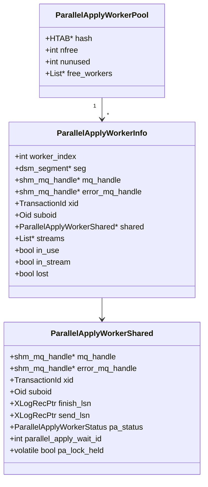
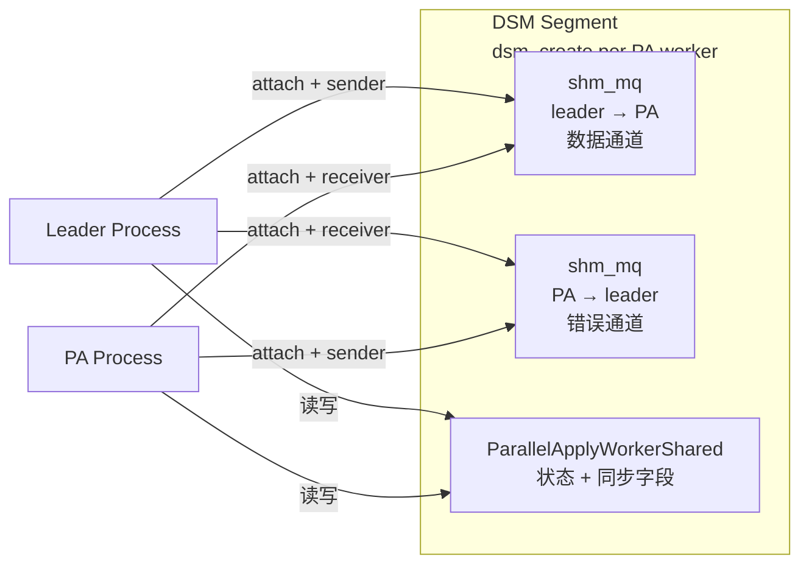
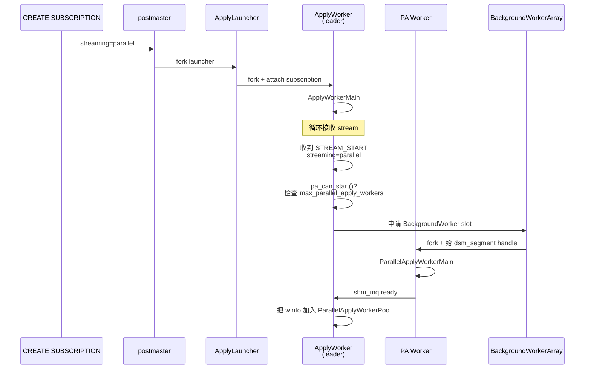
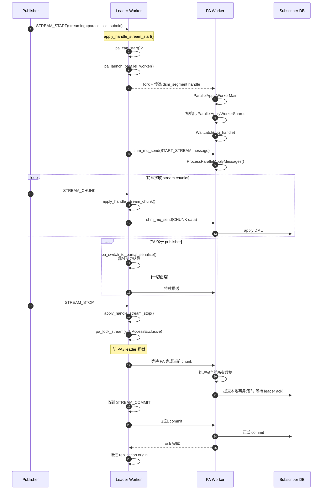
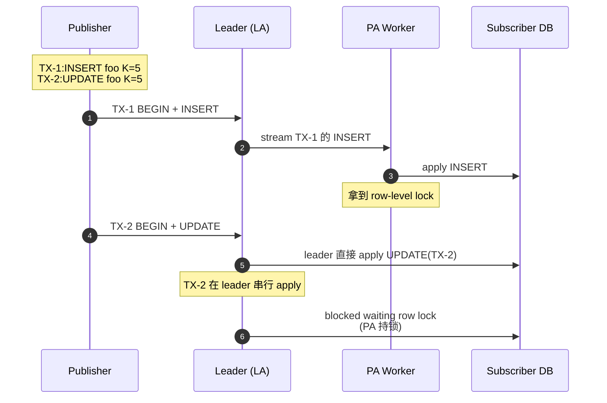
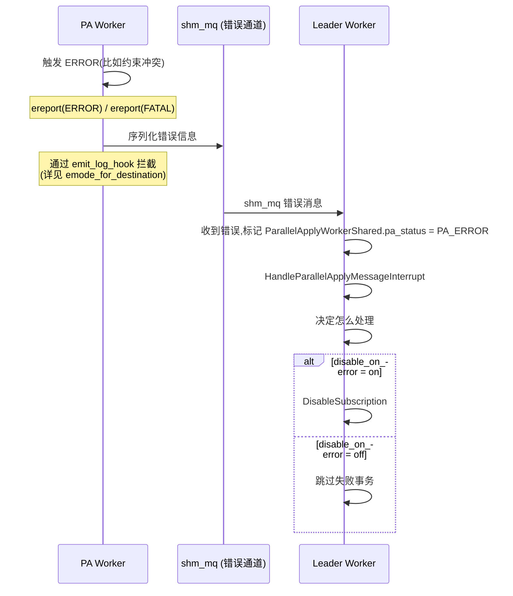

# PostgreSQL 逻辑复制 Apply Parallel Worker 运行机制深度解析

> **源码基线**:PostgreSQL 18(`src/backend/replication/logical/{applyparallelworker,worker,launcher}.c`)
> **读者**:PG 内核开发者、DBA、需要深入理解 streaming=parallel 行为的工程师

## 一、什么是 Apply Parallel Worker

PG 16 引入的 `streaming=parallel` 选项允许**单个大事务**在 apply 阶段被切分为多个 stream,**并行**地由多个 worker 进程同时处理,极大加速大事务的同步延迟。

### 1.1 跟"普通 apply"对比

| 维度 | 普通 apply | apply parallel worker |
| --- | --- | --- |
| **并行粒度** | 无(单事务串行) | 单事务内多 stream |
| **进程模型** | 1 个 apply worker | 1 leader + N parallel worker |
| **数据流** | leader 直接 apply | leader 转发 stream 给 parallel worker |
| **触发条件** | 默认 | `streaming=parallel` |
| **commit 顺序** | 自然 | 必须按 publisher commit LSN 顺序 |
| **死锁风险** | 低 | 中(并发 apply 不同 stream) |

### 1.2 解决什么问题

```mermaid
flowchart LR
    A[publisher 大事务<br/>10 万条 INSERT]::: root --> B[WAL stream]
    B --> C[leader apply worker<br/>串行 apply]::: cold
    C --> D[订阅端延迟 30min]
    E[publisher 大事务]::: root --> F[WAL stream]
    F --> G[leader 切分 stream]
    G --> H[PA worker 1]
    G --> I[PA worker 2]
    G --> J[PA worker N]
    H --> K[并行 apply]::: hot
    I --> K
    J --> K
    K --> L[订阅端延迟 3min]
    classDef root fill:#dcfce7,stroke:#15803d
    classDef hot fill:#fee2e2,stroke:#dc2626
    classDef cold fill:#e5e7eb,stroke:#6b7280
```

**核心收益**:大事务 apply 延迟从 O(N) 降到 O(N / parallel_workers)。

### 1.3 重要的边界

- **不是事务间并行**:并行粒度是"单事务内多 stream",**不同事务之间仍串行**
- **必须保持 commit 顺序**:即使 PA worker 并行 apply stream,**最终 commit 必须按 publisher commit LSN 顺序**
- **publisher/subscriber schema 可能不一致**:publisher 没有唯一键,subscriber 有 → 可能产生依赖关系导致冲突

## 二、整体架构

### 2.1 三个角色

```mermaid
flowchart TB
    subgraph Pub[Publisher 端]
        WAL[WAL 流]::: pub
    end

    subgraph Sub[Subscriber 端]
        Net[流复制协议]
        AL[Apply Launcher<br/>bgworker]::: sub
        Leader[Apply Worker<br/>leader]::: sub
        PA1[PA Worker 1]::: pa
        PA2[PA Worker 2]::: pa
        PA3[PA Worker N]::: pa
    end

    DB[(Subscriber DB)]::: db

    WAL --> Net --> AL --> Leader
    Leader -->|shm_mq 数据通道| PA1
    Leader -->|shm_mq 数据通道| PA2
    Leader -->|shm_mq 数据通道| PA3
    Leader -->|shm_mq 错误通道| Leader
    PA1 -->|apply SQL| DB
    PA2 -->|apply SQL| DB
    PA3 -->|apply SQL| DB
    PA1 -.->|lmgr 锁| Leader
    PA2 -.->|lmgr 锁| Leader
    PA3 -.->|lmgr 锁| Leader

    classDef pub fill:#dcfce7,stroke:#15803d
    classDef sub fill:#dbeafe,stroke:#1d4ed8
    classDef pa fill:#fef9c3,stroke:#a16207
    classDef db fill:#fce7f3,stroke:#be185d
```

### 2.2 角色职责

| 角色 | 进程类型 | 职责 | 源码入口 |
| --- | --- | --- | --- |
| **Apply Launcher** | bgworker | 启动/管理 apply worker | `launcher.c::ApplyLauncherMain` |
| **Apply Worker(leader)** | bgworker | 接收 WAL stream,管理 PA worker,推进 origin | `worker.c::ApplyWorkerMain` |
| **Parallel Apply Worker** | bgworker | 处理单个 stream 块,apply DML | `applyparallelworker.c::ParallelApplyWorkerMain` |

### 2.3 数据流



## 三、核心数据结构

### 3.1 三个核心结构



### 3.2 关键结构定义(源码引用)

#### ParallelApplyWorkerShared(共享段内,所有进程可见)

```c
/* src/include/replication/worker_internal.h */
typedef struct ParallelApplyWorkerShared {
    slock_t        mutex;          /* 保护下面的状态字段 */
    ParallelApplyWorkerStatus pa_status;

    TransactionId  xid;            /* PA 正在处理的事务 */
    Oid            suboid;         /* subscription OID */
    XLogRecPtr     finish_lsn;     /* 该事务的 finish LSN */
    XLogRecPtr     send_lsn;       /* 该事务的 send LSN(用于支持 partial serialize) */

    shm_mq_handle *mq_handle;     /* leader → PA 数据通道 */
    shm_mq_handle *error_mq_handle;/* PA → leader 错误通道 */
    int            parallel_apply_wait_id;  /* lmgr 等待 ID */
    volatile bool  pa_lock_held;   /* PA 是否持有流锁 */
} ParallelApplyWorkerShared;
```

#### ParallelApplyWorkerInfo(leader 进程本地)

```c
typedef struct ParallelApplyWorkerInfo {
    int           worker_index;    /* 在 LogicalRepWorker 数组中的索引 */
    dsm_segment  *seg;             /* 共享内存段 */
    shm_mq_handle *mq_handle;      /* 指向 shared.mq_handle */
    shm_mq_handle *error_mq_handle;/* 指向 shared.error_mq_handle */

    TransactionId xid;
    Oid           suboid;
    ParallelApplyWorkerShared *shared;

    List         *streams;         /* 该 worker 处理的 stream 列表 */
    bool          in_use;
    bool          in_stream;
    bool          lost;            /* 异常退出标记 */
} ParallelApplyWorkerInfo;
```

#### ParallelApplyWorkerPool(PA worker 池)

```c
/* applyparallelworker.c */
static HTAB *ParallelApplyWorkerPool = NULL;  /* 全局 hash,key = xid */
static int  parallel_apply_worker_nfree = 0;   /* 空闲 worker 数 */
static int  parallel_apply_worker_nunused = 0; /* 未使用 worker 数 */
```

> 💡 **注意**:`ParallelApplyWorkerPool` 是 **leader apply worker 进程内的全局变量**,不在共享内存里。

### 3.3 DSM Segment + shm_mq



**关键点**:
- 每启动一个 PA worker,**单独** `dsm_create` 一个段(不用一个大段分给所有人,避免浪费)
- 段大小 = `pa_setup_dsm_size()` 计算
- 段 handle 通过 `BackgroundWorkerArray` 传给 PA 子进程

## 四、启动流程

### 4.1 启动顺序



### 4.2 关键函数:`pa_launch_parallel_worker`

```c
/* src/backend/replication/logical/worker.c */
static bool
pa_launch_parallel_worker(TransactionId xid,
                          Oid suboid,
                          XLogRecPtr relptr,
                          ParallelApplyWorkerInfo **winfo)
{
    /* 1. 检查能否启动 */
    if (!pa_can_start())
        return false;

    /* 2. 申请 background worker 槽位 */
    slot = AssignParallelApplyWorkerSlot(suboid, &worker_index);

    /* 3. 创建 DSM segment */
    size = pa_setup_dsm_size();
    dsm_segment *seg = dsm_create(size, 0);

    /* 4. 在 DSM 中创建 shm_mq(数据 + 错误) */
    pa_setup_dsm(winfo_local);

    /* 5. 注册 BackgroundWorker */
    worker.bgw_flags = BGWORKER_SHMEM_ACCESS;
    worker.bgw_start_time = BgWorkerStart_ConsistentState;
    worker.bgw_main = ParallelApplyWorkerMain;
    /* 关键:把 dsm_segment handle 通过 main_arg 传给子进程 */
    snprintf(worker.bgw_main_arg, ...);
    RegisterDynamicBackgroundWorker(&worker, &handle);

    /* 6. 把 winfo 加入 pool */
    *winfo = pa_allocate_worker(xid);
    hash_search(ParallelApplyWorkerPool, ...);

    return true;
}
```

**源码位置**:`worker.c::apply_handle_stream_start` 内部调用。

### 4.3 关键检查:`pa_can_start`

```c
/* applyparallelworker.c */
static bool pa_can_start(void)
{
    /* 检查 max_parallel_apply_workers_per_subscription 是否已满 */
    if (nparallelapplyworkers >= max_parallel_apply_workers_per_subscription)
        return false;

    /* 检查当前事务是否已分配 worker */
    if (pa_find_worker(MyLogicalRepWorker->xid) != NULL)
        return false;

    return true;
}
```

**注意**:**不检查 worker pool 是否有空闲 worker** —— 即使有空闲,也可能启动新的(只有当超过 pool 阈值后才复用)。

### 4.4 关键函数:`pa_setup_dsm`

```c
/* applyparallelworker.c */
static void pa_setup_dsm(ParallelApplyWorkerInfo *winfo)
{
    /* 分配共享段 */
    winfo->seg = dsm_create(pa_setup_dsm_size(), 0);

    /* 映射到 leader 进程 */
    dsm_segment_address(winfo->seg);

    /* 在段内分配 ParallelApplyWorkerShared */
    winfo->shared = dsm_segment_address(winfo->seg) + 0;
    MemSet(winfo->shared, 0, sizeof(ParallelApplyWorkerShared));

    /* 创建两个 shm_mq:数据通道 + 错误通道 */
    shm_mq_create(&mq, ...)            /* leader 写,PA 读 */
    shm_mq_create(&error_mq, ...)      /* PA 写,leader 读 */

    /* 关联到 shared */
    winfo->shared->mq_handle = shm_mq_attach(&mq, seg, ...);
    winfo->shared->error_mq_handle = shm_mq_attach(&error_mq, seg, ...);

    /* 设为可发送/可接收 */
    shm_mq_set_sender(winfo->shared->mq_handle);
    shm_mq_set_receiver(winfo->shared->error_mq_handle);
}
```

### 4.5 DSM 大小计算

```c
static Size pa_setup_dsm_size(void)
{
    Size        size = 0;

    size = add_size(size, sizeof(ParallelApplyWorkerShared));
    size = add_size(size, shm_mq_size(...));  /* 数据 mq */
    size = add_size(size, shm_mq_size(...));  /* 错误 mq */
    /* 对齐 */
    size = BUFFERALIGN(size);

    return size;
}
```

## 五、运行机制:数据流转

### 5.1 完整的 stream 处理流程



### 5.2 关键函数:`pa_send_data`

```c
/* applyparallelworker.c */
bool pa_send_data(ParallelApplyWorkerInfo *winfo,
                  Size nbytes,
                  const void *data)
{
    /* 1. 持有 shm_mq 锁(通过 shm_mq 内部) */
    /* 2. 把数据写入 shm_mq */
    shm_mq_send(winfo->shared->mq_handle, nbytes, data, ...);
    /* 3. 如果 PA 阻塞等待 → 唤醒(通过 latch) */
    SetLatch(winfo->shared->waitLatch);
    return true;
}
```

### 5.3 关键函数:`pa_lock_stream`(防死锁)

```c
/* applyparallelworker.c */
static void pa_lock_stream(TransactionId xid)
{
    /* leader 在发送 STREAM_STOP 之前获取锁 */
    LockSharedObject(...);  /* AccessExclusive */
    winfo->shared->pa_lock_held = true;
}

static void pa_unlock_stream(...)
{
    /* STREAM_COMMIT 后释放 */
    winfo->shared->pa_lock_held = false;
    UnlockSharedObject(...);
}
```

**为什么需要这个锁?** 见下一节"并发安全"。

### 5.4 关键函数:`pa_wait_for_xact_finish`

```c
/* applyparallelworker.c */
static void pa_wait_for_xact_finish(ParallelApplyWorkerInfo *winfo)
{
    /* leader 等待 PA 完成(在 STREAM_COMMIT 阶段) */
    while (!pa_get_xact_state(winfo, PA_FINISHED))
    {
        /* 如果 PA 持有锁且等待 → lmgr 等待 */
        if (winfo->shared->pa_lock_held)
            ProcWaitForSignal();

        WaitLatch(...);  /* 等 PA 唤醒 */
    }
}
```

## 六、并发安全:死锁防护

### 6.1 死锁场景(源码注释里有详细描述)



**死锁**:
- PA 等 leader 给下一段 stream(LA 等 PA 完成 TX-1)
- LA 等 PA 释放行锁(PA 等 LA 给 stream)

### 6.2 解法:`pa_lock_stream` + lmgr

```c
/* leader 在 STREAM_STOP 前获取 AccessExclusive 锁 */
pa_lock_stream(xid);

/* PA 在等下一段 stream 时,先 acquire 这把锁 */
/* 如果 LA 持有 → PA blocked(释放自己持有的行锁) */
if (!pa_lock_held)
    LockSharedObject(LA_xid, AccessShare);
else
    ProcWaitForSignal();  /* 等 LA 处理完 */

/* leader 在 STREAM_COMMIT 后释放锁 */
pa_unlock_stream(xid);
```

**这套机制让 lmgr 锁管理器能检测到这种循环等待并 abort 一方**。

### 6.3 文件 spill(partial serialize)

如果 PA worker 还没空闲,leader 怎么办?

```c
/* applyparallelworker.c */
void pa_switch_to_partial_serialize(ParallelApplyWorkerInfo *winfo,
                                      StringInfo s)
{
    /* 把当前 stream chunk 写到文件 */
    open_file_for_partial_serialize(...);
    fwrite(s->data, s->len, 1, fp);
    /* PA 完成当前事务后,先读这些文件,再继续 */
}
```

**触发条件**:`pa_send_data` 阻塞超过超时(`stream_apply_timeout`,默认 `300s`)。

## 七、Worker Pool 设计

### 7.1 Pool 结构

```mermaid
flowchart LR
    A[ParallelApplyWorkerPool<br/>HTAB]::: root --> B{key = xid}
    B --> C1[ParallelApplyWorkerInfo #1]::: warm
    B --> C2[ParallelApplyWorkerInfo #2]::: warm
    B --> C3[ParallelApplyWorkerInfo #3]::: warm
    C1 --> D1[in_use: true<br/>xid: 1234]::: hot
    C2 --> D2[in_use: false<br/>可复用]::: ok
    C3 --> D3[in_use: true<br/>xid: 5678]::: hot
    classDef root fill:#dcfce7,stroke:#15803d
    classDef warm fill:#dbeafe,stroke:#1d4ed8
    classDef hot fill:#fee2e2,stroke:#dc2626
    classDef ok fill:#d1fae5,stroke:#047857
```

### 7.2 复用策略(源码头部注释)

```text
/* applyparallelworker.c 头部注释 */
我们维护每个 worker 的信息(ParallelApplyWorkerInfo)在
ParallelApplyWorkerPool 中。成功启动新 worker 后,它的信息被
加入 pool。Worker 完成 apply 后被标记为"可复用"。

在启动新 worker 之前,我们先检查 pool 是否有可复用的。
注意:我们保留 pool 中最多 max_parallel_apply_workers_per_subscription / 2 个
worker,超过后,worker 完成事务后直接退出(不留在 pool 中)。
```

**关键策略**:
- `parallel_apply_worker_nunused <= max_parallel_apply_workers_per_subscription / 2`:保持在 pool
- 否则:worker 完成后退出(节省内存)

### 7.3 关键函数:`pa_allocate_worker`

```c
/* applyparallelworker.c */
ParallelApplyWorkerInfo *
pa_allocate_worker(TransactionId xid)
{
    /* 1. 先查 pool 是否有空闲的 */
    if (parallel_apply_worker_nfree > 0 && !pool_full()) {
        winfo = llast(ParallelApplyWorkerPool->free_list);
        winfo->xid = xid;
        parallel_apply_worker_nfree--;
        return winfo;
    }

    /* 2. 没有空闲的,启动新 worker */
    pa_launch_parallel_worker(xid, &winfo);
    return winfo;
}
```

### 7.4 关键函数:`pa_free_worker`

```c
static void pa_free_worker(ParallelApplyWorkerInfo *winfo)
{
    /* 1. 标记 in_use = false */
    winfo->in_use = false;

    /* 2. 决定是否保留在 pool */
    parallel_apply_worker_nunused++;
    if (parallel_apply_worker_nunused > max_parallel_apply_workers_per_subscription / 2) {
        /* 超过阈值 → 关闭这个 worker */
        pa_free_worker_info(winfo);  /* 终止 + dsm_detach */
        parallel_apply_worker_nunused--;
    } else {
        /* 保留在 pool,加入 free_list */
        lappend(ParallelApplyWorkerPool->free_list, winfo);
        parallel_apply_worker_nfree++;
    }
}
```

## 八、PA Worker 的主循环

### 8.1 入口:`ParallelApplyWorkerMain`

```c
/* applyparallelworker.c */
void ParallelApplyWorkerMain(Datum main_arg)
{
    /* 1. 解析 main_arg 拿到 dsm_segment handle */
    dsm_segment *seg = ...;
    ParallelApplyWorkerShared *shared = dsm_attach(seg);

    /* 2. 初始化全局变量 MyParallelShared */
    MyParallelShared = shared;

    /* 3. 初始化进程 */
    InitProcess();
    InitPostgres(...);
    /* 4. 进入 apply 循环 */
    LogicalParallelApplyLoop(shared->mq_handle);
}
```

### 8.2 主循环:`LogicalParallelApplyLoop`

```c
static void LogicalParallelApplyLoop(shm_mq_handle *mqh)
{
    while (true) {
        /* 1. 等 latch 或消息 */
        ResetLatch(MyLatch);
        WaitLatch(MyLatch, WL_LATCH_SET | WL_SOCKET_READABLE, -1,
                  WAIT_EVENT_PARALLEL_APPLY_MAIN);

        /* 2. 处理消息(来自 leader 的变更) */
        if (ParallelApplyMessagePending)
            ProcessParallelApplyMessages();

        /* 3. 处理中断(来自 leader 的命令) */
        if (ParallelApplyMessageInterruptPending)
            ProcessParallelApplyInterrupts();

        /* 4. 检查是否需要退出 */
        CHECK_FOR_INTERRUPTS();
        if (got_stophandler)
            break;
    }

    /* 5. 清理 */
    pa_shutdown(0, 0);
}
```

### 8.3 消息处理:`ProcessParallelApplyMessages`

```c
static void ProcessParallelApplyMessages(void)
{
    StringInfoData msg;
    char msg_type;

    while (shm_mq_receive(mqh, &msg, false)) {
        msg_type = pq_getmsgbyte(&msg);
        switch (msg_type) {
            case 'w':  /* STREAM_START */
                /* 进入新 stream 的状态 */
                break;
            case 'p':  /* STREAM_CHUNK */
                /* 处理一段变更 */
                apply_change(&msg);
                break;
            case 'k':  /* STREAM_STOP */
                /* stream 结束,准备 commit */
                apply_stream_stop(&msg);
                break;
            case 'c':  /* STREAM_COMMIT */
                /* commit */
                apply_commit(&msg);
                break;
            case 'a':  /* STREAM_ABORT */
                apply_abort(&msg);
                break;
        }
    }
}
```

## 九、错误处理与中断

### 9.1 错误传递路径



### 9.2 关键函数:`HandleParallelApplyMessageInterrupt`

```c
void HandleParallelApplyMessageInterrupt(void)
{
    ParallelApplyWorkerShared *shared = MyParallelShared;

    switch (shared->pa_status) {
        case PA_ERROR:
            /* 错误:转发给用户 */
            ereport(ERROR, ...);
            break;
        case PA_FATAL:
            /* 致命错误:终止整个 apply */
            ereport(FATAL, ...);
            break;
        case PA_FINISHED:
            /* 正常完成 */
            break;
        default:
            break;
    }
}
```

## 十、配置参数

### 10.1 相关 GUC

| 参数 | 默认值 | 范围 | 说明 |
| --- | --- | --- | --- |
| `max_parallel_apply_workers_per_subscription` | 2 | [0, 262143] | 每个 subscription 最多并行 worker 数 |
| `streaming` | `on` | `off/on/parallel` | 是否启用 streaming |
| `parallel_leader_participation` | `on` | - | leader 是否参与并行(默认参与) |
| `disable_on_error` | `off` | - | 出错时是否 disable subscription |
| `stream_apply_timeout` | `300s` | - | stream apply 超时(超时则 spill) |

### 10.2 推荐配置

```sql
-- 启用并行 apply
ALTER SUBSCRIPTION my_sub SET (streaming = parallel);

-- 提高并行度(根据 CPU 核数 + 内存)
ALTER SYSTEM SET max_parallel_apply_workers_per_subscription = 8;
SELECT pg_reload_conf();

-- 大事务场景调优
ALTER SYSTEM SET logical_decoding_work_mem = '2GB';

-- 监控是否触发 spill
-- 看 log: "pa_switch_to_partial_serialize"
```

## 十一、监控与诊断

### 11.1 关键视图

```sql
-- 查看每个 subscription 的接收/应用进度
SELECT pid, received_lsn, latest_end_lsn,
       (latest_end_lsn - received_lsn) AS apply_lag_bytes
  FROM pg_stat_subscription;

-- 查看 publisher 端 replication 状态
SELECT pid, application_name, state, sync_state,
       (sent_lsn - replay_lsn) AS bytes_pending
  FROM pg_stat_replication;

-- 查看后台 worker 类型
SELECT pid, backend_type, application_name
  FROM pg_stat_activity
 WHERE backend_type LIKE '%logical%'
 ORDER BY pid;
```

### 11.2 日志关键字

| 日志关键字 | 含义 |
| --- | --- |
| `pa_launch_parallel_worker` | 启动 PA worker |
| `pa_free_worker` | 释放 PA worker |
| `pa_switch_to_partial_serialize` | spill 到文件(性能问题征兆) |
| `pa_lock_stream` | 死锁防护触发 |
| `parallel apply worker for subscription "X" will stop` | worker 退出 |

### 11.3 火焰图分析(配合上篇)

| 火焰图热函数 | 问题 | 优化 |
| --- | --- | --- |
| `pa_send_data` | PA 处理慢,leader 等待 | 增加 max_parallel_apply_workers |
| `shm_mq_send` | shm_mq 阻塞 | spill;或减少并发事务数 |
| `pa_switch_to_partial_serialize` | 频繁 spill | 增大 stream_apply_timeout,或 PA worker 不够 |
| `pa_lock_stream` | 频繁加锁 | publisher/subscriber schema 应一致 |

## 十二、常见误区与最佳实践

### 12.1 三大误区

#### 误区 1:以为并行 = 跨事务并行

```text
❌ 错:开启 streaming=parallel 后,事务 A 和事务 B 会并行 apply
✅ 对:并行粒度是"单事务内多 stream",事务 A 和事务 B 仍按 commit LSN 顺序串行
```

#### 误区 2:`max_parallel_apply_workers_per_subscription` 越大越好

```text
事实:
- 过大 → 死锁概率增加(PA 之间竞争 row lock)
- 过大 → shm 资源消耗
- 推荐:CPU 核数的 50%~75%
```

#### 误区 3:publisher/subscriber schema 不一致没关系

```text
事实:
- publisher 无 PK、subscriber 有 PK → 高概率死锁(详见源码注释)
- 推荐:subscriber 表结构应"≥ publisher",最好完全一致
```

### 12.2 最佳实践

| 场景 | 推荐配置 |
| --- | --- |
| 大事务(< 1GB) | `streaming=parallel` + `max_parallel_apply_workers_per_subscription=4` |
| 大量小事务 | 不开 streaming=parallel(默认 on 即可) |
| subscriber 性能强 | 调高 `parallel_apply_workers` |
| 跨大洲复制 | 考虑 `streaming=on` + `parallel_apply_workers=2` |
| schema 差异大 | **不要开** `streaming=parallel` |

## 十三、源码结构速查

| 文件 | 行数 | 关键函数 |
| --- | --- | --- |
| `applyparallelworker.c` | 1646 | `pa_launch_parallel_worker`、`pa_allocate_worker`、`pa_find_worker`、`pa_free_worker`、`pa_send_data`、`pa_switch_to_partial_serialize`、`pa_lock_stream`、`LogicalParallelApplyLoop`、`ParallelApplyWorkerMain` |
| `worker.c` | 5239 | `ApplyWorkerMain`、`apply_handle_stream_start/stop/chunk/commit/abort`、`pa_launch_parallel_worker` 调用点 |
| `launcher.c` | 1394 | `ApplyLauncherMain`(launcher 主循环) |
| `worker_internal.h` | - | `ParallelApplyWorkerShared`、`ParallelApplyWorkerInfo` 定义 |
| `logicalworker.h` | - | `ParallelApplyWorkerMain`、`HandleParallelApplyMessageInterrupt`、`ProcessParallelApplyMessages`、`IsLogicalParallelApplyWorker` |

## 十四、参考

- **PG 18 源码**:
  - `src/backend/replication/logical/applyparallelworker.c`
  - `src/backend/replication/logical/worker.c`
  - `src/backend/replication/logical/launcher.c`
  - `src/include/replication/{logicalworker,worker_internal}.h`
- **官方文档**:
  - `Documentation/logical-replication.sgml`
  - `Documentation/subscription.sgml`
- **设计论文 / 邮件列表**:
  - PG 16 commit `7c1eba0` "Introduce logical replication apply worker pool"
  - PG 16 commit `4938d6b` "Introduce streaming=parallel"
- **配套文章**(本博客):
  - 《PostgreSQL 逻辑复制吞吐量与速率测试》
  - 《PostgreSQL 逻辑复制 streaming 与 spill 文件》
  - 《PostgreSQL 逻辑复制火焰图实战》
