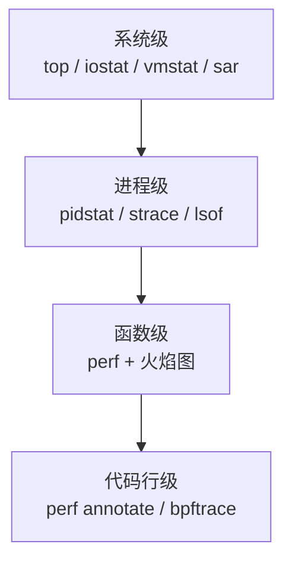
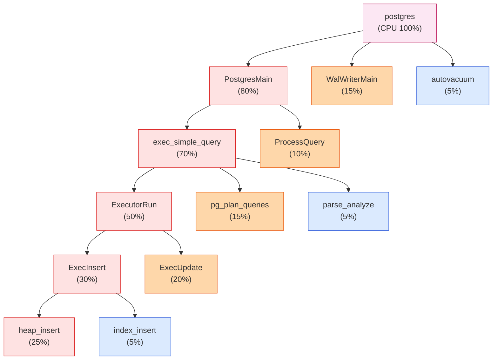
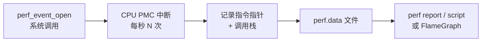
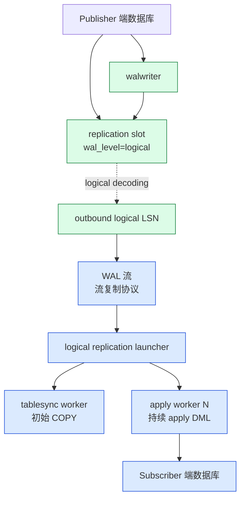
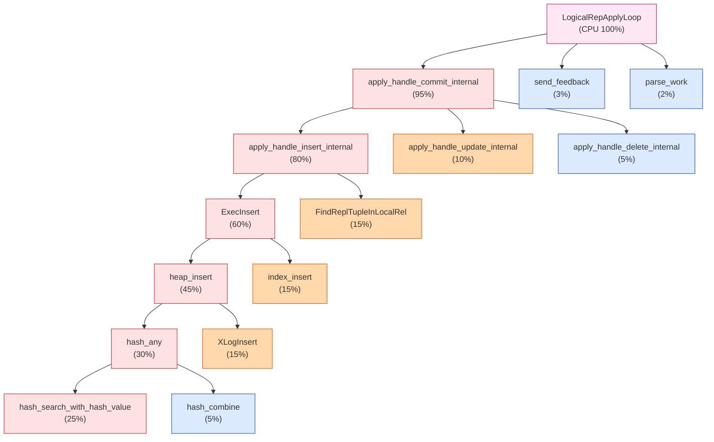
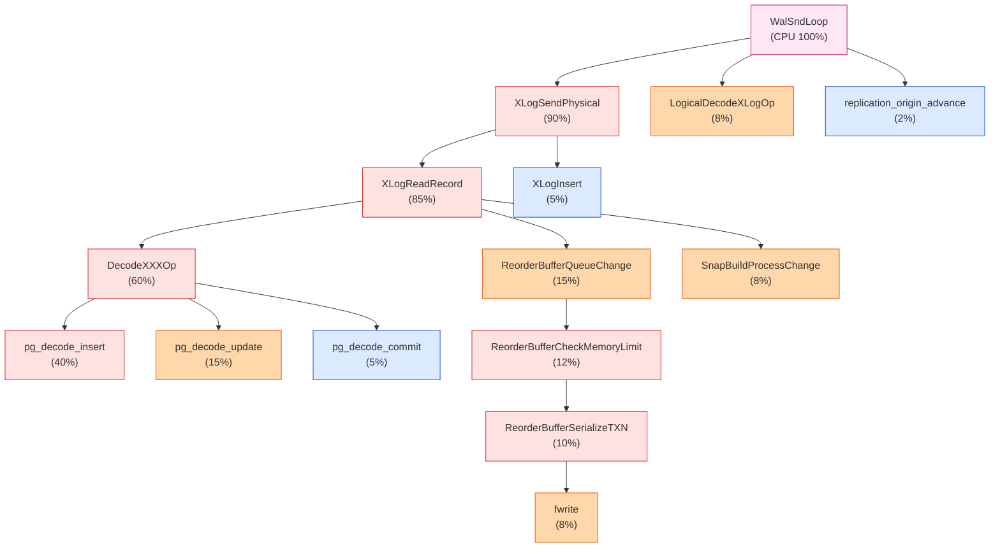
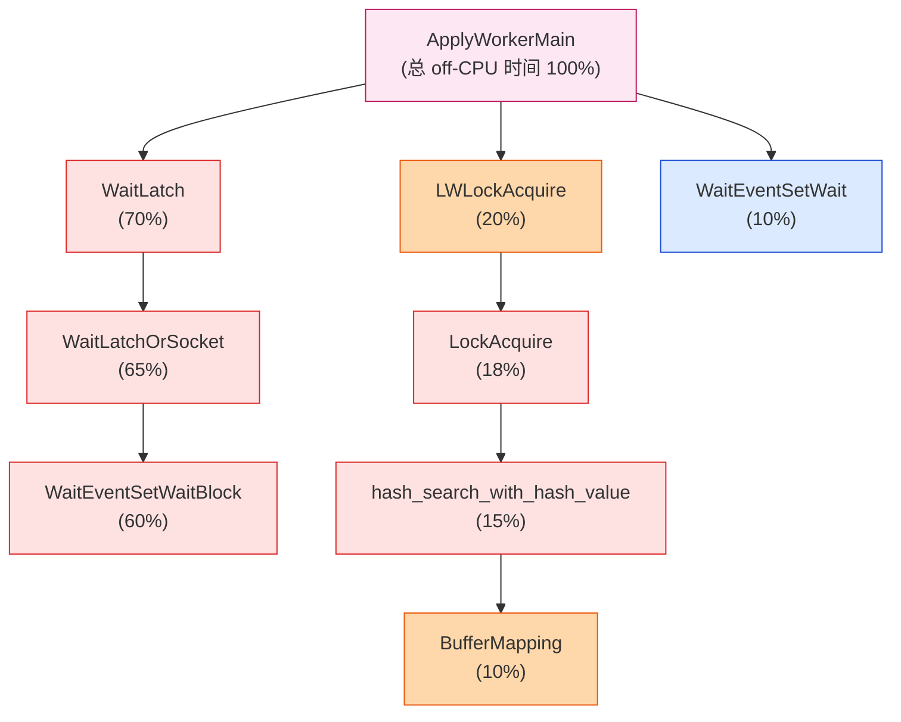
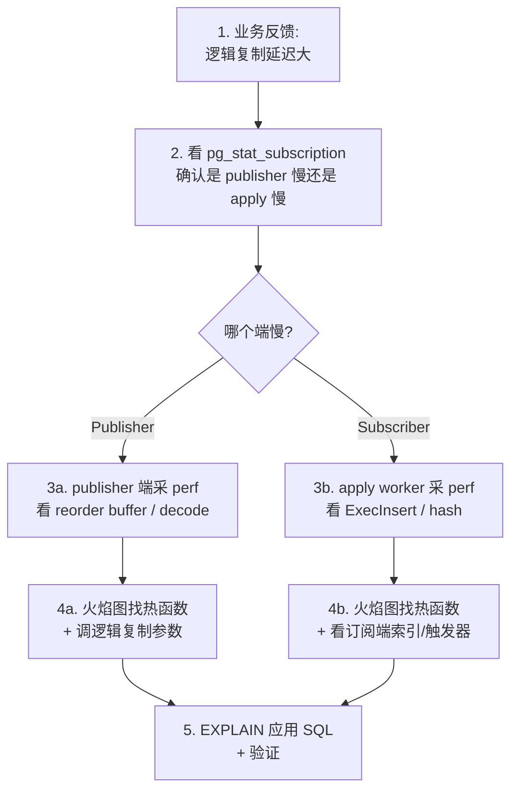

# PostgreSQL 逻辑复制性能分析:火焰图实战

> 本文是一份**性能分析入门 + 实战**指南。前半段讲清楚火焰图和 perf 是什么、怎么用;后半段用 PostgreSQL 逻辑复制的 4 个真实问题,演示怎么用火焰图定位瓶颈。读完你会获得一个完整的"实战方法论"。

## 一、性能分析的世界地图

性能问题五花八门 ——"慢"可能意味着完全不同的东西。先把"性能"分清楚:

| 类型 | 典型症状 | 主要工具 |
| --- | --- | --- |
| **CPU bound** | CPU 100%、sys% 高、user% 高 | perf、火焰图 |
| **IO bound** | iowait 高、磁盘队列长、读慢 | iostat、biolatency、pt-ioprofile |
| **内存 bound** | swap 高、OOM | vmstat、smem、smaps |
| **锁/等待** | CPU 低但事务慢 | pg_stat_activity、wait_event |
| **网络** | 吞吐上不去 | iftop、tcpdump、sar -n DEV |

**火焰图的核心用途**:**CPU bound 时找热函数** + **Off-CPU 时找等锁位置**。它不是万能钥匙,但在 CPU / 调度层面是最直观的可视化工具。

### 性能分析的层次



火焰图位于"函数级",告诉你**哪个函数最耗时**,再向下钻到代码行。

## 二、火焰图(Flame Graph)是什么

火焰图是 **Brendan Gregg**(DTrace / 系统性能专家)在 2011 年发明的可视化技术。它把 **perf** 等采样工具的"调用栈频次"统计结果,以**堆叠条形图**的形式画出来。

### 2.1 一张示例图(想象一下)



**核心读图规则**:

- **Y 轴 = 调用栈深度**(底层是 root 函数,顶层是叶子函数 = 真正消耗 CPU 的函数)
- **X 轴 = CPU 时间**(不是时间线!同一行的宽度比例 = 它占总采样比例)
- **颜色**:**只是为了美观**区分不同栈;颜色不表示"重要性"
- **找优化目标**:**最宽的"尖儿"** = CPU 最热函数,从这里开始优化收益最大
- **找异常"平顶"** = 一段长条里都有的函数,说明它在所有栈都出现

### 2.2 火焰图的种类

| 类型 | 数据源 | 看什么 |
| --- | --- | --- |
| **CPU On-CPU**(经典) | `perf record -F 99 -g` | 真正在 CPU 上跑的时间 |
| **Off-CPU** | `perf record -e sched:sched_switch -g` | 等锁 / 等 IO 的时间 |
| **Memory** | `perf mem record` / 采样 heap | 内存分配热路径 |
| **Disk I/O** | `biolatency` + FlameGraph | 磁盘延迟分布 |
| **Page Fault** | `perf record -e page-faults` | 缺页中断来源 |

> ⚠️ **很多性能问题不是 CPU**。"CPU 不忙但业务慢"= 一定要看 Off-CPU,而不是 On-CPU。

### 2.3 三个最常见的误区

1. **"左边低右边高"不是时间线**—— X 轴是**采样聚类**,不表示先后
2. **不要按颜色判断重要性**—— 颜色只是分组
3. **看大块,不看细节**—— 不要被某个奇怪的叶子函数干扰,优化 ROI 最大的是**最宽的尖儿**

## 三、Linux perf 工具链

### 3.1 perf 是什么

`perf` 是 Linux 内核自带的性能分析工具,基于 **硬件性能计数器(PMC)** + **软件 tracepoint** + **采样**。它的核心能力是 **按频率采样**CPU 上正在执行的指令,把当时的**调用栈**(用 frame pointer 或 dwarf unwind)记录下来。



### 3.2 安装

```bash
# CentOS / RHEL
sudo yum install perf
# Ubuntu / Debian
sudo apt install linux-tools-common linux-tools-$(uname -r)
# macOS 没有原生 perf,可以用 instruments 或 dtrace
```

### 3.3 perf_event_paranoid(权限)

```bash
# 默认 4:只允许 root 看硬件计数器
cat /proc/sys/kernel/perf_event_paranoid

# 调成 1:普通用户能用 perf 但不能采系统调用级
echo 1 | sudo tee /proc/sys/kernel/perf_event_paranoid

# 调成 -1:完全开放(慎用)
echo -1 | sudo tee /proc/sys/kernel/perf_event_paranoid
```

### 3.4 核心命令清单

```bash
# 1. 列出当前进程支持的事件
perf list | head -30

# 2. 实时看 CPU 占用对应的函数(类似 top + 调用栈)
perf top -g

# 3. 采样:记录 30 秒,99 Hz(每秒 99 次,避免和 timer tick 同步)
perf record -F 99 -a -g -- sleep 30
#    -F 99:99 Hz 采样
#    -a:所有 CPU
#    -g:记录调用栈
#    -p <pid>:只采某个进程

# 4. 看报告(交互式)
perf report

# 5. 直接导出文本
perf report -n --stdio > report.txt

# 6. 转成可被 FlameGraph 处理的格式
perf script > out.perf
```

### 3.5 一键生成火焰图

```bash
# 下载 Brendan Gregg 的工具集
git clone --depth 1 https://github.com/brendangregg/FlameGraph.git

# 核心脚本
./FlameGraph/stackcollapse-perf.pl out.perf > out.folded
./FlameGraph/flamegraph.pl out.folded > flame.svg

# 打开 flame.svg 浏览器看
open flame.svg   # macOS
xdg-open flame.svg   # Linux
```

> 💡 **新一点的 perf** 可以用 `perf script flamegraph` 一把生成。但 `stackcollapse-perf.pl` 兼容性最好。

## 四、PostgreSQL 与 perf 的准备

PG 是 C 代码,**符号解析 + 栈展开**是火焰图能否看懂的关键。要做对四件事:

### 4.1 编译时加 `-fno-omit-frame-pointer`

PG 的 `configure` 默认开了优化,但 frame pointer 在 `-O1+` 会被省略。**没有 frame pointer,perf 只能采到最外层函数,看不到深层栈**。

```bash
./configure \
    --prefix=/usr/local/pgperf \
    --enable-debug \           # 关掉大部分 -O,带上符号
    CFLAGS="-O2 -fno-omit-frame-pointer -g"   # 关键!
make -j && sudo make install
```

> 💡 **生产建议**:`--enable-debug` 会让 PG 跑慢 30%~50%。**折中**:用 `-O2 -g -fno-omit-frame-pointer`(生产配置 + 调试符号 + frame pointer)。

### 4.2 用同一个二进制采和看

火焰图好看的关键是**符号能解析到具体函数**。生产环境如果用了 `strip` 剥符号,火焰图就只剩地址。

```bash
# 让 perf 能找到符号
# 方法 1:不剥符号
# 方法 2:把 debuginfo 包放在 /usr/lib/debug/...
# 方法 3:用 perf buildid-cache 把符号缓存起来
perf buildid-cache -v --add /path/to/postgres
```

### 4.3 perf_event_paranoid

```bash
echo 1 | sudo tee /proc/sys/kernel/perf_event_paranoid
```

### 4.4 一次完整的工作流

```bash
# 1. 找 PG worker 的 PID
ps aux | grep -E 'postgres.*(worker|sync|launcher|wal|apply)' | grep -v grep
# 假设 apply worker 是 12345

# 2. 采样 30 秒
perf record -F 99 -p 12345 -g -- sleep 30
# 或所有 PG 进程
perf record -F 99 -g -a -- sleep 30

# 3. 导出 + 生成火焰图
perf script > /tmp/pg.perf
git clone --depth 1 https://github.com/brendangregg/FlameGraph.git
./FlameGraph/stackcollapse-perf.pl /tmp/pg.perf > /tmp/pg.folded
./FlameGraph/flamegraph.pl /tmp/pg.folded > /tmp/pg.svg
```

## 五、PostgreSQL 逻辑复制架构速览

火焰图"看什么"取决于"在哪个进程采"。先把逻辑复制的进程分清楚:



**关键源码**(供看图时定位):

| 进程 | 关键函数 | 文件 |
| --- | --- | --- |
| `apply worker` | `ApplyWorkerMain`、`apply_handle_insert_internal` | `src/backend/replication/logical/worker.c` |
| `tablesync worker` | `TablesyncWorkerMain`、`copy_table` | `src/backend/replication/logical/tablesync.c` |
| launcher | `ApplyLauncherMain` | `src/backend/replication/logical/launcher.c` |
| publisher 输出插件 | `pg_decode_*` | `src/backend/replication/logical/decode.c` |
| reorder buffer | `ReorderBuffer*` | `src/backend/replication/logical/reorderbuffer.c` |

## 六、实战案例 1:apply worker 慢

### 6.1 现象

```sql
-- 订阅端看到 lag 在涨
SELECT subname, received_lsn, latest_end_lsn,
       (latest_end_lsn - received_lsn) AS apply_lag_bytes
  FROM pg_stat_subscription;
-- apply_lag_bytes 单调上涨
```

### 6.2 定位是哪个 worker

```sql
-- pg_stat_subscription 显示每个 subscription 的状态
-- pg_stat_replication 在 publisher 端
SELECT pid, application_name, state, sync_state,
       (sent_lsn - replay_lsn) AS lag
  FROM pg_stat_replication;
```

```bash
# 在订阅端 OS 上看进程
ps auxf | grep postgres | grep -v grep
# 找到 apply worker 的 PID(用户名 postgres,cmd 含 "logical replication worker for subscription")
```

### 6.3 采集 perf

```bash
# 假设 apply worker PID 是 12345
perf record -F 99 -p 12345 -g -- sleep 60
perf script > /tmp/apply.perf

./FlameGraph/stackcollapse-perf.pl /tmp/apply.perf > /tmp/apply.folded
./FlameGraph/flamegraph.pl /tmp/apply.folded > /tmp/apply.svg
```

### 6.4 看图:典型火焰图



### 6.5 这张图告诉我们什么?

**最宽的尖儿**:`apply_handle_insert_internal` → `ExecInsert` → `heap_insert` → `hash_any` → `hash_search_with_hash_value`。

翻译成白话:

1. **35%** 的 CPU 在跑 INSERT(数据导入量大)
2. **30%** 在算哈希值、找 hash 索引(`hash_any`)
3. **15%** 在插 B-tree 索引(`index_insert`)

### 6.6 优化方向

| 发现 | 优化 |
| --- | --- |
| `hash_any` 很热 | 看订阅端表上有没有过多索引?每多一个索引,每条 INSERT 多一份代价 |
| `ExecInsert` 占大头 | 看订阅端有没有触发器、RLS、外键 —— 每个都加成本 |
| `heap_insert` / `XLogInsert` | 看 `wal_compression` 设置、订阅端是否 WAL 量本身大 |
| `apply_handle_commit_internal` 占 95% | apply worker **几乎是纯 INSERT**,先做 batch / 并行 apply 看是否提升 |

**进阶**:

- PG 16+ 支持 `streaming = parallel`(并行 apply 大事务)
- 调 `subscriber_name` 对应的 `max_apply_workers_per_subscription` / `parallel_apply_workers`
- `EXPLAIN (FORMAT JSON)` 在订阅端跑同样的 SQL,看实际计划是不是最优

## 七、实战案例 2:logical decoding 慢 / spill 多

### 7.1 现象

```sql
-- publisher 端:reorder buffer 内存满了,spill 到磁盘
SELECT slot_name,
       pg_size_pretty(pg_wal_lsn_diff(pg_current_wal_lsn(), restart_lsn)) AS lag_bytes
  FROM pg_replication_slots
 WHERE slot_type = 'logical';
-- lag 一直在涨
```

```bash
# 看 spill 文件大小
du -sh $PGDATA/pg_replslot/<slot_name>/
```

### 7.2 定位 publisher 输出插件进程

```bash
ps auxf | grep postgres | grep -E "wal sender|walsender|logical"
# 找出对应的 WAL sender PID
```

### 7.3 采集 perf

```bash
perf record -F 99 -p <walsender_pid> -g -- sleep 60
# 生成火焰图...
```

### 7.4 典型火焰图



### 7.5 看到了什么?

1. **`ReorderBufferSerializeTXN` 占了 10%**:确认 **reorder buffer 在落盘**(spill)
2. **`pg_decode_insert` 占 40%**:INSERT 量大,logical decoding 的 hot path
3. **`ReorderBufferCheckMemoryLimit` 12%**:频繁检查内存,说明反复接近上限

### 7.6 优化

| 发现 | 优化 |
| --- | --- |
| `pg_decode_insert` 多 | 单条 INSERT 多?可能上游没用 COPY / batch insert |
| `ReorderBufferSerializeTXN` 频繁 | 上调 `logical_decoding_work_mem`(默认 128 MB),或拆大事务 |
| spill 多 | 把大事务拆小(应用层批处理) |
| `DecodeXXXOp` 整体高 | publisher CPU 不够,加核 |

**关键参数**:

```sql
-- publisher 端
ALTER SYSTEM SET logical_decoding_work_mem = '2GB';  -- 默认 128 MB
SELECT pg_reload_conf();

-- 订阅端
-- 考虑 streaming 模式减少 reorder buffer 压力
ALTER SUBSCRIPTION sub SET (streaming = on);
```

## 八、实战案例 3:Off-CPU 火焰图找锁等待

### 8.1 现象

```sql
-- 订阅端 apply lag 涨,但 apply worker CPU 很低(< 5%)
SELECT pid, state, wait_event_type, wait_event, query
  FROM pg_stat_activity
 WHERE application_name LIKE 'subscriber%';
-- wait_event_type = 'LWLock' / 'Lock' / 'IO'
```

```bash
top -p <apply_worker_pid>
# %CPU = 1.2%, 但 lag 涨
```

**CPU 火焰图看到不到东西**—— 因为 CPU 不忙!需要 **Off-CPU 火焰图**。

### 8.2 采集 Off-CPU 火焰图

```bash
# 用 perf 的 sched tracepoint 记录调度切换
perf record -e sched:sched_switch -e sched:sched_stat_sleep \
            -e sched:sched_stat_runtime \
            --filter 'prev_pid == <pid> || next_pid == <pid>' \
            -g -- sleep 60
```

更简单的现成工具:**offcputime**(来自 BCC / bpftrace):

```bash
# 用 bpftrace 写一个 5 行 Off-CPU 火焰图采集器
bpftrace -e '
kprobe:finish_task_switch {
    $prev = (struct task_struct *)arg0;
    if ($prev->__state == TASK_RUNNING) return;
    @start[tid] = nsecs;
}
kretprobe:finish_task_switch /@start[tid]/ {
    @usecs[arg0->comm, kstack()] = sum(nsecs - @start[tid]);
    delete(@start[tid]);
}
END { print(@usecs); clear(@usecs); }
' > offcpu.perf
```

或者用 FlameGraph 自带的脚本:

```bash
./FlameGraph/offcputime -p <pid> -f 60 > offcpu.folded
./FlameGraph/flamegraph.pl --title "Off-CPU" offcpu.folded > offcpu.svg
```

### 8.3 典型 Off-CPU 火焰图



### 8.4 这告诉我们什么?

1. **70% 时间在等 latch**:正常,apply worker 大部分时间在 `WaitLatch` 等新数据
2. **20% 在 `LWLockAcquire`**:具体是 `BufferMapping`(读 buffer 时取锁)
3. **buffer pin 冲突**:典型是**订阅端有长事务 / 长查询**在 `pg_relation_size` 之类持锁

### 8.5 排查 & 优化

```sql
-- 1. 看是不是有长事务/慢查询挡了 apply worker
SELECT pid, state, xact_start, query_start,
       wait_event_type, wait_event, query
  FROM pg_stat_activity
 WHERE backend_type LIKE '%apply%' OR backend_type = 'client backend'
 ORDER BY xact_start NULLS LAST;

-- 2. 看具体的冲突
SELECT blocked_locks.pid AS blocked_pid,
       blocking_locks.pid AS blocking_pid,
       blocked_activity.query AS blocked_query,
       blocking_activity.query AS blocking_query
  FROM pg_catalog.pg_locks blocked_locks
  JOIN pg_catalog.pg_stat_activity blocked_activity ON blocked_activity.pid = blocked_locks.pid
  JOIN pg_catalog.pg_locks blocking_locks
       ON blocking_locks.locktype = blocked_locks.locktype
       AND blocking_locks.DATABASE IS NOT DISTINCT FROM blocked_locks.DATABASE
       AND blocking_locks.relation IS NOT DISTINCT FROM blocked_locks.relation
       AND blocking_locks.page IS NOT DISTINCT FROM blocked_locks.page
       AND blocking_locks.tuple IS NOT DISTINCT FROM blocked_locks.tuple
       AND blocking_locks.virtualxid IS NOT DISTINCT FROM blocked_locks.virtualxid
       AND blocking_locks.transactionid IS NOT DISTINCT FROM blocked_locks.transactionid
       AND blocking_locks.pid != blocked_locks.pid
  JOIN pg_catalog.pg_stat_activity blocking_activity ON blocking_activity.pid = blocking_locks.pid
 WHERE NOT blocked_locks.GRANTED;
```

**优化方向**:

- 订阅端避免长事务 / 长时间 `pg_dump` / 大 `SELECT`
- 调小 `synchronous_commit = off`(如果是延迟敏感场景)
- 用 `streaming = on` 减少 memory pressure

## 九、火焰图 + 其他 PG 工具的配合

火焰图告诉你"**哪里慢**",但还需要回答"**为什么慢**"。配合这些:

| 工具 | 回答 |
| --- | --- |
| `pg_stat_activity` | 哪个 query 跑得久、谁在等 |
| `pg_stat_statements` | TOP SQL 是哪个、调用次数、平均耗时 |
| `pg_stat_replication` | publisher 端 replication lag |
| `pg_stat_subscription` | 订阅端 receive/replay lag |
| `pg_locks` | 锁等待 |
| `EXPLAIN (ANALYZE, BUFFERS)` | 单条 SQL 的执行计划 |
| `auto_explain` | 自动记录慢 SQL |
| `pg_wait_sampling` | 周期性采样 wait_event |
| `pg_stat_io`(PG 16+) | IO 计数器 |

**一个好的诊断流程**:



## 十、心法总结(给新人)

### 10.1 性能分析的 5 个"先问"

1. **先问业务**:"慢"是用户感知慢,还是监控告警?延迟从 P50 到 P99 哪一档变了?
2. **先看大盘**:`pg_stat_*`、`top` 先抓指标,再决定采哪个进程
3. **先看时间窗**:CPU 高多久了?一直高还是突发?
4. **先确认假设**:怀疑是 publisher 还是 subscriber?再看火焰图(避免乱采)
5. **先看粗后看细**:On-CPU 火焰图看尖儿 → 钻代码行 → 再看 Off-CPU

### 10.2 采样 5 条铁律

1. **一定要在有负载时采**—— 没压力采到的火焰图没意义
2. **采样时长 30~60 秒**—— 太短数据少,太长数据文件巨大
3. **不要在低 IO 业务时采**—— 没用,采到的是 sleep
4. **避免和 timer tick 同步** —— `perf record -F 99`(别用 `-F 1000`,99 Hz 是经验值)
5. **同一个二进制**采和看 —— 符号、版本、build id 必须一致

### 10.3 看图 5 条铁律

1. **找最宽的尖儿** —— 这是 ROI 最高的优化点
2. **不要看平顶的颜色** —— 颜色不表示重要性,只看宽度
3. **左右不表示时间** —— X 轴是聚类不是时间线
4. **没采到的栈不表示没有** —— 采样有偏差,长尾函数可能被低估
5. **先 On-CPU 后 Off-CPU** —— 业务慢先看 CPU 忙不忙,不忙立刻转 Off-CPU

### 10.4 性能优化的 3 个误区

1. **迷信优化**:可能某函数占了 10%,但优化它只能省 0.5% 整体时间
2. **过早优化**:改索引、改参数前,**先确认瓶颈在数据流哪里**
3. **看错方向**:`heap_insert` 很热 ≠ 改 heap_insert 代码 = 性能提升;可能是**少建索引**或**批处理**

## 十一、完整工具链速查表

```bash
# 安装
sudo yum install perf bpftrace bcc
git clone https://github.com/brendangregg/FlameGraph.git

# perf 采 PG apply worker(60 秒,99Hz)
PID=$(ps aux | grep 'logical replication worker' | grep -v grep | awk '{print $2}')
perf record -F 99 -p $PID -g -- sleep 60

# 生成火焰图
perf script > /tmp/pg.perf
./FlameGraph/stackcollapse-perf.pl /tmp/pg.perf > /tmp/pg.folded
./FlameGraph/flamegraph.pl --title "PostgreSQL Apply Worker" /tmp/pg.folded > /tmp/pg.svg
open /tmp/pg.svg

# Off-CPU(找出等锁时间)
./FlameGraph/offcputime -p $PID -f 60 > /tmp/offcpu.folded
./FlameGraph/flamegraph.pl --title "PG Apply Off-CPU" /tmp/offcpu.folded > /tmp/offcpu.svg

# 内存分配热路径(看哪里在 malloc 多)
perf mem record -p $PID
perf mem report

# 按函数聚合看 TOP
perf report -n --stdio | head -40
```

## 十二、参考

- **Brendan Gregg 火焰图主页**:<https://www.brendangregg.com/flamegraphs.html>
- **FlameGraph 工具集**:<https://github.com/brendangregg/FlameGraph>
- **perf 用户指南**:<https://perf.wiki.kernel.org/index.php/Main_Page>
- **bpftrace 参考**:<https://github.com/iovisor/bpftrace>
- **PG 源码**:
  - `src/backend/replication/logical/worker.c` — apply worker 主循环
  - `src/backend/replication/logical/reorderbuffer.c` — reorder buffer
  - `src/backend/replication/logical/decode.c` — logical decoding 输出插件
  - `src/backend/replication/logical/launcher.c` — launcher
  - `src/backend/replication/logical/tablesync.c` — tablesync worker
- **PG 视图**:
  - `pg_stat_replication`、`pg_stat_subscription`、`pg_stat_activity`
  - `pg_replication_slots`、`pg_stat_io`(PG 16+)
- **配套文章**(本博客):
  - 《PostgreSQL 共享内存机制》
  - 《PostgreSQL 逻辑复制 streaming 与 spill 文件》
