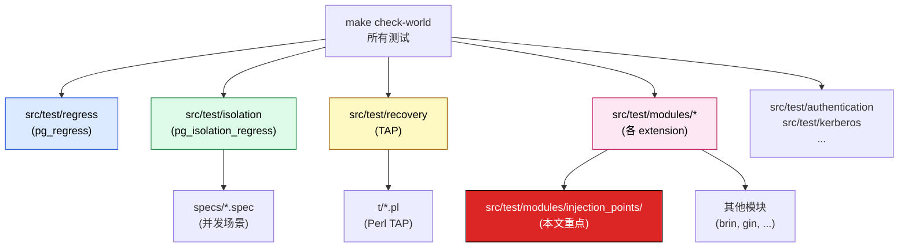
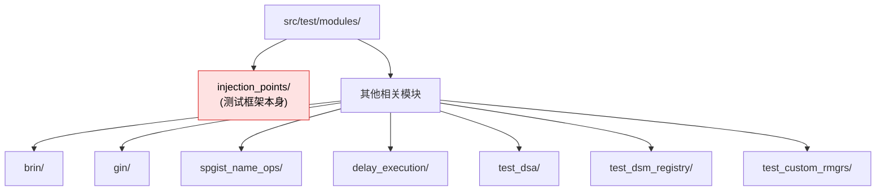
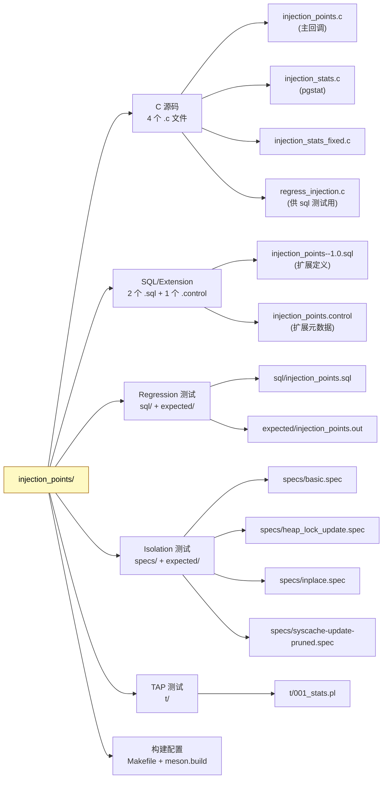
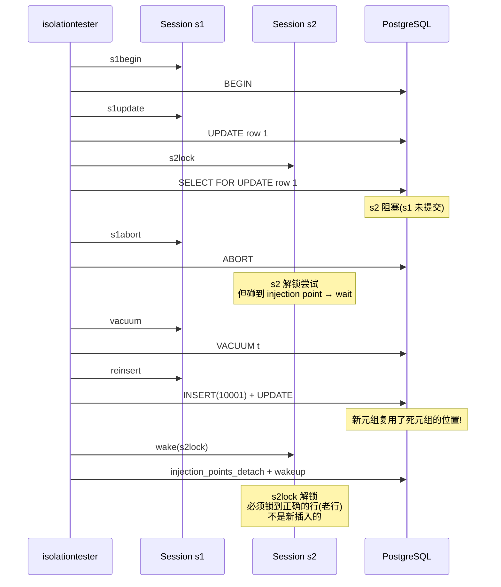
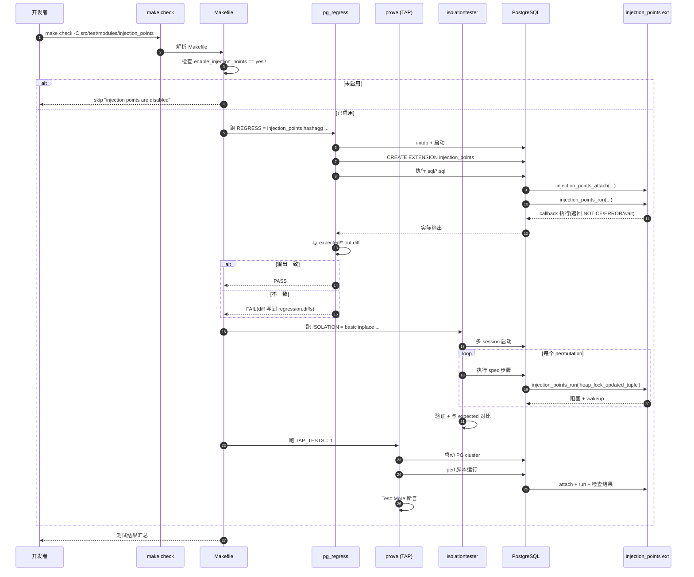
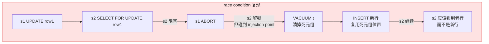

# Injection Point 与 PG 测试框架集成实战:从 Makefile 到 .spec 完整链路

> 配套源码:`~/cwork/postgresql`(基于 PG 18 主干)
>
> 配套前文:
> - [PostgreSQL 18 Injection Point 完整指南](https://growdu.github.io/blog/db/postgresql/postgresql-injection-points/)
> - [用 Injection Point 测试不可达代码路径](https://growdu.github.io/blog/db/postgresql/postgresql-injection-points-test-unreachable/)
>
> 本文聚焦**实战集成**:如何把 injection point 接到 PG 现有的 3 大测试框架上,跑回归、跑隔离测试、跑 TAP 测试。
>
> 读完本文你会获得:
> 1. PG 测试框架的 **3 大体系**(regress / isolation / TAP)全景图
> 2. **`src/test/modules/injection_points/`** 的完整目录结构与各文件作用
> 3. **Makefile / meson.build** 的关键配置(尤其是 `enable_injection_points` 条件编译)
> 4. **3 种集成模式**:
>    - 普通 regression test(SQL 输出 diff)
>    - TAP 测试(Perl + `Test::More`)
>    - Isolation 测试(spec 文件描述并发场景)
> 5. **真实例子**:`heap_lock_update.spec`(用 injection point 测试行锁 race condition)
> 6. **从零添加一个新测试**的完整流程

---

## 一、PG 测试框架全景

PG 的测试框架是 **分层** 的,各有侧重:



### 1.1 三种测试模式

| 测试类型 | 工具 | 适用场景 | 文件格式 |
|---------|------|---------|---------|
| **Regression test** | `pg_regress` | SQL 行为、函数返回值 | `sql/*.sql` + `expected/*.out` |
| **Isolation test** | `isolationtester` | 多 session 并发、race condition | `specs/*.spec` + `expected/*.out` |
| **TAP test** | Perl `Test::More` | 复杂场景、需要 PG 集群管理 | `t/*.pl` |

### 1.2 `src/test/modules/` 是 injection point 的主战场

源码位置:`src/test/modules/`。



---

## 二、`src/test/modules/injection_points/` 完整目录解析

源码位置:`src/test/modules/injection_points/`。



### 2.1 各文件职责

| 文件 | 作用 |
|------|------|
| `Makefile` | 构建配置,声明 extension + tests |
| `meson.build` | Meson 构建配置(替代 Makefile) |
| `*.control` | `CREATE EXTENSION` 的元数据 |
| `*--1.0.sql` | extension 创建时执行的 SQL(定义函数) |
| `injection_points.c` | 主回调实现(`injection_error` / `notice` / `wait`) |
| `injection_stats.c` | pgstat 集成(每个注入点的调用次数) |
| `injection_stats_fixed.c` | 全局固定计数器(总 attach/detach/run 数) |
| `regress_injection.c` | 回归测试用辅助函数(如 `wait_pid`) |
| `sql/*.sql` | 回归测试 SQL 输入 |
| `expected/*.out` | 期望输出(diff 比对) |
| `specs/*.spec` | isolation 测试规范 |
| `expected/<spec>.out` | isolation 测试期望输出 |
| `t/*.pl` | TAP 测试脚本 |

### 2.2 Makefile 关键配置

源码位置:`src/test/modules/injection_points/Makefile`。

```makefile
# 1. extension 声明
MODULE_big = injection_points
OBJS = injection_points.o injection_stats.o injection_stats_fixed.o regress_injection.o
EXTENSION = injection_points
DATA = injection_points--1.0.sql
PGFILEDESC = "injection_points - facility for injection points"

# 2. regression 测试列表
REGRESS = injection_points hashagg reindex_conc vacuum
REGRESS_OPTS = --dlpath=$(top_builddir)/src/test/regress

# 3. isolation 测试列表
ISOLATION = basic inplace syscache-update-pruned heap_lock_update

# 4. TAP 测试数量
TAP_TESTS = 1

# 5. ⚠️ 关键:禁用 installcheck(因为注入点是 cluster-wide)
NO_INSTALLCHECK = 1

# 6. 导出 enable_injection_points 环境变量
export enable_injection_points

# 7. 条件编译:如果未启用 injection points,跳过整个测试
ifeq ($(enable_injection_points),yes)
include $(top_srcdir)/contrib/contrib-global.mk
else
check:
	@echo "injection points are disabled in this build"
endif
```

**5 个关键点**:

1. `REGRESS` / `ISOLATION` / `TAP_TESTS` —— 三个变量分别声明要跑的测试
2. `NO_INSTALLCHECK = 1` —— **必须设置**,因为 injection points 是 cluster-wide,会影响其他测试
3. `export enable_injection_points` —— 让子进程知道是否启用
4. `REGRESS_OPTS = --dlpath` —— 让 regression 找到测试 helper 库
5. 末尾的 `ifeq` 条件块 —— 处理未启用构建

### 2.3 顶层 Makefile 的条件判断

源码位置:`src/test/modules/Makefile`(顶层的那个)。

```makefile
# src/test/modules/Makefile(顶层)
ifeq ($(enable_injection_points),yes)
SUBDIRS += injection_points
endif
```

只有当 configure 时启用了 `--enable-injection-points`,`enable_injection_points=yes`,才会把 `injection_points/` 加入构建。

---

## 三、3 种测试模式的集成实战

### 模式 1:Regression Test(SQL 输出 diff)

**框架**:`pg_regress`

**机制**:
1. 执行 `sql/*.sql` 中的 SQL
2. 输出与 `expected/*.out` 比对
3. 完全一致 → 测试通过

**测试入口 SQL**(源码 `sql/injection_points.sql` 简化版):

```sql
-- src/test/modules/injection_points/sql/injection_points.sql
CREATE EXTENSION injection_points;

-- 1. attach 各种 action
SELECT injection_points_attach('TestInjectionError', 'error');
SELECT injection_points_attach('TestInjectionNotice', 'notice');

-- 2. trigger 每个注入点
SELECT injection_points_run('TestInjectionNotice');
-- 预期输出:NOTICE:  notice injected for injection point TestInjectionNotice

-- 3. ERROR action 应报 ERROR
SELECT injection_points_run('TestInjectionError');
-- 预期:ERROR  (整条语句失败)

-- 4. cleanup
SELECT injection_points_detach('TestInjectionNotice');
```

**期望输出**(`expected/injection_points.out`):

```
CREATE EXTENSION injection_points;
...
SELECT injection_points_run('TestInjectionNotice');
NOTICE:  notice injected for injection point TestInjectionNotice
...
```

**运行**:

```bash
cd ~/cwork/postgresql
make check -C src/test/modules/injection_points
```

### 模式 2:TAP Test(Perl + `Test::More`)

**框架**:Perl 的 `Test::More`

**适用场景**:
- 需要管理复杂 PG 集群配置
- 需要 checkpoint、slot、replication 等
- 需要 Perl 流程控制(循环、条件)

**真实例子**:`src/test/recovery/t/044_invalidate_inactive_slots.pl`

源码位置:`src/test/recovery/t/044_invalidate_inactive_slots.pl`(完整脚本 ~130 行)。

```perl
#!/usr/bin/perl
# Copyright (c) 2025, PostgreSQL Global Development Group

use strict;
use warnings FATAL => 'all';
use PostgreSQL::Test::Utils;
use PostgreSQL::Test::Cluster;
use Test::More;

# 关键:跳过机制(构建未启用 injection point)
if ($ENV{enable_injection_points} ne 'yes')
{
    plan skip_all => 'Injection points not supported by this build';
}

# 1. 启动 PG 节点
my $node = PostgreSQL::Test::Cluster->new('node');
$node->init(allows_streaming => 'logical');

# 2. 修改配置(把 idle timeout 设小一点,虽然下面用 injection point)
$node->append_conf(
    'postgresql.conf', qq{
        checkpoint_timeout = 1h
        idle_replication_slot_timeout = 1min
    });
$node->start;

# 3. 检查 extension 是否安装
if (!$node->check_extension('injection_points'))
{
    plan skip_all => 'Extension injection_points not installed';
}

# 4. 创建复制槽
$node->safe_psql('postgres', qq[
    SELECT pg_create_physical_replication_slot(
        slot_name := 'physical_slot',
        immediately_reserve := true);
    SELECT pg_create_logical_replication_slot(
        'logical_slot', 'test_decoding');
]);

# 5. 加载 injection_points extension + attach 注入点
$node->safe_psql('postgres', 'CREATE EXTENSION injection_points;');
$node->safe_psql('postgres',
    "SELECT injection_points_attach('slot-timeout-inval', 'error');");

# 6. CHECKPOINT 触发 slot invalidation
$node->safe_psql('postgres', "CHECKPOINT");

# 7. 等待日志中出现 invalidation
$node->wait_for_log(
    qr/invalidating obsolete replication slot "physical_slot"/, $log_offset);

# 8. 断言:slot 的 invalidation_reason 应该是 idle_timeout
$node->poll_query_until('postgres', qq[
    SELECT COUNT(slot_name) = 1 FROM pg_replication_slots
        WHERE slot_name = 'physical_slot'
        AND invalidation_reason = 'idle_timeout';
])
  or die "Timed out while waiting for invalidation";

# 9. 验证:已失效的 slot 不能被 acquire
my ($result, $stdout, $stderr) = $node->psql('postgres', qq[
    SELECT pg_replication_slot_advance('logical_slot', '0/1');
]);
ok( $stderr =~ /can no longer access replication slot "logical_slot"/,
    "detected error upon trying to acquire invalidated slot")
  or die "could not detect error";

done_testing();
```

**运行**:

```bash
cd ~/cwork/postgresql
make check -C src/test/recovery
# 或单独跑:
make -C src/test/recovery check PROVE_TESTS="t/044_invalidate_inactive_slots.pl"
```

**TAP 测试三要素**:

| 要素 | 作用 |
|------|------|
| `plan skip_all => '...'` | 未启用 injection point 时优雅跳过 |
| `PostgreSQL::Test::Cluster` | 管理 PG 实例(启动、停、配置) |
| `Test::More::ok()` / `is()` | TAP 断言 |

### 模式 3:Isolation Test(spec 文件描述并发场景)

**框架**:`isolationtester`(独立的测试程序)

**最强大的模式**:可以精确控制多个 session 的交叉执行,适合测 race condition。

**真实例子**:`src/test/modules/injection_points/specs/heap_lock_update.spec`(完整 ~80 行)。

```perl
# Test race condition in tuple locking
# ...
# Setup: 创建表
setup {
    CREATE EXTENSION injection_points;
    CREATE TABLE t (id int PRIMARY KEY);
    do $$
        DECLARE i int; tid tid;
        BEGIN
            FOR i IN 1..5000 LOOP
                INSERT INTO t VALUES (i) RETURNING ctid INTO tid;
                IF tid = '(1,1)' THEN RETURN; END IF;
            END LOOP;
            RAISE 'expected to insert tuple to (1,1)';
        END;
    $$;
}
teardown {
    DROP TABLE t;
    DROP EXTENSION injection_points;
}

# Session 1: 更新一行
session s1
step s1begin   { BEGIN; }
step s1update  { UPDATE t SET id = 10000 WHERE id = 1 RETURNING ctid; }
step s1abort   { ABORT; }
step vacuum    { VACUUM t; }
step reinsert  {
    INSERT INTO t VALUES (10001) RETURNING ctid;
    UPDATE t SET id = 10002 WHERE id = 10001 RETURNING ctid;
}

# Session 2: 加锁 + 注入点
session s2
setup {
    SELECT FROM injection_points_set_local();  -- 本地化(并发安全)
    SELECT FROM injection_points_attach('heap_lock_updated_tuple', 'wait');
}
step s2lock    { select * from t where id = 1 for update; }
step wake {
    SELECT FROM injection_points_detach('heap_lock_updated_tuple');
    SELECT FROM injection_points_wakeup('heap_lock_updated_tuple');
}

# 测试编排:精确指定两个 session 的步骤顺序
permutation
    s1begin
    s1update
    s2lock                # s2 阻塞在 s1 的更新上
    s1abort               # s1 回滚,但 s2 现在被注入点阻塞
    vacuum                # 清掉死元组
    reinsert              # 复用死元组的位置
    wake(s2lock)          # s2 解锁,验证它锁的是正确行(不是新插入的)
```

**isolationtester 行为**:



**运行**:

```bash
cd ~/cwork/postgresql
make check -C src/test/modules/injection_points
# 或单独:
pg_isolation_regress heap_lock_update --dlpath=...
```

### 三种模式对比

| 维度 | Regression | TAP | Isolation |
|------|-----------|-----|-----------|
| **复杂度** | 低 | 中 | 高 |
| **并发能力** | 无 | 中 | **强** |
| **PG 集群管理** | 隐式 | `Cluster` 对象 | `isolationtester` |
| **典型用途** | 单 session 行为验证 | 复杂多步流程 | 精确 race condition |
| **最适合 injection point 的场景** | 简单 ERROR/notice | 集成场景(异常路径、回调) | 异步协调(wait/wakeup) |

---

## 四、完整流程图



---

## 五、最重要的几个实战例子

### 5.1 `heap_lock_update.spec`:race condition 复现

源码位置:`src/test/modules/injection_points/specs/heap_lock_update.spec`。

**测试场景**:



**bug 描述**(spec 注释):

```perl
# This is a reproducer for the bug reported at:
# https://www.postgresql.org/message-id/CAOG+RQ74x0q=kgBBQ=mezuvOeZBfSxM1qu_o0V28bwDz3dHxLw@mail.gmail.com
#
# The bug was that when following an update chain when locking tuples,
# we sometimes failed to check that the xmin on the next tuple matched
# the prior's xmax. If the updated tuple version was vacuumed away and
# the slot was reused for an unrelated tuple, we'd incorrectly follow
# and lock the unrelated tuple.
```

**关键技巧**:

1. **`injection_points_set_local()`** —— s2 的注入点只在 s2 自己生效,**不影响其他测试**
2. **`'wait'` action** —— s2 在注入点阻塞,**精确控制测试时序**
3. **`injection_points_wakeup()`** —— 在另一个 step 里唤醒

### 5.2 `044_invalidate_inactive_slots.pl`:slot 超时测试

源码位置:`src/test/recovery/t/044_invalidate_inactive_slots.pl`。

**测试场景**:让 `slot-timeout-inval` 注入点立刻触发,**避免等真实超时**。

```perl
# 关键:即使 idle_replication_slot_timeout = 1min,这个测试用 inject 跳过实际等待
$node->safe_psql('postgres',
    "SELECT injection_points_attach('slot-timeout-inval', 'error');");

# CHECKPOINT 触发 slot 检查逻辑
$node->safe_psql('postgres', "CHECKPOINT");

# 立刻验证 slot 已被 idle_timeout 失效
$node->poll_query_until('postgres', qq[
    SELECT COUNT(*) = 1 FROM pg_replication_slots
    WHERE slot_name = 'physical_slot'
    AND invalidation_reason = 'idle_timeout';
]);
```

### 5.3 `basic.spec`:wait/wakeup 协议测试

源码位置:`src/test/modules/injection_points/specs/basic.spec`。

```perl
# 验证 3 种 permutation
permutation wait1 wakeup2 noop1 detach2
permutation wait1 detach2 wakeup2
permutation detach2 wait1 wakeup2
```

这是 injection point **自身框架**的测试——验证 wait/detach/wakeup 的语义正确。

### 5.4 `inplace.spec` / `syscache-update-pruned.spec`:catcache race

测试 pg_class 上的 inplace update 与 catcache 失效的交互。

---

## 六、从零添加一个新的测试

### 6.1 添加一个 isolation 测试(spec)

**目标**:为新代码路径 `my-feature-critical-section` 添加测试。

**Step 1**:在 `src/test/modules/injection_points/specs/` 创建 `my-feature.spec`:

```perl
# my-feature.spec
setup {
    CREATE EXTENSION injection_points;
    CREATE TABLE my_test (id int);
    INSERT INTO my_test VALUES (1), (2), (3);
}
teardown {
    DROP TABLE my_test;
    DROP EXTENSION injection_points;
}

session s1
setup {
    SELECT injection_points_set_local();
    SELECT injection_points_attach('my-feature-critical-section', 'wait');
}
step s1op   { SELECT count(*) FROM my_test; }
step s1wake { SELECT injection_points_wakeup('my-feature-critical-section'); }

session s2
step s2trigger { UPDATE my_test SET id = id + 10 WHERE id = 1; }

permutation
    s2trigger       # s2 触发注入点
    s1op           # s1 执行,会撞到注入点
    s1wake         # 唤醒 s1
```

**Step 2**:运行 `pg_isolation_regress` 生成 expected 输出:

```bash
cd ~/cwork/postgresql
pg_isolation_regress my-feature --inputdir=src/test/modules/injection_points/specs     --outputdir=src/test/modules/injection_points/expected     --bindir=src/test/modules/injection_points
# 第一次生成 expected output
```

**Step 3**:验证 expected 文件已生成:

```bash
ls src/test/modules/injection_points/expected/my-feature.out
```

**Step 4**:把 spec 加入 Makefile:

```makefile
ISOLATION = basic inplace syscache-update-pruned heap_lock_update my-feature
```

**Step 5**:跑测试:

```bash
make check -C src/test/modules/injection_points
```

### 6.2 添加一个 regression 测试(SQL)

**Step 1**:在 `sql/` 创建 `my-test.sql`:

```sql
-- my-test.sql
CREATE EXTENSION injection_points;

SELECT injection_points_attach('my-point', 'error');
SELECT injection_points_run('my-point');  -- ERROR

SELECT injection_points_detach('my-point');
```

**Step 2**:运行一次,自动生成 expected 输出:

```bash
cd ~/cwork/postgresql
make check -C src/test/modules/injection_points
# 第一次会失败(regression.diffs 显示 diff)
# 检查 expected/my-test.out,确认是期望的输出
```

**Step 3**:把 sql 文件加入 Makefile:

```makefile
REGRESS = injection_points my-test hashagg reindex_conc vacuum
```

**Step 4**:再次跑:

```bash
make check -C src/test/modules/injection_points
# 应该 PASS
```

### 6.3 添加一个 TAP 测试(Perl)

**Step 1**:在 `t/` 创建 `002_my_test.pl`:

```perl
#!/usr/bin/perl
use strict;
use warnings FATAL => 'all';
use PostgreSQL::Test::Utils;
use PostgreSQL::Test::Cluster;
use Test::More;

if ($ENV{enable_injection_points} ne 'yes')
{
    plan skip_all => 'Injection points not supported by this build';
}

my $node = PostgreSQL::Test::Cluster->new('node');
$node->init;
$node->start;

$node->safe_psql('postgres', 'CREATE EXTENSION injection_points;');
$node->safe_psql('postgres',
    "SELECT injection_points_attach('slot-timeout-inval', 'error');");

# 测试逻辑
my $result = $node->safe_psql('postgres', "CHECKPOINT;");
ok(1, 'checkpoint with injection point works');

# cleanup
$node->safe_psql('postgres',
    "SELECT injection_points_detach('slot-timeout-inval');");
$node->stop;

done_testing();
```

**Step 2**:更新 Makefile 的 `TAP_TESTS` 计数:

```makefile
TAP_TESTS = 2   # 从 1 改为 2
```

**Step 3**:跑测试:

```bash
make check -C src/test/modules/injection_points
```

---

## 七、Makefile/meson.build 注意事项

### 7.1 必须的 5 个声明

| 变量 | 作用 |
|------|------|
| `MODULE_big` | extension 名称 |
| `OBJS` | C 源文件列表 |
| `EXTENSION` | SQL extension 文件 |
| `REGRESS` | regression 测试列表 |
| `ISOLATION` | isolation 测试列表 |
| `TAP_TESTS` | TAP 测试数量 |

### 7.2 条件编译的关键

```makefile
# 顶层 src/test/modules/Makefile
ifeq ($(enable_injection_points),yes)
SUBDIRS += injection_points
endif
```

configure 阶段通过 `--enable-injection-points` 设置这个变量。如果未启用,**整个目录被跳过**。

### 7.3 `NO_INSTALLCHECK = 1` 的原因

源码注释:

```makefile
# The injection points are cluster-wide, so disable installcheck
NO_INSTALLCHECK = 1
```

**为什么必须设置**?

- `make installcheck`:在已安装的 PG 实例上跑(默认端口)
- `make check`:在临时实例上跑
- injection point 是 **cluster-wide 共享内存**,如果装到生产实例,**所有测试运行时残留的注入点都会污染生产**
- 所以**只能 `make check`**,绝不能 `make installcheck`

### 7.4 meson.build 同步

源码位置:`src/test/modules/injection_points/meson.build`。

```meson
injection_points(
  'injection_points',
  sources: [
    'injection_points.c',
    'injection_stats.c',
    'injection_stats_fixed.c',
    'regress_injection.c',
  ],
  regress: [
    'injection_points',
    'hashagg',
    'reindex_conc',
    'vacuum',
  ],
  isolation: [
    'basic',
    'inplace',
    'syscache-update-pruned',
    'heap_lock_update',
  ],
  tap_tests: {
    '001_stats': [],
  },
)
```

Meson 用 `injection_points()` 函数(在 `src/test/meson.build` 中定义)统一处理。

---

## 八、最佳实践与陷阱

### 8.1 必须用 `injection_points_set_local()`

```perl
session s2
setup {
    SELECT FROM injection_points_set_local();   # ← 必须!
    SELECT FROM injection_points_attach('xxx', 'wait');
}
```

不设置 local 会导致:
- 注入点变成 cluster-wide
- 影响其他并行测试
- 可能让其他测试用例失败

### 8.2 测试必须 cleanup

```perl
teardown {
    DROP TABLE t;
    DROP EXTENSION injection_points;   # ← 必须!
}
```

或者在 setup 里用 `injection_points_set_local()` 让进程退出自动清理。

### 8.3 不要把 wait 设过长

```perl
step wake {  # 而不是 sleep
    SELECT injection_points_wakeup('xxx');
}
```

`injection_points_wakeup` 比 `pg_sleep(60)` 更可控、更快。

### 8.4 用 `IS_INJECTION_POINT_ATTACHED` 而不是直接判断环境

源码 `injection_points.c`:

```c
INJECTION_POINT_CACHED("multixact-create-from-members", NULL);
```

测试侧判断 injection point 是否启用的标准方式:

```sql
SELECT * FROM injection_points_stats_fixed();   -- 看 numattach 字段
```

而不是依赖环境变量。

### 8.5 `expected/*.out` 文件不能 hand-edit

```bash
# 第一次运行,生成 expected 输出
pg_isolation_regress my-test
# 检查 generated output,确认符合预期
# 然后再次运行,确认 PASS
```

如果 expected 输出错了,**测试永远是错的**。要定期校验。

---

## 九、源码速查

| 关注点 | 文件 | 位置 |
|--------|------|------|
| 模块 Makefile | `src/test/modules/injection_points/Makefile` | 全文 |
| 模块 meson.build | `src/test/modules/injection_points/meson.build` | 全文 |
| 顶层条件编译 | `src/test/modules/Makefile` | `ifeq` 块 |
| Extension 控制 | `src/test/modules/injection_points/injection_points.control` | 全文 |
| Regression SQL | `src/test/modules/injection_points/sql/injection_points.sql` | 全文 |
| TAP 测试 | `src/test/recovery/t/044_invalidate_inactive_slots.pl` | 全文 |
| Isolation 入口 | `src/test/modules/injection_points/specs/basic.spec` | 全文 |
| 真实 race condition 测试 | `src/test/modules/injection_points/specs/heap_lock_update.spec` | 全文 |
| Recovery TAP 用 injection | `src/test/recovery/t/044_invalidate_inactive_slots.pl` | 全文 |
| 框架 README | `src/test/isolation/README` | 全文 |

---

## 十、参考

- 配套前文:
  - [PostgreSQL 18 Injection Point 完整指南](https://growdu.github.io/blog/db/postgresql/postgresql-injection-points/)
  - [用 Injection Point 测试不可达代码路径](https://growdu.github.io/blog/db/postgresql/postgresql-injection-points-test-unreachable/)
- PG 源码:`~/cwork/postgresql`
- 关键目录:
  - `src/test/regress/` —— SQL 行为测试
  - `src/test/isolation/` —— 并发 race condition
  - `src/test/modules/injection_points/` —— injection point 完整测试套件
- 关键文档:
  - `src/test/isolation/README` —— isolation test 框架说明
  - `src/test/README` —— 总测试入口
