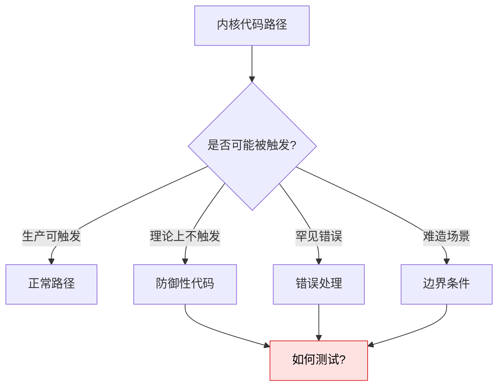
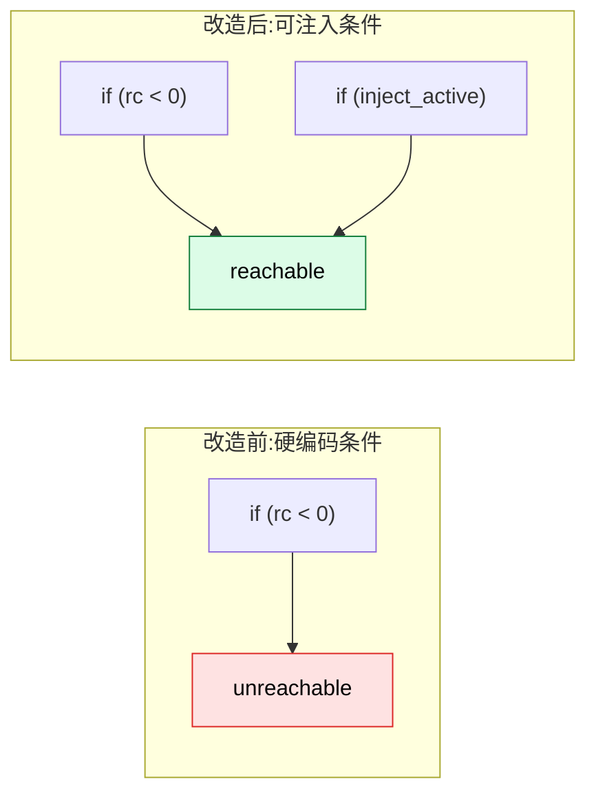
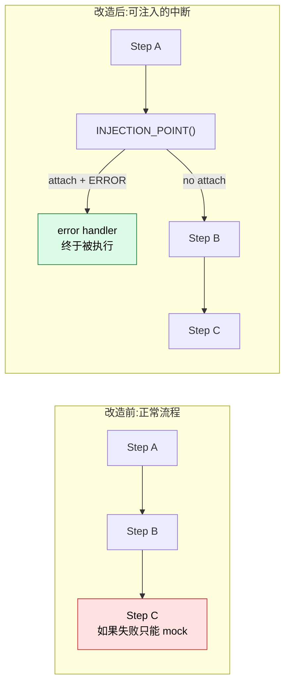
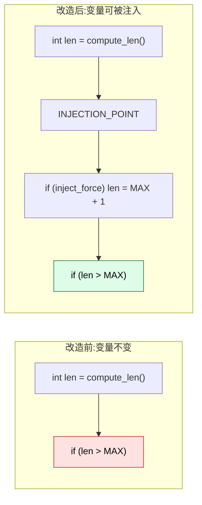
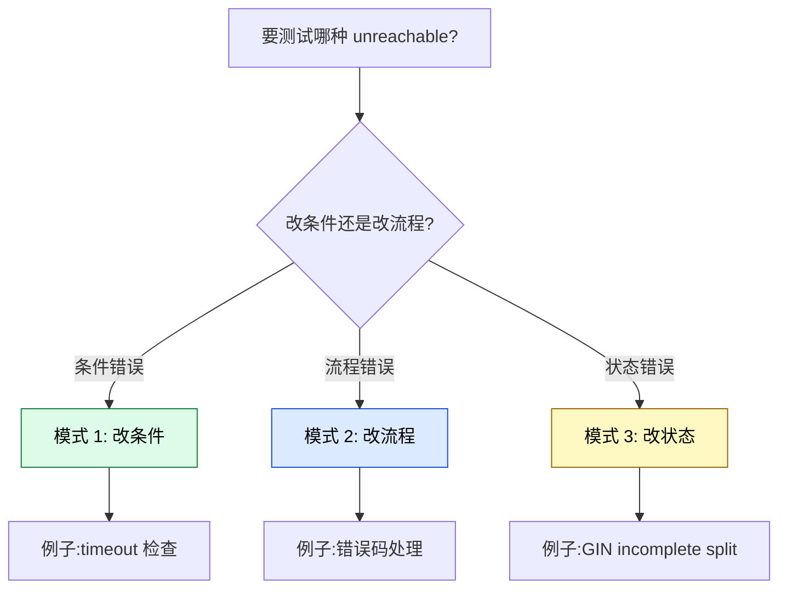
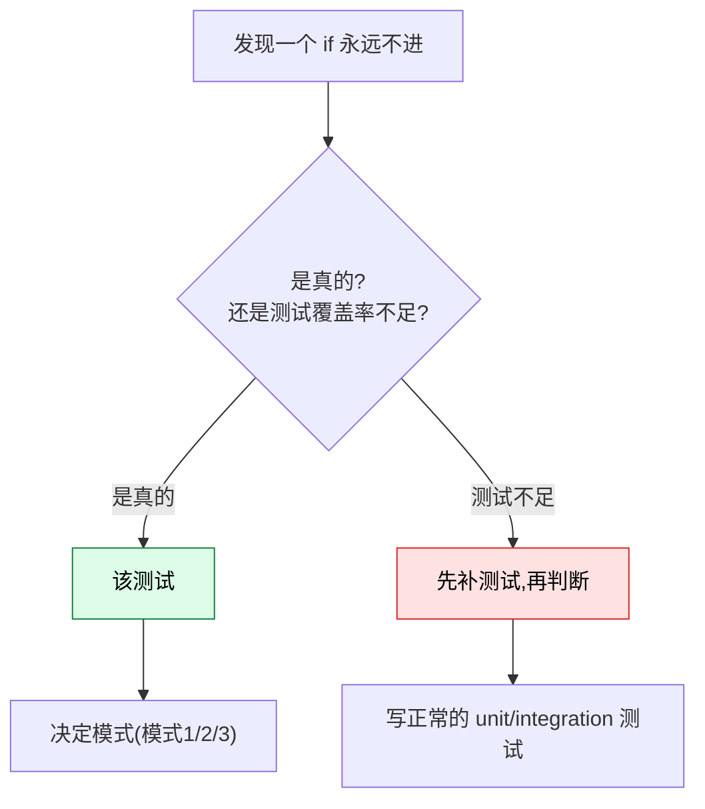
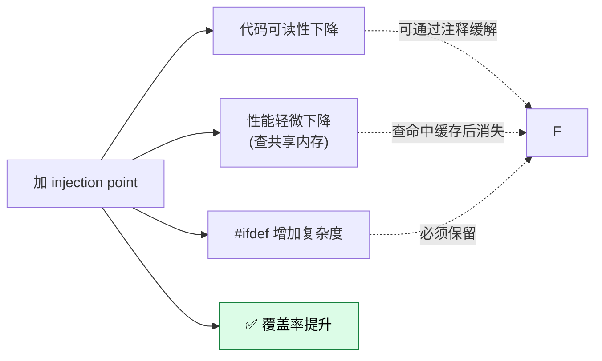

# 用 Injection Point 测试无法到达的代码路径:3 种改造模式 + 实战

> 配套源码:`~/cwork/postgresql`(基于 PG 18 主干)
>
> 配套前文:[PostgreSQL 18 Injection Point 完整指南](https://growdu.github.io/blog/db/postgresql/postgresql-injection-points/)
>
> 本文聚焦一个非常常见的内核测试难题:**代码里有 `if` 分支永远不会被执行**(防御性检查、罕见错误、难以造出的场景),**如何通过 injection point 把"无法到达"变成"可达"** 进行测试。
>
> 读完本文你会获得:
> 1. **3 种主流改造模式**(改条件、改流程、改状态)
> 2. **真实场景**演示:OOM、罕见错误码、防御性 NULL 检查、时间依赖路径
> 3. **PG 内核已有的 3 个典型实例**解读
> 4. **改造前 vs 改造后** 的对比模板
> 5. **最佳实践**与陷阱

---

## 一、问题的本质:为什么会有"无法到达"的代码?

先理解为什么会存在无法到达的 `if` 分支:



**4 类典型场景**:

| 场景 | 为什么无法到达 | 例子 |
|------|---------------|------|
| **防御性检查** | 理论上不该发生 | `if (!ptr) elog(ERROR, "should not happen")` |
| **罕见错误码** | 内核很少返回 | 系统调用返回 EIO、磁盘满、内存损坏 |
| **时间依赖** | 需要等很久 | `idle_replication_slot_timeout` 默认 0 |
| **崩溃恢复路径** | 需要模拟崩溃 | GIN incomplete split、损坏的 XLOG |

**传统测试方法的局限**:

- **gdb 断点**:只能本地调试,不能进回归测试套件
- **`#ifdef TEST`**:**需要重新编译**,每次改测试都要重 build
- **`raise(SIGSEGV)`**:真的崩溃,测试也跑不下去

**Injection Point 的优势**:**不需要重新编译 + 远程 SQL 控制 + 测试可重复**。

---

## 二、3 种核心改造模式

### 模式 1:**改条件** —— 让判定条件变为可注入的变量

**核心思想**:把硬编码的 `if (x < 0)` 改成 `if (x < 0 || injection_active)`,测试 attach 时强制进入分支。



### 模式 2:**改流程** —— 注入点直接改变控制流(`goto`)

**核心思想**:在关键路径前加 `INJECTION_POINT`,callback 中调用 `PG_THROW` / `ereport(ERROR)` / `pg_exit` 让流程短路到错误处理。



### 模式 3:**改状态** —— 让某个变量的状态在注入时变化

**核心思想**:`INJECTION_POINT` 之后,某个变量的值被 callback 修改为触发分支的版本。



---

## 三、实战案例 1:测试 OOM 路径

**场景**:`palloc()` 失败(返回 NULL)的处理路径,在正常运行时几乎不可能触发。

### 改造前

```c
// src/backend/utils/sort/sort_common.c(假设代码)
static SortTuple *
_make_sort_tuple(int tupindex, ...)
{
    SortTuple  *stup = (SortTuple *) palloc(sizeof(SortTuple));
    stup->tupindex = tupindex;
    ...
    return stup;
}
```

如果 `palloc` 失败,直接 segfault。**没法测试 OOM 路径**。

### 改造后

```c
// src/backend/utils/sort/sort_common.c(改造后)
static SortTuple *
_make_sort_tuple(int tupindex, ...)
{
    SortTuple  *stup;

    /* 测试用:注入点可以让 palloc 返回 NULL */
    INJECTION_POINT("sort-make-tuple-before-palloc", NULL);

    stup = (SortTuple *) palloc(sizeof(SortTuple));

    /* 注入点 2:进入 OOM 路径 */
    if (stup == NULL)
    {
        /* 这里就是 OOM 处理路径 */
        ereport(ERROR,
                (errcode(ERRCODE_OUT_OF_MEMORY),
                 errmsg("out of memory"),
                 errdetail("Failed while creating sort tuple.")));
    }
    ...
}
```

**测试 SQL**:

```sql
-- 1. attach 注入点(让 palloc 立刻返回)
-- 但我们这里 INJECTION_POINT 不会让 palloc 返回 NULL,
-- 它只是给 callback 一个机会修改 stup。
-- 真正的修改见模式 3。

SELECT injection_points_attach('sort-make-tuple-before-palloc', 'error');
DO $$ BEGIN PERFORM some_sort_op(); END $$;
-- ERROR:  error injected for injection point sort-make-tuple-before-palloc
SELECT injection_points_detach('sort-make-tuple-before-palloc');
```

### 模式 3 实战:让 `palloc` 真的返回 NULL

如果你需要 `palloc` **真的失败**,可以这样:

```c
static SortTuple *
_make_sort_tuple(int tupindex, ...)
{
    SortTuple  *stup;

    /* 注入点 + 条件判断 */
    bool force_oom = IS_INJECTION_POINT_ATTACHED("sort-force-oom");
    if (force_oom)
        return NULL;          // 模拟 OOM

    stup = (SortTuple *) palloc(sizeof(SortTuple));
    ...
}
```

源码位置:`src/include/utils/injection_point.h:24`。

```c
#define IS_INJECTION_POINT_ATTACHED(name) IsInjectionPointAttached(name)
```

⚠️ **`IS_INJECTION_POINT_ATTACHED` 有少量开销**——它会查共享内存。不在热路径反复调用。

---

## 四、实战案例 2:测试罕见错误码

**场景**:系统调用 `pread` 返回 `EIO`(磁盘 IO 错误)的处理路径。

### 改造前

```c
// src/backend/storage/file/buffile.c(假设)
char *
BufFileRead(BufFile *file, ...)
{
    int nbytes = pread(file->fd, ptr, len, file->offset);
    if (nbytes < 0)
    {
        /* errno == EIO */
        ereport(ERROR, ...);    /* 这就是错误处理路径 */
    }
    ...
}
```

正常 `pread` 不会失败,**EIO 路径无法到达**。

### 改造后:用 INJECTION_POINT + 自定义回调

```c
// 自定义 test module 的 callback
PGDLLEXPORT void
force_eio_callback(const char *name, const void *private_data, void *arg)
{
    /* 模拟 pread 返回 -1,errno = EIO */
    errno = EIO;
}
```

```c
// buffile.c(改造后)
char *
BufFileRead(BufFile *file, ...)
{
    int nbytes;

    /* 让 callback 有机会先设置 errno */
    INJECTION_POINT("buffile-read-before-pread", NULL);

    nbytes = pread(file->fd, ptr, len, file->offset);

    if (nbytes < 0)
    {
        /* EIO 处理路径:终于可达! */
        ereport(ERROR, (errcode(ERRCODE_IO_ERROR), ...));
    }
    ...
}
```

**测试 SQL**:

```sql
SELECT injection_points_attach('buffile-read-before-pread',
                               'force_eio_callback');  -- 用自定义回调
SELECT * FROM pg_read_server_files('...');
-- ERROR:  IO error ... (EIO 路径被触发了)
```

---

## 五、实战案例 3:测试时间依赖的"空闲超时"

**这是 PG 内核**实际**使用的模式** —— `slot.c::slot-timeout-inval`。

### 问题背景

源码位置:`src/backend/replication/slot.c:1780`。

```c
if (CanInvalidateIdleSlot(s))
{
    /*
     * 正常情况下,要等 idle_replication_slot_timeout(默认 0)才走这里
     * 测试时不可能等几小时
     */
    if (TimestampDifferenceExceedsSeconds(s->inactive_since, now,
                                         idle_replication_slot_timeout_secs))
    {
        *inactive_since = s->inactive_since;
        return RS_INVAL_IDLE_TIMEOUT;
    }
}
```

### 实际改造(参考 PG 源码)

```c
// src/backend/replication/slot.c:1788(实际代码)
#ifdef USE_INJECTION_POINTS
if (IS_INJECTION_POINT_ATTACHED("slot-timeout-inval"))
{
    *inactive_since = 0;     // since the beginning of time
    return RS_INVAL_IDLE_TIMEOUT;   // 直接返回,不检查时间
}
#endif

// 实际的时间检查
if (TimestampDifferenceExceedsSeconds(s->inactive_since, now,
                                      idle_replication_slot_timeout_secs))
{
    *inactive_since = s->inactive_since;
    return RS_INVAL_IDLE_TIMEOUT;
}
```

**测试效果**:

- 不 attach:走正常路径,等实际超时(几小时或几天)
- attach `slot-timeout-inval`:**立刻**返回 `RS_INVAL_IDLE_TIMEOUT`,不用等

**测试 SQL**:

```sql
-- 创建 slot
SELECT pg_create_logical_replication_slot('my_slot', 'test_decoding');

-- 立刻测试 slot invalidation(不等超时)
SELECT injection_points_attach('slot-timeout-inval', 'error');
SELECT pg_replication_slot_advance('my_slot', pg_current_wal_lsn());
-- 应该立即触发 slot invalidation

SELECT injection_points_detach('slot-timeout-inval');
```

### 模式总结

这个例子展示了 **"模式 1 + 模式 2 组合"**:

1. **模式 1**:加 `if (IS_INJECTION_POINT_ATTACHED(...))` 判定
2. **模式 2**:满足条件时**直接 return**,跳过正常逻辑,提前进入错误/特殊路径

---

## 六、实战案例 4:测试崩溃恢复路径(GIN incomplete split)

**这是 PG 内核最复杂的"模拟崩溃"模式**。

### 问题背景

源码位置:`src/backend/access/gin/ginbtree.c:680`。

GIN 索引在分裂过程中,如果**进程崩溃**,会留下"incomplete split"状态。下次启动时,代码会检查 `GinPageIsIncompleteSplit` 标记,**完成未完成的分裂**。

**正常情况下无法模拟这种状态**。

### PG 实际改造(模式 3)

源码 `ginbtree.c:680-690`:

```c
#ifdef USE_INJECTION_POINTS
if (GinPageIsLeaf(BufferGetPage(stack->buffer)))
    INJECTION_POINT("gin-leave-leaf-split-incomplete", NULL);
else
    INJECTION_POINT("gin-leave-internal-split-incomplete", NULL);
#endif
```

**机制**:

- 注入点**不立即产生效果**
- 但它在回调中可以执行:
  ```c
  PGDLLEXPORT void
  gin_incomplete_split_callback(const char *name, const void *private_data, void *arg)
  {
      GinBtreeStack *stack = (GinBtreeStack *) arg;
      GinPageSetIncompleteSplit(BufferGetPage(stack->buffer));   // 标记为 incomplete!
  }
  ```
- 然后**正常的分裂流程会**在后续检测到 incomplete 标记,**触发修复路径**

**完整流程**:

```mermaid
sequenceDiagram
    participant Test as 测试 SQL
    participant CB as Callback
    participant GIN as GIN split 流程

    Test->>GIN: BEGIN; INSERT INTO gin_index ...
    GIN->>GIN: 正常分裂
    GIN->>CB: INJECTION_POINT(name, arg=stack)
    CB->>GIN: GinPageSetIncompleteSplit(page)
    Note over GIN: 故意制造 incomplete 状态
    GIN->>GIN: 后续分裂路径会触发 ginFinishOldSplit
    Test->>Test: 验证修复路径是否执行
```

**测试 SQL**(参考 `src/test/modules/injection_points/expected/`):

```sql
-- 制造 incomplete split
SELECT injection_points_attach('gin-leave-leaf-split-incomplete', 'gin_incomplete_split');

-- 触发 GIN 分裂
INSERT INTO gin_test_table VALUES (...);

-- 验证 incomplete split 被检测到
SELECT pg_relation_size('gin_index');

-- 清理
SELECT injection_points_detach('gin-leave-leaf-split-incomplete');
```

---

## 七、3 种模式的对比与选型



**决策表**:

| 场景 | 推荐模式 | 理由 |
|------|---------|------|
| 时间/计数器触发的分支 | 模式 1 | `IS_INJECTION_POINT_ATTACHED()` + 直接 return |
| 系统调用返回罕见错误码 | 模式 2 + 自定义 callback | 让 callback 设置 errno |
| OOM、内存耗尽 | 模式 3 + callback 改指针 | callback 强制返回 NULL |
| 模拟崩溃后的状态 | 模式 3 + callback 改 page flag | callback 设 incomplete flag |
| 防御性检查 (`should not happen`) | 模式 2 + ERROR | 让 callback 报 ERROR 触发异常路径 |
| 罕见分支(`switch` case) | 模式 2 + callback 改参数 | callback 改 enum 值 |

---

## 八、改造的代码模板

### 模板 1:用 `IS_INJECTION_POINT_ATTACHED`

```c
// src/backend/xxx/yyy.c
#ifdef USE_INJECTION_POINTS
if (IS_INJECTION_POINT_ATTACHED("my-test-point"))
{
    /* 注入时执行的代码(通常是强制进入 unreachable 分支) */
    return ERROR_CODE_OR_SPECIAL_VALUE;
}
#endif

/* 正常的 unreachable 检查 */
if (extremely_rare_condition) {
    /* 不可达代码 */
}
```

**优点**:不需要重新编译(因为 `#ifdef USE_INJECTION_POINTS` 包起来,生产构建时被消除)

**缺点**:`IS_INJECTION_POINT_ATTACHED` 每次都查共享内存

### 模板 2:用 `INJECTION_POINT` + 自定义 callback

```c
// src/backend/xxx/yyy.c
INJECTION_POINT("my-test-point", arg);

normal_code_path();
```

```c
// 在 test module 里
PGDLLEXPORT void
my_test_callback(const char *name, const void *private_data, void *arg)
{
    /* 修改 arg 引用的变量 */
    *(int *) arg = -1;          // 制造错误码

    /* 或设置 flag */
    force_error = true;

    /* 或 ereport(ERROR) */
    ereport(ERROR, ...);
}
```

**优点**:灵活,可以做任意副作用

**缺点**:需要写 test module

### 模板 3:用 `INJECTION_POINT` 直接 ERROR

```c
INJECTION_POINT("my-test-point", NULL);
```

**SQL**:

```sql
SELECT injection_points_attach('my-test-point', 'error');
```

**优点**:**最简单**,不用写 C callback

**缺点**:只能模拟 ERROR,不能模拟 OOM、修改状态等

---

## 九、改造前的关键判断

### 9.1 这个 `if` 真的是 unreachable 吗?



> ⚠️ **很多"看起来 unreachable"的 `if` 其实是可以触发的**——只是测试用例没覆盖到。先补正常测试,再判断要不要用 injection point。

### 9.2 怎么判断改造值不值得?

| 评估维度 | 高价值场景 | 低价值场景 |
|---------|-----------|-----------|
| **错误影响** | 可能导致数据损坏/崩溃 | 只是返回 ERROR,无副作用 |
| **触发概率** | 真实生产可能发生 | 理论上不可能 |
| **测试可达性** | 难造场景 | 容易 mock |
| **代码重要性** | 核心代码 | 边角代码 |

**经验法则**:**PG 内核中已经有 injection point 的代码,几乎都是值得测试的**。

### 9.3 改造的副作用



---

## 十、最佳实践

### 10.1 命名规范

```c
INJECTION_POINT("my-feature-error-path");
INJECTION_POINT("my-feature-oom");
INJECTION_POINT("my-feature-rare-condition");
```

**格式**:`<模块>-<场景>-<条件>`,全小写,连字符分隔。

### 10.2 必须用 `#ifdef USE_INJECTION_POINTS` 包

```c
#ifdef USE_INJECTION_POINTS
if (IS_INJECTION_POINT_ATTACHED("my-point"))
    return ERROR;
#endif
```

否则未启用 injection point 的构建会编译报错(`IS_INJECTION_POINT_ATTACHED` 宏展开为 `elog(ERROR, ...)`)。

### 10.3 不要在注入点内做重操作

```c
// ❌ 不推荐:注入点内分配大量内存
INJECTION_POINT("my-point", NULL);
...  // 大操作

// ✅ 推荐:注入点只做"开关"
INJECTION_POINT("my-point", NULL);
if (inject_active) {
    // 触发分支
}
```

理由:**热路径上有 INJECTION_POINT 时,即使没 attach,也有少量开销**。

### 10.4 测试要清理

```sql
-- 测试开始:setup
SELECT injection_points_attach('my-point', '...');

-- 测试主体
DO $$ BEGIN ... END $$;

-- 测试结束:必须 cleanup
SELECT injection_points_detach('my-point');
```

或者用 `injection_points_set_local()` 让进程退出自动清理。

### 10.5 写 commit message 时说明意图

```text
Add injection point for testing X error path

The existing X() function has a defensive error check for [rare
condition] that cannot be triggered in normal test runs. This commit
adds an injection point that allows tests to exercise the error
handling code by attaching an error action.

The injection point is wrapped in #ifdef USE_INJECTION_POINTS and has
no overhead in production builds.
```

---

## 十一、PG 内核已有的 5 个典型实例对照

| 实例 | 文件 | 模式 | 用途 |
|------|------|------|------|
| `slot-timeout-inval` | `slot.c:1788` | 模式 1 | 跳过时间检查,立刻测试空闲超时 |
| `gin-leave-leaf-split-incomplete` | `ginbtree.c:688` | 模式 3 | 让 split 留下 incomplete flag,测试修复路径 |
| `heap_update-before-pin` | `heapam.c:3339` | 模式 2 | 模拟 update 失败,测试错误处理 |
| `backend-initialize-v2-error` | `backend_startup.c:238` | 模式 2 | 故意让 backend 启动失败 |
| `multixact-create-from-members` | `multixact.c:920` | 模式 2 | 测试 multixact 错误处理 |

源码位置:`src/include/utils/injection_point.h`。

---

## 十二、完整实战:改造一个具体的不可达代码

假设我们有这段 PG 风格代码:

```c
// src/backend/commands/vacuum.c(原始)
static void
vacuum_rel(Relation rel, ...)
{
    /* 检查 relkind */
    if (rel->rd_rel->relkind != RELKIND_RELATION &&
        rel->rd_rel->relkind != RELKIND_MATVIEW)
    {
        ereport(ERROR,
                (errcode(ERRCODE_WRONG_OBJECT_TYPE),
                 errmsg("relation "%s" is not a table or materialized view",
                        RelationGetRelationName(rel))));
    }
    
    /* 防御性:如果之前检查过 relkind,这里不该进 */
    if (!RelationIsValid(rel))          // ← 几乎不可能为真
        elog(ERROR, "relation became invalid during vacuum");  // ← 不可达
}
```

### 改造

```c
// src/backend/commands/vacuum.c(改造后)
#include "utils/injection_point.h"

static void
vacuum_rel(Relation rel, ...)
{
    /* 正常检查 */
    if (rel->rd_rel->relkind != RELKIND_RELATION &&
        rel->rd_rel->relkind != RELKIND_MATVIEW)
    {
        ereport(ERROR, ...);
    }

    /* 测试用:让 RelationIsValid 返回 false */
    INJECTION_POINT("vacuum-rel-before-validity-check", NULL);

    /* 防御性检查 */
#ifdef USE_INJECTION_POINTS
    if (IS_INJECTION_POINT_ATTACHED("vacuum-rel-force-invalid"))
    {
        elog(ERROR, "relation became invalid during vacuum (forced by injection point)");
    }
#endif
    if (!RelationIsValid(rel))
        elog(ERROR, "relation became invalid during vacuum");
}
```

**测试 SQL**:

```sql
-- 准备
CREATE TABLE foo (id int);
SELECT injection_points_attach('vacuum-rel-force-invalid', 'error');

-- 触发
VACUUM foo;
-- ERROR:  relation became invalid during vacuum (forced by injection point)

-- 清理
SELECT injection_points_detach('vacuum-rel-force-invalid');
```

---

## 十三、源码速查

| 关注点 | 文件 | 行/位置 |
|--------|------|---------|
| 头文件 | `src/include/utils/injection_point.h` | 全文 |
| 注入点实现 | `src/backend/utils/misc/injection_point.c` | 全文 |
| 模式 1 实例:`slot-timeout-inval` | `src/backend/replication/slot.c` | L1788-1794 |
| 模式 3 实例:`gin-leave-leaf-split-incomplete` | `src/backend/access/gin/ginbtree.c` | L686-690 |
| 模式 2 实例:`heap_update-before-pin` | `src/backend/access/heap/heapam.c` | L3339 |
| 模式 2 实例:`backend-initialize-v2-error` | `src/backend/tcop/backend_startup.c` | L238 |
| 临界区实例:`multixact-create-from-members` | `src/backend/access/transam/multixact.c` | L904, L920 |
| 测试框架 | `src/test/modules/injection_points/` | 全文 |

---

## 十四、参考

- 配套前文:[PostgreSQL 18 Injection Point 完整指南](https://growdu.github.io/blog/db/postgresql/postgresql-injection-points/)
- PG 源码:`~/cwork/postgresql`
- 关键实例源码:
  - `src/backend/replication/slot.c:1788-1794` —— 模式 1 经典
  - `src/backend/access/gin/ginbtree.c:680-690` —— 模式 3 经典
  - `src/backend/access/transam/multixact.c:920` —— 临界区模式
