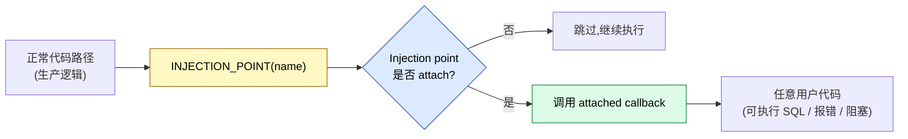
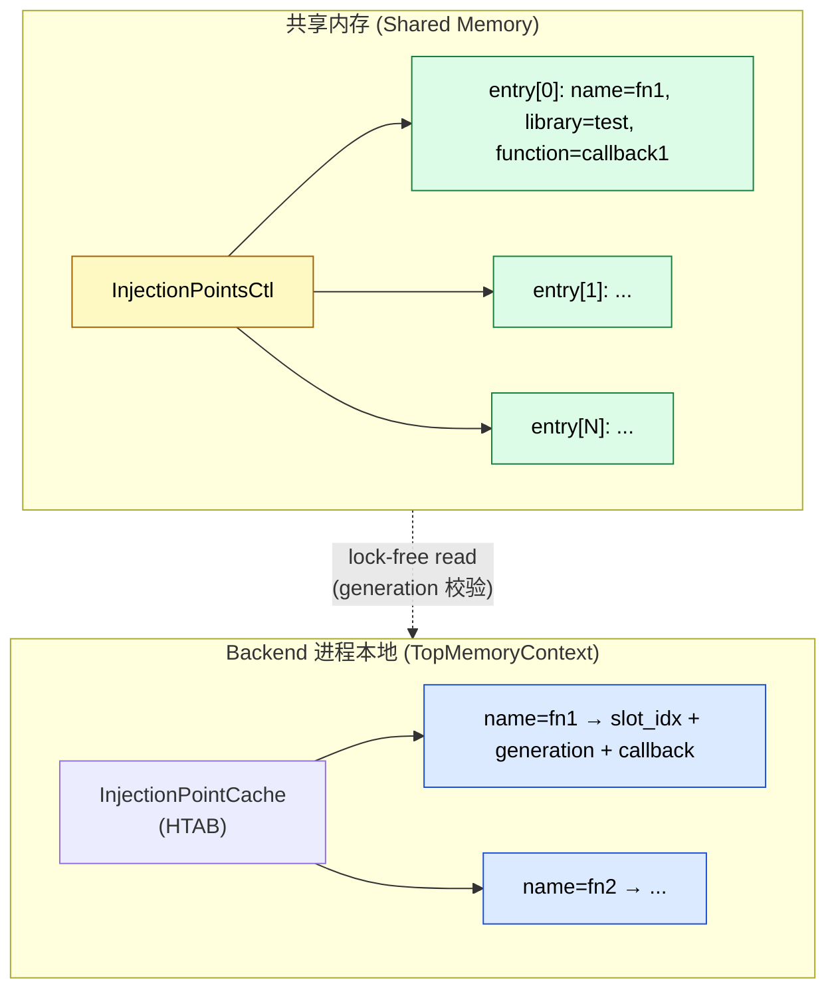
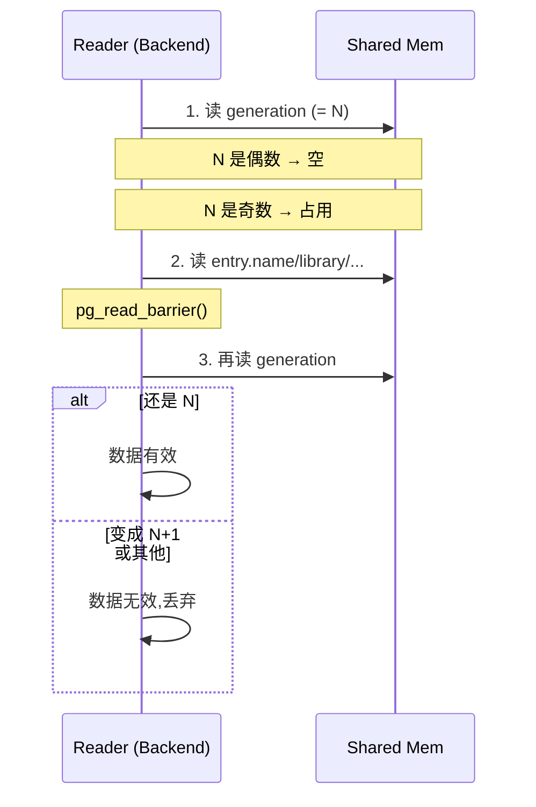
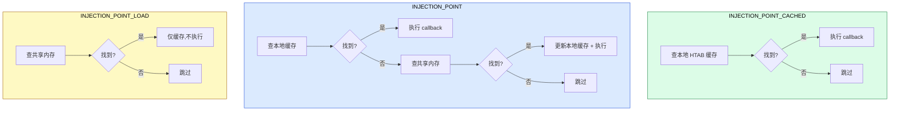
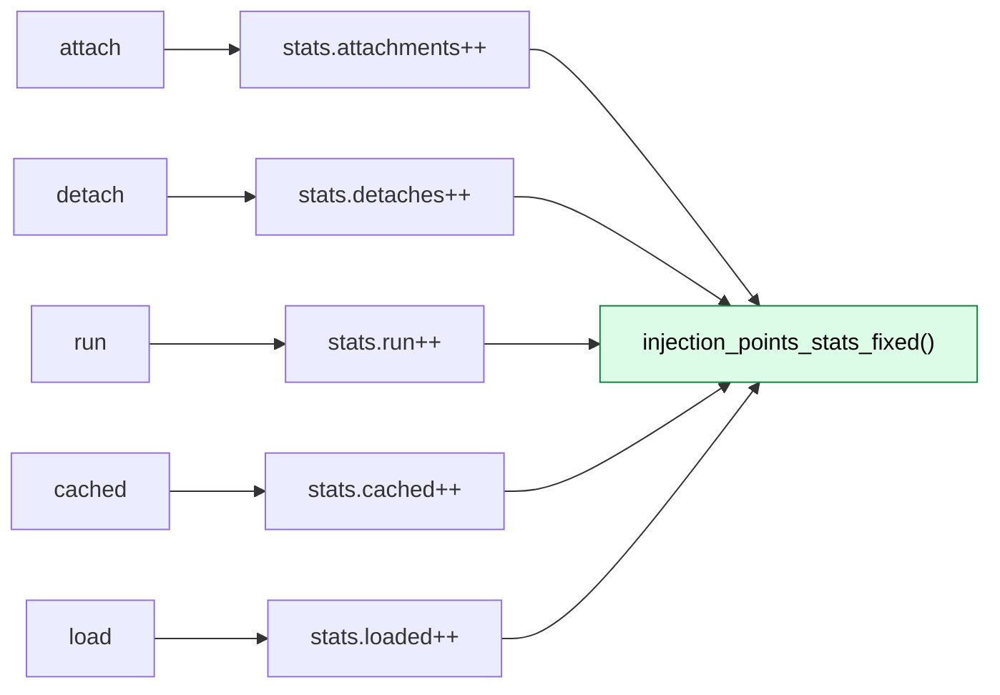
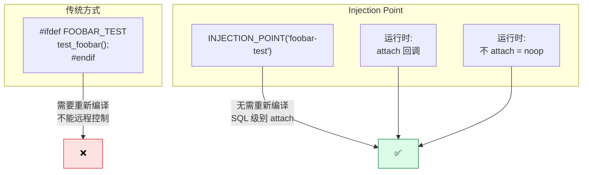

# PostgreSQL 18 Injection Point 完整指南:原理、API 与实战

> 配套源码:`~/cwork/postgresql`(基于 PG 18 主干)
>
> 本文聚焦 PG 18 引入的内核级 **Injection Point 框架**——一个让测试代码可以在 **指定代码路径** 上触发任意回调的机制。读完本文你会获得:
>
> 1. Injection Point 的 **完整架构原理**(共享内存 + 本地缓存 + generation 协议)
> 2. **API 全集**(`InjectionPointAttach / Detach / Run / Load / Cached`)
> 3. PG 内核已有的 **18+ 个内置注入点** 一览
> 4. **3 种调用宏** 的适用场景与差异
> 5. **实战**:如何添加自定义注入点、写异步测试、注入错误路径
> 6. **lock-free 协议** 解读
> 7. **统计系统** 与监控

---

## 一、什么是 Injection Point?

Injection Point 是 PG 17/18 强化的 **运行时测试钩子**(runtime test hook)。它让测试代码可以在内核的 **指定代码路径** 上,触发 **任意自定义回调**——而且这一切都在生产代码路径中,**零侵入、可移除、可控制**。



**典型用途**:

| 场景 | 例子 |
|------|------|
| **异步测试** | 测试 multixact 创建时让另一个进程 wait |
| **错误注入** | 故意让某条 UPDATE 报错,测试 apply 错误处理 |
| **暂停执行** | 模拟 checkpoint 慢、wal-removal 卡住 |
| **并发协调** | 让两个后端在关键代码点同步 |
| **运行时追踪** | 不修改源码就能打印关键路径数据 |

> 📌 **不是 gdb 断点**,是 **生产代码内置的、可远程控制的钩子**。

---

## 二、构建要求

Injection Point 默认 **未启用**。需要显式 configure:

```bash
cd ~/cwork/postgresql
./configure --enable-injection-points [other options]
make -j$(nproc)
```

**验证是否启用**:

```bash
# 编译时
grep USE_INJECTION_POINTS src/include/pg_config.h
# 应看到:#define USE_INJECTION_POINTS 1

# 运行时
psql -c "SELECT * FROM pg_available_extensions WHERE name = 'injection_points';"
# 应能看到
```

源码 `src/include/utils/injection_point.h:13`:

```c
/*
 * Injection points require --enable-injection-points.
 */
#ifdef USE_INJECTION_POINTS
#define INJECTION_POINT_LOAD(name) InjectionPointLoad(name)
#define INJECTION_POINT(name, arg) InjectionPointRun(name, arg)
#define INJECTION_POINT_CACHED(name, arg) InjectionPointCached(name, arg)
#define IS_INJECTION_POINT_ATTACHED(name) IsInjectionPointAttached(name)
#else
#define INJECTION_POINT_LOAD(name) ((void) name)
#define INJECTION_POINT(name, arg) ((void) name)
#define INJECTION_POINT_CACHED(name, arg) ((void) name)
#define IS_INJECTION_POINT_ATTACHED(name) (false)
#endif
```

**关键点**:

- **未启用时宏展开为 `((void) name)`**——生产构建零开销
- **启用时宏展开为函数调用**——开销仅当 attach 时才产生

---

## 三、架构原理

### 3.1 共享内存 + 本地缓存 + lock-free 协议

源码位置:`src/backend/utils/misc/injection_point.c`。



**每个 entry 的结构**:

```c
// src/backend/utils/misc/injection_point.c:41
typedef struct InjectionPointEntry
{
    pg_atomic_uint64 generation;       // 偶数=空,奇数=占用
    char        name[64];
    char        library[128];
    char        function[128];
    char        private_data[1024];    // opaque,传给回调
} InjectionPointEntry;

#define MAX_INJECTION_POINTS 128
```

**关键设计**:

1. **共享内存数组**(`entries[128]`):所有 backend 可见
2. **本地缓存**(HTAB in TopMemoryContext):避免每次查共享内存
3. **lock-free 读**:通过 `pg_atomic_uint64 generation` 计数器
4. **写需要 LWLock**(`InjectionPointLock`)

### 3.2 lock-free 协议

源码位置:`src/backend/utils/misc/injection_point.c:41-58`(注释完整)。

```c
/*
 * Because injection points need to be usable without LWLocks, we use a
 * generation counter on each entry to allow safe, lock-free reading.
 *
 * To read an entry, first read the current 'generation' value.  If it's
 * even, then the slot is currently unused, and odd means it's in use.
 * When reading the other fields, beware that they may change while
 * reading them, if the entry is released and reused!  After reading the
 * other fields, read 'generation' again: if its value hasn't changed, you
 * can be certain that the other fields you read are valid.  Otherwise,
 * the slot was concurrently recycled, and you should ignore it.
 *
 * When adding an entry, you must store all the other fields first, and
 * then update the generation number, with an appropriate memory barrier
 * in between. In addition to that protocol, you must also hold
 * InjectionPointLock, to prevent two backends from modifying the array at
 * the same time.
 */
pg_atomic_uint64 generation;
```

**读取协议**(3 步):



**写入协议**:

```c
// 写所有字段
strlcpy(entry->name, ...);
strlcpy(entry->library, ...);
strlcpy(entry->function, ...);
memcpy(entry->private_data, ...);

// 写屏障,确保前面都可见
pg_write_barrier();

// generation +1
pg_atomic_write_u64(&entry->generation, generation + 1);
```

### 3.3 为什么 lock-free?

**核心场景**:某些 injection point 会在 **临界区(持锁状态)调用**。

例如源码位置:`src/backend/access/transam/multixact.c:920`:

```c
// src/backend/access/transam/multixact.c:920
INJECTION_POINT_CACHED("multixact-create-from-members", NULL);
```

如果在临界区中 **获取 LWLock 查共享内存**,会**自死锁**。所以 InjectionPointRun 路径完全 lock-free——只读共享内存 + 本地缓存。

**两种缓存**:

| 宏 | 调用路径 | 适用场景 |
|----|---------|---------|
| `INJECTION_POINT(name, arg)` | 查共享内存 → 缓存 → 执行 | 通用路径 |
| `INJECTION_POINT_CACHED(name, arg)` | 直接查本地缓存 → 执行 | **临界区**(不允许分配内存) |

---

## 四、API 全集

### 4.1 C API

源码位置:`src/include/utils/injection_point.h`、`src/backend/utils/misc/injection_point.c`。

| 函数 | 用途 |
|------|------|
| `InjectionPointAttach(name, library, function, private_data, private_data_size)` | 注册一个新的注入点 |
| `InjectionPointDetach(name)` | 移除注入点,返回 bool |
| `InjectionPointRun(name, arg)` | 执行注入点(查共享内存 → 缓存 → 回调) |
| `InjectionPointLoad(name)` | 仅加载到本地缓存,不执行(预热) |
| `InjectionPointCached(name, arg)` | 仅从本地缓存执行(lock-free 路径) |
| `IsInjectionPointAttached(name)` | 检查注入点是否已注册 |
| `InjectionPointShmemSize()` | 共享内存大小 |
| `InjectionPointShmemInit()` | 共享内存初始化 |

### 4.2 宏(代码路径内调用)

源码位置:`src/include/utils/injection_point.h:16`。

```c
#define INJECTION_POINT_LOAD(name)        InjectionPointLoad(name)
#define INJECTION_POINT(name, arg)        InjectionPointRun(name, arg)
#define INJECTION_POINT_CACHED(name, arg) InjectionPointCached(name, arg)
#define IS_INJECTION_POINT_ATTACHED(name) IsInjectionPointAttached(name)
```

**三种调用宏的差异**:



**选择原则**:

| 场景 | 推荐宏 |
|------|--------|
| 通用路径,可能分配内存 | `INJECTION_POINT` |
| 临界区(持锁、内存受限) | `INJECTION_POINT_CACHED` |
| 需要预热,避免首次 hit 时延迟 | `INJECTION_POINT_LOAD` |
| 仅判断是否 attach | `IS_INJECTION_POINT_ATTACHED` |

---

## 五、源码内置的注入点

PG 18 内核已有 **18+ 个内置注入点**。下面是按模块整理的全表:

### 5.1 事务与多事务

| 注入点 | 文件 | 行 | 用途 |
|--------|------|-----|------|
| `multixact-create-from-members` | `multixact.c` | L904 / L920 | 测试 multixact 创建(`LOAD` + `CACHED`) |

源码 `src/backend/access/transam/multixact.c:920`:

```c
INJECTION_POINT_CACHED("multixact-create-from-members", NULL);
```

### 5.2 WAL 与 checkpoint

| 注入点 | 文件 | 行 | 用途 |
|--------|------|-----|------|
| `checkpoint-before-old-wal-removal` | `xlog.c` | L7351 | 测试 checkpoint 慢 |
| `create-restart-point` | `xlog.c` | L7737 | 测试 restart point |
| `restartpoint-before-slot-invalidation` | `xlog.c` | L7815 | 测试 restartpoint 时槽失效 |

### 5.3 Heap 与索引

| 注入点 | 文件 | 行 | 用途 |
|--------|------|-----|------|
| `heap_update-before-pin` | `heapam.c` | L3339 | 测试 heap update 路径 |
| `heap_lock_updated_tuple` | `heapam.c` | L6052 | 测试行锁升级 |
| `inplace-before-pin` | `genam.c` | L854 | 测试 inplace update |
| `gin-leave-leaf-split-incomplete` | `ginbtree.c` | L688 | 测试 GIN leaf split 失败 |
| `gin-leave-internal-split-incomplete` | `ginbtree.c` | L690 | 测试 GIN internal split 失败 |
| `gin-finish-incomplete-split` | `ginbtree.c` | L781 | 测试 GIN 续 split |

### 5.4 后台进程与生命周期

| 注入点 | 文件 | 行 | 用途 |
|--------|------|-----|------|
| `autovacuum-worker-start` | `autovacuum.c` | L1921 | 测试 autovacuum 启动 |
| `backend-initialize` | `backend_startup.c` | L237 | 测试 backend 启动 |
| `backend-initialize-v2-error` | `backend_startup.c` | L238 | 故意让 backend 启动失败 |

源码 `src/backend/tcop/backend_startup.c:236-238`:

```c
#ifdef USE_INJECTION_POINTS
INJECTION_POINT("backend-initialize", NULL);
if (IS_INJECTION_POINT_ATTACHED("backend-initialize-v2-error"))
    elog(ERROR, "error from injection point");
#endif
```

### 5.5 超时机制

源码 `src/backend/tcop/postgres.c:3484-3510`:

```c
INJECTION_POINT("idle-in-transaction-session-timeout", NULL);
INJECTION_POINT("transaction-timeout", NULL);
INJECTION_POINT("idle-session-timeout", NULL);
```

### 5.6 复制与槽管理

| 注入点 | 文件 | 行 | 用途 |
|--------|------|-----|------|
| `slot-timeout-inval` | `slot.c` | L1794 | 测试槽超时失效 |
| `logical-replication-slot-advance-segment` | `logical.c` | L1901 | 测试逻辑复制槽推进 |

---

## 六、实战:通过 extension 测试框架使用

源码位置:`src/test/modules/injection_points/`。

### 6.1 创建 extension

源码 `src/test/modules/injection_points/injection_points.control`:

```
comment = 'Test code for injection points'
default_version = '1.0'
module_pathname = '$libdir/injection_points'
relocatable = true
```

**使用**:

```sql
CREATE EXTENSION injection_points;
```

这会注册 9 个 SQL 函数(`injection_points--1.0.sql`):

| 函数 | 用途 |
|------|------|
| `injection_points_attach(name, action)` | attach 一个注入点 |
| `injection_points_load(name)` | 预热缓存 |
| `injection_points_run(name, arg)` | 触发 |
| `injection_points_cached(name, arg)` | 从缓存触发 |
| `injection_points_wakeup(name)` | 唤醒等待的注入点 |
| `injection_points_set_local()` | 标记为本地(进程退出时自动清理) |
| `injection_points_detach(name)` | 移除 |
| `injection_points_stats_numcalls(name)` | 读取统计 |
| `injection_points_stats_fixed()` | 读取固定计数 |

### 6.2 SQL 示例:触发一个注入点

源码 `injection_points--1.0.sql`:

```sql
-- 创建一个 ERROR 类型的注入点
SELECT injection_points_attach('my-custom-point', 'error');

-- 触发
SELECT injection_points_run('my-custom-point');
-- ERROR:  error injected for injection point my-custom-point

-- 清理
SELECT injection_points_detach('my-custom-point');
```

### 6.3 异步测试:wait + wakeup 协议

源码 `injection_points.c` 中实现的 `injection_wait` callback:

```c
// src/test/modules/injection_points/injection_points.c
static void
injection_wait(const char *name, const void *private_data, void *arg)
{
    /* 阻塞,直到 injection_points_wakeup() 被调用 */
    ConditionVariablePrepareSleep();
    while (true)
    {
        SpinLockAcquire(&inj_state->lock);
        for (int i = 0; i < INJ_MAX_WAIT; i++)
        {
            if (strcmp(name, inj_state->name[i]) == 0 &&
                inj_state->wait_counts[i] > 0)
            {
                inj_state->wait_counts[i]--;
                SpinLockRelease(&inj_state->lock);
                ConditionVariableCancelSleep();
                return;
            }
        }
        SpinLockRelease(&inj_state->lock);

        ConditionVariableSleep(&inj_state->wait_point);
    }
}
```

**测试 SQL 流程**:

```sql
-- 会话 A:启动注入点,等待
SELECT injection_points_attach('test-wait', 'wait');
SELECT pg_sleep(0);  -- 让出 CPU

-- 会话 B:唤醒会话 A
SELECT injection_points_wakeup('test-wait');

-- 清理
SELECT injection_points_detach('test-wait');
```

### 6.4 本地化注入点(并发安全)

源码 `injection_points.c::injection_points_set_local()`:

```c
PG_FUNCTION_INFO_V1(injection_points_set_local);
Datum
injection_points_set_local(PG_FUNCTION_ARGS)
{
    /* 标记后续注入点只在当前进程生效 */
    injection_point_local = true;

    /* 注册进程退出钩子,自动清理 */
    before_shmem_exit(injection_points_cleanup, (Datum) 0);
    ...
}
```

**SQL**:

```sql
SELECT injection_points_set_local();
SELECT injection_points_attach('my-point', 'notice');
-- 现在 'my-point' 只在当前 session 有效
-- 进程退出时自动清理
```

**用途**:**让并行测试套件不互相干扰**(每个 backend 的注入点只对自己有效)。

源码 `injection_points.c::InjectionPointCondition`:

```c
typedef struct InjectionPointCondition
{
    InjectionPointConditionType type;  // ALWAYS 或 PID
    int pid;
} InjectionPointCondition;
```

---

## 七、实战:在内核代码中添加自定义注入点

### 7.1 需求

假设我们在 `xlog.c` 的某个新代码路径想测试,需要添加:

```c
INJECTION_POINT("my-feature-critical-section", NULL);
```

### 7.2 Step 1:添加宏调用

```c
// src/backend/access/transam/xlog.c
void
MyNewFunction(void)
{
    ...
    /* 关键路径开始 */
    INJECTION_POINT("my-feature-critical-section", NULL);
    ...
}
```

### 7.3 Step 2:让 attach 生效(开发环境)

```bash
# 在测试 SQL 里
SELECT injection_points_attach('my-feature-critical-section', 'error');
-- 此时任何进入 MyNewFunction 的进程都会报错

# 清理
SELECT injection_points_detach('my-feature-critical-section');
```

### 7.4 Step 3:提交 commit message 模板

```text
Add injection point 'my-feature-critical-section' in xlog.c

This adds a runtime hook for testing critical section behavior in
MyNewFunction(). The injection point is a no-op unless --enable-injection-points
is configured and a callback is attached via InjectionPointAttach().

This is intended for regression tests only and has no production behavior.
```

---

## 八、实战:用 C 写自定义回调

### 8.1 注册回调函数

```c
// 在你的测试 module 中
#include "postgres.h"
#include "fmgr.h"
#include "utils/injection_point.h"

PG_MODULE_MAGIC;

PGDLLEXPORT void
my_custom_callback(const char *name,
                   const void *private_data,
                   void *arg)
{
    /* 这里可以任意操作 */
    ereport(WARNING,
            (errmsg(" my custom callback triggered for %s", name),
             errdetail("private_data = %p", private_data)));

    /* 可以调用 ereport(ERROR) 模拟错误 */
    /* 可以调用 ConditionVariableSleep 模拟阻塞 */
}
```

### 8.2 暴露为 SQL 函数

```c
PG_FUNCTION_INFO_V1(my_attach);
Datum
my_attach(PG_FUNCTION_ARGS)
{
    char *name = text_to_cstring(PG_GETARG_TEXT_PP(0));

    InjectionPointAttach(name,
                        "my_test_module",      // library name
                        "my_custom_callback",  // function name
                        NULL, 0);
    PG_RETURN_VOID();
}
```

### 8.3 SQL 文件

```sql
-- my_test_module--1.0.sql
CREATE FUNCTION my_attach(name TEXT) RETURNS void
AS 'MODULE_PATHNAME', 'my_attach'
LANGUAGE C STRICT;

-- 使用
SELECT my_attach('heap_lock_updated_tuple');
```

---

## 九、PG 内核测试套件中的实际例子

源码位置:`src/test/modules/injection_points/sql/injection_points.sql`。

**典型测试模式**:

```sql
-- 1. 创建注入点(让某段代码报错)
SELECT injection_points_attach('my_point', 'error');

-- 2. 执行触发的操作(应当报错)
\set VERBOSITY verbose
DO $$ BEGIN PERFORM my_op(); END $$;
-- ERROR:  error injected for injection point my_point

-- 3. 验证错误确实发生
SELECT ...;

-- 4. 清理
SELECT injection_points_detach('my_point');
```

---

## 十、统计系统

源码位置:`src/test/modules/injection_points/injection_stats.c`。



**SQL 查看**:

```sql
SELECT * FROM injection_points_stats_fixed();
--  numattach | numdetach | numrun | numcached | numloaded
-- -----------+-----------+--------+-----------+-----------
--         3  |        1  |    5   |         0 |         2

SELECT injection_points_stats_numcalls('my_point');
-- 7
```

源码 `injection_stats.c` 的 `PgStatShared_InjectionPoint`:

```c
typedef struct PgStatShared_InjectionPoint
{
    PgStatShared_Common header;
    PgStat_StatInjEntry stats;   // numcalls
} PgStatShared_InjectionPoint;
```

---

## 十一、注意事项

### 11.1 内存限制

源码 `src/backend/utils/misc/injection_point.c:73`:

```c
#define MAX_INJECTION_POINTS 128
```

**最多 128 个并发注入点**——超出会报 `too many injection points`。

### 11.2 名字长度限制

源码 `src/backend/utils/misc/injection_point.c:36`:

```c
#define INJ_NAME_MAXLEN     64
#define INJ_LIB_MAXLEN      128
#define INJ_FUNC_MAXLEN     128
#define INJ_PRIVATE_MAXLEN  1024
```

**字段长度超限**会报 `injection point name too long`。

### 11.3 同一名字的注入点只能 attach 一次

源码 `src/backend/utils/misc/injection_point.c:316`:

```c
else if (strcmp(entry->name, name) == 0)
    elog(ERROR, "injection point "%s" already defined", name);
```

### 11.4 二进制协议层无影响

`INJECTION_POINT` 宏只在内核代码路径生效,**不影响 SQL 协议层**。

### 11.5 未启用构建的零开销

源码 `src/include/utils/injection_point.h:20`:

```c
#else
#define INJECTION_POINT(name, arg) ((void) name)
#define INJECTION_POINT_CACHED(name, arg) ((void) name)
```

宏直接展开成 `(void) name`,**编译器会消除**。

### 11.6 临界区的限制

`INJECTION_POINT_CACHED` 只能在 **已 load 过** 的注入点用,否则本地缓存找不到,直接跳过。源码 `src/backend/utils/misc/injection_point.c:566`:

```c
void
InjectionPointCached(const char *name, void *arg)
{
    InjectionPointCacheEntry *cache_entry;

    cache_entry = injection_point_cache_get(name);
    if (cache_entry)
        cache_entry->callback(name, cache_entry->private_data, arg);
    /* 找不到直接跳过,不报错 */
}
```

**对策**:在临界区前调用 `INJECTION_POINT_LOAD(name)` 预热。

### 11.7 跨进程 attach

源码 `src/backend/utils/misc/injection_point.c:289`(参数校验):

```c
if (strlen(library) >= INJ_LIB_MAXLEN)
    elog(ERROR, "injection point library %s too long...");
```

`library` 是 **PG 共享库名**(不是文件路径),比如 `injection_points`。attach 时通过 `load_external_function()` 动态加载并解析 `function` 符号。

---

## 十二、与传统测试钩子的对比



**核心优势**:

| 维度 | 传统 #ifdef | Injection Point |
|------|------------|----------------|
| 重新编译 | 需要 | **不需要** |
| 远程控制 | 不行 | **SQL 即可** |
| 异步测试 | 困难 | **wait/wakeup 协议** |
| 错误注入 | 不便 | **callback 内 ereport** |
| 并发安全 | 困难 | **本地化 + PID 过滤** |
| 性能影响 | 编译期 | 运行时,attach 时才有 |

---

## 十三、源码速查

| 关注点 | 文件 | 行/函数 |
|--------|------|---------|
| 头文件 | `src/include/utils/injection_point.h` | 全文 |
| 实现 | `src/backend/utils/misc/injection_point.c` | 全文 |
| `InjectionPointEntry` 结构 | `injection_point.c` | L41 |
| `InjectionPointsCtl` 结构 | `injection_point.c` | L83 |
| `InjectionPointAttach` | `injection_point.c` | L273 |
| `InjectionPointDetach` | `injection_point.c` | L362 |
| `InjectionPointCacheRefresh` | `injection_point.c` | L417 |
| `InjectionPointRun` | `injection_point.c` | L545 |
| `InjectionPointCached` | `injection_point.c` | L566 |
| `IsInjectionPointAttached` | `injection_point.c` | L579 |
| 测试 extension | `src/test/modules/injection_points/` | 全文 |
| 9 个 SQL 函数 | `injection_points--1.0.sql` | 全文 |
| 多事务注入点 | `src/backend/access/transam/multixact.c` | L904, L920 |
| Checkpoint 注入点 | `src/backend/access/transam/xlog.c` | L7351, L7737, L7815 |
| Heap 注入点 | `src/backend/access/heap/heapam.c` | L3339, L6052 |
| GIN 注入点 | `src/backend/access/gin/ginbtree.c` | L686, L781 |
| Autovacuum 注入点 | `src/backend/postmaster/autovacuum.c` | L1921 |
| Backend 启动注入点 | `src/backend/tcop/backend_startup.c` | L236-238 |
| 逻辑复制注入点 | `src/backend/replication/logical/logical.c` | L1901 |

---

## 十四、参考

- PG 源码:`~/cwork/postgresql`
- `src/test/modules/injection_points/` —— 完整的测试用例
- `src/include/utils/injection_point.h` —— API 定义
- `src/backend/utils/misc/injection_point.c` —— 实现细节 + 大量注释
- [PostgreSQL 17 release notes - Injection Points](https://www.postgresql.org/docs/release/17.0/) (PG 17 引入强化)
- [PostgreSQL Wiki - Testing with Injection Points](https://wiki.postgresql.org/wiki/Injection_Points)
