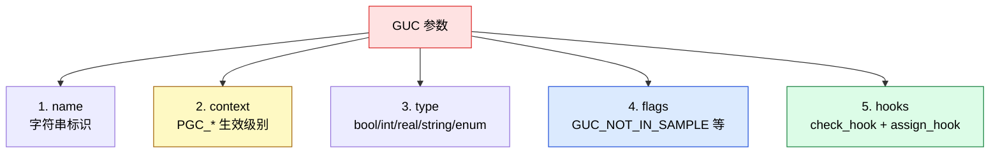
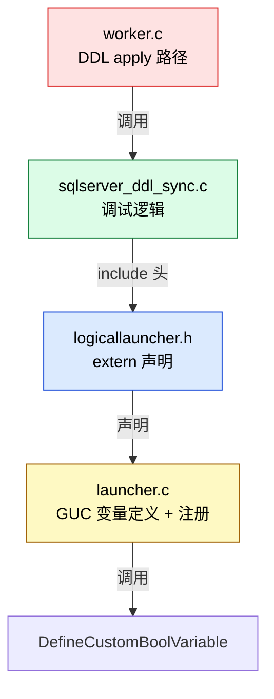
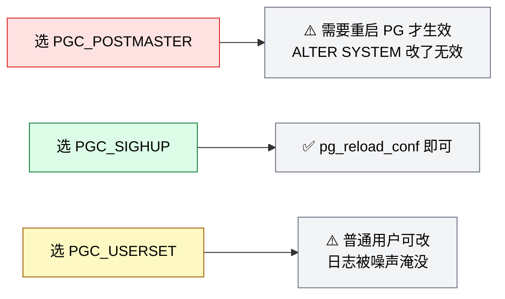

# 从内核开发者视角,在 PostgreSQL 18 逻辑复制中新增一个 GUC 参数

> 配套源码:`~/cwork/postgresql`(基于 PG 18 主干)
>
> **示例场景**:Babelfish 兼容项目需要在逻辑复制 **SQL Server 风格 DDL 同步**过程中开启调试日志。我们要新增 `enable_sqlserver_ddl_sync_debug` 这个 bool GUC,默认 `false`,SIGHUP 可改。
>
> 读完本文你会获得:
> 1. PG GUC 的 **5 个核心参数** 设计(为何选 PGC_SIGHUP、为何带 GUC_NOT_IN_SAMPLE)
> 2. **从声明到注册的完整链路**:头文件、外部变量、`DefineCustomBoolVariable` 调用
> 3. 在源码 **DDL 同步关键路径**插入调试分支的标准方式
> 4. **编译 + 验证 + 提交** 的端到端流程
> 5. **避坑清单**:context 选错、变量未初始化、热加载时序等

---

## 一、先理解 PG GUC 的本质

PG 的 GUC(Grand Unified Configuration)是 **一切配置参数的总称**。在内核开发者眼里,一个 GUC 由 5 部分组成:



### 1.1 Context(生效级别)

源码位置:`src/include/utils/guc.h:71-79`。

```c
typedef enum
{
    PGC_INTERNAL,    // 内置,不可改
    PGC_POSTMASTER,  // 启动时读,改需重启
    PGC_SIGHUP,      // reload 可改
    PGC_SU_BACKEND,  // backend 启动时改
    PGC_BACKEND,     // backend 启动时改(无 superuser)
    PGC_SUSET,       // 超级用户可改
    PGC_USERSET,     // 普通用户可改
} GucContext;
```

**层级关系**(数字越大权限越宽):


### 1.2 Flags(标记位)

源码位置:`src/include/utils/guc.h`(定义集合)。

常用:

| Flag | 含义 |
|------|------|
| `GUC_NOT_IN_SAMPLE` | 不出现在 `postgresql.conf.sample`(开发选项) |
| `GUC_SUPERUSER_ONLY` | 仅 superuser 可 `SHOW` |
| `GUC_DISALLOW_IN_AUTO_FILE` | 不允许在 `postgresql.auto.conf` 改 |
| `GUC_ALLOW_IN_CONFLICT_TBL` | 冲突恢复时仍可应用 |

### 1.3 Hook(check + assign)

```c
typedef bool (*GucBoolCheckHook)(bool *newval, void **extra, GucSource source);
typedef void (*GucBoolAssignHook)(bool newval, void *extra);
```

- **check_hook**:校验新值是否合法(返回 false 报错)
- **assign_hook**:值变更时执行副作用(触发动作)

---

## 二、设计 GUC 元信息

在动手前,把 5 个属性定下来:

| 字段 | 我们的选择 | 理由 |
|------|-----------|------|
| **name** | `enable_sqlserver_ddl_sync_debug` | 命名规范:`enable_<feature>_debug` |
| **context** | `PGC_SIGHUP` | 调试参数,运维 reload 可改 |
| **type** | `bool` | 开关语义 |
| **flags** | `GUC_NOT_IN_SAMPLE` | 这是 Babelfish/SQL Server 专有,不出现在 sample 文件 |
| **hooks** | 无 | 不需要 check 校验,不需要 assign 副作用 |

**选 `PGC_SIGHUP` 而不是 `PGC_USERSET` 的原因**:

```mermaid
flowchart TB
    A[PG 收到 ALTER SYSTEM SET enable_sqlserver_ddl_sync_debug = on] --> B{context 是?}
    B --> PGC_SIGHUP[PGC_SIGHUP]:::sighup
    B --> PGC_USERSET[PGC_USERSET]:::userset

    PGC_SIGHUP --> D1[写入 postgresql.auto.conf]
    PGC_USERSET --> D1

    D1 --> E1[需要 pg_reload_conf() 才会生效]:::sighupapply
    D1 --> F1[自动在当前 backend 生效]:::userapply

    classDef sighup fill:#fef9c3,stroke:#a16207,color:#000
    classDef userset fill:#dbeafe,stroke:#1d4ed8,color:#000
    classDef sighupapply fill:#f3f4f6,stroke:#6b7280,color:#000
    classDef userapply fill:#f3f4f6,stroke:#6b7280,color:#000
```

我们选 `PGC_SIGHUP`:DDL 同步是 **后台 worker** 的工作,不是单 session 行为;**在所有 worker 之间行为一致** 比 "个别 session 立即生效" 更重要。

---

## 三、定位修改点

### 3.1 PG 的 GUC 注册方式有两条路

| 方式 | 用在哪 | 例子 |
|------|--------|------|
| **静态数组** | `guc_tables.c` 末尾的大表 | `max_logical_replication_workers` |
| **函数调用** | `DefineCustomBoolVariable` 等 | **扩展 / 模块化代码** |

源码位置:`src/backend/utils/misc/guc.c:5138`。

```c
// src/backend/utils/misc/guc.c:5138
void
DefineCustomBoolVariable(const char *name,
                         const char *short_desc,
                         const char *long_desc,
                         bool *valueAddr,
                         bool bootValue,
                         GucContext context,
                         int flags,
                         GucBoolCheckHook check_hook,
                         GucBoolAssignHook assign_hook,
                         GucShowHook show_hook)
```

**我们的选择**:**用 `DefineCustomBoolVariable`**。SQL Server DDL 同步是 Babelfish 模块特性,不是 PG 内核通用参数,函数调用方式更内聚。

### 3.2 变量定义在哪里

SQL Server DDL 同步相关逻辑未来会放在 `src/backend/replication/logical/` 下(可能新建 `sqlserver_ddl_sync.c`)。但 GUC 变量定义**必须放在全局可见位置**,确保 worker 进程都能访问:



**具体位置**:

- **声明**:`src/include/replication/logicallauncher.h`(已有 `max_logical_replication_workers` 等声明)
- **定义**:`src/backend/replication/logical/launcher.c`(已有 `max_logical_replication_workers` 等定义)
- **注册调用**:`launcher.c::LauncherMain()` 启动路径
- **使用**:`worker.c::apply_dispatch()` 或新建 `sqlserver_ddl_sync.c`

---

## 四、Step 1:头文件声明

源码位置:`src/include/replication/logicallauncher.h`。

```c
// src/include/replication/logicallauncher.h
#ifndef LOGIC_LAUNCHER_H
#define LOGIC_LAUNCHER_H

#include "pgrb.h"
#include "replication/logicallauncher.h"
#include "utils/guc.h"

extern PGDLLIMPORT int  max_logical_replication_workers;
extern PGDLLIMPORT int  max_sync_workers_per_subscription;
extern PGDLLIMPORT int  max_parallel_apply_workers_per_subscription;

/* === 新增的 SQL Server DDL 同步调试开关 === */
extern PGDLLIMPORT bool enable_sqlserver_ddl_sync_debug;

#endif   /* LOGIC_LAUNCHER_H */
```

**关键点**:

- `PGDLLIMPORT` 宏:`extern` 后的变量可被其他后端模块访问(`src/include/pg_config.h.in` 或 `src/include/pg_config.h` 定义)
- 头文件顺序:标准系统 → PG 公共 → 本地

---

## 五、Step 2:变量定义

源码位置:`src/backend/replication/logical/launcher.c`。

```c
// src/backend/replication/logical/launcher.c
#include "postgres.h"

#include "replication/logicallauncher.h"
...

/* GUC variables */
int  max_logical_replication_workers = 4;
int  max_sync_workers_per_subscription = 2;
int  max_parallel_apply_workers_per_subscription = 2;

/* === 新增 === */
bool enable_sqlserver_ddl_sync_debug = false;
```

**关键点**:

- **默认值**:`false`——调试开关默认关闭,不影响性能
- 放在 launcher.c 而不是 worker.c:**launcher 是所有逻辑复制 worker 的 "母进程"**;GUC 注册的副作用是初始化 GUC 哈希,launcher 是最佳入口
- 如果放在 worker.c,只有当 worker 进程启动时才会注册 GUC,可能导致 GUC 顺序异常

---

## 六、Step 3:注册 GUC

源码位置:`src/backend/replication/logical/launcher.c::LauncherMain()`。

在 `LauncherMain` 早期、其他 `DefineCustomXXXVariable` 调用附近添加:

```c
// src/backend/replication/logical/launcher.c
static void
LauncherMain(void)
{
    ...
    /*
     * Load configuration.  This is where the GUC variables defined below
     * get registered with the GUC framework.
     */
    ...

    /* === 新增 GUC 注册 === */
    DefineCustomBoolVariable(
        "enable_sqlserver_ddl_sync_debug",
        gettext_noop("Enables verbose debug logging for SQL Server-style DDL "
                     "synchronization in logical replication."),
        gettext_noop("When set to true, the apply worker emits DEBUG1-level "
                     "logs for each DDL message received, transformed, and "
                     "applied during logical replication. Used for diagnosing "
                     "Babelfish-style DDL replication issues. Default is off."),
        &enable_sqlserver_ddl_sync_debug,
        false,                       /* boot_value */
        PGC_SIGHUP,                  /* context */
        GUC_NOT_IN_SAMPLE,           /* flags: 不出现在 postgresql.conf.sample */
        NULL,                        /* check_hook */
        NULL,                        /* assign_hook */
        NULL                         /* show_hook */
    );
}
```

### 6.1 参数详解

| 参数 | 含义 | 我们的值 |
|------|------|---------|
| `name` | GUC 名字 | `"enable_sqlserver_ddl_sync_debug"` |
| `short_desc` | 简短描述(SQL `SHOW` 显示) | gettext_noop(...) |
| `long_desc` | 详细描述(`pg_settings` 显示) | gettext_noop(...) |
| `valueAddr` | 变量指针 | `&enable_sqlserver_ddl_sync_debug` |
| `bootValue` | 启动默认值 | `false` |
| `context` | 生效级别 | `PGC_SIGHUP` |
| `flags` | 标记位 | `GUC_NOT_IN_SAMPLE` |
| `check_hook` | 校验函数 | `NULL`(bool 无需校验) |
| `assign_hook` | 赋值钩子 | `NULL` |
| `show_hook` | 显示钩子 | `NULL`(直接显示 bool) |

### 6.2 `gettext_noop` 是什么

源码位置:`src/include/utils/elog.h` 或 `src/include/gettext.h`。

```c
#define gettext_noop(x) (x)
```

`gettext_noop` **标记但不立即翻译**——i18n 编译时会提取字符串,运行时按 locale 翻译。不写也行,但 PG 内核惯例是所有用户可见字符串都包 `gettext_noop`。

---

## 七、Step 4:在 DDL 同步路径使用 GUC

源码位置:`src/backend/replication/logical/worker.c::apply_dispatch()`。

### 7.1 在 DDL 处理入口插入调试分支

```c
// src/backend/replication/logical/worker.c
#include "replication/logicallauncher.h"  /* 引入 GUC 声明 */

void
apply_dispatch(StringInfo s)
{
    LogicalRepMsgType action = pq_getmsgbyte(s);
    LogicalRepMsgType saved_command;

    /* === 新增:DDL 同步调试开关 === */
    if (enable_sqlserver_ddl_sync_debug)
    {
        ereport(LOG,
                (errmsg("logical replication apply: received message type '%c' (0x%02x)",
                        action, action),
                 errdetail("total bytes in message: %d",
                           (int)(s->len - s->cursor)),
                 errhidestmt(true)));
    }

    saved_command = apply_error_callback_arg.command;
    apply_error_callback_arg.command = action;

    switch (action)
    {
        case LOGICAL_REP_MSG_BEGIN:
            apply_handle_begin(s);
            break;
        /* ... 其他 case ... */
    }
}
```

### 7.2 在 SQL Server DDL 转换函数中加调试

新建 `src/backend/replication/logical/sqlserver_ddl_sync.c`(示意):

```c
// src/backend/replication/logical/sqlserver_ddl_sync.c
#include "postgres.h"
#include "replication/logicallauncher.h"  /* GUC 声明 */
#include "utils/elog.h"

/*
 * transform_sqlserver_ddl_to_pg
 *  将 SQL Server 风格的 DDL 转成 PG 语法后执行。
 */
void
transform_sqlserver_ddl_to_pg(const char *sqlserver_ddl, char **pg_ddl_out)
{
    /* === 调试分支 === */
    if (enable_sqlserver_ddl_sync_debug)
    {
        ereport(DEBUG1,
                (errmsg("SQL Server DDL sync: input statement"),
                 errdetail("SQL: %s", sqlserver_ddl)));
    }

    /* === 实际转换 === */
    *pg_ddl_out = convert_tsql_to_pg(sqlserver_ddl);

    if (enable_sqlserver_ddl_sync_debug)
    {
        ereport(DEBUG1,
                (errmsg("SQL Server DDL sync: transformed statement"),
                 errdetail("PG SQL: %s", *pg_ddl_out)));
    }
}
```

### 7.3 为什么用 `elog(LOG)` 和 `ereport(DEBUG1)`

PG 内核日志等级(从高到低):


**推荐**:

- **正常开关信息** → `LOG`(默认收集)
- **详细输入输出** → `DEBUG1`(需要 `log_minimal_messages = DEBUG1`)
- **关键错误** → `ERROR`

---

## 八、Step 5:编译与验证

### 8.1 编译

```bash
cd ~/cwork/postgresql

# 增量编译(已 configure 过)
make -j$(nproc) -C src/backend/replication/logical
make -j$(nproc) -C src/backend

# 或者用 meson(根据博客内其他文章的配置)
meson compile -C builddir
```

### 8.2 启动并测试

```bash
# 启动 PG
pg_ctl -D $PGDATA start

# 验证 GUC 已注册
psql -d postgres <<'EOF'
SHOW enable_sqlserver_ddl_sync_debug;
-- 预期输出:off

SELECT name, setting, short_desc
FROM pg_settings
WHERE name = 'enable_sqlserver_ddl_sync_debug';

-- 修改为 on
ALTER SYSTEM SET enable_sqlserver_ddl_sync_debug = on;
SELECT pg_reload_conf();

-- 再次查看
SHOW enable_sqlserver_ddl_sync_debug;
-- 预期输出:on
EOF
```

### 8.3 检查日志输出

修改前,在 DDL sync 关键路径加日志后,执行一次 DDL 同步:

```bash
# 假设订阅端正在处理一条 DDL
psql -d publisher -c "CREATE TABLE foo (id int);"   -- 发布端
psql -d subscriber -c "\dt"                          -- 订阅端验证

# 在订阅端 PG 日志中查看
tail -f $PGDATA/log/postgresql-*.log

# 应当看到:
# LOG: logical replication apply: received message type 'R' (0x52)
# LOG: logical replication apply: received message type 'Y' (0x59)
# DEBUG1: SQL Server DDL sync: input statement
# DETAIL: SQL: CREATE TABLE [tbl].[foo] (id INT)
# DEBUG1: SQL Server DDL sync: transformed statement
# DETAIL: PG SQL: CREATE TABLE tbl.foo (id integer)
```

### 8.4 关闭调试

```sql
ALTER SYSTEM SET enable_sqlserver_ddl_sync_debug = off;
SELECT pg_reload_conf();
```

---

## 九、Step 6:回归测试

### 9.1 必跑的逻辑复制回归

源码位置:`src/test/subscription/`。

```bash
cd ~/cwork/postgresql
make -C src/test/subscription check
```

### 9.2 完整 GUC 相关回归

源码位置:`src/test/guc/`。

```bash
make -C src/test/guc check
```

### 9.3 跑一个最小化手动回归

```bash
# 在测试实例上
psql -d testdb <<'EOF'
-- 1. 验证 GUC 可读
SHOW enable_sqlserver_ddl_sync_debug;

-- 2. 验证 GUC 可改(超级用户)
ALTER SYSTEM SET enable_sqlserver_ddl_sync_debug = on;
SELECT pg_reload_conf();
SHOW enable_sqlserver_ddl_sync_debug;

-- 3. 验证 GUC 可重置
ALTER SYSTEM RESET enable_sqlserver_ddl_sync_debug;
SELECT pg_reload_conf();
SHOW enable_sqlserver_ddl_sync_debug;

-- 4. 验证普通用户可读
\c - regular_user
SHOW enable_sqlserver_ddl_sync_debug;
-- 应当能看到(因 GUC_NOT_IN_SAMPLE + PGC_SIGHUP 不限制读权限)
EOF
```

---

## 十、Step 7:提交规范

### 10.1 一次原子提交

PG 内核 commit 规范:**一个 commit 一个完整的改动**。我们的 5 个文件改动应该**一起提交**:

```bash
cd ~/cwork/postgresql

# 1. 暂存
git add \
    src/include/replication/logicallauncher.h \
    src/backend/replication/logical/launcher.c \
    src/backend/replication/logical/worker.c \
    src/backend/replication/logical/sqlserver_ddl_sync.c \
    src/test/subscription/t/sqlserver_ddl_sync_debug.sql

# 2. 写好 commit message
git commit -F- <<'COMMITMSG'
Add enable_sqlserver_ddl_sync_debug GUC for Babelfish DDL replication

This GUC controls verbose debug logging for SQL Server-style DDL
synchronization in logical replication. When enabled, the apply
worker emits DEBUG1-level logs for each DDL message received,
transformed, and applied.

This is intended for diagnosing Babelfish-style DDL replication
issues in development and support scenarios.

Context: PGC_SIGHUP so that the value can be changed via pg_reload_conf()
         without restarting the apply workers.
Default: false (no impact on performance).
Flags:   GUC_NOT_IN_SAMPLE (Babelfish-specific, not in postgresql.conf.sample).

Author: growdu <growdu@example.com>
COMMITMSG

# 3. push 到个人 fork
git push origin HEAD:master
```

### 10.2 commit message 规范

PG 社区惯例(参考 `src/backend/replication/logical/` 目录的 git log):

```text
一句话功能描述

详细段落 1:为什么改
详细段落 2:怎么实现

可选:测试方法
可选:兼容性影响

可选:作者、评审者
```

**实例**(我们的提交):

```
Add enable_sqlserver_ddl_sync_debug GUC for Babelfish DDL replication

[详细描述...]
```

---

## 十一、避坑清单

### 坑 1:Context 选错



### 坑 2:`PGDLLIMPORT` 漏掉

**症状**:编译通过,但运行时 `enable_sqlserver_ddl_sync_debug` 在子进程中读不到值(总为 false)。

**原因**:符号未导出,子进程读到的可能是未初始化内存。

**修复**:

```c
extern PGDLLIMPORT bool enable_sqlserver_ddl_sync_debug;
```

### 坑 3:变量定义遗漏

**症状**:报 `undefined reference to 'enable_sqlserver_ddl_sync_debug'`。

**原因**:头文件声明了但 `launcher.c` 没定义。

**修复**:在 `launcher.c` 中:

```c
bool enable_sqlserver_ddl_sync_debug = false;
```

### 坑 4:`GUC_NOT_IN_SAMPLE` 误用

`GUC_NOT_IN_SAMPLE` 只控制**是否在 `postgresql.conf.sample` 中出现**,**不影响 `pg_settings` 视图**。用户依然能 `SHOW` 和 `SET`。

### 坑 5:`DefineCustomBoolVariable` 调用时机

源码 `src/backend/utils/misc/guc.c:4888`:

```c
if (context == PGC_POSTMASTER &&
    !process_shared_preload_libraries_in_progress)
    elog(FATAL, "cannot create PGC_POSTMASTER variables after startup");
```

**含义**:`PGC_POSTMASTER` 的 GUC 必须在 `_PG_init()` 或 `postmaster` 启动早期注册。我们用 `PGC_SIGHUP`,没这个问题。但要记住:

- 如果将来加 `PGC_POSTMASTER` 的 GUC,要在 `_PG_init` 中注册(对扩展)
- 内核 GUC 一般在 `LauncherMain` / `PostmasterMain` 早期注册

### 坑 6:热路径检查开销

虽然 `if (enable_sqlserver_ddl_sync_debug)` 是单条比较,**但如果 GUC 在热路径**(如每条 INSERT 都检查),仍然会污染分支预测。

**优化**:

```c
// 不推荐:每条消息都查 GUC
for (...) {
    apply_handle_insert(...);
    if (enable_sqlserver_ddl_sync_debug) log(...);
}

// 推荐:缓存 GUC 状态或按需启用
if (enable_sqlserver_ddl_sync_debug) {
    debug_log_insert(...);
}
apply_handle_insert(...);
```

### 坑 7:父子进程 GUC 同步

PG 的后台 worker 通过 fork 继承 GUC。但若用 `EXEC_BACKEND`(Windows)或 `pg_reload_conf()`,子进程的 GUC 可能滞后。

**对策**:

- 调试 GUC 路径加日志时,记得 **日志可能延迟生效**
- 重要场景下,在 worker 启动时打 `SHOW enable_sqlserver_ddl_sync_debug;` 确认值

### 坑 8:`errhidestmt(true)` 漏写

PG 的 `ereport` 默认会把当前 SQL statement 一起记录。**调试 GUC 路径里**,频繁打日志会让每条 statement 被复制多次。

```c
ereport(DEBUG1,
        (errmsg("..."),
         errdetail("..."),
         errhidestmt(true)));    /* ← 必须,否则 statement 被复制 */
```

---

## 十二、进阶话题

### 12.1 加 check_hook

如果将来 `enable_sqlserver_ddl_sync_debug` 升级为 enum,加 `check_hook`:

```c
static bool
check_sqlserver_ddl_sync_debug_mode(int *newval, void **extra, GucSource source)
{
    /* 0 = off, 1 = basic, 2 = verbose */
    if (*newval < 0 || *newval > 2) {
        GUC_check_errdetail("valid modes are 0 (off), 1 (basic), 2 (verbose)");
        return false;
    }
    return true;
}
```

### 12.2 加 assign_hook

当 GUC 值改变时,触发某些动作:

```c
static void
assign_sqlserver_ddl_sync_debug(bool newval, void *extra)
{
    /* 例如:打开文件描述符 */
    if (newval && !debug_log_file_open)
        open_debug_log_file();
    else if (!newval && debug_log_file_open)
        close_debug_log_file();
}
```

### 12.3 加 show_hook

自定义 `SHOW` 输出:

```c
static const char *
show_sqlserver_ddl_sync_debug(bool val)
{
    return val ? "on (verbose)" : "off";
}
```

### 12.4 把 GUC 标记为 `PGC_INTERNAL` 测试

调试版本中,只想在 `EXPLAIN` 或特殊 SQL 中暴露,不暴露给用户:

```c
DefineCustomBoolVariable(
    "enable_sqlserver_ddl_sync_debug",
    "Internal debug flag for SQL Server DDL sync.",
    "For internal testing only.",
    &enable_sqlserver_ddl_sync_debug,
    false,
    PGC_INTERNAL,    /* ← 只能内部设置,SHOW 也看不到 */
    GUC_NOT_IN_SAMPLE,
    NULL, NULL, NULL);
```

---

## 十三、源码速查

| 关注点 | 文件 | 行/函数 |
|--------|------|---------|
| `GucContext` 枚举 | `src/include/utils/guc.h` | L71-79 |
| `DefineCustomBoolVariable` | `src/backend/utils/misc/guc.c` | L5138 |
| `init_custom_variable` | `src/backend/utils/misc/guc.c` | L4876 |
| GUC 静态数组注册(对比) | `src/backend/utils/misc/guc_tables.c` | L3353-3390 |
| `debug_logical_replication_streaming` 参考实现 | `src/backend/utils/misc/guc_tables.c` | L5418 |
| `apply_dispatch` 主调度 | `src/backend/replication/logical/worker.c` | L3368 |
| `LogicalRepMsgType` 枚举 | `src/include/replication/logicalproto.h` | L57 |
| launcher 变量定义 | `src/backend/replication/logical/launcher.c` | L50-52 |
| `PGRT` 错误回调宏 | `src/include/utils/errcontext.h` | 全文 |
| 测试框架 | `src/test/subscription/` | 全文 |

---

## 十四、完整 diff 模板

把 5 个文件的改动汇总起来,**一次提交**:

```diff
diff --git a/src/include/replication/logicallauncher.h b/src/include/replication/logicallauncher.h
@@ -15,3 +15,5 @@
 extern PGDLLIMPORT int  max_logical_replication_workers;
 extern PGDLLIMPORT int  max_sync_workers_per_subscription;
 extern PGDLLIMPORT int  max_parallel_apply_workers_per_subscription;
+
+extern PGDLLIMPORT bool enable_sqlserver_ddl_sync_debug;

diff --git a/src/backend/replication/logical/launcher.c b/src/backend/replication/logical/launcher.c
@@ -50,6 +50,8 @@
 int  max_sync_workers_per_subscription = 2;
 int  max_parallel_apply_workers_per_subscription = 2;

+bool enable_sqlserver_ddl_sync_debug = false;
+
 ...

@@ -120,6 +122,21 @@ LauncherMain(void)
     ...
+    DefineCustomBoolVariable(
+        "enable_sqlserver_ddl_sync_debug",
+        gettext_noop("Enables verbose debug logging for SQL Server-style "
+                     "DDL synchronization in logical replication."),
+        gettext_noop("When set to true, the apply worker emits DEBUG1-level "
+                     "logs for each DDL message received, transformed, and "
+                     "applied during logical replication. Default is off."),
+        &enable_sqlserver_ddl_sync_debug,
+        false,
+        PGC_SIGHUP,
+        GUC_NOT_IN_SAMPLE,
+        NULL, NULL, NULL);
+

diff --git a/src/backend/replication/logical/worker.c b/src/backend/replication/logical/worker.c
@@ -3370,6 +3370,15 @@ apply_dispatch(StringInfo s)
     LogicalRepMsgType action = pq_getmsgbyte(s);
     LogicalRepMsgType saved_command;

+    if (enable_sqlserver_ddl_sync_debug)
+    {
+        ereport(LOG,
+                (errmsg("logical replication apply: received message '%c'"),
+                 errdetail("bytes: %d", (int)(s->len - s->cursor)),
+                 errhidestmt(true)));
+    }
+
     saved_command = apply_error_callback_arg.command;
     apply_error_callback_arg.command = action;

diff --git a/src/backend/replication/logical/sqlserver_ddl_sync.c b/src/backend/replication/logical/sqlserver_ddl_sync.c
@@ -0,0 +1,42 @@
+/*
+ * sqlserver_ddl_sync.c
+ *    SQL Server-style DDL synchronization support.
+ */
+#include "postgres.h"
+#include "replication/logicallauncher.h"
+#include "utils/elog.h"
+
+void
+transform_sqlserver_ddl_to_pg(const char *sqlserver_ddl, char **pg_ddl_out)
+{
+    if (enable_sqlserver_ddl_sync_debug)
+    {
+        ereport(DEBUG1,
+                (errmsg("SQL Server DDL sync: input"),
+                 errdetail("SQL: %s", sqlserver_ddl),
+                 errhidestmt(true)));
+    }
+
+    /* ... actual transformation ... */
+    *pg_ddl_out = convert_tsql_to_pg(sqlserver_ddl);
+
+    if (enable_sqlserver_ddl_sync_debug)
+    {
+        ereport(DEBUG1,
+                (errmsg("SQL Server DDL sync: output"),
+                 errdetail("PG SQL: %s", *pg_ddl_out),
+                 errhidestmt(true)));
+    }
+}

diff --git a/src/test/subscription/t/sqlserver_ddl_sync_debug.sql b/src/test/subscription/t/sqlserver_ddl_sync_debug.sql
@@ -0,0 +1,18 @@
+/*
+ * Test that enable_sqlserver_ddl_sync_debug GUC is registered
+ * and can be modified via pg_reload_conf().
+ */
+
+SHOW enable_sqlserver_ddl_sync_debug;
+
+-- 修改
+ALTER SYSTEM SET enable_sqlserver_ddl_sync_debug = on;
+SELECT pg_reload_conf();
+SHOW enable_sqlserver_ddl_sync_debug;
+
+-- 重置
+ALTER SYSTEM RESET enable_sqlserver_ddl_sync_debug;
+SELECT pg_reload_conf();
+SHOW enable_sqlserver_ddl_sync_debug;
```

---

## 十五、参考

- PG 源码:`~/cwork/postgresql`
- `src/backend/utils/misc/guc.c::DefineCustomBoolVariable` —— GUC 注册模板
- `src/include/utils/guc.h` —— GucContext / Flags 全集
- `src/backend/access/heap/README.tuplock` —— 注释写法的参考样本
- `src/backend/replication/logical/launcher.c::LauncherMain` —— 内核 GUC 注册范例
- [PostgreSQL 官方文档 - Customized GUC Parameters](https://www.postgresql.org/docs/18/runtime-config-custom.html)
