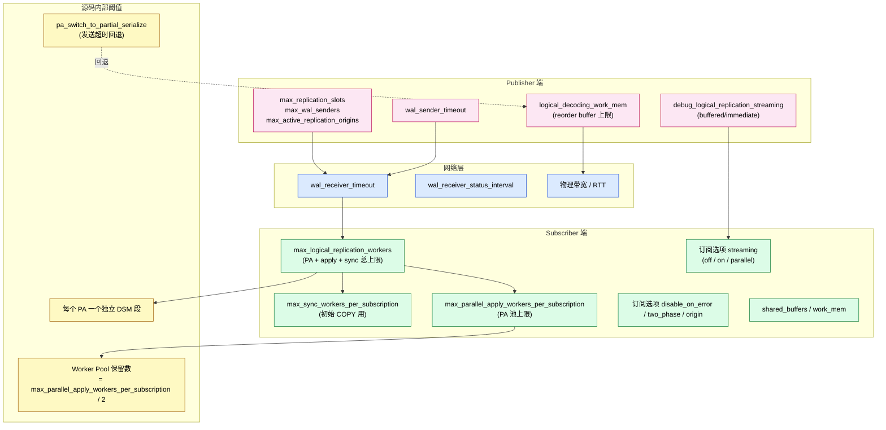
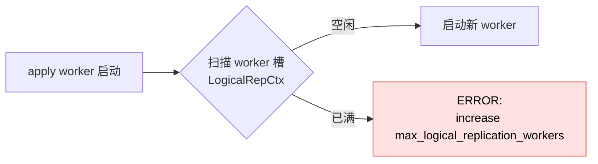
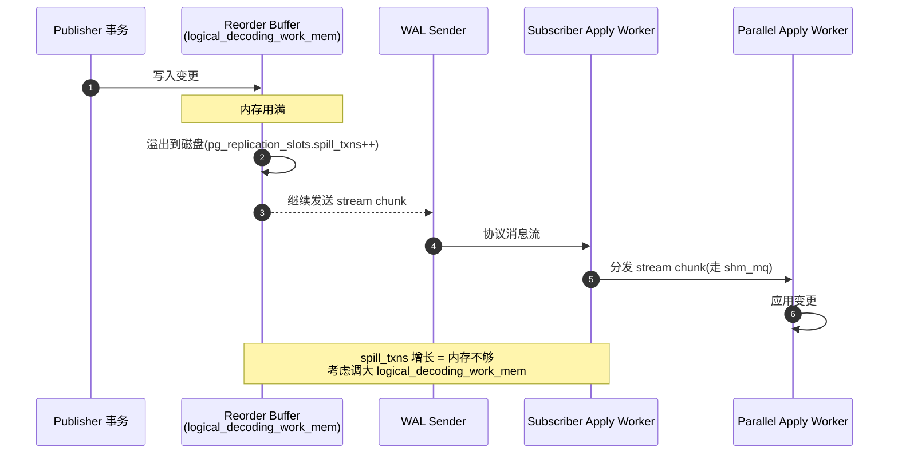
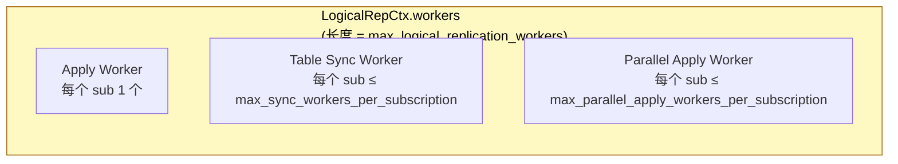
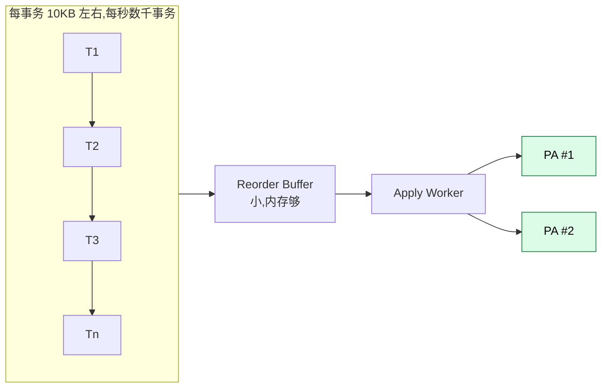
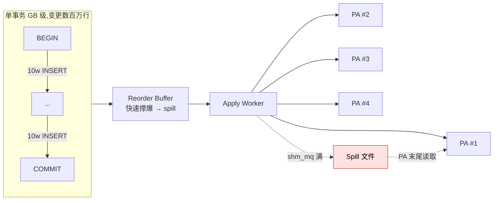
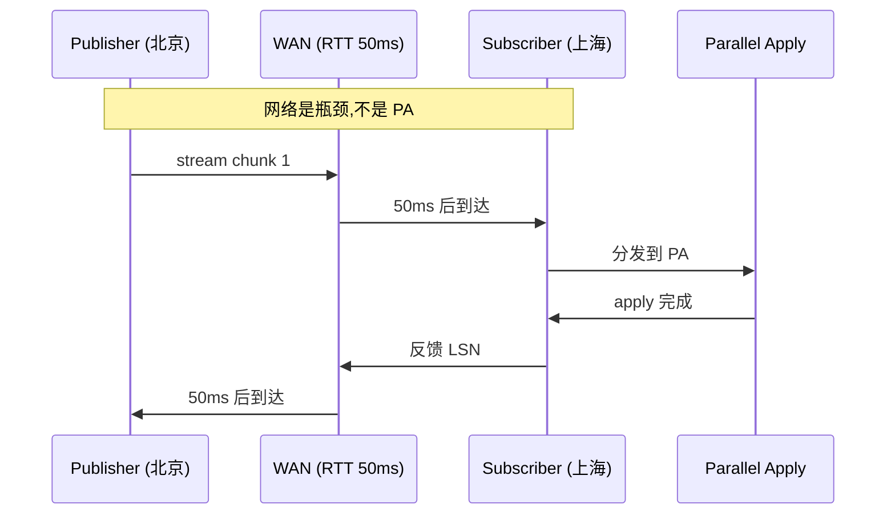
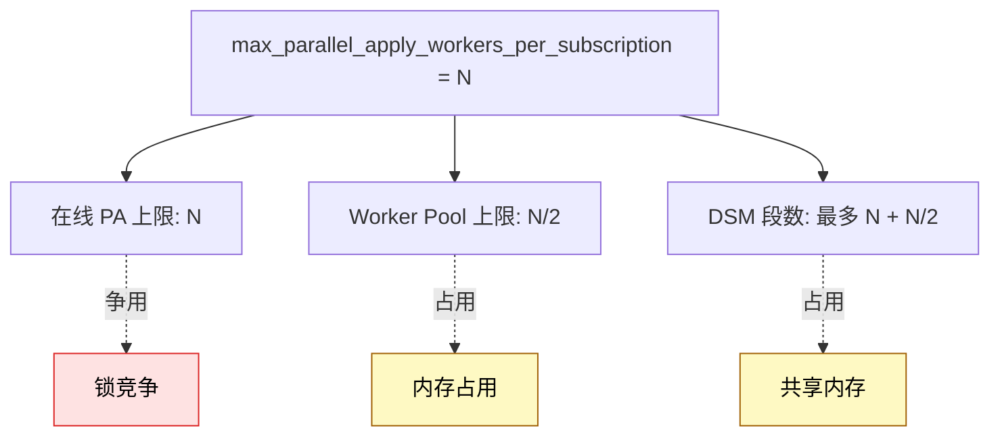

# PostgreSQL 逻辑复制 Apply Parallel Worker 参数调优实战

> 配套源码:`~/cwork/postgresql`(基于 PG 18 主干)
> 配套前文:[Apply Parallel Worker 运行机制解析](https://growdu.github.io/blog/db/postgresql/postgresql-apply-parallel-worker/)

PG 16 引入 `streaming=parallel` 之后,逻辑复制的吞吐上了一个量级,但随之而来的是大量可调旋钮——开多了打爆内存、抢占锁导致死锁、Worker 池溢出、spill 文件暴涨……这篇文章把 PG 18 上 **Apply Parallel Worker(以下简称 PA)**涉及的所有可调参数一次性梳理清楚,告诉你每一个参数在哪里、为什么这么调,以及踩过的坑。

---

## 一、调优的基本盘:为什么 PA 不是"开越大越好"

先放一张总图,把 PA 涉及的所有"限速阀"画出来:



PA 的本质是 **"在订阅端用多个 worker 并行 apply 同一批长事务的 stream chunk"**。调优的目标就是在三个维度之间找平衡:

| 维度 | 调高方向 | 调低方向 |
|------|---------|---------|
| **吞吐** | 增加 PA 数量、增加 reorder buffer | 减少 IO 抖动 |
| **延迟** | 减少批次、加大 status 频率 | — |
| **资源** | 限制并发、复用 worker 池 | 关闭 PA,退回 `streaming=on` |

下面分章节把每个旋钮拆开。

---

## 二、参数全景速查表

把 PG 18 中 PA 相关所有可调参数整理成一张表(按生效位置分类):

| 参数 | 类别 | 生效端 | context | 默认值 | 范围 | 调优方向 |
|------|------|--------|---------|--------|------|---------|
| `max_logical_replication_workers` | GUC | Subscriber | `PGC_POSTMASTER` | 4 | 0..MAX_BACKENDS | ⬆ |
| `max_sync_workers_per_subscription` | GUC | Subscriber | `PGC_SIGHUP` | 2 | 0..MAX_BACKENDS | 按表数 |
| `max_parallel_apply_workers_per_subscription` | GUC | Subscriber | `PGC_SIGHUP` | 2 | 0..MAX_PARALLEL_WORKER_LIMIT | ⬆ |
| `max_worker_processes` | GUC | Subscriber | `PGC_POSTMASTER` | 8 | 0..MAX_BACKENDS | 必须 ⬆ |
| `max_replication_slots` | GUC | Publisher | `PGC_POSTMASTER` | 10 | 0..MAX_BACKENDS | 按订阅数 |
| `max_wal_senders` | GUC | Publisher | `PGC_POSTMASTER` | 10 | 0..MAX_BACKENDS | 按订阅数 |
| `max_active_replication_origins` | GUC | Subscriber | `PGC_POSTMASTER` | 10 | 0..MAX_BACKENDS | 按订阅数 |
| `logical_decoding_work_mem` | GUC | Publisher | `PGC_USERSET` | 64MB | 64kB..MAX_KILOBYTES | ⬆ 减少 spill |
| `debug_logical_replication_streaming` | GUC | 双向 | `PGC_USERSET` | `buffered` | `buffered`/`immediate` | 调试用 |
| `wal_sender_timeout` | GUC | Publisher | `PGC_USERSET` | 60s | 0..INT_MAX ms | 高延迟 ⬆ |
| `wal_receiver_timeout` | GUC | Subscriber | `PGC_SIGHUP` | 60s | 0..INT_MAX ms | 高延迟 ⬆ |
| `wal_receiver_status_interval` | GUC | Subscriber | `PGC_SIGHUP` | 10s | 0..INT_MAX s | 弱网 ⬇ |
| `idle_replication_slot_timeout` | GUC | Publisher | `PGC_SIGHUP` | 0 | 0..INT_MAX s | 资源回收 |
| `streaming` | 订阅选项 | Subscriber | per-sub | `on` | `off`/`on`/`parallel` | `parallel` |
| `two_phase` | 订阅选项 | Subscriber | per-sub | `false` | bool | 业务决定 |
| `disable_on_error` | 订阅选项 | Subscriber | per-sub | `true` | bool | 生产建议 `true` |
| `binary` | 订阅选项 | Subscriber | per-sub | `false` | bool | 跨版本小心 |
| `origin` | 订阅选项 | Subscriber | per-sub | `any` | `none`/`any` | 双向同步设 `none` |

> 注:PG 18 中**不存在** `streaming_apply_timeout`、`parallel_apply_default_size`、`parallel_apply_max_data_size`、`subscriber_skip_errors` 这些参数。源码中 PA 也没有为单个 stream block 暴露独立的 size GUC。

源码内部有两处"硬编码"阈值,**虽然没暴露成 GUC,但实际影响性能**,本章一并讲清楚:

| 阈值 | 来源 | 当前值 | 源码位置 |
|------|------|--------|----------|
| Worker Pool 保留数 | `max_parallel_apply_workers_per_subscription / 2` | GUC/2 | `applyparallelworker.c::pa_free_worker` |
| DSM 段粒度 | 每个 PA 一个独立段 | 不可配 | `applyparallelworker.c::pa_setup_dsm` |
| `pa_switch_to_partial_serialize` 触发 | shm_mq 发送超时 | 不可配 | `worker.c::apply_handle_*` |

---

## 三、Publisher 端调优

### 3.1 三个"POSTMASTER 级"基础容量

这一组参数都要**重启 PG**才能生效,部署时一次规划好:

```ini
# postgresql.conf (Publisher)
max_replication_slots   = 20    # 每个订阅占用 1 个
max_wal_senders         = 20    # 每个订阅占用 1 个
max_active_replication_origins = 0 # Publisher 端通常不需要
```

源码位置:`src/backend/utils/misc/guc_tables.c:3074-3100`(对应三个 GUC 注册块)。

#### 选型公式

- **`max_replication_slots`** ≥ Publisher 上的订阅数 + 留给物理复制的备份槽 + 留 20% 余量
- **`max_wal_senders`** ≥ `max_replication_slots`(每个 slot 都需要 sender 进程)
- **`max_active_replication_origins`** Publisher 通常设为 0;如果做了**双向复制**(A↔B),要按订阅端数 + 1 预留

#### 触发后的报错

源码在 `launcher.c:421-438` 中如果 slot 满了会报:

> `ERROR: could not find free replication state, increase max_replication_slots`



### 3.2 `logical_decoding_work_mem`:reorder buffer 的内存墙

**这是 PA 性能调优里最重要、也最容易被忽视的一个参数。**

源码位置:`src/include/replication/reorderbuffer.h:27`、`src/backend/utils/misc/guc_tables.c:2604`。

```c
// src/backend/utils/misc/guc_tables.c:2604
{"logical_decoding_work_mem", PGC_USERSET, RESOURCES_MEM,
    gettext_noop("Sets the maximum memory to be used for logical decoding."),
    gettext_noop("This much memory can be used by each internal "
                 "reorder buffer before spilling to disk."),
    GUC_UNIT_KB
},
&logical_decoding_work_mem,
65536, 64, MAX_KILOBYTES,
```

它控制的是 **Publisher 端 reorder buffer 的内存上限**——当一个大事务在 Publisher 端解码时,如果内存用满,会**溢出到磁盘**(`pg_replication_slots.overflowed_txns` 累计)。这个参数和 PA 的关系是:



#### 推荐值

| 场景 | 推荐值 |
|------|--------|
| 通用 OLTP,事务 < 1MB | 64MB(默认) |
| 中等大事务 1MB~100MB | 256MB ~ 1GB |
| 批量 ETL,单事务 GB 级 | 4GB ~ 16GB |
| TPC-C 100WH(每事务 ~10KB) | 128MB ~ 512MB |

> ⚠️ **PG 18 引入了 PA 的 spill 文件(参考前文),它和 reorder buffer spill 是两回事**——前者是订阅端 partial serialize 的产物,后者是发布端 reorder buffer 的产物,不要混淆。

### 3.3 `debug_logical_replication_streaming`:调试用,生产别开

源码位置:`src/backend/utils/misc/guc_tables.c:5418-5428`。

```c
{"debug_logical_replication_streaming", PGC_USERSET, DEVELOPER_OPTIONS,
    gettext_noop("Forces immediate streaming or serialization of changes in large transactions."),
    gettext_noop("On the publisher, it allows streaming or serializing each change in logical decoding. "
                 "On the subscriber, it allows serialization of all changes to files and notifies the "
                 "parallel apply workers to read and apply them at the end of the transaction."),
    GUC_NOT_IN_SAMPLE
},
&debug_logical_replication_streaming,
DEBUG_LOGICAL_REP_STREAMING_BUFFERED, debug_logical_replication_streaming_options,
```

只有两个值:

| 值 | 行为 | 何时用 |
|----|------|--------|
| `buffered` | 默认,按 reorder buffer 阈值触发 streaming | 生产 |
| `immediate` | 每条变更立即 stream,绕过 reorder buffer 缓冲 | **只用于性能压测和故障重现** |

这个 GUC 标记为 `GUC_NOT_IN_SAMPLE`,意思是不在 `postgresql.conf.sample` 出现,开发者选项。

### 3.4 `wal_sender_timeout`

源码位置:`src/backend/utils/misc/guc_tables.c:3097-3103`。

```c
{"wal_sender_timeout", PGC_USERSET, REPLICATION_SENDING,
    gettext_noop("Sets the maximum time to wait for WAL replication."),
    NULL,
    GUC_UNIT_MS
},
&wal_sender_timeout,
60 * 1000, 0, INT_MAX,
```

默认 60 秒。如果跨地域复制,网络 RTT 大,需要 ⬆。建议:

| 场景 | 推荐值 |
|------|--------|
| 同机房 | 60s(默认) |
| 同城跨 IDC | 60s ~ 120s |
| 跨地域 50ms+ RTT | 120s ~ 300s |
| 弱网 | 600s |

---

## 四、Subscriber 端调优(重点)

### 4.1 `max_logical_replication_workers`:三类 worker 的总池子

源码位置:`src/backend/replication/logical/launcher.c:50`、`src/backend/utils/misc/guc_tables.c:3353`。

```c
// src/backend/utils/misc/guc_tables.c:3353
{"max_logical_replication_workers",
    PGC_POSTMASTER,
    REPLICATION_SUBSCRIBERS,
    gettext_noop("Maximum number of logical replication worker processes."),
    NULL,
},
&max_logical_replication_workers,
4, 0, MAX_BACKENDS,
```

`LogicalRepCtx->workers[]` 是一个定长数组,长度就是这个 GUC 值。它是 **三类 worker 的总和**:



#### 选型公式

```text
max_logical_replication_workers
≥ sum_over_subs(
    1                                                     # apply worker
    + min(num_tables, max_sync_workers_per_subscription)  # sync workers
    + max_parallel_apply_workers_per_subscription         # PA workers
)
```

源码逻辑在 `launcher.c::apply_worker_count`/`launcher.c:421-438`:

```c
// src/backend/replication/logical/launcher.c:421
if (is_parallel_apply_worker &&
    nparallelapplyworkers >= max_parallel_apply_workers_per_subscription)
    continue;
```

如果超了会报:

> `ERROR: max_logical_replication_workers must be exceeded if you want to add more logical replication workers`

### 4.2 `max_parallel_apply_workers_per_subscription`:PA 池上限(核心调优旋钮)

源码位置:`src/backend/replication/logical/launcher.c:52`、`src/backend/utils/misc/guc_tables.c:3377`。

```c
// src/backend/utils/misc/guc_tables.c:3377
{"max_parallel_apply_workers_per_subscription",
    PGC_SIGHUP,
    REPLICATION_SUBSCRIBERS,
    gettext_noop("Maximum number of parallel apply workers per subscription."),
    NULL,
},
&max_parallel_apply_workers_per_subscription,
2, 0, MAX_PARALLEL_WORKER_LIMIT,
```

它是 **每个订阅** 同时在跑的 PA 上限。这个值有两个隐藏含义:

1. **直接上限**:同时存在的 PA 不能超过这个值(`launcher.c:422`)
2. **Worker Pool 保留上限**:源码 `applyparallelworker.c:578` 注释明确说:

```c
// src/backend/replication/logical/applyparallelworker.c:578
/*
 * Stop the worker if there are enough workers in the pool.
 *
 * XXX Additionally, we also stop the worker if the leader apply worker
 * serialize part of the transaction data due to a send timeout. This is
 * because the message could be partially written to the queue and there
 * is no way to clean the queue other than resending the message until it
 * succeeds. Instead of trying to send the data which anyway would have
 * been serialized and then letting the parallel apply worker deal with
 * the spurious message, we stop the worker.
 */
if (winfo->serialize_changes ||
    list_length(ParallelApplyWorkerPool) >
    (max_parallel_apply_workers_per_subscription / 2))
{
    logicalrep_pa_worker_stop(winfo);
    pa_free_worker_info(winfo);

    return;
}
```

源码注释 `XXX This worker pool threshold is arbitrary and we can provide a GUC variable for this in the future if required.`——**未来可能开放为 GUC**,目前是硬编码 `GUC/2`。

```mermaid
flowchart TB
    subgraph Pool["ParallelApplyWorkerPool<br/>(复用 PA 列表)"]
        W1["PA #1 (in_use)"]
        W2["PA #2 (空闲)"]
        W3["PA #3 (空闲)"]
        W4["... ⬆ 上限 GUC/2"]
    end

    Start[事务开始] --> Ck{空闲 PA?}
    Ck -->|有| Get[取出空闲 PA]
    Ck -->|没有| Launch{已启动 < GUC?}
    Launch -->|是| Spawn[launch_parallel_worker]
    Launch -->|否| Serial[退回 LA 自己 apply<br/>(不并行)]

    Get --> Apply[应用 stream chunk]
    Spawn --> Apply

    Apply --> End[事务结束]
    End --> PoolCk{Pool 长度 > GUC/2?}
    PoolCk -->|是| Stop[stop + 销毁]
    PoolCk -->|否| Keep[保留在池中]
```

#### 推荐值

| 场景 | 推荐值 | 理由 |
|------|--------|------|
| 单 sub 默认 | 2 | 与 Worker Pool 平衡 |
| 大量大事务(GB 级) | 4 ~ 8 | 增加并发 |
| 多 sub,争用激烈 | 2 ~ 4 | 避免锁竞争 |
| 弱网 RTT 50ms+ | 2 | 增加 PA 不一定增加吞吐 |

> **不要无脑开大**。PA 多了有三个代价:
> 1. 每个 PA 一个独立 DSM 段,内存翻倍(`applyparallelworker.c:30-40` 注释)
> 2. 锁竞争加剧,反而触发死锁(`applyparallelworker.c:60-110` 死锁场景)
> 3. Worker Pool 长度也跟着翻倍,空闲 PA 占着茅坑

### 4.3 `max_sync_workers_per_subscription`:初始 COPY 并行度

源码位置:`src/backend/replication/logical/launcher.c:51`、`src/backend/utils/misc/guc_tables.c:3365`。

```c
{"max_sync_workers_per_subscription",
    PGC_SIGHUP,
    REPLICATION_SUBSCRIBERS,
    gettext_noop("Maximum number of table synchronization workers per subscription."),
    NULL,
},
&max_sync_workers_per_subscription,
2, 0, MAX_BACKENDS,
```

控制 **初始 COPY(table sync)** 的并发,**和 PA 无关**。但很多运维会混淆,这里单独说明:

- 只在 `CREATE SUBSCRIPTION` 之后、首次同步表时生效
- 同步完成后,sync worker 退出,slot 释放
- 不影响稳态运行的 PA 数量

通常按表数量和 IO 能力设置:

| 表数量 | 推荐值 |
|--------|--------|
| < 100 | 2(默认) |
| 100 ~ 1000 | 4 ~ 8 |
| > 1000 | 8 ~ 16(注意 IO 抖动) |

### 4.4 订阅选项 `streaming`:PA 的总开关

源码位置:`src/include/catalog/pg_subscription.h:165-177`。

```c
#define LOGICALREP_STREAM_OFF     'f'
#define LOGICALREP_STREAM_ON      't'
#define LOGICALREP_STREAM_PARALLEL 'p'
```

订阅的 `streaming` 选项有三个值:

| 值 | 行为 | 何时用 |
|----|------|--------|
| `off` | 完整事务在 Publisher 端攒齐再发送 | 事务极小(< 10KB) |
| `on` | 流式发送,订阅端串行 apply(可以中途开始) | 单线程 apply,无 PA |
| `parallel` | 流式发送,**订阅端可以用 PA 并行 apply 大事务** | **生产推荐** |

源码逻辑在 `worker.c:540-560`:

```c
// src/backend/replication/logical/worker.c:540
if (server_version >= 160000 &&
    MySubscription->stream == LOGICALREP_STREAM_PARALLEL)
{
    options->proto.logical.streaming_str = "parallel";
    MyLogicalRepWorker->parallel_apply = true;
}
else if (server_version >= 140000 &&
         MySubscription->stream != LOGICALREP_STREAM_OFF)
{
    options->proto.logical.streaming_str = "on";
    MyLogicalRepWorker->parallel_apply = false;
}
```

#### 修改方法

```sql
-- 启用 PA(要求 Publisher >= PG 16)
ALTER SUBSCRIPTION my_sub SET (streaming = 'parallel');

-- 关闭 PA,退回 streaming=on
ALTER SUBSCRIPTION my_sub SET (streaming = 'on');

-- 关闭 streaming,所有事务必须攒齐再发
ALTER SUBSCRIPTION my_sub SET (streaming = 'off');
```

### 4.5 订阅选项 `disable_on_error`:出错时是否自动 disable

源码位置:`src/include/catalog/pg_subscription.h`(字段 `subdisableonerr`)。

```sql
ALTER SUBSCRIPTION my_sub SET (disable_on_error = true);
```

| 值 | 行为 | 生产建议 |
|----|------|---------|
| `true`(默认) | apply 报错时,订阅自动 disable,需要人工介入 | ✅ |
| `false` | 报错时跳过,继续 apply 下一个事务 | 仅用于"忽略某些 DDL"场景 |

> ⚠️ `disable_on_error=false` **不等于** "跳过报错事务"。它只是不自动 disable,**该报错还是会报**,而且错误事务被跳过可能导致数据不一致。

### 4.6 订阅选项 `two_phase` / `binary` / `origin`

| 选项 | 默认 | 含义 | 调优建议 |
|------|------|------|---------|
| `two_phase` | `false` | 启用两阶段提交(在 Publisher 端 PREPARE,Subscriber 端也 PREPARE) | **跨库事务一致性场景**开启;开启后 PA 行为会变(参考 `worker.c:97` 注释) |
| `binary` | `false` | 传输二进制格式(避免类型转换) | 同构环境可开;**跨大版本不建议开** |
| `origin` | `any` | 是否过滤 origin;`none` 表示过滤掉所有来自其他订阅的变更 | **双向复制必须设为 `none`**,否则死循环 |

源码对应字段(`pg_subscription.h`):

```c
char        subtwophasestate; /* Stream two-phase transactions */
bool        subdisableonerr;  /* True if a worker error should cause
                                 the subscription to be disabled */
char        substream;        /* Stream in-progress transactions. See
                                 LOGICALREP_STREAM_xxx constants. */
text        suborigin BKI_DEFAULT(LOGICALREP_ORIGIN_ANY);
```

### 4.7 Subscriber 端超时与心跳

源码位置:`src/backend/utils/misc/guc_tables.c`(`wal_receiver_timeout`、`wal_receiver_status_interval`)。

```c
// wal_receiver_timeout (60s, SIGHUP)
{"wal_receiver_timeout", PGC_SIGHUP, REPLICATION_STANDBY,
    gettext_noop("Sets the maximum wait time to receive data from the sending server."),
    gettext_noop("0 disables the timeout."),
    GUC_UNIT_MS
},
&wal_receiver_timeout,
60 * 1000, 0, INT_MAX,

// wal_receiver_status_interval (10s, SIGHUP)
{"wal_receiver_status_interval", PGC_SIGHUP, REPLICATION_STANDBY,
    gettext_noop("Sets the maximum interval between WAL receiver status reports to the sending server."),
    NULL,
    GUC_UNIT_S
},
&wal_receiver_status_interval,
10, 0, INT_MAX / 1000,
```

源码在 `worker.c:3769-3800` 用到这两个参数:

```c
// src/backend/replication/logical/worker.c:3769
/*
 * If the elapsed time since the last response from the server
 * is more than wal_receiver_timeout / 2, ping the server.
 * Also send status update at least once per
 * wal_receiver_status_interval since the last update we sent,
 * ...
 */
if (last_recv_timestamp <= 0)
    last_recv_timestamp = now;
elapsed = TimestampDifferenceMilliseconds(last_recv_timestamp, now);
if (wal_receiver_timeout > 0 &&
    elapsed > (wal_receiver_timeout / 2))
{
    if (!ping_sent)
    {
        walrcv_ping(LogRepWorkerWalRcvConn);
        ping_sent = true;
    }
    else if (elapsed >= wal_receiver_timeout)
    {
        ereport(ERROR, ...);
    }
}
```

#### 调优建议

| 参数 | 弱网建议 | 强网建议 |
|------|---------|---------|
| `wal_receiver_timeout` | ⬆ 300s | 默认 60s |
| `wal_receiver_status_interval` | ⬇ 1s(心跳更密) | ⬆ 30s(减少包数) |

### 4.8 `max_active_replication_origins`:Subscriber 端 origin 跟踪上限

源码位置:`src/backend/utils/misc/guc_tables.c`。

```c
{"max_active_replication_origins",
    PGC_POSTMASTER,
    REPLICATION_SUBSCRIBERS,
    gettext_noop("Sets the maximum number of active replication origins."),
    NULL
},
&max_active_replication_origins,
10, 0, MAX_BACKENDS,
```

Subscriber 端的 replication origin 用来**追踪 apply 进度**(每个订阅一个 origin;启用 `origin=none` 时不创建)。如果用了大量表 sync 或双向复制,要 ⬆。

---

## 五、内存与资源的隐式约束

PA 的内存消耗**没有显式的 GUC**,但有三处隐性约束,这一节讲清楚。

### 5.1 每个 PA 一个独立 DSM 段

源码位置:`src/backend/replication/logical/applyparallelworker.c:30-50` 注释 + `pa_setup_dsm()`。

```c
// src/backend/replication/logical/applyparallelworker.c:30
/*
 * The leader apply worker will create a separate dynamic shared memory segment
 * when each parallel apply worker starts. The reason for this design is that
 * we cannot predict how many workers will be needed. It may be possible to
 * allocate enough shared memory in one segment based on the maximum number of
 * parallel apply workers (max_parallel_apply_workers_per_subscription), but
 * this would waste memory if no process is actually started.
 *
 * The dynamic shared memory segment contains: (a) a shm_mq that is used to
 * send changes in the transaction from leader apply worker to parallel apply
 * worker; (b) another shm_mq that is used to send errors (and other messages
 * reported via elog/ereport) from the parallel apply worker to leader apply
 * worker; (c) necessary information to be shared among parallel apply workers
 * and the leader apply worker (i.e. members of ParallelApplyWorkerShared).
 */
```

每个 PA 一个 DSM 段,段内含:
- 一个 `shm_mq`(LA → PA,传输变更)
- 一个 `shm_mq`(PA → LA,传输错误)
- `ParallelApplyWorkerShared` 结构(包含 xid、xact_state 等)

**内存估算**:`max_parallel_apply_workers_per_subscription × (2 个 shm_mq + shared struct)`。shm_mq 默认大小由 `shm_mq_create` 决定,通常几 MB 到几十 MB。

### 5.2 Worker Pool:源码硬编码 `GUC/2`

源码位置:`applyparallelworker.c:578-580`。

```c
if (winfo->serialize_changes ||
    list_length(ParallelApplyWorkerPool) >
    (max_parallel_apply_workers_per_subscription / 2))
{
    logicalrep_pa_worker_stop(winfo);
    pa_free_worker_info(winfo);
}
```

调大 `max_parallel_apply_workers_per_subscription` 会**同时**扩大:
1. 在线 PA 上限
2. Worker Pool 保留上限

**这是非线性的**。如果你 `max_parallel_apply_workers_per_subscription=8`,实际可能常驻 4 个空闲 PA + 4 个活跃 PA,内存压力翻倍。

### 5.3 `pa_switch_to_partial_serialize`:回退机制

源码位置:`src/backend/replication/logical/applyparallelworker.c:1218`。

```c
// src/backend/replication/logical/applyparallelworker.c:1218
pa_switch_to_partial_serialize(ParallelApplyWorkerInfo *winfo, bool last_segment)
{
    ...
    stream_start_internal(winfo->shared->xid, true);
    ...
}
```

`worker.c:615` 和 `worker.c:1349` 在发送超时时调用:

```c
// src/backend/replication/logical/worker.c:615
pa_switch_to_partial_serialize(winfo, false);
```

这表示 **shm_mq 写不进去时,LA 会把后续变更序列化到文件,由 PA 在事务末尾从文件读取**。这正是上一篇文章提到的 spill 文件来源之一。

**调优含义**:如果你看到 `$PGDATA/pg_replslot/<subid>_spill*` 大量出现,说明:
1. PA 处理速度跟不上 LA 发送速度
2. 需要 `max_parallel_apply_workers_per_subscription` 增大,**或** PA 端 `work_mem` 增大,**或** 优化 Subscriber 的 apply 性能

---

## 六、场景化调优方案

### 6.1 大量小事务高并发(典型:TPC-C)



#### 推荐配置

```ini
# Publisher
logical_decoding_work_mem = 64MB           # 默认足够
max_replication_slots = 20
max_wal_senders = 25

# Subscriber
max_logical_replication_workers = 16
max_parallel_apply_workers_per_subscription = 4
max_sync_workers_per_subscription = 4
streaming = parallel                       # 订阅选项
disable_on_error = true                    # 订阅选项
```

#### 调优要点

- **PA 数 = 2~4** 即可,事务小,PA 频繁启动反而开销大
- **`logical_decoding_work_mem`** 不需要 ⬆,TPC-C 单事务变更小,reorder buffer 用不到上限
- **`work_mem`** ⬆ 可以减少 hash join 落盘,但 apply 主要是简单 DML,影响不大

### 6.2 大事务低并发(典型:批量 ETL)



#### 推荐配置

```ini
# Publisher
logical_decoding_work_mem = 4GB            # 大事务,内存宽裕

# Subscriber
max_logical_replication_workers = 20
max_parallel_apply_workers_per_subscription = 8
max_sync_workers_per_subscription = 2      # 一次性 ETL 不需要太多 sync
streaming = parallel
shared_buffers = 16GB                      # 配合大 apply 流量
work_mem = 64MB                            # PA 内复杂 SQL
```

#### 调优要点

- **`logical_decoding_work_mem` 是关键**:不 ⬆ 的话 Publisher 端 reorder buffer 频繁 spill,延迟增大
- **`max_parallel_apply_workers_per_subscription`** ⬆ 到 4~8,分摊大事务的 apply
- **监控 spill 文件**:`ls $PGDATA/pg_replslot/ | grep spill` —— 数量增长 = PA 处理慢
- **谨慎调更大**:超过物理内存 50% 时,会触发 OS swap,反而更慢

### 6.3 跨地域高延迟



#### 推荐配置

```ini
# Publisher
wal_sender_timeout = 300s                  # 容忍弱网
logical_decoding_work_mem = 256MB          # 网络慢,内存更要留够

# Subscriber
wal_receiver_timeout = 300s
wal_receiver_status_interval = 1s          # 心跳密一点,避免超时
max_parallel_apply_workers_per_subscription = 2   # PA 多了也来不及
streaming = parallel
```

#### 调优要点

- **不要无脑 ⬆ PA 数**:跨地域 PA 之间的协调(锁、commit 顺序)也要走 WAN,PA 多了反而更慢
- **`wal_receiver_status_interval`** 调小(1~5s),防止超时
- 考虑**物理复制 + 逻辑复制混部**:异地用物理,同城用逻辑

### 6.4 大量 DDL(分区表、schema 变更)

#### 推荐配置

```ini
max_parallel_apply_workers_per_subscription = 2  # DDL 不并行,PA 数 ⬇
streaming = parallel
disable_on_error = true                          # DDL 错必须停
```

#### 调优要点

- **DDL 始终在 LA 上执行**,PA 不参与(`worker.c:3828` 注释:`walrcv_endstreaming`)
- DDL 频繁时,PA 频繁切换文件(`pa_switch_to_partial_serialize` 触发)
- **`disable_on_error=true`** 必须,DDL 错跳过去会破坏 schema 一致性

---

## 七、监控:看见才能调

调参的前提是**能看见状态**。PG 18 提供了一系列视图,按"看什么"分组。

### 7.1 看 worker 状态

```sql
-- 所有逻辑复制 worker
SELECT pid, application_name, state, query,
       wait_event_type, wait_event
FROM pg_stat_activity
WHERE backend_type LIKE 'logical replication%'
ORDER BY pid;

-- Apply Worker 的关键指标
SELECT pid, subname, received_lsn, latest_end_lsn,
       last_msg_send_time, last_msg_receipt_time
FROM pg_stat_subscription;

-- 字段含义:
--   received_lsn   : 已经接收到的 LSN(write 位置)
--   latest_end_lsn : 已经 apply 完成的 LSN(flush 位置)
--   两者差值 = apply 滞后量
```

### 7.2 看 PA 任务分发

```sql
-- PA worker 任务分发统计
SELECT
    subname,
    pid,
    relid::regclass,
    received_lsn,
    last_msg_send_time,
    last_msg_receipt_time
FROM pg_stat_subscription
WHERE relid IS NOT NULL
ORDER BY subname, relid;
```

### 7.3 看锁竞争

```sql
-- 找出正在等待锁的 PA worker
SELECT
    pg_class.relname,
    pg_locks.pid,
    mode,
    granted,
    waitstart,
    substring(query, 1, 100) AS query_preview
FROM pg_locks
JOIN pg_class ON pg_class.oid = pg_locks.relation
WHERE pg_locks.pid IN (
    SELECT pid FROM pg_stat_activity
    WHERE backend_type = 'logical replication worker'
)
ORDER BY waitstart NULLS FIRST;
```

如果 `waitstart` 不是 NULL,说明 PA 在等锁,可能正在死锁(参考 `applyparallelworker.c:60-150` 的死锁场景)。

### 7.4 看 spill 文件

```sql
-- reorder buffer 的 spill 计数
SELECT slot_name, spill_txns, spill_count, overflowed_txns
FROM pg_replication_slots;
```

```bash
# PA 的 partial serialize spill 文件
ls -la $PGDATA/pg_replslot/ | grep spill | wc -l

# 单个 sub 的 spill 文件
ls -la $PGDATA/pg_replslot/<subid>_*spill* 2>/dev/null | wc -l
```

> 📌 这两个 spill 是**不同来源**:
> - `pg_replication_slots.spill_*`:Publisher reorder buffer spill
> - `$PGDATA/pg_replslot/*spill*`:Subscriber PA partial serialize
>
> 调参方向相反:前者 ⬆ `logical_decoding_work_mem`,后者 ⬆ PA 处理能力。

### 7.5 看 apply 速率(实时)

```sql
-- 计算 apply 速率(每秒 apply 的字节数)
SELECT
    subname,
    pid,
    received_lsn - lag_received_lsn AS lsn_advance,
    EXTRACT(EPOCH FROM (last_msg_receipt_time - lag_receipt_time)) AS interval_sec,
    pg_size_pretty(
        (received_lsn - lag_received_lsn) /
        GREATEST(EXTRACT(EPOCH FROM (last_msg_receipt_time - lag_receipt_time)), 0.001)
    ) AS bytes_per_sec
FROM (
    SELECT
        subname,
        pid,
        received_lsn,
        last_msg_receipt_time,
        LAG(received_lsn) OVER (PARTITION BY subid ORDER BY last_msg_receipt_time) AS lag_received_lsn,
        LAG(last_msg_receipt_time) OVER (PARTITION BY subid ORDER BY last_msg_receipt_time) AS lag_receipt_time
    FROM pg_stat_subscription
    WHERE last_msg_receipt_time IS NOT NULL
) t
WHERE lag_receipt_time IS NOT NULL
ORDER BY subname;
```

更详细的脚本见前文:[PG 逻辑复制速率监控](https://growdu.github.io/blog/db/postgresql/postgresql-logical-replication-monitoring/)。

---

## 八、调优误区与陷阱

### 误区 1:`max_parallel_apply_workers_per_subscription` 越大越好

错。源码注释(`applyparallelworker.c:40`)明确说这个 GUC 同时影响 Worker Pool 保留上限,**非线性增长**。



**经验法则**:`N = CPU 核数 / 订阅数` 起步,逐步 ⬆ 直到 apply 速率不再提升。

### 误区 2:`streaming=parallel` 永远优于 `streaming=on`

错。如果你的负载是 **大量小事务**,PA 的启动/关闭开销可能比串行 apply 更高。`streaming=on` 在这种场景反而更快。

**判断方法**:监控 `pg_stat_subscription` 中 `last_msg_receipt_time - last_msg_send_time` 的差值:
- 差值大(> 1s):apply 跟不上,试试 PA
- 差值小(< 100ms):apply 健康,串行足够

### 误区 3:`logical_decoding_work_mem` 调大一定会提升吞吐

不一定。**单事务变更**大时 ⬆ 有效;**变更分散在大量小事务**时,reorder buffer 一次只攒一个事务,内存用不到上限,调了也没用。

```sql
-- 判断 spill 来源:reorder buffer 还是 PA partial serialize?
SELECT slot_name, spill_txns, spill_count FROM pg_replication_slots;
ls $PGDATA/pg_replslot/ | grep spill | wc -l   # Subscriber 端
```

- 如果 `spill_txns` 增长但 `$PGDATA/pg_replslot/` 下 spill 不变 → Publisher 端 spill,⬆ `logical_decoding_work_mem`
- 如果反过来 → Subscriber 端 PA spill,⬆ `max_parallel_apply_workers_per_subscription`

### 误区 4:Publisher 端 `wal_sender_timeout=0` 永远安全

错。设为 0 表示**禁用超时**,弱网时无法感知 publisher 已断开,会导致 Subscriber 端 PA 一直等。

### 误区 5:复制槽"留着就行",不监控 `idle_replication_slot_timeout`

如果订阅被 disable 但 slot 没释放,WAL 会一直保留,可能撑爆磁盘。

```sql
-- PG 18 新增的 idle 监控
SELECT slot_name, restart_lsn, confirmed_flush_lsn,
       active, active_pid
FROM pg_replication_slots;

-- 长期不活动的 slot
SELECT slot_name, age(now(), pg_last_xact_replay_timestamp(...)) ...
```

### 误区 6:不同订阅用一个 `application_name` 模板

不同订阅的 `application_name` 应该**可区分**,否则监控和告警分不清。

```sql
ALTER SUBSCRIPTION my_sub SET (slot_name = 'sub1_slot');
-- application_name 默认是 "sub1_slot",可以从 pg_stat_activity 看到
```

---

## 九、调优 checklist(实战用)

调优时按这个清单过一遍:

### 阶段 1:基线

- [ ] 确认业务场景(小事务高频 / 大事务低频 / 跨地域)
- [ ] 记录当前 apply 速率(用 [PG 逻辑复制速率监控](https://growdu.github.io/blog/db/postgresql/postgresql-logical-replication-monitoring/) 的脚本)
- [ ] 记录当前 spill 计数(`pg_replication_slots` + `pg_replslot/`)
- [ ] 记录当前 worker 状态(`pg_stat_activity` + `pg_stat_subscription`)

### 阶段 2:容量规划

- [ ] **Publisher 端**:`max_replication_slots ≥ 订阅数 × 1.2`
- [ ] **Publisher 端**:`max_wal_senders ≥ max_replication_slots`
- [ ] **Subscriber 端**:`max_worker_processes ≥ 30`(留足 BGW 配额)
- [ ] **Subscriber 端**:`max_logical_replication_workers ≥ Σ(1 + sync + PA)`
- [ ] **Subscriber 端**:`max_active_replication_origins ≥ 订阅数 + 2`

### 阶段 3:运行时调优

- [ ] `streaming = parallel`(已确认 Publisher >= PG 16)
- [ ] `disable_on_error = true`(生产)
- [ ] `max_parallel_apply_workers_per_subscription` 起步 2,逐步 ⬆ 到 apply 速率饱和
- [ ] `logical_decoding_work_mem` 根据单事务大小调整
- [ ] 跨地域场景:`wal_*_timeout` ⬆ 到 300s+

### 阶段 4:持续监控

- [ ] 告警:`pg_stat_subscription.latest_end_lsn - received_lsn` 超过阈值(> 100MB)
- [ ] 告警:`pg_replication_slots.spill_count` 增长速率
- [ ] 告警:`$PGDATA/pg_replslot/*spill*` 文件数
- [ ] 告警:PG 日志中 `pa_switch_to_partial_serialize` 出现频率
- [ ] 周期任务:清理 `idle_replication_slot_timeout` 触发的 slot

---

## 十、源码速查

| 关注点 | 文件 | 行/函数 |
|--------|------|---------|
| 三个核心 GUC 声明 | `src/backend/replication/logical/launcher.c` | L50-52 |
| 三个核心 GUC 注册 | `src/backend/utils/misc/guc_tables.c` | L3353-3390 |
| `logical_decoding_work_mem` GUC | `src/backend/utils/misc/guc_tables.c` | L2604 |
| `wal_*_timeout` GUC | `src/backend/utils/misc/guc_tables.c` | L2287-2310 |
| Worker 槽满报错 | `src/backend/replication/logical/launcher.c` | L421-438 |
| Worker Pool 保留阈值 | `src/backend/replication/logical/applyparallelworker.c` | L578-582 |
| PA 启动 | `src/backend/replication/logical/applyparallelworker.c::pa_launch_parallel_worker` | L404 |
| DSM 段创建 | `src/backend/replication/logical/applyparallelworker.c::pa_setup_dsm` | L327 |
| 死锁防护注释 | `src/backend/replication/logical/applyparallelworker.c` | L60-150 |
| Partial Serialize | `src/backend/replication/logical/applyparallelworker.c::pa_switch_to_partial_serialize` | L1218 |
| Streaming 协议 | `src/include/replication/logicalproto.h` | L73-77 |
| Streaming 模式枚举 | `src/include/catalog/pg_subscription.h` | L165-177 |
| Apply Worker 检测 streaming 模式 | `src/backend/replication/logical/worker.c` | L540-560 |
| Spill 文件清理 | `src/backend/replication/logical/applyparallelworker.c::pa_free_worker_info` | L595-620 |
| Debug GUC | `src/backend/utils/misc/guc_tables.c` | L5418 |

---

## 十一、参考

- [Apply Parallel Worker 运行机制解析](https://growdu.github.io/blog/db/postgresql/postgresql-apply-parallel-worker/)
- [PG 逻辑复制 streaming 与 spill 文件分析](https://growdu.github.io/blog/db/postgresql/postgresql-logical-replication-streaming-spill/)
- [PG 逻辑复制 reorder buffer 与事务机制](https://growdu.github.io/blog/db/postgresql/postgresql-logical-replication-reorderbuffer-transaction/)
- [PG 逻辑复制速率监控](https://growdu.github.io/blog/db/postgresql/postgresql-logical-replication-monitoring/)
- [PostgreSQL 官方文档 - Logical Replication](https://www.postgresql.org/docs/18/logical-replication.html)
- PG 18 源码:`~/cwork/postgresql`
