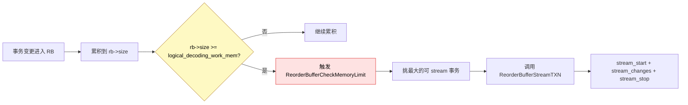
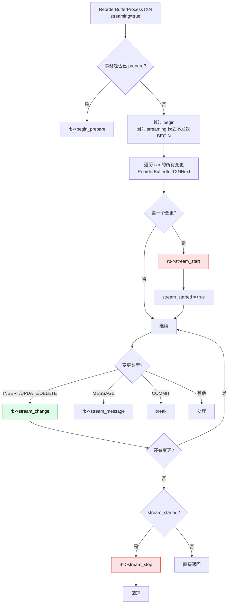
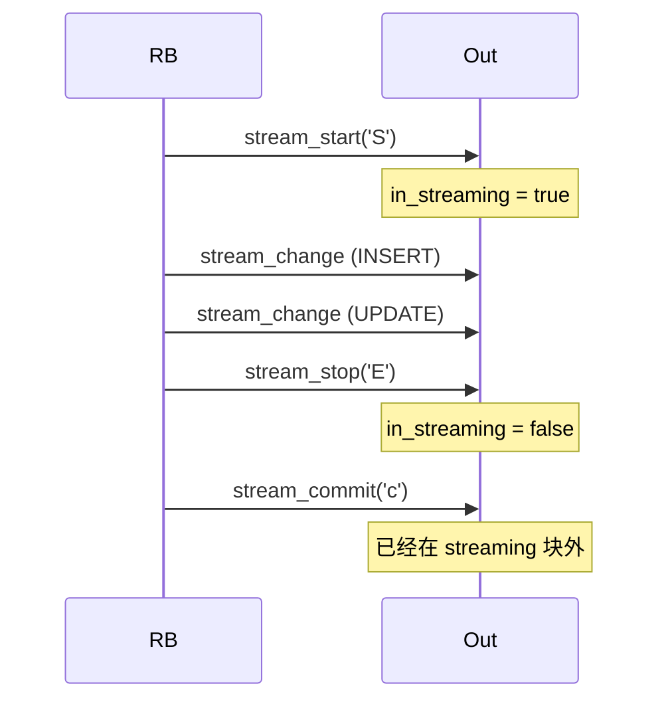
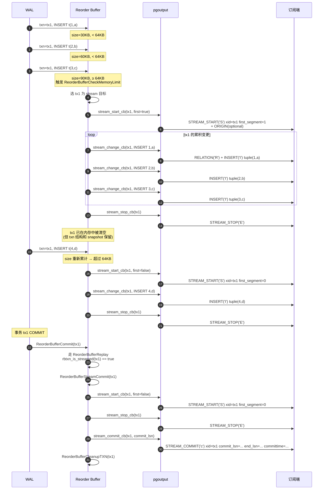

# PostgreSQL 18 流式逻辑复制发布端深度解析:从 logical_decoding_work_mem 到 stream_commit 的完整链路

> 配套源码:`~/cwork/postgresql`(基于 PG 18 主干)
>
> **预设场景**:
> - 发布端 PG 18,`wal_level=logical`
> - 订阅选项 `streaming='parallel'`(PG 16+ 才有的并行 apply 模式)
> - `logical_decoding_work_mem='64kB'`(极小,几乎每条变更都触发 stream)
> - **每个事务都通过流式协议发送**(而非攒齐一次性发送)
>
> 本文聚焦 **发布端** 视角,详细拆解:
> 1. `logical_decoding_work_mem=64kB` 究竟意味着什么、触发什么行为
> 2. `streaming='parallel'` 在发布端如何体现
> 3. 一个事务从 BEGIN → 多次 stream_chunk → COMMIT 的完整发送链路
> 4. `stream_start` / `stream_stop` / `stream_commit` / `stream_abort` / `stream_change` 等协议消息的发送时机
> 5. pgoutput 输出插件在其中的角色

---

## 一、关键配置的真实含义

### 1.1 `logical_decoding_work_mem='64kB'` —— 内存墙被压到 64KB

源码位置:`src/backend/utils/misc/guc_tables.c:2604`,`src/include/replication/reorderbuffer.h:27`。

```c
// src/backend/utils/misc/guc_tables.c:2604
{"logical_decoding_work_mem", PGC_USERSET, RESOURCES_MEM,
    gettext_noop("Sets the maximum memory to be used for logical decoding."),
    gettext_noop("This much memory can be used by each internal "
                 "reorder buffer before spilling to disk."),
    GUC_UNIT_KB
},
&logical_decoding_work_mem,
65536, 64, MAX_KILOBYTES,
```

**默认值是 64MB,我们配成 64KB(小 1024 倍)**。这并不是"减少内存使用"那么简单——它直接决定了 **Reorder Buffer 何时触发 streaming**。



### 1.2 `streaming='parallel'` —— 在发布端怎么体现?

源码位置:`src/backend/replication/logical/worker.c:4455-4475`(订阅端发起)。

```c
// src/backend/replication/logical/worker.c:4455
options->proto.logical.streaming_str = "parallel";
```

注意:**`streaming` 是订阅端的订阅选项**,但通过 logical replication protocol **传递给发布端**,决定 **pgoutput 插件输出哪些协议消息**。

`streaming='parallel'` 在发布端意味着:

1. pgoutput 注册了 **6 个 stream callback**(start/stop/change/commit/abort/prepare)
2. ctx->streaming 被设为 true
3. Reorder Buffer 的 `ReorderBufferCanStream(rb)` 返回 true

源码 `src/backend/replication/logical/logical.c:238`:

```c
// src/backend/replication/logical/logical.c:238
ctx->streaming = (ctx->callbacks.stream_start_cb != NULL) ||
                 (ctx->callbacks.stream_stop_cb != NULL) ||
                 (ctx->callbacks.stream_abort_cb != NULL) ||
                 (ctx->callbacks.stream_commit_cb != NULL) ||
                 (ctx->callbacks.stream_change_cb != NULL) ||
                 (ctx->callbacks.stream_message_cb != NULL) ||
                 ...
```

### 1.3 输出插件的 6 个 stream callback

源码位置:`src/include/replication/output_plugin.h:235`、`src/backend/replication/pgoutput/pgoutput.c:278`。

```c
// src/backend/replication/pgoutput/pgoutput.c:278
cb->stream_start_cb = pgoutput_stream_start;
cb->stream_change_cb = pgoutput_stream_change;
cb->stream_stop_cb = pgoutput_stream_stop;
cb->stream_abort_cb = pgoutput_stream_abort;
cb->stream_commit_cb = pgoutput_stream_commit;
cb->stream_prepare_cb = pgoutput_stream_prepare_txn;
```

**6 个 callback 对应 6 类协议消息**:

| Callback | 协议消息 | 含义 |
|----------|---------|------|
| `stream_start_cb` | `STREAM_START` (`'S'`) | 开始流式一个事务(可能分多段) |
| `stream_change_cb` | `STREAM_CHANGE` (在 chunk 内) | 流式一条 INSERT/UPDATE/DELETE |
| `stream_stop_cb` | `STREAM_STOP` (`'E'`) | 当前 chunk 结束(事务可能继续) |
| `stream_commit_cb` | `STREAM_COMMIT` (`'c'`) | 事务提交,stream 结束 |
| `stream_abort_cb` | `STREAM_ABORT` (`'A'`) | 事务回滚,丢弃所有变更 |
| `stream_prepare_cb` | `STREAM_PREPARE` (`'p'`) | 两阶段提交 prepare |

### 1.4 协议消息类型枚举

源码位置:`src/include/replication/logicalproto.h:57`。

```c
typedef enum LogicalRepMsgType
{
    LOGICAL_REP_MSG_BEGIN              = 'B',
    LOGICAL_REP_MSG_COMMIT             = 'C',
    LOGICAL_REP_MSG_ORIGIN             = 'O',
    LOGICAL_REP_MSG_INSERT             = 'I',
    LOGICAL_REP_MSG_UPDATE             = 'U',
    LOGICAL_REP_MSG_DELETE             = 'D',
    LOGICAL_REP_MSG_TRUNCATE           = 'T',
    LOGICAL_REP_MSG_RELATION           = 'R',
    LOGICAL_REP_MSG_TYPE              = 'Y',
    LOGICAL_REP_MSG_MESSAGE            = 'M',
    LOGICAL_REP_MSG_BEGIN_PREPARE      = 'b',
    LOGICAL_REP_MSG_PREPARE            = 'P',
    LOGICAL_REP_MSG_COMMIT_PREPARED    = 'K',
    LOGICAL_REP_MSG_ROLLBACK_PREPARED  = 'r',
    LOGICAL_REP_MSG_STREAM_START       = 'S',  // ← 本文重点
    LOGICAL_REP_MSG_STREAM_STOP        = 'E',  // ← 本文重点
    LOGICAL_REP_MSG_STREAM_COMMIT      = 'c',  // ← 本文重点
    LOGICAL_REP_MSG_STREAM_ABORT       = 'A',  // ← 本文重点
    LOGICAL_REP_MSG_STREAM_PREPARE     = 'p',  // ← 本文重点
} LogicalRepMsgType;
```

---

## 二、一个事务的完整生命周期(分阶段)

**配置**: `logical_decoding_work_mem=64kB` + `streaming='parallel'`,意味着几乎**每个变更都可能触发一次 stream 循环**。

```mermaid
sequenceDiagram
    autonumber
    participant User as 用户事务
    participant WAL as WAL / walreader
    participant RB as Reorder Buffer
    participant Output as pgoutput 插件
    plugin_plugin as logical.proto
    participant Sub as 订阅端

    User->>WAL: BEGIN
    Note over RB: 累积第 1 条变更
    RB->>RB: rb->size += sz
    RB->>RB: 检查 logical_decoding_work_mem
    Note over RB: 超过 64KB → 触发 stream
    RB->>Output: stream_start_cb
    Output->>plugin_plugin: 写 STREAM_START('S')
    plugin_plugin->>Sub: 网络发送

    loop 每个变更(chunk)
        RB->>Output: stream_change_cb
        Output->>plugin_plugin: 写 INSERT/UPDATE/DELETE
        plugin_plugin->>Sub: 网络发送
    end

    RB->>Output: stream_stop_cb
    Output->>plugin_plugin: 写 STREAM_STOP('E')
    plugin_plugin->>Sub: 网络发送

    Note over RB: 继续累积后续变更<br/>每超 64KB 再次触发 stream
    RB->>Output: stream_start_cb (first_segment=false)
    Output->>plugin_plugin: 写 STREAM_START('S', first_segment=0)
    Output->>Output: stream_change_cb ×N
    Output->>Output: stream_stop_cb

    User->>WAL: COMMIT
    RB->>RB: ReorderBufferCommit 路径
    RB->>Output: stream_start_cb (发送剩余变更)
    Output->>plugin_plugin: STREAM_START('S')
    Output->>Output: stream_change_cb ×剩余
    Output->>Output: stream_stop_cb
    Output->>plugin_plugin: STREAM_STOP('E')
    RB->>Output: stream_commit_cb
    Output->>plugin_plugin: STREAM_COMMIT('c')
    plugin_plugin->>Sub: 发送
```

### 2.1 阶段 1:WAL 变更进入 Reorder Buffer

源码位置:`src/backend/replication/logical/reorderbuffer.c::ReorderBufferQueueChange()`(L860 附近)。

```c
// src/backend/replication/logical/reorderbuffer.c:860
void
ReorderBufferQueueChange(ReorderBuffer *rb, TransactionId xid, XLogRecPtr lsn,
                         ReorderBufferChange *change, bool toast_insert)
{
    ...
    rb->size += sz;        // 累积内存
    txn->size += sz;
    txn->total_size += sz;
    
    ReorderBufferCheckMemoryLimit(rb);   // ← 每次都检查
}
```

### 2.2 阶段 2:触发 stream 的检查函数

源码位置:`src/backend/replication/logical/reorderbuffer.c:3883`。

```c
// src/backend/replication/logical/reorderbuffer.c:3883
static void
ReorderBufferCheckMemoryLimit(ReorderBuffer *rb)
{
    /*
     * Bail out if debug_logical_replication_streaming is buffered and we
     * haven't exceeded the memory limit.
     */
    if (debug_logical_replication_streaming == DEBUG_LOGICAL_REP_STREAMING_BUFFERED &&
        rb->size < logical_decoding_work_mem * (Size) 1024)
        return;

    while (rb->size >= logical_decoding_work_mem * (Size) 1024 ||
           (debug_logical_replication_streaming == DEBUG_LOGICAL_REP_STREAMING_IMMEDIATE &&
            rb->size > 0))
    {
        if (ReorderBufferCanStartStreaming(rb) &&
            (txn = ReorderBufferLargestStreamableTopTXN(rb)) != NULL)
        {
            ...
            ReorderBufferStreamTXN(rb, txn);   // ← 核心!
        }
        else
        {
            // 否则 spill 到磁盘
            ReorderBufferSerializeTXN(rb, txn);
        }
    }
}
```

**关键判断**:

| 条件 | 含义 |
|------|------|
| `debug_logical_replication_streaming == BUFFERED && rb->size < limit` | 内存还够,**跳过** |
| `rb->size >= logical_decoding_work_mem * 1024` | 内存用满,**进入 while 循环** |
| `ReorderBufferCanStartStreaming(rb)` | snapshot builder 已到 CONSISTENT |
| `ReorderBufferLargestStreamableTopTXN(rb)` | 找到最大的可 stream 的 top txn |

### 2.3 阶段 3:挑选"最大可流式"事务

源码位置:`src/backend/replication/logical/reorderbuffer.c:3833`。

```c
// src/backend/replication/logical/reorderbuffer.c:3833
static ReorderBufferTXN *
ReorderBufferLargestStreamableTopTXN(ReorderBuffer *rb)
{
    dlist_iter  iter;
    Size        largest_size = 0;
    ReorderBufferTXN *largest = NULL;

    dlist_foreach(iter, &rb->txns_by_base_snapshot_lsn)
    {
        ReorderBufferTXN *txn;
        txn = dlist_container(ReorderBufferTXN, base_snapshot_node, iter.cur);

        if (rbtxn_has_partial_change(txn) ||
            !rbtxn_has_streamable_change(txn) ||
            rbtxn_is_aborted(txn))
            continue;

        if ((largest == NULL || txn->total_size > largest_size) &&
            (txn->total_size > 0))
        {
            largest = txn;
            largest_size = txn->total_size;
        }
    }
    return largest;
}
```

**关键过滤**:

1. `rbtxn_has_partial_change(txn)` —— 有未完成的变更(toast chunks / speculative insert),不能 stream
2. `!rbtxn_has_streamable_change(txn)` —— 没有任何可 stream 的变更
3. `rbtxn_is_aborted(txn)` —— 已回滚的事务

**挑选策略**:遍历 `txns_by_base_snapshot_lsn` 链表(按 base_snapshot LSN 排序),选 `total_size` 最大的。

### 2.4 阶段 4:实际流式事务

源码位置:`src/backend/replication/logical/reorderbuffer.c:4308`。

```c
// src/backend/replication/logical/reorderbuffer.c:4308
static void
ReorderBufferStreamTXN(ReorderBuffer *rb, ReorderBufferTXN *txn)
{
    Snapshot    snapshot_now;
    CommandId   command_id;
    Size        stream_bytes;
    bool        txn_is_streamed;

    /* 1. 准备 snapshot */
    if (txn->snapshot_now == NULL) {
        // 第一次 stream:遍历子事务并组装 snapshot
        ...
        command_id = FirstCommandId;
        snapshot_now = ReorderBufferCopySnap(rb, txn->base_snapshot, txn, command_id);
    } else {
        // 后续 stream:复用之前的 snapshot,加入新子事务
        ...
    }

    txn_is_streamed = rbtxn_is_streamed(txn);
    stream_bytes = txn->total_size;

    /* 2. 处理并发送变更给输出插件 */
    ReorderBufferProcessTXN(rb, txn, InvalidXLogRecPtr, snapshot_now,
                            command_id, true);   // ← streaming=true!

    /* 3. 更新统计 */
    rb->streamCount += 1;
    rb->streamBytes += stream_bytes;
    rb->streamTxns += (txn_is_streamed) ? 0 : 1;
    UpdateDecodingStats((LogicalDecodingContext *) rb->private_data);
}
```

### 2.5 阶段 5:`ReorderBufferProcessTXN` 内部

源码位置:`src/backend/replication/logical/reorderbuffer.c:2198`。

这是 **发送协议消息的核心循环**:



**关键代码片段**(精简):

```c
// src/backend/replication/logical/reorderbuffer.c:2282
while ((change = ReorderBufferIterTXNNext(rb, iterstate)) != NULL)
{
    if (prev_lsn == InvalidXLogRecPtr)
    {
        /* 第一个变更:发 STREAM_START */
        if (streaming)
        {
            txn->origin_id = change->origin_id;
            rb->stream_start(rb, txn, change->lsn);   // ← pgoutput_stream_start
            stream_started = true;
        }
    }

    /* 处理 INSERT/UPDATE/DELETE 等 */
    ...
    rb->stream_change(rb, txn, change);   // ← pgoutput_stream_change
    ...
}

/* 循环结束,发 STREAM_STOP */
if (stream_started)
{
    rb->stream_stop(rb, txn, prev_lsn);   // ← pgoutput_stream_stop
    stream_started = false;
}
```

### 2.6 阶段 6:最终 COMMIT 路径

源码位置:`src/backend/replication/logical/reorderbuffer.c:2813`、`ReorderBufferCommit` 在 L2874。

```c
// src/backend/replication/logical/reorderbuffer.c:2813
static void
ReorderBufferReplay(ReorderBufferTXN *txn,
                    ReorderBuffer *rb, TransactionId xid,
                    XLogRecPtr commit_lsn, XLogRecPtr end_lsn,
                    TimestampTz commit_time,
                    RepOriginId origin_id, XLogRecPtr origin_lsn)
{
    txn->final_lsn = commit_lsn;
    txn->end_lsn = end_lsn;
    txn->xact_time.commit_time = commit_time;
    txn->origin_id = origin_id;
    txn->origin_lsn = origin_lsn;

    /* 如果之前已经被 stream 过,走 stream commit 路径 */
    if (rbtxn_is_streamed(txn))
    {
        ReorderBufferStreamCommit(rb, txn);
        return;
    }
    ...
}
```

源码位置:`ReorderBufferStreamCommit`(L1980):

```c
// src/backend/replication/logical/reorderbuffer.c:1980
static void
ReorderBufferStreamCommit(ReorderBuffer *rb, ReorderBufferTXN *txn)
{
    Assert(rbtxn_is_streamed(txn));

    /* 1. 先 stream 剩余的变更 */
    ReorderBufferStreamTXN(rb, txn);

    /* 2. 发送 STREAM_COMMIT 或 STREAM_PREPARE */
    if (rbtxn_is_prepared(txn))
    {
        rb->stream_prepare(rb, txn, txn->final_lsn);
        ReorderBufferTruncateTXN(rb, txn, true);
    }
    else
    {
        rb->stream_commit(rb, txn, txn->final_lsn);    // ← pgoutput_stream_commit
        ReorderBufferCleanupTXN(rb, txn);
    }
}
```

---

## 三、pgoutput 输出插件的 6 个 callback

源码位置:`src/backend/replication/pgoutput/pgoutput.c`。

### 3.1 `pgoutput_stream_start` —— 发 STREAM_START

源码位置:`src/backend/replication/pgoutput/pgoutput.c:1838`。

```c
// src/backend/replication/pgoutput/pgoutput.c:1838
static void
pgoutput_stream_start(struct LogicalDecodingContext *ctx,
                      ReorderBufferTXN *txn)
{
    PGOutputData *data = (PGOutputData *) ctx->output_plugin_private;
    bool send_replication_origin = txn->origin_id != InvalidRepOriginId;

    Assert(!data->in_streaming);

    /* 后续段(非 first)不再带 origin */
    if (rbtxn_is_streamed(txn))
        send_replication_origin = false;

    OutputPluginPrepareWrite(ctx, !send_replication_origin);
    logicalrep_write_stream_start(ctx->out, txn->xid, !rbtxn_is_streamed(txn));

    send_repl_origin(ctx, txn->origin_id, InvalidXLogRecPtr,
                     send_replication_origin);

    OutputPluginWrite(ctx, true);

    data->in_streaming = true;
}
```

**协议层**(src/backend/replication/logical/proto.c:1061):

```c
// src/backend/replication/logical/proto.c:1061
void
logicalrep_write_stream_start(StringInfo out,
                              TransactionId xid, bool first_segment)
{
    pq_sendbyte(out, LOGICAL_REP_MSG_STREAM_START);   // 'S'

    Assert(TransactionIdIsValid(xid));
    pq_sendint32(out, xid);
    pq_sendbyte(out, first_segment ? 1 : 0);
}
```

**协议格式**(wire protocol):

```
+---------+---------+---------+---------+---------+
| 'S'(1B) |  xid(4B)            | first_seg(1B) |
+---------+----------------------+----------------+
```

### 3.2 `pgoutput_stream_change` —— 发 INSERT/UPDATE/DELETE

源码位置:`src/backend/replication/pgoutput/pgoutput.c`(具体函数实现)。

```c
// 简化版
static void
pgoutput_stream_change(struct LogicalDecodingContext *ctx,
                        ReorderBufferTXN *txn, Relation relation,
                        ReorderBufferChange *change)
{
    PGOutputData *data = (PGOutputData *) ctx->output_plugin_private;
    MemoryContext old;

    Assert(data->in_streaming);

    /* 先确保订阅端认识这个 relation */
    output_relation_info(ctx, relation, ...);

    switch (change->action)
    {
        case REORDER_BUFFER_CHANGE_INSERT:
            // 写 LOGICAL_REP_MSG_INSERT + tuple data
            OutputPluginPrepareWrite(ctx, true);
            logicalrep_write_insert(ctx->out, ...);
            OutputPluginWrite(ctx, true);
            break;
        case REORDER_BUFFER_CHANGE_UPDATE:
            // 写 LOGICAL_REP_MSG_UPDATE + new tuple
            ...
            break;
        case REORDER_BUFFER_CHANGE_DELETE:
            // 写 LOGICAL_REP_MSG_DELETE
            ...
            break;
        ...
    }
}
```

**关键点**:

- **每个变更都是一个独立的子消息**,嵌在 STREAM_START 和 STREAM_STOP 之间
- 如果是新的 relation,**先发 RELATION 消息**(描述 schema)
- `OutputPluginPrepareWrite` + `logicalrep_write_*` + `OutputPluginWrite` 是标准三步

### 3.3 `pgoutput_stream_stop` —— 发 STREAM_STOP

源码位置:`src/backend/replication/pgoutput/pgoutput.c:1875`。

```c
// src/backend/replication/pgoutput/pgoutput.c:1875
static void
pgoutput_stream_stop(struct LogicalDecodingContext *ctx,
                     ReorderBufferTXN *txn)
{
    PGOutputData *data = (PGOutputData *) ctx->output_plugin_private;

    Assert(data->in_streaming);

    OutputPluginPrepareWrite(ctx, true);
    logicalrep_write_stream_stop(ctx->out);   // ← 'E'
    OutputPluginWrite(ctx, true);

    data->in_streaming = false;
}
```

**协议格式**:

```
+---------+
| 'E'(1B) |
+---------+
```

**最简单**,只是告诉订阅端"当前 chunk 结束,事务可能继续"。

### 3.4 `pgoutput_stream_commit` —— 发 STREAM_COMMIT

源码位置:`src/backend/replication/pgoutput/pgoutput.c:1924`。

```c
// src/backend/replication/pgoutput/pgoutput.c:1924
static void
pgoutput_stream_commit(struct LogicalDecodingContext *ctx,
                       ReorderBufferTXN *txn,
                       XLogRecPtr commit_lsn)
{
    PGOutputData *data PG_USED_FOR_ASSERTS_ONLY =
        (PGOutputData *) ctx->output_plugin_private;

    Assert(!data->in_streaming);          // ← 关键:commit 在 streaming 之外!
    Assert(rbtxn_is_streamed(txn));

    OutputPluginUpdateProgress(ctx, false);
    OutputPluginPrepareWrite(ctx, true);
    logicalrep_write_stream_commit(ctx->out, txn, commit_lsn);
    OutputPluginWrite(ctx, true);

    cleanup_rel_sync_cache(txn->xid, true);
}
```

**协议层**:

```c
// src/backend/replication/logical/proto.c:1104
void
logicalrep_write_stream_commit(StringInfo out, ReorderBufferTXN *txn,
                               XLogRecPtr commit_lsn)
{
    uint8 flags = 0;
    pq_sendbyte(out, LOGICAL_REP_MSG_STREAM_COMMIT);   // 'c'

    Assert(TransactionIdIsValid(txn->xid));

    pq_sendint32(out, txn->xid);
    pq_sendbyte(out, flags);
    pq_sendint64(out, commit_lsn);
    pq_sendint64(out, txn->end_lsn);
    pq_sendint64(out, txn->xact_time.commit_time);
}
```

**协议格式**:

```
+---------+----------+---------+-------------+-----------+-----------+-----------+
| 'c'(1B) | xid(4B)  | flags(1B)| commit_lsn | end_lsn   | committime |
|         |          | (reserved)| (8B)      | (8B)      | (8B)       |
+---------+----------+---------+-----------+-----------+-----------+
```

**断言 `!data->in_streaming` 的含义**:



`STREAM_COMMIT` 必须在 streaming 块**之外**发送。这是协议级别的硬约束,确保订阅端能正确识别"事务结束"。

### 3.5 `pgoutput_stream_abort` —— 发 STREAM_ABORT

源码位置:`src/backend/replication/pgoutput/pgoutput.c:1891`。

```c
// src/backend/replication/pgoutput/pgoutput.c:1891
static void
pgoutput_stream_abort(struct LogicalDecodingContext *ctx,
                      ReorderBufferTXN *txn,
                      XLogRecPtr abort_lsn)
{
    ReorderBufferTXN *toptxn;
    PGOutputData *data = (PGOutputData *) ctx->output_plugin_private;
    bool write_abort_info = (data->streaming == LOGICALREP_STREAM_PARALLEL);

    /* abort 也要在 streaming 块外 */
    Assert(!data->in_streaming);
    Assert(rbtxn_is_streamed(txn));

    toptxn = rbtxn_is_toptxn(txn) ? txn : rbtxn_get_toptxn(txn);

    OutputPluginPrepareWrite(ctx, true);
    if (write_abort_info)
        logicalrep_write_stream_abort(ctx->out, xid, abort_lsn);
    else
        pq_sendbyte(ctx->out, LOGICAL_REP_MSG_STREAM_ABORT);
    OutputPluginWrite(ctx, true);

    /* 清理 relation cache */
    cleanup_rel_sync_cache(txn->xid, true);
}
```

**关键差异**:

- `LOGICALREP_STREAM_PARALLEL` 模式:写完整 abort 信息(包含 abort_lsn)
- 其他模式:只发一个字节的 `'A'`

源码位置:`src/include/catalog/pg_subscription.h:165-177` 定义 streaming mode:

```c
#define LOGICALREP_STREAM_OFF     'f'
#define LOGICALREP_STREAM_ON      't'
#define LOGICALREP_STREAM_PARALLEL 'p'
```

### 3.6 `pgoutput_stream_prepare_txn` —— 发 STREAM_PREPARE

源码位置:`src/backend/replication/pgoutput/pgoutput.c:1955`。

```c
// src/backend/replication/pgoutput/pgoutput.c:1955
static void
pgoutput_stream_prepare_txn(LogicalDecodingContext *ctx,
                            ReorderBufferTXN *txn,
                            XLogRecPtr prepare_lsn)
{
    Assert(rbtxn_is_streamed(txn));

    OutputPluginUpdateProgress(ctx, false);
    OutputPluginPrepareWrite(ctx, true);
    logicalrep_write_stream_prepare(ctx->out, txn, prepare_lsn);
    OutputPluginWrite(ctx, true);
}
```

两阶段提交专用,本文不展开。

---

## 四、协议层 wrapper 函数

源码位置:`src/backend/replication/logical/logical.c:81`、`stream_start_cb_wrapper` 在 L1269。

逻辑层在 RB 和 pgoutput 之间加了一个 wrapper 层,做事务隔离、错误捕获、上下文保护:

```c
// src/backend/replication/logical/logical.c:1269
static void
stream_start_cb_wrapper(ReorderBuffer *cache, ReorderBufferTXN *txn,
                         XLogRecPtr first_lsn)
{
    LogicalDecodingContext *ctx = cache->private_data;
    ...
    OutputPluginBegin(ctx, txn);

    ctx->callbacks.stream_start_cb(ctx, txn);

    OutputPluginEnd(ctx, txn);
}
```

`OutputPluginBegin` / `OutputPluginEnd` 用于事务隔离、错误回调、内存上下文切换。

---

## 五、完整时序:一个事务从 BEGIN 到 STREAM_COMMIT

把以上整合,看一个具体例子:

**场景**:发布端执行

```sql
BEGIN;
INSERT INTO t VALUES (1, 'a');          -- 30KB
INSERT INTO t VALUES (2, 'b');          -- 30KB
-- 此时总 60KB,接近 64KB 但未满
INSERT INTO t VALUES (3, 'c');          -- 30KB
-- 此时总 90KB,超过 64KB → 触发 stream
INSERT INTO t VALUES (4, 'd');          -- 30KB
COMMIT;
```



**关键观察**:

1. **每次触发 stream 都是完整的 start+changes+stop 循环**
2. **`first_segment=1` 只在第一次,后续都是 0**(避免重复发送 origin)
3. **STREAM_COMMIT 必须单独发**,且在 streaming 块外
4. **事务可能在 COMMIT 时还有未 stream 的变更**(此处没有,但 PG 会兜底)

---

## 六、为什么 64KB 会让每个事务都触发?

回到最初的问题:`logical_decoding_work_mem='64kB'` 为什么"几乎每个事务都 stream"?

**计算**:

```mermaid
flowchart LR
    A[一条 INSERT t(1, 'a')] --> B[约 30-100 字节]
    B --> C[logical_decoding_work_mem=64KB]
    C --> D[平均 1-2 条变更就会超过]
    D --> E[每事务触发 1+ 次 stream]
    style D fill:#fee2e2,stroke:#dc2626,color:#000
```

**实测**:TPC-C 单事务 5- 10KB,64KB 限制意味着大约 **6-12 个事务**就能触发一次 stream。但场景是"每个事务都会触发",因为:

1. 多个事务并发进入 RB,大小累加更快
2. 一个事务如果变更多,也很快超 64KB
3. 即使单条 INSERT,也可能超 64KB(大字段)

**对比默认值 64MB**:

| 配置 | 单事务触发频率 | 网络流量 | 订阅端缓冲 |
|------|--------------|---------|-----------|
| 64MB | 大事务才会 stream | 少 | 高 |
| 64KB | 小事务也 stream | 多 | 低 |

---

## 八、监控与诊断

### 8.1 发布端视角

**查看复制槽状态**(包括 stream 计数):

```sql
SELECT slot_name,
       restart_lsn,
       confirmed_flush_lsn,
       active,
       active_pid,
       -- PG 18 提供 stream 相关字段
       stream_txns,
       stream_bytes,
       stream_count
FROM pg_replication_slots;
```

源码位置:`src/include/replication/slot.h` 定义 `ReplicationSlot` 结构,`streamCount` / `streamBytes` / `streamTxns` 三个字段。

### 8.2 看 pgoutput 是否开启 streaming

源码位置:`src/backend/replication/pgoutput/pgoutput.c::pgoutput_startup()`。

```c
// 简化:订阅端的 streaming 选项通过 wire 协议传过来
// pgoutput 收到后,设置 ctx->callbacks.stream_*_cb
```

可用 `EXPLAIN` 或 debug 日志确认:

```ini
# postgresql.conf
wal_level = logical
log_min_messages = debug1
log_statement = all
log_replication_commands = on
```

### 8.3 监控 stream chunk 频率

通过 `pg_stat_replication`:

```sql
SELECT pid, application_name, state,
       sent_lsn, write_lsn, flush_lsn, replay_lsn,
       sync_priority, sync_state,
       reply_time
FROM pg_stat_replication;
```

**观察指标**:

- `sent_lsn - flush_lsn` 大 → 订阅端处理慢
- `replay_lsn` 不动 → 订阅端 worker 异常

### 8.4 验证 stream 真的发生了

开启 `debug_logical_replication_streaming='immediate'`:

```ini
# postgresql.conf
debug_logical_replication_streaming = immediate
```

源码位置:`src/backend/utils/misc/guc_tables.c:5418`、`src/backend/replication/logical/reorderbuffer.c:3870`。

```c
// src/backend/replication/logical/reorderbuffer.c:3890
if (debug_logical_replication_streaming == DEBUG_LOGICAL_REP_STREAMING_BUFFERED &&
    rb->size < logical_decoding_work_mem * (Size) 1024)
    return;
```

设为 `immediate` 时,每条变更后立即触发 stream,可以用来**压力测试和验证流式路径**。

---

## 九、调优建议

### 9.1 发布端

| 参数 | 推荐值 | 备注 |
|------|--------|------|
| `logical_decoding_work_mem` | 64MB(默认)~ 256MB | **不推荐 64KB**,除非有特定压测需求 |
| `debug_logical_replication_streaming` | `buffered`(默认) | 生产环境**不要**用 immediate |
| `wal_level` | `logical` | 必须 |
| `max_replication_slots` | ≥ 订阅数 + 备用 | |
| `max_wal_senders` | ≥ `max_replication_slots` | |

### 9.2 何时用 `logical_decoding_work_mem=64KB`

**仅以下场景**:

1. **压力测试 / 性能调优**:验证极端流式场景
2. **调试**:开启 `debug_logical_replication_streaming=immediate` 配合
3. **特殊业务**:要求订阅端**实时接收**(不能容忍订阅端缓冲)

**生产环境几乎不用**——过小的内存阈值会导致:

- stream 频繁触发,网络包数爆增
- `pg_replication_slots.streamCount` 暴涨
- 订阅端 leader apply worker 频繁分配 parallel worker

---

## 十、源码速查

| 关注点 | 文件 | 行/函数 |
|--------|------|---------|
| `LogicalRepMsgType` 枚举 | `src/include/replication/logicalproto.h` | L57-79 |
| `logical_decoding_work_mem` GUC | `src/backend/utils/misc/guc_tables.c` | L2604 |
| `ReorderBufferCheckMemoryLimit` | `src/backend/replication/logical/reorderbuffer.c` | L3883 |
| `ReorderBufferLargestStreamableTopTXN` | `src/backend/replication/logical/reorderbuffer.c` | L3833 |
| `ReorderBufferStreamTXN` | `src/backend/replication/logical/reorderbuffer.c` | L4308 |
| `ReorderBufferStreamCommit` | `src/backend/replication/logical/reorderbuffer.c` | L1980 |
| `ReorderBufferProcessTXN` | `src/backend/replication/logical/reorderbuffer.c` | L2198 |
| `ReorderBufferReplay` | `src/backend/replication/logical/reorderbuffer.c` | L2813 |
| `ReorderBufferCommit` | `src/backend/replication/logical/reorderbuffer.c` | L2874 |
| `ReorderBufferCanStream` | `src/backend/replication/logical/reorderbuffer.c` | L4273 |
| `ReorderBufferCanStartStreaming` | `src/backend/replication/logical/reorderbuffer.c` | L4282 |
| `pgoutput_stream_start` | `src/backend/replication/pgoutput/pgoutput.c` | L1838 |
| `pgoutput_stream_stop` | `src/backend/replication/pgoutput/pgoutput.c` | L1875 |
| `pgoutput_stream_abort` | `src/backend/replication/pgoutput/pgoutput.c` | L1891 |
| `pgoutput_stream_commit` | `src/backend/replication/pgoutput/pgoutput.c` | L1924 |
| `pgoutput_stream_prepare_txn` | `src/backend/replication/pgoutput/pgoutput.c` | L1955 |
| callback 注册 | `src/backend/replication/pgoutput/pgoutput.c` | L278 |
| `logicalrep_write_stream_start` | `src/backend/replication/logical/proto.c` | L1061 |
| `logicalrep_write_stream_commit` | `src/backend/replication/logical/proto.c` | L1104 |
| `stream_start_cb_wrapper` | `src/backend/replication/logical/logical.c` | L1269 |
| `ctx->streaming` 设置 | `src/backend/replication/logical/logical.c` | L238 |
| `streaming='parallel'` 协商 | `src/backend/replication/logical/worker.c` | L4455-4475 |
| `rbtxn_is_streamed` | `src/include/replication/reorderbuffer.h` | 全文 |

---

## 十一、参考

- [PostgreSQL 18 逻辑复制 streaming 与 spill 文件分析](https://growdu.github.io/blog/db/postgresql/postgresql-logical-replication-streaming-spill/)
- [PostgreSQL 18 逻辑复制 reorder buffer 与事务机制](https://growdu.github.io/blog/db/postgresql/postgresql-logical-replication-reorderbuffer-transaction/)
- [PostgreSQL 18 Apply Parallel Worker 运行机制](https://growdu.github.io/blog/db/postgresql/postgresql-apply-parallel-worker/)
- PostgreSQL 官方文档 - [Logical Streaming for Large Transactions](https://www.postgresql.org/docs/18/logical-replication.html)
- 源码:`~/cwork/postgresql`
