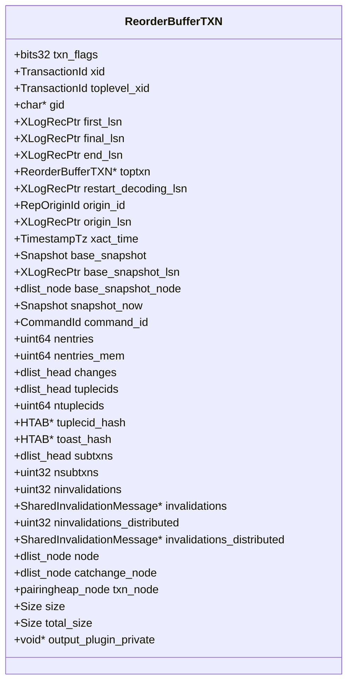
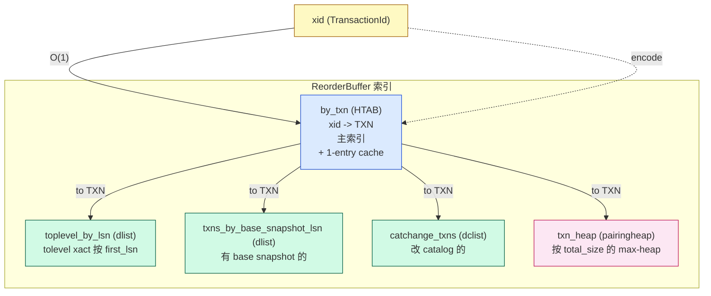
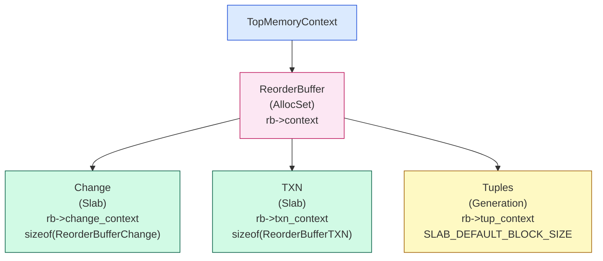
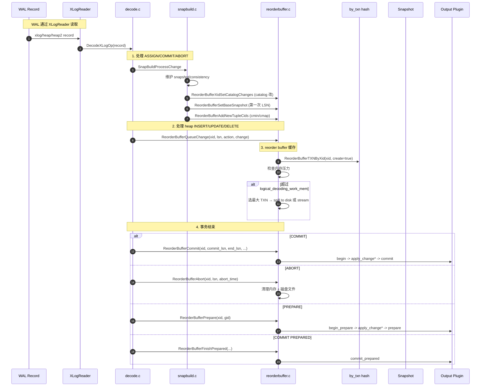
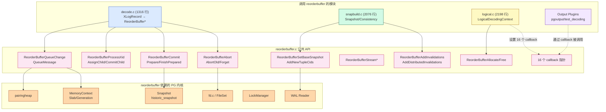
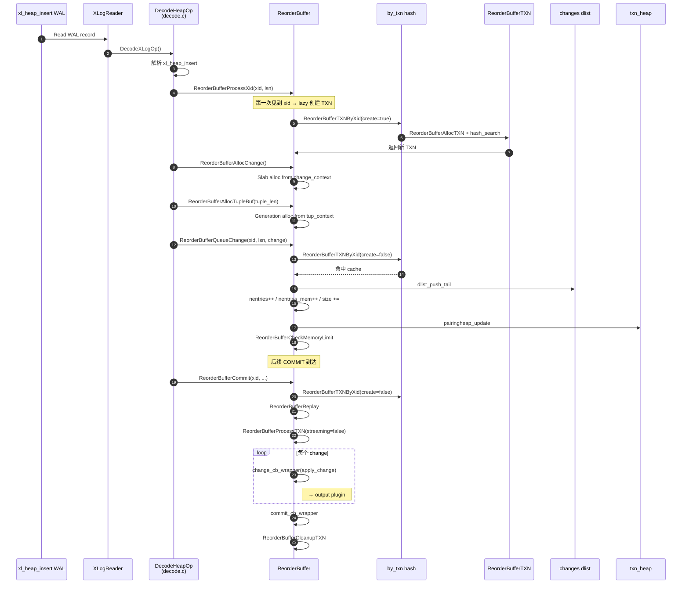
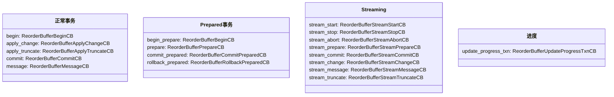

# reorderbuffer.c 源码深度解析:PostgreSQL 逻辑复制的"事务重组引擎"

## 引言:为什么 reorder buffer 是逻辑复制的核心

PostgreSQL 的逻辑复制链路:

```mermaid
flowchart LR
    WAL[WAL Record<br>(heap/heap2/xlog)]:::wal
    XR[XLogReader]:::xr
    DC[decode.c<br>解析 WAL]:::dc
    SB[snapbuild.c<br>构建快照]:::sb
    RB[reorderbuffer.c<br>事务重组+缓存]:::rb
    OP[Output Plugin<br>pgoutput / test_decoding]:::op
    NET[逻辑复制协议]:::net

    WAL --> XR --> DC
    DC -. "ReorderBufferXidHasCatalogChanges<br>ReorderBufferAddSnapshot" .-> SB
    SB -. "ReorderBufferXidSetCatalogChanges<br>ReorderBufferSetBaseSnapshot" .-> DC
    DC -->|"ReorderBufferQueueChange<br>ReorderBufferCommit/Abort"| RB
    RB -->|"callback:<br>begin/change/commit/stream_*"| OP
    OP --> NET

    classDef wal fill:#fef9c3,stroke:#a16207
    classDef xr fill:#fed7aa,stroke:#9a3412
    classDef dc fill:#dbeafe,stroke:#1d4ed8
    classDef sb fill:#d1fae5,stroke:#065f46
    classDef rb fill:#fce7f3,stroke:#be185d
    classDef op fill:#f3e8ff,stroke:#6b21a8
    classDef net fill:#fecaca,stroke:#991b1b
```

`reorderbuffer.c` 位于整条链路的 **中心位置**。它承担三个职责:

1. **事务重组**:把 WAL 顺序记录按 xid 分组,处理 subxact 嵌套,等待事务结束再按提交顺序输出
2. **变更缓存**:在内存中暂存所有 DML,直到事务 commit/prepare 后再 dispatch
3. **背压管理**:`logical_decoding_work_mem` 触发 spill-to-disk + streaming,避免 OOM

如果把逻辑复制类比成"消息队列":reorder buffer 就是 **那个 broker**,负责按事务维度把无序的 WAL 流重组为有序的变更流。

## 1. 文件定位与规模

| 维度 | 数值 |
|---|---|
| 文件路径 | `src/backend/replication/logical/reorderbuffer.c` |
| 总行数 | 5615 行 |
| 公共 API 数 | 17 个(extern) |
| static 函数数 | 60+ |
| 公共数据结构 | 3 个(`ReorderBuffer` / `ReorderBufferTXN` / `ReorderBufferChange`) |
| 状态机枚举 | 13 种 `ReorderBufferChangeType` |
| 内部数据结构 | 7 个(Hash entry、Iter state、Toast entry、Disk change 等) |
| 头文件 | `src/include/replication/reorderbuffer.h` (783 行) |

> **核心定位**:reorder buffer 是逻辑解码的 **"in-memory + on-disk 事务仓库"**。

## 2. 核心数据结构全景

### 2.1 `ReorderBuffer` 顶层结构(`reorderbuffer.h:574-695`)

```c
struct ReorderBuffer
{
    HTAB *by_txn;                    // xid -> ReorderBufferTXN 的主索引
    dlist_head toplevel_by_lsn;      // toplevel xact 按 first_lsn 排序
    dlist_head txns_by_base_snapshot_lsn;  // 有 base snapshot 的事务
    dclist_head catchange_txns;      // 修改了 catalog 的事务

    TransactionId by_txn_last_xid;   // 1-entry cache for by_txn
    ReorderBufferTXN *by_txn_last_txn;

    // 16 个 callback 函数指针
    ReorderBufferBeginCB begin;
    ReorderBufferApplyChangeCB apply_change;
    ReorderBufferApplyTruncateCB apply_truncate;
    ReorderBufferCommitCB commit;
    ReorderBufferMessageCB message;
    ReorderBufferBeginCB begin_prepare;
    ReorderBufferPrepareCB prepare;
    ReorderBufferCommitPreparedCB commit_prepared;
    ReorderBufferRollbackPreparedCB rollback_prepared;
    ReorderBufferStreamStartCB stream_start;
    ReorderBufferStreamStopCB stream_stop;
    ReorderBufferStreamAbortCB stream_abort;
    ReorderBufferStreamPrepareCB stream_prepare;
    ReorderBufferStreamCommitCB stream_commit;
    ReorderBufferStreamChangeCB stream_change;
    ReorderBufferStreamMessageCB stream_message;
    ReorderBufferStreamTruncateCB stream_truncate;
    ReorderBufferUpdateProgressTxnCB update_progress_txn;

    void *private_data;              // 指向 LogicalDecodingContext

    MemoryContext context;           // 顶层 context
    MemoryContext change_context;    // Slab: ReorderBufferChange
    MemoryContext txn_context;       // Slab: ReorderBufferTXN
    MemoryContext tup_context;       // Generation: tuple data

    char *outbuf;                    // disk<->memory 转换 buffer
    Size outbufsize;
    Size size;                       // 当前总内存使用

    pairingheap *txn_heap;           // 按 total_size 排序的 max-heap

    // 6 个统计计数器
    int64 spillTxns, spillCount, spillBytes;
    int64 streamTxns, streamCount, streamBytes;
    int64 totalTxns, totalBytes;
};
```

### 2.2 `ReorderBufferTXN` 事务结构(`reorderbuffer.h:293-470`)



**关键字段分组**:

| 字段组 | 作用 | 写入方 |
|---|---|---|
| `xid` / `toplevel_xid` / `toptxn` | 事务标识 + 父子关系 | `ReorderBufferTXNByXid` / `ReorderBufferAssignChild` |
| `first_lsn` / `final_lsn` / `end_lsn` | LSN 锚点 | WAL 解码时各阶段 |
| `base_snapshot` / `base_snapshot_lsn` | 起始快照 | `SnapBuildSetTxnBaseSnapshot` (snapbuild) |
| `changes` (dlist) | 变更链表 | `ReorderBufferQueueChange` |
| `tuplecids` / `tuplecid_hash` | catalog tuple cmin/cmap 映射 | `SnapBuildProcessNewTuple` (snapbuild) |
| `toast_hash` | TOAST 重组缓存 | `ReorderBufferToastAppendChunk` |
| `subtxns` (dlist) | 子事务列表 | `ReorderBufferCommitChild` |
| `txn_node` (pairingheap) | 内存压力时按 size 排序 | `ReorderBufferChangeMemoryUpdate` |
| `size` / `total_size` | 内存占用 | 同上 |

### 2.3 `ReorderBufferChange` 变更结构(`reorderbuffer.h:76-191`)

13 种 `action` 决定了 union 的语义:

```c
typedef enum ReorderBufferChangeType {
    REORDER_BUFFER_CHANGE_INSERT,              // INSERT
    REORDER_BUFFER_CHANGE_UPDATE,              // UPDATE (old+new)
    REORDER_BUFFER_CHANGE_DELETE,              // DELETE (old)
    REORDER_BUFFER_CHANGE_MESSAGE,             // 消息(pg_logical_emit_message)
    REORDER_BUFFER_CHANGE_INVALIDATION,        // cache invalidation
    REORDER_BUFFER_CHANGE_INTERNAL_SNAPSHOT,   // 内部:新 snapshot
    REORDER_BUFFER_CHANGE_INTERNAL_COMMAND_ID, // 内部:新 CID
    REORDER_BUFFER_CHANGE_INTERNAL_TUPLECID,   // 内部:新 cmin/cmap
    REORDER_BUFFER_CHANGE_INTERNAL_SPEC_INSERT,   // 内部:INSERT ON CONFLICT
    REORDER_BUFFER_CHANGE_INTERNAL_SPEC_CONFIRM,
    REORDER_BUFFER_CHANGE_INTERNAL_SPEC_ABORT,
    REORDER_BUFFER_CHANGE_TRUNCATE,            // TRUNCATE
} ReorderBufferChangeType;
```

**关键洞察**:`INTERNAL_*` 类型是 reorder buffer **自己**产生的元数据变更,不是用户 DML。output plugin 看不到这些。

## 3. 4 套索引与 3 套内存管理

### 3.1 4 套索引

reorder buffer 为事务维护 **4 套索引**,服务于不同场景:



| 索引 | 类型 | 排序键 | 用途 | 关键函数 |
|---|---|---|---|---|
| `by_txn` | HTAB | xid 哈希 | 主索引,xid -> TXN | `ReorderBufferTXNByXid` (含 1-entry cache) |
| `toplevel_by_lsn` | dlist | `first_lsn` 升序 | 找最老的 toplevel xact | `ReorderBufferGetOldestTXN` |
| `txns_by_base_snapshot_lsn` | dlist | `base_snapshot_lsn` 升序 | 算 oldest xmin | `ReorderBufferGetOldestXmin` |
| `catchange_txns` | dclist | 自定义 | 跟踪 catalog 变化 | `ReorderBufferXidSetCatalogChanges` |
| `txn_heap` | pairingheap | `total_size` 降序(max-heap) | 内存超限时找最大 TXN 驱逐 | `ReorderBufferLargestTXN` |

**1-entry cache 的设计意图** (`reorderbuffer.c:651-665`):

```c
// by_txn_last_xid + by_txn_last_txn
// 99% 的连续操作都是同一个 xid 的变更(同事务内)
if (rb->by_txn_last_xid == xid) {
    if (rb->by_txn_last_txn != NULL) {
        if (is_new) *is_new = false;
        return rb->by_txn_last_txn;       // 命中 cache
    }
    if (!create) return NULL;              // 之前查过不存在
}
```

这个优化能省掉绝大多数 hash 查表,在 streaming workload 下收益巨大。

### 3.2 3 套 MemoryContext

`ReorderBufferAllocate` (`reorderbuffer.c:324-413`) 创建 4 个 context:



| Context | 类型 | 为什么 | 含义 |
|---|---|---|---|
| `ReorderBuffer` (顶层) | AllocSet | 通用 | rb 结构体本身 |
| `Change` | **Slab** | ReorderBufferChange 全部等大 | 固定大小,无碎片 |
| `TXN` | **Slab** | ReorderBufferTXN 全部等大 | 同上 |
| `Tuples` | **Generation** | HeapTuple 变长 | 长生命周期,可 reset |

**为什么 Tuple 用 Generation 而不是 Slab?**

`reorderbuffer.c:381-390` 的注释:

> To minimize memory fragmentation caused by long-running transactions with changes spanning multiple memory blocks, we use a single fixed-size memory block for decoded tuple storage. The performance testing showed that the default memory block size maintains logical decoding performance without causing fragmentation due to concurrent transactions.

Generation 上下文允许在事务 commit 时一次性 reset 所有 tuple 内存,而不需要逐个 free。这对 **长事务** 特别重要。

## 4. 事务完整生命周期:从 WAL 到 commit callback



### 4.1 阶段 1:记录 WAL 类型

WAL 由 `XLogReader` 读取,`decode.c` 的 `DecodeXLogOp` 是入口。它根据 `XLogRecord->xl_info` 分发到 `xl_heap_insert` / `xl_heap_update` / `xl_heap_delete` 等处理函数。

**关键调用**:
- `ReorderBufferProcessXid` (decode.c:120) — 几乎每个 WAL record 都会调,触发"lazy"的事务结构创建
- `ReorderBufferAssignChild` (decode.c:107) — 处理子事务声明

### 4.2 阶段 2:变更入队

`ReorderBufferQueueChange`(`reorderbuffer.c:809-870`) 是 **最热路径**,每个 DML 都会走这里:

```c
void ReorderBufferQueueChange(ReorderBuffer *rb, TransactionId xid,
                              XLogRecPtr lsn, ReorderBufferChange *change)
{
    ReorderBufferTXN *txn;

    // (1) 查 or 创建 TXN
    txn = ReorderBufferTXNByXid(rb, xid, true, &is_new, lsn, true);
    change->txn = txn;

    // (2) 加入 changes dlist 末尾
    dlist_push_tail(&txn->changes, &change->node);

    // (3) 维护统计
    txn->nentries++;
    txn->nentries_mem++;
    txn->size += ReorderBufferChangeSize(change);
    rb->size += ReorderBufferChangeSize(change);

    // (4) 维护 pairheap
    txn->total_size = ...;
    if (is_new)
        pairingheap_add(txn_heap, &txn->txn_node);
    else
        pairingheap_update(txn_heap, &txn->txn_node);

    // (5) 内存压力检查
    ReorderBufferCheckMemoryLimit(rb);
}
```

**5 步骤的因果链**:

1. 查 or 创建 TXN:用 1-entry cache 避免 hash 查表
2. 加入 dlist 末尾:**保证 LSN 顺序**(与 WAL 顺序一致)
3. 更新 entries/size 计数
4. 更新 pairheap:新 xid 入堆,旧 xid 重新堆化
5. 检查内存:超限则触发 spill/stream

### 4.3 阶段 3:commit 触发 replay

`ReorderBufferCommit`(`reorderbuffer.c:2874-2896`):

```c
void ReorderBufferCommit(ReorderBuffer *rb, TransactionId xid,
                          XLogRecPtr commit_lsn, XLogRecPtr end_lsn,
                          TimestampTz commit_time,
                          RepOriginId origin_id, XLogRecPtr origin_lsn)
{
    ReorderBufferTXN *txn;
    txn = ReorderBufferTXNByXid(rb, xid, false, NULL, InvalidXLogRecPtr, false);
    if (txn == NULL) return;                    // 未知 xid,无需 replay
    ReorderBufferReplay(txn, rb, xid, commit_lsn, end_lsn, commit_time, ...);
}
```

`ReorderBufferReplay`(`reorderbuffer.c:2813-2871`) 是核心 dispatcher:

```c
void ReorderBufferReplay(ReorderBufferTXN *txn, ReorderBuffer *rb, ...)
{
    txn->final_lsn = commit_lsn;
    txn->end_lsn = end_lsn;
    ...

    // (1) 已 streaming 过的走流式 commit
    if (rbtxn_is_streamed(txn)) {
        ReorderBufferStreamCommit(rb, txn);
        return;
    }

    // (2) 没有 base snapshot 说明没改过表,跳过
    if (txn->base_snapshot == NULL) {
        Assert(txn->ninvalidations == 0);
        if (!rbtxn_is_prepared(txn))
            ReorderBufferCleanupTXN(rb, txn);
        return;
    }

    // (3) 走正常 replay
    snapshot_now = txn->base_snapshot;
    ReorderBufferProcessTXN(rb, txn, commit_lsn, snapshot_now,
                            FirstCommandId, false /* streaming */);
}
```

**3 个分支的设计意图**:
- 流式:已 streaming 的事务 commit 时只需发 `STREAM_COMMIT`
- 无 base snapshot:说明只做 DDL 或 no-op,直接清理
- 正常:进入 `ReorderBufferProcessTXN` 的复杂路径

### 4.4 阶段 4:`ReorderBufferProcessTXN` 全景

`reorderbuffer.c:2210-2810`(约 600 行)是 **整个文件最复杂的函数**。

```mermaid
flowchart TB
    Start["ReorderBufferProcessTXN"]:::start
    Build["ReorderBufferBuildTupleCidHash<br>构建 cmin/cmap 查询表"]:::setup
    SetupSnap["SetupHistoricSnapshot<br>设置解码快照"]:::setup
    BeginXact["BeginInternalSubTransaction<br>或 StartTransactionCommand"]:::setup
    CBegin{"流式?"}:::q
    BeginCb["rb->begin(rb, txn)"]:::cb
    BeginPrepCb["rb->begin_prepare(rb, txn)"]:::cb
    Iter["ReorderBufferIterTXNInit<br>k-way heap 合并"]:::iter
    Loop{"ReorderBufferIterTXNNext"}:::q
    Change["change != NULL"]:::node
    CheckXid["SetupCheckXidLive<br>检测并发 abort"]:::check
    Action["switch (change->action)"]:::switch
    Apply["rb->apply_change / apply_truncate / message"]:::cb
    SpChange["rb->stream_change (流式路径)"]:::cb
    Cleanup["Commit/Abort SubTransaction"]:::cleanup
    StreamEnd["rb->stream_stop (流式结束)"]:::cb
    End["ReorderBufferCleanupTXN"]:::end

    Start --> Build --> SetupSnap --> BeginXact --> CBegin
    CBegin -->|"否"| BeginCb
    CBegin -->|"是 (prepared)"| BeginPrepCb
    CBegin -->|"是 (stream)"--> Iter
    BeginCb --> Iter
    BeginPrepCb --> Iter
    Iter --> Loop
    Loop -->|"是"| Change
    Change --> CheckXid --> Action
    Action -->|"非流式"| Apply
    Action -->|"流式"| SpChange
    Apply --> Loop
    SpChange --> Loop
    Loop -->|"否"| Cleanup
    Cleanup -->|"非流式"| End
    Cleanup -->|"流式"| StreamEnd

    classDef start fill:#dbeafe,stroke:#1d4ed8
    classDef q fill:#fef9c3,stroke:#a16207
    classDef setup fill:#d1fae5,stroke:#065f46
    classDef cb fill:#fce7f3,stroke:#be185d
    classDef iter fill:#fed7aa,stroke:#9a3412
    classDef node fill:#dbeafe,stroke:#1d4ed8
    classDef check fill:#f3e8ff,stroke:#6b21a8
    classDef switch fill:#fef9c3,stroke:#a16207
    classDef cleanup fill:#d1fae5,stroke:#065f46
    classDef end fill:#fecaca,stroke:#991b1b
```

**关键设计**:
- **k-way heap 合并** (`ReorderBufferIterTXNInit/Next/Finish`):合并 toplevel + 多个 subxact 的 changes,按 LSN 顺序遍历
- **CHECK_FOR_INTERRUPTS()** 在每条变更前:防止长事务解码中无法响应取消
- **`SetupCheckXidLive`**:在 streaming/prepare 模式下检测 publisher 端并发 abort
- **`PG_TRY/PG_CATCH`**:保证 subtransaction 失败时能 rollback 不污染主事务

## 5. 内存压力管理:`ReorderBufferCheckMemoryLimit`

这是 reorder buffer **最重要的"自我保护"机制**。`reorderbuffer.c:3883-3962`:

```c
static void ReorderBufferCheckMemoryLimit(ReorderBuffer *rb)
{
    if (debug_logical_replication_streaming == DEBUG_LOGICAL_REP_STREAMING_BUFFERED &&
        rb->size < logical_decoding_work_mem * (Size) 1024)
        return;                                // 未超限,不做事

    while (rb->size >= logical_decoding_work_mem * (Size) 1024 ||
           debug_streaming_immediate) {
        // 路径 1: 优先 streaming(给 output plugin)
        if (ReorderBufferCanStartStreaming(rb) &&
            (txn = ReorderBufferLargestStreamableTopTXN(rb)) != NULL) {
            ReorderBufferStreamTXN(rb, txn);
        }
        // 路径 2: 否则 spill to disk
        else {
            txn = ReorderBufferLargestTXN(rb);
            ReorderBufferSerializeTXN(rb, txn);
        }
    }
}
```

### 5.1 决策流程图

```mermaid
flowchart TB
    Start["每次 QueueChange/QueueMessage"]:::start
    Check{"rb->size >=<br>logical_decoding_work_mem?"}:::q
    Return["直接 return"]:::ok
    CanStart{"CanStartStreaming?<br>(output plugin 支持<br>且 snapshot consistent<br>且当前 LSN 不需要 skip)"}:::q
    Largest1["LargestStreamableTopTXN<br>(从 txn_heap 取最大<br>tolevel 且可 stream 的)"]:::sel
    Stream["ReorderBufferStreamTXN<br>(走 ReorderBufferProcessTXN<br>streaming=true)"]:::stream
    Largest2["LargestTXN<br>(从 txn_heap 取最大的)"]:::sel
    Serialize["ReorderBufferSerializeTXN<br>(所有 change 写入磁盘)"]:::spill
    Loop{"rb->size 还超限?"}:::q
    Done["退出循环"]:::end

    Start --> Check
    Check -->|"否"| Return
    Check -->|"是"| CanStart
    CanStart -->|"是"| Largest1
    CanStart -->|"否"| Largest2
    Largest1 --> Stream
    Largest2 --> Serialize
    Stream --> Loop
    Serialize --> Loop
    Loop -->|"是"| CanStart
    Loop -->|"否"| Done

    classDef start fill:#dbeafe,stroke:#1d4ed8
    classDef q fill:#fef9c3,stroke:#a16207
    classDef ok fill:#d1fae5,stroke:#065f46
    classDef sel fill:#fce7f3,stroke:#be185d
    classDef stream fill:#d1fae5,stroke:#065f46
    classDef spill fill:#fed7aa,stroke:#9a3412
    classDef end fill:#d1fae5,stroke:#065f46
```

### 5.2 Spill-to-Disk 详解:`ReorderBufferSerializeTXN`

`reorderbuffer.c:3963-4057`:

```c
static void ReorderBufferSerializeTXN(ReorderBuffer *rb, ReorderBufferTXN *txn)
{
    // (1) 递归序列化所有 subxact
    dlist_foreach(subtxn_i, &txn->subtxns)
        ReorderBufferSerializeTXN(rb, subtxn);

    // (2) 按 LSN 所在 WAL segment 打开文件
    dlist_foreach_modify(change_i, &txn->changes) {
        if (fd == -1 || !XLByteInSeg(change->lsn, curOpenSegNo, wal_segment_size)) {
            // 切换 segment,关旧开新
            ReorderBufferSerializedPath(path, MyReplicationSlot, txn->xid, curOpenSegNo);
            fd = OpenTransientFile(path, O_CREAT|O_WRONLY|O_APPEND|PG_BINARY);
        }
        ReorderBufferSerializeChange(rb, txn, fd, change);
        dlist_delete(&change->node);
        ReorderBufferFreeChange(rb, change, false);
    }

    // (3) 更新统计
    rb->spillCount += 1;
    rb->spillBytes += size;
    rb->spillTxns += is_new_spill ? 1 : 0;

    txn->txn_flags |= RBTXN_IS_SERIALIZED;
}
```

**Spill 文件路径**(`reorderbuffer.c:279-280`):

```c
#define PG_LOGICAL_DIR "pg_logical"
ReorderBufferSerializedPath(path, MyReplicationSlot, txn->xid, segno);
// → $PGDATA/pg_logical/slotname/xid-segno
```

**关键设计**:
- **递归序列化 subxact**:toplevel 串行化时,所有 subxact 一起
- **按 WAL segment 切文件**:便于 truncate 时回收
- **O_APPEND 模式**:保证同一 segment 多 transaction 都能写入
- **删除内存中的 change**:释放 `rb->size` 计数

### 5.3 恢复:从 spill 文件回填

`ReorderBufferRestoreChanges`(`reorderbuffer.c:4510-4652`):

```c
static Size ReorderBufferRestoreChanges(ReorderBuffer *rb, ReorderBufferTXN *txn,
                                        TXNEntryFile *file, XLogSegNo *segno)
{
    // (1) 遍历 spill 文件,逐 change 反序列化
    while ((change = ReorderBufferRestoreChange(...)) != NULL) {
        dlist_push_tail(&txn->changes, &change->node);
        ...
    }
    // (2) 删除已读完的文件
    ReorderBufferSerializedPath(path, slot, xid, segno);
    unlink(path);
}
```

**触发恢复的时机**:
- 事务 commit 时,如果已 spill,从磁盘回填
- 事务 abort 时,直接删除 spill 文件

## 6. Streaming 路径:`ReorderBufferStreamTXN`

`reorderbuffer.c:4308-4403`(约 100 行)是 streaming 的核心:

```c
static void ReorderBufferStreamTXN(ReorderBuffer *rb, ReorderBufferTXN *txn)
{
    // (1) 第一次 stream:转移 subxact 的 base snapshot
    if (txn->snapshot_now == NULL) {
        dlist_foreach(subxact_i, &txn->subtxns)
            ReorderBufferTransferSnapToParent(txn, subtxn);
        if (txn->base_snapshot == NULL) return;   // 无变更,直接返回

        command_id = FirstCommandId;
        snapshot_now = ReorderBufferCopySnap(rb, txn->base_snapshot, txn, command_id);
    }
    // (2) 后续 stream:复用上次 snapshot
    else {
        command_id = txn->command_id;
        snapshot_now = ReorderBufferCopySnap(rb, txn->snapshot_now, txn, command_id);
        ReorderBufferFreeSnap(rb, txn->snapshot_now);
        txn->snapshot_now = NULL;
    }

    // (3) 记录统计数据
    txn_is_streamed = rbtxn_is_streamed(txn);
    stream_bytes = txn->total_size;

    // (4) 走 streaming 路径(不是正常 commit 路径)
    ReorderBufferProcessTXN(rb, txn, InvalidXLogRecPtr, snapshot_now,
                            command_id, true /* streaming */);

    // (5) 更新统计
    rb->streamCount += 1;
    rb->streamBytes += stream_bytes;
    rb->streamTxns += txn_is_streamed ? 0 : 1;
    UpdateDecodingStats(...);

    // (6) Assert: streaming 后 changes 全部输出
    Assert(dlist_is_empty(&txn->changes));
    Assert(txn->nentries == 0);
    Assert(txn->nentries_mem == 0);
}
```

### 6.1 Streaming vs Commit 的差异

| 维度 | `ReorderBufferCommit` | `ReorderBufferStreamTXN` |
|---|---|---|
| 触发时机 | 看到 COMMIT WAL | 内存超限,且 output plugin 支持 |
| 关键字段 | `commit_lsn` / `end_lsn` / `commit_time` | `InvalidXLogRecPtr` |
| 调 `ProcessTXN` 参数 | `streaming=false` | `streaming=true` |
| snapshot 来源 | `txn->base_snapshot` | `txn->base_snapshot` 或 `txn->snapshot_now`(复用) |
| output plugin 调用的 callback | `begin` / `apply_change` / `commit` | `stream_start` / `stream_change` / `stream_stop` / `stream_commit` |
| 何时发 COMMIT 消息 | 这次调用就发 | `ReorderBufferCommit` 时再发(走 `ReorderBufferStreamCommit`) |

### 6.2 Streaming 之后的变化

streaming 一次后,事务回到内存但 `changes` 列表清空(`Assert(dlist_is_empty(&txn->changes))`)。如果同一事务继续接收 WAL:
- 新的变更继续入队到 `changes`
- `ReorderBufferCheckMemoryLimit` 再次触发
- 走 `ReorderBufferStreamTXN` 的"已 stream"分支(`txn->snapshot_now != NULL`),复用之前的 snapshot

这就是 **streaming 多次** 的设计:output plugin 不需要为同一事务维护整个状态。

## 7. Subtransaction 处理:`AssignChild` / `CommitChild`

### 7.1 `ReorderBufferAssignChild`(`reorderbuffer.c:1098-1163`)

```c
void ReorderBufferAssignChild(ReorderBuffer *rb, TransactionId xid,
                              TransactionId subxid, XLogRecPtr lsn)
{
    ReorderBufferTXN *txn = ReorderBufferTXNByXid(rb, xid, false, NULL, lsn, false);
    ReorderBufferTXN *subtxn = ReorderBufferTXNByXid(rb, subxid, true, &is_new, lsn, false);

    if (is_new) {
        subtxn->toptxn = txn;
        subtxn->toplevel_xid = xid;
    } else if (subtxn->toptxn == NULL) {
        subtxn->toptxn = txn;
    }

    // 如果 subtxn 当前在 toplevel 列表(因为之前没认主),移到 subtxns 列表
    if (subtxn->toplevel_xid != xid) {
        dlist_delete(&subtxn->node);
        ...
    }
}
```

**关键设计**:
- 先把所有 xid 当 toplevel(`create_as_top=true`)
- 看到 ASSIGN 时**回填**父子关系
- 已认主的 subtxn 从 `toplevel_by_lsn` 移到 `toptxn->subtxns`

### 7.2 `ReorderBufferCommitChild`(`reorderbuffer.c:1218-1282`)

```c
void ReorderBufferCommitChild(ReorderBuffer *rb, TransactionId xid,
                              TransactionId subxid, XLogRecPtr commit_lsn,
                              XLogRecPtr end_lsn, ...)
{
    ReorderBufferTXN *subtxn = ReorderBufferTXNByXid(rb, subxid, false, ...);
    ReorderBufferTXN *toptxn = ReorderBufferTXNByXid(rb, xid, false, ...);

    // 1. 转移 base snapshot:子事务的变更要按父事务的快照解读
    if (subtxn->base_snapshot != NULL) {
        ReorderBufferTransferSnapToParent(toptxn, subtxn);
    }

    // 2. 转移 invalidation messages
    if (subtxn->ninvalidations > 0) {
        toptxn->invalidations = repalloc(toptxn->invalidations, ...);
        memcpy(toptxn->invalidations + toptxn->ninvalidations, ...);
        toptxn->ninvalidations += subtxn->ninvalidations;
    }

    // 3. 把 subxact 的 changes 转移到 toptxn
    dlist_splice(&toptxn->changes, &subtxn->changes);
    toptxn->nentries += subtxn->nentries;
    toptxn->nentries_mem += subtxn->nentries_mem;

    // 4. 删除 subtxn
    ReorderBufferCleanupTXN(rb, subtxn);
}
```

**关键洞察**:
- subxact commit 时,所有变更 **合并到 toptxn**(`dlist_splice`)
- 这样 toptxn 最终 commit 时,会按 LSN 顺序输出所有 subxact 的变更
- **base snapshot 只能从子事务转移到父事务,不能反向**(这是 snapshot 的语义决定)

## 8. Abort 处理:3 种路径

### 8.1 三种 abort 场景

| 函数 | 触发 | 作用 |
|---|---|---|
| `ReorderBufferAbort` | 显式 abort WAL 记录 | 清理已跟踪的 abort xact |
| `ReorderBufferAbortOld` | server restart 后 | 清理 startup 时已知 aborted 的 xact |
| `ReorderBufferForget` | `pg_replication_slot_advance` 跳过 | 释放被跳过的 xact(未真正 abort,只是不再需要) |

### 8.2 `ReorderBufferAbort` 详解(`reorderbuffer.c:3077-3122`)

```c
void ReorderBufferAbort(ReorderBuffer *rb, TransactionId xid, XLogRecPtr lsn,
                        TimestampTz abort_time)
{
    ReorderBufferTXN *txn = ReorderBufferTXNByXid(rb, xid, false, ...);
    if (txn == NULL) return;                   // 未知 xid

    txn->xact_time.abort_time = abort_time;

    // (1) 已 streaming 的事务:通知 output plugin
    if (rbtxn_is_streamed(txn)) {
        rb->stream_abort(rb, txn, lsn);
        if (txn->ninvalidations > 0)
            ReorderBufferImmediateInvalidation(rb, ...);  // 立即执行 invalidations
    }

    // (2) 清理内存 + 磁盘
    ReorderBufferCleanupTXN(rb, txn);
}
```

**关键点**:
- 显式 abort 一定要 **执行 invalidation**(因为 catalog 改动可能要恢复)
- 跟 `ReorderBufferAbortOld` 区别:old 不执行 invalidation(因为 server 已经 crash 过)

### 8.3 `ReorderBufferAbortOld` 详解(`reorderbuffer.c:3123-3168`)

```c
void ReorderBufferAbortOld(ReorderBuffer *rb, TransactionId oldestRunningXid)
{
    // (1) 按 LSN 顺序遍历 toplevel_by_lsn
    while ((txn = ReorderBufferGetOldestTXN(rb)) != NULL) {
        if (TransactionIdFollows(txn->xid, oldestRunningXid))
            break;                              // 还有运行的,停止
        ReorderBufferCheckAndTruncateAbortedTXN(rb, txn);
    }
}
```

**应用场景**:
- server restart 后,decoding 启动时调一次
- `oldestRunningXid` 来自 `pg_replication_slot_advance` 推进后的 RunningXacts
- 凡是 first_lsn < 推进点 且 xid 已不在 running 中的,都认为已 abort

## 9. 与其他模块的依赖关系

### 9.1 模块依赖图



### 9.2 调用方对 reorderbuffer 的 4 类操作

| 操作类型 | 函数 | 调用方 |
|---|---|---|
| **结构管理** | `ReorderBufferAllocate` / `ReorderBufferFree` | logical.c:215 / 684 |
| **状态通知** | `ReorderBufferSetBaseSnapshot` / `AddNewTupleCids` / `XidSetCatalogChanges` | snapbuild.c (snapshot 构建时) |
| **WAL 解析入队** | `ReorderBufferQueueChange` / `QueueMessage` / `ProcessXid` | decode.c (heap/xact/twophase record) |
| **事务终止** | `ReorderBufferCommit` / `Prepare` / `FinishPrepared` / `Abort` / `AbortOld` / `Forget` | decode.c (commit/abort WAL records) |
| **数据流式输出** | 16 个 callback | 被 reorderbuffer 主动调用 → output plugin |

### 9.3 完整调用栈:一条 INSERT 的旅程



## 10. 16 个 Callback 的全景

reorder buffer 用 16 个 callback 解耦"事务调度"和"具体数据输出":



**调用入口**:
- `begin` / `apply_change` / `commit`:在 `ReorderBufferProcessTXN` 中,流式=false 时
- `stream_*`:在 `ReorderBufferProcessTXN` 中,流式=true 时
- `prepare` / `commit_prepared` / `rollback_prepared`:在 `ReorderBufferPrepare` / `FinishPrepared` 中

## 11. 关键设计洞察

### 11.1 为什么需要 1-entry cache?

`reorderbuffer.c:651-665` 的注释揭示:

```c
// 99% 的连续操作都是同一个 xid 的变更(同事务内)
if (rb->by_txn_last_xid == xid) {
    if (rb->by_txn_last_txn != NULL) {
        if (is_new) *is_new = false;
        return rb->by_txn_last_txn;
    }
}
```

在一次事务的连续 INSERT/UPDATE 中,xid 保持不变。`by_txn_last_xid` 充当 micro-cache:
- 命中:直接返回,跳过 hash 查表
- 未命中且之前查过不存在(没创建):也跳过
- 未命中且未查过:走 hash 查表

### 11.2 为什么 LSN 顺序是 dlist 而不是排序结构?

```c
dlist_push_tail(&txn->changes, &change->node);
```

变更按 WAL 顺序到达,直接追加到 dlist 末尾即可:
- 维护成本 O(1)
- 遍历时天然 LSN 顺序
- 唯一的反序场景是 **streaming 多次 + 中间 spill**(`AssertTXNLsnOrder` 校验)

### 11.3 pairheap 为什么用 total_size 而不是 size?

```c
ReorderBufferTXNSizeCompare(...)
{
    // 父事务 + 所有子事务的 size
    return ... total_size ...
}
```

**理由**:驱逐时,选"驱逐它就能释放最多内存的事务"。父事务的 size 可能小,但加上 subxact 后很大。`total_size` 才能反映。

### 11.4 为什么 Tuple 用 Generation 而 Change 用 Slab?

| 维度 | Slab (Change) | Generation (Tuple) |
|---|---|---|
| 大小 | 固定(都是 `ReorderBufferChange` 结构体) | 变长(HeapTuple 数据) |
| 释放方式 | 显式 free | Reset 整个 context |
| 适合场景 | 短生命周期、高频分配/释放 | 长生命周期、事务结束时统一回收 |

### 11.5 为什么 streaming 时复用 snapshot?

```c
if (txn->snapshot_now == NULL) {
    // 第一次 stream
    snapshot_now = ReorderBufferCopySnap(rb, txn->base_snapshot, ...);
} else {
    // 后续 stream,复用上次 snapshot
    snapshot_now = ReorderBufferCopySnap(rb, txn->snapshot_now, ...);
    ReorderBufferFreeSnap(rb, txn->snapshot_now);
}
```

每次 stream 完,output plugin 那边已经收到了当时的 snapshot 表示的视图。后续新变更可以基于上次 snapshot 继续解码,不必重新分配。

## 12. 关键源码速查表

### 12.1 文件级速查

| 行号 | 名称 | 性质 | 一句话 |
|---|---|---|---|
| 324-413 | `ReorderBufferAllocate` | extern | 创建 ReorderBuffer + 4 个 context |
| 416-431 | `ReorderBufferFree` | extern | 释放 ReorderBuffer |
| 433-456 | `ReorderBufferAllocTXN` | static | 从 TXN slab 分配新事务 |
| 458-505 | `ReorderBufferFreeTXN` | static | 释放事务结构 |
| 506-520 | `ReorderBufferAllocChange` | extern | 从 Change slab 分配变更 |
| 521-589 | `ReorderBufferFreeChange` | extern | 释放变更结构 |
| 591-608 | `ReorderBufferAllocTupleBuf` | extern | 从 Generation 分配 tuple 内存 |
| 651-739 | `ReorderBufferTXNByXid` | static | xid -> TXN,带 1-entry cache |
| 740-808 | `ReorderBufferProcessPartialChange` | static | 处理 streaming 时的部分变更 |
| 809-870 | `ReorderBufferQueueChange` | extern | **最热路径**,DML 入队 |
| 872-940 | `ReorderBufferQueueMessage` | extern | logical message 入队 |
| 941-1010 | `AssertTXNLsnOrder` | static | 调试用,断言 LSN 顺序 |
| 1012-1041 | `AssertChangeLsnOrder` | static | 调试用,断言 change 顺序 |
| 1043-1058 | `ReorderBufferGetOldestTXN` | static | 找最老 toplevel TXN |
| 1071-1085 | `ReorderBufferGetOldestXmin` | extern | 算 oldest xmin |
| 1086-1096 | `ReorderBufferSetRestartPoint` | extern | 设置 restart decoding LSN |
| 1098-1162 | `ReorderBufferAssignChild` | extern | 标记父子事务 |
| 1164-1216 | `ReorderBufferTransferSnapToParent` | static | 转移 base snapshot 到父事务 |
| 1218-1281 | `ReorderBufferCommitChild` | extern | subxact commit,合并到父 |
| 1283-1408 | `ReorderBufferIterTXNInit` | static | k-way heap 初始化 |
| 1410-1501 | `ReorderBufferIterTXNNext` | static | 取下一个 change(LSN 顺序) |
| 1503-1532 | `ReorderBufferIterTXNFinish` | static | 清理 iter state |
| 1534-1654 | `ReorderBufferCleanupTXN` | static | **关键**:事务清理,删除磁盘文件 |
| 1655-1771 | `ReorderBufferTruncateTXN` | static | 截断 spill 文件 |
| 1773-1833 | `ReorderBufferCheckAndTruncateAbortedTXN` | static | 检查并截断已 abort 的事务 |
| 1835-1907 | `ReorderBufferBuildTupleCidHash` | static | 构建 cmin/cmap 哈希表 |
| 1908-1965 | `ReorderBufferCopySnap` | static | 复制 snapshot,加入 subxact |
| 1967-1980 | `ReorderBufferFreeSnap` | static | 释放 snapshot |
| 1982-2070 | `ReorderBufferStreamCommit` | static | 流式 commit |
| 2071-2083 | `ReorderBufferApplyChange` | static | 触发 apply_change callback |
| 2085-2097 | `ReorderBufferApplyTruncate` | static | 触发 apply_truncate callback |
| 2099-2117 | `ReorderBufferApplyMessage` | static | 触发 message callback |
| 2119-2162 | `ReorderBufferMaybeMarkTXNStreamed` | static | 标记事务已 streaming |
| 2164-2208 | `ReorderBufferResetTXN` | static | 重置 TXN 状态 |
| **2210-2810** | **`ReorderBufferProcessTXN`** | static | **600 行核心**,replay 入口 |
| 2813-2871 | `ReorderBufferReplay` | static | commit/prepare/abort 后的 dispatcher |
| **2874-2895** | `ReorderBufferCommit` | extern | commit WAL 入口 |
| 2897-2928 | `ReorderBufferRememberPrepareInfo` | extern | 记 prepare 信息 |
| 2929-2949 | `ReorderBufferSkipPrepare` | extern | 标记跳过 prepare |
| 2950-2989 | `ReorderBufferPrepare` | extern | prepare WAL 入口 |
| 2991-3076 | `ReorderBufferFinishPrepared` | extern | commit prepared/rollback prepared |
| 3077-3122 | `ReorderBufferAbort` | extern | abort WAL 入口 |
| 3123-3168 | `ReorderBufferAbortOld` | extern | startup 时清理老 abort |
| 3170-3211 | `ReorderBufferForget` | extern | slot advance 时释放 |
| 3212-3242 | `ReorderBufferInvalidate` | extern | 标记事务需要 invalidation |
| 3243-3277 | `ReorderBufferImmediateInvalidation` | extern | 立即执行 invalidation |
| 3279-3290 | `ReorderBufferProcessXid` | extern | 通用 xid 处理(触发 lazy 创建) |
| 3292-3309 | `ReorderBufferAddSnapshot` | extern | 内部:加入新 snapshot change |
| 3310-3339 | `ReorderBufferSetBaseSnapshot` | extern | 设置 base snapshot |
| 3341-3367 | `ReorderBufferAddNewCommandId` | extern | 加入新 CID change |
| 3369-3438 | `ReorderBufferChangeMemoryUpdate` | static | 维护 size + pairheap |
| 3440-3466 | `ReorderBufferAddNewTupleCids` | extern | 加入 cmin/cmap 映射 |
| 3467-3527 | `ReorderBufferQueueInvalidations` | static | 缓存 invalidation |
| 3528-3568 | `ReorderBufferAddInvalidations` | extern | 加入 invalidation(本事务) |
| 3569-3638 | `ReorderBufferAddDistributedInvalidations` | extern | 加入 invalidation(其他事务) |
| 3639-3676 | `ReorderBufferXidSetCatalogChanges` | extern | 标记 xid 改了 catalog |
| 3677-3711 | `ReorderBufferGetCatalogChangesXacts` | extern | 遍历 catalog 改的 xact |
| 3712-3727 | `ReorderBufferXidHasCatalogChanges` | extern | 检查 xid 是否改 catalog |
| 3729-3757 | `ReorderBufferXidHasBaseSnapshot` | extern | 检查 xid 是否有 base snapshot |
| 3759-3790 | `ReorderBufferSerializeReserve` | static | 预留 spill 空间 |
| 3792-3831 | `ReorderBufferLargestTXN` | static | 找最大事务(从 pairheap) |
| 3833-3881 | `ReorderBufferLargestStreamableTopTXN` | static | 找最大可 stream 的 toplevel |
| **3883-3962** | **`ReorderBufferCheckMemoryLimit`** | static | **核心**:内存压力管理 |
| 3963-4057 | `ReorderBufferSerializeTXN` | static | **核心**:spill to disk |
| 4058-4270 | `ReorderBufferSerializeChange` | static | 单个 change 序列化 |
| 4273-4277 | `ReorderBufferCanStream` | static inline | output plugin 是否支持 streaming |
| 4282-4300 | `ReorderBufferCanStartStreaming` | static inline | 当前是否能开始 streaming |
| 4308-4403 | `ReorderBufferStreamTXN` | static | **核心**:streaming 入口 |
| 4425-4508 | `ReorderBufferChangeSize` | static | 算 change 占用内存 |
| 4510-4651 | `ReorderBufferRestoreChanges` | static | 从 spill 文件回填 |
| 4653-4819 | `ReorderBufferRestoreChange` | static | 单个 change 反序列化 |
| 4820-4906 | `ReorderBufferRestoreCleanup` | static | 清理回填中间状态 |
| 4907-4940 | `StartupReorderBuffer` | extern | 模块初始化(暂未实现) |
| 4941-4960 | `ReorderBufferToastInitHash` | static | 初始化 TOAST hash |
| 4961-5042 | `ReorderBufferToastAppendChunk` | static | 追加 TOAST chunk |
| 5044-5234 | `ReorderBufferToastReplace` | static | 替换完整 TOAST |
| 5235-5600 | `ReorderBufferToastReset` | static | 重置 TOAST hash |
| 5601-end | `ReorderBufferGetInvalidations` | static | 获取事务的 invalidations |

### 12.2 reorderbuffer 与 decode.c 的调用关系

| decode.c 行号 | 调用的 RB 函数 | WAL 触发类型 |
|---|---|---|
| 107 | `ReorderBufferAssignChild` | XLOG_XACT_ASSIGNMENT |
| 120 / 134 / 365 / 411 / 475 / 599 | `ReorderBufferProcessXid` | 各种 xid-bearing record |
| 297 | `ReorderBufferAddInvalidations` | XLOG_INVALIDATIONS |
| 301 | `ReorderBufferXidSetCatalogChanges` | XLOG_INVALIDATIONS |
| 305 | `ReorderBufferImmediateInvalidation` | XLOG_INVALIDATIONS |
| 329 | `ReorderBufferProcessXid` | XLOG_XACT_TWOPHASE |
| 384 | `ReorderBufferAbortOld` | StartupXLog / restart point |
| 650 | `ReorderBufferQueueMessage` | XLOG_LOGICAL_MESSAGE |
| 707 / 709 | `ReorderBufferForget` | XLOG_XACT_COMMIT (被 slot advance 跳过) |
| 717 | `ReorderBufferCommitChild` | XLOG_XACT_COMMIT (subxact) |
| 727 | `ReorderBufferFinishPrepared` | XLOG_XACT_COMMIT_PREPARED |
| 734 | `ReorderBufferCommit` | XLOG_XACT_COMMIT (toplevel) |
| 780 | `ReorderBufferRememberPrepareInfo` | XLOG_XACT_PREPARE |
| 788 | `ReorderBufferSkipPrepare` | XLOG_XACT_PREPARE |
| 806 | `ReorderBufferSkipPrepare` | XLOG_XACT_ABORT (prepared) |
| 807 | `ReorderBufferInvalidate` | XLOG_XACT_ABORT (prepared) |
| 814 | `ReorderBufferCommitChild` | XLOG_XACT_PREPARE (subxact) |
| 819 | `ReorderBufferPrepare` | XLOG_XACT_PREPARE |
| 867 | `ReorderBufferFinishPrepared` | XLOG_XACT_COMMIT/ABORT_PREPARED |
| 876 / 880 | `ReorderBufferAbort` | XLOG_XACT_ABORT |
| 941 | `ReorderBufferQueueChange` | xl_heap_insert/update/delete |
| 972+ | `ReorderBufferAllocChange` / `AllocTupleBuf` | 各 heap WAL record |

### 12.3 reorderbuffer 与 snapbuild.c 的调用关系

| snapbuild.c 行号 | 调用的 RB 函数 | 作用 |
|---|---|---|
| 661 | `ReorderBufferXidHasBaseSnapshot` | 检查 xid 是否有 base snapshot |
| 676 | `ReorderBufferSetBaseSnapshot` | 第一次 LSN 时设置 base snapshot |
| 698 | `ReorderBufferXidSetCatalogChanges` | 标记 catalog 改的 xid |
| 700 | `ReorderBufferAddNewTupleCids` | 加入 catalog tuple cmin/cmap |
| 719 | `ReorderBufferAddNewCommandId` | 加入 CID |
| 767 | `ReorderBufferXidHasBaseSnapshot` | 检查是否需要设 base snapshot |
| 785 | `ReorderBufferAddSnapshot` | 内部:加入 snapshot change |
| 810 | `ReorderBufferGetInvalidations` | 取本事务的 invalidations |
| 817 | `ReorderBufferAddDistributedInvalidations` | 加入 distributed invalidations |
| 1083 | `ReorderBufferXidHasBaseSnapshot` | running xacts 时检查 |
| 1086 | `ReorderBufferSetBaseSnapshot` | running xacts 时设置 |
| 1109 | `ReorderBufferXidHasCatalogChanges` | 检查 catalog 改 |
| 1181 | `ReorderBufferGetOldestXmin` | 算 oldest xmin |
| 1207 | `ReorderBufferGetOldestTXN` | 找最老 toplevel TXN |

## 13. 实战场景分析

### 13.1 场景 1:tpcc-100wh 产生数百万 spill 文件

**为什么?**

```c
// logical_decoding_work_mem 默认 128MB
// tpcc-100wh 单事务可能涉及数百个 warehouse 的新订单
// 一次 INSERT 可能涉及数十万行
```

**reorder buffer 的应对**:
1. `ReorderBufferQueueChange` 每次都检查 `ReorderBufferCheckMemoryLimit`
2. 128MB 触发 `ReorderBufferSerializeTXN`
3. 选最大的 TXN(可能就是刚入队的),spill 到 `$PGDATA/pg_logical/slotname/xid-segno`
4. 提交后再回填、清理

**为什么会有 500w+ spill 文件?**
- 100wh TPC-C 长时间运行,即使 streaming 模式,大事务也容易多次 spill
- 每次 spill 切 segment 时创建新文件
- 事务结束清理(删除),但短时间内堆积

### 13.2 场景 2:streaming 模式下的"反复 stream"

**触发条件**:
- sub 创建时设置 `streaming = parallel` 或 `streaming = on`
- output plugin 注册了 `stream_start_cb` 等

**流程**:
1. LA 第一次 stream:`ReorderBufferStreamTXN` → `ProcessTXN(streaming=true)`
2. 调用 `stream_start` / `stream_change` / `stream_stop` → output plugin
3. 事务回到内存但 changes 清空
4. 后续 WAL 继续进 `changes` 列表
5. 内存超限时再次 stream

**关键观察**:streaming 之后,事务的 changes 列表已空。如果再次 stream,`ReorderBufferStreamTXN` 中 `txn->snapshot_now != NULL` 走 else 分支,**复用上次的 snapshot**。

### 13.3 场景 3:subxact commit 合并到父

```sql
BEGIN;
  INSERT INTO t1 VALUES (1);   -- subxact 1
  SAVEPOINT s1;
  INSERT INTO t1 VALUES (2);
  RELEASE SAVEPOINT s1;
COMMIT;
```

**reorder buffer 视角**:
1. 看到 `XLOG_XACT_ASSIGNMENT`:`ReorderBufferAssignChild` 标记父子
2. 看到 `xl_heap_insert` xid=subxact1:`ReorderBufferQueueChange` 创建 subtxn,变更入 subtxn->changes
3. 看到 `XLOG_XACT_COMMIT` xid=subxact1:`ReorderBufferCommitChild`:
   - 转移 base snapshot(如果有)
   - `dlist_splice` 把 subtxn->changes 合并到 toptxn->changes
   - 删除 subtxn
4. 看到 `XLOG_XACT_COMMIT` xid=toplevel:`ReorderBufferCommit` → `ReorderBufferReplay`

**最终 output plugin 看到的**:两次 INSERT 按 LSN 顺序输出(可能是 subxact 的 1 在前,toplevel 的 2 在后)。

## 14. 与其他模块的接口契约

### 14.1 reorder buffer 期望的"环境"

| 条件 | 触发 | 后果 |
|---|---|---|
| `MyReplicationSlot` 已设置 | `ReorderBufferAllocate` | 用于 spill 文件路径 |
| `wal_level >= logical` | 不在 reorder buffer 检查 | logical.c / output plugin 负责 |
| 拥有 `ReorderBufferTXN` | `ReorderBufferCleanupTXN` 时 | 释放所有 subxact + spill 文件 |
| Callback 已设置 | `ReorderBufferProcessTXN` 调 callback | 否则会段错误 |

### 14.2 reorder buffer 保证的不变量

| 不变量 | 维护机制 |
|---|---|
| 同一 xid 只对应一个 TXN | `ReorderBufferTXNByXid` + 1-entry cache |
| `changes` 列表按 LSN 升序 | `dlist_push_tail` + `AssertTXNLsnOrder` |
| `base_snapshot` 来自第一次 LSN | `ReorderBufferSetBaseSnapshot` (snapbuild) |
| `total_size` = toptxn.size + Σ subtxn.size | `ReorderBufferChangeMemoryUpdate` |
| spill 文件在事务 commit/abort 时被删 | `ReorderBufferCleanupTXN` |
| pairheap 始终按 total_size 降序 | `ReorderBufferChangeMemoryUpdate` 中 update |

## 15. 总结

### 15.1 reorder buffer 的本质

> **reorder buffer = 内存 + 磁盘的"事务仓库"**,负责把无序的 WAL 重组为有序的、按事务维度的变更流。

它实现了 4 个核心能力:

1. **事务重组**:从 WAL 流中按 xid 分组,subxact 合并到父事务
2. **变更缓存**:在内存中保留所有 DML,直到 commit
3. **背压管理**:`logical_decoding_work_mem` 触发 spill-to-disk + streaming
4. **快照集成**:与 snapbuild 协作,保证变更解码的一致性快照

### 15.2 关键洞察清单

1. **1-entry cache** 是热路径的 micro-optimization,99% 命中
2. **4 套索引** 各司其职,by_txn 主查,3 个 dlist 用于遍历,pairheap 用于驱逐
3. **3 套 MemoryContext** 区分等大/变长/短生命周期
4. **`ReorderBufferProcessTXN` 是 600 行的"巨无霸"**,所有 replay 都走这里
5. **streaming 复用 snapshot** 是 streaming 多次的基石
6. **subxact commit 合并到父** 让 toplevel 的 commit 输出包含所有 subxact
7. **spill 文件按 WAL segment 切**,便于 truncate 时回收

### 15.3 推荐关联阅读

- [PostgreSQL 逻辑复制 streaming 机制](../postgresql-logical-replication-streaming/) — streaming 业务层
- [PostgreSQL 逻辑复制 spill 文件分析](../postgresql-logical-replication-spill-files/) — spill 详细分析
- [PostgreSQL 逻辑复制 MVCC 与事务机制](../postgresql-logical-replication-mvcc-transaction/) — 事务一致性与 reorder buffer 的关系
- [PostgreSQL 逻辑复制 reorder buffer 与快照](../postgresql-logical-replication-reorder-buffer-snapshot/) — 快照管理
- [PostgreSQL 逻辑复制并行解码](../postgresql-logical-replication-parallel-decoding/) — parallel apply 的源数据

## 参考

- `src/backend/replication/logical/reorderbuffer.c` (5615 行) — 本篇分析对象
- `src/include/replication/reorderbuffer.h` (783 行) — 公共头文件
- `src/backend/replication/logical/decode.c` (1316 行) — 主要调用方(WAL 解析)
- `src/backend/replication/logical/snapbuild.c` (2076 行) — 协作方(snapshot 管理)
- `src/backend/replication/logical/logical.c` (2198 行) — 装配层(设置 callback)
- `src/backend/replication/slotsync.c` — slot 同步(部分使用 ReorderBuffer)
- `src/backend/storage/file/fd.c` — OpenTransientFile 实现
- `src/backend/utils/mmgr/slab.c` — SlabContext 实现
- `src/backend/utils/mmgr/generation.c` — GenerationContext 实现
- `src/backend/lib/pairingheap.c` — pairheap 实现
- PostgreSQL 18 源码:`git log --follow src/backend/replication/logical/reorderbuffer.c` 可查看提交历史
