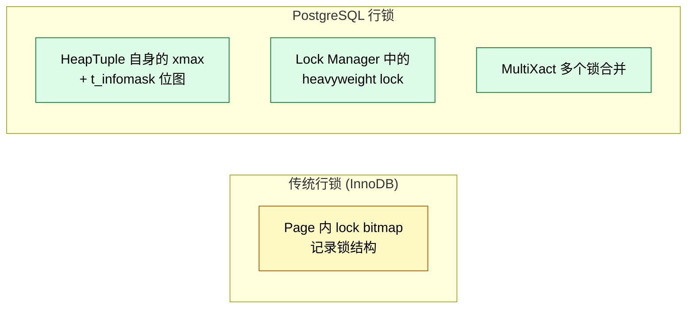
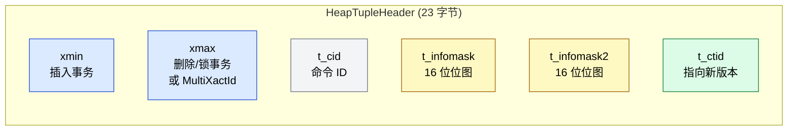
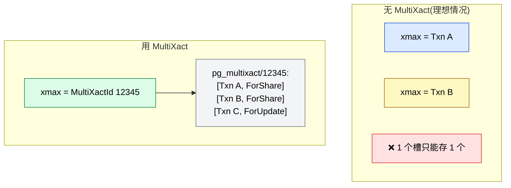
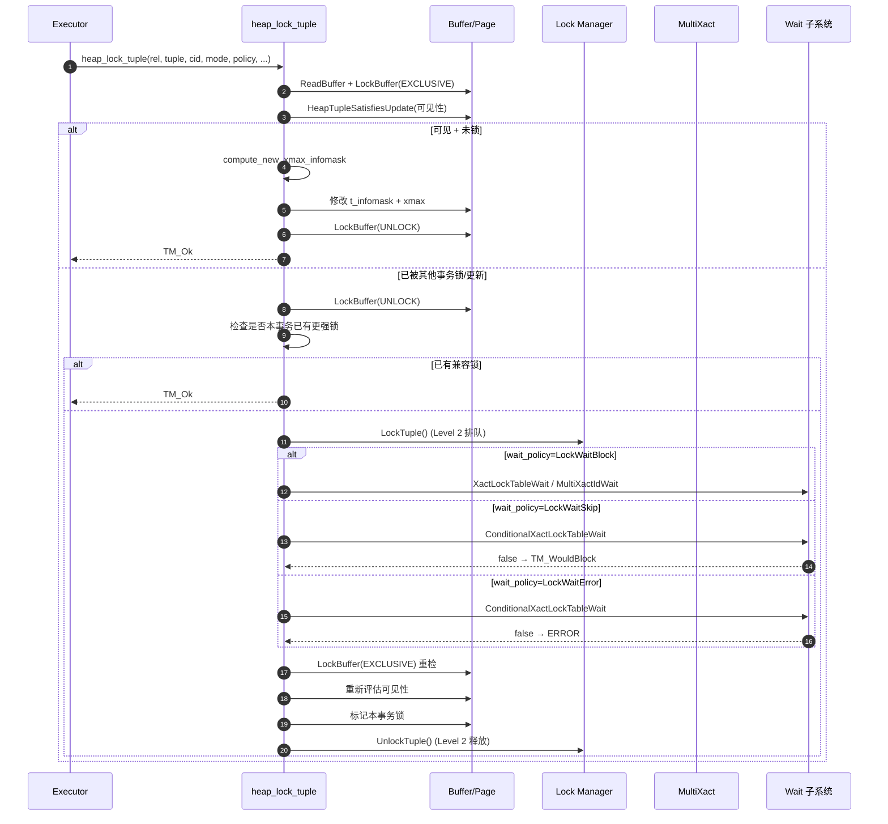
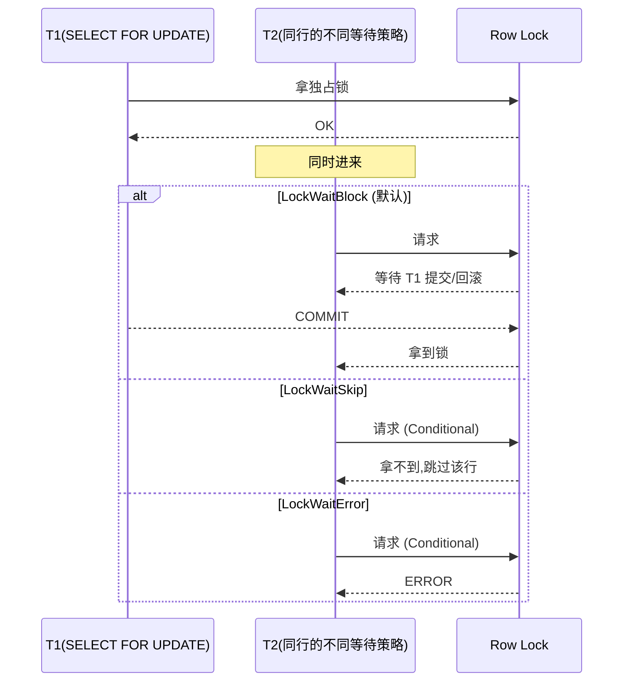
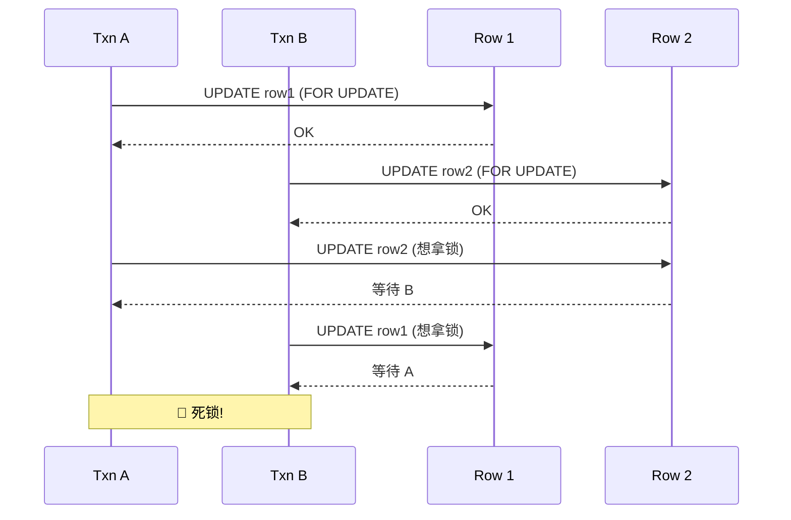
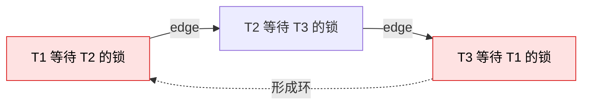
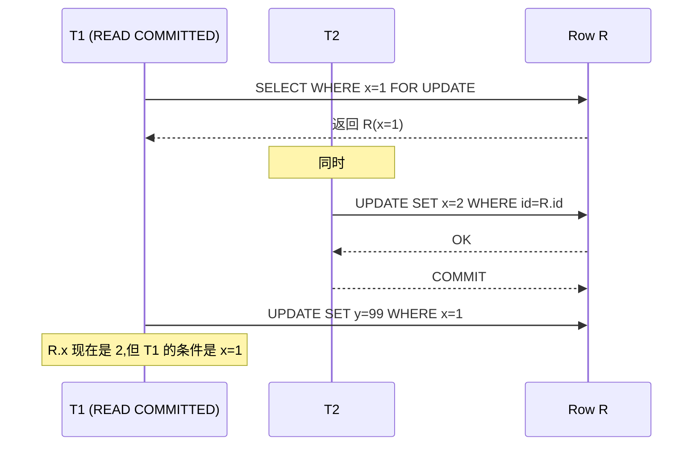
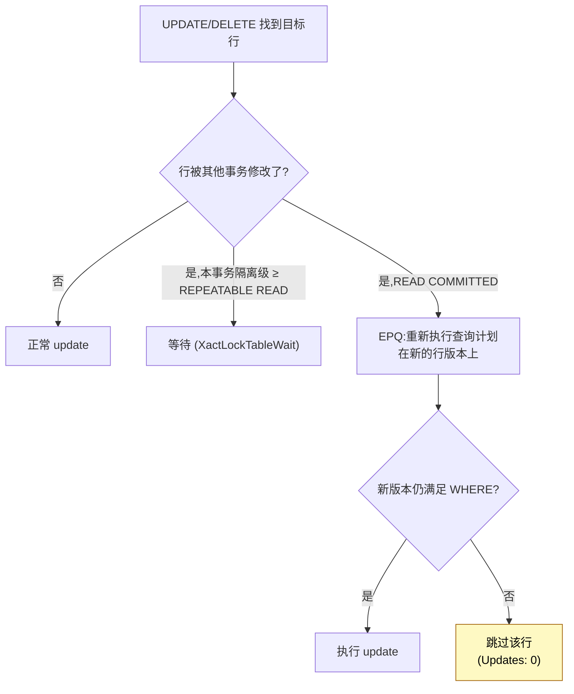
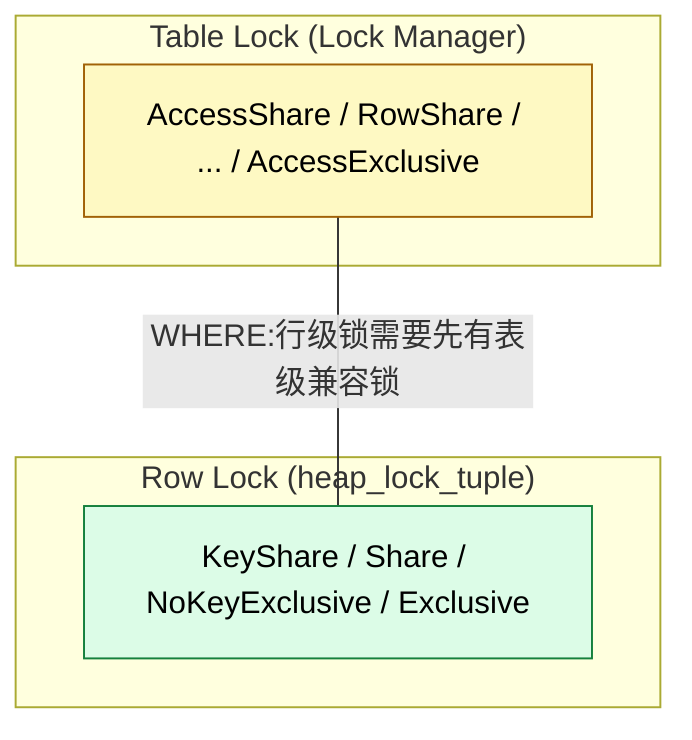

# PostgreSQL 行锁机制深度解析:从 MVCC 到多级锁的完整链路

> 配套源码:`~/cwork/postgresql`(基于 PG 18 主干)
>
> 读完本文你会理解:
> 1. PG 的行锁**不是独立数据结构**,而是建立在 MVCC 之上的"乐观锁"
> 2. 4 种锁模式的**冲突矩阵**和它们的 SQL 触发方式
> 3. **两级锁实现**:tuple header 上的 `xmax + infomask` 和 `lock manager` 的 heavyweight lock
> 4. **MultiXact** 如何把多个并发锁压缩进 1 个 `xmax` 槽
> 5. `heap_lock_tuple` 完整调用链
> 6. 死锁防护、等待策略、EvalPlanQual 等高级话题

---

## 一、PG 行锁的本质:基于 MVCC 的"乐观锁"

和其他数据库(InnoDB 的 record lock)不同,**PG 的行锁不是一个独立的数据结构**,而是建立在 MVCC 多版本之上的"乐观锁":



**核心思想**(来源:`src/backend/access/heap/README.tuplock`):

> "Locking tuples is not as easy as locking tables or other database objects. The problem is that transactions might want to lock large numbers of tuples at any one time, so it's not possible to keep the locks objects in shared memory."

PG 的解决方式:

1. **Level 1**(多数情况):把锁信息直接写在 tuple header 上,利用已有的 MVCC 字段
2. **Level 2**(并发等锁时):通过 lock manager 的 heavyweight lock 排序等待者

---

## 二、4 种锁模式与冲突矩阵

源码位置:`src/include/nodes/lockoptions.h:49`。

```c
// src/include/nodes/lockoptions.h:49
typedef enum LockTupleMode
{
    /* SELECT FOR KEY SHARE */
    LockTupleKeyShare,
    /* SELECT FOR SHARE */
    LockTupleShare,
    /* SELECT FOR NO KEY UPDATE, and UPDATEs that don't modify key columns */
    LockTupleNoKeyExclusive,
    /* SELECT FOR UPDATE, UPDATEs that modify key columns, and DELETE */
    LockTupleExclusive,
} LockTupleMode;
```

### 2.1 触发方式

| 锁模式 | 触发 SQL | 含义 |
|--------|---------|------|
| `FOR KEY SHARE` | `SELECT ... FOR KEY SHARE` | **最弱**:阻止主键修改、删除。允许其他 FOR SHARE、FOR UPDATE 升级时失败。**用于外键检查** |
| `FOR SHARE` | `SELECT ... FOR SHARE` | 阻止元组修改(任何 UPDATE/DELETE),但允许多个 SHARE 共存 |
| `FOR NO KEY UPDATE` | `SELECT ... FOR NO KEY UPDATE`<br>`UPDATE` 不改主键 | 阻止其他独占锁,但允许 KEY SHARE |
| `FOR UPDATE` | `SELECT ... FOR UPDATE`<br>`UPDATE` 改主键<br>`DELETE` | **最强**:阻止所有其他锁和更新 |

### 2.2 冲突矩阵

来自 `src/backend/access/heap/README.tuplock` 的官方注释:

```
                  UPDATE       NO KEY UPDATE    SHARE        KEY SHARE
UPDATE           conflict        conflict      conflict      conflict
NO KEY UPDATE    conflict        conflict      conflict
SHARE            conflict        conflict
KEY SHARE        conflict
```

可视化:

```mermaid
flowchart TB
    subgraph Matrix["冲突矩阵 (Y=持有 X=请求)"]
        H1["请求 ↓ / 持有 →"]
        H2["FOR UPDATE"]:::excl
        H3["FOR NO KEY UPDATE"]:::excl
        H4["FOR SHARE"]:::shr
        H5["FOR KEY SHARE"]:::shr
    end

    H1 --> C1[""]:::excl
    H1 --> C2["C"]:::conflict
    H1 --> C3["C"]:::conflict
    H1 --> C4["C"]:::conflict
    H1 --> C5["C"]:::conflict

    H2 --> C1["C"]:::conflict
    H2 --> C2["C"]:::conflict
    H2 --> C3["C"]:::conflict
    H2 --> C4["-"]:::ok

    H3 --> C1["C"]:::conflict
    H3 --> C2["C"]:::conflict
    H3 --> C3["-"]:::ok
    H3 --> C4["-"]:::ok

    H4 --> C1["C"]:::conflict
    H4 --> C2["-"]:::ok
    H4 --> C3["-"]:::ok
    H4 --> C4["-"]:::ok

    H5 --> C1["-"]:::ok

    classDef excl fill:#fee2e2,stroke:#dc2626,color:#000
    classDef shr fill:#fef9c3,stroke:#a16207,color:#000
    classDef conflict fill:#dc2626,stroke:#000,color:#fff
    classDef ok fill:#dcfce7,stroke:#15803d,color:#000
```

**关键观察**:

- `FOR KEY SHARE` 是**单向兼容**的:它与所有东西兼容,反过来 `FOR UPDATE` 等都和它冲突(因为强锁要等所有弱锁)
- `FOR UPDATE` 与所有都冲突
- 4 个模式的冲突矩阵呈**偏序关系**

---

## 三、行锁的两级实现

源码 `src/backend/access/heap/README.tuplock` 明确说明:

> "We use a two-level mechanism. The first level is implemented by storing locking information in the tuple header... When multiple transactions concurrently lock a tuple, a MultiXact is used... The second level is provided by the standard lock manager."

### 3.1 Level 1:Tuple Header 上的 `xmax + infomask`

源码位置:`src/include/access/htup_details.h:194-275`。

```c
// src/include/access/htup_details.h:194
#define HEAP_XMAX_KEYSHR_LOCK   0x0010  /* xmax is a key-shared locker */
#define HEAP_XMAX_EXCL_LOCK     0x0040  /* xmax is an exclusive locker */
#define HEAP_XMAX_LOCK_ONLY     0x0080  /* xmax, if valid, is only a locker */

#define HEAP_XMAX_SHR_LOCK      (HEAP_XMAX_EXCL_LOCK | HEAP_XMAX_KEYSHR_LOCK)
#define HEAP_LOCK_MASK          (HEAP_XMAX_SHR_LOCK | HEAP_XMAX_EXCL_LOCK |
                                 HEAP_XMAX_KEYSHR_LOCK)
```

**一个 tuple header 实际长这样**:



**关键位**(行锁相关):

| 位 | 含义 |
|----|------|
| `HEAP_XMAX_INVALID` (0x0800) | xmax 无效(rollback 了) |
| `HEAP_XMAX_COMMITTED` (0x0400) | xmax 已提交 |
| `HEAP_XMAX_IS_MULTI` (0x1000) | xmax 是一个 MultiXactId(多个锁) |
| `HEAP_XMAX_LOCK_ONLY` (0x0080) | xmax 只是个 locker,不是 deleter |
| `HEAP_XMAX_EXCL_LOCK` (0x0040) | 独占锁 |
| `HEAP_XMAX_KEYSHR_LOCK` (0x0010) | Key Share 锁 |

**判断锁类型的 helper 函数**(同文件):

```c
HEAP_XMAX_IS_SHR_LOCKED(int16 infomask)
{
    return (infomask & HEAP_LOCK_MASK) == HEAP_XMAX_SHR_LOCK;
}

HEAP_XMAX_IS_EXCL_LOCKED(int16 infomask)
{
    return (infomask & HEAP_LOCK_MASK) == HEAP_XMAX_EXCL_LOCK;
}
```

### 3.2 Level 2:Lock Manager 的 Heavyweight Lock

**为什么需要 Level 2**?

Level 1 的等待(`XactLockTableWait`)是"**所有人一起被叫醒**"——存在**饿死**风险(比如持续有 share-locker 进来,独占锁永远拿不到)。

所以 Level 2 用 **lock manager 提供 FIFO 排队**,源码 `README.tuplock`:

> "When it is necessary to wait for a tuple-level lock to be released, the basic delay is provided by XactLockTableWait or MultiXactIdWait on the contents of the tuple's XMAX. However, that mechanism will release all waiters concurrently, so there would be a race condition as to which waiter gets the tuple, potentially leading to indefinite starvation... To provide more reliable semantics about who gets a tuple-level lock first, we use the standard lock manager."

**两阶段协议**:

```c
// src/backend/access/heap/heapam.c:4948
if (!skip_tuple_lock &&
    !heap_acquire_tuplock(relation, tid, mode, wait_policy,
                          &have_tuple_lock))
{
    result = TM_WouldBlock;
    LockBuffer(*buffer, BUFFER_LOCK_EXCLUSIVE);
    goto failed;
}
```

即:**LockTuple() → XactLockTableWait() → 标记 tuple 为已锁 → UnlockTuple()**。

### 3.3 行锁与 Heavyweight Lock 的映射

源码位置:`src/backend/access/heap/heapam.c:115-160`。

```c
// src/backend/access/heap/heapam.c:115
static const struct
{
    LOCKMODE    hwlock;
    int         lockstatus;
    int         updstatus;
}
            tupleLockExtraInfo[MaxLockTupleMode + 1] =
{
    {                           /* LockTupleKeyShare */
        AccessShareLock,
        MultiXactStatusForKeyShare,
        -1
    },
    {                           /* LockTupleShare */
        RowShareLock,
        MultiXactStatusForShare,
        -1
    },
    {                           /* LockTupleNoKeyExclusive */
        ExclusiveLock,
        MultiXactStatusForNoKeyUpdate,
        MultiXactStatusNoKeyUpdate
    },
    {                           /* LockTupleExclusive */
        AccessExclusiveLock,
        MultiXactStatusForUpdate,
        MultiXactStatusUpdate
    }
};
```

**映射关系**:

| LockTupleMode | LOCKMODE(lock manager) | MultiXactStatus |
|---------------|------------------------|------------------|
| `LockTupleKeyShare` | `AccessShareLock` | `ForKeyShare` |
| `LockTupleShare` | `RowShareLock` | `ForShare` |
| `LockTupleNoKeyExclusive` | `ExclusiveLock` | `ForNoKeyUpdate` / `NoKeyUpdate` |
| `LockTupleExclusive` | `AccessExclusiveLock` | `ForUpdate` / `Update` |

> ⚠️ **细节**:虽然叫 `AccessExclusiveLock`,这里的 `AccessExclusiveLock` 是 **lock manager** 层面用的,只为了 FIFO 排序,**不会阻塞其他 query 的读访问**(只锁排队者)。

---

## 四、MultiXact:多锁合并

### 4.1 为什么需要 MultiXact

Tuple header **只有 1 个 xmax 槽**,但同一行可能被多个事务同时锁(比如多个 `FOR SHARE`)。MultiXact 把多个锁压缩成 1 个 ID:



### 4.2 MultiXactStatus 枚举

源码位置:`src/include/access/multixact.h:39-46`。

```c
// src/include/access/multixact.h:39
MultiXactStatusForKeyShare    = 0x00,  /* 仅锁,不更新 */
MultiXactStatusForShare       = 0x01,  /* 仅锁,不更新 */
MultiXactStatusForNoKeyUpdate = 0x02,  /* 即将更新非主键列 */
MultiXactStatusForUpdate      = 0x03,  /* 即将更新主键或删除 */
MultiXactStatusNoKeyUpdate    = 0x04,  /* 实际执行了非主键更新 */
MultiXactStatusUpdate         = 0x05,  /* 实际执行了主键更新或删除 */
```

**关键区分**:`ForXxx` 系列是"**意图**"(还没动),`Xxx` 系列是"**已执行**"。源码 `heapam.c:4665` 解释了升级:

```c
// src/backend/access/heap/heapam.c:4665
/*
 * In the multixact case, we look at the status of the current member of
 * the multixact; if it's "for no key update" or "for update", we cannot
 * upgrade to those modes without aborting.  This is because doing so
 * would change the locking state of the tuple.
 */
```

### 4.3 MultiXact 的存储

物理上,MultiXact 数据存在 `$PGDATA/pg_multixact/` 下:

```bash
$PGDATA/pg_multixact/
├── members/      # 成员 XID + status
│   ├── 0000
│   └── 0001
└── offsets/      # offset → members 映射
    ├── 0000
    └── 0001
```

**MultiXact 的回收**:`README.tuplock` 解释:

> "VACUUM is in charge of removing old MultiXacts at the time of tuple freezing. The lower bound used by vacuum is stored as `pg_class.relminmxid` for each table; the minimum of all such values is stored in `pg_database.datminmxid`."

⚠️ **运维陷阱**:MultiXact 不回收会导致 `pg_multixact/` 持续增长,严重的会撑爆磁盘。监控命令:

```sql
SELECT datname, datminmxid FROM pg_database;
-- pg_class.relminmxid 是单表的最小 multixact
```

---

## 五、`heap_lock_tuple` 完整调用链

源码位置:`src/backend/access/heap/heapam.c:4575`。



### 5.1 关键代码段

源码 `src/backend/access/heap/heapam.c:4575-5090`(共约 515 行):

```c
// src/backend/access/heap/heapam.c:4575
TM_Result
heap_lock_tuple(Relation relation, HeapTuple tuple,
                CommandId cid, LockTupleMode mode, LockWaitPolicy wait_policy,
                bool follow_updates,
                Buffer *buffer, TM_FailureData *tmfd)
{
    ...
l3:
    result = HeapTupleSatisfiesUpdate(tuple, cid, *buffer);

    if (result == TM_Invisible) goto out_locked;
    else if (result == TM_BeingModified || ...) {
        // 已被其他事务锁/更新
        ...
        // 1. 检查本事务是否已有更强的锁
        if (first_time) { ... }   // 行 4663-4745

        // 2. 决定是否需要睡眠
        require_sleep = true;
        if (mode == LockTupleKeyShare && !(infomask2 & HEAP_KEYS_UPDATED)) {
            // KeyShare + 没改主键:不必等
            ...
            require_sleep = false;
        }
        // 类似处理 Share / NoKeyExclusive

        // 3. 真的需要等:走 Level 2 排队 + XactLockTableWait
        if (require_sleep) {
            if (!skip_tuple_lock &&
                !heap_acquire_tuplock(relation, tid, mode, wait_policy,
                                      &have_tuple_lock))
            {
                result = TM_WouldBlock;
                LockBuffer(*buffer, BUFFER_LOCK_EXCLUSIVE);
                goto failed;
            }

            if (infomask & HEAP_XMAX_IS_MULTI) {
                // MultiXact 等待
                MultiXactIdWait(...);
            } else {
                // 单事务等待
                XactLockTableWait(xwait, relation, &tuple->t_self, XLTW_Lock);
            }
        }

        // 4. 醒来后重新检查并标记锁
        LockBuffer(*buffer, BUFFER_LOCK_EXCLUSIVE);
        goto l3;  // 重新走可见性检查
    }
    ...
}
```

### 5.2 `compute_new_xmax_infomask`:标记锁

源码位置:`src/backend/access/heap/heapam.c:5161`。

```c
// src/backend/access/heap/heapam.c:5161
compute_new_xmax_infomask(TransactionId xmax, uint16 old_infomask,
                          uint16 old_infomask2, TransactionId add_to_xmax,
                          LockTupleMode mode, bool is_update,
                          TransactionId *result_xmax, uint16 *result_infomask,
                          uint16 *result_infomask2);
```

这个函数决定:

1. **是否升级为 MultiXact**:如果已有 `xmax` 是其他事务 → 走 MultiXactIdAdd
2. **新 infomask 的位**:按 mode 决定 `HEAP_XMAX_EXCL_LOCK` / `HEAP_XMAX_KEYSHR_LOCK` 等

---

## 六、等待策略:NOWAIT / SKIP LOCKED / 默认

源码位置:`src/include/nodes/lockoptions.h:36-46`。

```c
// src/include/nodes/lockoptions.h:36
typedef enum LockWaitPolicy
{
    /* Wait for the lock to become available (default behavior) */
    LockWaitBlock,
    /* Skip rows that can't be locked (SKIP LOCKED) */
    LockWaitSkip,
    /* Raise an error if a row cannot be locked (NOWAIT) */
    LockWaitError,
} LockWaitPolicy;
```

### 6.1 行为对比



### 6.2 源码实现差异

源码 `heapam.c:4958-5020`:

```c
// src/backend/access/heap/heapam.c:4958
switch (wait_policy)
{
    case LockWaitBlock:
        MultiXactIdWait((MultiXactId) xwait, status, infomask,
                        relation, &tuple->t_self, XLTW_Lock, NULL);
        break;
    case LockWaitSkip:
        if (!ConditionalMultiXactIdWait(...)) {
            result = TM_WouldBlock;
            LockBuffer(*buffer, BUFFER_LOCK_EXCLUSIVE);
            goto failed;
        }
        break;
    case LockWaitError:
        if (!ConditionalMultiXactIdWait(..., log_lock_failures))
            ereport(ERROR,
                    (errcode(ERRCODE_LOCK_NOT_AVAILABLE),
                     errmsg("could not obtain lock on row in relation \"%s\"",
                            RelationGetRelationName(relation))));
        break;
}
```

**关键**:

- `LockWaitBlock` 走阻塞等待(`MultiXactIdWait` / `XactLockTableWait`)
- `LockWaitSkip` / `LockWaitError` 走 `ConditionalXactLockTableWait` —— **不等,直接返回 false**

### 6.3 SQL 语法

```sql
-- 默认(阻塞等待)
SELECT * FROM t WHERE id=1 FOR UPDATE;

-- NOWAIT
SELECT * FROM t WHERE id=1 FOR UPDATE NOWAIT;

-- SKIP LOCKED
SELECT * FROM t WHERE id=1 FOR UPDATE SKIP LOCKED;
```

---

## 七、死锁防护与检测

### 7.1 行锁死锁的典型场景



### 7.2 Level 1 死锁防护:持有升级短路

源码 `heapam.c:4663-4745` 处理"**同一事务持有锁升级**"时的短路:

```c
// src/backend/access/heap/heapam.c:4663
if (first_time)
{
    first_time = false;

    if (infomask & HEAP_XMAX_IS_MULTI)
    {
        // 当前锁是 MultiXact,检查本事务是否已是 member
        nmembers = GetMultiXactIdMembers(xwait, &members, false, ...);
        for (i = 0; i < nmembers; i++) {
            if (!TransactionIdIsCurrentTransactionId(members[i].xid))
                continue;
            if (TUPLOCK_from_mxstatus(members[i].status) >= mode) {
                // 本事务已有更强的锁,直接 TM_Ok
                result = TM_Ok;
                goto out_unlocked;
            } else {
                // 否则标记 skip_tuple_lock
                skip_tuple_lock = true;
            }
        }
    }
    else if (TransactionIdIsCurrentTransactionId(xwait))
    {
        // 单事务锁升级
        switch (mode) {
            case LockTupleKeyShare:
                // KeyShare 总是兼容
                result = TM_Ok;
                goto out_unlocked;
            ...
        }
    }
}
```

**目的**:**避免自死锁**。如果事务先拿了 KeyShare,又想升级到 Share,不能再去 LockTuple(会被自己之前的锁阻塞)。

### 7.3 Level 2 死锁检测:Lock Manager 的 EDGE

PG 的 lock manager 内置**边检测死锁**(`src/backend/storage/lmgr/deadlock.c`):



**检测时机**:每次 `LockAcquire` 等待时,触发 `DeadLockCheck()`(深度有限制)。

**检测到死锁后**:**回滚某个事务**(`xact.c::XactAbort`),释放其所有锁,其他事务可以继续。

> ⚠️ **行锁和表锁的死锁检测统一通过 LockManager**。所以跨对象的死锁(Txn A 锁表 T1,Txn B 锁表 T2,A 想锁 T2,B 想锁 T1)也能检测。

---

## 八、EvalPlanQual:READ COMMITTED 下的 UPDATE 重检

### 8.1 背景问题

READ COMMITTED 隔离级别下,`UPDATE` 看到行被另一个事务改了,**重新评估 WHERE 条件**?还是直接等?



**PG 的选择**:不等待(在 READ COMMITTED 下),重新执行查询条件评估,如果新版本不匹配,**跳过**。

### 8.2 EvalPlanQual 机制

源码位置:`src/backend/executor/execMain.c:2625`(函数 `EvalPlanQual`)。

```c
// src/backend/executor/execMain.c:2625
/*
 * EvalPlanQual logic --- recheck modified tuple(s) to see if we want to
 * update them.
 *
 * HeapTupleSatisfiesUpdate() determined that we need to recheck the tuple
 * (i.e. the row was concurrently updated).
 *
 * This function is used to re-execute the qual conditions and the
 * projection to see if the updated tuple still matches the query.
 */
```

**核心流程**:



### 8.3 源码片段

源码 `src/backend/executor/execMain.c:2625` 起:

```c
// src/backend/executor/execMain.c:2625
void
EvalPlanQual(EPQState *epqstate, Relation relation,
             ItemPointer tid, TransactionId priorXmax)
{
    ...
    /* fetch the updated version */
    test = table_tuple_lock(relation, &rtid, estate->es_snapshot,
                            rowmark->markType, LockWaitBlock,
                            TUPLE_LOCK_FOLLOW_UPDATE,
                            &priorXmax, &tmfd, &erm);
    ...
    /* recheck qualifiers */
    if (ExecQualAndReset(epqstate->recheckplanstate, econtext))
    {
        /* still matches: re-execute the modifying side */
        ExecBuildAuxRowMark(erm, epqstate->targetrel);
        ExecProject(epqstate->recheckplanstate);
        /* update succeeded on the new version */
    }
    ...
}
```

> 📌 EPQ 是 **READ COMMITTED 下的"乐观"语义**:不阻塞,但可能漏更新(`UPDATE ... WHERE x=1` 时 x 已经被别人改了,T1 跳过)。这与 REPEATABLE READ 不同——后者会阻塞等待 T2 完成。

---

## 九、与 Table Lock 的关系



**规则**:`heap_lock_tuple` 的调用方必须**已经持有表级锁**(参见 `execMain.c:3000` 附近 `CheckValidResultRel` 等)。

| 行锁模式 | 要求的最低表锁 |
|---------|----------------|
| `FOR KEY SHARE` | `AccessShareLock` |
| `FOR SHARE` | `RowShareLock` |
| `FOR NO KEY UPDATE` | `ExclusiveLock` |
| `FOR UPDATE` | `AccessExclusiveLock` |

源码 `heapam.c:4544` 的注释:

```c
/*
 * Input parameters:
 *  relation: relation containing tuple (caller must hold suitable lock)
 */
```

---

## 十、实战:行锁常见问题

### 10.1 长事务持有大量行锁

**症状**:其他事务大量等锁,pg_stat_activity 大量 `LockTuple` 等待。

```sql
-- 找出长事务
SELECT pid, state, query_start, xact_start, query
FROM pg_stat_activity
WHERE state != 'idle'
ORDER BY xact_start;
```

**根因**:

- 应用忘记提交
- 大量数据批处理(应分批)
- 复制槽导致 WAL 无法回收,长事务无法结束

### 10.2 FOR UPDATE 频繁升级为 MultiXact

**症状**:`$PGDATA/pg_multixact/` 增长很快。

```sql
-- 监控 multixact 年龄
SELECT c.relname, c.relminmxid, age(c.relminmxid) AS mxid_age
FROM pg_class c
WHERE c.relkind = 'r'
ORDER BY age(c.relminmxid) DESC
LIMIT 10;
```

**根因**:多个事务并发 `FOR SHARE / FOR UPDATE` 同一行。

**对策**:

- 应用层加锁(Redis 分布式锁)
- 减少并发更新同一行的频率
- 定期 VACUUM FREEZE

### 10.3 外键检查被 KEY SHARE 阻塞

**症状**:DELETE 主表记录时,子表的外键检查被阻塞。

**机制**:

```sql
-- 子表插入时(参照主表)
INSERT INTO child(parent_id) VALUES (...);
-- 内部:SELECT FROM parent WHERE id=$1 FOR KEY SHARE

-- 主表删除时
DELETE FROM parent WHERE id=...;
-- 想拿 ExclusiveLock,与 KeyShare 冲突 → 等待
```

**对策**:

- 用 ON DELETE CASCADE(自动级联,不触发 KEY SHARE)
- 先删除子表再删主表
- 减少并发 DELETE

### 10.4 READ COMMITTED 下的"UPDATE 0 行"

**症状**:执行 `UPDATE ... WHERE x=1` 但 `UPDATE 0`,行明明存在。

**根因**:EPQ 在另一个事务改完后,新版本不满足 `x=1`。

**对策**:

- 加锁:`SELECT ... FOR UPDATE` 然后 UPDATE
- 改用 `REPEATABLE READ`(会阻塞等待)
- 业务层补偿

---

## 十一、监控诊断 SQL

### 11.1 看当前锁等待

```sql
SELECT
    blocked.pid AS blocked_pid,
    blocked.usename AS blocked_user,
    blocking.pid AS blocking_pid,
    blocking.usename AS blocking_user,
    blocked.query AS blocked_statement,
    blocking.query AS blocking_statement,
    blocked.wait_event_type,
    blocked.wait_event
FROM pg_stat_activity blocked
JOIN pg_locks bl ON bl.pid = blocked.pid
JOIN pg_locks kl ON kl.locktype = bl.locktype
    AND kl.database IS NOT DISTINCT FROM bl.database
    AND kl.relation IS NOT DISTINCT FROM bl.relation
    AND kl.page IS NOT DISTINCT FROM bl.page
    AND kl.tuple IS NOT DISTINCT FROM bl.tuple
    AND kl.pid != bl.pid
    AND kl.granted
JOIN pg_stat_activity blocking ON blocking.pid = kl.pid
WHERE NOT bl.granted;
```

### 11.2 看 multixact 状态

```sql
-- 单库 multixact 最小值
SELECT datname, datminmxid FROM pg_database;

-- 单表 multixact 年龄
SELECT relname, relminmxid, age(relminmxid) AS age
FROM pg_class
WHERE relkind = 'r' AND relminmxid <> '0'::xid
ORDER BY age DESC LIMIT 20;

-- multixact 撑爆警告阈值
-- 一般接近 autovacuum_freeze_max_age 时报警
```

### 11.3 看行锁在哪个表

```sql
SELECT
    relation::regclass,
    mode,
    granted,
    count(*) AS lock_count
FROM pg_locks
WHERE locktype = 'relation'
  AND relation IS NOT NULL
  AND mode LIKE '%Share%' OR mode LIKE '%Exclusive%'
GROUP BY relation, mode, granted
ORDER BY lock_count DESC;
```

---

## 十二、源码速查

| 关注点 | 文件 | 行/函数 |
|--------|------|---------|
| `LockTupleMode` 枚举 | `src/include/nodes/lockoptions.h` | L49 |
| `LockWaitPolicy` 枚举 | `src/include/nodes/lockoptions.h` | L36 |
| `HEAP_XMAX_*` 位定义 | `src/include/access/htup_details.h` | L194-275 |
| `MultiXactStatus` 枚举 | `src/include/access/multixact.h` | L39-46 |
| `heap_lock_tuple` 主函数 | `src/backend/access/heap/heapam.c` | L4575 |
| `compute_new_xmax_infomask` | `src/backend/access/heap/heapam.c` | L5161 |
| `heap_acquire_tuplock` | `src/backend/access/heap/heapam.c` | 声明 L75 |
| LockMode 映射表 | `src/backend/access/heap/heapam.c` | L115-160 |
| `MultiXactIdWait` | `src/backend/access/heap/heapam.c` | L2895 等 |
| `EvalPlanQual` | `src/backend/executor/execMain.c` | L2625 |
| Lock Manager 实现 | `src/backend/storage/lmgr/lock.c` | 全文 |
| 死锁检测 | `src/backend/storage/lmgr/deadlock.c` | 全文 |
| README(行锁原理) | `src/backend/access/heap/README.tuplock` | 全文 |

---

## 十三、参考

- PostgreSQL 官方文档 - [Explicit Locking](https://www.postgresql.org/docs/18/explicit-locking.html)
- PostgreSQL 官方文档 - [Row-Level Locks](https://www.postgresql.org/docs/18/explicit-locking.html#LOCKING-ROWS)
- 源码:`src/backend/access/heap/README.tuplock`(必读)
- 源码:`src/backend/storage/lmgr/README`(锁管理器总览)
- [PostgreSQL Wiki - MVCC](https://wiki.postgresql.org/wiki/MVCC)
