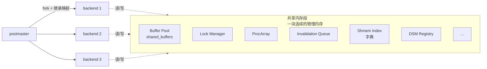
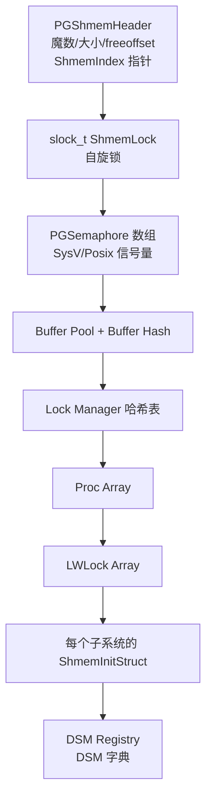
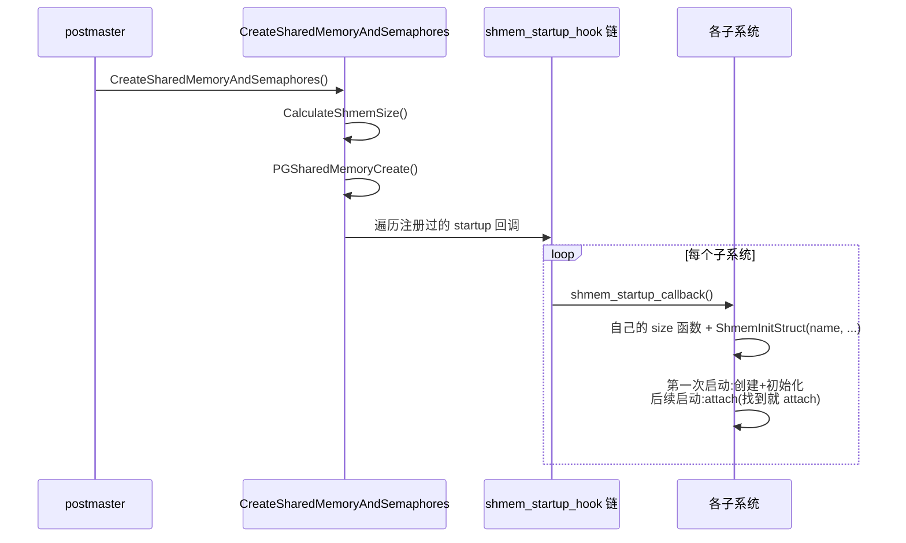
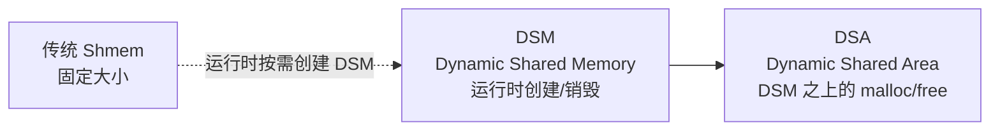
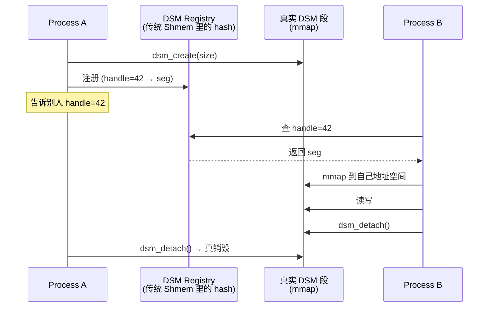
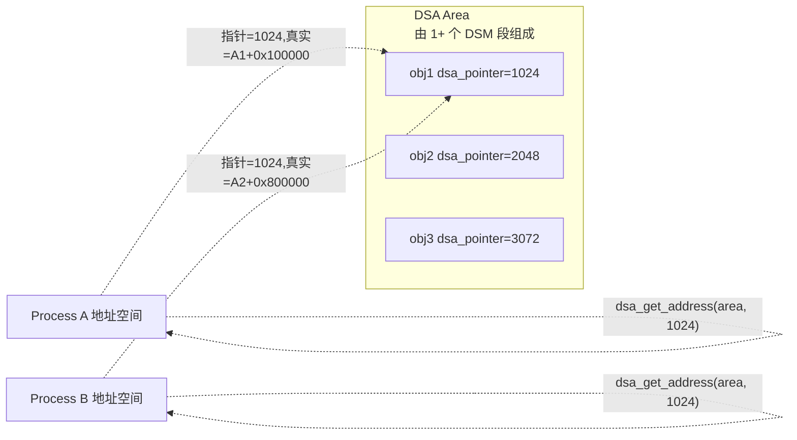
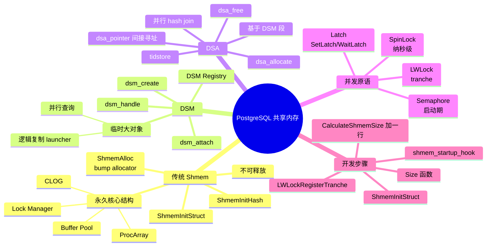

# PostgreSQL 共享内存机制:原理、使用与开发

> 本文基于 PostgreSQL 18 源码(`src/backend/storage/ipc/*`、`src/backend/utils/mmgr/*`),从内核视角讲清楚共享内存是怎么回事 —— 为什么需要它、它分几层、内核开发者怎么用它。

## 一、为什么要共享内存?

PostgreSQL 是**多进程**架构:一个 `postmaster` 守护进程 + N 个 backend 子进程(每个客户端连接一个)。多进程比多线程麻烦的地方在于 —— **进程间内存默认是隔离的**,但 PG 有很多状态必须所有进程都看见:

- **缓冲池**(Buffer Pool):`shared_buffers` 这么大一块缓存,大家都要读写
- **锁管理器**:谁持有哪些锁、谁在等谁
- **事务快照 / CLOG / SUBTRANS**:事务提交状态
- **进程数组**:`ProcArray`,记录所有活跃进程
- **统计信息**:autovacuum / replication slot 等模块的状态

如果用进程内全局变量,这些信息 fork() 之后每个 backend 各自一份,**完全不一致**。所以 PG 引入共享内存(Shared Memory)作为"所有进程的全局变量区"。



**关键事实**:

- 共享内存由 postmaster **一次性**创建(`mmap` / `shmget`,取决于平台)
- 子进程通过 `fork()` **继承地址映射**(Linux 上 `MAP_SHARED` 的匿名映射就是这么干的)
- 这块内存的虚拟地址在所有 backend 里是**相同**的(`0x...DEAD000` 这种)

## 二、整体布局:一段内存装下整个数据库的"全局状态"

### 2.1 共享内存里都有啥?

PG 的共享内存段不是简单的一块裸内存,它有**头部(header)+ 多个组件**。头部是 `PGShmemHeader`,后面紧跟各个子系统申请的区域。每个子系统在 **Shmem Index** 这个 hash 表里登记自己,key 是字符串名字(比如 `"Buffer Hash"`、`"Proc Array"`),value 是指针和大小。



> 📌 完整列表见 `src/backend/storage/ipc/ipci.c::CalculateShmemSize` —— 它把所有 30 多个子系统的 size 一行行加起来,然后按 8KB 对齐。

### 2.2 启动时这一段内存是怎么被"装满"的?

`CreateSharedMemoryAndSemaphores()` 是 postmaster 启动时唯一会调用的入口,它做四件事:

```c
// src/backend/storage/ipc/ipci.c
void CreateSharedMemoryAndSemaphores(void) {
    // 1. mmap 一大段虚拟内存(匿名 + MAP_SHARED)
    size = CalculateShmemSize(&numSemas);  // ← 估算
    seghdr = PGSharedMemoryCreate(size, ...);

    // 2. 初始化 alloc 基础设施
    InitShmemAccess(seghdr);       // 设 ShmemSegHdr/ShmemBase
    InitShmemAllocation();         // 初始化 ShmemLock

    // 3. 跑每个模块的 shmem_startup_hook
    if (shmem_startup_hook) shmem_startup_hook();  // ← 关键

    // 4. 初始化 Shmem Index(hash 表的字典)
    InitShmemIndex();
}
```

**第 3 步那个 `shmem_startup_hook`** 是什么?它是 PG 内核的扩展机制 —— 每个子系统把自己的初始化函数挂在这个 hook 上,按顺序执行:



每个子系统都长这样:

```c
// 模式很固定,以 Buffer Manager 为例
static void shmem_startup_hook(void) {
    bool found;
    BufferDesc *buf;
    /* 申请自己的结构体 */
    buf = (BufferDesc *) ShmemInitStruct("Buffer Descriptors",
                                          NBuffers * sizeof(BufferDesc),
                                          &found);
    if (!found) {
        /* 第一次:全部清零并初始化 */
        for (i = 0; i < NBuffers; i++)
            InitBufferDesc(&buf[i]);
    }
}
```

**核心 API 表**(写内核代码天天用):

| API | 作用 |
| --- | --- |
| `ShmemInitStruct(name, size, &found)` | 按名字注册/获取一段固定大小共享内存 |
| `ShmemInitHash(name, init_size, max_size, ...)` | 在共享内存里建一个 hash 表 |
| `ShmemAlloc(size)` | 裸分配一段(底层走 ShmemIndex,极少见直接用) |
| `RequestAddinShmemSpace(size)` | **扩展用**,在 CalculateShmemSize 之前先告诉内核"我要预留多少" |
| `shmem_startup_hook` | 注册初始化回调 |

## 三、三层共享内存模型

PG 的"共享内存"不是一个东西,它分**三个层次**,使用场景完全不同:



### 3.1 传统 Shmem(固定大小,启动时一次性申请)

- **特点**:**永久**,大小在 `CalculateShmemSize` 时就定下来了;**不可释放**
- **用途**:Buffer Pool、Lock Manager、ProcArray、CLOG 等核心结构
- **入口**:`ShmemInitStruct` / `ShmemInitHash`

这种内存一旦分配就再也不释放,因为 PG 的设计哲学是 "**重启**就是回收"(关库 → 共享内存段整个消失,再启动重新建)。所有传统 Shmem 都被 Shmem Index 这本"字典"管着,字典本身也是 Shmem 里一段固定内存。

#### 关键代码:`ShmemAlloc` 的核心逻辑

```c
// src/backend/storage/ipc/shmem.c
void *ShmemAlloc(Size size) {
    void *newSpace;
    Size allocated_size;
    newSpace = ShmemAllocRaw(size, &allocated_size);
    if (!newSpace)
        ereport(ERROR, (errcode(ERRCODE_OUT_OF_MEMORY),
                       errmsg("out of shared memory (%zu bytes requested)", size)));
    return newSpace;
}
```

`ShmemAllocRaw` 的核心动作:

```c
// 拿自旋锁 + 移动 freeoffset
SpinLockAcquire(ShmemLock);
newStart = ShmemSegHdr->freeoffset;
newFree = newStart + size;
if (newFree > ShmemSegHdr->totalsize) {
    SpinLockRelease(ShmemLock);
    return NULL;  // OOM
}
ShmemSegHdr->freeoffset = newFree;
SpinLockRelease(ShmemLock);
return (void *) (ShmemBase + newStart);  // 偏移 + 基址 → 真实地址
```

> ⚠️ 这就是为什么传统 Shmem **不可释放**:它是 bump allocator(单调递增指针),根本没有 free 的概念。

### 3.2 DSM(Dynamic Shared Memory,运行时动态段)

传统 Shmem 有两个限制:**大小必须启动前知道、不能运行时创建/销毁**。并行查询、并行 hash join、逻辑复制的 launcher 队列等等场景,需要在运行时动态申请一块临时共享内存,完成就释放。

**DSM** 就是为此设计的:

```c
// src/include/storage/dsm.h
dsm_segment *dsm_create(Size size, int flags);   // 创建一段 DSM(返回 segment)
dsm_segment *dsm_attach(dsm_handle handle);       // 其它进程用 handle 附上
void dsm_detach(dsm_segment *seg);                // 自己不再用
```

**关键设计**:

- 每段 DSM 在 OS 层是一段独立的 `mmap`(Linux 用 `mmap(NULL, ..., MAP_SHARED | MAP_ANONYMOUS)`)
- 不在传统 Shmem 段里,**完全独立**
- 用 `dsm_handle`(一个 uint32)做"全局 ID",让别的进程能 attach 上来
- **DSM Registry**:一个放在传统 Shmem 里的 hash 表(`dsm_registry`),记着 handle → 段的映射。这样一个进程 create 后,别的进程通过 DSM Registry 找 handle → 找到段 → attach



**典型用户**:

- 并行查询:每个 parallel worker 共享元数据
- 逻辑复制:`launcher.c::last_start_times_dsa`(`dsa_create(LWTRANCHE_LAUNCHER_DSA)`)
- `tidstore.c` 给并行 vacuum 用的 TID 集合

### 3.3 DSA(Dynamic Shared Area,DSM 之上的 malloc/free)

DSM 只给你一段裸内存。**DSA** 把 DSM 包了一层,提供 `dsa_allocate()` / `dsa_free()` 这种像 malloc 的接口,而且用 `dsa_pointer`(一个 uint32 偏移)间接寻址 —— 这样 attach 进来的进程看到的"指针值"在不同进程里有不同实际地址,但 `dsa_pointer` 永远有效。

**关键 API**(`src/include/utils/dsa.h`):

```c
dsa_area *dsa_create(int tranche_id, size_t init_segment_size, ...);
dsa_area *dsa_attach(dsa_handle handle);
dsa_pointer dsa_allocate_extended(dsa_area *area, size_t size, int flags);
void dsa_free(dsa_area *area, dsa_pointer dp);
void *dsa_get_address(dsa_area *area, dsa_pointer dp);  // 转成实际地址
```

**为什么需要 `dsa_pointer`?** 因为如果每个进程都用自己的绝对地址存指针,attach 上来的进程看到的指针就是错的(地址空间不一样)。所以 DSA 用"在 area 里的偏移"作为指针,使用时再 `dsa_get_address(area, dp)` 转成当前进程的地址。



**典型用户**:

- 并行哈希 join(`nodeHash.c`)
- `tidstore.c`(并行 vacuum 的 TID 集合)
- 逻辑复制 launcher 的 last-start-times

> DSA 的底层实现是 `generation.c`(generation allocator)+ `freepage.c`(free page 缓存),有兴趣可以深挖。`bump.c` 是单线程版本,`slab.c` 是 slab allocator,`aset.c` 是普通 malloc-like,这些**进程内**分配器不属于共享内存。

## 四、并发原语:在共享内存上同步

光有共享内存没用,必须有"同步"才能不踩脚。PG 提供四把锁,按"粒度"由小到大:

| 原语 | 用在哪 | 一句话 |
| --- | --- | --- |
| **SpinLock**(slock_t) | `ShmemLock`、Buffer 头 | 极短的忙等,纳秒级;不能跨函数让出 |
| **LWLock**(轻量锁) | Buffer 内容、锁管理器、事务快照 | 默认睡眠让出 CPU,带 tranche 分类 |
| **Latch**(进程间事件) | `SetLatch` / `WaitLatch` | "叫醒"另一个进程,通常和 socket/select 配对 |
| **Semaphore** | postmaster 启动、IPC | SysV / Posix,启动时用一次 |

### 4.1 LWLock 详解

LWLock 是 PG 内核最常用的锁,定义在 `src/backend/storage/lmgr/lwlock.c`。

- 每把锁 = 一个 `LWLock` 结构,内部有 `lock`、`exclusive` 计数、`tranche id`
- **共享模式**(读锁)和**排他模式**(写锁)共存,允许多读单写
- **tranche**(分类):给锁打个标签(`LWTRANCHE_BUFFER_CONTENT` 等),等锁 hang 住时能在 `pg_stat_activity.wait_event` 里看到在等哪一类锁

```c
// 用法很简单
LWLock *lock = ...; // 启动时已注册
LWLockAcquire(lock, LW_SHARED);   // 拿读锁
LWLockAcquire(lock, LW_EXCLUSIVE); // 拿写锁
LWLockRelease(lock);
```

**新增一种锁需要做的事**:

1. 在 `lwlock.c::MainLWLockArray` 或 tranche 里分配一个槽
2. 起一个名字(`LWLockRegisterTranche`)
3. 用 `LWLockAcquire` / `Release`

## 五、内核开发者实战:加一个全新的共享内存结构

假设你想给 PG 加一个假想的"全局公告板" `AnnouncementBoard`,所有 backend 都能读写一条消息。

### 5.1 步骤 1:写 size 函数

```c
// annoucment.c
Size AnnouncementShmemSize(void) {
    return sizeof(AnnouncementSharedState);
}
```

### 5.2 步骤 2:在 `CalculateShmemSize` 里加上

```c
// src/backend/storage/ipc/ipci.c
size = add_size(size, AnnouncementShmemSize());
```

(这是改内核的常规做法。**扩展插件**场景用 `RequestAddinShmemSpace`,在 `_PG_init` 里调。)

### 5.3 步骤 3:写 startup hook

```c
static void annoucement_shmem_startup(void) {
    bool found;
    AnnouncementSharedState *state;

    LWLockRegisterTranche(LWTRANCHE_ANNOUNCEMENT, "announcement_lock");

    state = ShmemInitStruct("Announcement Board",
                             sizeof(AnnouncementSharedState),
                             &found);
    if (!found) {
        // 第一次启动:清零 + 初始化锁
        memset(state, 0, sizeof(*state));
        state->lock = (LWLock *) ShmemInitStruct("Announcement Lock",
                                                  sizeof(LWLock), &found);
        if (!found) LWLockInitialize(state->lock, LWTRANCHE_ANNOUNCEMENT);
        pg_atomic_init_u32(&state->writer_pid, 0);
    }
    // 把指针存到全局变量
    AnnouncementState = state;
}
```

### 5.4 步骤 4:挂到 `shmem_startup_hook`

```c
// 在 _PG_init 或 postmaster 启动时
shmem_startup_hook = annoucement_shmem_startup;
```

### 5.5 步骤 5:使用

```c
LWLockAcquire(AnnouncementState->lock, LW_EXCLUSIVE);
strncpy(AnnouncementState->message, "hello from backend %d", MyProcPid);
LWLockRelease(AnnouncementState->lock);
```

**完整 demo 不到 100 行**,核心就是:`ShmemInitStruct` 取内存 + `LWLock` 做同步。

## 六、监控 & 调试

### 6.1 看共享内存段本身

```sql
-- PG 18 新增视图,看每个 ShmemInitStruct 占了多少
SELECT name, allocated_size, init_size
  FROM pg_get_shmem_allocations()
 ORDER BY allocated_size DESC LIMIT 10;
```

### 6.2 看传统 Shmem OOM 来源

```sql
-- 哪一类占了多少
SELECT * FROM pg_shmem_allocations ORDER BY allocated_size DESC;
```

### 6.3 看 DSM 段

```sql
-- PG 没有专门视图,但可以从 log 看到
SET log_min_messages = debug2;
-- 之后每次 dsm_create / dsm_detach 都会打日志
```

### 6.4 看 LWLock 等待

```sql
SELECT pid, wait_event_type, wait_event, query
  FROM pg_stat_activity
 WHERE wait_event_type = 'LWLock'
 ORDER BY query_start;
```

`wait_event` 会告诉你等的是 `BufferContent`、`ProcArray` 还是自定义 tranche。

### 6.5 常见报错速查

| 报错 | 原因 | 修法 |
| --- | --- | --- |
| `out of shared memory` | `ShmemAlloc` 失败,`shared_buffers` / GUC 不够 |
| `could not open shared memory segment` | postmaster 没启动,或 `dynamic_shared_memory_type` 错 |
| `ERROR: dsm_attach ... invalid handle` | DSM 已 detach,你拿了个过期的 handle |
| `dsa_get_address returned NULL` | DSA 段已 detach,pointer 无效 |

## 七、几条心法(写内核代码不踩坑)

1. **永远先取锁后访问共享数据**。无锁结构用 `pg_atomic_*` 原子操作。
2. **`ShmemAlloc` 只能在 startup hook 里调**(启动后 ShmemLock 就被滥用了)。
3. **DSM/DSA 是有成本的**:每次 create / attach 都要 mmap + 写 registry,不要在热路径里频繁 create/detach,改成 attach 一次 + 复用 area。
4. **DSA 用 `dsa_pointer` 存指针,不要存绝对地址**。attach 进来的进程绝对地址不同。
5. **LWLock 不能跨事务 hold 太久**;真的需要久等,用 `LockMgr` 的关系锁。
6. **SpinLock 真的极短**:几行内存读改写,绝对不允许调任何可能让出 CPU 的函数(比如 `ereport(ERROR)` 会 longjmp)。

## 八、一张图总结



## 九、参考源码

- `src/backend/storage/ipc/shmem.c` — 传统 Shmem
- `src/backend/storage/ipc/ipci.c` — 启动入口 `CreateSharedMemoryAndSemaphores` + `CalculateShmemSize`
- `src/backend/storage/ipc/dsm.c` + `dsm_impl.c` + `dsm_registry.c` — DSM 三件套
- `src/backend/utils/mmgr/dsa.c` — DSA
- `src/backend/utils/mmgr/generation.c` — DSA 底层的 generation allocator
- `src/backend/storage/lmgr/lwlock.c` — LWLock
- `src/include/storage/shmem.h` — 公共 API 声明
