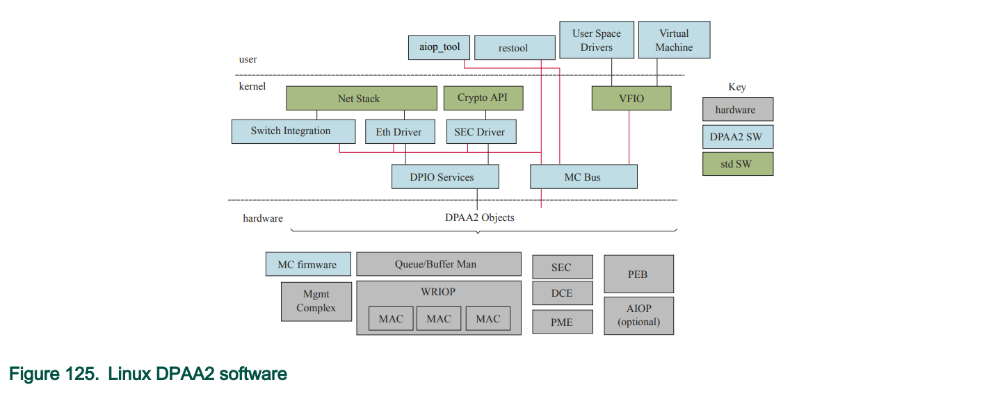
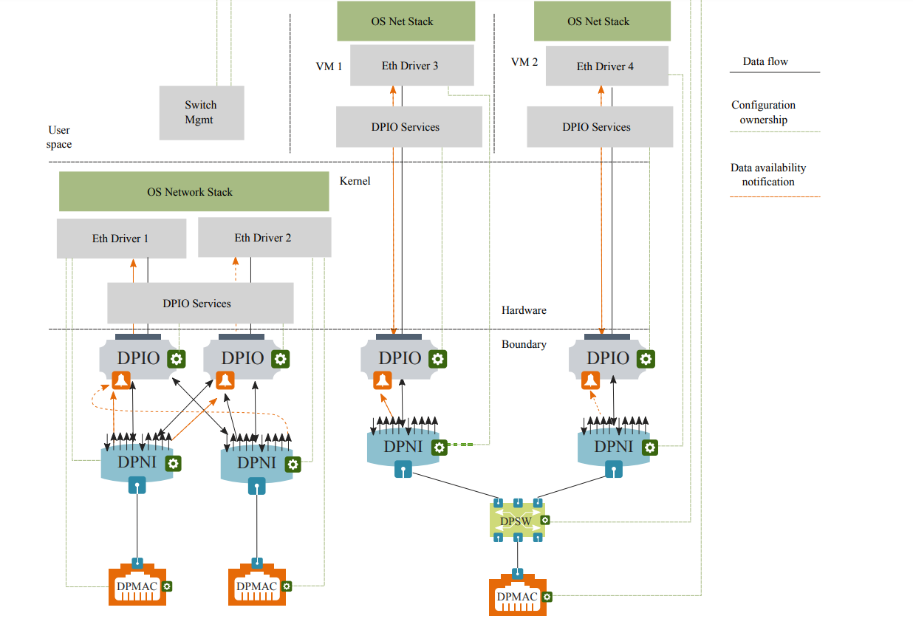

# lx2160使用dpdk

## 硬件概要

底层驱动同事负责在操作系统启动的时候同时启动网卡，其中dpni.3为对外的10G网卡，是我们需要使用的网卡。

dpni.3对应eth3，与dpmac.4相连。对于eth3，可以使用标准的linux网络工具，可使用ethtool、ifconfig对其操作。

```shell
root@hx-A-Tiny:/mnt/emmc2# ls-listni
dprc.1/dpni.4 (interface: eth4, end point: dpmac.3)
dprc.1/dpni.3 (interface: eth3, end point: dpmac.4)
dprc.1/dpni.2 (interface: eth2, end point: dpmac.13)
dprc.1/dpni.1 (interface: eth0)
dprc.1/dpni.0 (interface: eth1, end point: dpmac.14)
```

## 查看网卡

- 更换dpdk前

```shell
root@hx-A-Tiny:/mnt/emmc2# ls-listni
dprc.1/dpni.4 (interface: eth4, end point: dpmac.3)
dprc.1/dpni.3 (interface: eth3, end point: dpmac.4)
dprc.1/dpni.2 (interface: eth2, end point: dpmac.13)
dprc.1/dpni.1 (interface: eth0)
dprc.1/dpni.0 (interface: eth1, end point: dpmac.14)
```

- 更换dpdk后

```shell
root@hx-A-Tiny:~# ls-listni
dprc.1/dpni.4 (interface: eth4, end point: dpmac.3)
dprc.1/dpni.3 (interface: eth3)
dprc.1/dpni.2 (interface: eth2, end point: dpmac.13)
dprc.1/dpni.1 (interface: eth0)
dprc.1/dpni.0 (interface: eth1, end point: dpmac.14)
dprc.1/dprc.2/dpni.5 (end point: dpmac.4)
root@hx-A-Tiny:~#
```

## dpaa2

专有名词：

- DPRC (Datapath Resource Container)

- DPNI (Datapath Network Interface)
- DPSW(Datapath Switch)
- DPMAC (Datapath MAC)
- DPIO (Datapath I/O)

dpaa软件结构如下：



dpaa2对象关系如下：



dpaa2的对象可以使用`restool`命令来进行查看和管理。

对于网卡来说，与linux相同，同样支持如下命令：

- ifconfig
- ip
- ethtool

dpaa2支持的其他命令：

- restool

  ```shell
  # 查看dprc资源
  restool dprc info dprc.2
  # 查看dprc下的dpio\dpbp等
  restool dprc show dprc.2
  # 查看dpni资源
  restool dpni info dpni.1
  #查看dpmac信息
  restool dpmac info dpmac.4
  ```

dpaa2通过如下三种方式将硬件资源分配给container：

-  the datapath layout file
- restool
- Management Complex commands

### DPRC

dprc是如下软件运行的基础：

- linux内核
- kvm
- dpdk应用
- aiop应用

#### 创建dprcs

有两种方式创建dprcs：

- 静态创建

  DPL file（RCW、DPC、DPL）

  - reset configuration word (RCW)
  - the data path configuration (DPC)
  -  data path layout (DPL)

- 动态创建

  restool命令创建

  ```shell
  #列出dprc
  restool dprc list
  #列出在dprc.1下的所有对象
  restool dprc show dprc.1
  #查看dpni.0的相关信息
  restool dpni info dpni.0
  ```

  ```shell
  # 创建dpbp
  restool dpbp create
  #将新创建的dpbp.5插入
  restool dprc assign dprc.1 --oect=dpbp.5 --plugged=1
  #配置ip
  ifconfig eth1 192.168.1.2
  #修改mac
  ifconfig eth1 hw ether 02:00:C0:01:02:0a
  ip link set dev eth1 address 02:00:C0:01:02:0b
  ```

- 动态删除

  ```shell
  #unbind dpni.5
  echo dpni.5 > /sys/bus/fsl-mc/drivers/vfio-fsl-mc/unbind
  #destroy
  restool dpni destroy dpni.5
  #unbingd dprc.2
  echo dprc.2 > /sys/bus/fsl-mc/drivers/vfio-fsl-mc/unbind
  #destroy
  restool dprc destroy dprc.2
  #unbind
  echo dpmac.4 > /sys/bus/fsl-mc/drivers/dpaa2_mac/unbind
  #destroy
  restool dpmac destroy dpmac.4
  ```


### restool

### 其他命令

- `ls-addni`

  用来创建DPNI。

- `ls-listni`

- `ls-listmac`