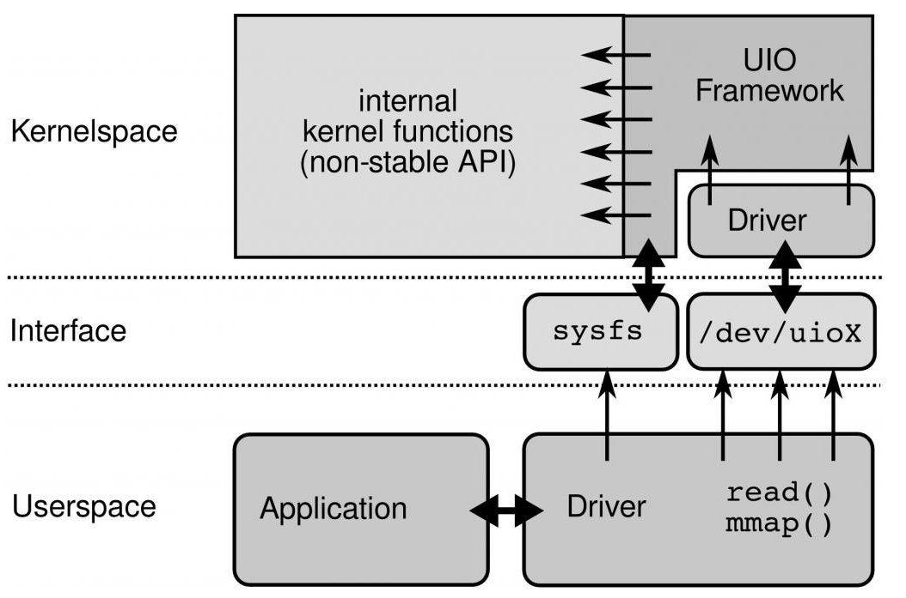
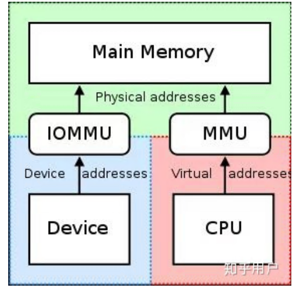

# 用户态驱动（UIO/VFIO）

## UIO

### UIO出现原因

硬件设备可以根据功能分为网络设备，块设备，字符设备，或者根据与CPU相连的方式分为PCI设备，USB设备等。它们被不同的内核子系统支持。这些标准的设备的驱动编写较为容易而且容易维护。很容易加入主内核源码树。但是，又有很多设备难以划分到这些子系统中，比如I/O卡，现场总线接口或者定制的FPGA。

通常这些非标准设备的驱动被实现为字符驱动。这些驱动使用了很多内核内部函数和宏。而这些内部函数和宏是变化的。这样驱动的编写者必须编写一个完全的内核驱动，而且一直维护这些代码。而且这些驱动进不了主内核源码。于是就出现了用户空间I/O框架(Userspace I/O framework)。

## UIO工作原理

一个设备驱动的主要任务有两个：

1. 存取设备的内存

   UIO核心实现了mmap()可以处理物理内存(physicalmemory)，逻辑内存(logical memory)，虚拟内存(virtual memory)。UIO驱动的编写是就不需要再考虑这些繁琐的细节。

2. 处理设备产生的中断

   对于设备中断的应答必须在内核空间进行。所以在内核空间有一小部分代码用来应答中断和禁止中断，但是其余的工作全部留给用户空间处理。

   如果用户空间要等待一个设备中断，它只需要简单的阻塞在对 /dev/uioX的read()操作上。当设备产生中断时，read()操作立即返回。UIO 也实现了poll()系统调用，你可以使用 select()来等待中断的发生。select()有一个超时参数可以用来实现有限时间内等待中断。

### UIO与内核的关系

UIO与内核的关系如下：



对设备的控制还可以通过/sys/class/uio下的各个文件的读写来完成。你注册的uio设备将会出现在该目录下。假如你的uio设备是uio0那么映射的设备内存文件出现在 /sys/class/uio/uio0/maps/mapX，对该文件的读写就是 对设备内存的读写。

```shell
[root@localhost ~]# ls /sys/class/uio/uio0/
dev        device/    event      maps/      name       power/     subsystem/ uevent     version
```

### igb_uio分析

在进行DPDK的测试中，使用的都是igb_uio这个驱动；igb_uio是Intel igb网卡驱动的UIO实现，分成igb_uio内核驱动、内核uio框架、uio用户态三部分。

#### 内核驱动

igb_uio驱动主要做的就是注册一个pci设备，在DPDK工具dpdk_nic_bind.py绑定NIC的时候这个驱动会probe到这个设备，进行相关配置。之后会注册一个UIO设备，probe函数会将记录设备的资源比如PCI设备BAR空间的物理地址、大小等信息记录下来传给用户态。注册的UIO设备名为igb_uio，内核态中断处理函数为igbuio_pci_irqhandler，中断控制函数igbuio_pci_irqcontrol。注册的主要工作如下：

- 初始化uio_device结构体指针，主要包括等待队列wait、中断事件计数event、次设备号minor等。
- 在/dev目录下创建了一个uio设备，设备名为uioX，X对应的就是次设备号minor。
- 在/sys/class/uio/uioX/目录下创建maps和portio接口。
- 注册中断和中断处理函数uio_interrupt

## VFIO

### IOMMU

在计算机领域，IOMMU（Input/Output Memory Management Unit）是一个内存管理单元（Memory Management Unit），它的作用是连接DMA-capable I/O总线（Direct Memory Access-capable I/O Bus）和主存（main memory）。传统的内存管理单元会把CPU访问的虚拟地址转化成实际的物理地址。而IOMMU则是把设备（device）访问的虚拟地址转化成物理地址。为了防止设备错误地访问内存，有些IOMMU还提供了访问内存保护机制。



IOMMU主要作用如下：

- 屏蔽物理地址，起到保护作用。典型应用包括两个：一是实现用户态驱动，由于IOMMU的映射功能，使HPA对用户空间不可见，在vfio部分还会举例。二是将设备透传给虚机，使HPA对虚机不可见，并将GPA映射为HPA
- IOMMU可以将连续的虚拟地址映射到不连续的多个物理内存片段，这部分功能于MMU类似，对于没有IOMMU的情况，设备访问的物理空间必须是连续的，IOMMU可有效的解决这个问题

### VFIO与IOMMU的关系

VFIO就是内核针对IOMMU提供的软件框架，支持DMA Remapping和Interrupt Remapping，VFIO利用IOMMU这个特性，可以屏蔽物理地址对上层的可见性，可以用来开发用户态驱动，也可以实现设备透传。

VFIO是一个可以安全的把设备I/O、中断、DMA等暴露到用户空间（userspace），从而可以在用户空间完成设备驱动的框架。用户空间直接设备访问，虚拟机设备分配可以获得更高的IO性能

## VFIO主要概念

#### group

group 是IOMMU能够进行DMA隔离的最小硬件单元，一个group内可能只有一个device，也可能有多个device，这取决于物理平台上硬件的IOMMU拓扑结构。

设备直通的时候一个group里面的设备必须都直通给一个虚拟机。不能够让一个group里的多个device分别从属于2个不同的VM，也不允许部分device在host上而另一部分被分配到guest里， 因为就这样一个guest中的device可以利用DMA攻击获取另外一个guest里的数据，就无法做到物理上的DMA隔离。

另外，VFIO中的group和iommu group可以认为是同一个概念。

#### container

对于虚机，Container 这里可以简单理解为一个VM Domain的物理内存空间。对于用户态驱动，Container可以是多个Group的集合。

#### device

指的是我们要操作的硬件设备，不过这里的“设备”需要从IOMMU拓扑的角度去理解。如果该设备是一个硬件拓扑上独立的设备，那么它自己就构成一个iommu group。 如果这里是一个multi-function设备，那么它和其他的function一起组成一个iommu group，因为多个function设备在物理硬件上就是互联的， 他们可以互相访问对方的数据，所以必须放到一个group里隔离起来。值得一提的是，对于支持PCIe ACS特性的硬件设备，我们可以认为他们在物理上是互相隔离的。

### VFIO框架

整个VFIO框架设计如下：

```shell
+--------------------------------------------------------------+
|                VFIO interface                                |
+--------------------------------------------------------------+
|    vfio_iommu           |  vfio_pci                          |
+--------------------------------------------------------------+
|  iommu driver          |  pci_bus driver                     |
+--------------------------------------------------------------+
```

- 最上层VFIO Interface Layer，它负责向用户态提供统一访问的接口，用户态通过约定的ioctl设置和调用VFIO的各种能力。

- 中间层分别是vfio_iommu和vfio_pci
- 最下面的一层则是硬件驱动调用层

一个或多个device从属于某个group，而一个或多个group又从属于一个container。 如果要将一个device直通给VM，那么先要找到这个设备从属的iommu group，然后将整个group加入到container中即可。

### VFIO与内核的关系

linux内核设备驱动充分利用了“一切皆文件”的思想，VFIO驱动也不例外，VFIO中为了方便操作device, group, container等对象将它们和对应的设备文件进行绑定。VFIO驱动在加载的时候会创建一个名为/dev/vfio/vfio的文件，而这个文件的句柄关联到了vfio_container上，用户态进程打开这个文件就可以初始化和访问vfio_container。

```shell
root@HX-Technical-A:~# ls /dev/vfio/
8  vfio
```

# reference

1. https://blog.csdn.net/u013982161/article/details/51584900
2. https://www.cnblogs.com/cynchanpin/p/7068965.html
3. https://blog.csdn.net/21cnbao/article/details/107572893
4. https://www.zhihu.com/question/325947168
5. https://www.cnblogs.com/yi-mu-xi/p/12370626.html
5. https://blog.csdn.net/cloudvtech/article/details/80359834