# Linux CPU 绑核与 top 详解:从原理到实战

> 本文聚焦两个紧密相关的系统管理主题:
> 1. **CPU 绑核(CPU Affinity)**:如何让进程/线程固定在某些 CPU 核上
> 2. **top 工具实战**:如何用 top 看出 CPU 是不是瓶颈
>
> 读完本文你会获得:
> 1. **为什么需要绑核** 的真实场景(不是教科书说教)
> 2. **5 种绑核方式** 的对比(taskset / sched_setaffinity / numactl / cpuset / systemd)
> 3. **CPU 掩码原理** 与十六进制 / 列表两种表示
> 4. **top 视图逐行解读**:每列、每行、每种快捷键的真实含义
> 5. **实战案例**:数据库(尤其 PG)、网络服务、计算密集型
> 6. **避坑清单**:常见误用与反模式

---

## 一、为什么需要 CPU 绑核?

### 1.1 默认调度器在做什么

Linux CFS(Completely Fair Scheduler)在多核系统上**默认自由调度**:

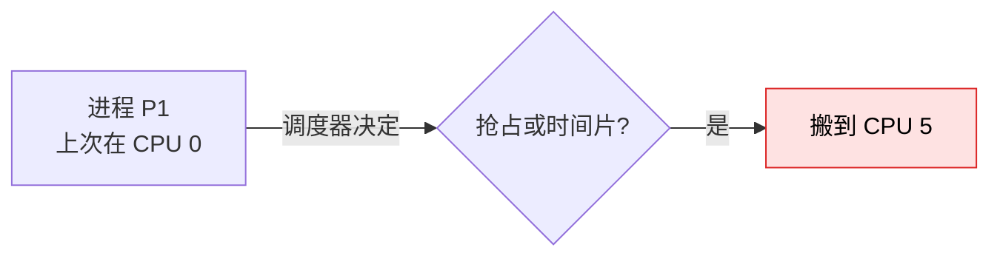

**表面看这是好事**(负载均衡),但实际有三个问题:

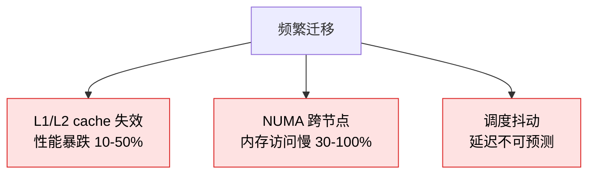

### 1.2 5 个真实场景

| 场景 | 收益 | 典型场景 |
|------|------|---------|
| **NUMA 敏感服务** | 30-100% 性能提升 | PG、Redis、内存数据库 |
| **实时系统** | 延迟稳定 | 音视频、工业控制 |
| **高频交易** | 微秒级延迟保证 | 金融交易 |
| **大内存进程** | 避免跨节点内存访问 | 内存数据库、大数据 |
| **多线程共享 cache** | 利用 LLC 共享 | 高性能计算 |

### 1.3 不该用绑核的场景


---

## 二、CPU 拓扑与掩码原理

### 2.1 现代 CPU 拓扑

```mermaid
flowchart TB
    CPU["Socket 0<br/>(一颗物理 CPU)"] --> D1[Die / Package]
    D1 --> C0["Core 0"]
    D1 --> C1["Core 1]
    C0 --> S0["SMT Thread 0"]
    C0 --> S1["SMT Thread 1<br/>(超线程兄弟)"]
    C1 --> S2["Thread 2"]
    C1 --> S3["Thread 3"]

    L1["L1 Cache<br/>(per core)"]
    L2["L2 Cache<br/>(per core)"]
    LLC["LLC / L3<br/>(共享)"]
    NUMA["本地内存"]

    S0 -.独占.- L1
    S0 -.独占.- L2
    S0 -.与 Core 0 共享.- LLC
    S0 -.最优访问.- NUMA
```

**关键概念**:

| 概念 | 说明 |
|------|------|
| **Socket** | 物理 CPU 插槽(一颗 die) |
| **Core** | 一个物理核 |
| **Thread(SMT)** | 一个逻辑核(超线程) |
| **NUMA node** | 内存域,跨节点访问慢 30%+ |

### 2.2 CPU 掩码(bitmap)表示

Linux 用 **bitmap** 表示 CPU 集合。最常见的两种表示:

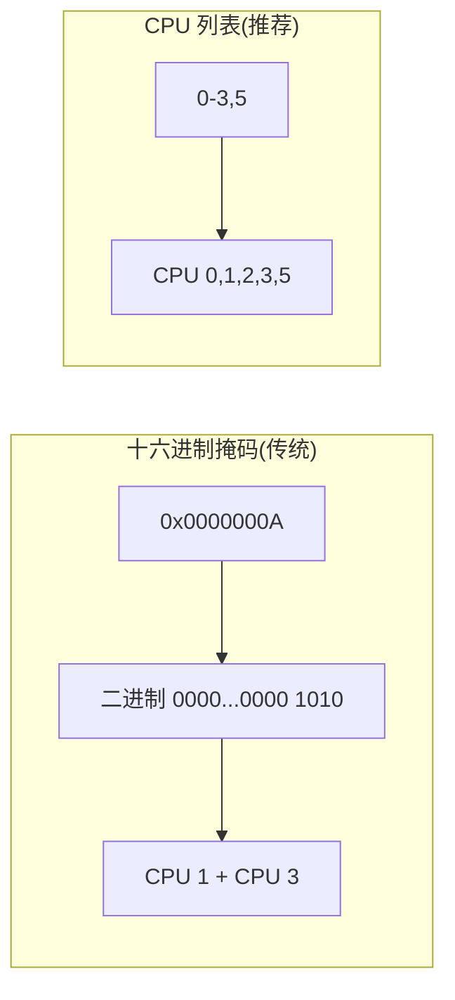

**掩码计算**:

```text
32 位掩码 0x0000000A = 0000 0000 0000 0000 0000 0000 0000 1010
                                          ↑ 位 1 = 1,位 3 = 1
                                       其他位都是 0

→ CPU 1 + CPU 3
```

**掩码长度**(根据系统):

| 系统 | 掩码长度 | 类型 |
|------|---------|------|
| 32 核以下 | 32 位 | `cpu_set_t` 32 位 |
| 64 核以下 | 64 位 | `cpu_set_t` 64 位 |
| 128 核以上 | 128 位 / 256 位 | `cpu_set_t` 动态 |

---

## 三、5 种绑核方式详解

### 3.1 方式 1:`taskset` 命令(最常用)

源码位置:`util-linux` 包。

**核心语法**:

```bash
taskset [options] [mask | list] <pid | command>
```

#### 3.1.1 查看进程的 CPU 亲和性

```bash
# 进程 PID 1234 的亲和性
taskset -p 1234
# 输出:pid 1234's current affinity mask: f
# 0xf = 0b1111 → CPU 0,1,2,3

# 用 -c 看 CPU 列表(更直观)
taskset -cp 1234
# 输出:pid 1234's current affinity list: 0-3
```

#### 3.1.2 修改运行中进程的亲和性

```bash
# 进程绑到 CPU 0 和 2
taskset -p -c 0,2 1234
# -c 后面跟 CPU 列表

# 用十六进制掩码
taskset -p 0x05 1234   # 0b0101 = CPU 0 + CPU 2
```

#### 3.1.3 启动时绑核

```bash
# 启动一个新进程,绑到 CPU 0-3
taskset -c 0-3 ./my_server

# 启动 PostgreSQL
taskset -c 4-7 /usr/pgsql-16/bin/postgres -D /var/lib/pgsql/data
```

#### 3.1.4 高级选项

```bash
# 用十六进制掩码:十六进制数直接跟
taskset 0x1 ./myapp        # 仅 CPU 0

# 用列表
taskset -c 0-3,5-7 ./myapp

# 获取当前 shell 的亲和性
taskset -p $$

# 临时禁用调度器迁移(配合 schedtool 等)
```

### 3.2 方式 2:`sched_setaffinity` 系统调用(C 语言)

```c
// src/sched_setaffinity.c
#define _GNU_SOURCE
#include <sched.h>
#include <stdio.h>
#include <unistd.h>

int main() {
    cpu_set_t set;
    CPU_ZERO(&set);
    CPU_SET(0, &set);  // 加入 CPU 0
    CPU_SET(2, &set);  // 加入 CPU 2

    // 当前进程绑核
    if (sched_setaffinity(0, sizeof(set), &set) != 0) {
        perror("sched_setaffinity");
        return 1;
    }

    // 验证
    CPU_ZERO(&set);
    sched_getaffinity(0, sizeof(set), &set);
    for (int i = 0; i < CPU_COUNT(&set); i++) {
        if (CPU_ISSET(i, &set))
            printf("CPU %d is in affinity
", i);
    }
    return 0;
}
```

**关键 API**:

| 函数 | 用途 |
|------|------|
| `CPU_ZERO(set)` | 清空 |
| `CPU_SET(cpu, set)` | 加入一个 CPU |
| `CPU_CLR(cpu, set)` | 移除一个 CPU |
| `CPU_ISSET(cpu, set)` | 测试 |
| `sched_setaffinity(pid, cpusetsize, mask)` | 设置亲和性 |
| `sched_getaffinity(pid, cpusetsize, mask)` | 获取亲和性 |

**多线程进程的注意**:`sched_setaffinity(0, ...)` 设置的是**整个进程的亲和性**,对所有线程生效。如果只绑某个线程,用 `pthread_setaffinity_np`。

### 3.3 方式 3:`numactl`(NUMA 绑核)

源码位置:`numactl` 包(`yum install numactl` / `apt install numactl`)。

#### 3.3.1 查看 NUMA 拓扑

```bash
numactl --hardware
# 输出示例:
# available: 2 nodes (0-1)
# node 0 cpus: 0 2 4 6 8 10 12 14
# node 1 cpus: 1 3 5 7 9 11 13 15
# node 0 size: 32768 MB
# node 1 size: 32768 MB
# node 0 free: 16384 MB
# node 1 free: 16384 MB
# node distances:
#    node 0   1
#      0:  10  20
#      1:  20  10
```

**关键**:Node 0 的 CPU 是 `0,2,4,6,8,10,12,14`(偶数),Node 1 是 `1,3,5,7,9,11,13,15`(奇数)。**距离矩阵显示跨节点访问代价是本地的 2 倍**。

#### 3.3.2 NUMA 绑核启动

```bash
# 仅绑 CPU(不绑内存)
numactl --cpunodebind=0 ./myapp        # CPU 绑到 node 0

# 仅绑内存
numactl --membind=0 ./myapp            # 内存分配优先 node 0

# 全部绑定
numactl --cpunodebind=0 --membind=0 ./myapp

# 用具体 CPU 列表
numactl --physcpubind=0,2,4,6 ./myapp
```

#### 3.3.3 PG 的 NUMA 实战

源码:`src/backend/storage/buffer/bufmgr.c`、`src/backend/port/win32/numa.c`(Linux 用 `pg_numa.c`)。

```bash
# PG 的 NUMA-aware 内存分配
numactl --interleave=all /usr/pgsql-16/bin/postgres -D $PGDATA
# 内存交错分配在所有 node(适合大量分配的场景)
```

### 3.4 方式 4:cgroup cpuset(资源隔离)

#### 3.4.1 v1 vs v2

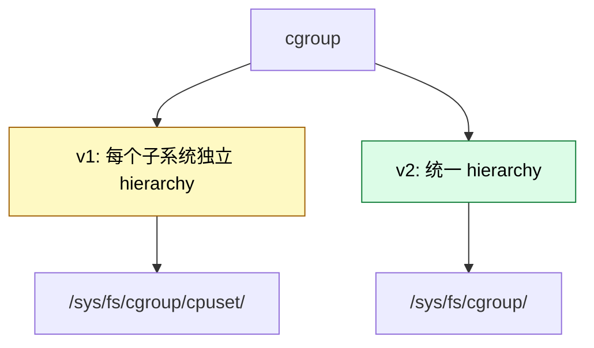

**v1 实战**(传统):

```bash
# 1. 创建 cgroup
mkdir /sys/fs/cgroup/cpuset/my_app

# 2. 设置允许的 CPU
echo 0-3 > /sys/fs/cgroup/cpuset/my_app/cpuset.cpus
echo 0 > /sys/fs/cgroup/cpuset/my_app/cpuset.mems

# 3. 把进程加入 cgroup
echo 1234 > /sys/fs/cgroup/cpuset/my_app/tasks
```

**v2 实战**(现代):

```bash
# v2 单文件
mkdir /sys/fs/cgroup/my_app
echo "0-3" > /sys/fs/cgroup/my_app/cpuset.cpus
echo 1234 > /sys/fs/cgroup/my_app/cgroup.procs
```

#### 3.4.2 cpuset vs taskset 的差异

| 维度 | taskset | cpuset cgroup |
|------|---------|---------------|
| 粒度 | 单进程 | 进程组 |
| 持久性 | 进程退出即失效 | 配置持久 |
| 适用 | 临时调试 | 服务级隔离 |
| 容器化 | 不友好 | 容器底层 |

**Kubernetes / Docker 底层就是 cgroup cpuset**。

### 3.5 方式 5:systemd 服务级绑核

`/etc/systemd/system/myapp.service`:

```ini
[Service]
ExecStart=/usr/bin/myapp
CPUAffinity=0 1 2 3          # 绑 CPU 0,1,2,3
# 或者用掩码
CPUAffinityMask=0x0F
```

```bash
systemctl daemon-reload
systemctl restart myapp
# 验证
systemctl show myapp | grep CPUAffinity
```

---

## 四、5 种方式对比

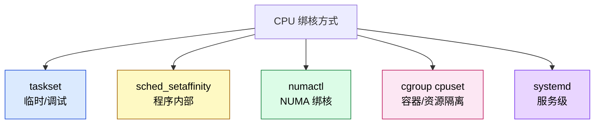

| 方式 | 适用场景 | 持久性 | 易用性 |
|------|---------|--------|--------|
| **taskset** | 临时、调试、命令行 | 临时 | ★★★★★ |
| **sched_setaffinity** | 程序内置控制 | 进程级 | ★★★ |
| **numactl** | NUMA 敏感服务 | 临时 | ★★★★ |
| **cgroup cpuset** | 容器、生产隔离 | 持久 | ★★★ |
| **systemd** | 服务级配置 | 持久 | ★★★★ |

---

## 五、top 详解:从一行输出到性能瓶颈判断

### 5.1 top 启动

```bash
top
# 默认按 %CPU 排序,3 秒刷新

# 关键快捷键
top -p <pid>     # 只看某进程
top -H -p <pid>   # 看进程的所有线程
top -c           # 显示完整命令
top -b -n 1      # 批模式,只跑一次(脚本用)
```

### 5.2 输出解读:从上到下

#### 第一行:系统总体

```
top - 10:23:45 up 30 days,  2 users,  load average: 1.23, 1.45, 1.67
```

| 字段 | 含义 | 关键判断 |
|------|------|---------|
| `10:23:45` | 当前时间 | - |
| `up 30 days` | 运行时长 | 稳定性参考 |
| `2 users` | 登录用户数 | - |
| `load average: 1.23, 1.45, 1.67` | **1/5/15 分钟负载** | **核心指标** |

**Load Average 解读**:

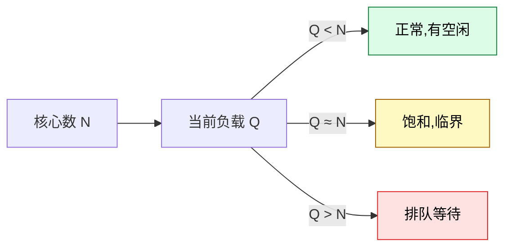

#### 第二行:进程状态统计

```
Tasks: 312 total,   2 running, 308 sleeping,   0 stopped,   2 zombie
```

| 字段 | 含义 | 异常信号 |
|------|------|---------|
| `total` | 总进程数 | - |
| `running` | 正在运行(R 状态) | - |
| `sleeping` | 睡眠(S 状态) | 正常 |
| `stopped` | 停止(T 状态) | - |
| `zombie` | 僵尸(Z 状态) | ⚠️ **> 0 要排查** |

#### 第三行:CPU 详细(最重要的行)

```
%Cpu(s): 15.3 us,  5.2 sy,  0.0 ni, 78.1 id,  0.0 wa,  0.0 hi,  1.4 si,  0.0 st
```

**每个字段的含义**:

| 字段 | 全称 | 含义 | 优化方向 |
|------|------|------|---------|
| `us` | user | 用户态 CPU | 业务逻辑 |
| `sy` | system | 内核态 CPU | 系统调用、内核模块 |
| `ni` | nice | 调整过优先级的进程占用 | - |
| `id` | idle | **空闲** | 正常 |
| `wa` | iowait | **IO 等待**(关键!) | 磁盘/网络 IO |
| `hi` | hardware irq | 硬件中断 | 网卡中断风暴 |
| `si` | software irq | 软中断 | 网卡/内核栈 |
| `st` | steal | 被其他 VM 偷走的(虚拟化) | 宿主机过载 |

**关键判断**:

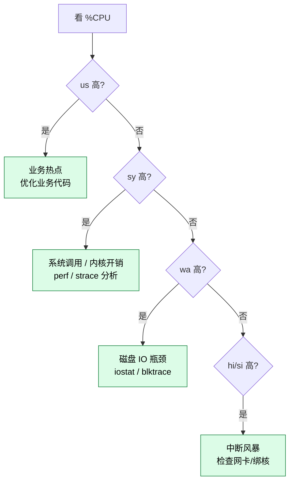

#### 第四、五行:内存与 swap

```
MiB Mem :  64213.4 total,  12345.6 free,  23456.7 used,  28411.1 buff/cache
MiB Swap:   2048.0 total,   2048.0 free,      0.0 used.  38756.7 avail Mem
```

**注意**:

- `buff/cache` 是**可回收**的(系统主动用),**不是真占用**
- `avail Mem` 才是**实际可用内存**
- `Swap used > 0` → ⚠️ 性能问题

#### 第六行起:进程表

```
  PID USER      PR  NI    VIRT    RES   SHR S  %CPU  %MEM     TIME+ COMMAND
 1234 postgres  20   0  8.2g   1.2g  320m R  45.3   1.9   5:23.45 postgres
 5678 mysql     20   0 16.0g   4.0g  640m S  20.1   6.2   2:01.23 mysqld
```

| 列 | 含义 | 关注点 |
|----|------|--------|
| `PID` | 进程 ID | - |
| `USER` | 用户 | 权限 |
| `PR` | 优先级 | - |
| `NI` | Nice 值(影响优先级) | - |
| `VIRT` | 虚拟内存 | ⚠️ 经常很大,**参考价值低** |
| `RES` | 常驻内存(实际占用) | **关键** |
| `SHR` | 共享内存 | - |
| `S` | 进程状态 | **R / S / D / Z 等** |
| `%CPU` | CPU 占用 | **核心** |
| `%MEM` | 物理内存占比 | - |
| `TIME+` | 累计 CPU 时间 | 长期占用 |
| `COMMAND` | 命令 | - |

**进程状态字母含义**:

| 状态 | 含义 | 性能影响 |
|------|------|---------|
| `R` Running | 正在跑 | 正常 |
| `S` Sleeping | 可中断睡眠 | 正常 |
| `D` Uninterruptible sleep | **不可中断** | ⚠️ **往往是 IO 瓶颈** |
| `T` Stopped | 被信号停止 | - |
| `Z` Zombie | 僵尸进程 | ⚠️ 需要排查 |
| `I` Idle | 内核空闲线程 | 正常 |

### 5.3 关键快捷键

| 快捷键 | 功能 |
|--------|------|
| `1` | **显示每个 CPU 核的负载**(关键!) |
| `H` | 显示所有线程(top -H 等价) |
| `P` | 按 %CPU 排序(默认) |
| `M` | 按 %MEM 排序 |
| `T` | 按 TIME+ 排序 |
| `c` | 显示完整命令行 |
| `y` | **高亮 running 进程** |
| `x` | **高亮排序列** |
| `b` | 切换粗体 |
| `k` | kill 进程(输入 PID) |
| `r` | renice 进程 |
| `W` | 保存配置到 ~/.toprc |
| `E` | 切换内存单位(KiB/MiB/GiB) |
| `e` | 同上,任务列表 |
| `i` | 只显示活跃进程 |
| `n` | 设置显示进程数 |
| `?` | 帮助 |

### 5.4 top + taskset 联动

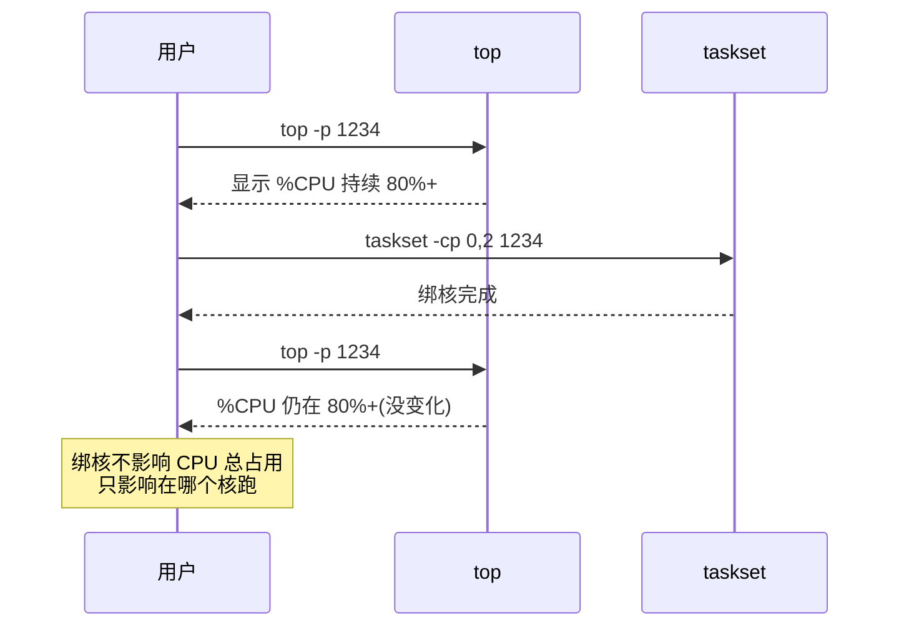

**重要观察**:`taskset` 不会改变 %CPU,**只改变 CPU 分配**。如果想降低 %,需要降负载。

---

## 六、实战案例

### 6.1 PostgreSQL 服务器绑核

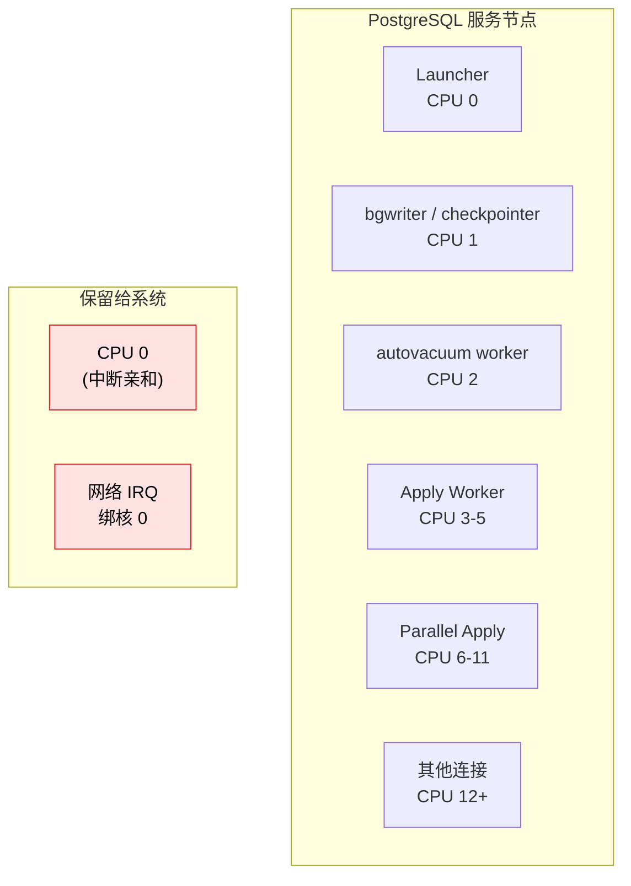

**原则**:

1. **CPU 0 保留给系统中断**(Linux 默认 CPU 0 处理所有中断)
2. **PG 后台进程绑专用核**(不要让它们和 user 连接抢)
3. **PG user 连接绑一个核池**(太多会互相挤)

```bash
# 查看 PG 进程的 affinity
ps -eo pid,psr,comm | grep postgres

# 给 bgwriter 绑核
BGWRITER_PID=$(pgrep -f 'bgwriter')
taskset -p -c 1 $BGWRITER_PID

# 给 checkpointer 绑核
CHECKPOINT_PID=$(pgrep -f 'checkpointer')
taskset -p -c 1 $CHECKPOINT_PID
```

### 6.2 Redis 绑核

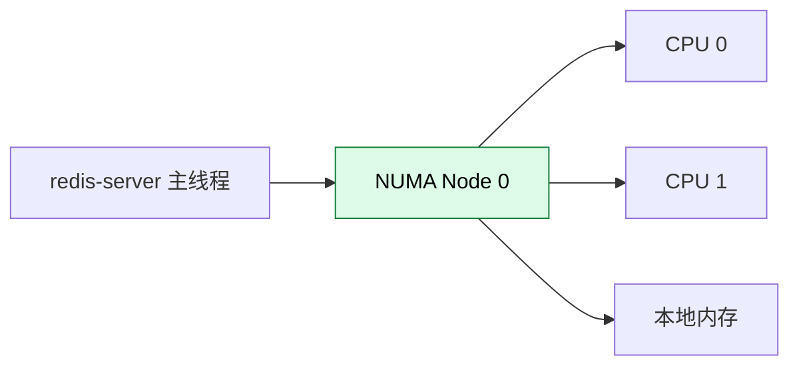

```bash
# Redis 绑 NUMA node 0
numactl --cpunodebind=0 --membind=0 redis-server /etc/redis.conf
```

### 6.3 计算密集型服务(矩阵运算)

```bash
# 启动时绑到空闲核
nohup taskset -c 8-15 ./matrix_compute &

# 实时监控
watch -n 1 "ps -p $! -o pid,psr,%cpu,%mem,cmd"
```

### 6.4 高频交易系统

```bash
# 关键进程绑专用核 + 最高优先级
taskset -c 2,3 chrt -f 99 ./trading_engine

# chrt 设置 SCHED_FIFO 实时调度
# 注意:需要 root
```

---

## 七、避坑清单

### 7.1 不要绑 CPU 0

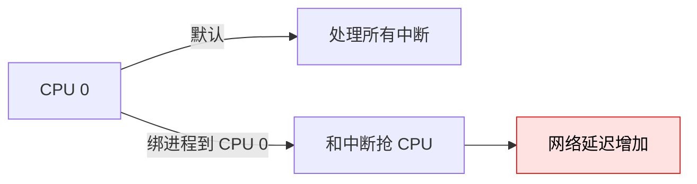

**解决方案**:
- 中断亲和绑 CPU 0
- 应用绑 CPU 1+
- 或者用 `isolcpus` 内核参数隔离 CPU

### 7.2 不要绑太少核

```bash
# 错误:只绑 1 个核
taskset -c 0 ./multi_thread_app
# 多线程应用只能跑 1 个核 → 浪费多线程

# 正确:绑一组连续核
taskset -c 0-7 ./multi_thread_app
```

### 7.3 不要绑太多核


### 7.4 不要忘了 NUMA

```bash
# 错误:只绑 CPU 但不绑内存
taskset -c 4-7 ./big_memory_app
# CPU 在 node 0,内存可能在 node 1
# 跨节点访问慢 30-100%

# 正确:用 numactl
numactl --cpunodebind=0 --membind=0 ./big_memory_app
```

### 7.5 不要忽视容器场景

```bash
# docker run 默认会用 cgroup cpuset
docker run --cpuset-cpus="0,2" myapp

# K8s 用 limit/requests
resources:
  limits:
    cpu: "4"
```

### 7.6 不要绑核后就高枕无忧

```bash
# 绑核 + 监控必须同时进行
while true; do
  taskset -cp $(pgrep -f myapp)
  sleep 60
done
```

---

## 八、进阶话题

### 8.1 内核参数 `isolcpus`

启动时把某些核隔离,只给指定进程用:

```bash
# /etc/default/grub
GRUB_CMDLINE_LINUX="isolcpus=4,5,6,7"

# 这些核只跑你指定的进程(其他进程被排除)
# 适合实时系统
```

### 8.2 IRQ 中断亲和

```bash
# 查看中断的 CPU 分布
cat /proc/interrupts | head

# 把网卡中断绑到 CPU 0
echo 0 > /proc/irq/32/smp_affinity
# 32 是网卡 IRQ 号
```

### 8.3 cgroup v2 unified

现代 Linux 默认 cgroup v2:

```bash
# 单 hierarchy
mount | grep cgroup
# 输出:/sys/fs/cgroup cgroup2 cgroup2 rw,nosuid,nodev,...

# 配置
echo "+cpu+memory" > /sys/fs/cgroup/cgroup.subtree_control
echo "0-3" > /sys/fs/cgroup/my_app/cpuset.cpus
```

### 8.4 perf + sched

确认绑核是否生效,以及有没有线程跨核迁移:

```bash
# 监控调度事件
perf sched record -p $(pgrep myapp) sleep 10
perf sched latency -p $(pgrep myapp)
perf sched timehist -p $(pgrep myapp) --state=migrated
# 看是不是有大量"migrated"事件
```

---

## 九、命令速查

### 9.1 绑核命令

```bash
# taskset
taskset -cp <pid>                       # 查看
taskset -p -c 0,2 <pid>                 # 设置
taskset -c 0-3 ./command                # 启动时绑

# numactl
numactl --hardware                      # 查看拓扑
numactl --cpunodebind=0 ./command       # NUMA 绑
numactl --membind=0 ./command

# cpuset
echo 0-3 > /sys/fs/cgroup/cpuset/my/cpuset.cpus
echo <pid> > /sys/fs/cgroup/cpuset/my/tasks

# systemd
systemctl set-property myapp.service CPUAffinity="0 2 4 6"
```

### 9.2 top 命令

```bash
top                    # 启动
top -p <pid>           # 单进程
top -H -p <pid>        # 看线程
top -c                 # 完整命令
top -b -n 1            # 批模式 1 次

# 快捷键
1                      # 每核视图
H                      # 线程视图
P / M / T              # 排序
y x                    # 高亮
W                      # 保存配置
```

### 9.3 综合诊断脚本

```bash
#!/bin/bash
# bind_cpu_diag.sh
PID=${1:-$$}

echo "=== 进程亲和性 ==="
taskset -cp $PID

echo
echo "=== NUMA 拓扑 ==="
numactl --hardware 2>/dev/null || echo "numactl 未安装"

echo
echo "=== 当前 CPU 负载 ==="
top -bn1 | head -20

echo
echo "=== 进程是否跨核迁移 ==="
perf sched record -p $PID sleep 5
perf sched timehist -p $PID --state=migrated | head
```

---

## 十、参考

- Linux man page: `man taskset`、`man numactl`、`man sched_setaffinity`、`man cgroups`
- Linux 内核文档:`Documentation/admin-guide/cgroup-v1/cpusets.rst`
- [util-linux 源码](https://github.com/util-linux/util-linux)
- [numactl 源码](https://github.com/numactl/numactl)
- [Red Hat Performance Tuning Guide - CPU](https://access.redhat.com/documentation/en-us/red_hat_enterprise_linux/9/html/monitoring_and_managing_system_status_and_performance/index)
