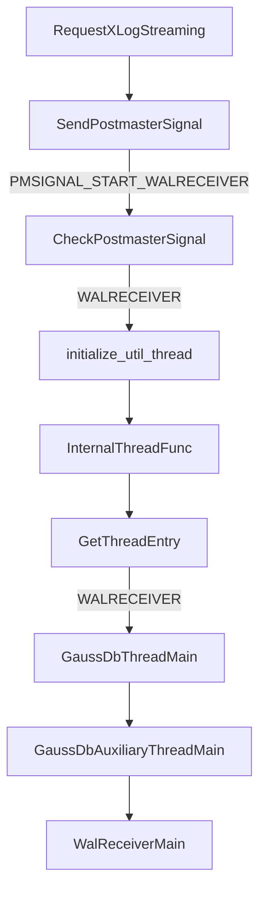
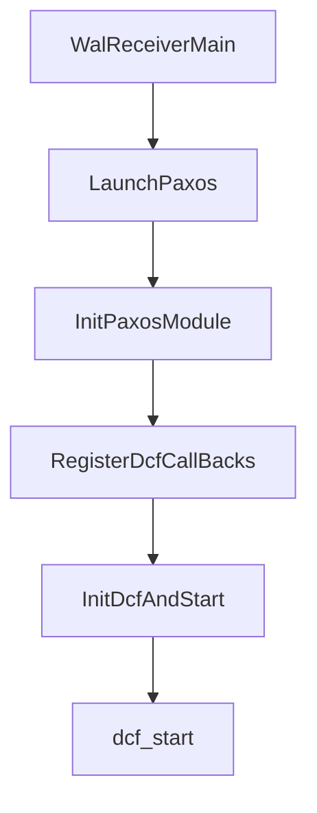
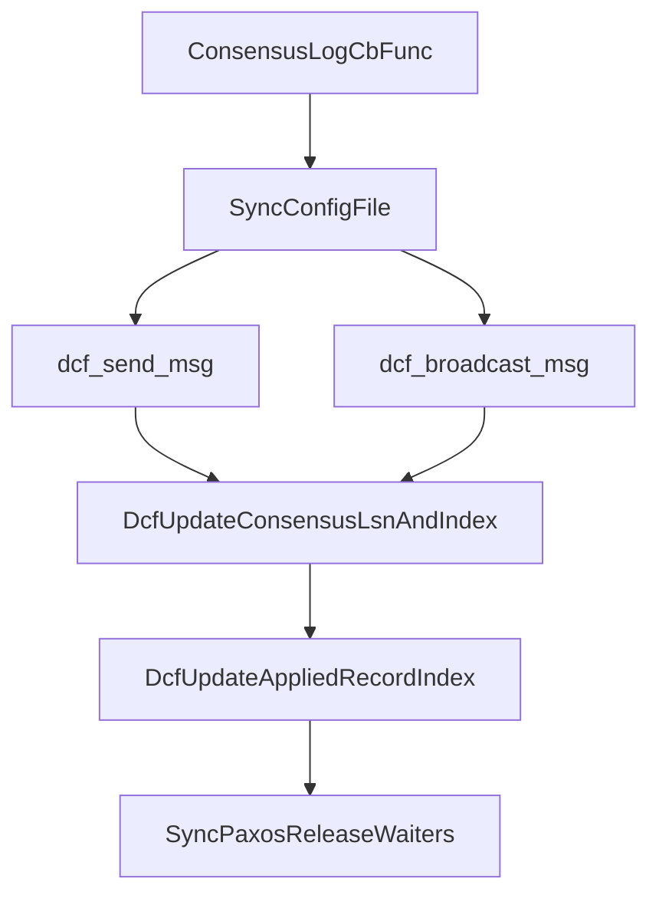
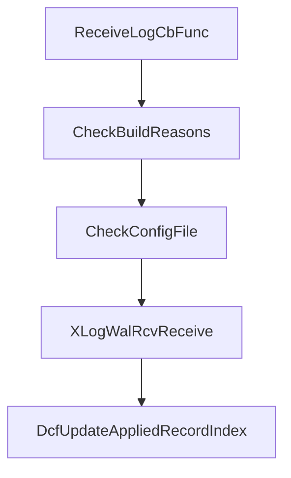
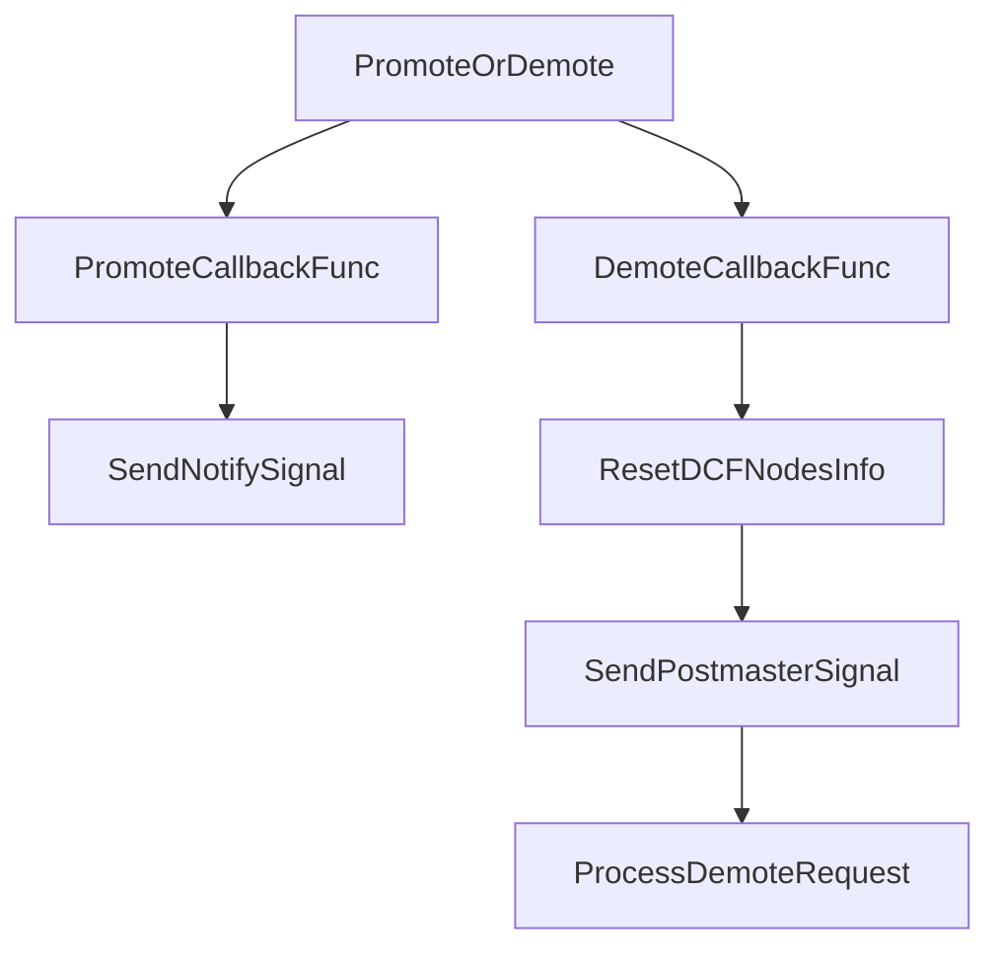
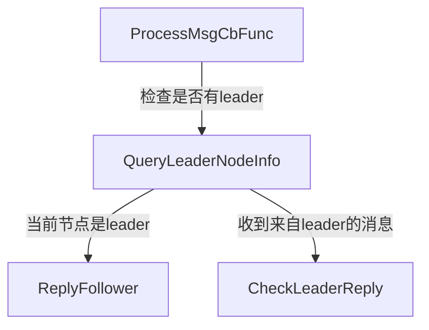
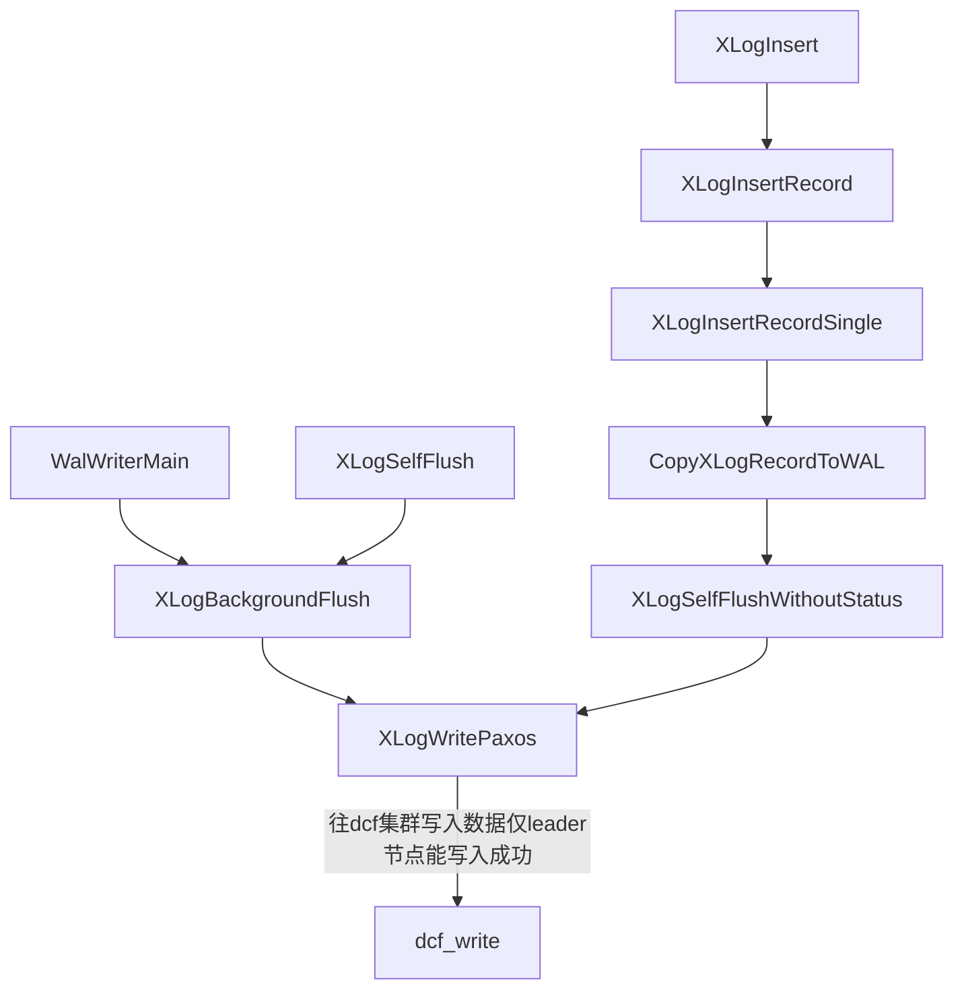

# openguass dcf启动详解

- 先启动walreceiver



- 启动walreceiver后，再启动dcf



## openguass dcf主要处理逻辑

### 接收

dcf收到消息处理函数如下：

```c
static bool RegisterDcfCallBacks()
{
    if (dcf_register_after_writer(ConsensusLogCbFunc) != 0) {
        ereport(WARNING, (errmsg("Failed to register ConsensusLogCbFunc.")));
        return false;
    }
    if (dcf_register_consensus_notify(ReceiveLogCbFunc) != 0) {
        ereport(WARNING, (errmsg("Failed to register ReceiveLogCbFunc.")));
        return false;
    }
    if (dcf_register_status_notify(PromoteOrDemote) != 0) {
        ereport(WARNING, (errmsg("Failed to register PromoteOrDemote.")));
        return false;
    }
    if (dcf_register_exception_report(DCFExceptionCbFunc) != 0) {
        ereport(WARNING, (errmsg("Failed to register DCFExceptionCbFunc.")));
        return false;
    }
    if (dcf_register_election_notify(ElectionCbFunc) != 0) {
        ereport(WARNING, (errmsg("Failed to register ElectionCbFunc.")));
        return false;
    }
    if (dcf_register_msg_proc(ProcessMsgCbFunc) != 0) {
        ereport(WARNING, (errmsg("Failed to register ProcessMsgCbFunc.")));
        return false;
    }
    if (dcf_register_thread_memctx_init(DcfThreadShmemInit) != 0) {
        ereport(WARNING, (errmsg("Failed to register DcfThreadShmemInit.")));
        return false;
    }
    return true;
}
```

其中根据是否属于paxos消息通信又分为两类：

- 集群间消息
  
  集群信息是集群内的通信消息，某一节点发出其他节点均需要处理。
  
  - dcf_register_after_writer(ConsensusLogCbFunc)
    
    注册leader节点写入数据成功的回调函数（仅leader节点会触发该回调）



- dcf_register_consensus_notify(ReceiveLogCbFunc)
  
  follower节点写入数据成功的回调函数（仅follower节点会触发回调）



- dcf_register_status_notify(PromoteOrDemote)
  
  节点角色变化的回调函数（只有当本节点变为leader会收到该回调）



- dcf_register_election_notify(ElectionCbFunc)
  
  选举leader变化的回调函数.

- 节点间消息
  
  节点间消息为1对1消息，为普通tcp通信，为某一节点明确分为某一节点的消息。
  
  - dcf_register_msg_proc(ProcessMsgCbFunc)
    
    节点收到另一个节点发来的消息的回调函数



### 发送消息

发送消息同样分为集群间消息和节点间消息。

集群间消息所有节点都会收到并处理，节点间消息为一对一的tcp通信。

- 集群间消息发送
  
  - XLogWritePaxos



- 节点间消息发送
  
  - DCFSendMsg
